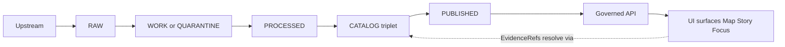
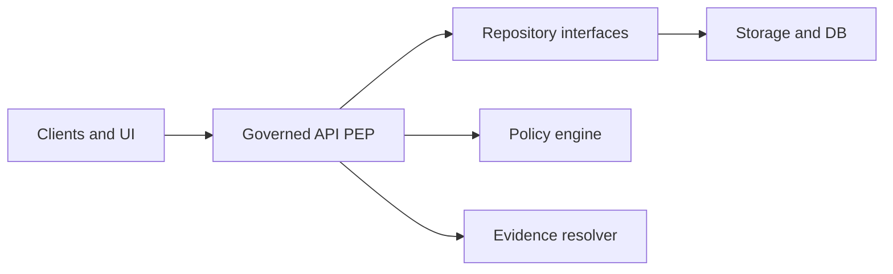

<!-- [KFM_META_BLOCK_V2]
doc_id: kfm://doc/1f731fb8-1614-4a01-a1a5-f8e5ed39c7e1
title: docs/ — Documentation hub
type: standard
version: v1
status: draft
owners: TBD
created: 2026-03-03
updated: 2026-03-03
policy_label: public
related:
  - docs/MASTER_GUIDE_v13.md
  - docs/governance/ROOT_GOVERNANCE.md
tags: [kfm, docs]
notes:
  - Entry point for repository documentation.
  - Links and directory map may contain TODOs until the repo structure is verified in this repo checkout.
[/KFM_META_BLOCK_V2] -->

<a id="top"></a>

# docs/ — Documentation Hub
**Human-readable, governed documentation for the Kansas Frontier Matrix (KFM).**

> **[Confirmed] Purpose:** `docs/` is the home for **governed, human-readable documentation** (guides, runbooks, ADRs, standards, diagrams, templates) that explains how KFM works and how to change it safely.

---

## IMPACT
- **Status:** draft  
- **Owners:** TBD (set via `CODEOWNERS` / governance)
- **Policy label:** public
- **[Confirmed] Non-negotiables this hub must reflect:** **truth path lifecycle** + **trust membrane** + **catalog triplet** + **cite-or-abstain**. (See: [Where docs fit](#where-docs-fit-truth-path--trust-membrane))
- **[Confirmed] Hard exclusions:** secrets, raw datasets/binaries, and unreviewed sensitive details (especially precise vulnerable locations).

[](./README.md)
[](#impact)
[](#metablock-v2-and-document-metadata)
[](#review-gates-for-docs)
[](#local-preview--checks)

**Quick links:** [Start here](#start-here) · [Directory map](#directory-map) · [MetaBlock v2](#metablock-v2-and-document-metadata) · [Gates](#review-gates-for-docs) · [Add a doc](#how-to-add-a-new-doc) · [Unknowns](#unknowns-to-verify)

---

## Quick navigation
- [Start here](#start-here)
- [Evidence legend](#evidence-legend-required)
- [Where docs fit: truth path & trust membrane](#where-docs-fit-truth-path--trust-membrane)
- [What belongs in docs](#what-belongs-in-docs)
- [What must NOT go in docs](#what-must-not-go-in-docs)
- [Directory map](#directory-map)
- [Docs taxonomy](#docs-taxonomy-what-goes-where)
- [MetaBlock v2 and document metadata](#metablock-v2-and-document-metadata)
- [Authoring rules](#authoring-rules)
- [Review gates for docs](#review-gates-for-docs)
- [How to add a new doc](#how-to-add-a-new-doc)
- [Local preview / checks](#local-preview--checks)
- [Unknowns to verify](#unknowns-to-verify)

---

## Evidence legend (required)
- **[Confirmed]** = grounded in KFM requirements/docs and treated as an invariant or enforced gate.
- **[Proposed]** = recommended pattern; may not yet be implemented in this repo checkout.
- **[Unknown]** = not verified in this repo checkout; see [Unknowns to verify](#unknowns-to-verify) for the smallest verification steps.

> **[Confirmed] Rule:** If you can’t ground it, mark it **[Unknown]** and list the smallest verification step.

---

## Start here
- **[Proposed]** Read the canonical “master” guide if present: `docs/MASTER_GUIDE_v13.md`.
- **[Proposed]** For governance/policy changes, start at: `docs/governance/ROOT_GOVERNANCE.md`.
- **[Proposed]** For system structure changes, start at: `docs/architecture/`.
- **[Proposed]** For promotion/quality mechanics, start at: `docs/quality/` (or equivalent).

> **[Unknown]** If any of these paths do not exist in your checkout, keep this README as the index and update links to match the verified tree.

---

## Where docs fit: truth path & trust membrane

### Truth path (data lifecycle) — what docs must not contradict
**[Confirmed]** KFM uses an auditable lifecycle (the “truth path”) with gates at each transition:


```mermaid
flowchart LR
  Up[Upstream] --> RAW[RAW]
  RAW --> WORK[WORK or QUARANTINE]
  WORK --> PROC[PROCESSED]
  PROC --> CAT[CATALOG triplet]
  CAT --> PUB[PUBLISHED]

  PUB --> API[Governed API]
  API --> UI[UI surfaces Map Story Focus]

  UI -. EvidenceRefs resolve via .-> CAT
```

- **[Confirmed]** RAW is immutable acquisition + checksums (append-only).
- **[Confirmed]** WORK/QUARANTINE is where QA and redaction/generalization candidates happen.
- **[Confirmed]** PROCESSED contains publishable artifacts + checksums.
- **[Confirmed]** CATALOG is the cross-linked **DCAT + STAC + PROV** “triplet” (and receipts/lineage).
- **[Confirmed]** PUBLISHED surfaces (API/UI) may only serve promoted versions that passed gates.

### Trust membrane — what docs must explicitly protect
**[Confirmed]** The trust membrane is the policy/provenance boundary:


```mermaid
flowchart LR
  C[Clients and UI] --> PEP[Governed API PEP]
  PEP --> REPO[Repository interfaces]
  REPO --> S[Storage and DB]
  PEP --> PDP[Policy engine]
  PEP --> ER[Evidence resolver]
```

- **[Confirmed]** Clients never access DB/object storage directly.
- **[Confirmed]** Core backend logic must not bypass repository interfaces to reach storage directly.
- **[Confirmed]** All access is evaluated by policy at the PEP; evidence resolution is policy-aware.

> **[Confirmed] Doc rule:** If a doc proposes a shortcut that breaks the trust membrane, it is wrong by definition.

---

## What belongs in docs/
- **[Confirmed]** Architecture docs: blueprints, diagrams, interface boundaries, contracts (human-readable).
- **[Confirmed]** Governance docs: policy intent, review workflow, sensitivity/risk handling (non-secret).
- **[Confirmed]** ADRs: decisions + rationale + consequences + rollback.
- **[Confirmed]** Runbooks: operate, troubleshoot, recover.
- **[Confirmed]** Standards/profiles: conventions and required fields (DCAT/STAC/PROV expectations, doc conventions).
- **[Proposed]** Templates: MetaBlock v2 doc template, ADR template, Story Node template, runbook template.

---

## What must NOT go in docs/
- **[Confirmed]** Secrets (API keys, tokens, credentials) — never.
- **[Confirmed]** Raw datasets or large binary artifacts that belong in lifecycle zones (`data/raw`, etc.) or release bundles.
- **[Confirmed]** Unreviewed sensitive details (e.g., precise vulnerable locations). If unsure: redact/generalize and route for governance review.
- **[Proposed]** Generated build outputs (unless explicitly approved as versioned, attestable release artifacts).

---

## Directory map

### Confirmed top-level context (do not over-claim)
**[Confirmed]** KFM’s intended top-level layout separates docs, contracts, policy, data, apps/packages, tools, and tests.  
**[Unknown]** The exact realized tree in *this checkout* must be verified before claiming subdirectories exist.

### docs/ directory layout (recommended — verify in repo)
> **[Proposed]** This is a buildable, retrieval-friendly docs layout. Rename to match what you actually have.

```text
docs/
  README.md                      # This file (docs hub)

  MASTER_GUIDE_v13.md            # Canonical overview + doc map (if present)
  glossary.md                    # Domain vocabulary (if present)

  architecture/                  # Blueprints + diagrams + subsystem contracts
    README.md

  governance/                    # Governance charter, review workflow, sensitivity posture
    ROOT_GOVERNANCE.md
    REVIEW_GATES.md
    ETHICS.md
    SOVEREIGNTY.md

  standards/                     # Standards/profiles (DCAT/STAC/PROV), doc protocol, vocab
    README.md
    KFM_MARKDOWN_WORK_PROTOCOL.md
    KFM_DCAT_PROFILE.md
    KFM_STAC_PROFILE.md
    KFM_PROV_PROFILE.md

  adr/                           # Architecture Decision Records
    README.md
    0001-example-adr.md

  runbooks/                      # Operator runbooks and recovery guides
    README.md

  quality/                       # Promotion gates, checklists, QA profiles, receipt examples
    README.md
    profiles/
    checklists/
    examples/

  security/                      # Threat models, supply-chain standards, secure operations
    README.md

  templates/                     # Doc templates (universal doc, ADR, story node, runbook)
    README.md

  research/                      # Source summaries and research notes (non-canonical)
    README.md

  data/                          # Docs *about* data domains (NOT datasets themselves)
    README.md
    soils/
    air-quality/
    historical/
```

---

## Docs taxonomy (what goes where)

**[Proposed]** Use this as the “routing table” when adding a new document:

| Doc type | Suggested location | When to use | Required evidence surfaces |
|---|---|---|---|
| Guide | `docs/` or `docs/guides/` | How-to, onboarding, system walkthroughs | MetaBlock v2; links to authoritative docs/contracts |
| Standard/Profile | `docs/standards/` | Required conventions, schemas, field lists | MetaBlock v2; reference to contracts/policy tests |
| ADR | `docs/adr/` | A decision that affects architecture, policy, or operations | MetaBlock v2; decision + alternatives + consequences |
| Runbook | `docs/runbooks/` | Operate/restore/triage and on-call procedures | MetaBlock v2; links to dashboards/logs/tests |
| Template | `docs/templates/` | A form used to create governed artifacts | MetaBlock v2; “how to use” section |
| Research note | `docs/research/` | Exploration and background that is not authoritative | MetaBlock v2; mark clearly as non-canonical |

---

## MetaBlock v2 and document metadata
**[Confirmed]** KFM uses **MetaBlock v2** (HTML comment) for docs, Story Nodes, and dataset specs.

### Minimal MetaBlock v2 template
```html
<!-- [KFM_META_BLOCK_V2]
doc_id: kfm://doc/<uuid>
title: <Title>
type: <guide|standard|story|dataset_spec|adr|run_receipt>
version: v1
status: draft|review|published
owners: <team or names>
created: YYYY-MM-DD
updated: YYYY-MM-DD
policy_label: public|restricted|...
related:
  - kfm://dataset/<slug>@<version>
  - kfm://story/<id>@<version>
tags:
  - kfm
notes:
  - <short notes>
[/KFM_META_BLOCK_V2] -->
```

### MetaBlock rules
- **[Confirmed]** `doc_id` is stable — do not regenerate on edits.
- **[Confirmed]** bump `updated:` on meaningful edits.
- **[Confirmed]** `policy_label` is a governance input (especially if docs are served through governed APIs).

---

## Authoring rules
- **[Confirmed]** Docs are a **production surface**: they must remain reviewable, stable, and consistent with enforced policy.
- **[Confirmed]** Use “cite-or-abstain” language in specs/runbooks: if a process requires evidence artifacts (catalogs, receipts, policies), link to them or mark the requirement as **[Unknown]**.
- **[Proposed]** Keep docs LLM-ingestible: short paragraphs, explicit terms, stable headings, runnable snippets.

### ADR minimum checklist (for `docs/adr/`)
- **[Proposed]** Problem statement
- **[Proposed]** Decision
- **[Proposed]** Alternatives considered
- **[Proposed]** Consequences
- **[Proposed]** Policy impact (what changes at the trust membrane)
- **[Proposed]** Rollback plan (if operationally significant)

---

## Review gates for docs

> **[Confirmed]** KFM governance is “fail-closed”: if required evidence is missing, promotion/publishing is blocked.

### Gate expectations (docs-focused subset)
- **[Confirmed] Structure & Metadata:** correct location + MetaBlock v2 present/valid.
- **[Confirmed] Policy & Sensitivity:** no sensitive leakage; `policy_label` used consistently.
- **[Proposed] Link checking:** internal links resolve (or are explicitly marked TODO).
- **[Proposed] Change control:** CODEOWNERS / stewards approve governance-impacting docs.

### Docs change checklist (copy/paste)
- [ ] **[Confirmed]** MetaBlock v2 added/updated (`updated:` bumped)
- [ ] **[Confirmed]** No secrets / no sensitive location leakage
- [ ] **[Proposed]** Links validated (or TODOs are explicit and tracked)
- [ ] **[Proposed]** If doc changes policy behavior, an ADR exists and governance owners approved
- [ ] **[Proposed]** If doc references datasets/schemas/policies, referenced IDs/paths exist (or are tracked)

---

## How to add a new doc
1) **[Proposed]** Choose the smallest appropriate home (architecture vs governance vs runbook vs standard vs ADR).
2) **[Confirmed]** Add a MetaBlock v2 at the top.
3) **[Proposed]** Prefer a template from `docs/templates/` if available.
4) **[Proposed]** Update the nearest README index (and this hub if needed).
5) **[Proposed]** Run local checks (or the closest equivalent CI job).
6) **[Proposed]** Route to appropriate reviewers (CODEOWNERS + governance if trust membrane / policy changes).

---

## Local preview / checks

### Minimal, repo-agnostic checks (runnable)
```bash
# list docs files
find docs -maxdepth 3 -type f | sort | sed -n '1,120p'

# confirm MetaBlock presence (at least once per doc, by convention)
grep -R --line-number --fixed-string "[KFM_META_BLOCK_V2]" docs | head -n 50
```

### Optional repo-specific checks
> **[Unknown]** Whether your repo defines `make docs.check`, `make linkcheck`, or a CI-equivalent target.

```bash
# pseudocode: rename to match your repo targets
make docs.check
make linkcheck
```

---

## Unknowns to verify
These are **[Unknown]** until verified in your current checkout:

1) Do `docs/governance/ROOT_GOVERNANCE.md` and `docs/MASTER_GUIDE_v13.md` exist?
   - Smallest verification step: `ls docs/governance docs | grep -E "ROOT_GOVERNANCE|MASTER_GUIDE"`.

2) Are MetaBlock checks enforced in CI?
   - Smallest verification step: search CI workflows for `MetaBlock` / `check_structure` / `linkcheck`.

3) What is the canonical docs owner group?
   - Smallest verification step: check `.github/CODEOWNERS` and set `owners:` in this file’s MetaBlock.

4) Which docs are “authoritative” vs “background research”?
   - Smallest verification step: define (and link) a short policy in governance docs listing authoritative doc classes.

---

## FAQ
**Q: Can I put screenshots, PDFs, or large datasets in `docs/`?**  
**A:** **[Confirmed]** Not as a substitute for governed data artifacts. Small illustrative images are fine; large artifacts belong in data lifecycle zones or releases.

**Q: What if I’m unsure whether something is sensitive?**  
**A:** **[Confirmed]** Redact/generalize, mark “needs governance review,” and do not publish precise locations until policy explicitly allows.

**Q: Should I write “Confirmed” statements about the repo structure?**  
**A:** **[Confirmed]** Only if verified in the current checkout. Otherwise mark as **[Unknown]** and list the smallest verification step.

---

<details>
  <summary>Appendix: Suggested templates to add under <code>docs/templates/</code> (Proposed)</summary>

- **Universal doc template** (MetaBlock v2 + required sections)
- **ADR template** (problem/decision/alternatives/consequences/policy impact/rollback)
- **Runbook template** (symptoms → checks → mitigations → rollback → recovery verification)
- **Story Node template** (claim → citations → map state → policy label → review status)

</details>

---

### Back to top
⬆️ <a href="#top">Back to top</a>
