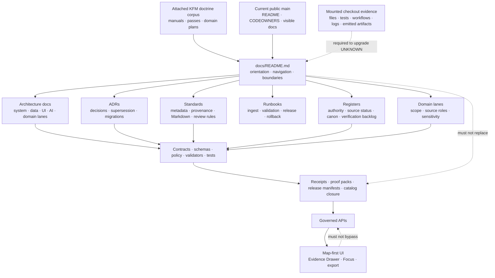

<!-- [KFM_META_BLOCK_V2]
doc_id: kfm://doc/NEEDS-VERIFICATION
title: docs
type: standard
version: v1
status: draft
owners: @bartytime4life
created: NEEDS_VERIFICATION
updated: 2026-04-26
policy_label: NEEDS_VERIFICATION
related: [../README.md, ../.github/CODEOWNERS, ../.github/workflows/README.md, ./standards/README.md, ./runbooks/repository-next-steps.md, ../contracts/README.md, ../schemas/README.md, ../schemas/contracts/README.md, ../schemas/contracts/v1/README.md, ../policy/README.md, ../tests/README.md, ../tools/ci/README.md]
tags: [kfm, docs, documentation, governance, evidence, readme]
notes: [Owner is grounded in current public .github/CODEOWNERS fallback ownership for /docs/ and docs/README.md; doc_id, created date, and internal policy_label still need repository-backed verification; this revision preserves the existing documentation-hub purpose while adding the required KFM Meta Block V2, stronger repo-fit links, and a clearer public-main-versus-mounted-checkout evidence boundary.]
[/KFM_META_BLOCK_V2] -->

<a id="top"></a>

# KFM Documentation Hub

A governed entry point for documentation that explains, preserves, and verifies Kansas Frontier Matrix doctrine without turning docs into unreviewed implementation claims.


> [!IMPORTANT]
> **Impact block**  
> **Status:** `experimental` while mounted-checkout parity, internal policy label, doc registry coverage, workflow enforcement, and adjacent README conventions remain under verification.  
> **Owners:** `@bartytime4life` under current broad CODEOWNERS fallback for `/docs/`; narrower documentation steward teams remain `PROPOSED` until created and enforced.  
> **Path:** `docs/README.md`  
> **Authority class:** documentation control-plane landing page; not a schema, not policy law, not release evidence, not runtime proof.  
> **Quick jumps:** [Scope](#scope) · [Repo fit](#repo-fit) · [Inputs](#inputs) · [Exclusions](#exclusions) · [Directory map](#directory-map) · [Quickstart](#quickstart) · [Usage](#usage) · [Diagram](#diagram) · [Operating tables](#operating-tables) · [Task list](#task-list--definition-of-done) · [FAQ](#faq) · [Appendix](#appendix)

> [!WARNING]
> **Evidence boundary for this revision:** current public `main` exposes a real repository and this `docs/README.md` target, but the drafting workspace did **not** contain a mounted local KFM Git checkout. Treat branch-local parity, platform settings, workflow enforcement, emitted proof objects, runtime behavior, and exact link health as `NEEDS VERIFICATION` until confirmed in the active checkout.

---

## Scope

`docs/` is the human-facing documentation control plane for Kansas Frontier Matrix (KFM).

It should help maintainers answer four questions without guessing:

1. **What is KFM allowed to claim?**
2. **What evidence, policy, review, and release state backs that claim?**
3. **Which docs describe intended doctrine, and which repo artifacts prove current behavior?**
4. **What must be validated before a source, layer, model output, story, export, or public release is trusted?**

KFM documentation is not decorative prose. It records doctrine, decisions, boundaries, source status, proof obligations, known unknowns, and rollback/correction paths.

### Current posture

| Area | Status | Meaning |
|---|---:|---|
| KFM doctrine | `CONFIRMED` | KFM is governed, evidence-first, map-first, time-aware, and publication-aware. |
| `docs/README.md` target | `CONFIRMED` | The target file exists on current public `main`; this revision should replace or update it in place. |
| `/docs/` owner fallback | `CONFIRMED` | Current CODEOWNERS routes `/docs/` and `docs/README.md` to `@bartytime4life`. |
| Mounted local checkout | `UNKNOWN` | No mounted repo was available in this drafting workspace. |
| Workflow enforcement and branch protections | `NEEDS VERIFICATION` | Checked-in docs and workflow YAML do not prove repository settings. |
| File homes beyond confirmed public paths | `CONFIRMED` / `PROPOSED` / `NEEDS VERIFICATION` | Use the directory map labels below; do not infer maturity from path names alone. |

[Back to top](#top)

---

## Repo fit

| Relationship | Target | Status | Notes |
|---|---|---:|---|
| This file | [`docs/README.md`](./README.md) | `CONFIRMED` | Landing page for the documentation directory. |
| Upstream landing | [`../README.md`](../README.md) | `CONFIRMED` | Root orientation, baseline verification pointers, and immediate execution-plan routing. |
| Ownership routing | [`../.github/CODEOWNERS`](../.github/CODEOWNERS) | `CONFIRMED` | Broad fallback owner for `/docs/`; narrower teams are future work. |
| Workflow documentation | [`../.github/workflows/README.md`](../.github/workflows/README.md) | `NEEDS VERIFICATION` | Documents workflow intent; actual enforcement must be checked against YAML and repository settings. |
| Standards lane | [`./standards/README.md`](./standards/README.md) | `CONFIRMED` | Cross-cutting standards, profiles, documentation protocols, and lane-local standard boundaries. |
| Runbook priority lane | [`./runbooks/repository-next-steps.md`](./runbooks/repository-next-steps.md) | `CONFIRMED` from root routing; link health still should be checked | Immediate execution plan and next-step planning. |
| Machine contract docs | [`../contracts/README.md`](../contracts/README.md) | `CONFIRMED` | Human-readable contract guidance; do not duplicate machine meaning here. |
| Schema docs | [`../schemas/README.md`](../schemas/README.md) · [`../schemas/contracts/README.md`](../schemas/contracts/README.md) · [`../schemas/contracts/v1/README.md`](../schemas/contracts/v1/README.md) | `CONFIRMED` | Versioned schema/contract lane is visible; schema-home authority must stay explicit. |
| Policy docs | [`../policy/README.md`](../policy/README.md) | `CONFIRMED` | Deny-by-default posture, obligations, release/sensitivity policy, and policy tests belong outside `docs/`. |
| Verification docs | [`../tests/README.md`](../tests/README.md) | `CONFIRMED` | Tests and fixtures provide executable verification, not just narrative confidence. |
| CI tooling | [`../tools/ci/README.md`](../tools/ci/README.md) | `NEEDS VERIFICATION` | Root README names CI tooling; inspect before relying on specific commands. |
| Data lifecycle | [`../data/README.md`](../data/README.md) | `NEEDS VERIFICATION` | Data lifecycle, receipts, proofs, catalogs, and publication artifacts belong outside `docs/`. |

> [!CAUTION]
> Link presence is not enforcement proof. A checked-in README can document a target path, but branch protection, required checks, Actions permissions, deployment approvals, secrets, emitted artifacts, and runtime behavior require direct inspection.

[Back to top](#top)

---

## Inputs

Documentation belongs in `docs/` when it improves governability, reviewability, traceability, implementation discipline, or user comprehension.

| Accepted input | Belongs here when… | Required posture |
|---|---|---|
| Architecture docs | They explain durable boundaries, object families, lifecycle, subsystem responsibilities, or trust membranes. | Separate doctrine from implementation evidence. |
| ADRs | A decision changes file homes, trust boundaries, schemas, policy, release behavior, public surfaces, or exposure posture. | Include alternatives, consequences, validation, rollback, and truth posture. |
| Standards | The repo needs repeatable rules for Markdown, metadata, source status, truth labels, contracts, profiles, or release artifacts. | Keep rules checkable and route machine validation to contracts, schemas, policy, tests, or tools. |
| Domain lane docs | A lane such as hydrology, habitat, fauna, flora, soil, archaeology, geology, atmosphere, roads/transport, settlements, agriculture, hazards, or people/land needs governed scope. | Preserve lane-specific burden, sensitivity, source roles, and public-release posture. |
| Source and document registers | A source, packet, dataset, external standard, or document needs authority, status, caveats, lineage, or supersession recorded. | Do not collapse exploratory inputs into canon. |
| Runbooks | Operators or stewards need safe, repeatable procedures. | Include prerequisites, gates, expected outputs, failure modes, rollback, and correction path. |
| Release and correction docs | Public or steward-facing publication requires review, proof, receipts, manifests, correction, withdrawal, or rollback context. | Preserve release state and auditability; do not convert proof into prose-only summaries. |
| Examples | A small example makes a contract, payload, review flow, or truth-label rule understandable. | Mark examples `illustrative` unless they come from verified fixtures or generated artifacts. |

> [!TIP]
> Good KFM docs make a future reviewer faster **and** safer. A reader should be able to see what is confirmed, what is proposed, what is unknown, and what would prove the next stronger claim.

[Back to top](#top)

---

## Exclusions

The `docs/` directory should not become a dumping ground for raw sources, generated artifacts, secrets, model output, or proof substitutes.

| Do not put in `docs/` | Use instead | Reason |
|---|---|---|
| RAW source data, source PDFs, scraped pages, source exports | `../data/raw/` or the repo’s verified source-intake path | Raw material must enter through governed source intake, rights, and sensitivity review. |
| WORK or QUARANTINE artifacts | `../data/work/` and `../data/quarantine/` after path verification | These may be incomplete, sensitive, failed, or unreviewed. |
| Processed or published derivatives | `../data/processed/`, `../data/published/`, `../artifacts/`, or release-approved homes | Derived layers are rebuildable outputs, not documentation truth. |
| Machine schemas as hidden prose only | `../schemas/`, `../schemas/contracts/v1/`, and/or `../contracts/` according to settled schema-home ADR | Contracts must be machine-checkable; docs may explain them but should not silently replace them. |
| Policy rules only described narratively | `../policy/` plus fixtures/tests | High-impact policy needs enforceable rules, deny reasons, obligations, and review. |
| Secrets, tokens, credentials, private keys, personal data | Never commit; use approved secret management and deployment docs | Prevents accidental exposure. |
| Runtime logs, dashboards, traces | Verified observability, receipt, proof, or platform-state locations | Docs may link to retained evidence; logs are not prose. |
| Free-form model outputs | Governed AI receipt/review path after verification | AI is interpretive; outputs need evidence, policy, citation validation, and finite outcomes. |
| Exact sensitive locations without review | Controlled/restricted access path | Archaeology, rare species, critical infrastructure, living-person, DNA, cultural, and private-property contexts fail closed. |
| GitHub workflow enforcement claims without settings proof | Verification backlog or platform-state docs | Checked-in YAML alone cannot prove required checks, branch protection, or approvals. |

[Back to top](#top)

---

## Directory map

> [!IMPORTANT]
> The tree below is a **truth-labeled documentation map**, not a complete file inventory. Verify the actual checkout before moving files, creating new lanes, or treating a path as canonical.

```text
docs/
├── README.md                         # CONFIRMED: this documentation hub
├── architecture/                     # CONFIRMED by root README as architecture references
├── adr/                              # CONFIRMED by root README as decision records
├── domains/                          # CONFIRMED by root README as domain-focused lanes
├── runbooks/                         # CONFIRMED by root README as operational runbooks
├── standards/                        # CONFIRMED: standards README is substantive on public main
├── backlog/                          # CONFIRMED owner route in CODEOWNERS; content NEEDS VERIFICATION
├── reports/                          # CONFIRMED owner route in CODEOWNERS; content NEEDS VERIFICATION
├── sources/                          # CONFIRMED owner route in CODEOWNERS; content NEEDS VERIFICATION
├── templates/                        # CONFIRMED owner route in CODEOWNERS; content NEEDS VERIFICATION
└── registers/                        # PROPOSED by documentation architecture; verify or create before linking as canon
```

### Suggested responsibilities

| Zone | Purpose | First thing to verify |
|---|---|---|
| `architecture/` | Stable doctrine, subsystem boundaries, trust membrane, lifecycle, UI/AI/runtime/data architecture. | Existing architecture index and current source-of-truth hierarchy. |
| `adr/` | Decisions that change trust boundaries, file homes, schemas, source roles, release behavior, public UI, or exposure posture. | ADR numbering, status vocabulary, and supersession practice. |
| `domains/` | Lane-specific scope, source burdens, policy implications, sensitivity, and public-release rules. | Existing lane names and whether each domain has a stewarded README. |
| `runbooks/` | Repeatable operating procedures for validation, release, rollback, correction, source intake, and local verification. | Whether the root-linked next-step runbook is current. |
| `standards/` | Cross-cutting standards and profiles: documentation, STAC, DCAT, PROV, governance, sovereignty, FAIR+CARE, and related rules. | Whether the standards README still reflects current file inventory. |
| `backlog/` | Explicit unresolved work and verification backlog items. | Whether backlog files are canonical, report-like, or issue-derived. |
| `reports/` | Reviewer-facing reports and generated or semi-generated documentation summaries. | Which reports are generated, hand-authored, or archival. |
| `sources/` | Source-system documentation, source-role standards, refresh caveats, and external source guidance. | Source descriptor schema and registry linkage. |
| `templates/` | Reusable standard-doc, README, ADR, runbook, register, and report patterns. | Whether templates are generated or hand-maintained. |
| `registers/` | Authority ladder, canon/lineage/exploratory register, verification backlog, and object-map routing. | `PROPOSED`: create only after confirming it does not conflict with an existing register home. |

[Back to top](#top)

---

## Quickstart

Run these checks from the repository root before changing documentation.

```bash
# Confirm this is the intended checkout and inspect current branch state.
git status --short
git branch --show-current

# Inventory documentation and adjacent control surfaces.
find docs -maxdepth 2 -type f | sort
find .github contracts schemas policy tools tests apps packages data release \
  -maxdepth 2 -type f 2>/dev/null | sort | sed -n '1,200p'

# Inspect current ownership and root-level execution guidance.
sed -n '1,220p' .github/CODEOWNERS 2>/dev/null || true
sed -n '1,220p' README.md 2>/dev/null || true
```

After read-only inspection, use the root README’s current baseline commands only after reviewing what the scripts do in the branch under review.

```bash
# Root README currently routes baseline verification here.
# Review the script before running it in a new environment.
tools/ci/run_repo_baseline_local.sh

# Direct CI test slice named by the root README.
python3 -m pytest -q tests/ci
```

> [!CAUTION]
> These commands prove only what they inspect or execute in the active checkout. They do not prove hosted GitHub branch protection, required status checks, environment approvals, secret settings, deployment posture, or current production behavior.

[Back to top](#top)

---

## Usage

When editing or adding documentation, use the smallest reversible change that preserves KFM’s evidence-first posture.

### Documentation loop

1. **Identify the doc role.** README-like, standard doc, ADR, runbook, register, release/correction note, report, template, or domain lane doc.
2. **Inspect adjacent conventions.** Match local heading patterns, metadata blocks, badges, owner markers, link style, and truth labels.
3. **Classify evidence.** Use `CONFIRMED`, `INFERRED`, `PROPOSED`, `UNKNOWN`, or `NEEDS VERIFICATION` where confidence materially matters.
4. **Preserve doctrine.** Keep KFM’s governed, evidence-first, map-first, time-aware, policy-aware publication posture intact.
5. **Separate truth from interpretation.** EvidenceBundle, release state, policy posture, and proof objects outrank summaries, generated text, tiles, scenes, indexes, and narrative polish.
6. **Update related control surfaces.** ADRs, registers, schemas, policy docs, runbooks, tests, and release notes should stay synchronized when behavior changes.
7. **Validate links and examples.** Prefer relative links after confirming paths. Mark illustrative examples clearly.
8. **Leave a rollback path.** State what to revert, what links change, and what downstream docs or controls need repair.

### Change routing

| Change type | Before merge, verify… | Review emphasis |
|---|---|---|
| README-like doc | Purpose, repo fit, inputs, exclusions, status, owners, quick jumps, diagram, task list. | Navigation and non-overclaiming. |
| Architecture doc | Boundary, invariant, lifecycle, source authority, affected surfaces. | Whether the doc is doctrine, realization, or implementation evidence. |
| ADR | Context, decision, alternatives, consequences, validation, rollback, supersession. | Whether a decision changed a trust boundary or file home. |
| Standard | Rule scope, companion contract/schema/policy/test, enforcement path. | Whether prose is checkable. |
| Runbook | Preconditions, exact safe steps, expected outputs, failure modes, rollback. | Operator safety and reversibility. |
| Register | Authority labels, source status, lineage, supersession, update cadence. | Preventing accidental canon drift. |
| Domain lane doc | Scope, source roles, sensitivity, public posture, evidence burden. | Fail-closed behavior and lane-specific risk. |

[Back to top](#top)

---

## Diagram


```mermaid
flowchart TB
    corpus["Attached KFM doctrine corpus<br/>manuals · passes · domain plans"] --> docs["docs/README.md<br/>orientation · navigation · boundaries"]
    publicMain["Current public main<br/>README · CODEOWNERS · visible docs"] --> docs
    checkout["Mounted checkout evidence<br/>files · tests · workflows · logs · emitted artifacts"] -. "required to upgrade UNKNOWN" .-> docs

    docs --> arch["Architecture docs<br/>system · data · UI · AI · domain lanes"]
    docs --> adr["ADRs<br/>decisions · supersession · migrations"]
    docs --> standards["Standards<br/>metadata · provenance · Markdown · review rules"]
    docs --> runbooks["Runbooks<br/>ingest · validation · release · rollback"]
    docs --> registers["Registers<br/>authority · source status · canon · verification backlog"]
    docs --> domains["Domain lanes<br/>scope · source roles · sensitivity"]

    arch --> gates["Contracts · schemas · policy · validators · tests"]
    adr --> gates
    standards --> gates
    registers --> gates
    domains --> gates

    gates --> proof["Receipts · proof packs · release manifests · catalog closure"]
    proof --> api["Governed APIs"]
    api --> ui["Map-first UI<br/>Evidence Drawer · Focus · export"]

    docs -. "must not replace" .-> proof
    ui -. "must not bypass" .-> api
```

The core boundary is simple: `docs/` may explain doctrine, route contributors, and record decisions, but KFM truth must remain anchored in governed evidence, policy, contracts, fixtures, review state, and release objects.

[Back to top](#top)

---

## Operating tables

### Truth labels

Use the narrowest truthful label. Do not upgrade uncertainty by tone.

| Label | Use when… | Example |
|---|---|---|
| `CONFIRMED` | Verified from current repo evidence, attached governing docs, generated artifacts, tests, logs, public-main file inspection, or visible command output. | `CONFIRMED: docs/README.md exists on public main.` |
| `INFERRED` | Strongly suggested by source patterns, but not directly proven. | `INFERRED: docs/ acts as a documentation control plane.` |
| `PROPOSED` | A recommendation, plan, file home, contract, or design not verified as implemented. | `PROPOSED: add docs/registers/AUTHORITY_LADDER.md.` |
| `UNKNOWN` | Not verifiable with available evidence. | `UNKNOWN: hosted branch-protection settings.` |
| `NEEDS VERIFICATION` | A concrete check must occur before relying on a claim. | `NEEDS VERIFICATION: emitted proof-object examples.` |
| `CONFLICTED` | Evidence or conventions disagree. | `CONFLICTED: contracts-vs-schemas authority requires ADR resolution.` |
| `LINEAGE` | Older material preserves history or rationale but is not equal current authority. | `LINEAGE: older documentation architecture pass.` |
| `EXPLORATORY` | Packet, idea, or sketch that may influence future work but does not prove current behavior. | `EXPLORATORY: New Ideas packet until promoted.` |

> [!CAUTION]
> Repeated appearance of an object name in prior reports is continuity evidence, not implementation proof. A schema, API, route, workflow, validator, dashboard, or release artifact becomes `CONFIRMED` only after current repo or runtime evidence supports it.

### Documentation rules that preserve KFM

| Rule | Documentation consequence |
|---|---|
| Cite or abstain | Consequential claims should identify their evidence path or explicitly abstain. |
| Keep the lifecycle visible | `RAW -> WORK / QUARANTINE -> PROCESSED -> CATALOG / TRIPLET -> PUBLISHED`; promotion is a governed state transition, not a file move. |
| Keep public surfaces downstream | Public clients, UI surfaces, exports, and model-assisted outputs should consume governed APIs, released artifacts, and evidence-resolving payloads. |
| Keep AI interpretive | AI may synthesize, navigate, evaluate, or propose; it does not become the root truth source. |
| Keep renderer boundaries clear | MapLibre, Cesium, tiles, PMTiles, scenes, styles, and derived layers are delivery and interaction mechanisms, not sovereign truth. |
| Keep corrections possible | Preserve supersession, correction lineage, withdrawal, rollback, and verification gaps. |
| Fail closed on high-risk material | Rights-unclear, culturally sensitive, precise-location, living-person, DNA, critical-infrastructure, or steward-controlled topics should not be normalized into public docs without review. |

### Documentation surfaces

| Surface | What it should answer | Must not become |
|---|---|---|
| README | Where am I, what belongs here, what does not, and how do I proceed safely? | A generic marketing page. |
| Architecture doc | What is the boundary, invariant, lifecycle, and responsibility split? | A wishlist detached from proof. |
| ADR | What decision was made, why, alternatives, validation, and rollback? | A hidden opinion log. |
| Standard | What rule applies consistently across docs/artifacts? | A prose-only substitute for validators. |
| Register | Which sources/docs/policies/validators exist, with what status and caveats? | A bibliography without authority labels. |
| Runbook | What exact safe procedure should a maintainer follow? | An optimistic checklist without failure modes. |
| Domain doc | What is the lane scope, burden, source-role model, sensitivity, and public posture? | A raw dataset catalog or broad topic essay. |
| Report | What was inspected, generated, or concluded under a specific evidence boundary? | Current implementation proof without direct evidence. |
| Release/correction doc | What changed, what proof supports it, and how can it be reversed or corrected? | A changelog that strips trust context. |

[Back to top](#top)

---

## Task list & definition of done

A documentation PR is not ready until a reviewer can check these items without reconstructing the author’s assumptions.

- [ ] The file has `KFM_META_BLOCK_V2` or a documented exception.
- [ ] Status, owners, policy label, and related links are confirmed or visibly marked `TODO` / `NEEDS VERIFICATION`.
- [ ] README-like docs include purpose, repo fit, accepted inputs, exclusions, quick jumps, badges, and a directory-aware task list.
- [ ] Claims about current implementation are backed by current repo evidence, tests, workflows, logs, generated artifacts, public-main inspection, or direct command output.
- [ ] Proposed paths, schemas, routes, contracts, policies, workflows, DTOs, and validators are clearly labeled `PROPOSED`.
- [ ] Sensitive, rights-unclear, culturally sensitive, precise-location, living-person, DNA, critical-infrastructure, and steward-controlled topics fail closed.
- [ ] Relative links have been checked from the target file location.
- [ ] Code fences are language-tagged and non-destructive commands are marked as read-only when appropriate.
- [ ] Diagrams describe real or explicitly proposed structure; they are not decorative filler.
- [ ] Adjacent docs, ADRs, registers, schemas, policies, runbooks, tests, and release notes are updated or explicitly listed as follow-up work.
- [ ] Rollback or correction expectations are documented when publication, policy, contracts, or public-facing claims are affected.
- [ ] The PR does not delete lineage material without a supersession pointer or archive rationale.

### Rollback and correction

| Situation | Minimal rollback/correction |
|---|---|
| Broken doc link | Fix the link or restore prior target; add a note if a path moved. |
| Overclaimed implementation maturity | Downgrade to `PROPOSED`, `UNKNOWN`, or `NEEDS VERIFICATION`; add the verification task. |
| Wrong owner or policy label | Correct metadata and impact block; update CODEOWNERS only if review routing actually changes. |
| Misplaced doc | Move with redirect/supersession note; update related links and parent README. |
| Public-sensitive content exposure | Remove or generalize content, record correction, and route through policy/sensitivity review. |
| Conflicting schema/policy wording | Open or update an ADR; do not resolve by silent prose edits. |

[Back to top](#top)

---

## FAQ

### Is documentation a source of truth?

Documentation is a governed control surface. It can define doctrine, record decisions, explain contracts, and point to proof. It does not override current implementation evidence for what the repo actually does.

### Can a doc mention a path that does not exist yet?

Yes, but only as `PROPOSED` or `NEEDS VERIFICATION`. Do not phrase future file homes as current repository inventory.

### Can examples be invented?

Use examples only when they clarify a real KFM pattern. Label them `illustrative` unless they come from verified fixtures or generated artifacts.

### Should public-facing docs hide uncertainty?

No. KFM’s trust posture depends on making scope, evidence, policy, freshness, review, release, and correction state visible enough to challenge.

### Should `docs/` explain contracts, schemas, policy, or proof objects?

Yes, but it should not become their authority home. Docs may orient and cross-link; executable meaning belongs in the repo’s verified contract, schema, policy, fixture, validator, proof, receipt, catalog, and release surfaces.

[Back to top](#top)

---

## Appendix

<details>
<summary>Minimum standard-doc skeleton</summary>

Use this shape for standard docs unless a local template says otherwise.

```markdown
<!-- [KFM_META_BLOCK_V2]
doc_id: kfm://doc/NEEDS-VERIFICATION
title: <Title>
type: standard
version: v1
status: draft
owners: <owner-or-NEEDS-VERIFICATION>
created: NEEDS_VERIFICATION
updated: YYYY-MM-DD
policy_label: NEEDS_VERIFICATION
related: [<relative paths or kfm:// ids>]
tags: [kfm]
notes: [<short notes, including unresolved placeholders>]
[/KFM_META_BLOCK_V2] -->

# <Title>

One-line purpose.

> [!IMPORTANT]
> Status, owners, evidence basis, and verification limits.

## Scope

## Repo fit

## Inputs

## Exclusions

## Evidence basis

## Requirements or guidance

## Validation

## Rollback or correction

## Open questions
```

</details>

<details>
<summary>Review prompts for maintainers</summary>

Use these questions during review:

1. What exact claim would become false if the repo is inspected?
2. Which sections are doctrine, and which are current implementation behavior?
3. Are all proposed files, paths, APIs, workflows, schemas, policies, routes, and validators labeled honestly?
4. Does this doc preserve the trust membrane?
5. Does any public or semi-public guidance expose sensitive locations, rights-unclear material, private data, or unreviewed AI output?
6. Would a new contributor know where the doc fits and what not to put here?
7. Is rollback or correction possible if this doc becomes wrong?
8. Did the change update adjacent docs, ADRs, registers, contracts, schemas, policies, tests, runbooks, and release notes where needed?

</details>

<details>
<summary>Suggested follow-up verification backlog</summary>

| Item | Why it matters | Status |
|---|---|---:|
| Assign stable `doc_id` for this file | Enables durable cross-reference and registry lookup. | `NEEDS VERIFICATION` |
| Confirm `created` date | Prevents metadata drift. | `NEEDS VERIFICATION` |
| Confirm internal `policy_label` | Public GitHub visibility is not the same as KFM policy classification. | `NEEDS VERIFICATION` |
| Link-check all relative links from `docs/README.md` | Prevents landing-page rot. | `NEEDS VERIFICATION` |
| Confirm branch protection and required checks | Workflow docs are not enforcement proof. | `NEEDS VERIFICATION` |
| Confirm emitted proof/receipt/release examples | Prevents proof-object language from staying rhetorical. | `NEEDS VERIFICATION` |
| Confirm whether `docs/registers/` exists or should be created | Documentation architecture repeatedly proposes an authority/canon register lane. | `PROPOSED` / `NEEDS VERIFICATION` |
| Re-run baseline verification in mounted checkout | Aligns public-main claims with local branch reality. | `NEEDS VERIFICATION` |

</details>

[Back to top](#top)
