---

title: "🌾 Kansas Frontier Matrix — Monorepo Overview (Diamond⁹ Ω / Crown∞Ω Ultimate Certified)"
path: "/README.md"
version: "v11.0.0"
last_updated: "2025-11-18"
review_cycle: "Quarterly · Autonomous · FAIR+CARE Council Oversight"
commit_sha: "<latest-commit-hash>"
sbom_ref: "releases/v11.0.0/sbom.spdx.json"
manifest_ref: "releases/v11.0.0/manifest.zip"
telemetry_ref: "releases/v11.0.0/focus-telemetry.json"
telemetry_schema: "schemas/telemetry/root-readme-v11.json"
governance_ref: "docs/standards/governance/ROOT-GOVERNANCE.md"
license: "MIT"
mcp_version: "MCP-DL v6.3"
markdown_protocol_version: "KFM-MDP v11.0.0"
status: "Active / Enforced"
doc_kind: "Overview"
intent: "root-readme"
fair_category: "F1-A1-I1-R1"
----------------------------

# 🌾 **Kansas Frontier Matrix**

`/README.md`

**A semantic historical–geospatial platform blending Kansas data into an interactive map, timeline, and narrative knowledge graph.**

---

## 🧭 Overview

Kansas Frontier Matrix (KFM) is an open-source semantic geospatial–historical platform that fuses Kansas’s environmental, cultural, and historical data into a unified interactive experience. It combines:

* A **map** (MapLibre GL) synchronized with a **timeline**
* An **AI-enriched ETL pipeline** that turns raw archives into structured facts
* A **Neo4j knowledge graph** aligned with CIDOC-CRM, OWL-Time, GeoSPARQL, and PROV-O
* A **React frontend** with **Focus Mode v3** and **Story Nodes** for narrative exploration
* A **predictive analytics layer** extending from deep past to future scenarios

The goal is a “living atlas” of Kansas: a place where you can see wagon trails, treaties, floods, railroads, prairies, fossils, and future climate projections in one coherent, explorable system.

---

## 🧱 Architecture Overview

KFM follows a layered, metadata-driven architecture:

* **Data Sources**
  Historical documents, maps, Kansas GIS archives, climate and hydrology datasets, BLM land patents, biodiversity and archaeology data, local and tribal archives.

* **Backend ETL & AI Pipeline (Python)**
  Deterministic ETL workflows that:

  * Fetch raw data (files, APIs, GIS services)
  * OCR and parse text
  * Run NLP (NER, geoparsing, summarization)
  * Normalize dates, places, people, and events
  * Upsert entities and relationships into Neo4j

* **Knowledge Graph (Neo4j)**
  A semantic graph of:

  * **Entities**: `Person`, `Place`, `Event`, `Document`, `Dataset`, `StoryNode`
  * **Relationships**: `ATTENDED`, `LOCATED_AT`, `MENTIONS`, `CITED_BY`, `PART_OF`, etc.
  * Temporal and spatial properties wired to OWL-Time and GeoSPARQL

* **API Layer (FastAPI / GraphQL)**
  Well-defined queries to:

  * Pull subgraphs around entities (used by Focus Mode)
  * Power the map and timeline
  * Serve Story Nodes and site dossiers

* **Frontend (React + MapLibre + Cesium)**

  * 2D map (MapLibre) with synchronized timeline
  * 3D globe (Cesium) for time-layered visualization
  * Focus Mode panel, Story Node viewer, filters and legends

High-level flow:

```mermaid
flowchart LR
  A[External Data<br/>NOAA · USGS · KGS · KHS · BLM · GBIF · Archives] --> B[Python ETL & AI]
  B --> C[Neo4j Knowledge Graph]
  C --> D[FastAPI / GraphQL API]
  D --> E[React Frontend<br/>MapLibre · Timeline · Cesium]
  E --> F[Focus Mode v3<br/>Story Nodes]
```

---

## 🗺 Interactive Map & Timeline

At the heart of KFM is the **linked map + timeline interface**:

* **Map (MapLibre GL)**

  * Base layers: modern basemaps, Kansas boundaries, elevation, hydrology
  * Historical overlays: topographic maps, county atlases, treaty boundaries, trails, land surveys
  * Themed layers: forts, towns, reservations, railroads, archaeological sites, wildlife distributions

* **Timeline**

  * Scrollable, zoomable time axis (deep past → present → future)
  * Events grouped and color-coded by theme (political, environmental, cultural, hazards, etc.)
  * Tight synchronization:

    * Moving the timeline filters visible layers on the map
    * Selecting an event highlights its geographic footprint

Examples of interactive views:

* Drag across **1854–1861** → see Kansas Territory drawn, forts and early towns appear, “Bleeding Kansas” conflicts cluster in time and space.
* Enable “Dust Bowl” layer and drag through the 1930s → vegetation indices and dust-storm reports animate across western Kansas.
* Jump to **Cretaceous** → see ancient shorelines of the Western Interior Seaway and fossil discovery sites from Niobrara Chalk.

The map and timeline are designed to be **WCAG 2.1 AA+** accessible, with keyboard navigation, descriptive labels, and high-contrast options.

---

## 🎯 Focus Mode (AI-Powered Context View)

**Focus Mode v3** is an AI-assisted, entity-centric view that pivots the entire interface around a single focus:

* **Choose a focus**: a `Person`, `Place`, `Event`, `Tribe`, `Treaty`, `Trail`, `Town`, or `StoryNode`
* **Graph-driven subgraph**: backend Cypher queries fetch the neighborhood around that entity:

  * Events involving this person or place
  * Linked documents (letters, newspapers, treaties)
  * Related people, groups, datasets, and Story Nodes
* **The UI reconfigures**:

  * Timeline zooms to the relevant lifespan or event window
  * Map recenters and highlights associated locations
  * A right-hand **Focus Panel** shows:

    * AI summary (data-grounded, source-aware)
    * Lists of related events, places, people, and documents
    * Suggested navigation: “Before/after”, “Nearby places”, “Related stories”

Focus Mode behaves like an intelligent lens:

* Focusing on **“1867 Medicine Lodge Treaty”**:

  * Timeline tightens around the 1860s–1870s
  * Map highlights treaty sites and tribal homelands
  * Panel summarizes the treaty, participating nations, and downstream consequences
* Focusing on **“Fort Larned”**:

  * Map zooms to the fort and trails converging there
  * Timeline surfaces events and treaties linked to the fort
  * Panel links to Story Nodes about the Santa Fe Trail and Indian Wars

All Focus Mode narratives are treated as **first-class data**: versioned, schema-validated, and tied to underlying sources via PROV-O provenance chains.

---

## 🧬 AI/ML Data Pipeline & Knowledge Graph

The backend pipeline converts messy archives into graph-ready facts:

* **Extract**

  * Download GIS layers (ArcGIS REST, GeoTIFF, Shapefiles)
  * Ingest CSV, JSON, and NetCDF data from NOAA, USGS, FEMA, Census, GBIF, etc.
  * Fetch scanned maps and documents (PDF, TIFF, JPEG) from Kansas archives and libraries

* **Transform**

  * **OCR** on scanned documents and maps
  * **NLP (spaCy + transformers)**:

    * Named Entity Recognition (PERSON, GPE, ORG, EVENT, DATE, TRIBE, FORT, TREATY…)
    * Geoparsing and geocoding via GNIS / GeoNames / OSM
    * Temporal normalization: “Spring 1850s” → approximate date range with precision tags
    * Summarization of long texts into Focus Mode-friendly abstracts
  * **Data normalization**:

    * Standard IDs for entities (UUIDs, ARKs, or URNs)
    * Cleaned schemas for climate, hydrology, hazards, demographics

* **Load**

  * Upsert nodes and relationships into Neo4j
  * Attach provenance (`prov:wasDerivedFrom`, `prov:used`) and confidence scores
  * Generate STAC Items for maps and rasters, and DCAT entries for tabular datasets

The knowledge graph lets KFM answer rich questions:

* “Show all events involving the Cheyenne within 50 km of this point between 1850 and 1875.”
* “List all documents that mention ‘Arkansas River’ AND overlap with known flood events.”
* “What treaties are linked to the shrinking of this reservation polygon over time?”

---

## 🌐 Data Integration & Open Standards

KFM is built on **open data and open standards** so that everything is reusable and interoperable:

* **SpatioTemporal Asset Catalog (STAC)**

  * `data/stac/` describes all geospatial assets (raster and vector)
  * Each Item has spatial extent, temporal range, license, and links back to source manifests
  * Integrates with STAC tooling (PySTAC, stactools) for validation and discovery

* **DCAT & schema.org**

  * Dataset-level metadata uses DCAT 3.0 fields (title, description, publisher, license, keywords)
  * Documentation YAML is aligned with dct:title, dct:license, dct:modified, etc.

* **CIDOC-CRM, OWL-Time, GeoSPARQL, PROV-O**

  * Graph schema modeled to support:

    * Cultural heritage and historical events (CIDOC-CRM)
    * Temporal intervals and instants (OWL-Time)
    * Geometries and spatial relations (GeoSPARQL)
    * Lineage and activity chains (PROV-O)

* **FAIR + CARE**

  * FAIR: Findable, Accessible, Interoperable, Reusable
  * CARE: Collective benefit, Authority to control, Responsibility, Ethics
  * Sensitive locations (e.g., sacred sites, archaeological coordinates) can be generalized or withheld according to ethical and tribal guidance.

---

## 📚 Story Nodes & Narrative Layer

**Story Nodes** are curated narrative “tracks” that live alongside the raw data:

* Each Story Node:

  * Has an ID, title, summary, and full narrative (Markdown)
  * Includes a spacetime footprint (GeoJSON geometry + temporal range)
  * Lists related entities (people, places, events, datasets)
  * Can be exported as a STAC-like item for integration and reuse

Examples:

* **“The Santa Fe Trail”** Story Node:

  * Sequence of key waypoints and encounters
  * Map transitions along the trail; timeline jumps to each era
* **“Bleeding Kansas”** Story Node:

  * Narrative linking events in Lawrence, Topeka, Lecompton, and the national context
* **“Ecological Change on the Plains”** Story Node:

  * Shows land-cover conversion from tallgrass prairie to farmland
  * Overlays wildlife range maps and climate anomalies

In the UI, choosing a Story Node runs a guided tour:

* The map pans through locations,
* The timeline jumps through key dates,
* The narrative panel scrolls section by section,
* Focus Mode remains active, so you can pivot from a story beat to a specific entity.

---

## 🔮 Predictive Analytics & Change Detection

KFM is not only about the past:

* **Predictive Modeling v2**

  * Uses historical climate, hydrology, demographics, and land-use trends
  * Integrates downscaled climate projections (e.g., CMIP) for Kansas up to 2100
  * Allows scenario exploration (low vs high emissions)

* **Change Detection**

  * Compares map layers across time slices:

    * Land cover (prairie → cropland)
    * River courses and floodplains
    * Urban expansion and infrastructure
  * Identifies “hotspots” of environmental or social change

Use cases:

* Visualize how **Dust Bowl-era** land use and drought overlapped
* See predicted **future heatwaves** and drought frequency in specific regions
* Identify counties that have experienced repeated flood disasters and how their infrastructure changed after each event

All forward-looking views are clearly labeled as **projections** with model and scenario metadata attached. No black-box forecasting: assumptions and training data are documented via model cards and STAC metadata.

---

## 🌏 3D Time-Layered Visualization

For immersive exploration, KFM includes a **3D globe mode**:

* Built on **CesiumJS**, integrated into the same React app
* Shows:

  * Terrain using DEMs (e.g., SRTM, state DEMs)
  * Time-aware overlays:

    * Historical maps draped over terrain
    * River extent changes
    * Dust Bowl vegetation indices
    * Future climate fields (e.g., temperature anomalies)

Interactions:

* Tilt and orbit around Kansas while scrubbing the timeline to see landscapes transform
* Fly-follow along trails, railroads, rivers, or Story Nodes
* Stack time layers to create “time tunnels” through the landscape

The 3D view is synchronized with Focus Mode: focusing on an entity in 2D can prompt a 3D jump to its location and time slice.

---

## 🤝 Open-Source Ethos & Contribution

KFM is a **documentation-first**, **open-source** project under the **Master Coder Protocol (MCP-DL v6.3)**:

* **Code & Data**

  * Code licensed under **MIT**
  * Documentation under **CC-BY 4.0**
  * Data licenses follow their sources (public domain, CC-BY, etc.), always captured in metadata

* **Monorepo Structure**

  * `src/` — ETL, AI/ML, graph and API code
  * `web/` — React + MapLibre + Cesium frontend
  * `data/` — sources manifests, processed outputs, STAC catalogs
  * `docs/` — standards, architecture, SOPs, guides, Story Node schemas
  * `tests/` — unit and integration tests
  * `tools/` — helper scripts, one-off utilities

* **Contribution Guidelines**

  * Follow `CONTRIBUTING.md`
  * Use **KFM-MDP v11** for all Markdown
  * Document-before-code, include tests, and respect FAIR+CARE constraints
  * PRs must pass CI: lint, tests, schema, STAC, FAIR/CARE, MCP checks

We welcome contributions from:

* Historians, archaeologists, tribal historians
* GIS and data engineers
* ML/AI practitioners
* Educators and students

---

## 🗓 Version History

| Version | Date       | Highlights                                                                                            |
| ------- | ---------- | ----------------------------------------------------------------------------------------------------- |
| 9.0.0   | 2024-??-?? | Initial open-source release. Core ETL → Neo4j → React+MapLibre stack; basic datasets and CI.          |
| 9.7.0   | 2025-??-?? | Introduced Focus Mode, Story Nodes, semantic search, initial predictive analytics, provenance.        |
| 10.0.0  | 2025-11-18 | Extended temporal scope (prehistoric → 2100), 3D Cesium globe, stronger FAIR/CARE, refactored API.    |
| 11.0.0  | 2025-11-18 | Upgraded to KFM-MDP v11, strengthened metadata and accessibility, consolidated docs, v11 root README. |

> Note: See Git tags and release manifests for exact dates and full changelogs.

---

## ⚖ License & Governance

* **Code License**: MIT — see `LICENSE` for details.
* **Docs License**: CC-BY 4.0 — free to reuse with attribution.
* **Data Licenses**: Dataset-specific; always consult STAC/DCAT metadata and source documentation before reuse.

**Governance**

* Oversight by the **FAIR+CARE Council** and the **Focus Mode Board**
* Documentation and architecture standards defined in:

  * `docs/standards/markdown_rules.md`
  * `docs/standards/kfm_markdown_protocol_v11.md`
  * `docs/standards/faircare.md`
  * `docs/standards/data_architecture.md`
* Major architectural decisions are recorded via ADRs and design docs in `docs/architecture/`.

---

## 🔗 Further Reading & Design References

For deeper dives into the system:

* **AI System & Developer Docs**
  `docs/architecture/Kansas Frontier Matrix AI System – Developer Documentation.pdf`

* **Focus Mode Design**
  `docs/architecture/AI-Powered Focus Mode for the Kansas Frontier Matrix.pdf`

* **Data Architecture & STAC Integration**

  * `docs/architecture/File and Data Architecture for the Kansas Frontier Matrix Project.pdf`
  * `docs/standards/OGC STAC Community Standard — Complete Overview (for KFM Integration).pdf`

* **Expansion Plans & New Data Sources**

  * `docs/strategy/Expanding the Kansas Frontier Matrix.pdf`
  * `docs/strategy/Expanding the Kansas Frontier Matrix: New Data Sources and Features.pdf`

---

<small>© 2025 Kansas Frontier Matrix contributors. Code and documentation are open-source as described above. Data sources are credited to their providers.
*Ad astra per data — to the stars through data.*</small>

