<!--
📌 This README documents the *canonical governed documentation boundary* for KFM.
🗓️ Last updated: 2026-01-09
-->

# 📚 `docs/` — Kansas Frontier Matrix (KFM) Governed Documentation 📜🧭


> Canonical home for KFM’s **governed documentation**:  
> **architecture + standards + templates + runbooks + governance + story nodes** — written so that decisions are **auditable**, claims are **citable**, and change is **reviewable**.  
> This is where KFM stays explainable as it scales. 🧠🗺️

> [!IMPORTANT]
> **KFM’s non‑negotiable order (docs must reinforce it):**  
> **ETL → STAC/DCAT/PROV Catalogs → Graph → APIs → UI → Story Nodes → Focus Mode**  
> If a doc encourages bypassing the ordering (even as a “temporary shortcut”), it’s wrong.

---

## 🔗 Quick links
- 🧭 Repo overview: **[`../README.md`](../README.md)**
- 🧩 Executable code boundary: **[`../src/README.md`](../src/README.md)**
- 📦 Data + metadata boundary: **[`../data/README.md`](../data/README.md)**
- 📐 Schemas registry: **[`../schemas/README.md`](../schemas/README.md)** *(if present)*
- 🧠 Methods, controls & processes: **[`../mcp/`](../mcp/)** *(if present)*
- 🌐 Web UI boundary: **[`../web/README.md`](../web/README.md)** *(if present)*
- 🤝 CI/CD + templates: **[`../.github/README.md`](../.github/README.md)** *(if present)*

---

## 🧭 Quick navigation
- [📘 Overview](#-overview)
- [🧠 Core invariants](#-core-invariants)
- [🗂️ What goes in `docs/`](#️-what-goes-in-docs)
- [🧱 Directory layout](#-directory-layout)
- [🏁 Golden paths](#-golden-paths-most-common-doc-workflows)
- [✅ Doc quality gates](#-doc-quality-gates-definition-of-done)
- [🧾 Evidence, citations, and provenance pointers](#-evidence-citations-and-provenance-pointers)
- [📚 Story Nodes and Focus Mode rules](#-story-nodes-and-focus-mode-rules)
- [🔒 Security, sovereignty, and sensitive info](#-security-sovereignty-and-sensitive-info)
- [🧪 Modeling and simulation documentation](#-modeling-and-simulation-documentation)
- [⚙️ Scaling and data management documentation](#️-scaling-and-data-management-documentation)
- [🎨 Visualization and UX documentation](#-visualization-and-ux-documentation)
- [📚 Project reference library influence map](#-project-reference-library-influence-map)
- [🕰️ Version history](#️-version-history)

---

## 🧾 Doc metadata

| Field | Value |
|---|---|
| Doc | `docs/README.md` |
| Status | Active ✅ |
| Last updated | **2026-01-09** |
| Audience | Contributors writing standards, runbooks, story nodes, ADRs, and governance policies |
| Prime directive | If it changes what people *believe* about the map/story/data, it must be **reviewable + citable + reversible** |

---

## 📘 Overview

### ✅ Purpose
`docs/` exists so KFM remains:
- **understandable** (clear architecture + vocabulary)
- **governable** (policy and review gates are explicit)
- **auditable** (why a decision happened, and when)
- **evidence-first** (claims point to cataloged evidence)
- **humane** (transparent impacts, consent, dignity, and accountability)

KFM documentation structure and governance are aligned to the platform’s “evidence-first + contract-first” approach. :contentReference[oaicite:0]{index=0} :contentReference[oaicite:1]{index=1}

### 🚫 What `docs/` is not
- not a dumping ground for generated artifacts (those belong under `data/` outputs)
- not a substitute for contracts (API/graph contracts live under `src/` and `schemas/`)
- not a place for secrets, tokens, credentials, or internal URLs 🚫

---

## 🧠 Core invariants

> [!IMPORTANT]
> **Docs are part of the system boundary.**  
> If a subsystem changes, docs must change **in the same PR** whenever feasible (docs are “shipped,” not “updated later”). :contentReference[oaicite:2]{index=2}

```mermaid
flowchart LR
  A[🧪 ETL Pipelines] --> B[🗂️ STAC/DCAT/PROV Catalogs]
  B --> C[🕸️ Graph]
  C --> D[🛡️ APIs]
  D --> E[🖥️ UI]
  E --> F[📚 Story Nodes]
  F --> G[🎯 Focus Mode]
```



### ✅ Docs must reinforce these rules
- ✅ **Evidence-first narrative:** no unsourced claims in story content (and no “hand-wavy” facts in architecture docs)
- ✅ **Contract-first changes:** interfaces are updated before implementations (contracts/docs/tests lead)
- ✅ **Sovereignty-aware behavior:** no leaking sensitive locations or restricted details via docs or screenshots
- ✅ **One canonical home per thing:** avoid duplicate “shadow docs” that drift from reality :contentReference[oaicite:3]{index=3}

---

## 🗂️ What goes in `docs/`

KFM expects `docs/` to be organized by *governed intent* (not by author preference). :contentReference[oaicite:4]{index=4} :contentReference[oaicite:5]{index=5}

### ✅ Belongs here
- 🧱 **Architecture**: designs, diagrams, ADRs, blueprints (`docs/architecture/`)
- 📏 **Standards**: profiles + conventions (STAC/DCAT/PROV profiles, ontology rules, naming, CRS/unit rules) (`docs/standards/`)
- 🔐 **Security**: threat models, incident response, secure ingestion guidance (`docs/security/`)
- 🧭 **Governance**: FAIR/CARE/sovereignty policy, review gates, ethics, redaction rules (`docs/governance/`)
- 🧰 **Templates**: universal doc template, Story Node template, ADR template (`docs/templates/`)
- 🧑‍🔧 **Runbooks**: “how to operate / debug / recover” (`docs/runbooks/`)
- 📰 **Reports & Story Nodes**: curated narrative content, with draft vs published separation (`docs/reports/story_nodes/`)
- 📚 **Reference library**: PDFs/books/papers that influence decisions (`docs/library/`) :contentReference[oaicite:6]{index=6}

### 🚫 Does not belong here
- generated dataset outputs → `data/**`
- executable code → `src/**`
- API contracts → `src/server/contracts/**`
- schemas/profiles → `schemas/**` (docs can *explain*, but schemas must be machine-validated)

---

## 🧱 Directory layout

### 🧭 Target shape (v13-aligned)

> [!NOTE]
> This target layout is consistent with KFM’s v13 documentation map and repo structure guidance. :contentReference[oaicite:7]{index=7} :contentReference[oaicite:8]{index=8}

```text
📁 docs/
├── 📄 README.md                      # you are here ✅
├── 📘 MASTER_GUIDE_v13.md            # canonical master guide (system map)
├── 🧱 architecture/
│   ├── 📄 README.md
│   ├── 📄 ADR/                       # Architecture Decision Records
│   └── 🗺️ diagrams/                  # mermaid / svg / drawio exports (no secrets)
├── 📏 standards/
│   ├── 📄 README.md
│   ├── 🗂️ stac/                      # KFM STAC profile notes (schema lives in /schemas)
│   ├── 🗂️ dcat/                      # KFM DCAT profile notes
│   ├── 🗂️ prov/                      # KFM PROV profile notes
│   └── 🕸️ ontology/                  # graph/ontology conventions + mapping rules
├── 🔐 security/
│   ├── 📄 README.md
│   ├── 📄 threat-model.md
│   └── 📄 incident-response.md
├── 🧭 governance/
│   ├── 📄 README.md
│   ├── 📄 REVIEW_GATES.md            # what requires review, by whom, and why
│   └── 📄 sovereignty-care-fair.md
├── 🧰 templates/
│   ├── 📄 TEMPLATE__UNIVERSAL_DOC.md
│   ├── 📄 TEMPLATE__ADR.md
│   └── 📄 TEMPLATE__STORY_NODE.md
├── 🧑‍🔧 runbooks/
│   ├── 📄 README.md
│   ├── 📄 pipeline-ops.md
│   ├── 📄 graph-ops.md
│   └── 📄 api-ops.md
├── 📰 reports/
│   └── 📚 story_nodes/
│       ├── 🧪 draft/
│       ├── ✅ published/
│       └── 🖼️ assets/                # images/maps used by story nodes (no sensitive leaks)
├── 🗺️ data/                          # domain notes (human docs about data domains)
│   └── <domain>/
│       └── 📄 README.md
└── 🗃️ 99_archive/                    # deprecated docs retained for traceability
```

> [!TIP]
> If you can’t decide where a new doc goes:  
> **Does it define behavior?** → `standards/` or `governance/`  
> **Does it explain structure?** → `architecture/`  
> **Does it teach action steps?** → `runbooks/`  
> **Is it narrative evidence?** → `reports/story_nodes/`

---

## 🏁 Golden paths (most common doc workflows)

### 1) Add a new data domain (doc + evidence alignment) ✅
When you add a new domain, create:
- `docs/data/<domain>/README.md` (what it is, sources, risks, known caveats)
- links to the domain’s catalogs (STAC/DCAT/PROV pointers)
- updates to `docs/standards/` if new conventions are introduced

This aligns with the “domain integrates via ETL→catalog pattern” rule. :contentReference[oaicite:9]{index=9}

### 2) Add an ADR (Architecture Decision Record) ✅
Use an ADR when you decide something that affects:
- data lifecycle
- provenance/governance
- performance scaling
- security posture
- public-facing meaning (maps, metrics, interpretations)

ADR must include: context → decision → alternatives → consequences → rollback plan.

### 3) Add a standard (profiles + conventions) ✅
Standards are **normative**. They must:
- be explicit and testable
- point to the machine schema (in `schemas/`)
- define versioning rules
- define “what breaks” and “how to migrate”

### 4) Add a Story Node (governed narrative) ✅
Story Nodes are treated like data products:
- must be template-driven
- must cite evidence
- must reference graph entities via stable IDs
- must separate fact vs interpretation :contentReference[oaicite:10]{index=10}

### 5) Document a subsystem change (the “A→E” checklist) ✅
When you change the system, docs should be updated across the relevant categories:

- **(A) New pipeline job / dataset domain:** add domain docs + lineage expectations  
- **(B) Contract change:** update contract docs + examples  
- **(C) Graph schema / ontology change:** update ontology/standards + migrations  
- **(D) New API endpoint/service:** contract-first docs + auth/redaction notes  
- **(E) New UI feature/layer:** provenance/legend/source labels + CARE compliance notes :contentReference[oaicite:11]{index=11}

---

## ✅ Doc quality gates (Definition of Done)

> [!CAUTION]
> Docs can break trust just as fast as broken code.  
> **Uncited claims** and **ambiguous language** are defects.

### ✅ Minimum Definition of Done (for any doc PR)
- [ ] correct folder placement (matches doc intent)
- [ ] clear audience + scope + non-goals
- [ ] glossary or definitions for new terms
- [ ] evidence pointers for factual claims (catalog IDs / sources)
- [ ] explicit assumptions (especially modeling, projections, CRS, units)
- [ ] “safety review” note if content touches sensitive locations, identities, or sovereignty
- [ ] no secrets, tokens, internal URLs, or exposed system internals
- [ ] links work (relative links preferred)
- [ ] updated “Last updated” date (and version history when relevant)

### 🔍 Recommended CI checks for docs
- markdown lint + style checks
- link checker (relative links + anchors)
- “no secrets” scanner
- rendering check for mermaid diagrams
- optional spell check (domain dictionary)

Documentation-as-a-practice is emphasized in KFM’s markdown standards guidance. :contentReference[oaicite:12]{index=12} :contentReference[oaicite:13]{index=13}

---

## 🧾 Evidence, citations, and provenance pointers

KFM is designed so that narrative claims and design decisions can be traced back to evidence and lineage. :contentReference[oaicite:14]{index=14}

### ✅ Rule: cite with *system-native pointers*
Prefer citing:
1) **Catalog IDs** (STAC Item/Collection, DCAT dataset, PROV bundle)  
2) **Graph entity IDs** (stable node IDs)  
3) **External sources** only if they are also registered/cited via catalogs

### ✅ Use footnotes for claims (preferred in Story Nodes)
Example (pattern only):

```markdown
The 1870–1875 corridor shows increased settlement density.[^e1]

[^e1]: Evidence: DCAT dataset `kfm:dcat:...`; STAC collection `kfm:stac:...`; PROV run `kfm:prov:...`
```

> [!TIP]
> If a reader can’t click from a claim → evidence → lineage, the doc is incomplete.

---

## 📚 Story Nodes and Focus Mode rules

Story Nodes turn narrative into a governed data source: machine-ingestible, evidence-linked, and graph-aware. :contentReference[oaicite:15]{index=15}

### ✅ Story Node requirements
- **Provenance for every claim** (citations)
- **Graph entity references** (stable IDs for people/places/events/docs)
- **Fact vs interpretation** separation (especially for AI-assisted narrative)

### 🎯 Focus Mode hard gates
Focus Mode is the trust-preserving reading layer where story + map + timeline meet:
- Only provenance-linked content can appear
- AI content must be **opt-in** and clearly labeled
- No sensitive location leaks (generalize/omit where required)
- No side-channel bypass of sovereignty/classification rules :contentReference[oaicite:16]{index=16}

---

## 🔒 Security, sovereignty, and sensitive info

Docs are a security surface. Treat them as if they could become public.

### ✅ Required posture
- 🚫 no secrets, tokens, private endpoints, internal hostnames
- 🧭 sovereignty-aware: avoid exposing exact coordinates for sensitive sites
- 🧯 no “how to exploit” instructions or vulnerable configuration examples
- 🧾 do not copy raw sensitive data into docs — reference catalog IDs instead

This aligns with KFM’s sovereignty + governance intent and the “no sensitive location leaks” Focus Mode rule. :contentReference[oaicite:17]{index=17} :contentReference[oaicite:18]{index=18}

---

## 🧪 Modeling and simulation documentation

KFM treats models as decision-support, not truth generators. Documentation must:
- state assumptions clearly
- define objectives + constraints
- report uncertainty (not just point estimates)
- record parameters + seeds
- define verification/validation (V&V) checks

This modeling discipline is reinforced by the project’s modeling/simulation reference material. :contentReference[oaicite:19]{index=19} :contentReference[oaicite:20]{index=20} :contentReference[oaicite:21]{index=21}

---

## ⚙️ Scaling and data management documentation

When documenting performance/scaling behavior:
- specify data sizes, partitions, and indexing assumptions
- document storage formats and query patterns
- document concurrency and operational risks (race conditions, idempotency)
- document database conventions and migration strategy

This is aligned with the project’s data management + Postgres references. :contentReference[oaicite:22]{index=22} :contentReference[oaicite:23]{index=23} :contentReference[oaicite:24]{index=24}

---

## 🎨 Visualization and UX documentation

Maps and UI are meaning-making machines. Docs should capture:
- symbology decisions and aggregation choices (and why)
- web performance constraints (payload budgets, progressive loading)
- 3D/tiling/LOD considerations for dense spatial data
- image compression rules for doc assets (avoid repo bloat)

These constraints are reinforced by KFM’s visualization and web references. :contentReference[oaicite:25]{index=25} :contentReference[oaicite:26]{index=26} :contentReference[oaicite:27]{index=27} :contentReference[oaicite:28]{index=28} :contentReference[oaicite:29]{index=29}

---

## 📚 Project reference library influence map

> [!NOTE]
> These project files inform how we write and review KFM documentation: governance, evidence, security, modeling rigor, scaling discipline, and visualization honesty.

<details>
<summary><strong>📦 Expand: Reference library → what it influences in <code>docs/</code></strong></summary>

| Project file | Primary lens | How it upgrades `docs/` decisions |
|---|---|---|
| `Kansas Frontier Matrix (KFM) – Comprehensive Technical Documentation.docx` :contentReference[oaicite:30]{index=30} :contentReference[oaicite:31]{index=31} | 🧭 System map | Reinforces repo separation, doc categories (architecture/specs/security/standards/library), and why docs are part of governance. |
| `MARKDOWN_GUIDE_v13.md.gdoc` :contentReference[oaicite:32]{index=32} :contentReference[oaicite:33]{index=33} | 🧾 Doc protocol | Defines evidence-first + contract-first writing norms, Story Node/Fous Mode rules, and the v13 doc layout. |
| `Comprehensive Markdown Guide_ Syntax, Extensions, and Best Practices.docx` :contentReference[oaicite:34]{index=34} :contentReference[oaicite:35]{index=35} | ✍️ Craft | Drives Markdown standards: scannable structure, living docs, accessibility, and review-in-same-PR practice. |
| `Scientific Modeling and Simulation_ A Comprehensive NASA-Grade Guide.pdf` :contentReference[oaicite:36]{index=36} | 🧪 V&V discipline | Improves modeling docs with V&V mindset, assumptions, validation checklists, and reproducibility language. |
| `Understanding Statistics & Experimental Design.pdf` :contentReference[oaicite:37]{index=37} | 📊 Rigor | Strengthens claims: confounders, bias, experimental design, and uncertainty framing in reports. |
| `regression-analysis-with-python.pdf` :contentReference[oaicite:38]{index=38} :contentReference[oaicite:39]{index=39} | 📈 Baselines | Encourages reproducible modeling writeups: diagnostics, scaling notes, and explicit assumptions. |
| `Regression analysis using Python - slides-linear-regression.pdf` :contentReference[oaicite:40]{index=40} :contentReference[oaicite:41]{index=41} | 📈 Quick checks | Reinforces linear regression assumptions and what must be documented (residuals, leakage, feature scaling). |
| `graphical-data-analysis-with-r.pdf` :contentReference[oaicite:42]{index=42} | 📉 EDA instincts | Encourages pre-publication sanity checks, visual diagnostics, and “show the weirdness” in reports. |
| `think-bayes-bayesian-statistics-in-python.pdf` :contentReference[oaicite:43]{index=43} :contentReference[oaicite:44]{index=44} | 🎲 Uncertainty | Improves docs by normalizing uncertainty reporting and explicit priors in decision support narratives. |
| `Scalable Data Management for Future Hardware.pdf` :contentReference[oaicite:45]{index=45} :contentReference[oaicite:46]{index=46} | ⚙️ Performance | Promotes documentation that captures concurrency, locality, query patterns, and compute-vs-serve separation. |
| `PostgreSQL Notes for Professionals - PostgreSQLNotesForProfessionals.pdf` :contentReference[oaicite:47]{index=47} | 🐘 Data store | Strengthens database runbooks: schema discipline, indexing, migrations, and operational conventions. |
| `Data Spaces.pdf` :contentReference[oaicite:48]{index=48} :contentReference[oaicite:49]{index=49} | 🔗 Interop | Reinforces docs around data governance ecosystems, interoperability, policy, and provenance as interfaces. |
| `Cloud-Based Remote Sensing with Google Earth Engine-Fundamentals and Applications.pdf` :contentReference[oaicite:50]{index=50} :contentReference[oaicite:51]{index=51} | 🛰️ EO workflows | Informs RS domain docs: export/tiling expectations and treating derived indices as cataloged evidence. |
| `python-geospatial-analysis-cookbook.pdf` :contentReference[oaicite:52]{index=52} :contentReference[oaicite:53]{index=53} | 🗺️ GIS engineering | Encourages CRS/unit hygiene, PostGIS usage patterns, and boundary-first transforms — documented explicitly. |
| `making-maps-a-visual-guide-to-map-design-for-gis.pdf` :contentReference[oaicite:54]{index=54} | 🎨 Cartography | Forces documentation of symbology/aggregation choices as “meaning decisions,” not mere presentation. |
| `Mobile Mapping_ Space, Cartography and the Digital - 9789048535217.pdf` :contentReference[oaicite:55]{index=55} :contentReference[oaicite:56]{index=56} | 📱 Field constraints | Drives doc guidance for offline/low-bandwidth UX requirements and upstream asset preparation. |
| `responsive-web-design-with-html5-and-css3.pdf` :contentReference[oaicite:57]{index=57} | 🌐 Web reality | Promotes docs that respect device constraints, progressive loading, and usability/accessibility. |
| `webgl-programming-guide-interactive-3d-graphics-programming-with-webgl.pdf` :contentReference[oaicite:58]{index=58} | 🧊 3D constraints | Encourages documenting coordinate conventions, LOD/tiling, and GPU-friendly asset preparation. |
| `compressed-image-file-formats-jpeg-png-gif-xbm-bmp.pdf` :contentReference[oaicite:59]{index=59} :contentReference[oaicite:60]{index=60} | 🖼️ Media hygiene | Improves doc asset rules: compression, thumbnails, and avoiding bloated repos. |
| `Spectral Geometry of Graphs.pdf` :contentReference[oaicite:61]{index=61} | 🕸️ Graph thinking | Encourages careful interpretation of graph metrics in docs: “signal” vs “fact.” |
| `Generalized Topology Optimization for Structural Design.pdf` :contentReference[oaicite:62]{index=62} | 🧮 Optimization | Improves how optimization runs are documented: objectives, constraints, reproducibility, audit trails. |
| `Principles of Biological Autonomy - book_9780262381833.pdf` :contentReference[oaicite:63]{index=63} | 🧠 Systems | Encourages feedback-loop awareness and resilience thinking in architecture/governance docs. |
| `Introduction to Digital Humanism.pdf` :contentReference[oaicite:64]{index=64} :contentReference[oaicite:65]{index=65} | ❤️ Human impact | Strengthens docs around transparency, labor impacts, dignity, and accountability in AI-assisted features. |
| `On the path to AI Law’s prophecies and the conceptual foundations of the machine learning age.pdf` :contentReference[oaicite:66]{index=66} :contentReference[oaicite:67]{index=67} | ⚖️ AI governance | Improves labeling of AI-assisted outputs, provenance expectations, and risk framing in docs. |
| `ethical-hacking-and-countermeasures-secure-network-infrastructures.pdf` :contentReference[oaicite:68]{index=68} :contentReference[oaicite:69]{index=69} | 🧯 Threat modeling | Informs security docs: defensive assumptions, privilege boundaries, incident response thinking. |
| `Gray Hat Python - Python Programming for Hackers and Reverse Engineers (2009).pdf` :contentReference[oaicite:70]{index=70} :contentReference[oaicite:71]{index=71} | 🛡️ Offensive awareness | Improves “hostile input” documentation and secure ingestion posture, without teaching exploitation. |
| `concurrent-real-time-and-distributed-programming-in-java-threads-rtsj-and-rmi.pdf` :contentReference[oaicite:72]{index=72} :contentReference[oaicite:73]{index=73} | 🧵 Concurrency | Encourages docs that warn about race conditions and define idempotent, safe operational patterns. |
| `I-L programming Books.pdf` :contentReference[oaicite:74]{index=74} :contentReference[oaicite:75]{index=75} | 🧰 Polyglot craft | Supports maintainable docs/examples across languages while reinforcing boundaries and testability. |
| `B-C programming Books.pdf` :contentReference[oaicite:76]{index=76} :contentReference[oaicite:77]{index=77} | 🧰 Shell literacy | Reinforces reproducible command surfaces and safe scripting conventions in runbooks. |
| `D-E programming Books.pdf` :contentReference[oaicite:78]{index=78} :contentReference[oaicite:79]{index=79} | 🧰 Engineering basics | Supports consistent patterns for debugging, environment setup, and cross-stack documentation. |
| `S-T programming Books.pdf` :contentReference[oaicite:80]{index=80} | 🧰 Tooling & testing | Encourages documenting tests, tools, and “how we verify” as first-class. |

</details>

---

## 🕰️ Version history

| Version | Date | Summary of changes | Author |
|---:|---|---|---|
| v1.0.0 | 2026-01-09 | Created canonical `docs/README.md` defining governed documentation boundaries, directory layout, doc quality gates, evidence/citation norms, Story Node + Focus Mode rules, and reference-library influence mapping. | KFM Engineering |

