# 📚 docs/ — Kansas Frontier Matrix (KFM) Documentation Hub


> 🧭 **Goal:** Make it easy to build, govern, and evolve a “living atlas” of Kansas — with **traceable evidence** from raw sources all the way to map UI + narrative outputs.

---

## 🗂️ Quick navigation

- **Start here**
  - [What belongs in `docs/`?](#-what-belongs-in-docs)
  - [The canonical pipeline (non‑negotiable)](#-the-canonical-pipeline-non-negotiable)
  - [Docs layout](#-docs-layout)
- **Contributing**
  - [How to add / update documentation](#️-how-to-add--update-documentation)
  - [Docs quality gates (Definition of Done)](#-docs-quality-gates-definition-of-done)
- **Reference library**
  - [Project reference PDFs & guides](#-project-reference-library)

---

## 📌 What belongs in `docs/`

`docs/` is the **governed documentation layer** of KFM. If it explains a contract, a workflow, a policy, a template, or a narrative intended for publication (Story Nodes), it belongs here.

**Typical residents:**
- ✅ **Architecture** (system boundaries, invariants, contracts)
- ✅ **Standards** (STAC/DCAT/PROV profiles, ontology protocols, schema conventions)
- ✅ **Governance** (ethics, sovereignty, review gates)
- ✅ **Templates** (doc templates, Story Node templates, API contract change templates)
- ✅ **Reports & Story Nodes** (draft → reviewed → published narrative artifacts)
- ✅ **Runbooks** (operational procedures, CI/CD, incident playbooks)

**Not ideal for `docs/`:**
- ❌ raw data files (`data/raw/…`)
- ❌ generated build artifacts (put in release assets / build outputs)
- ❌ secrets (never commit)

---

## 🚦 The canonical pipeline (non‑negotiable)

KFM is pipeline‑ordered. **No stage may skip ahead.** This keeps provenance intact and prevents “unsourced narrative” from leaking into user-facing outputs.

```mermaid
flowchart LR
  A["Raw Sources"] --> B["ETL + Normalization"]
  B --> C["STAC Items + Collections"]
  C --> D["DCAT Dataset Views"]
  C --> E["PROV Lineage Bundles"]
  C --> G["Neo4j Graph (references catalogs)"]
  G --> H["API Layer (contracts + redaction)"]
  H --> I["Map UI — React · MapLibre"]
  I --> J["Story Nodes (governed narratives)"]
  J --> K["Focus Mode (provenance-linked context bundle)"]
```



### ✅ Invariants we protect

- **Pipeline ordering is absolute**: `ETL → Catalogs → Graph → API → UI → Story Nodes → Focus Mode`.
- **API boundary rule**: UI must **not** query Neo4j directly; the API layer is the enforced contract surface.
- **Provenance first**: anything “published” must have **catalog + provenance** before graph/UI/story use.
- **Deterministic, idempotent ETL**: same inputs → same outputs; runs logged with stable IDs / hashes.
- **Evidence-first narrative**: Story Nodes & Focus Mode must cite evidence; AI text must be labeled + traceable.

> 🧠 If you’re ever unsure “where something goes,” ask: **which pipeline stage owns it?**

---

## 🧱 Docs layout

Below is the **expected** docs structure (v13-style). If your repo differs, align toward this.

```text
docs/
  README.md                          # you are here
  architecture/                      # system & redesign blueprints
  standards/                         # STAC/DCAT/PROV profiles, ontology protocols
  governance/                        # ethics, sovereignty, FAIR+CARE policy gates
  templates/                         # governed templates (universal doc, story node, API contract changes)
  api/                               # API contracts, schemas, examples
  ui/                                # UI behavior, map conventions, accessibility notes
  pipelines/                         # ETL module contracts, runbooks, dataset onboarding
  reports/
    story_nodes/
      draft/                         # narrative drafts (must cite evidence)
      published/                     # reviewed/published story nodes
  glossary/                          # project glossary + controlled vocabulary
  images/                            # diagrams/screenshots used by docs
```

### 🧾 Key docs you should be able to find

If any of these are missing, create them (from templates) or open an issue — they are “navigation spine” docs:

- **Master guide / invariants:** `docs/architecture/MARKDOWN_GUIDE_v13.md.gdoc` *(or a Markdown equivalent)*
- **Redesign blueprint:** `docs/architecture/KFM_REDESIGN_BLUEPRINT_v13.md`
- **Next stages roadmap:** `docs/architecture/KFM_NEXT_STAGES_BLUEPRINT.md`
- **Full vision:** `docs/architecture/KFM_VISION_FULL_ARCHITECTURE.md`

Templates (governed):

- `docs/templates/TEMPLATE__KFM_UNIVERSAL_DOC.md`
- `docs/templates/TEMPLATE__STORY_NODE_V3.md`
- `docs/templates/TEMPLATE__API_CONTRACT_EXTENSION.md`

Governance (non‑optional):

- `docs/governance/ROOT_GOVERNANCE.md`
- `docs/governance/ETHICS.md`
- `docs/governance/SOVEREIGNTY.md`

### 📦 Data + metadata (where docs point)

Docs often reference these canonical data roots:

- `data/raw/<domain>/` → raw ingests  
- `data/work/<domain>/` → intermediate transforms  
- `data/processed/<domain>/` → finalized outputs  

Catalog/provenance roots:

- `data/stac/collections/` and `data/stac/items/`
- `data/catalog/dcat/`
- `data/prov/`

---

## ✍️ How to add / update documentation

### 1) Pick the right doc type 📄
- **Contract / standard / profile** → `docs/standards/`
- **Policy / ethical constraint** → `docs/governance/`
- **Template** → `docs/templates/`
- **User-facing narrative** → `docs/reports/story_nodes/`
- **Runbook / operational guide** → `docs/pipelines/` or `docs/api/` (depending)

### 2) Use the templates 🧩
For governed docs, use the **Universal Doc** template and keep metadata consistent (title, version, status, governance refs, FAIR/CARE tags).

Example front‑matter (copy/paste and edit):

```yaml
---
title: "TEMPLATE — Project Documentation Title"
path: "docs/<area>/YOUR_DOC.md"
version: "v0.1.0"
last_updated: "YYYY-MM-DD"
status: "draft"           # draft | active | deprecated
doc_kind: "Guide"         # Guide | Standard | Policy | Report | Template
license: "CC-BY-4.0"

markdown_protocol_version: "1.0"
pipeline_contract_version: "vX.Y"

governance_ref: "docs/governance/ROOT_GOVERNANCE.md"
ethics_ref: "docs/governance/ETHICS.md"
fair_category: "FAIR+CARE"
care_label: "Public"      # Public | Restricted | Tribal Sensitive | ...
sensitivity: "public"
classification: "open"
jurisdiction: "US"

doc_uuid: "urn:kfm:doc:<area>:<name>:v0.1.0"
commit_sha: "<filled-by-ci>"
doc_integrity_checksum: "sha256:<filled-by-ci>"
---
```

### 3) Keep evidence close 🔍
- Prefer linking to **cataloged assets** (STAC/DCAT) over raw external links.
- Citations belong at the **end of the sentence** that makes the claim.
- If something is “not confirmed,” label it explicitly (and open an issue to resolve).

### 4) Make it reviewable ✅
- Short paragraphs, clear headings, include diagrams when they reduce ambiguity.
- Favor **contracts + examples** over abstract prose.
- Write with the assumption that CI will validate structure (and it should).

---

## ✅ Docs quality gates (Definition of Done)

Use this checklist for any doc you expect to be **merged** (and especially for anything intended to ship into the UI).

- [ ] Correct location in `docs/` (matches doc purpose)
- [ ] Uses the right template (or README exception is justified)
- [ ] Front‑matter complete (if governed doc)
- [ ] All factual claims are cited (links to evidence or catalog entries)
- [ ] No sensitive data leaks (coordinates, PII, restricted cultural info)
- [ ] All links work (internal + external)
- [ ] Mermaid diagrams render (if used)
- [ ] CI passes (linting / schema validation / broken-link checks)

---

## 📚 Project reference library

These files are the **project’s working bookshelf** — they inform our architecture decisions, pipeline design, GIS approach, and evidence standards.

> 📦 **Linking note:** The links below assume these reference files live at the **repo root**.  
> If you move them to `docs/library/`, update the paths accordingly.
> For large artifacts, prefer **Git LFS** or **DVC** (avoid bloating git history).

<details>
<summary><strong>🧭 Governance, Workflow & Repo Ops</strong></summary>

- **[Inside and Out of GitHub (KFM guide)](../Inside%20and%20Out%20of%20GitHub_%20A%20Deep%20Guide%20for%20the%20Kansas%20Frontier%20Matrix.docx)** — `Inside and Out of GitHub_ A Deep Guide for the Kansas Frontier Matrix.docx`
- **[Comprehensive Markdown Guide (KFM style)](../Comprehensive%20Markdown%20Guide_%20Syntax%2C%20Extensions%2C%20and%20Best%20Practices.docx)** — `Comprehensive Markdown Guide_ Syntax, Extensions, and Best Practices.docx`
- **[KFM System Overview (architecture + philosophy)](../Kansas%20Frontier%20Matrix%20System.docx)** — `Kansas Frontier Matrix System.docx`

</details>
<details>
<summary><strong>🏗️ Architecture, Engineering & Reproducibility</strong></summary>

- **[Clean Architectures in Python](../clean-architectures-in-python.pdf)** — `clean-architectures-in-python.pdf`
- **[Scientific Modeling & Simulation (NASA‑grade practices)](../Scientific%20Modeling%20and%20Simulation_%20A%20Comprehensive%20NASA-Grade%20Guide.pdf)** — `Scientific Modeling and Simulation_ A Comprehensive NASA-Grade Guide.pdf`
- **[Implementing Programming Languages (compilers/interpreters)](../implementing-programming-languages-an-introduction-to-compilers-and-interpreters.pdf)** — `implementing-programming-languages-an-introduction-to-compilers-and-interpreters.pdf`

</details>
<details>
<summary><strong>🗄️ Data Engineering, Databases & Performance</strong></summary>

- **[PostgreSQL Notes for Professionals](../PostgreSQL%20Notes%20for%20Professionals%20-%20PostgreSQLNotesForProfessionals.pdf)** — `PostgreSQL Notes for Professionals - PostgreSQLNotesForProfessionals.pdf`
- **[MySQL Notes for Professionals](../MySQL%20Notes%20for%20Professionals%20-%20MySQLNotesForProfessionals.pdf)** — `MySQL Notes for Professionals - MySQLNotesForProfessionals.pdf`
- **[Scalable Data Management for Future Hardware](../Scalable%20Data%20Management%20for%20Future%20Hardware.pdf)** — `Scalable Data Management for Future Hardware.pdf`
- **[Node.js Notes for Professionals](../Node.js%20Notes%20for%20Professionals%20-%20NodeJSNotesForProfessionals.pdf)** — `Node.js Notes for Professionals - NodeJSNotesForProfessionals.pdf`
- **[Data Mining: Concepts & Applications](../Data%20Mining%20Concepts%20%26%20applictions.pdf)** — `Data Mining Concepts & applictions.pdf`

</details>
<details>
<summary><strong>🗺️ Geospatial, Mapping & Visualization</strong></summary>

- **[GIS Basics](../Geographic%20Information%20System%20Basics%20-%20geographic-information-system-basics.pdf)** — `Geographic Information System Basics - geographic-information-system-basics.pdf`
- **[Making Maps (visual design for GIS)](../making-maps-a-visual-guide-to-map-design-for-gis.pdf)** — `making-maps-a-visual-guide-to-map-design-for-gis.pdf`
- **[Geoprocessing with Python](../geoprocessing-with-python.pdf)** — `geoprocessing-with-python.pdf`
- **[Python Geospatial Analysis Cookbook](../python-geospatial-analysis-cookbook.pdf)** — `python-geospatial-analysis-cookbook.pdf`
- **[Google Maps API Succinctly](../Google%20Maps%20API%20Succinctly%20-%20google_maps_api_succinctly.pdf)** — `Google Maps API Succinctly - google_maps_api_succinctly.pdf`
- **[Google Maps JavaScript API Cookbook](../google-maps-javascript-api-cookbook.pdf)** — `google-maps-javascript-api-cookbook.pdf`
- **[Responsive Web Design (HTML5/CSS3)](../responsive-web-design-with-html5-and-css3.pdf)** — `responsive-web-design-with-html5-and-css3.pdf`
- **[WebGL Programming Guide](../webgl-programming-guide-interactive-3d-graphics-programming-with-webgl.pdf)** — `webgl-programming-guide-interactive-3d-graphics-programming-with-webgl.pdf`
- **[Computer Graphics using Java 2D & 3D](../Computer%20Graphics%20using%20JAVA%202D%20%26%203D.pdf)** — `Computer Graphics using JAVA 2D & 3D.pdf`

</details>
<details>
<summary><strong>🛰️ Remote Sensing & Google Earth Engine</strong></summary>

- **[Google Earth Engine Applications](../Google%20Earth%20Engine%20Applications.pdf)** — `Google Earth Engine Applications.pdf`
- **[Cloud‑Based Remote Sensing with Google Earth Engine](../Cloud-Based%20Remote%20Sensing%20with%20Google%20Earth%20Engine-Fundamentals%20and%20Applications.pdf)** — `Cloud-Based Remote Sensing with Google Earth Engine-Fundamentals and Applications.pdf`

</details>
<details>
<summary><strong>📈 Statistics, Experimental Design & Inference</strong></summary>

- **[Understanding Statistics & Experimental Design](../Understanding%20Statistics%20%26%20Experimental%20Design.pdf)** — `Understanding Statistics & Experimental Design.pdf`
- **[Regression Analysis with Python](../regression-analysis-with-python.pdf)** — `regression-analysis-with-python.pdf`
- **[Bayesian Computational Methods](../Bayesian%20computational%20methods.pdf)** — `Bayesian computational methods.pdf`
- **[Statistics Done Wrong](../Statistics%20Done%20Wrong%20-%20Alex_Reinhart-Statistics_Done_Wrong-EN.pdf)** — `Statistics Done Wrong - Alex_Reinhart-Statistics_Done_Wrong-EN.pdf`
- **[Graphical Data Analysis with R](../graphical-data-analysis-with-r.pdf)** — `graphical-data-analysis-with-r.pdf`
- **[Data Science & Machine Learning (Math + Stats Methods)](../Data%20Science%20%26-%20%20Machine%20Learning%20%28Mathematical%20%26%20Statistical%20Methods%29.pdf)** — `Data Science &-  Machine Learning (Mathematical & Statistical Methods).pdf`

</details>
<details>
<summary><strong>🤖 ML & AI Foundations</strong></summary>

- **[Deep Learning in Python — Prerequisites](../deep-learning-in-python-prerequisites.pdf)** — `deep-learning-in-python-prerequisites.pdf`
- **[Artificial Neural Networks — Introduction](../Artificial-neural-networks-an-introduction.pdf)** — `Artificial-neural-networks-an-introduction.pdf`
- **[AI Foundations of Computational Agents (3rd Ed.)](../AI%20Foundations%20of%20Computational%20Agents%203rd%20Ed.pdf)** — `AI Foundations of Computational Agents 3rd Ed.pdf`

</details>
<details>
<summary><strong>🧠 Graphs, Geometry & Optimization</strong></summary>

- **[Spectral Geometry of Graphs](../Spectral%20Geometry%20of%20Graphs.pdf)** — `Spectral Geometry of Graphs.pdf`
- **[Generalized Topology Optimization for Structural Design](../Generalized%20Topology%20Optimization%20for%20Structural%20Design.pdf)** — `Generalized Topology Optimization for Structural Design.pdf`

</details>
<details>
<summary><strong>🧰 CLI, Bash & Automation</strong></summary>

- **[Command Line Kung Fu (Bash tricks + one‑liners)](../Command%20Line%20Kung%20Fu_%20Bash%20Scripting%20Tricks%2C%20Linux%20Shell%20Programming%20Tips%2C%20and%20Bash%20One-liners%20-%20Command_Line_Kung_Fu_Bash_Scripting_Tricks%2C_Linux_Shell_Program.pdf)** — `Command Line Kung Fu_ Bash Scripting Tricks, Linux Shell Programming Tips, and Bash One-liners - Command_Line_Kung_Fu_Bash_Scripting_Tricks,_Linux_Shell_Program.pdf`

</details>

---

## 🧭 Suggested learning paths

### 🧑‍💻 If you’re building pipelines (ETL → catalogs)
1. Start with **KFM System Overview** (contracts + ordering).
2. Use **GIS Basics** + **Geoprocessing with Python** as the operational baseline.
3. Apply **Stats/Experiment Design** + **Regression/Bayesian** to quantify uncertainty.
4. Use **PostgreSQL/MySQL** notes for storage patterns and indexing.

### 🗺️ If you’re building the map UI / visualization
1. Read **Responsive Web Design** → **WebGL Programming Guide** → **Google Maps JS API Cookbook**.
2. Use **Making Maps** for cartographic and visual hierarchy decisions.
3. Align UI queries with the **API boundary rule** (no direct graph access).

### 🤖 If you’re building ML / Focus Mode
1. Start with **AI Foundations of Computational Agents** + **ANN intro** + **Deep Learning prerequisites**.
2. Use **Statistics Done Wrong** as a guardrail against common inference traps.
3. Keep outputs **provenance‑linked** (always attach evidence and confidence).

---

## 🆘 Need help?

- Open an issue and tag: `docs`, `standards`, `governance`, or `story-node`.
- If it’s a policy/evidence question, include the **dataset IDs** (STAC/DCAT) in the issue description.

---

<sub>✨ Tip: keep docs boring in tone and exciting in clarity. If a paragraph doesn’t enforce a contract, teach a workflow, or cite evidence… it probably doesn’t belong.</sub>
