<a id="top"></a>

# 📚 `docs/` — Kansas Frontier Matrix (KFM) Governed Documentation 📜🧭


> Canonical home for KFM’s **governed documentation**:  
> **architecture + standards + templates + runbooks + governance + Story Nodes** — written so decisions are **auditable**, claims are **citable**, and change is **reviewable**.  
> This is where KFM stays explainable as it scales. 🧠🗺️

> 📌 Start with (in order):
> 1) **System map** → `docs/MASTER_GUIDE_v13.md` *(canonical architecture + repo shape)*
> 2) **Governance posture** → `docs/governance/ROOT_GOVERNANCE.md` *(review triggers + authority)*
> 3) **Data intake discipline** → `docs/guides/data-intake/README.md` *(Raw → Work → Processed → catalogs)*
> 4) **Library index** → `docs/library/README.md` *(license-aware reference map; pointers > payload)*
> 5) **Reality checks / audits** → `docs/reports/audits/` *(or `docs/architecture/ADR/` if it becomes a decision)*

> [!IMPORTANT]
> **KFM’s non-negotiable order (docs must reinforce it):**  
> **Raw → ETL → Processed → (STAC + DCAT + PROV + Data Contracts) → Graph → APIs → UI → Story Nodes → Focus Mode**  
> If a doc encourages bypassing the ordering (even as a “temporary shortcut”), it’s wrong. 🚫

---

## 🔗 Quick links
- 🧭 Repo overview: **[`../README.md`](../README.md)**
- 📘 Master system map: **[`./MASTER_GUIDE_v13.md`](./MASTER_GUIDE_v13.md)** *(if present)*
- 📖 Canonical glossary: **[`./glossary.md`](./glossary.md)** *(if present)*
- 🏛️ Governance charter: **[`./governance/ROOT_GOVERNANCE.md`](./governance/ROOT_GOVERNANCE.md)**
- 📚 Library index (license-aware): **[`./library/README.md`](./library/README.md)** *(if present)*
- 🧬 Research rigor (MCP): **[`../mcp/README.md`](../mcp/README.md)** *(if present)*
- 📏 Standards hub: **[`./standards/README.md`](./standards/README.md)** *(if present)*
- 🔐 Security hub: **[`./security/README.md`](./security/README.md)** *(if present)*
- 🧱 Architecture boundary: **[`./architecture/README.md`](./architecture/README.md)** *(if present)*
- 🤖 AI system overview: **[`./architecture/AI_SYSTEM_OVERVIEW.md`](./architecture/AI_SYSTEM_OVERVIEW.md)** *(if present)*
- 🧠 AI runtime (Ollama): **[`./architecture/ai/OLLAMA_INTEGRATION.md`](./architecture/ai/OLLAMA_INTEGRATION.md)** *(if present)*
- 📥 Data intake guide: **[`./guides/data-intake/README.md`](./guides/data-intake/README.md)** *(if present)*
- 🌐 UI docs: **[`./ui/README.md`](./ui/README.md)** *(if present)*
- 🚀 Roadmap: **[`./roadmap/README.md`](./roadmap/README.md)** *(if present)*
- 📦 Data + metadata boundary: **[`../data/README.md`](../data/README.md)**
- 📐 Schemas registry: **[`../schemas/README.md`](../schemas/README.md)** *(if present)*
- 🧪 MCP (methods + receipts): **[`../mcp/README.md`](../mcp/README.md)** *(if present)*
- 🧩 Pipelines boundary: **[`../src/pipelines/README.md`](../src/pipelines/README.md)** *(if present)*
- 🕸️ Graph build boundary: **[`../src/graph/README.md`](../src/graph/README.md)** *(if present)*
- 🛡️ API boundary: **[`../src/server/README.md`](../src/server/README.md)** *(if present)*
- 🌐 Web UI boundary: **[`../web/README.md`](../web/README.md)** *(if present)*
- 🧾 Policy Pack (OPA/Conftest): **[`../tools/validation/policy/README.md`](../tools/validation/policy/README.md)** *(if present)*

---

## 🧭 Quick navigation
- [📘 Overview](#-overview)
- [🧾 Doc metadata](#-doc-metadata)
- [🧠 Core invariants](#-core-invariants)
- [🏷️ Doc reliability levels](#️-doc-reliability-levels)
- [🧫 Data lifecycle and artifact locations](#-data-lifecycle-and-artifact-locations)
- [📖 Glossary](#-glossary-kfm-terms-used-in-docs)
- [🗂️ What goes in `docs/`](#️-what-goes-in-docs)
- [🧱 Directory layout](#-directory-layout)
- [🏁 Golden paths](#-golden-paths-most-common-doc-workflows)
- [✅ Doc quality gates](#-doc-quality-gates-definition-of-done)
- [🧩 Policy Pack and automation](#-policy-pack-and-automation)
- [🧾 Evidence, citations, and provenance pointers](#-evidence-citations-and-provenance-pointers)
- [📚 Story Nodes and Focus Mode rules](#-story-nodes-and-focus-mode-rules)
- [🔒 Security, sovereignty, and sensitive info](#-security-sovereignty-and-sensitive-info)
- [🧪 Modeling, simulation, and inference documentation](#-modeling-simulation-and-inference-documentation)
- [🤖 Machine learning and AI documentation](#-machine-learning-and-ai-documentation)
- [🤖 AI runtime (Ollama) + Prompt Gate](#-ai-runtime-ollama--prompt-gate)
- [⚙️ Scaling and data management documentation](#️-scaling-and-data-management-documentation)
- [🕸️ Graph and ontology documentation](#️-graph-and-ontology-documentation)
- [🎨 Visualization and UX documentation](#-visualization-and-ux-documentation)
- [📚 Project reference library influence map](#-project-reference-library-influence-map)
- [📚 Library intake policy](#-library-intake-policy-license-aware)
- [🕰️ Version history](#️-version-history)

---

## 🧾 Doc metadata

| Field | Value |
|---|---|
| Doc | `docs/README.md` |
| Status | Active ✅ |
| Version | **v1.6.0** |
| Last updated | **2026-01-26** |
| Audience | Contributors writing standards, runbooks, Story Nodes, ADRs, and governance policies |
| Prime directive | If it changes what people *believe* about the map/story/data, it must be **reviewable + citable + reversible** |
| Repo posture | **Evidence-first** + **Contract-first** + **Sovereignty-aware** + **License-aware** |

> [!NOTE]
> The YAML front-matter is authoritative for protocol versions and governance posture.  
> This table is a human-friendly snapshot.

---

## 📘 Overview

### ✅ Purpose
`docs/` exists so KFM remains:
- **understandable** (clear architecture + vocabulary)
- **governable** (policy and review gates are explicit)
- **auditable** (why a decision happened, and when)
- **evidence-first** (claims point to cataloged evidence)
- **contract-first** (schemas + API contracts define reality; docs explain it)
- **humane** (transparent impacts, consent, dignity, and accountability) ❤️
- **change-friendly** (structured docs that evolve with requirements instead of fossilizing) 🔁
- **license-aware** (meaning + metadata must respect legal/ethical constraints) 🪪

### 🚫 What `docs/` is not
- not a dumping ground for generated outputs *(those belong under `data/**` and catalogs)*
- not a substitute for contracts *(schemas and API contracts live under `schemas/**` and `api/**` / `src/server/contracts/**`)*
- not a place for secrets, tokens, credentials, internal hostnames, or private URLs 🚫
- not a “shadow API” (docs explain; contracts enforce)
- not a “shadow dataset” (docs point to datasets; catalogs+contracts define them)

---

## 🧠 Core invariants

> [!IMPORTANT]
> **Docs are part of the system boundary.**  
> When a subsystem changes, docs should change **in the same PR** whenever feasible. Docs are “shipped,” not “updated later.” 📦

```mermaid
flowchart LR
  A[📥 Raw Intake] --> B[🧪 ETL / Work]
  B --> C[✅ Processed Data Products]
  C --> D[🗂 Catalog Triplet + Dataset Contract<br/>STAC + DCAT + PROV + Contract JSON]
  D --> E[🕸 Graph (references catalogs)]
  E --> F[🛡 API Layer (contracts + redaction)]
  F --> G[🖥 UI (Map + Timeline)]
  G --> H[📚 Story Nodes]
  H --> I[🎯 Focus Mode]
```

### ✅ Docs must reinforce these rules

- ✅ **Pipeline ordering is absolute:** no leapfrogging stages.
- ✅ **No manual ad-hoc edits:** anything “meaningful” must be reproducible via pipelines + receipts (no silent DB pokes, no “just fix it in prod”). 🧾
- ✅ **Evidence triplet is mandatory:** publishable datasets must ship with **STAC + DCAT + PROV**, plus a **dataset-level contract** (metadata JSON) that records license/sensitivity/scope-of-use expectations.
- ✅ **Multi-format data products are normal:** ship an analysis-grade format (**GeoParquet**), a UI-grade format (**PMTiles**), and when relevant:
  - 🛰️ rasters as **COG** (Cloud-Optimized GeoTIFF)  
  - 🧊 3D assets as **3D Tiles** (or equivalent, documented)
- ✅ **Hybrid storage is intentional:** PostGIS (spatial), Neo4j (relationships), search index (documents/text). The API is the single governed access point.
- ✅ **Evidence-first narrative:** no unsourced claims in Story Nodes or Focus Mode.
- ✅ **Contract-first changes:** schemas and API contracts are first-class; docs must link to them and respect versioning.
- ✅ **One canonical home per thing:** avoid duplicate “shadow docs”; archive deprecated docs instead of copy/pasting.
- ✅ **API boundary is real:** UI **must not** talk directly to graph/DB; it goes through governed APIs only. 🛡️
- ✅ **Monotonic governance:** derived outputs **cannot** be *less* restricted than inputs (classification, consent, license, or sensitivity).
- ✅ **Stable identifiers:** avoid “meaningful IDs” that break when naming shifts; use stable IDs and versioned mapping layers.
- ✅ **Sovereignty-aware behavior:** docs must not leak sensitive locations (including via screenshots, tiles, or “helpful examples”).
- ✅ **Deny-by-default mindset:** treat user-provided files and internet metadata as hostile inputs; recommend validation, not trust-by-assumption. 🧯
- ✅ **Policy Pack is enforceable reality:** if a rule matters, it must be representable as a policy (OPA/Conftest) and documented as such.
- ✅ **Automation is PR-native:** Watcher→Planner→Executor agents create PRs with receipts; they do **not** silently mutate canonical stores.
- ✅ **AI is provenance-producing software:** AI outputs are treated like derived artifacts: **citations required**, **policy checked**, and **logged** (PROV + AI ledger posture). 🤖🧾
- ✅ **Prompt Gate is mandatory:** sanitize inputs, restrict tools by allow-list, and scan outputs with policy (fail-closed). 🧱🔒
- ✅ **Ledger mindset:** anything that changes meaning (data updates, AI answers, redactions) must be auditable (PROV + governance ledger posture). 🧾🔍

### ✅ Minimum validation intent (KFM-MDP v11.2.6 baseline)

KFM’s documentation posture assumes (or aspires to) automated validation gates such as:

- **Markdown protocol checks** (YAML front-matter + required sections)
- **Link/reference validation** (no broken internal links or unresolved anchors)
- **Schema validation** for structured artifacts referenced by docs (STAC/DCAT/PROV, Story Node metadata, dataset contracts)
- **Policy Pack checks** (OPA + Conftest) for governance/sensitivity/license rules
- **Security/governance scans** (secrets, PII, sensitive location leakage, classification downgrades)
- **License/attribution checks** where docs reference external works or derived artifacts
- **Mermaid render checks** for diagrams that define behavior
- **PR→PROV receipts** for automated changes that influence meaning (target posture)

> [!NOTE]
> If CI isn’t fully wired yet, treat these as *required local checks* for doc changes that influence decisions or public meaning.

---

## 🏷️ Doc reliability levels

> [!TIP]
> Add a “reliability label” to docs **by folder placement + status** so reviewers know what is normative.

| Level | Where it lives | Meaning | Allowed to “define behavior”? |
|---|---|---|---|
| ✅ **Normative** | `docs/standards/`, `docs/governance/`, `schemas/`, `api/contracts/` | testable rules and required behaviors | **Yes** ✅ |
| 📘 **Design** | `docs/architecture/` | explains structure + decisions; may reference ADRs | **Yes (via ADRs)** ✅ |
| 🧭 **Operational** | `docs/runbooks/` | how to operate/debug; must match reality | **Yes (ops)** ✅ |
| 🧩 **Guide** | `docs/guides/`, `docs/ui/` | recommended patterns; should not contradict standards | **No** 🚫 |
| 📰 **Narrative** | `docs/reports/story_nodes/` | evidence-linked story products | **No** 🚫 |
| 📚 **Library** | `docs/library/` | license-aware references + influence notes (pointers > payload) | **No** 🚫 |
| 🗃️ **Archive** | `docs/99_archive/` | retained for traceability | **No** 🚫 |

---

## 🧫 Data lifecycle and artifact locations

KFM’s docs are “pointer-first”: we document **where artifacts live** and **how to prove lineage**, not how to smuggle payloads into markdown.

### 🧪 Canonical data lifecycle (recommended)

```text
📁 data/
├── 📁 raw/                         # raw inputs (immutable; checksummed; access controlled)
├── 📁 work/                        # scratch/temporary intermediates (rebuildable)
├── 📁 processed/                   # validated outputs used by the system (data products)
│
├── 📁 catalog/                     # canonical catalogs (preferred)
│   ├── 📁 stac/                    # STAC catalogs (items/collections)
│   └── 📁 dcat/                    # DCAT datasets/distributions
│
└── 📁 provenance/                  # PROV bundles + governance receipts (lineage, derivations, agents)
```

### 🧭 Legacy/variant folder names (do not multiply)
Some design docs and older repos may use:
- `data/catalogs/` *(plural)*
- `data/stac/` and `data/prov/`
- `data/catalog/` + `data/provenance/`

> [!IMPORTANT]
> Pick **one** canonical shape (see `docs/MASTER_GUIDE_v13.md`) and write an ADR for migrations.  
> Avoid inventing new catalog paths. 🧱

### ✅ Doc rule
If a doc references an artifact that could influence decisions (model output, simulation run, OCR corpus, metric, map tile, extracted entities):
- **Do not embed it** in `docs/`
- **Do point to it** via STAC/DCAT/PROV identifiers + stable paths
- **Do state** assumptions (CRS, units, thresholds, filters, time range)

### 📎 Dataset data contracts (contract-first metadata)
In addition to schemas (machine contracts) and catalogs (discoverability), KFM expects a **dataset-level “data contract”** (a metadata JSON) that captures:
- license + attribution
- sensitivity/classification
- scope-of-use constraints (including sovereignty constraints)
- source-of-truth pointers + refresh rules (if applicable)
- expected outputs and validation rules
- cross-links to STAC/DCAT/PROV identifiers
- data product formats (GeoParquet / PMTiles / COG / 3D Tiles) and checksums

> [!TIP]
> Treat the **data contract** as the human+machine bridge: it’s what reviewers can read, and CI can enforce.

### 🧰 Big artifacts: keep git lean (DVC / registries)
For large binaries (tiles, rasters, big parquet, model weights):
- Keep git as **pointers + metadata**
- Use a large-file strategy (e.g., DVC / OCI artifact registry / object storage)
- Preserve reproducibility with **hashes + version tags** (no mutable “latest.zip” links) 🧾🔒

---

## 📖 Glossary (KFM terms used in docs)

**Catalog artifacts (STAC/DCAT/PROV)**  
Machine-readable metadata + lineage that makes datasets *discoverable, traceable, and governable*.

**Contract artifacts**  
Schemas and API contracts that define what the system accepts/serves (e.g., JSON Schemas in `schemas/`, OpenAPI/GraphQL contracts under `api/contracts/**` or `src/server/contracts/**`).

**Evidence artifacts**  
Any derived output that can influence decisions (models, simulations, OCR corpora, derived rasters/tiles). Evidence artifacts must live in `data/processed/**` and be cataloged + provenance-linked.

**Story Node**  
A governed narrative unit that is machine-ingestible and evidence-linked. It references evidence (catalog IDs) and graph entities (stable IDs) and separates fact from interpretation.

**Focus Mode**  
The trust-preserving reading context where users experience story + map + timeline together. Focus Mode hard-gates provenance and sensitivity: *no new narrative without sources; no data without provenance; no sensitive location leaks.*

**Prompt Gate**  
KFM’s guardrail layer that sanitizes inputs, enforces tool allow/deny lists, checks policy constraints (OPA), and can fail-closed on unsafe/uncitable outputs.

**AI ledger posture**  
A governance pattern where AI outputs generate receipts: retrieval context + policy version + citations + timestamps + hashes (as appropriate), enabling audits and reversibility.

**Reference Pack**  
The project’s *license-aware* reading shelf (books/papers/audits) used to shape standards and review decisions. The pack is indexed under `docs/library/` but should **not** be blindly mirrored into git.

---

## 🗂️ What goes in `docs/`

KFM expects `docs/` to be organized by **governed intent** (not by author preference).

### ✅ Belongs here
- 🧱 **Architecture**: designs, diagrams, ADRs, blueprints (`docs/architecture/`)
- 📏 **Standards**: profiles + conventions (STAC/DCAT/PROV profiles, ontology rules, naming, CRS/unit rules) (`docs/standards/`)
- 🔐 **Security**: threat models, incident response, secure ingestion guidance (`docs/security/`)
- 🧭 **Governance**: FAIR/CARE/sovereignty policy, review gates, ethics, redaction rules (`docs/governance/`)
- 🧩 **Guides**: subsystem how-to + lifecycle docs (intake, pipelines, UI, AI) (`docs/guides/`)
- 🧰 **Templates**: universal doc, ADR, Story Node, API contract extension, model cards (`docs/templates/`)
- 🧑‍🔧 **Runbooks**: “how to operate / debug / recover” (`docs/runbooks/`)
- 📰 **Reports & Story Nodes**: curated narrative content, with draft vs published separation (`docs/reports/story_nodes/`)
- 🧾 **Audits**: design audits, governance reviews, validation reports (`docs/reports/audits/`)
- 🗺️ **Domain modules**: per-domain documentation (sources, caveats, risks, ETL expectations) (`docs/data/<domain>/`)
- 🚀 **Roadmap**: proposals + staged initiatives (clearly labeled “planned”) (`docs/roadmap/`)
- 📚 **Reference library (index only)**: citations + reading map + license notes (`docs/library/`)

### 🚫 Does not belong here
- generated dataset outputs → `data/**`
- executable code → `src/**` / `api/**` / `web/**`
- schema definitions → `schemas/**` *(docs explain; schemas enforce)*
- private credentials / internal endpoints → nowhere in git 🚫
- fulltext copies of copyrighted books/articles unless license explicitly allows redistribution 🚫
- exploit instructions or “offensive how-to” content (docs stay defensive) 🛡️

---

## 🧱 Directory layout

### 🧭 Expected shape (KFM-style)

> [!NOTE]
> Not all repos have every file yet. This is the **target** structure that the doc protocol assumes.  
> For the *full repo* target shape, see `docs/MASTER_GUIDE_v13.md` (if present).

```text
📁 docs/
├── 📄 README.md                          # you are here ✅
├── 📘 MASTER_GUIDE_v13.md                # canonical system map (if present)
├── 📄 glossary.md                        # canonical term definitions (if present)
│
├── 🧱 architecture/
│   ├── 📄 README.md
│   ├── 📁 ADR/                           # 🧾 Architecture Decision Records
│   ├── 🗺️ diagrams/                      # mermaid / svg / drawio exports (no secrets)
│   ├── 📄 AI_SYSTEM_OVERVIEW.md          # (canonical, if present)
│   └── 🤖 ai/                            # AI runtime + guardrails + model ops
│       ├── 📄 OLLAMA_INTEGRATION.md      # local LLM runtime (expected)
│       ├── 📄 PROMPT_GATE.md             # input/output guardrails (optional)
│       └── 📁 model-cards/               # model cards (if used)
│
├── 📏 standards/
│   ├── 📄 README.md
│   ├── 📄 KFM_STAC_PROFILE.md
│   ├── 📄 KFM_DCAT_PROFILE.md
│   ├── 📄 KFM_PROV_PROFILE.md
│   ├── 📄 KFM_MARKDOWN_WORK_PROTOCOL.md   # KFM-MDP authoring rules
│   ├── 📄 KFM_DATA_CONTRACT_PROFILE.md     # dataset contract schema rules (if present)
│   └── 🕸️ ontology/                      # graph/ontology conventions + mapping rules
│
├── 🧭 governance/
│   ├── 📄 ROOT_GOVERNANCE.md              # what requires review, by whom, and why
│   ├── 📄 ETHICS.md
│   ├── 📄 SOVEREIGNTY.md
│   ├── 📄 REVIEW_GATES.md                 # optional: explicit review triggers
│   └── 📄 INFERENCE_CONTROL.md            # optional: privacy + inference risk rules
│
├── 🔐 security/
│   ├── 📄 README.md
│   ├── 📄 threat-model.md
│   ├── 📄 incident-response.md
│   └── 📄 coordinate-leak-prevention.md   # optional: maps/tiles/screenshot hygiene
│
├── 🧩 guides/
│   ├── 📄 README.md
│   ├── 📁 data-intake/                    # intake patterns + catalog triplet + idempotency
│   ├── 📁 pipelines/                      # cookiecutters, adapters, pipeline authoring
│   ├── 📁 ui/                             # UI patterns (map, timeline, story, focus mode)
│   └── 📁 ai/                             # AI patterns (RAG, citations, policy checks, XAI)
│
├── 🧰 templates/
│   ├── 📄 TEMPLATE__KFM_UNIVERSAL_DOC.md
│   ├── 📄 TEMPLATE__ADR.md
│   ├── 📄 TEMPLATE__STORY_NODE_V3.md
│   ├── 📄 TEMPLATE__API_CONTRACT_EXTENSION.md
│   └── 📄 TEMPLATE__MODEL_CARD.md         # (recommended if ML/AI used)
│
├── 🧑‍🔧 runbooks/
│   ├── 📄 README.md
│   ├── 📄 pipeline-ops.md
│   ├── 📄 graph-ops.md
│   ├── 📄 api-ops.md
│   ├── 📄 ui-ops.md
│   └── 📄 ai-ops.md                       # includes Ollama + Prompt Gate ops (optional)
│
├── 📰 reports/
│   ├── 📁 audits/                         # design audits, posture reviews, checklists
│   └── 📚 story_nodes/
│       ├── 🧪 draft/
│       ├── ✅ published/
│       └── 🖼️ assets/                     # images/maps used by story nodes (no sensitive leaks)
│
├── 🗺️ data/
│   └── <domain>/
│       └── 📄 README.md                   # domain module (sources, caveats, ETL expectations)
│
├── 🌐 ui/
│   └── 📄 README.md                       # UI architecture + interaction contracts (optional)
│
├── 🚀 roadmap/
│   ├── 📄 README.md
│   └── 📄 future-proposals.md             # clearly labeled planned ideas (optional)
│
├── 📚 library/
│   ├── 📄 README.md                       # license-aware index only (preferred)
│   ├── 📄 influence-map.md                # “why this matters” crosswalk
│   ├── 📁 packs/                          # PDF portfolio manifests (✅ commit-safe)
│   └── 📁 bib/                            # optional: citation files (BibTeX, CSL JSON, etc.)
│
└── 🗃️ 99_archive/                         # deprecated docs retained for traceability
```

> [!TIP]
> If you can’t decide where a new doc goes:
> **Does it define behavior?** → `standards/` or `governance/`  
> **Does it explain structure?** → `architecture/`  
> **Does it teach action steps?** → `runbooks/` or `guides/`  
> **Is it narrative evidence?** → `reports/story_nodes/`  
> **Is it domain-specific context + caveats?** → `data/<domain>/`  
> **Is it a reference shelf pointer?** → `library/`

---

## 🏁 Golden paths (most common doc workflows)

### 1) Add a new data domain (doc + evidence alignment) ✅
When you add a new domain, create:
- `docs/data/<domain>/README.md` *(scope, sources, licensing, sensitivity, known caveats)*
- links/pointers to the domain’s catalog artifacts *(STAC/DCAT/PROV paths or IDs)*
- updates to `docs/standards/` **only** if the domain introduces new conventions

**Rule:** the domain becomes “real” only after `data/processed/**` + catalogs + provenance exist.

> [!TIP]
> If a domain touches oral histories, Indigenous narratives, or community-contributed knowledge:  
> **treat governance as a feature** (consent, attribution, scope-of-use, redaction rules).

### 2) Add an ADR (Architecture Decision Record) ✅
Use an ADR when you decide something that affects:
- pipeline ordering or evidence boundaries
- metadata/provenance standards
- ontology/graph model changes
- API boundary behavior (authZ, redaction, classification propagation)
- public-facing meaning (maps, metrics, interpretations)
- data product format strategy (e.g., tiles vs parquet vs COG vs 3D Tiles; offline packs)

ADR should include: **context → decision → alternatives → consequences → rollback plan**.

### 3) Add or change a standard (profiles + conventions) ✅
Standards are **normative**. They must:
- be explicit and testable
- link to the machine schema (in `schemas/` / `api/contracts/`)
- define versioning rules and migration expectations
- clarify what breaks downstream (graph/API/UI/story)

### 4) Add a Story Node (governed narrative) ✅
Story Nodes are treated like data products:
- template-driven
- evidence-linked (catalog pointers)
- graph-aware (stable IDs)
- fact vs interpretation separated
- published only after review gates pass
- authored as **Markdown + JSON config** (so map/time/layers can be deterministically replayed)

### 5) Add/modify an API contract (contract-first) ✅
If you add or change an endpoint:
- update the contract first (OpenAPI/GraphQL + examples)
- document authZ/redaction/classification behavior
- update tests and release notes where applicable

### 6) Add an AI/ML artifact (model, extraction run, ranking profile) ✅
If AI/ML is introduced or changed:
- create/update a **model card** (template) 🪪🤖
- store outputs as **evidence artifacts** (`data/processed/**`)
- create STAC/DCAT/PROV + dataset contract (mark as AI-derived)
- document refusal rules + uncertainty + known failure modes
- ensure Prompt Gate + Policy Pack enforcement is documented and testable

### 7) Add a new reference (license-aware) ✅
When a book/paper/audit meaningfully influences KFM decisions:
- add an index entry under `docs/library/`
- record **license posture** (✅ commit-safe / ⚠️ verify / 🚫 do not commit)
- record **what it influences** (which docs/standards/runbooks it upgrades)
- store **pointers** (publisher link / DOI / legal acquisition path), not mirror dumps

### 8) Add a PDF portfolio “Reference Pack” (manifest-first) ✅
If someone adds a **PDF portfolio** (a single PDF containing many embedded docs):
- do **not** extract and commit all embedded PDFs by default 🚫
- do commit a **manifest** of embedded files under `docs/library/packs/`
- tag each embedded item with license posture (✅/⚠️/🚫)
- update `docs/library/influence-map.md` with what the pack upgrades

---

## ✅ Doc quality gates (Definition of Done)

> [!CAUTION]
> Docs can break trust just as fast as broken code.  
> **Uncited claims** and **ambiguous language** are defects.

### ✅ Minimum DoD (for any doc PR)
- [ ] correct folder placement (matches doc intent)
- [ ] YAML front-matter present and valid *(title/path/version/status/last_updated at minimum)*
- [ ] clear audience + scope + non-goals
- [ ] glossary/definitions for new terms (or link to canonical glossary)
- [ ] evidence pointers for factual claims (prefer STAC/DCAT/PROV and stable IDs)
- [ ] explicit assumptions (especially modeling, projections, CRS, units)
- [ ] “safety review” note if content touches sensitive locations, identities, or sovereignty
- [ ] license/attribution notes where the doc relies on external works or derived artifacts
- [ ] no secrets, tokens, internal URLs, private drive links, or exposed system internals
- [ ] links work (relative links preferred)
- [ ] updated `last_updated` + version history entry when meaning changes
- [ ] if the doc changes policy expectations → policy pack location + rule references are updated (or an issue is filed)
- [ ] if the PR adds/updates a **PDF portfolio** → `docs/library/packs/<pack>.manifest.txt` is updated ✅

### 🧾 Recommended metadata extras (optional but powerful)
If your doc defines behavior or makes claims that must survive time:
```yaml
doc_uuid: "uuid-v4-here"
commit_ref: "git-sha-here"
checksum: "sha256:..."
reviewed_by: ["@handle1", "@handle2"]
```

### 🔍 Recommended automation checks for docs
- markdown lint + style checks (headings, lists, code fences)
- link checker (relative links + anchors)
- YAML front-matter validation + required-sections check
- mermaid render check (where used)
- “no secrets / no PII / no coordinate leaks” scanners
- optional spell check (domain dictionary)
- optional license scanner for bundled references/artifacts
- schema validation for Story Node + dataset contract + STAC/DCAT/PROV where referenced

---

## 🧩 Policy Pack and automation

KFM uses “governance-as-code” to keep the system honest: rules are documented, testable, and enforced.

### 🧾 Policy Pack (OPA + Conftest)
- **OPA policies** express governance rules (FAIR/CARE, license constraints, sensitivity, required provenance fields).
- **Conftest** runs those policies in CI to validate PRs (and can also run locally).
- **Fail-closed posture:** if a policy cannot be evaluated or evidence is missing, default is deny.

> [!NOTE]
> If you see a rule in docs that matters (e.g., “AI must cite at least one source”), it should exist as a policy rule too.

### 🧱 Prompt Gate (runtime governance)
Prompt Gate is the runtime companion to CI policies:
- sanitize user input (prompt-injection-resistant posture)
- enforce **tool allow/deny lists** (default allow-list is empty)
- enforce **policy scans** on outputs (citations, sensitivity, refusal rules)
- log policy version + decision outcome (auditability)

> [!TIP]
> Treat Prompt Gate like an API firewall: boring, strict, logged. 🧱🧾

### 🧠 Provenance-first CI agents (Watcher → Planner → Executor)
Automation is allowed, but only when it is **reviewable**.

```mermaid
flowchart LR
  W[👀 Watcher<br/>detect drift/alerts] --> P[🧠 Planner<br/>deterministic plan + diffs]
  P --> E[🛠️ Executor<br/>opens PR + receipts]
  E --> CI[🧾 CI<br/>schema + policy + security]
  CI --> R[👩‍⚖️ Review<br/>human merge decision]
```



**Invariant:** Executors create PRs; they do **not** auto-merge unless an explicit policy allows it (and even then, document the lane).

### 🔁 PR → PROV integration (target posture)
Treat PRs as provenance:
- PR = PROV Activity
- commits/files = PROV Entities
- authors/reviewers/bots = PROV Agents

This makes repository history queryable in the graph as lineage (“how did this dataset/story/policy change, and who approved it?”).

### 🔒 Artifact integrity (target posture)
For promoted releases (datasets, tiles, model builds):
- signed artifacts / attestations
- SBOM where applicable
- repeatable builds

> [!TIP]
> If it affects public meaning, it deserves provenance *and* integrity receipts. 🧾🔒

---

## 🧾 Evidence, citations, and provenance pointers

### ✅ Rule: cite with *system-native pointers*
Prefer citing:
1. **Catalog artifacts** (STAC Item/Collection, DCAT dataset, PROV bundle)
2. **Dataset contract** (metadata JSON describing license/sensitivity/scope)
3. **Graph entity IDs** (stable node IDs)
4. **AI receipts** (policy version + retrieval context + citations, when relevant)
5. **External sources** only if they are indexed in `docs/library/` (and ideally referenced in catalogs)

### ✅ Footnotes pattern (recommended)
```markdown
The 1870–1875 corridor shows increased settlement density.[^e1]

[^e1]: Evidence: DCAT `kfm.ks.historical.settlement_density`; STAC `kfm.ks.historical.settlement_density`; PROV `kfm.prov.etl_1875_...`
```

### 🧾 Repository-level citation hygiene (recommended)
- Add `CITATION.cff` at repo root for project citation
- Prefer stable identifiers (DOI/ARK) for published data releases
- Never “cite the screenshot” — cite the catalog item that the screenshot renders
- If Focus Mode quotes or summarizes a source, **the citation must be visible in the UI** (no invisible provenance)

> [!TIP]
> If a reader can’t click from a claim → evidence → lineage, the doc is incomplete.

---

## 📚 Story Nodes and Focus Mode rules

Story Nodes turn narrative into a governed data product: machine-ingestible, evidence-linked, and graph-aware.

### ✅ Story Node requirements
- **Provenance for every claim** (citations to evidence)
- **Graph entity references** (stable IDs for people/places/events/docs)
- **Fact vs interpretation** separation (especially for AI-assisted narrative)
- **Draft vs published** separation (don’t mix)
- **Deterministic playback** (story config defines map/time/layers per step)
- **Shareable state** (URLs or exports that preserve what the reader saw, reproducibly) 🔗🧭

### 🧩 Canonical Story Node structure (recommended)
```text
📁 docs/reports/story_nodes/<draft|published>/
└── 📁 <story_slug>/
    ├── 📄 story.md              # narrative (Markdown)
    ├── 📄 story.json            # step config (map/time/layers)
    └── 🖼️ assets/               # images/media (avoid sensitive leaks)
```

### 🎯 Focus Mode hard gates (trust preservation)
- Only provenance-linked content can appear
- AI content must be **opt-in**, clearly labeled, and paired with uncertainty/confidence
- No sensitive location leaks (generalize/omit where required)
- No side-channel bypass of sovereignty/classification rules
- **No citations → no answer** (refuse or ask for additional sources)

> [!IMPORTANT]
> Focus Mode is where users *experience* KFM. If it’s not traceable there, it doesn’t belong there.

---

## 🔒 Security, sovereignty, and sensitive info

Docs are a security surface. Treat them as if they could become public.

### ✅ Required posture
- 🚫 no secrets, tokens, private endpoints, internal hostnames
- 🧭 sovereignty-aware: avoid exposing exact coordinates for sensitive sites
- 🧯 no “how to exploit” instructions or vulnerable configuration examples
- 🧾 do not paste raw sensitive data into docs — reference catalog IDs instead
- 🧊 use screenshots carefully: they can leak coordinates, filenames, user accounts, or private tiles
- 🧬 **no governance downgrades:** derived outputs cannot reduce restrictions
- 🧠 **inference control:** if a query/output would re-identify sensitive locations/people, aggregate/redact/deny (document the rule + enforce in policy) 🛡️
- 🧮 **privacy-aware analytics:** consider k-anonymity / l-diversity / differential privacy where appropriate (document the choice + tradeoffs)
- 🏷️ cultural protocols supported: document any community access constraints as part of the dataset contract + policy pack

> [!NOTE]
> Keep security references in a **defensive posture**: threat modeling, hardening, secure ingestion, and safe ops — not exploitation.

---

## 🧪 Modeling, simulation, and inference documentation

KFM treats models as decision-support, not truth generators. Documentation must:
- state assumptions clearly
- define objectives + constraints
- report uncertainty (not just point estimates)
- record parameters + seeds + software versions
- define verification/validation (V&V) checks
- document bias risks and failure modes when models touch human narratives
- describe interpretability boundaries (“what this model cannot tell you”)

### 🎮 Deterministic simulation runs (special case)
For deterministic simulation runners:
- treat each run as an evidence artifact
- output to **work** (`data/work/**`) first
- promote to **processed** (`data/processed/**`) only after review gates
- produce STAC/DCAT/PROV + run metadata (container versions, seeds, parameters)
- keep replayability as a hard requirement (same inputs → same outputs)

### 🧬 Research rigor posture (MCP alignment)
If the work looks like research, document it like research:
- hypothesis + method + results + limitations
- experiment IDs (e.g., `EXP-001`) and links to code/data hashes
- peer review outcomes recorded (lightweight is fine; invisible is not)

> [!TIP]
> Treat `mcp/` as the lab notebook and `docs/` as the governed map of what the notebook means. 🧪🧾

---

## 🤖 Machine learning and AI documentation

If ML/AI is used anywhere in KFM (classification, extraction, summarization, ranking, or narrative assist), docs must treat it as **evidence-producing software** with governance requirements.

### ✅ Minimum ML/AI documentation requirements
- **Data provenance** (training + evaluation sets) and scope-of-use constraints
- **Labeling & consent** posture (what is allowed to be inferred vs not inferred)
- **Evaluation** (metrics, baselines, error analysis, uncertainty)
- **Failure modes** (bias, confounders, leakage, distribution shift)
- **Reproducibility** (model version, code commit, seeds, environment)
- **Output governance**: AI-assisted outputs must be labeled, attributable, and provenance-linked
- **Policy enforcement**: runtime checks (e.g., OPA) may deny responses that lack citations or violate sensitivity rules

### 🧠 Focus Mode assistant expectations (RAG + citations + XAI)
When documenting Focus Mode AI behavior:
- describe the retrieval chain (graph + document index + hybrid/semantic search)
- specify what counts as a “citation” (catalog IDs, documents, graph entities)
- define refusal rules (no evidence, policy deny, uncertainty too high)
- document explainability UI surfaces (e.g., “audit panel” showing why an answer was produced)

### 🚫 ML/AI anti-patterns (do not document as “acceptable”)
- “We’ll add provenance later”
- “Temporary unlogged manual edits”
- “Auto-generated story nodes without citations”
- “Model outputs that bypass classification/sovereignty rules”
- “Tool access by default” (tools are allow-listed, not assumed)

---

## 🤖 AI runtime (Ollama) + Prompt Gate

KFM’s AI runtime is treated as a **service boundary** — not “code that can do anything.” 🤖🧱

### ✅ Runtime posture (recommended)
- **Ollama runs as a service** (local dev via Docker Compose, production via Kubernetes Service).  
- FastAPI calls the Ollama HTTP API (e.g., `/api/generate`) via `OLLAMA_API_URL`.
- **Scaling is decoupled:** API replicas and LLM replicas can scale independently.
- **Resource limits are mandatory:** memory/VRAM caps; liveness/health probes; centralized logs/metrics.
- **Model distribution is controlled:** avoid “download on startup” chaos (preload images / shared volumes / warm pools).

### 🧱 Prompt Gate integration (non-negotiable)
- sanitize inbound prompts (strip/normalize, validate)
- enforce tool allow/deny lists (default deny)
- run output through policy checks (OPA) for:
  - citations required
  - forbidden content redaction
  - sensitivity/classification propagation
  - “refuse if cannot prove”

### 🧾 Model operations documentation requirements
If you change the AI runtime or models:
- update `docs/architecture/ai/OLLAMA_INTEGRATION.md`
- update model cards (intent + limits + evaluation)
- document model version(s) by immutable tags/hashes
- ensure CI includes at least a smoke-test path with a small model (so “it compiles” isn’t the only bar)

> [!TIP]
> Treat model selection like dependency management: versioned, reviewed, and reversible. 🔁🪪

---

## ⚙️ Scaling and data management documentation

When documenting performance/scaling behavior:
- specify data sizes, partitions, and indexing assumptions
- document storage formats and query patterns
- document concurrency and operational risks (race conditions, idempotency)
- document database conventions and migration strategy
- capture workload characterization (read/write mix, latency budgets, hot paths)

### ✅ High-value runbook topics (recommended)
- PostGIS indexing conventions (GiST/SP-GiST), VACUUM/ANALYZE cadence
- ETL idempotency + retry strategy (including ETag/Last-Modified patterns for watchers)
- graph rebuild strategy (incremental vs full rebuild)
- API caching strategy and invalidation policy
- background job posture (worker queues / schedulers)
- telemetry/audit events (especially for redaction + Focus Mode)
- AI runtime operations (Ollama health, model warmup, policy deny rates)

---

## 🕸️ Graph and ontology documentation

The graph is KFM’s “meaning layer,” but it is **not the source of truth** — catalogs + provenance are.

### ✅ Graph documentation requirements
- ontology versioning rules (and how to migrate)
- stable ID strategy (no “meaningful IDs” baked into node keys)
- mapping rules: catalog IDs → graph nodes/edges (deterministic, testable)
- graph metrics are *interpretive tools*, not facts (document what is signal vs story)
- record standard ontology alignments when used (e.g., PROV-O; domain ontologies)

### 🧭 Ontology governance
Ontology changes should trigger:
- an ADR (why, alternatives, consequences)
- a migration plan
- downstream impact notes (API/UI/story nodes)

---

## 🎨 Visualization and UX documentation

Maps and UI are meaning-making machines. Docs should capture:
- symbology decisions and aggregation choices (and why) 🎨
- web performance constraints (payload budgets, progressive loading) 🌐
- tiling/LOD considerations for dense spatial data
- 2D/3D engine posture (e.g., MapLibre for 2D, Cesium for 3D)
- 3D Tiles conventions and GPU constraints 🧊
- timeline semantics (“4D mapping”): instant vs interval, timezone, slicing rules 🕰️
- offline packs posture (what is cached, how provenance is preserved, what is disabled offline) 📦
- mobile/field realities (including optional AR/storyscape experiences) 📱
- UI→API boundary rules (no direct graph/DB access)

### 🧊 3D + time-enabled content (extra cautions)
- document vertical datum assumptions (if any)
- document time semantics (instant vs interval, timezone, calendar)
- document simplification/decimation steps (what details were removed)
- ensure AR/field overlays obey the same sovereignty + sensitivity rules as the main map

---

## 📚 Project reference library influence map

> [!NOTE]
> These project files influence how we write and review KFM documentation: governance, evidence, security, modeling rigor, scaling discipline, visualization honesty, and human-centered practice.  
> The goal here is **traceable influence**, not “book dumping.” 📚🧭

<details>
<summary><strong>📦 Expand: Current project pack → what it influences in <code>docs/</code></strong></summary>

### 🧭 KFM system & subsystem design memos (primary, commit-safe) ✅
These are the project’s **internal architecture/design memos**. Prefer converting their content into durable Markdown under `docs/architecture/` + `docs/guides/`.

| Project file | Primary lens | How it upgrades `docs/` decisions |
|---|---|---|
| `Kansas Frontier Matrix (KFM) – Comprehensive Technical Documentation.pdf` | 🧭 End-to-end blueprint | Provenance-first “living atlas”; hybrid storage; dual/multi-format data products; evidence-first Focus Mode; governance guardrails; community-friendly posture. |
| `📚 Kansas Frontier Matrix (KFM) – Expanded Technical & Design Guide.pdf` | 🧱 Architecture + developer workflows | Raw→Work→Processed discipline; Graph + API + UI boundaries; CI/CD expectations; extensibility + federated deployments. |
| `Kansas Frontier Matrix (KFM) – Comprehensive Architecture, Features, and Design.pdf` | 🔌 APIs + system behavior | Contract-first API layer (REST+GraphQL); strict ingestion gates; “no manual DB edits”; layered services and policy enforcement. |
| `Kansas Frontier Matrix (KFM) – Comprehensive UI System Overview (Technical Architecture Guide).pdf` | 🎛️ UI meaning-making | React + MapLibre + Cesium + D3; shareable URLs/state; story nodes (Markdown + JSON); provenance injection in UI; accessibility + modular UI boundaries. |
| `Kansas Frontier Matrix (KFM) – AI System Overview 🧭🤖.pdf` | 🤖 RAG + catalog/graph integration | Evidence-first AI outputs; citations; refusal rules; policy checks; AI provenance/ledger posture; explainability UI surfaces. |
| `KFM AI Infrastructure – Ollama Integration Overview.pdf` | 🧠 LLM runtime ops | Ollama service boundary; `OLLAMA_API_URL`; model ops (preload/warm); resource limits + health checks; policy-gated answers; future multi-model routing. |
| `Kansas Frontier Matrix (KFM) – Comprehensive Platform Overview and Roadmap.pdf` | 🚀 Roadmap + integrity | staged initiatives; offline packs; AR/field extensions; federated/future integrations; supply-chain posture and provenance as product feature. |
| `Kansas-Frontier-Matrix_ Open-Source Geospatial Historical Mapping Hub Design.pdf` | 🗺️ Geospatial hub patterns | STAC-like catalogs; COG & layers; map/time slider patterns; research-grade + public-facing alignment; model cards + “story explainer” surfaces. |

### 🧾 Documentation protocol & research rigor (commit-safe) ✅
These harden **how we write, review, and reproduce**.

| Project file | Why it matters | Where it should land in `docs/` |
|---|---|---|
| `MARKDOWN_GUIDE_v13.md.gdoc` | KFM documentation protocol expectations (front-matter, structure, reviewability) | convert into `docs/standards/KFM_MARKDOWN_WORK_PROTOCOL.md` |
| `Comprehensive Markdown Guide_ Syntax, Extensions, and Best Practices.docx` | broad Markdown best practices + extensions | `docs/library/` index entry (influence notes) |
| `Scientific Method _ Research _ Master Coder Protocol Documentation.pdf` | lab-notebook rigor + experiment IDs + reproducibility + coding standards | `docs/library/` + cross-link from `mcp/` and `docs/templates/` |

### 📚 Reference packs (PDF portfolios) (manifest-first; index-only by default) 📦⚠️
These are **portfolio PDFs containing embedded books/papers** with mixed licensing. Treat them as **local reference shelves** unless licensing is verified.

| Reference pack | Embedded docs | What it supports in KFM docs |
|---|---:|---|
| `AI Concepts & more.pdf` | **36** | AI governance language, uncertainty norms, interpretability + model documentation rigor |
| `Data Managment-Theories-Architures-Data Science-Baysian Methods-Some Programming Ideas.pdf` | **31** | data engineering & lineage, scaling discipline, Bayesian/V&V posture, reproducible pipelines |
| `Maps-GoogleMaps-VirtualWorlds-Archaeological-Computer Graphics-Geospatial-webgl.pdf` | **14** | cartography honesty, CRS/projection hygiene, WebGL + 2D/3D constraints |
| `Mapping-Modeling-Python-Git-HTTP-CSS-Docker-GraphQL-Data Compression-Linux-Security.pdf` | **41** | API/UI boundaries, containerization, GraphQL patterns, compression + performance tradeoffs, defensive security |
| `Geographic Information-Security-Git-R coding-SciPy-MATLAB-ArcGIS-Apache Spark-Type Script-Web Applications.pdf` | **23** | GIS analytics patterns, Spark-scale processing posture, reproducible compute |
| `Various programming langurages & resources 1.pdf` | **69** | broad engineering shelf (multi-language craft, CI/CD patterns, ops knowledge); **license & safety review required** |

> [!IMPORTANT]
> Many embedded docs inside portfolios are not redistributable.  
> **Repo default:** commit only (1) the portfolio file if it’s allowed, and (2) a **manifest** under `docs/library/packs/` — not the extracted contents. 🪪🚫

</details>

---

## 📚 Library intake policy (license-aware)

> [!IMPORTANT]
> `docs/library/` should contain **indexes, citations, and influence notes** — not automatically a mirror of PDFs.  
> If a reference is not redistributable, keep it **out of git** and store only:
> - bibliographic metadata (title/authors/year/publisher/license)
> - a short abstract in your own words
> - what it influences in KFM (standards/runbooks/architecture)
> - where the team can obtain it legally

### 🪪 Recommended license posture tags
| Tag | Meaning | Repo action |
|---|---|---|
| ✅ Commit-safe | clearly redistributable (e.g., CC BY / CC0) | OK to store under `docs/library/` if desired |
| ⚠️ Verify | limited license, share-alike, non-commercial, or unclear | index only until confirmed + compatible |
| 🚫 Do not commit | “all rights reserved” / personal use / restricted redistribution / suspicious mirror | index only; do not add PDF to git |

### 📦 Handling PDF portfolio reference packs (practical)
Some project PDFs are **portfolios** that embed many files. Treat them as local-only shelves unless licenses are verified.

```bash
# list embedded documents inside a PDF portfolio
pdfdetach -list path/to/portfolio.pdf

# recommended: commit the manifest (not extracted payloads)
pdfdetach -list path/to/portfolio.pdf > docs/library/packs/<pack_slug>.manifest.txt
```

> [!TIP]
> If you want the repo to stay clean: keep reference packs outside git, and commit only an index entry + manifest + legal acquisition pointer.

### ✅ Recommended library structure
- `docs/library/README.md` → “what we rely on + why”
- `docs/library/influence-map.md` → crosswalk from references → KFM docs
- `docs/library/packs/*.manifest.txt` → PDF portfolio manifests (commit-safe)
- `docs/library/bib/refs.bib` *(optional)* → BibTeX for citations

---

## 🕰️ Version history

| Version | Date       | Summary of changes | Author |
| ------: | ---------- | ------------------ | ------ |
|  v1.6.0 | 2026-01-26 | Integrated **all current project files** into the library influence map: added **PDF portfolio manifest-first policy** (counts + `docs/library/packs/`), upgraded multi-format guidance to include **COG + 3D Tiles**, and added a dedicated **AI runtime (Ollama) + Prompt Gate** section (service boundary, policy gating, model ops). Also expanded governance language around **inference control** and tightened “no manual edits” posture. | KFM Engineering |
|  v1.5.0 | 2026-01-26 | Upgraded docs posture to match the current design pack: clarified **hybrid stack** (PostGIS+Neo4j+search) and **FastAPI REST+GraphQL** API boundary; added **dual-format data product** guidance (GeoParquet+PMTiles) and big-artifact strategies (DVC/registry); introduced **doc reliability levels**; expanded governance posture (ledger + integrity + supply-chain receipts); refreshed influence map and normalized “catalog triplet / evidence triplet” language. | KFM Engineering |
|  v1.4.0 | 2026-01-19 | Integrated current **project pack** into the reference influence map (KFM subsystem memos + PDF portfolio shelves); clarified **Raw → ETL → Processed → Catalog triplet + data contracts** ordering; added **Policy Pack + Watcher→Planner→Executor** section (OPA/Conftest + PR-native automation + PR→PROV posture); updated docs target layout to include `docs/guides/`, `docs/ui/`, and `docs/roadmap/`; corrected and hardened **license posture examples** (commit-safe vs verify vs do-not-commit). | KFM Engineering |
|  v1.3.0 | 2026-01-13 | Aligned `docs/README.md` with v13 repo/layout guidance (data lifecycle staging + API boundary invariant); expanded governance invariants (monotonic restrictions, license-aware posture); added ML/AI + graph/ontology documentation sections; rebuilt influence map; added license posture tags and improved library intake policy. | KFM Engineering |
|  v1.2.0 | 2026-01-12 | Aligned with **KFM-MDP v11.2.6** front-matter; fixed mermaid fence; clarified library intake policy (license-aware); tightened DoD language; added explicit citations to project reference pack. | KFM Engineering |
|  v1.1.0 | 2026-01-11 | Added YAML front-matter; aligned directory layout + templates to v13 doc protocol; clarified catalog/contract/evidence terms; strengthened Focus Mode hard gates; expanded influence map to include known reference files. | KFM Engineering |
|  v1.0.0 | 2026-01-09 | Created canonical `docs/README.md` defining governed documentation boundaries, directory layout, doc quality gates, evidence/citation norms, Story Node + Focus Mode rules, and reference-library influence mapping. | KFM Engineering |

---

### 🔚 Footer
- ⬅️ Back to repo root: [`../README.md`](../README.md)
- 🧱 Data architecture: [`../data/README.md`](../data/README.md)
- 🧭 Governance charter: [`./governance/ROOT_GOVERNANCE.md`](./governance/ROOT_GOVERNANCE.md)

<a id="bottom"></a>