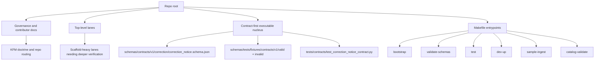

<!-- [KFM_META_BLOCK_V2]
doc_id: kfm://doc/TODO-uuid-needs-verification
title: Repository Map (Evidence-Based)
type: standard
version: v1
status: draft
owners: TODO(owners-needs-verification)
created: TODO(created-date-needs-verification)
updated: 2026-04-11
policy_label: TODO(policy-label-needs-verification)
related: [README.md, CHANGELOG.md, CONTRIBUTING.md, SECURITY.md, contracts/, schemas/, tests/, Makefile]
tags: [kfm, repository-map, evidence-based, scaffold]
notes: [Built from attached KFM doctrine plus a user-supplied 2026-04-11 repository snapshot; exact path, owners, and live branch inventory still need direct repo verification.]
[/KFM_META_BLOCK_V2] -->

# Repository Map (Evidence-Based)

A repo-wide navigation map that separates KFM doctrine, scaffold structure, and the currently visible executable nucleus without overstating implementation maturity.

**Status:** `experimental` *(INFERRED from the scaffold-heavy snapshot; re-check against the mounted branch before commit)*  
**Owners:** `TODO(owners-needs-verification)`


**Quick jump:** [Scope](#scope) · [Repo fit](#repo-fit) · [Current snapshot](#current-snapshot) · [Directory tree](#directory-tree) · [Quickstart](#quickstart) · [Current executable nucleus](#current-executable-nucleus) · [Update gate](#update-gate) · [FAQ](#faq)

> [!IMPORTANT]
> This document is a **navigation and evidence-orientation file**, not a proof of full runtime maturity. In KFM terms, it should help readers see what is doctrinally load-bearing, what appears scaffold-heavy, and what still needs direct repo verification before stronger claims are made.

> [!WARNING]
> The inventory counts, top-level map, and executable-file snapshot below are based on a **2026-04-11 repository snapshot supplied in the task input**. The current session did **not** expose a directly mounted repository tree for re-enumeration, so all branch-sensitive inventory details should be rechecked before commit.

_Last verified snapshot referenced here: **2026-04-11 (UTC)**._

## Scope

This file exists to answer one practical question:

**What is actually here, how is it organized, and what should a maintainer conclude from that shape without bluffing about maturity?**

It is the right document for:

- orienting a maintainer at repo-root level
- showing the current top-level lane structure
- distinguishing repo-wide scaffold from the currently visible executable nucleus
- routing readers toward contracts, schemas, tests, and contributor entrypoints
- keeping KFM’s evidence posture visible while the implementation deepens

It is **not** the right document for:

- lane-specific operating detail
- whole-system doctrinal restatement
- deployment topology claims
- workflow/CI coverage claims not directly reverified from the live branch
- package-level ownership or module-boundary assertions that need code-tree inspection

[Back to top](#repository-map-evidence-based)

## Repo fit

| Field | Value |
| --- | --- |
| Role | Repo-wide structural map and maintainer orientation document |
| Intended audience | Maintainers, contributors, reviewers, stewards, onboarding readers |
| Path | `TODO(path-needs-verification)` |
| Upstream material | Root governance/contributor docs, KFM master doctrine, source atlas, shell doctrine |
| Downstream material | Lane readmes, contract/schema docs, tests, runbooks, contribution updates |

### Accepted inputs

This document should absorb only repo-level material such as:

- top-level directory and file inventory
- verified entrypoints and contributor commands
- repo-wide contracts/schemas/tests that define the current executable nucleus
- current scaffold-vs-execution interpretation
- routing notes that help a contributor decide where deeper material belongs

### Exclusions

Keep the following **out** of this file:

- deep lane doctrine that belongs in narrower docs
- endpoint or runtime claims that require direct repo or deployment evidence
- speculative future package layouts
- detailed contract semantics better owned by the contract file or schema doc itself
- generated inventories that are stale the moment they are pasted unless the regeneration method is documented

## How to read this map

Use the following truth labels consistently in this file:

| Label | Meaning here |
| --- | --- |
| **CONFIRMED** | Supported by the attached KFM corpus or directly supplied snapshot text |
| **INFERRED** | Conservative structural interpretation that fits the evidence but is not directly reverified from a mounted tree |
| **PROPOSED** | Recommended documentation shape or next-step improvement |
| **UNKNOWN** | Not verified strongly enough in this session |
| **NEEDS VERIFICATION** | A review flag that should be closed before stronger repo claims are made |

## Current snapshot

### README inventory snapshot

The current map should be read as a **documentation-first scaffold with a small executable validation core**.

| Snapshot metric | Value | Confidence note |
| --- | ---: | --- |
| Total `README.md` files | **396** | User-supplied snapshot; **NEEDS VERIFICATION** against live branch |
| README-heavy directories (README only) | **250** | User-supplied snapshot; **NEEDS VERIFICATION** against live branch |
| Overall repo read | **Documentation-first scaffold** | Snapshot-supported and consistent with attached KFM doctrine |
| Confirmed executable emphasis | **Small validation nucleus, not broad implementation coverage** | Snapshot-supported; aligns with contract-first KFM direction |

### Top-level map (actual files and directories)

| Group | Snapshot contents | Reading guidance |
| --- | --- | --- |
| Governance / contributor docs | `.github/`, `README.md`, `CHANGELOG.md`, `CONTRIBUTING.md`, `SECURITY.md`, `CODE_OF_CONDUCT.md`, `LICENSE` | Strong sign of repo-wide governance posture and contributor-facing routing |
| Domain / structure lanes | `apps/`, `brand/`, `configs/`, `contracts/`, `data/`, `docs/`, `examples/`, `infra/`, `migrations/`, `packages/`, `pipelines/`, `policy/`, `schemas/`, `tests/`, `tools/`, `web/` | Broad lane scaffolding exists; lane depth still needs direct recheck |
| Executable nucleus currently visible in snapshot | `tests/contracts/test_correction_notice_contract.py`; `schemas/contracts/v1/correction/correction_notice.schema.json`; fixture JSON under `schemas/tests/fixtures/contracts/v1/{valid,invalid}/`; utility scripts under `scripts/`; `Makefile` | The correction-notice contract/test path is the clearest visible implementation anchor in the supplied snapshot |

### Structural reality

As of the supplied snapshot, the safest repo-level reading is:

1. Most subtrees appear to be **contract/README placeholders or doctrinal structure**, not broad live implementation.
2. No workspace/package manifest was reported in the supplied snapshot for common roots such as `package.json`, `pyproject.toml`, `go.mod`, or `Cargo.toml`.
3. Build/test/dev contributor entrypoints are currently expressed through **`Makefile` targets**.

## Directory tree

The tree below is intentionally compact. It is designed to show **shape**, not to pretend the full branch inventory was re-enumerated in this session.

```text
.
├── .github/
├── README.md
├── CHANGELOG.md
├── CONTRIBUTING.md
├── SECURITY.md
├── CODE_OF_CONDUCT.md
├── LICENSE
├── apps/
├── brand/
├── configs/
├── contracts/
├── data/
├── docs/
├── examples/
├── infra/
├── migrations/
├── packages/
├── pipelines/
├── policy/
├── schemas/
│   ├── contracts/
│   │   └── v1/
│   │       └── correction/
│   │           └── correction_notice.schema.json
│   └── tests/
│       └── fixtures/
│           └── contracts/
│               └── v1/
│                   ├── valid/
│                   └── invalid/
├── tests/
│   └── contracts/
│       └── test_correction_notice_contract.py
├── tools/
├── web/
├── scripts/                    # exact file inventory NEEDS VERIFICATION
└── Makefile
```

> [!NOTE]
> This tree intentionally stops at the first clearly evidenced contract/test nucleus. Expand it only after re-running a real file walk against the mounted branch.

[Back to top](#repository-map-evidence-based)

## Quickstart

These are the current contributor-facing entrypoints carried into this map from the supplied snapshot and supporting KFM documentation.

```bash
make bootstrap
make validate-schemas
make test
make dev-up
make sample-ingest SOURCE=<name>
make catalog-validate
```

### What these commands imply

| Command | Repo-level meaning |
| --- | --- |
| `make bootstrap` | establish local prerequisites / repo bootstrap path |
| `make validate-schemas` | schema-first validation is part of the contributor path |
| `make test` | tests are expected to exist even if implementation depth remains narrow |
| `make dev-up` | there is a documented local dev bring-up path |
| `make sample-ingest SOURCE=<name>` | thin-slice ingest flows are part of the intended operating model |
| `make catalog-validate` | catalog closure / outward metadata validation is expected, not decorative |

## Usage

### Use this file when you need to answer

- where a new repo-wide document should live
- whether a change belongs in contracts, schemas, tests, docs, or a narrower lane
- whether the current branch still reads as scaffold-heavy or has crossed into broader implementation
- what a newcomer should run first
- what can be said safely without turning doctrine into fake runtime proof

### Update this file when any of the following changes

1. The top-level tree or lane inventory materially changes.
2. The executable nucleus expands beyond the current correction-notice contract slice.
3. Contributor entrypoints change.
4. A mounted repo walk closes current placeholders such as path, owners, or live inventory counts.
5. Adjacent root docs change routing expectations.

## Diagram



## Current executable nucleus

This is the part of the repo map that most strongly deserves maintainer attention right now.

| Visible anchor | Why it matters | Current read |
| --- | --- | --- |
| `schemas/contracts/v1/correction/correction_notice.schema.json` | Correction is a trust-bearing KFM object, not a side note | **CONFIRMED in snapshot; structurally central** |
| `schemas/tests/fixtures/contracts/v1/{valid,invalid}/` | The repo is using fixture-based contract validation rather than prose-only doctrine | **CONFIRMED in snapshot** |
| `tests/contracts/test_correction_notice_contract.py` | There is at least one concrete contract test path | **CONFIRMED in snapshot** |
| `scripts/` | Utility automation exists, but exact inventory was not surfaced in the request | **NEEDS VERIFICATION** |
| `Makefile` | Contributor workflow is normalized through make targets | **CONFIRMED in snapshot / needs live target recheck** |

### Why this matters in KFM terms

The snapshot’s correction-notice core matches the broader KFM doctrinal pattern:

- contracts and proof objects should become machine-checkable
- fixtures and validator paths should exist alongside schemas
- correction should preserve lineage rather than silently overwrite prior truth
- the smallest real thing is more important than a broader but weaker scaffold

That makes this nucleus a useful maintainer signal: **the repo appears to be moving from doctrine toward artifactization, but only in a narrow, still-early slice.**

## What this map should help a maintainer conclude

### Safe conclusions

- The repo is intentionally broad in lane structure.
- Documentation and routing appear to be ahead of implementation depth.
- Contract-first validation is not hypothetical; it already has at least one visible correction slice.
- Contributor workflow is meant to be approachable through `make`.
- KFM’s trust posture should influence how repo maturity is described in docs.

### Unsafe conclusions

Do **not** use this file to imply that:

- every lane has meaningful implementation depth
- all top-level directories are equally active
- CI/workflow coverage is broad or current
- runtime surfaces, APIs, DTOs, or deployment topology have been directly verified
- the absence of visible code in this snapshot means the repo lacks a deeper implementation on the current branch

## Update gate

Before merging an update to this file, confirm the following:

- [ ] The README counts were re-enumerated from the mounted branch.
- [ ] The top-level tree was re-walked directly.
- [ ] The target file path was resolved and any relative links were corrected accordingly.
- [ ] Owners, `doc_id`, `created`, and `policy_label` placeholders were resolved or intentionally preserved with explanation.
- [ ] `Makefile` targets still run or are intentionally documented as illustrative.
- [ ] The `scripts/` inventory was checked if it is mentioned.
- [ ] The executable nucleus table was expanded only where real files/tests/schemas were directly verified.
- [ ] Adjacent root docs were updated if repo routing changed.

### Definition of done

This document is ready when it:

- helps a new maintainer orient quickly
- does not exaggerate repo maturity
- points clearly to the currently visible contract/test spine
- names open verification work instead of hiding it
- stays visually clean enough to use during review

[Back to top](#repository-map-evidence-based)

## FAQ

### Is this a maturity statement?

No. It is a **repo map**, not a claim that the full platform is operational.

### What is the clearest currently visible implementation slice?

The supplied snapshot points to a **correction-notice contract path**: schema, fixtures, and one contract test.

### Why does this file keep saying “NEEDS VERIFICATION”?

Because KFM doctrine explicitly treats overclaiming as a trust failure. This file should stay useful under review pressure, not just look polished.

### What should likely deepen next?

The strongest attached KFM sources point toward a small first-wave contract pack, policy registries, fixtures, and one governed thin slice rather than a broad undocumented expansion.

## Appendix

<details>
<summary><strong>Confidence and open verification notes</strong></summary>

### Still unresolved in this revision

| Item | Current state |
| --- | --- |
| Exact target file path | **UNKNOWN** |
| Owners | **UNKNOWN** |
| `doc_id` UUID | **UNKNOWN** |
| Policy label | **UNKNOWN** |
| Live README counts on current branch | **NEEDS VERIFICATION** |
| Exact `scripts/` inventory | **NEEDS VERIFICATION** |
| Full workflow / CI inventory | **UNKNOWN** |
| Additional executable nuclei beyond the supplied correction slice | **UNKNOWN** |

### Recommended next verification pass

1. Mount the live repo tree.
2. Re-run README and directory inventory counts.
3. Resolve the document path and convert any remaining path placeholders into stable relative links.
4. Enumerate the actual `Makefile` targets and `scripts/` inventory.
5. Expand this map only after verifying whether more contract families, fixtures, or tests now exist.

</details>

<details>
<summary><strong>Maintainer note</strong></summary>

A repository map should change in the same governed review stream as the contracts, schemas, tests, contributor commands, and root docs it describes.

If a future branch proves a different path layout or a deeper executable core than this revision shows, update the map by **promoting direct evidence**, not by stretching older assumptions.

</details>
