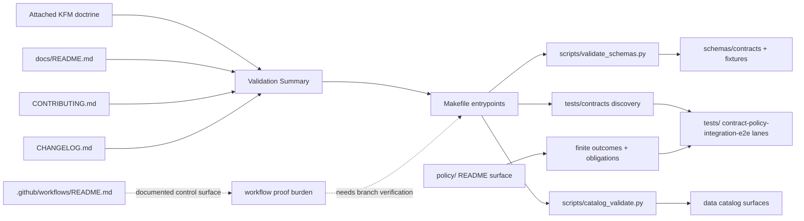

<!-- [KFM_META_BLOCK_V2]
doc_id: kfm://doc/<uuid-NEEDS_VERIFICATION>
title: Validation Summary
type: standard
version: v1
status: draft
owners: @bartytime4life
created: YYYY-MM-DD
updated: YYYY-MM-DD
policy_label: <NEEDS_VERIFICATION>
related: [./README.md, ./REPO_MAP.md, ./BUILD_PLAN.md, ./BACKLOG.md, ../README.md, ../CHANGELOG.md, ../CONTRIBUTING.md, ../.github/workflows/README.md, ../contracts/README.md, ../policy/README.md, ../schemas/README.md, ../tests/README.md, ../data/README.md]
tags: [kfm, validation, verification, contracts, policy, schemas, tests]
notes: [doc_id, created, updated, and policy_label require branch-confirmed values before merge; current public-main path presence is confirmed, but the existing body of this file was not directly re-read in this drafting session]
[/KFM_META_BLOCK_V2] -->

# Validation Summary

Verification-first map of what the current public KFM branch visibly proves about schemas, policy, tests, catalog checks, and workflow burden.

> **Status:** draft  
> **Owners:** `@bartytime4life`  
> **Path:** `docs/VALIDATION_SUMMARY.md`  
> **Repo fit:** planning-and-verification document inside `docs/`, upstream of lane-specific validation work and downstream of doctrine, repo-fit, and contribution guidance  
>      
> **Quick jumps:** [Scope](#scope) · [Repo fit](#repo-fit) · [Evidence boundary](#evidence-boundary) · [Current validation surface](#current-validation-surface) · [Quickstart](#quickstart) · [Validation matrix](#validation-matrix) · [Gaps](#gaps-and-open-verification) · [Definition of done](#definition-of-done) · [Appendix](#appendix)

> [!IMPORTANT]
> This file is meant to summarize **what is actually visible and testable now**, not to restate every aspirational validation idea in the corpus as if it were already enforced.

> [!CAUTION]
> Public `main` confirms that `docs/VALIDATION_SUMMARY.md` is a tracked repository document, but this drafting session did **not** directly re-open the current body of that file. Treat this draft as a replacement-grade revision candidate and reconcile it against the branch copy before merge.

## Scope

This document summarizes the current validation surface for Kansas Frontier Matrix as a **trust-bearing operational layer** rather than a generic QA note. Its job is to keep four things visible:

1. what the current public branch clearly proves,
2. what doctrine requires even when implementation depth is still thin,
3. where validation is scaffolded but not yet shown as strong runtime proof,
4. what must be re-verified before maintainers describe a validation behavior as active.

## Repo fit

| Field | Value |
|---|---|
| Path | `docs/VALIDATION_SUMMARY.md` |
| Role | Repo-level planning and verification summary for contracts, schemas, policy, tests, catalog checks, and workflow burden |
| Upstream | [`../README.md`][root-readme], [`./README.md`][docs-index], [`../CONTRIBUTING.md`][contributing], [`../CHANGELOG.md`][changelog] |
| Adjacent | [`./REPO_MAP.md`][repo-map], [`./BUILD_PLAN.md`][build-plan], [`./BACKLOG.md`][backlog] |
| Downstream | [`../contracts/README.md`][contracts-readme], [`../policy/README.md`][policy-readme], [`../schemas/README.md`][schemas-readme], [`../tests/README.md`][tests-readme], [`../.github/workflows/README.md`][workflows-readme], [`../data/README.md`][data-readme] |
| Audience | maintainers, reviewers, architecture stewards, contract/schema editors, policy authors, release reviewers |
| Update trigger | any change that materially affects schema checks, contract fixtures, policy gates, test entrypoints, catalog validation, proof-pack expectations, or correction-ready release behavior |

## Accepted inputs

This file belongs to evidence such as:

- checked-in validation entrypoints like `Makefile` targets and validation scripts,
- checked-in contract and schema files,
- fixture directories and negative-path examples,
- policy bundles, policy fixtures, and policy tests,
- test directories and verification-family READMEs,
- workflow docs or checked-in workflow YAML,
- release-evidence expectations that change what maintainers can truthfully claim.

## Exclusions

This file should **not** be used to:

- imply merge-blocking CI coverage that the branch does not visibly prove,
- claim active OPA/Rego enforcement just because policy doctrine prefers it,
- claim populated schemas, fixtures, or proof packs where only scaffolds are visible,
- replace lane-local verification docs inside `tests/`, `policy/`, `contracts/`, `schemas/`, or `data/`,
- log historical release behavior without qualifying evidence.

## Truth posture used here

| Label | Meaning in this file |
|---|---|
| **CONFIRMED** | Directly visible in attached doctrine or current public branch evidence inspected for this pass |
| **INFERRED** | Strongly implied by current structure, naming, or repeated doctrine, but not directly proven as active behavior |
| **PROPOSED** | Recommended strengthening or packaging move consistent with KFM doctrine |
| **UNKNOWN** | Not directly proven from the currently visible branch/doc surface |
| **NEEDS VERIFICATION** | Likely resolvable by opening branch-local files, running commands, or checking runner/ruleset settings |

## Evidence boundary

| Evidence source | How this file treats it |
|---|---|
| Attached KFM doctrine and strengthened manuals | **Doctrinal authority** for truth-path law, trust membrane, contract families, inspectable claims, correction lineage, and bounded validation posture |
| Public repository root and adjacent docs | **Branch-visible evidence** for current directory shape, documentation conventions, current READMEs, CODEOWNERS, and validation-facing repo signals |
| `Makefile` and visible validation entrypoints | **Confirmed runnable entrypoints** where commands are explicitly checked in |
| `tests/`, `policy/`, `schemas/`, `contracts/`, `.github/workflows/` READMEs | **Confirmed lane intent and public-main surface shape**, not automatic proof of deep implementation |
| Current branch-local file bodies not re-opened in this pass | **UNKNOWN / NEEDS VERIFICATION** until directly inspected |
| Historical or aspirational ideas from older packets | Used only when they sharpen doctrine or suggest next proof burdens; never treated as live implementation by default |

## Current validation surface

### At a glance

| Surface | Current reading | Status |
|---|---|---|
| `docs/VALIDATION_SUMMARY.md` path | Tracked under `docs/` as a repo-level planning/verification document | **CONFIRMED** |
| Repo validation entrypoints | `make validate-schemas`, `make test`, and `make catalog-validate` are checked in | **CONFIRMED** |
| Test family posture | `tests/` is treated as a governed verification surface with contract, policy, integration, e2e, reproducibility, and accessibility burdens | **CONFIRMED** |
| Default checked-in `test` command | Public `Makefile` currently points at `unittest` discovery under `tests/contracts` | **CONFIRMED** |
| Workflow YAML coverage on public `main` | `.github/workflows/README.md` is visible; public `main` currently shows that directory as README-only | **CONFIRMED** |
| Merge-blocking workflow rulesets | Not proven from the visible public branch | **UNKNOWN** |
| Policy execution surface | `policy/` lanes and language are documented; public branch does not yet prove executable bundle depth | **CONFIRMED / UNKNOWN** |
| Schema machine surface | `schemas/contracts/` and related lanes exist; machine files are visible but publicly described as scaffold-state | **CONFIRMED** |
| Fixture maturity | `schemas/tests/fixtures/contracts/v1/{valid,invalid}` is publicly signaled, but populated fixture depth still requires branch inspection | **CONFIRMED / NEEDS VERIFICATION** |
| Contract family expectation | KFM doctrine and repo docs align on typed objects such as `SourceDescriptor`, `ValidationReport`, `DecisionEnvelope`, `EvidenceBundle`, and `RuntimeResponseEnvelope` | **CONFIRMED** |

### What this means operationally

KFM already treats validation as a **trust surface**, not as an afterthought. The visible public branch shows that doctrine clearly, and it also shows a small but real execution seam: schema validation, contract-focused unit discovery, and catalog validation are already named as top-level entrypoints.

At the same time, the current public branch still requires restraint. A maintainer can truthfully say that KFM has a visible validation architecture and checked-in entrypoints. A maintainer should **not** say, without further proof, that public `main` currently demonstrates full workflow enforcement, populated schema packs, complete negative-path fixtures, or release-grade proof bundles.

## Quickstart

### Fastest branch-local verification pass

```bash
find docs .github contracts schemas policy tests scripts -maxdepth 3 -type f | sort

sed -n '1,220p' Makefile
sed -n '1,220p' .github/CODEOWNERS
sed -n '1,220p' .github/workflows/README.md
sed -n '1,260p' tests/README.md
sed -n '1,260p' policy/README.md
sed -n '1,260p' schemas/README.md
sed -n '1,260p' contracts/README.md
sed -n '1,260p' docs/README.md
sed -n '1,260p' docs/BACKLOG.md
```

### Current checked-in validation entrypoints

```bash
make validate-schemas
make test
make catalog-validate
```

### Branch-local follow-up checks before merge

```bash
sed -n '1,240p' scripts/validate_schemas.py
sed -n '1,240p' scripts/catalog_validate.py

find tests/contracts -maxdepth 3 -type f | sort
find schemas/contracts -maxdepth 4 -type f | sort
find schemas/tests/fixtures/contracts -maxdepth 4 -type f | sort
find policy -maxdepth 4 -type f | sort
find .github/workflows -maxdepth 2 -type f | sort
```

> [!NOTE]
> The first command group proves **surface shape**. The second proves **current entrypoints**. The third is what closes the gap between documentation truth and implementation truth on a working branch.

## Validation model

### 1. Contract and schema validation

KFM doctrine is explicit that public-safe behavior depends on typed objects, not hand-waved prose. The repo’s public documentation and schema lane both reflect that direction.

**What is settled**

- validation must protect contract shape, not just syntax,
- outward-facing objects should be explicit enough to validate, diff, and test,
- `schemas/contracts/` is the machine-facing home for contract schemas,
- fixture support exists as a visible lane, even where individual fixtures still need branch-local confirmation.

**What still needs proof**

- whether the branch contains meaningful schema bodies rather than scaffold placeholders,
- whether valid/invalid fixtures are broad enough to support regression gates,
- whether schema checks currently fail closed on all trust-bearing contract families.

### 2. Policy validation

Policy is treated as a compact, execution-oriented surface whose burden is finite outcomes, obligation codes, and deny-by-default reasoning rather than generic rules prose.

**What is settled**

- KFM distinguishes policy from documentation,
- runtime outcomes are finite and named,
- policy fixtures and tests are expected parts of the repo structure,
- public docs preserve the possibility of OPA/Rego adoption without overclaiming it as fully proven.

**What still needs proof**

- checked-in executable policy bundles,
- actual evaluation runtime,
- deny/allow coverage depth,
- branch-local CI integration.

### 3. Repo-facing tests

The public test docs already define a much broader verification burden than a single unit-test lane.

| Test seam | Why it exists | Current public proof |
|---|---|---|
| Contract tests | prove required fields, reject invalid shapes, catch drift | visible in `Makefile` + `tests/contracts` emphasis |
| Policy tests | prove allow/deny and obligation behavior | documented as required; deeper suite needs verification |
| Integration tests | prove lane joins and governed seams | family documented |
| E2E tests | prove outward trust behavior | family documented |
| Reproducibility tests | prove deterministic rebuild and stable proof objects | family documented |
| Accessibility checks | prove trust-visible surfaces remain usable | family documented |

### 4. Catalog and data validation

The public branch already treats catalog closure as part of truth, not decoration. That matters because KFM’s truth path does not end at `PROCESSED`; it closes outward through governed metadata and lineage.

**Current confirmed signal**

- `make catalog-validate` exists,
- `data/` is documented as a governed lifecycle surface,
- catalog closure remains part of the truth path rather than a publishing afterthought.

**Open proof burden**

- exact validator behavior,
- exact STAC/DCAT/PROV checks,
- whether current lane artifacts are example-grade, scaffold-grade, or release-grade.

### 5. Workflow and release-evidence validation

This is the clearest place where public-main restraint matters most.

The repo’s public workflow documentation treats `.github/workflows/` as a trust-bearing control surface. But the current public branch also shows that directory as README-only. That means workflow doctrine is visible, yet checked-in workflow-YAML depth is not publicly proven from this pass.

> [!WARNING]
> Do not convert workflow intent into workflow fact. A documented control surface is not the same thing as an active, branch-visible workflow inventory.

## Validation matrix



### Burden by seam

| Seam | Minimum truth burden | Current reading | File posture |
|---|---|---|---|
| Contract shape | required fields, rejected invalids, drift detection | visible as doctrine and lane structure; deeper bodies need direct inspection | **CONFIRMED / NEEDS VERIFICATION** |
| Schema machine surface | actual `.schema.json` files and fixtures | present publicly, but described as scaffold-state | **CONFIRMED** |
| Policy outcomes | finite results, obligation-aware evaluation, default-deny posture | clearly documented; executable depth not yet publicly proven | **CONFIRMED / UNKNOWN** |
| Test execution | runnable tests tied to trust seams | contract-oriented `make test` confirmed; wider suite depth still needs verification | **CONFIRMED / NEEDS VERIFICATION** |
| Catalog closure | outward metadata and lineage checks | explicit `catalog-validate` entrypoint confirmed | **CONFIRMED** |
| Workflow gates | merge/release enforcement | README-visible only on current public `main` | **UNKNOWN** |
| Correction / rollback | validation after supersession, withdrawal, or replacement | doctrinally strong, implementation proof still thin | **INFERRED / NEEDS VERIFICATION** |

## Gaps and open verification

### Highest-priority gaps

| Gap | Why it matters | Next verification step |
|---|---|---|
| Existing body of `docs/VALIDATION_SUMMARY.md` not re-read here | prevents a fully line-preserving revision claim | open the branch copy directly and reconcile wording before merge |
| Workflow YAML inventory not proven on current public `main` | blocks truthful claims about active merge gates | inspect `.github/workflows/*.yml` on the working branch |
| Schema files described as scaffold-state | limits what “validated schemas” can currently mean | inspect `schemas/contracts/v1/**/*.schema.json` and fixture dirs directly |
| Default `make test` only targets `tests/contracts` | may under-describe broader validation burden if treated as complete coverage | inspect `tests/` subtree and runner config, then document actual invocation strategy |
| Policy lanes are visible but executable adoption is unclear | easy place for accidental overclaim | inspect `policy/bundles`, `policy/tests`, and any CI calls before stating enforcement |
| Backlog still calls for test expansion | indicates current public depth is intentionally incomplete | review backlog items and either close them with proof or keep them visible |

### Most likely overclaim traps

- “The repo currently enforces merge-blocking workflow checks.”
- “OPA/Rego is active and proven in CI.”
- “All contract families already have populated schema and fixture coverage.”
- “Correction, rollback, and release proof packs are already end-to-end exercised.”
- “Public `main` proves the same thing as the working branch.”

## Definition of done

A validation-bearing change is not complete until the relevant seam has **both** a surface description and a proof path.

- [ ] Re-open the current branch copy of `docs/VALIDATION_SUMMARY.md` and reconcile this draft against it.
- [ ] Verify `created`, `updated`, `doc_id`, and `policy_label` in the meta block.
- [ ] Run `make validate-schemas`, `make test`, and `make catalog-validate` on the working branch.
- [ ] Inspect `scripts/validate_schemas.py` and `scripts/catalog_validate.py` and confirm the summary still matches.
- [ ] Inspect `tests/contracts` and any adjacent test lanes touched by the change.
- [ ] Inspect `schemas/contracts/v1/**` and `schemas/tests/fixtures/contracts/v1/**` if schema claims are made.
- [ ] Inspect `policy/**` if policy claims are made.
- [ ] Inspect `.github/workflows/*.yml` before claiming checked-in workflow enforcement.
- [ ] Update adjacent docs when validation behavior, command entrypoints, or proof burden changes.
- [ ] Keep unresolved areas visible as `UNKNOWN` or `NEEDS VERIFICATION` rather than smoothing them away.

## Recommended first full proof slice

When a maintainer wants to move from documentation truth to end-to-end validation truth, the preferred first slice is still **hydrology**.

Why this remains the best proving lane:

- it is repeatedly treated as the first governed thin slice in KFM doctrine,
- it has a public-safe burden profile compared with more sensitive lanes,
- it exercises source intake, transforms, catalog closure, and runtime trust behavior without forcing the hardest geoprivacy problems first.

## Review questions

Use these before approving changes to this file or any adjacent validation surface:

1. Does the text distinguish clearly between **checked-in proof** and **documented intent**?
2. Does every strong claim point to a visible command, file, fixture, or branch-local check?
3. Does the summary preserve KFM terms like **truth path**, **trust membrane**, **catalog closure**, **runtime outcomes**, and **correction lineage**?
4. Did the change update adjacent docs if the validation burden actually changed?
5. Could a reviewer reproduce the claim path from this file without guessing?

## FAQ

### Does the public branch prove merge-blocking workflow enforcement?

No. The current public validation/workflow surface documents that burden, but this summary should not state that the public branch proves active checked-in workflow coverage until the YAML inventory is directly re-verified.

### Does KFM already have a validation architecture?

Yes — doctrinally and structurally. The repo visibly names validation surfaces, contract families, test families, policy surfaces, and command entrypoints. What varies is **depth**.

### What is the safest current claim?

That KFM has a **visible, evidence-first validation architecture with confirmed entrypoints and documented trust seams**, while several high-value proof paths still require branch-local verification before they should be described as fully active.

### When should this file change?

Whenever a maintainer changes contract or schema validation, policy testing, catalog validation, workflow enforcement, proof-pack expectations, correction/rollback validation, or the truthfulness of repo-level validation claims.

<p align="right"><a href="#validation-summary">Back to top</a></p>

## Appendix

<details>
<summary><strong>Appendix A — currently visible validation signals worth checking first</strong></summary>

| Signal | Why inspect it first |
|---|---|
| `Makefile` | quickest truth source for checked-in validation entrypoints |
| `.github/workflows/README.md` | states workflow burden and current public-main visibility limit |
| `tests/README.md` | defines verification-family scope and definition-of-done burden |
| `policy/README.md` | keeps policy claims compact and finite-outcome oriented |
| `schemas/README.md` | clarifies scaffold-state versus machine-bearing paths |
| `docs/BACKLOG.md` | keeps known validation gaps from being silently forgotten |

</details>

<details>
<summary><strong>Appendix B — branch-local proof pack for this document</strong></summary>

```bash
# path truth
git ls-files docs/VALIDATION_SUMMARY.md docs/REPO_MAP.md docs/BUILD_PLAN.md docs/BACKLOG.md

# owner truth
sed -n '1,220p' .github/CODEOWNERS

# validation entrypoints
sed -n '1,220p' Makefile

# public surface docs
sed -n '1,260p' docs/README.md
sed -n '1,260p' .github/workflows/README.md
sed -n '1,260p' tests/README.md
sed -n '1,260p' policy/README.md
sed -n '1,260p' schemas/README.md
sed -n '1,260p' contracts/README.md

# deeper proof
find tests -maxdepth 4 -type f | sort
find policy -maxdepth 4 -type f | sort
find schemas -maxdepth 5 -type f | sort
find .github/workflows -maxdepth 3 -type f | sort
```

</details>

<details>
<summary><strong>Appendix C — stable references</strong></summary>

[root-readme]: ../README.md
[docs-index]: ./README.md
[changelog]: ../CHANGELOG.md
[contributing]: ../CONTRIBUTING.md
[repo-map]: ./REPO_MAP.md
[build-plan]: ./BUILD_PLAN.md
[backlog]: ./BACKLOG.md
[contracts-readme]: ../contracts/README.md
[policy-readme]: ../policy/README.md
[schemas-readme]: ../schemas/README.md
[tests-readme]: ../tests/README.md
[workflows-readme]: ../.github/workflows/README.md
[data-readme]: ../data/README.md

</details>
