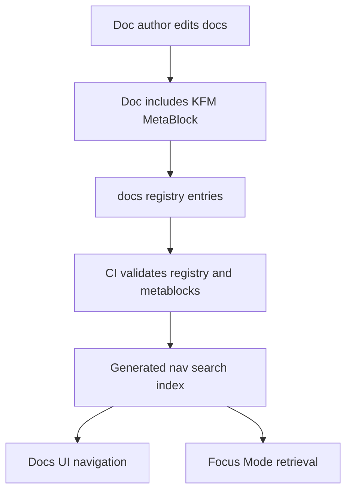

<!-- [KFM_META_BLOCK_V2]
doc_id: kfm://doc/e7b4b0a6-3e85-4c61-9d5b-0c225e1c7c29
title: docs/_registry — Documentation Registry
type: standard
version: v1
status: draft
owners: ["@kfm-maintainers", "@kfm-docs-stewards"]  # TODO: replace with real CODEOWNERS handles/teams
created: 2026-03-04
updated: 2026-03-05
policy_label: public
related: ["docs/README.md", "docs/governance/ROOT_GOVERNANCE.md"] # TODO: adjust to real repo paths
tags: ["kfm", "docs", "registry", "governance"]
notes: [
  "This README defines a governed documentation registry pattern.",
  "Treat any repo-path assumptions as UNKNOWN until verified in the actual repository."
]
[/KFM_META_BLOCK_V2] -->

<a id="top"></a>

<div align="center">

# `docs/_registry`

A governed, machine-readable **index of documentation artifacts** (IDs, paths, owners, status, policy labels) to keep KFM docs auditable and discoverable.

</div>

---

## Impact

- **Status:** **PROPOSED** — `experimental` (upgrade to `active` once CI gates exist)
- **Owners:** **UNKNOWN** — replace placeholders with real CODEOWNERS principals
- **Policy posture:** **PROPOSED** — fail-closed where enforced (missing required metadata ⇒ block promotion/merge)


**Quick links:** [Scope](#scope) • [Where it fits](#where-it-fits) • [Acceptable inputs](#acceptable-inputs) • [Exclusions](#exclusions) • [Directory layout](#directory-layout) • [Workflow](#workflow) • [Quickstart](#quickstart) • [Registry contract](#registry-contract) • [CI gates](#ci-gates) • [Definition of done](#definition-of-done)

---

## Scope

This directory exists to make documentation behave like a **governed system surface**.

- **PROPOSED:** Provide a canonical registry of docs (IDs, paths, owners, status, policy labels, tags).
- **PROPOSED:** Support deterministic generation of navigation/search indexes from that registry.
- **PROPOSED:** Enable CI checks that fail closed when required doc metadata is missing or inconsistent.

### Evidence labels used in this README

- **CONFIRMED:** Supported by authoritative KFM references (not necessarily by current repo state).
- **PROPOSED:** Intended behavior/design for this directory.
- **UNKNOWN:** Cannot be validated from the current repo snapshot; requires verification steps.

> IMPORTANT: If a statement is not explicitly labeled, treat it as **PROPOSED** by default.

---

## Where it fits

**PROPOSED:** This folder is the *documentation equivalent* of a dataset/source registry: a small, version-controlled ledger that other tooling can rely on.

Upstream → downstream (conceptual):

- **PROPOSED (Upstream):** Docs authored/edited throughout `docs/**`
- **PROPOSED (This folder):** `docs/_registry/**` defines *what exists* and *how it’s governed*
- **PROPOSED (Downstream):** docs site navigation, doc search indexing, reviewer workflows, CI doc gates, Focus Mode retrieval of governed docs

> IMPORTANT (PROPOSED): This registry must not override policy decisions. It should **describe** documentation governance metadata, not act as a policy engine.

---

## Acceptable inputs

### Files that belong here

- **PROPOSED:** `registry.yaml` — canonical docs registry (doc_id → path, status, owners, policy_label, tags, updated)
- **PROPOSED:** `schemas/` — schemas to validate registry entries (JSON Schema recommended)
- **PROPOSED:** `tools/` — deterministic validators/generators used by CI (prefer: no network, stable ordering, stable formatting)
- **PROPOSED:** `generated/` — optional generated indexes (**prefer CI artifacts unless** a generated file must be versioned)

### Metadata that should exist on every governed doc

- **PROPOSED:** A `KFM_META_BLOCK_V2` at the top of each “production-surface” doc.
- **PROPOSED:** Minimum fields: `doc_id`, `title`, `type`, `version`, `status`, `owners`, `created`, `updated`, `policy_label`.

---

## Exclusions

What must **not** go in `docs/_registry`:

- **PROPOSED:** No datasets or pipeline artifacts (those belong in governed data zones + catalogs, not in docs machinery).
- **PROPOSED:** No secrets (tokens, credentials, private URLs, access keys).
- **PROPOSED:** No large binaries (store under a dedicated `docs/**/assets/` pattern, or a repo attachments policy-defined location).
- **PROPOSED:** No policy definitions (OPA/Rego policy should live in the policy surface; this registry only references policy labels).

---

## Directory layout

### Suggested layout

**PROPOSED:** (If these don’t exist yet, start with `README.md` + `registry.yaml` only.)

```text
docs/_registry/
├─ README.md
├─ registry.yaml                       # canonical docs registry (authoritative)
├─ schemas/
│  └─ doc_registry_entry.schema.json   # validates entries in registry.yaml
├─ tools/
│  ├─ extract_metablocks.py            # scans docs/** for KFM_META_BLOCK_V2 (optional)
│  ├─ validate_registry.py             # validates registry.yaml + referential integrity
│  └─ generate_docs_index.py           # produces nav/search index (optional)
└─ generated/
   └─ docs_index.json                  # optional; prefer CI artifact unless needed in-repo
```

---

## Workflow

**PROPOSED:** Minimal “add or update a governed doc” workflow:

1. Add/update the doc in `docs/**`
2. Ensure the doc contains a valid `KFM_META_BLOCK_V2` (top of file)
3. Add/update the corresponding entry in `docs/_registry/registry.yaml`
4. Run the registry validator locally (or rely on CI)
5. Open a PR; CI must pass fail-closed gates before merge

**PROPOSED:** Two operating modes (recommended)

- **Registry-first:** `registry.yaml` is authoritative; CI checks MetaBlocks match registry.
- **Extraction-first:** MetaBlocks are authoritative; CI (re)generates `registry.yaml` deterministically and checks for clean diff.

> WARNING (PROPOSED): Pick **one** mode and enforce it in CI to avoid drift and “two sources of truth.”

---

## Quickstart

> NOTE: Commands below are **PROPOSED**. Replace with your repo’s actual scripts/Make targets.

```bash
# Validate the docs registry (schema + referential integrity)
python docs/_registry/tools/validate_registry.py docs/_registry/registry.yaml

# (Optional) Rebuild the registry from MetaBlocks (if you choose extraction-first)
python docs/_registry/tools/extract_metablocks.py --root docs --out docs/_registry/registry.yaml

# (Optional) Generate a search/nav index (deterministic)
python docs/_registry/tools/generate_docs_index.py \
  --registry docs/_registry/registry.yaml \
  --out docs/_registry/generated/docs_index.json
```

---

## Registry contract

### Registry entry minimum

**PROPOSED:** minimal entry schema (YAML):

```yaml
# docs/_registry/registry.yaml
docs:
  - doc_id: "kfm://doc/00000000-0000-0000-0000-000000000000"
    path: "docs/some/area/README.md"
    title: "Example Doc"
    type: "standard"                  # standard | runbook | adr | guide | template | report | ...
    version: "v1"
    status: "draft"                   # draft | review | published | deprecated
    owners: ["@team-or-handle"]
    policy_label: "public"            # public | restricted | internal | ...
    tags: ["kfm", "docs"]
    created: "2026-03-04"             # YYYY-MM-DD
    updated: "2026-03-05"             # YYYY-MM-DD
    related:
      - "kfm://doc/ffffffff-ffff-ffff-ffff-ffffffffffff"
```

### Contract rules

- **PROPOSED:** `doc_id` is globally unique and stable.
- **PROPOSED:** `path` must exist in-repo at merge time (validator checks).
- **PROPOSED:** `owners` must map to real CODEOWNERS principals (team or user).
- **PROPOSED:** `policy_label` must come from an allowlist (deny typos).
- **PROPOSED:** `status=published` implies the doc must contain `KFM_META_BLOCK_V2` with matching `doc_id`.

### Optional hardening fields

- **PROPOSED:** `content_sha256` (set by CI on publish) to make doc builds tamper-evident.
- **PROPOSED:** `supersedes` / `replaces` (list of `doc_id`s) to make deprecations machine-resolvable.

---

## Diagram



---

## Tables

### Key artifacts

| Artifact | Kind | Source of truth | Purpose | Notes |
|---|---|---|---|---|
| `registry.yaml` | YAML | **PROPOSED: Authoritative** | Canonical index of governed docs | Keep diffs small and reviewable |
| `schemas/*.schema.json` | JSON Schema | **PROPOSED: Authoritative** | Validate registry entries | Prefer additive evolution |
| `tools/*` | Scripts | **PROPOSED: Authoritative** | Deterministic validation/generation | No network; stable outputs |
| `generated/*` | Generated | Derived | Optional indexes | Prefer CI artifacts unless required in-repo |

### Status semantics

| Status | Meaning | Allowed transitions |
|---|---|---|
| `draft` | Work in progress | **PROPOSED:** → `review` |
| `review` | Needs steward/owner review | **PROPOSED:** → `published` or → `draft` |
| `published` | Production-surface doc | **PROPOSED:** → `deprecated` (with replacement) |
| `deprecated` | Do not use for new work | **PROPOSED:** requires replacement link (`supersedes` / `replaces`) |

---

## CI gates

**PROPOSED:** fail-closed checks to add:

1. **Registry schema validation**
   - `registry.yaml` must validate against `schemas/doc_registry_entry.schema.json`

2. **Path integrity**
   - Every `path` must exist
   - Every `related` entry must resolve to a known `doc_id`

3. **MetaBlock integrity**
   - Every `published` doc must contain `KFM_META_BLOCK_V2`
   - MetaBlock `doc_id` must match the registry entry

4. **Ownership**
   - Each entry must list at least one real owner (CODEOWNERS alignment)

5. **Policy label allowlist**
   - Deny unknown/typo labels

---

## Definition of done

- [ ] `docs/_registry/registry.yaml` exists and contains at least one entry
- [ ] A schema exists for registry entries (`schemas/*`)
- [ ] CI validates registry + paths and fails closed
- [ ] `published` docs are required to include `KFM_META_BLOCK_V2`
- [ ] Owners are real and enforced via CODEOWNERS
- [ ] This README is linked from docs root (if present)

---

## FAQ

### Why `_registry` (underscore)?

**PROPOSED:** To signal “internal machinery” for docs governance and indexing, not end-user narrative content.

### Does this replace data registries and catalogs?

**CONFIRMED:** No. KFM’s dataset governance remains anchored on promotion gates and machine-readable catalogs (DCAT/STAC/PROV) for data artifacts; `docs/_registry` governs *documentation metadata only*.

---

## Appendix

<details>
<summary>Example: minimal MetaBlock to copy into governed docs</summary>

```html
<!-- [KFM_META_BLOCK_V2]
doc_id: kfm://doc/<uuid>
title: <Title>
type: standard
version: v1
status: draft|review|published
owners: <team or names>
created: YYYY-MM-DD
updated: YYYY-MM-DD
policy_label: public|restricted|...
related: [<paths or kfm:// ids>]
tags: [kfm]
notes: [<short notes>]
[/KFM_META_BLOCK_V2] -->
```

</details>

---

Back to top: [↑](#top)
