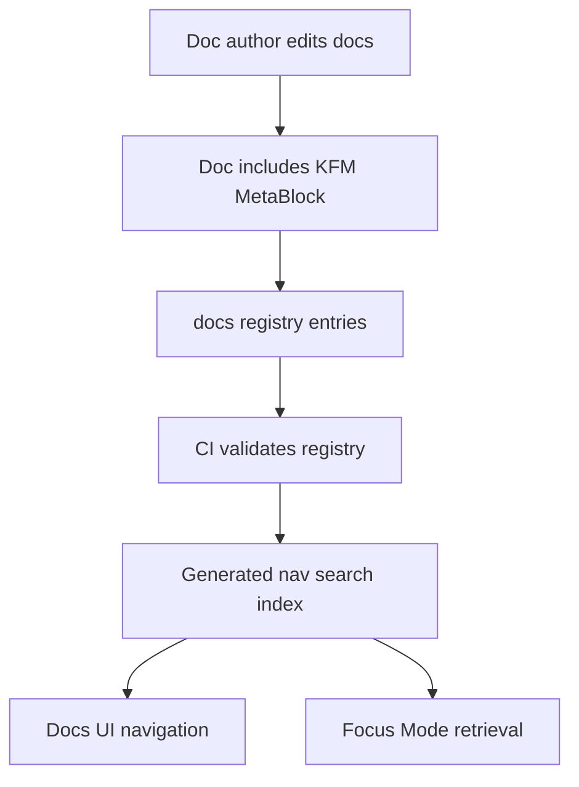

<!-- [KFM_META_BLOCK_V2]
doc_id: kfm://doc/e7b4b0a6-3e85-4c61-9d5b-0c225e1c7c29
title: docs/_registry — Documentation Registry
type: standard
version: v1
status: draft
owners: ["@kfm-maintainers", "@kfm-docs-stewards"]  # TODO: replace with real CODEOWNERS handles/teams
created: 2026-03-04
updated: 2026-03-04
policy_label: public
related: ["docs/README.md", "docs/governance/ROOT_GOVERNANCE.md"] # TODO: adjust to real repo paths
tags: ["kfm", "docs", "registry", "governance"]
notes: [
  "This README is a template/spec for a governed documentation registry.",
  "If anything below diverges from repo reality, treat it as PROPOSED and update to match the code."
]
[/KFM_META_BLOCK_V2] -->

<div align="center">

# `docs/_registry`

A governed, machine-readable **index of documentation artifacts** (IDs, owners, status, policy labels) used to keep KFM docs auditable and discoverable.

</div>

---

## Impact

- **Status:** experimental (upgrade to `active` once CI gates exist)
- **Owners:** `@kfm-docs-stewards` (TODO), `@kfm-maintainers` (TODO)
- **Policy posture:** fail-closed (missing metadata ⇒ block promotion/merge where enforced)

  

**Quick links:** [Scope](#scope) • [Where-it-fits](#where-it-fits) • [Inputs](#acceptable-inputs) • [Exclusions](#exclusions) • [Directory-layout](#directory-layout) • [Quickstart](#quickstart) • [Registry-contract](#registry-contract) • [CI-gates](#ci-gates) • [Definition-of-done](#definition-of-done)

---

## Scope

This directory exists to make documentation behave like a **governed system surface**:

- **[PROPOSED]** Provide a canonical registry of docs (IDs, paths, owners, status, policy labels, tags).
- **[PROPOSED]** Support deterministic generation of nav/search indexes from that registry.
- **[PROPOSED]** Enable CI checks that fail closed when required doc metadata is missing or inconsistent.

Evidence labels used in this README:

- **CONFIRMED:** explicitly supported by existing KFM docs/blueprints (not necessarily by current repo state).
- **PROPOSED:** intended behavior for this directory.
- **UNKNOWN:** needs verification in the actual repository.

---

## Where it fits

**[PROPOSED]** This folder is the *documentation equivalent* of a data-source registry: a small, version-controlled ledger that other tooling can rely on.

Upstream → downstream (conceptually):

- Upstream: docs authored/edited throughout `docs/**`
- This directory: `docs/_registry/**` defines *what exists* and *how it’s governed*
- Downstream: docs site navigation, doc search indexing, reviewer workflows, CI doc gates

> IMPORTANT: This registry must not bypass KFM’s policy model. It should only describe docs and their governance metadata—never override policy decisions.

---

## Acceptable inputs

### Files that belong here

- **[PROPOSED]** `registry.yaml` — the canonical index (doc_id → path, status, owners, policy_label, tags, updated)
- **[PROPOSED]** `schemas/` — JSON Schemas that validate registry entries
- **[PROPOSED]** `tools/` — small validators/generators used by CI (prefer deterministic, no network)
- **[PROPOSED]** `generated/` — optional generated indexes (only if reproducible; consider CI artifacts instead)

### Metadata that should exist on *every* governed doc

- **[PROPOSED]** A `KFM_META_BLOCK_V2` at the top of each “production-surface” doc
- **[PROPOSED]** Fields: `doc_id`, `title`, `type`, `version`, `status`, `owners`, `policy_label`, `updated`

---

## Exclusions

What must **not** go in `docs/_registry`:

- **No datasets or pipeline artifacts** (those belong under `data/**` and the catalog triplet surfaces).
- **No secrets** (tokens, credentials, private URLs).
- **No large binaries** (use `docs/**/assets/` or a dedicated attachments directory).
- **No policy definitions** (OPA/Rego belongs under `policy/**`).

---

## Directory layout

### Suggested layout

**[PROPOSED]** (If these don’t exist yet, start with `README.md` + `registry.yaml` only.)

```text
docs/_registry/
├─ README.md
├─ registry.yaml                  # canonical docs registry (authoritative)
├─ schemas/
│  └─ doc_registry_entry.schema.json
├─ tools/
│  ├─ extract_metablocks.py        # scans docs/** for KFM_META_BLOCK_V2
│  └─ validate_registry.py         # validates registry.yaml + referential integrity
└─ generated/
   └─ docs_index.json              # optional; prefer CI artifact unless needed in-repo
```

---

## Quickstart

> NOTE: Commands below are **PROPOSED**. Replace with your repo’s actual scripts/Make targets.

```bash
# Validate the docs registry (schema + referential integrity)
python docs/_registry/tools/validate_registry.py docs/_registry/registry.yaml

# (Optional) Rebuild the registry from MetaBlocks (if you choose extraction-first)
python docs/_registry/tools/extract_metablocks.py --root docs --out docs/_registry/registry.yaml

# (Optional) Generate a search/nav index (deterministic)
python docs/_registry/tools/generate_docs_index.py --registry docs/_registry/registry.yaml --out docs/_registry/generated/docs_index.json
```

---

## Registry contract

### Registry entry (minimum)

**[PROPOSED]** minimal entry schema (YAML):

```yaml
# docs/_registry/registry.yaml
docs:
  - doc_id: "kfm://doc/00000000-0000-0000-0000-000000000000"
    path: "docs/some/area/README.md"
    title: "Example Doc"
    type: "standard"            # standard | runbook | adr | guide | template | report | ...
    version: "v1"
    status: "draft"             # draft | review | published | deprecated
    owners: ["@team-or-handle"]
    policy_label: "public"      # public | restricted | ...
    tags: ["kfm", "docs"]
    updated: "2026-03-04"       # YYYY-MM-DD
    related:
      - "kfm://doc/ffffffff-ffff-ffff-ffff-ffffffffffff"
```

### Contract rules

- **[PROPOSED]** `doc_id` is globally unique and stable.
- **[PROPOSED]** `path` must exist in-repo at merge time.
- **[PROPOSED]** `owners` must map to a real CODEOWNERS principal (team or user).
- **[PROPOSED]** `policy_label` must come from an allowlist.
- **[PROPOSED]** `status=published` implies the doc must have a MetaBlock with matching `doc_id`.

---

## Diagram



---

## Tables

### Key artifacts

| Artifact | Kind | Source of truth | Purpose | Notes |
|---|---|---|---|---|
| `registry.yaml` | YAML | **Authoritative** | Canonical index of governed docs | Keep diffs small and reviewable |
| `schemas/*.schema.json` | JSON Schema | Authoritative | Validate registry entries | Prefer additive evolution |
| `tools/*` | Scripts | Authoritative | Deterministic validation/generation | No network; stable outputs |
| `generated/*` | Generated | Derived | Optional indexes | Prefer CI artifacts unless required in-repo |

### Status semantics

| Status | Meaning | Allowed transitions |
|---|---|---|
| `draft` | Work in progress | → `review` |
| `review` | Needs steward/owner review | → `published` or → `draft` |
| `published` | Production-surface doc | → `deprecated` (with replacement) |
| `deprecated` | Do not use for new work | (no forward use; must link replacement) |

---

## CI gates

**[PROPOSED]** fail-closed checks to add:

1. **Registry schema validation**
   - `registry.yaml` must validate against `schemas/doc_registry_entry.schema.json`

2. **Path integrity**
   - Every `path` must exist
   - Every `related` entry must resolve to a known `doc_id`

3. **MetaBlock integrity**
   - Every `published` doc must contain `KFM_META_BLOCK_V2`
   - MetaBlock `doc_id` must match the registry entry

4. **Ownership**
   - Each entry must list at least one real owner (CODEOWNERS align)

5. **Policy label allowlist**
   - Deny unknown/typo labels

---

## Definition of done

- [ ] `docs/_registry/registry.yaml` exists and contains at least one entry
- [ ] A JSON Schema exists for registry entries
- [ ] CI validates registry + paths and fails closed
- [ ] `published` docs are required to include `KFM_META_BLOCK_V2`
- [ ] Owners are real and enforced via CODEOWNERS
- [ ] This README is linked from the docs root (if present)

---

## FAQ

### Why `_registry` (underscore)?

**[PROPOSED]** To signal “internal machinery” for docs governance and indexing, not end-user narrative content.

### Does this replace data catalog registries?

No. **[CONFIRMED]** KFM’s data registries and catalog triplet (DCAT/STAC/PROV) remain the authority for datasets and runtime surfaces; this is only for documentation governance metadata.:contentReference[oaicite:1]{index=1}

---

## Appendix

<details>
<summary>Example: minimal MetaBlock to copy into governed docs</summary>

```html
<!-- [KFM_META_BLOCK_V2]
doc_id: kfm://doc/<uuid>
title: <Title>
type: standard
version: v1
status: draft|review|published
owners: <team or names>
created: YYYY-MM-DD
updated: YYYY-MM-DD
policy_label: public|restricted|...
related: [<paths or kfm:// ids>]
tags: [kfm]
notes: [<short notes>]
[/KFM_META_BLOCK_V2] -->
```

</details>

---

Back to top: [↑](#docs_registry)
