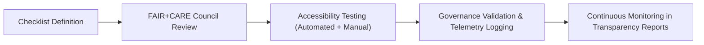

<div align="center">

# ✅ **Kansas Frontier Matrix — Accessibility Compliance Checklists**
`docs/accessibility/checklists/README.md`

**Purpose:**  
Provide standardized **accessibility and usability compliance checklists** for validating user interfaces, documents, and workflows across the **Kansas Frontier Matrix (KFM)** platform.  
These checklists ensure ongoing conformance with **WCAG 2.1 AA**, **ISO 9241-210**, and **FAIR+CARE** ethical inclusion standards under **Master Coder Protocol v6.3**.

[](../../README.md)
[](../../standards/faircare.md)
[](../../../LICENSE)
[](../../../releases/v10.0.0/manifest.zip)

</div>

---

## 📘 Overview

The **Accessibility Checklists** provide developers, designers, and auditors with a repeatable framework for verifying KFM interfaces and documentation meet inclusive design standards.  
Each checklist includes **manual**, **automated**, and **ethical validation steps** ensuring that accessibility is integrated from development to deployment.

These checklists complement:
- `docs/accessibility/testing-guide.md` — procedural testing documentation.  
- `docs/accessibility/audits/` — official accessibility and ethics audit reports.  
- `docs/design/tokens/accessibility-tokens.md` — design token references for WCAG compliance.

---

## 🗂️ Directory Layout

```
docs/accessibility/checklists/
├── README.md                           # This file
├── checklist-wcag2.1aa.md              # WCAG 2.1 AA compliance checklist
├── focus-navigation.md                 # Keyboard and focus behavior checklist
├── contrast-and-color.md               # Color contrast validation checklist
└── motion-and-animations.md            # Motion reduction and sensory safety checklist
```

---

## ♿ Core Checklist Categories

| Checklist | Purpose | Scope |
|---|---|---|
| **WCAG 2.1 AA** | Baseline compliance for all interactive components and content. | Entire KFM platform |
| **Keyboard & Focus** | Tests navigation order, focus visibility, and escape mechanisms. | Web and application UIs |
| **Color & Contrast** | Verifies color ratios and semantic token usage. | Design and content layers |
| **Motion & Sensory Safety** | Validates respect for motion preferences and cognitive comfort. | Animations, transitions, and data visualizations |
| **Document Accessibility** | Ensures markdown, PDF, and reports include heading, table, and alt text structure. | Documentation outputs |

---

## 🧠 FAIR+CARE Ethical Accessibility Alignment

| FAIR+CARE Principle | Accessibility Implementation |
|---|---|
| **Collective Benefit** | Accessibility ensures knowledge equity for all communities. |
| **Authority to Control** | Users define their own sensory, motion, and visual settings. |
| **Responsibility** | Accessibility issues are logged and remediated through transparent audits. |
| **Ethics** | Content avoids ableist or exclusionary design choices. |

All accessibility audits must include a **FAIR+CARE ethics subsection** evaluating inclusivity in language, tone, and design.

---

## 🧾 Example: WCAG 2.1 AA Checklist (Excerpt)

| Criterion | Requirement | Status | Notes |
|---|---|---|---|
| **1.1.1 Non-text Content** | All images, icons, and charts include alt text or `aria-label`. | ✅ |  |
| **1.3.1 Info & Relationships** | Content structure defined by semantic HTML. | ✅ | Use `<header>`, `<main>`, `<nav>`, `<footer>`. |
| **1.4.3 Contrast (Minimum)** | Text contrast ratio ≥ 4.5:1. | ⚠️ | Button hover states need retesting. |
| **2.1.1 Keyboard** | All functions operable via keyboard. | ✅ | Tab order validated. |
| **2.4.7 Focus Visible** | Focus indicator always visible. | ✅ | Uses `focus.outline.color` token. |
| **3.3.3 Error Suggestion** | Forms provide contextual error help. | ✅ | VoiceOver reads error states. |

---

## 🔍 Example: Focus Navigation Checklist (Excerpt)

| Test | Description | Pass | Notes |
|---|---|---|---|
| **Sequential Order** | Tab order follows visual hierarchy. | ✅ |  |
| **Focus Trap** | Modals contain focus until dismissed. | ✅ |  |
| **Escape Key Behavior** | ESC closes modals and returns focus. | ✅ |  |
| **Skip Links** | “Skip to Content” and “Skip to Navigation” available. | ⚠️ | Needs visible focus ring update. |
| **Keyboard Shortcuts** | Provide alternative to mouse gestures. | ✅ | Arrow keys navigate charts. |

---

## 🧩 Motion & Sensory Safety Checklist (Excerpt)

| Test | Description | Pass | Notes |
|---|---|---|---|
| **prefers-reduced-motion** | Animation disabled when user requests reduced motion. | ✅ | Verified via browser test. |
| **Animation Duration** | Motion transitions ≤ 200ms. | ✅ | Design tokens applied. |
| **Flashing Content** | No flashing > 3Hz. | ✅ | Video and charts validated. |
| **Parallax & Auto-scroll** | Disabled unless initiated by user. | ✅ | MapLibre checked. |

---

## ⚙️ Validation Workflows

| Workflow | Function | Output Artifact |
|---|---|---|
| `accessibility_scan.yml` | Runs automated Axe-core and Lighthouse tests. | `reports/self-validation/web/a11y_summary.json` |
| `storybook-a11y.yml` | Component-level accessibility scans. | `reports/ui/a11y_component_audits.json` |
| `faircare-visual-audit.yml` | Ethics alignment and inclusive design validation. | `reports/faircare-visual-validation.json` |
| `docs-lint.yml` | Documentation heading and alt text structure check. | `reports/docs/a11y_doc_validation.json` |

---

## 📊 Accessibility KPI Metrics

| Metric | Target | Verified By |
|---|---|---|
| **WCAG 2.1 AA Compliance** | 100% | CI & Manual Audits |
| **Keyboard Operability** | 100% | `storybook-a11y.yml` |
| **Color Contrast Compliance** | ≥ 4.5:1 | `design-tokens-validate.yml` |
| **Motion Preference Adherence** | 100% | Accessibility Council |
| **FAIR+CARE Ethics Alignment** | ≥ 95% | Council Audit |

---

## 🧮 Checklist Lifecycle



Checklists evolve quarterly based on updated WCAG standards, FAIR+CARE ethics evaluations, and community accessibility feedback.

---

## 🕰️ Version History

| Version | Date | Author | Summary |
|---|---|---|---|
| v10.0.0 | 2025-11-10 | FAIR+CARE Accessibility Council | Created universal accessibility compliance checklist framework integrating WCAG 2.1 AA, motion safety, and FAIR+CARE ethical design validation. |

---

<div align="center">

**© 2025 Kansas Frontier Matrix — CC-BY 4.0**  
Developed under **Master Coder Protocol v6.3** · FAIR+CARE Certified · Diamond⁹ Ω / Crown∞Ω Ultimate Certified  
[⬅ Back to Accessibility Index](../README.md) · [Audits →](../audits/README.md)

</div>