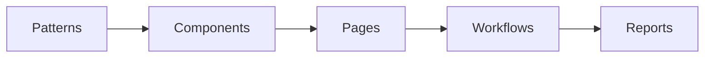

<div align="center">

# 🧩 **Kansas Frontier Matrix — Accessible UI Patterns and Components Index**
`docs/accessibility/patterns/README.md`

**Purpose:**  
Canonical index of **all accessibility patterns** used across the Kansas Frontier Matrix (KFM): web UI, geospatial tools, dashboards, archives, science workflows, and governance portals.  
Patterns are **WCAG 2.1 AA** and **FAIR+CARE** aligned, with reproducible validation and provenance.


</div>

---

## 📘 Overview

This directory provides **ready-to-use accessibility patterns** for KFM products, including:  
- Core web components (buttons, dialogs, forms, tables, media)  
- Geospatial and temporal interfaces (map controls, wayfinding, telemetry)  
- Scientific domains (hydrology, hazards, air quality, biodiversity, soil, genomics)  
- Governance and archives (legal, licensing, archival standards)  
- Education, exhibits, branding, and communication

Each pattern specifies **ARIA semantics**, **keyboard interactions**, **contrast rules**, **consent cues**, and **FAIR+CARE metadata**.

---

## 🗂️ Directory Layout

```bash
docs/accessibility/patterns/
├── README.md
├── alerts.md
├── buttons.md
├── charts.md
├── dialogs.md
├── forms.md
├── map-controls.md
├── media.md
├── navigation.md
├── tables.md
├── color-contrast.md
├── navigation-waypoints.md
├── historical-trails.md
├── parks-conservation.md
├── forestry-landcover.md
├── agroforestry-biomass.md
├── soil-health.md
├── prairie-restoration.md
├── biodiversity-habitats.md
├── wildlife-tracking.md
├── avian-ornithology.md
├── pollinators-ecosystem-services.md
├── microbiology-ecosystem-health.md
├── genetics-bioinformatics.md
├── biochemistry-environmental-chemistry.md
├── laboratory-methods.md
├── instrumentation-sensors.md
├── field-sensors-drone.md
├── telemetry-streams.md
├── network-infrastructure.md
├── api-exchange.md
├── computing-interface.md
├── data-infrastructure.md
├── archival-records.md
├── data-processing-automation.md
├── data-integration-validation.md
├── data-synchronization-versioning.md
├── branding-communication.md
├── focus-mode.md
├── cultural-ethics.md
├── localization.md
├── chat-interaction.md
├── narratives.md
├── legal-archives.md
├── exhibits.md
├── education.md
├── wayfinding.md
├── testing-validation.md
├── design-tokens.md
├── data-visualization-controls.md
├── system-controls.md
├── automation-telemetry.md
├── ai-explainability.md
├── environmental-dashboards.md
├── agriculture-resources.md
├── hydrology-water.md
├── hazards-emergency.md
├── climate-weather.md
├── air-quality.md
├── earth-systems.md
├── minerals-energy.md
├── infrastructure-utilities.md
├── urban-planning.md
├── transportation-mobility.md
├── vehicle-logistics.md
├── freight-corridors.md
├── rail-transit.md
├── aviation-airspace.md
├── space-remote-sensing.md
├── astronomy-spaceweather.md
├── cosmology-deepspace.md
└── planetarium-3d.md
```

> Related: see `../checklists/README.md` for implementer checklists and `../README.md` for the accessibility index.

---

## 🧩 Pattern Foundations

| Category | Principle | Description |
|---|---|---|
| **Keyboard Operability** | Navigable without a mouse | Tab, Shift+Tab, Enter, Space, Arrow keys, Esc |
| **Screen Reader Semantics** | Clear roles and labels | WAI-ARIA 1.2 patterns |
| **Focus Visibility** | Persistent, high-contrast outline | ≥ 3:1 focus indicator, no outline suppression |
| **Motion Sensitivity** | Respect user preferences | Honors `prefers-reduced-motion` |
| **Color Independence** | Redundant cues | Never color-only signals; text, shape, pattern |
| **Consent and Ethics** | FAIR+CARE cues | Gated layers, provenance, community consent |
| **Provenance** | Traceable lineage | STAC/DCAT and governance ledger references |

---

## 🧾 Required Metadata (All Patterns)

| Field | Purpose | Example |
|---|---|---|
| `data-origin` | Source or custodian | “USGS / KFM SensorNet” |
| `data-license` | License for reuse | “CC-BY 4.0” |
| `data-consent` | Public or gated | `true` |
| `data-ethics-reviewed` | FAIR+CARE audit | `true` |
| `data-provenance` | Lineage summary | “Derived 2025-11-11 from NOAA feed” |
| `data-sensitivity` | Access class | “Public / Restricted / Heritage” |

---

## 🧾 Validation and Automation

| Workflow | Scope | Output |
|---|---|---|
| `accessibility_scan.yml` | axe-core and Lighthouse | `reports/self-validation/web/a11y_summary.json` |
| `storybook-a11y.yml` | Component snapshots and jest-axe | `reports/ui/a11y_component_audits.json` |
| `color-contrast.yml` | Token and palette validation | `reports/ui/color-contrast.json` |
| `faircare-visual-audit.yml` | Tone and consent metadata | `reports/faircare/visual-validation.json` |

---

## 🧩 Integration Map



---

## 🧠 References

- WAI-ARIA Authoring Practices 1.2  
- WCAG 2.1 Quick Reference  
- Deque axe-core  
- FAIR+CARE Governance Charter (`../../standards/governance/ROOT-GOVERNANCE.md`)  

---

## 🕰️ Version History

| Version | Date | Author | Summary |
|---|---|---|---|
| v10.2.3 | 2025-11-11 | KFM A11y Guild | **Rebuild:** expanded directory layout to include all domain patterns; upgraded telemetry schema v2; aligned with MCP-DL v6.3 and Platinum v7.1. |
| v10.0.0 | 2025-11-10 | A11y & FAIR+CARE Council | Initial consolidated index; core UI patterns and validation pipelines. |

---

<div align="center">

© 2025 Kansas Frontier Matrix · Master Coder Protocol v6.3  
**FAIR+CARE Certified · Diamond⁹ Ω / Crown∞Ω Ultimate Certified**

[Back to Accessibility Index](../README.md) · [Governance Charter](../../standards/governance/ROOT-GOVERNANCE.md)

</div>
