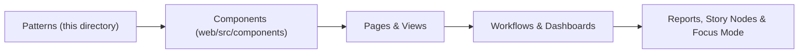

<div align="center">

# 🧩 **Kansas Frontier Matrix — Accessible UI Patterns and Components Index**  
`docs/accessibility/patterns/README.md`

**Purpose:**  
Canonical index of **all accessibility patterns** used across the Kansas Frontier Matrix (KFM): web UI, geospatial tools, dashboards, archives, science workflows, and governance portals.  
Patterns are **WCAG 2.1 AA** and **FAIR+CARE** aligned, with reproducible validation, telemetry, and provenance.


</div>

---

## 📘 Overview

This directory provides **ready-to-use accessibility patterns** for KFM, covering:

- Core web components (buttons, dialogs, forms, tables, media, alerts)  
- Geospatial and temporal interfaces (map controls, wayfinding, telemetry, navigation)  
- Scientific and domain-specific modules (hydrology, hazards, air quality, biodiversity, soil, genomics, agriculture, energy, space)  
- Governance and archival systems (legal records, licensing, documentation, preservation)  
- Communication, education, and experiential layers (exhibits, narratives, Focus Mode, branding)

Each pattern specifies:

- **ARIA semantics** and regions  
- **Keyboard interactions** and focus behavior  
- **Contrast and motion rules**  
- **Consent, ethics, and provenance cues**  
- **FAIR+CARE metadata expectations**

---

## 🗂️ Directory Layout

```text
docs/accessibility/patterns/
├── README.md
├── alerts.md
├── buttons.md
├── charts.md
├── dialogs.md
├── forms.md
├── tooltips.md
├── map-controls.md
├── media.md
├── navigation.md
├── tables.md
├── color-contrast.md
├── navigation-waypoints.md
├── historical-trails.md
├── parks-conservation.md
├── forestry-landcover.md
├── agroforestry-biomass.md
├── soil-health.md
├── prairie-restoration.md
├── biodiversity-habitats.md
├── wildlife-tracking.md
├── avian-ornithology.md
├── pollinators-ecosystem-services.md
├── microbiology-ecosystem-health.md
├── genetics-bioinformatics.md
├── biochemistry-environmental-chemistry.md
├── laboratory-methods.md
├── instrumentation-sensors.md
├── field-sensors-drone.md
├── telemetry-streams.md
├── network-infrastructure.md
├── api-exchange.md
├── computing-interface.md
├── data-infrastructure.md
├── archival-records.md
├── data-processing-automation.md
├── data-integration-validation.md
├── data-synchronization-versioning.md
├── branding-communication.md
├── focus-mode.md
├── cultural-ethics.md
├── localization.md
├── chat-interaction.md
├── narratives.md
├── legal-archives.md
├── exhibits.md
├── education.md
├── wayfinding.md
├── testing-validation.md
├── design-tokens.md
├── data-visualization-controls.md
├── system-controls.md
├── automation-telemetry.md
├── ai-explainability.md
├── environmental-dashboards.md
├── agriculture-resources.md
├── hydrology-water.md
├── hazards-emergency.md
├── climate-weather.md
├── air-quality.md
├── earth-systems.md
├── minerals-energy.md
├── infrastructure-utilities.md
├── urban-planning.md
├── transportation-mobility.md
├── vehicle-logistics.md
├── freight-corridors.md
├── rail-transit.md
├── aviation-airspace.md
├── space-remote-sensing.md
├── astronomy-spaceweather.md
├── cosmology-deepspace.md
└── planetarium-3d.md
```

> Related: see `../checklists/README.md` for implementer checklists and `../README.md` for the global accessibility index.

---

## 🧩 Pattern Foundations

| Category                | Principle                         | Description                                                                 |
|-------------------------|-----------------------------------|-----------------------------------------------------------------------------|
| **Keyboard Operability**| Navigable without a mouse         | Tab, Shift+Tab, Enter, Space, Arrow keys, Esc                              |
| **Screen Reader Semantics** | Clear roles and labels       | WAI-ARIA 1.2 landmarks, roles, states                                      |
| **Focus Visibility**    | Persistent, high-contrast outline | ≥ 3:1 focus indicator, no outline suppression                             |
| **Motion Sensitivity**  | Respect user preferences          | Honors `prefers-reduced-motion`; no flashing > 3 Hz                        |
| **Color Independence**  | Redundant cues                    | Never color-only signals; use text, icons, pattern, and shape              |
| **Consent & Ethics**    | FAIR+CARE cues                    | Gated layers, cultural stewardship flags, consent and sensitivity metadata |
| **Provenance**          | Traceable lineage                 | STAC/DCAT, model cards, telemetry, and governance ledger references        |

---

## 🧾 Required Metadata (All Patterns)

Every pattern’s example metadata MUST support:

| Field             | Purpose             | Example                                          |
|-------------------|--------------------|--------------------------------------------------|
| `data-origin`     | Source or custodian| `"USGS / KFM SensorNet"`                        |
| `data-license`    | Reuse license      | `"CC-BY 4.0"`                                   |
| `data-consent`    | Consent status     | `true`                                          |
| `data-ethics-reviewed` | FAIR+CARE audit flag | `true`                                   |
| `data-provenance` | Lineage summary    | `"Derived 2025-11-11 from NOAA feed"`           |
| `data-sensitivity`| Access class       | `"Public / Restricted / Heritage"`              |

Patterns may extend this with domain-specific fields (e.g., `data-units`, `uncertainty`, `location-generalization`, `indigenous-sky-knowledge-consent`).

---

## 🧾 Validation and Automation

| Workflow                    | Scope                                   | Output                                                   |
|----------------------------|-----------------------------------------|----------------------------------------------------------|
| `accessibility_scan.yml`   | axe-core + Lighthouse across web        | `reports/self-validation/web/a11y_summary.json`          |
| `storybook-a11y.yml`       | Component patterns via jest-axe         | `reports/ui/a11y_component_audits.json`                  |
| `color-contrast.yml`       | Palette & token contrast check          | `reports/ui/color-contrast.json`                         |
| `faircare-visual-audit.yml`| Tone, imagery, consent & ethics metadata| `reports/faircare/visual-validation.json`                |

These workflows are required for all pattern-related changes and wired into **.github/workflows/** via the GitHub Architecture standards.

---

## 🧩 Pattern Integration Map



Patterns → Components → Pages → Workflows → Reports must preserve:

- Keyboard operability  
- ARIA semantics  
- FAIR+CARE metadata  
- Telemetry signals

---

## 🧠 References

- WAI-ARIA Authoring Practices 1.2  
- WCAG 2.1 Quick Reference  
- Deque axe-core & jest-axe integrations  
- FAIR+CARE Governance Charter (`../../standards/governance/ROOT-GOVERNANCE.md`)  
- KFM Markdown Structural & Formatting Rules (`../../standards/markdown_rules.md`)  

---

## 🕰️ Version History

| Version | Date       | Author              | Summary                                                                                               |
|--------:|------------|---------------------|-------------------------------------------------------------------------------------------------------|
| v10.4.1 | 2025-11-16 | KFM Accessibility Council | Upgraded to KFM-MDP v10.4.3; added extended YAML metadata, tooltips pattern, and clarified validation workflows. |
| v10.2.3 | 2025-11-11 | KFM A11y Guild      | Rebuild: expanded directory layout; telemetry schema v2; aligned with MCP-DL v6.3 and Platinum v7.1. |
| v10.0.0 | 2025-11-10 | A11y & FAIR+CARE Council | Initial consolidated index; core UI patterns and validation pipelines.                               |

---

<div align="center">

© 2025 Kansas Frontier Matrix · Master Coder Protocol v6.3  
**FAIR+CARE Certified · Diamond⁹ Ω / Crown∞Ω Ultimate Certified**

[Back to Accessibility Index](../README.md) · [Governance Charter](../../standards/governance/ROOT-GOVERNANCE.md)

</div>