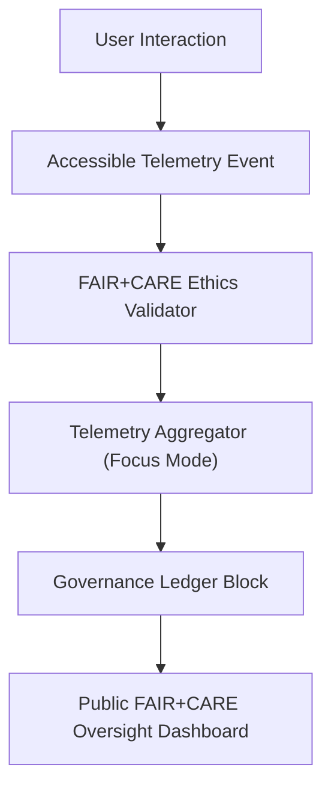

<div align="center">

# ⚙️ **Kansas Frontier Matrix — Accessible Automation, Workflow, and Telemetry Integration Standards**  
`docs/accessibility/patterns/automation-telemetry.md`

**Purpose:**  
Define strict **accessibility**, **transparency**, and **FAIR+CARE-governed** standards for all **automated workflows**, **CI pipelines**, and **real-time telemetry systems** within the Kansas Frontier Matrix (KFM).  
Ensure that every automated process — from validation pipelines to adaptive telemetry — remains **explainable**, **auditable**, **assistive-technology friendly**, and **ethically consented**.


</div>

---

## 📘 Overview

Automation and telemetry form the **governance backbone** of the Kansas Frontier Matrix:

- CI pipelines validate accessibility, metadata integrity, and FAIR+CARE compliance.  
- Telemetry logs record user interactions, accessibility metrics, and energy footprint.  
- Workflow dashboards provide screen-reader-ready summaries of system state.  
- All automated behaviors must be **explainable**, **cancelable**, and **consent-based**.

Automation must *never* bypass user intent, override consent, or hide operational effects.

---

## 🧩 Accessible Automation Principles

| Principle | Description | FAIR+CARE Ref |
|----------|-------------|----------------|
| Explainable Automation | Automated steps include human-readable purpose & outputs. | FAIR F-2 |
| Non-Disruptive Feedback | No flashing, shaking, or motion-based alerts. | WCAG 2.3.3 |
| Telemetry Consent | Opt-in required before any data collection. | CARE A-2 |
| Machine Output Accessibility | All logs as accessible JSON/Markdown. | FAIR R-1 |
| Continuous A11y Validation | Pipelines enforce WCAG 2.1 AA before merging. | MCP-DL v6.3 |
| Ethical Traceability | Each job annotated with provenance metadata. | CARE R-1 |

---

## 🧭 Example Accessible CI Workflow (GitHub Actions)

```yaml
name: kfm_accessibility_validation
on:
  push:
    branches: [ main ]

jobs:
  a11y_validate:
    runs-on: ubuntu-latest
    steps:
      - name: Checkout Repository
        uses: actions/checkout@v4

      - name: Install Dependencies
        run: npm ci

      - name: Run axe-core Accessibility Audit
        run: npm run test:a11y --silent

      - name: FAIR+CARE Ethics Validation
        run: node scripts/faircare-validate.js --out reports/faircare/a11y_ethics.json

      - name: Upload Validation Reports
        uses: actions/upload-artifact@v4
        with:
          name: a11y-validation
          path: reports/
```

### Accessibility Requirements

- Logs must **not rely on color-only** formatting (e.g., `✔` + text instead of ANSI color).  
- Ethics review is required for:  
  - Tone analysis  
  - Bias detection  
  - Consent schema validation  
- Outputs must be readable by AT users and linkable from governance dashboards.

---

## 🧩 Accessible Telemetry Schema (FAIR+CARE)

| Field | Type | Description |
|--------|------|-------------|
| `user_consent` | Boolean | Explicit opt-in before telemetry is recorded |
| `event_type` | String | e.g., `keyboard`, `map_pan`, `zoom`, `a11y-focus` |
| `focus_visibility` | Number | 0–1 metric for measurable focus highlight visibility |
| `reduced_motion` | Boolean | Captured from OS/API preference |
| `device_context` | Object | OS, browser, input modality |
| `timestamp` | ISO 8601 | Log timestamp |
| `provenance_chain` | Array | Governance trail of related events |

### Example Telemetry JSON

```json
{
  "user_consent": true,
  "event_type": "keyboard",
  "focus_visibility": 1.0,
  "reduced_motion": true,
  "device_context": { "os": "Linux", "browser": "Chrome", "input": "keyboard" },
  "timestamp": "2025-11-16T18:46:00Z",
  "provenance_chain": ["ledger:event:telemetry#5041"]
}
```

---

## 🧩 Automation & Telemetry Lifecycle (FAIR+CARE)



---

## 🧪 Validation & Reporting Tools

| Tool | Function | Output |
|-------|----------|--------|
| **axe-core** | A11y validation of UI surfaces | `reports/self-validation/web/a11y_automation.json` |
| **Faircare Ethics Script** | Tone, consent, and metadata ethics | `reports/faircare/a11y_ethics.json` |
| **Telemetry Schema Validator** | Ensures telemetry JSON aligns with schema | `reports/self-validation/web/telemetry_schema.json` |
| **Lighthouse CI** | Checks non-disruptive feedback & focus paths | `reports/ui/lighthouse_automation.json` |
| **Manual QA** | FAIR+CARE Council audit of workflow tone | `governance-ledger.json` |

---

## 🎨 Design Tokens for Automation UIs

| Token | Description | Example |
|--------|-------------|---------|
| `automation.bg.color` | Panel background | `#F5F5F5` |
| `automation.text.color` | Text color | `#212121` |
| `automation.focus.color` | Focus outline | `#FFD54F` |
| `automation.success.color` | Success state | `#43A047` |
| `automation.alert.color` | Alert state | `#E53935` |
| `automation.progress.color` | Progress bar | `#42A5F5` |

---

## ⚖️ FAIR+CARE Integration

| Principle | Implementation |
|------------|----------------|
| **Collective Benefit** | Transparent automation improves reliability and public trust. |
| **Authority to Control** | Users may disable telemetry or restrict retention windows. |
| **Responsibility** | All reports and logs stored with tamper-resistant provenance. |
| **Ethics** | Workflow language must remain neutral, non-alarmist, and inclusive. |

---

## 🕰️ Version History

| Version | Date | Author | Summary |
|---------|--------|---------|---------|
| v10.4.1 | 2025-11-16 | FAIR+CARE Council | Upgraded to KFM-MDP v10.4.3, added extended YAML, lifecycle metadata, and ethics-provenance chaining. |
| v10.0.0 | 2025-11-11 | FAIR+CARE Council | Initial automation & telemetry accessibility standard with FAIR+CARE integration. |

---

<div align="center">

© 2025 Kansas Frontier Matrix — CC-BY 4.0  
Master Coder Protocol v6.3 · Verified by **FAIR+CARE Council**  
[⬅ Back to Accessibility Patterns Index](../README.md)

</div>