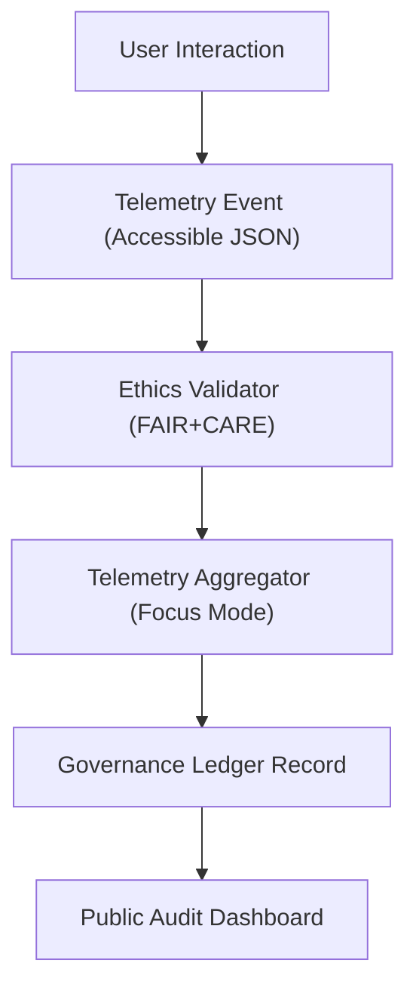

<div align="center">

# ⚙️ **Kansas Frontier Matrix — Accessible Automation, Workflow, and Telemetry Integration Standards**
`docs/accessibility/patterns/automation-telemetry.md`

**Purpose:**  
Establish accessibility, traceability, and FAIR+CARE governance standards for **automated workflows**, **continuous telemetry systems**, and **adaptive user feedback loops** within Kansas Frontier Matrix (KFM) — ensuring every automated interaction remains **explainable, transparent, and accessible** under **MCP-DL v6.3** and **WCAG 2.1 AA**.


</div>

---

## 📘 Overview

Automation and telemetry power the **continuous validation layer** of the Kansas Frontier Matrix.  
These standards guarantee that every automated system — from build workflows to focus telemetry collection — adheres to **human-readable ethics**, **a11y reporting transparency**, and **user consent**.

---

## 🧩 Accessible Automation Principles

| Principle | Description | FAIR+CARE Reference |
|------------|--------------|----------------------|
| **Explainable Automation** | Each automated task includes human-readable purpose and output logs. | FAIR F-2 |
| **Non-Disruptive Feedback** | Workflow messages avoid intrusive pop-ups or motion cues. | WCAG 2.3.3 |
| **Telemetry Consent** | Data collection gated behind explicit user opt-in. | CARE A-2 |
| **Machine Output Accessibility** | Reports and logs generated in accessible JSON or Markdown. | FAIR R-1 |
| **Continuous Validation** | A11y audits automatically run during each CI pipeline. | MCP-DL v6.3 |
| **Ethical Traceability** | Every job annotated with provenance, date, and governance signature. | CARE R-1 |

---

## 🧭 Example Accessible Workflow

```yaml
name: accessibility_validation
on:
  push:
    branches: [ main ]
jobs:
  validate_a11y:
    runs-on: ubuntu-latest
    steps:
      - name: Checkout Repository
        uses: actions/checkout@v3
      - name: Run axe-core Audit
        run: npm run test:a11y
      - name: FAIR+CARE Ethics Review Hook
        run: node scripts/faircare-validate.js --export=reports/faircare/a11y_ethics.json
      - name: Upload Reports
        uses: actions/upload-artifact@v3
        with:
          name: a11y-validation
          path: reports/
```

**Accessibility Notes**
- All automated steps use plain-text log output (no ANSI color-only indicators).  
- Ethics scripts validate both language tone and consent metadata.  
- Generated artifacts are readable by screen readers (structured JSON, Markdown).  

---

## 🧩 Telemetry Accessibility Schema

| Field | Type | Description |
|--------|------|-------------|
| `user_consent` | Boolean | Explicit opt-in to telemetry tracking |
| `interaction_type` | String | Event type (keyboard, voice, mouse, touch) |
| `a11y_focus_score` | Number | Real-time focus visibility metric |
| `reduced_motion_enabled` | Boolean | Captured from user preference API |
| `device_context` | Object | Platform and input modality data |
| `timestamp` | ISO 8601 | Log time for governance review |

**Telemetry JSON Example:**
```json
{
  "user_consent": true,
  "interaction_type": "keyboard",
  "a11y_focus_score": 1.0,
  "reduced_motion_enabled": true,
  "device_context": { "os": "Windows", "browser": "Firefox" },
  "timestamp": "2025-11-11T18:45:00Z"
}
```

---

## ⚙️ FAIR+CARE Telemetry Lifecycle



---

## 🧪 Validation & Reporting Tools

| Tool | Function | Output |
|-------|-----------|--------|
| **axe-core** | A11y validation during workflow | `reports/self-validation/web/a11y_automation.json` |
| **Faircare Ethics Script** | Scans automation text for tone and bias | `reports/faircare/a11y_ethics.json` |
| **Telemetry Validator** | Checks schema compliance for focus telemetry | `reports/self-validation/web/telemetry_schema.json` |
| **Lighthouse CI** | Monitors real-time feedback surfaces | `reports/ui/lighthouse_automation.json` |
| **Manual QA** | Council review of workflow logs and tone | FAIR+CARE audit ledger |

---

## ⚖️ FAIR+CARE Integration

| Principle | Implementation |
|------------|----------------|
| **Collective Benefit** | Transparent automation improves accessibility reliability. |
| **Authority to Control** | Users can disable telemetry or limit retention scope. |
| **Responsibility** | Automated reports archived with full provenance chain. |
| **Ethics** | Workflow language validated to remain neutral and respectful. |

---

## 🕰️ Version History

| Version | Date | Author | Summary |
|----------|------|---------|----------|
| v10.0.0 | 2025-11-11 | FAIR+CARE Council | Introduced accessible automation and telemetry standards, FAIR+CARE schema integration, and ethics-linked CI validation framework. |

---

<div align="center">

**© 2025 Kansas Frontier Matrix — CC-BY 4.0**  
Developed under **Master Coder Protocol v6.3** · Verified by **FAIR+CARE Council**  
[⬅ Back to Accessibility Index](README.md)

</div>
