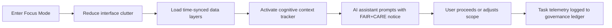

<div align="center">

# 🧠 **Kansas Frontier Matrix — Accessible Cognitive Load & Focus Mode Design**
`docs/accessibility/patterns/focus-mode.md`

**Purpose:**  
Establish accessibility and cognitive ergonomics principles for the **Focus Mode** interface and task workflows in KFM — ensuring **reduced cognitive load**, **keyboard-first navigation**, and **FAIR+CARE-informed consent handling** across intensive analytical environments.


</div>

---

## 📘 Overview

**Focus Mode** in the Kansas Frontier Matrix presents complex analytical data, time-aware layers, and AI-driven recommendations in a **cognitively simplified environment**.  
This pattern defines **perceptual clarity**, **task segmentation**, and **assistive state awareness**, based on WCAG 2.1 and **ISO 9241-210** human-centered design standards.

---

## 🧩 Cognitive Accessibility Principles

| Principle | Description | WCAG / ISO Reference |
|------------|--------------|----------------------|
| **Reduced Load** | Limit simultaneous information units (≤ 5 visual clusters). | ISO 9241-112 §6.3.2 |
| **Context Preservation** | Users can pause/resume analytical flow with data snapshot. | WCAG 2.2.1 |
| **Assistive Transparency** | AI suggestions and automation clearly disclosed with rationale. | FAIR+CARE Ethics |
| **Progressive Disclosure** | Reveal complexity stepwise; default to simplified state. | WCAG 3.3.4 |
| **Predictable Interaction** | UI transitions maintain user focus without motion surprise. | WCAG 2.3.3 |
| **Trust & Consent** | Cognitive agents require opt-in confirmation and data scope note. | CARE A-2 / E-1 |

---

## 🧭 Focus Mode Accessibility Flow



---

## ⚙️ Functional Design Tokens

| Token | Description | Example |
|--------|--------------|---------|
| `focusmode.bg` | Background color for reduced-distraction layout | `#121212` |
| `focusmode.text.color` | Text contrast color | `#FAFAFA` |
| `focusmode.focus.outline` | Keyboard focus indicator | `#FFD54F` |
| `focusmode.animation.speed` | Transition timing | `0.25s` |
| `focusmode.ai.notice.bg` | FAIR+CARE consent banner background | `#FFF8E1` |

---

## 🧾 FAIR+CARE Interaction Framework

| Interaction | Consent / Notice | Description |
|--------------|------------------|--------------|
| AI Recommendation | `data-ai-source="focus_transformer_v1"` | Discloses model source & bias mitigation |
| Cognitive Log | `data-consent="true"` | Records user focus intervals for telemetry |
| Layer Toggle | `aria-pressed` with ethical tag | Marks contextual layer activation |
| Pause Action | `role="button"` + `aria-label="Pause Focus Session"` | Grants session control |

Example:
```html
<div class="ai-notice" role="alert" aria-live="polite" data-ai-source="focus_transformer_v1">
  💡 Suggestion from AI model: Consider overlaying 1890–1920 hydrology data.
  <a href="#faircare-ai">Learn how suggestions are generated.</a>
</div>
```

---

## 🧠 Cognitive Ergonomics Checklist

| Check | Target |
|--------|--------|
| Text readability ≥ 4.5:1 contrast |
| Font scaling responds to user preferences |
| Focus path visible at all times |
| No animated elements longer than 3s without controls |
| Provide immediate “Exit Focus Mode” shortcut (`Esc`) |
| Save user progress state persistently with opt-in |

---

## 🧪 Validation & Metrics

| Tool | Purpose | Output |
|-------|----------|--------|
| **axe-core** | Semantic and focus validation | `reports/self-validation/web/a11y_focusmode.json` |
| **Lighthouse CI** | Animation and motion compliance | `reports/ui/lighthouse_focusmode.json` |
| **jest-axe** | Focus component testing | `reports/ui/a11y_focus_components.json` |
| **Manual Audit** | Cognitive load evaluation (Council) | FAIR+CARE audit log |

---

## ⚖️ FAIR+CARE Integration

| Principle | Implementation |
|------------|----------------|
| **Collective Benefit** | Focus Mode designed for accessibility-first analytics clarity. |
| **Authority to Control** | User maintains agency over AI insight visibility and consent. |
| **Responsibility** | Cognitive telemetry anonymized and logged transparently. |
| **Ethics** | Interface avoids manipulative or high-pressure prompts. |

---

## 🕰️ Version History

| Version | Date | Author | Summary |
|----------|------|---------|----------|
| v10.0.0 | 2025-11-11 | FAIR+CARE A11y Council | Introduced cognitive accessibility pattern for Focus Mode; integrated AI consent, ergonomics, and telemetry validation. |

---

<div align="center">

**© 2025 Kansas Frontier Matrix — CC-BY 4.0**  
Developed under **Master Coder Protocol v6.3** · Verified by **FAIR+CARE Council**  
[⬅ Back to A11y Patterns Index](README.md)

</div>

