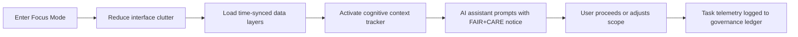

<div align="center">

# 🧠 **Kansas Frontier Matrix — Accessible Cognitive Load & Focus Mode Design**  
`docs/accessibility/patterns/focus-mode.md`

**Purpose:**  
Establish accessibility and cognitive ergonomics principles for the **Focus Mode** interface and task workflows in KFM — ensuring **reduced cognitive load**, **keyboard-first navigation**, and **FAIR+CARE-informed consent handling** across intensive analytical environments.


</div>

---

## 📘 Overview

**Focus Mode** in the Kansas Frontier Matrix presents complex analytical data, time-aware layers, and AI-driven recommendations within a **cognitively simplified environment**.

This pattern defines:

- Perceptual clarity and reduced visual clutter  
- Task segmentation and progressive disclosure  
- Assistive state awareness (focus, pause, AI suggestions)  
- FAIR+CARE-aligned consent and telemetry practices  

Standards are based on **WCAG 2.1 AA**, **ISO 9241-210** (human-centered design), and **FAIR+CARE** ethics.

---

## 🗂️ Directory Context

```text
docs/accessibility/
│
└── patterns/
    ├── focus-mode.md              # This file
    ├── forms.md
    ├── navigation.md
    ├── media.md
    └── ...
```

---

## 🧩 Cognitive Accessibility Principles

| Principle              | Description                                                   | WCAG / ISO Reference      |
|------------------------|---------------------------------------------------------------|---------------------------|
| Reduced Load           | Limit simultaneous information units (≈ ≤ 5 visual clusters). | ISO 9241-112 §6.3.2       |
| Context Preservation   | Allow pause/resume with clear “return-to-task” cues.          | WCAG 2.2.1 / 2.4.3        |
| Assistive Transparency | AI suggestions clearly labeled with provenance & scope.       | FAIR+CARE AI Ethics       |
| Progressive Disclosure | Reveal complexity stepwise; default to a simplified state.    | WCAG 3.3.4                |
| Predictable Interaction| UI transitions reduce surprise; minimal motion by default.    | WCAG 2.3.3 / XAUR         |
| Trust & Consent        | Cognitive agents and logs only enabled with explicit opt-in.  | CARE A-2 / CARE E-1       |

---

## 🧭 Focus Mode Accessibility Flow



### Flow Notes

- **A → B:** Non-essential panels hidden; main content area clearly labeled with `role="main"`.  
- **C:** Only necessary layers loaded; others available via progressive disclosure.  
- **D:** Context tracker maintains current entity/timeframe and task state.  
- **E:** AI suggestions are opt-in and clearly marked as model-generated.  
- **G:** Telemetry captures performance, not identity; governed by FAIR+CARE.  

---

## 🎨 Functional Design Tokens

| Token                    | Description                                | Example Value |
|--------------------------|--------------------------------------------|---------------|
| `focusmode.bg`          | Background color for reduced-distraction   | `#121212`     |
| `focusmode.text.color`  | Primary text color                         | `#FAFAFA`     |
| `focusmode.focus.outline` | Focus outline color                      | `#FFD54F`     |
| `focusmode.animation.speed` | Transition timing                      | `0.25s`       |
| `focusmode.ai.notice.bg` | Banner background for AI/FAIR+CARE notice | `#FFF8E1`     |

---

## 🧾 FAIR+CARE Interaction Framework

| Interaction       | Required Metadata / Behavior              | Description                                      |
|-------------------|-------------------------------------------|--------------------------------------------------|
| AI Recommendation | `data-ai-source="focus_transformer_v1"`   | Discloses model and version used                 |
| Cognitive Log     | `data-consent="true"` on logging elements | Records focus intervals only with opt-in         |
| Layer Toggle      | `aria-pressed` + ethical tags             | Captures which contextual layers are active      |
| Pause Session     | Button with `role="button"` & descriptive label | Allows pausing cognitive session          |

Example AI Notice:

```html
<div
  class="ai-notice"
  role="alert"
  aria-live="polite"
  data-ai-source="focus_transformer_v1"
>
  💡 Suggestion from AI model: Consider overlaying 1890–1920 hydrology data.
  <a href="#faircare-ai">Learn how suggestions are generated.</a>
</div>
```

---

## 🧠 Cognitive Ergonomics Checklist

| Checkpoint                               | Target / Rule                                          |
|------------------------------------------|--------------------------------------------------------|
| Visual clusters                          | ≈ ≤ 5 major panels visible at once                    |
| Text contrast                            | ≥ 4.5:1 for all body and UI text                      |
| Respects user font preferences           | Honors browser/OS font size settings                  |
| Focus path visibility                    | Focus outline present on all actionable elements      |
| Motion control                           | No non-essential animation > 3s without controls      |
| Escape shortcut                          | `Esc` exits Focus Mode or returns to previous context |
| State persistence                        | Option to save and restore Focus Mode sessions        |

---

## ⚙️ Example Keyboard & ARIA Semantics

| Key / Attribute    | Behavior                            | Example Implementation                     |
|--------------------|--------------------------------------|--------------------------------------------|
| `Tab` / `Shift+Tab`| Moves focus among primary panels     | Panels ordered by task flow                |
| `Enter` / `Space`  | Activates highlighted action         | Play/pause, apply filter, accept suggestion|
| `Esc`              | Exit Focus Mode / close overlays     | Always available, documented in UI         |
| `aria-live="polite"` | Announces non-critical updates     | “Layer loaded”, “Context saved”            |
| `aria-live="assertive"` | Reserved for critical errors   | “Unable to save state; retry required.”    |

---

## 🧪 Validation & Metrics

| Tool         | Purpose                                    | Output                                      |
|--------------|--------------------------------------------|---------------------------------------------|
| axe-core     | Semantic and focus validation              | `reports/self-validation/web/a11y_focusmode.json` |
| Lighthouse CI| Animation, motion, and performance scoring | `reports/ui/lighthouse_focusmode.json`      |
| jest-axe     | Component-level Focus Mode UI tests        | `reports/ui/a11y_focus_components.json`     |
| Manual Audit | Cognitive load & ergonomics review         | FAIR+CARE audit log                         |

Telemetry metrics to monitor (aggregated, anonymized):

- Average session duration  
- Number of active panels per session  
- Frequency of “Exit Focus Mode” usage  
- AI suggestion acceptance ratio (without user identification)  

---

## ⚖️ FAIR+CARE Integration

| Principle           | Implementation                                                                    |
|---------------------|------------------------------------------------------------------------------------|
| Collective Benefit  | Focus Mode is designed for clarity, not for attention capture or pressure.        |
| Authority to Control| Users control AI suggestion visibility and cognitive telemetry opt-in.            |
| Responsibility      | All Focus Mode logs anonymized and stored with governance-lineage metadata.       |
| Ethics              | Interface avoids manipulative prompts, dark patterns, or urgency cues for non-critical tasks. |

---

## 🕰️ Version History

| Version | Date       | Author                | Summary                                                                                          |
|--------:|------------|-----------------------|--------------------------------------------------------------------------------------------------|
| v10.4.1 | 2025-11-16 | Accessibility Council | Upgraded to KFM-MDP v10.4.3; added extended metadata, ergonomics checklist, and one-box formatting. |
| v10.0.0 | 2025-11-11 | FAIR+CARE A11y Council| Introduced cognitive accessibility pattern for Focus Mode; integrated AI consent, ergonomics, and telemetry validation. |

---

<div align="center">

© 2025 Kansas Frontier Matrix — CC-BY 4.0  
Developed under **Master Coder Protocol v6.3** · Verified by **FAIR+CARE Council**  
[⬅ Back to Accessibility Patterns Index](../README.md)

</div>