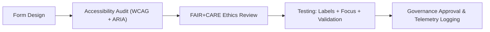

<div align="center">

# 🧾 **Kansas Frontier Matrix — Accessible Forms & Validation Patterns**
`docs/accessibility/patterns/forms.md`

**Purpose:**  
Define accessible, ethical, and inclusive **form interaction patterns** for the **Kansas Frontier Matrix (KFM)** platform, ensuring conformance with **WCAG 2.1 AA**, **WAI-ARIA 1.2**, and **FAIR+CARE** ethical data collection standards.

[](../../README.md)
[](../../standards/faircare.md)
[](../../../LICENSE)
[](../../../releases/v10.0.0/manifest.zip)

</div>

---

## 📘 Overview

Forms are among the most **critical accessibility touchpoints** in KFM. They serve as gateways for data input, consent acknowledgment, and participation in governance or scientific workflows.  
This pattern standardizes:
- Labeling, grouping, and ARIA annotation  
- Focus and keyboard navigation  
- Error handling and live feedback  
- Ethical language and inclusive consent statements  
- FAIR+CARE compliance for ethical data collection  

---

## 🗂️ Directory Context

```
docs/accessibility/patterns/
├── README.md
├── alerts.md
├── buttons.md
├── charts.md
├── dialogs.md
├── forms.md              # ← This file
├── map-controls.md
└── navigation.md
```

---

## ♿ Accessibility Standards

| Requirement | Description | WCAG / ARIA |
|---|---|---|
| **Labeling** | Each input, checkbox, and button must have a visible and programmatic label linked via `for` and `id`. | 1.1.1 / 2.4.6 |
| **Grouping** | Use `<fieldset>` + `<legend>` to group related inputs. | 1.3.1 |
| **Focus Order** | Logical top-to-bottom tab order with visible focus outline. | 2.4.3 / 2.4.7 |
| **Error Identification** | Invalid fields use `aria-invalid="true"` and clear error text. | 3.3.1 |
| **Error Suggestion** | Provide actionable instructions for fixing errors. | 3.3.3 |
| **Required Fields** | Indicate visually and via `aria-required="true"`. | 3.3.2 |
| **Live Validation** | Use `aria-live="polite"` for inline validation messages. | 4.1.3 |
| **Consent Text** | Include FAIR+CARE consent disclosures before submission. | FAIR+CARE Ethics |

---

## 🧩 Example: Form Structure with Accessibility Hooks

```tsx
<form aria-labelledby="dataset-form-title" aria-describedby="dataset-form-summary">
  <h2 id="dataset-form-title" className="text-xl font-semibold text-primary">
    Submit a New Dataset
  </h2>
  <p id="dataset-form-summary" className="text-sm text-muted mb-3">
    Please complete the required fields below. All submissions must comply with FAIR+CARE ethical data use guidelines.
  </p>

  <fieldset className="mb-4">
    <legend className="font-semibold text-body">Dataset Details</legend>
    <label htmlFor="dataset-title" className="block mt-2">Dataset Title *</label>
    <input
      id="dataset-title"
      name="dataset-title"
      type="text"
      aria-required="true"
      aria-invalid="false"
      className="w-full border border-neutral-300 p-2 rounded focus:ring-4 focus:ring-[#FFB300]"
    />
    <p id="title-hint" className="text-xs text-muted mt-1">Provide a descriptive title for the dataset.</p>
  </fieldset>

  <fieldset>
    <legend className="font-semibold text-body">Data License</legend>
    <label htmlFor="license">Select a license *</label>
    <select id="license" name="license" aria-required="true" className="w-full p-2 border border-neutral-300 rounded">
      <option value="">Choose one...</option>
      <option value="cc-by-4.0">CC-BY 4.0</option>
      <option value="cc0">CC0 (Public Domain)</option>
    </select>
  </fieldset>

  <div className="mt-4">
    <label htmlFor="consent" className="inline-flex items-center">
      <input
        type="checkbox"
        id="consent"
        name="consent"
        aria-required="true"
        className="mr-2 focus:ring-4 focus:ring-[#FFB300]"
      />
      I consent to FAIR+CARE ethical data governance and public release.
    </label>
  </div>

  <button type="submit" className="btn-primary mt-4" aria-label="Submit dataset">Submit</button>
</form>
```

**Accessibility Features**
- Labels explicitly linked with inputs.  
- Error and help text accessible via `aria-describedby`.  
- `aria-live` used for inline feedback messages.  
- Keyboard traversal follows DOM structure.  

---

## ⚠️ Example: Inline Validation Feedback

```tsx
<div className="mt-2" aria-live="polite" id="license-feedback">
  <span className="text-error text-sm">Please select a license before submitting.</span>
</div>
```

- Only trigger message updates when input changes.  
- Use **polite** announcements to avoid disruption.  

---

## 🎛️ Error Message Pattern

| Element | Attribute | Example |
|---|---|---|
| Input | `aria-invalid="true"` | `<input aria-invalid="true" />` |
| Error Message | `aria-describedby` | `<p id="error-email">Enter a valid email.</p>` |
| Relationship | Input links to error message | `<input aria-describedby="error-email" />` |

Example behavior:
- On submission error, focus shifts to the first invalid input.  
- Screen reader announces both the field name and error message.  

---

## 🧠 FAIR+CARE Ethical Collection Rules

| Principle | Implementation |
|---|---|
| **Collective Benefit** | Gather only data necessary for public good. |
| **Authority to Control** | Include consent checkboxes for Indigenous and cultural datasets. |
| **Responsibility** | Display transparent information on how submissions are used and stored. |
| **Ethics** | Language must remain neutral, respectful, and non-coercive. |

> Example consent language:
> “By submitting this dataset, you acknowledge that the information will be governed under FAIR+CARE principles and reviewed for ethical compliance before publication.”

---

## 🔍 Testing Checklist

| Test | Validation | Pass Criteria |
|---|---|---|
| Labels & IDs | All labels linked to inputs. | 100% coverage |
| Keyboard Navigation | Tab/Shift+Tab moves logically. | 100% |
| Error Identification | Invalid inputs announce error via `aria-live`. | 100% |
| Color Contrast | Error text and icons ≥ 4.5:1 contrast. | Pass |
| Motion | No focus jump or animation causing disorientation. | Pass |
| Consent | Required before form submission. | Verified |

---

## ⚙️ Validation Pipelines

| Workflow | Purpose | Artifact |
|---|---|---|
| `storybook-a11y.yml` | Tests form components for a11y regressions. | `reports/ui/a11y_component_audits.json` |
| `accessibility_scan.yml` | Validates label associations and keyboard order. | `reports/self-validation/web/a11y_summary.json` |
| `faircare-visual-audit.yml` | Reviews consent and tone of input text. | `reports/faircare-visual-validation.json` |
| `form-validation.yml` | Executes live validation and error focus testing. | `reports/ui/form-validation.json` |

---

## 📊 Quality Metrics

| Metric | Target | Verified By |
|---|---|---|
| **WCAG 2.1 AA Compliance** | 100% | CI Audit |
| **Keyboard Operability** | 100% | Storybook E2E |
| **Error Message Readability** | ≤ Grade 8 reading level | FAIR+CARE Review |
| **Consent Compliance** | 100% | Ethics Council |
| **Contrast Ratio** | ≥ 4.5:1 | Design Token Validation |

---

## 🧮 Lifecycle



Forms must pass all accessibility and ethical validations before inclusion in public or admin-facing workflows.

---

## 🕰️ Version History

| Version | Date | Author | Summary |
|---|---|---|---|
| v10.0.0 | 2025-11-10 | FAIR+CARE Accessibility Council | Added accessible form patterns with validation, ethical consent mechanisms, and FAIR+CARE-aligned interaction design. |

---

<div align="center">

**© 2025 Kansas Frontier Matrix — CC-BY 4.0**  
Part of the **Accessibility Pattern Library** · Master Coder Protocol v6.3 · FAIR+CARE Certified  
[⬅ Back to Patterns Index](README.md) · [Map Controls →](map-controls.md)

</div>