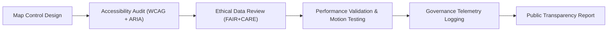

<div align="center">

# 🗺️ **Kansas Frontier Matrix — Accessible Map Controls & Geospatial Interaction Patterns**
`docs/accessibility/patterns/map-controls.md`

**Purpose:**  
Establish accessibility and ethical interaction standards for **MapLibre, Cesium, and 3D geospatial map controls** in the **Kansas Frontier Matrix (KFM)**.  
Ensures that maps are **navigable, perceivable, and ethical** for all users under **WCAG 2.1 AA**, **WAI-ARIA**, and **FAIR+CARE** standards.

[](../../README.md)
[](../../standards/faircare.md)
[](../../../LICENSE)
[](../../../releases/v10.0.0/manifest.zip)

</div>

---

## 📘 Overview

Accessible maps combine **geospatial visualization** and **ethical usability**.  
KFM’s mapping interfaces (2D & 3D) must:
- Support **keyboard navigation and ARIA labeling**  
- Include **focus management and skip navigation**  
- Provide **text equivalents** for coordinate or layer data  
- Respect **user motion preferences** and **cultural visibility restrictions**  

All controls follow **FAIR+CARE** to ensure that cultural or Indigenous datasets are handled with consent and clarity.

---

## 🗂️ Directory Context

```
docs/accessibility/patterns/
├── README.md
├── alerts.md
├── buttons.md
├── charts.md
├── dialogs.md
├── forms.md
├── map-controls.md         # ← This file
└── navigation.md
```

---

## ♿ Accessibility Requirements

| Requirement | Description | Compliance |
|---|---|---|
| **Keyboard Navigation** | Map controls and overlays operable via keyboard (Tab, Enter, Arrows). | WCAG 2.1.1 / 2.1.2 |
| **ARIA Labels** | All interactive map elements labeled with `aria-label` or `aria-describedby`. | ARIA 1.2 |
| **Focus Ring** | Visible focus ring on all controls; contrast ≥ 3:1. | WCAG 2.4.7 |
| **Skip Links** | Provide “Skip map” link for bypassing large map regions. | WCAG 2.4.1 |
| **Zoom & Pan Controls** | Button controls with proper roles (`role="button"`, `aria-pressed` for toggles). | WCAG 2.5.5 |
| **Color Independence** | Layer toggles must not rely solely on color. | WCAG 1.4.1 |
| **Motion Sensitivity** | Disable auto-fly and spinning camera when `prefers-reduced-motion` is set. | WCAG 2.3.3 |
| **Cultural Sensitivity** | Indigenous boundaries or sacred sites marked as restricted when required. | FAIR+CARE |

---

## 🧩 Example: Accessible Map Control Panel

```tsx
<aside
  aria-label="Map controls"
  className="absolute top-4 left-4 bg-white border border-neutral-200 rounded-lg p-3 shadow-lg"
>
  <h2 className="text-sm font-semibold mb-2">Map Controls</h2>
  <ul role="list">
    <li>
      <button
        aria-label="Zoom in"
        className="p-2 rounded focus:ring-2 focus:ring-[#FFB300]"
      >
        +
      </button>
    </li>
    <li>
      <button
        aria-label="Zoom out"
        className="p-2 rounded focus:ring-2 focus:ring-[#FFB300]"
      >
        −
      </button>
    </li>
    <li>
      <button
        aria-label="Reset view to Kansas"
        className="p-2 rounded focus:ring-2 focus:ring-[#FFB300]"
      >
        ⟳
      </button>
    </li>
    <li>
      <label htmlFor="toggle-layer" className="ml-2">Show historic layers</label>
      <input type="checkbox" id="toggle-layer" aria-checked="false" />
    </li>
  </ul>
</aside>
```

**Features:**
- Each control is reachable by `Tab`.  
- All actions include ARIA labels and visible focus.  
- Supports keyboard + mouse equivalence.

---

## 🌐 Example: Accessible Map Region Wrapper

```tsx
<section
  id="map-region"
  role="application"
  aria-label="Kansas Interactive Map"
  aria-describedby="map-summary"
  className="relative h-[600px] w-full"
>
  <div id="map" role="region" aria-label="Map rendering area"></div>
  <p id="map-summary" className="sr-only">
    Interactive map showing Kansas historical and environmental layers. Use arrow keys to navigate, plus/minus to zoom, and Enter to activate layers.
  </p>
</section>
```

- Semantic roles: `<section>` = container, `<div role="region">` = map area.  
- `aria-describedby` references a plain-language summary.  
- Screen reader users informed of available map commands.

---

## 🧭 Keyboard Interaction Map

| Key | Action | Description |
|---|---|---|
| **Tab / Shift+Tab** | Cycle through controls. | Moves sequentially. |
| **Enter / Space** | Activate focused control. | Triggers action (e.g., zoom). |
| **Arrow Keys** | Pan map. | Moves viewport north/south/east/west. |
| **+ / − Keys** | Zoom in/out. | Keyboard equivalent of control buttons. |
| **Esc** | Exit map focus. | Returns focus to next document region. |

---

## 🎨 Focus & Motion Tokens

| Token | Description | Value |
|---|---|---|
| `focus.outline.color` | Focus ring color for controls. | `#FFB300` |
| `focus.outline.width` | Outline thickness. | `3px` |
| `motion.prefersReduced` | Global token to respect motion settings. | `true` |
| `color.control.active` | Active control highlight color. | `#004FC6` |
| `color.control.disabled` | Disabled control color. | `#D1D5DB` |

---

## 🧠 FAIR+CARE Ethical Map Governance

| Principle | Implementation |
|---|---|
| **Collective Benefit** | Map data prioritizes education, not surveillance. |
| **Authority to Control** | Indigenous overlays appear only with consent metadata. |
| **Responsibility** | Clearly label boundaries and heritage layers. |
| **Ethics** | Remove colonial framing and biased cartographic annotations. |

All restricted datasets must include **CARE consent flags** (e.g., `"careConsent.status": "restricted"`).

---

## 🪶 Example: Indigenous Data Layer Toggle

```tsx
<button
  id="tribal-layer-toggle"
  aria-label="Show Indigenous territories layer"
  aria-pressed="false"
  className="p-2 rounded focus:ring-2 focus:ring-[#FFB300]"
>
  Indigenous Boundaries
</button>

<p className="sr-only" id="tribal-layer-consent">
  Display restricted Indigenous boundary data only with permission from the relevant tribal authority.
</p>
```

- `aria-pressed` toggles state.
- Announces consent notice for ethical transparency.

---

## 🧩 Motion Reduction Implementation

```js
const prefersReducedMotion = window.matchMedia('(prefers-reduced-motion: reduce)').matches;
if (prefersReducedMotion) {
  map.setPitch(0);
  map.setBearing(0);
  map.setTransitionDuration(0);
}
```

- Automatically disables pitch rotation and fly transitions.  
- Provides a more stable visual experience for motion-sensitive users.

---

## 🔍 Testing Checklist

| Test | Target | Verification |
|---|---|---|
| Keyboard Navigation | Controls reachable via Tab; ESC exits map. | Manual + CI |
| Focus Visibility | Focus rings appear and pass 3:1 contrast. | Design Token Validation |
| ARIA Announcements | Map role/labels read by screen readers. | Axe-core Audit |
| Motion Reduction | Verified through system settings test. | Accessibility Scan |
| Consent & Ethics | Restricted data marked and logged. | FAIR+CARE Audit |

---

## ⚙️ Validation Pipelines

| Workflow | Function | Artifact |
|---|---|---|
| `accessibility_scan.yml` | Validates keyboard operability, roles, and ARIA states. | `reports/self-validation/web/a11y_summary.json` |
| `storybook-a11y.yml` | Tests component accessibility for controls. | `reports/ui/a11y_component_audits.json` |
| `faircare-visual-audit.yml` | Checks ethical compliance for cultural layers. | `reports/faircare-visual-validation.json` |
| `design-tokens-validate.yml` | Validates contrast and focus token usage. | `reports/ui/design-token-lint.json` |

---

## 📊 Performance & Ethics Metrics

| Metric | Target | Verified By |
|---|---|---|
| **WCAG 2.1 AA Compliance** | 100% | Accessibility Council |
| **Keyboard Operability** | 100% | CI Audit |
| **Focus Contrast** | ≥ 3:1 | Design Token Validation |
| **Motion Safety** | 100% | `prefers-reduced-motion` test |
| **FAIR+CARE Consent Compliance** | 100% | IDGB Ethics Audit |

---

## 🧮 Lifecycle



---

## 🕰️ Version History

| Version | Date | Author | Summary |
|---|---|---|---|
| v10.0.0 | 2025-11-10 | FAIR+CARE Accessibility Council | Created accessible map control and geospatial interaction patterns with WCAG keyboarding, motion safety, and FAIR+CARE cultural governance rules. |

---

<div align="center">

**© 2025 Kansas Frontier Matrix — CC-BY 4.0**  
Part of the **Accessibility Pattern Library** · Master Coder Protocol v6.3 · FAIR+CARE Certified  
[⬅ Back to Patterns Index](README.md) · [Navigation →](navigation.md)

</div>