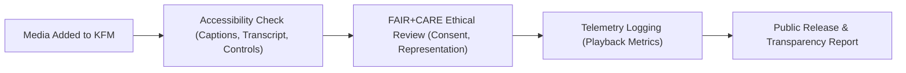

<div align="center">

# 🎥 **Kansas Frontier Matrix — Accessible Media & Time-Based Content Patterns**
`docs/accessibility/patterns/media.md`

**Purpose:**  
Provide universal accessibility and ethical design standards for **audio, video, and multimedia content** in the **Kansas Frontier Matrix (KFM)** system.  
Ensures compliance with **WCAG 2.1 AA**, **ISO 9241-210**, and **FAIR+CARE** for inclusivity, cultural consent, and equitable media representation.

[](../../README.md)
[](../../standards/faircare.md)
[](../../../LICENSE)
[](../../../releases/v10.0.0/manifest.zip)

</div>

---

## 📘 Overview

All media in KFM — including archival footage, oral histories, and AI-narrated educational content — must meet **accessibility and ethical transparency** requirements.  
This document defines the structure, captioning, alternative text, and consent metadata that ensure audio-visual materials are inclusive and culturally respectful.

---

## 🗂️ Directory Context

```
docs/accessibility/patterns/
├── README.md
├── alerts.md
├── buttons.md
├── charts.md
├── dialogs.md
├── forms.md
├── map-controls.md
├── navigation.md
└── media.md                # ← This file
```

---

## ♿ Accessibility Requirements

| Requirement | Description | Compliance |
|---|---|---|
| **Captions (Synchronized)** | All videos include closed captions for spoken dialogue and important sounds. | WCAG 1.2.2 |
| **Audio Descriptions** | Visual information conveyed via separate audio track or transcript. | WCAG 1.2.3 |
| **Transcripts (Text Alternatives)** | Full textual equivalents for all audio or video content. | WCAG 1.2.1 |
| **Auto-play Control** | No auto-play of media on load. Users initiate playback. | WCAG 2.2.2 |
| **Keyboard Accessibility** | Media player fully operable via keyboard. | WCAG 2.1.1 |
| **Focus Indicators** | Active play/pause/seek elements show visible focus outlines. | WCAG 2.4.7 |
| **Volume Control** | Accessible slider with ARIA value labels. | WCAG 2.1.1 |
| **Cultural Consent Metadata** | Indigenous or sensitive materials include consent indicators. | FAIR+CARE |

---

## 🧩 Example: Accessible Video Player (HTML5)

```html
<figure role="group" aria-labelledby="video-title" aria-describedby="video-summary">
  <h3 id="video-title">Oral History: Early Settlers of the Kaw Valley</h3>

  <video
    id="kaw-video"
    controls
    preload="metadata"
    aria-label="Interview with Kaw Valley settlers"
    aria-describedby="video-summary"
  >
    <source src="kaw_valley_story.mp4" type="video/mp4" />
    <track
      src="captions_en.vtt"
      kind="captions"
      srclang="en"
      label="English Captions"
      default
    />
    <track
      src="captions_es.vtt"
      kind="captions"
      srclang="es"
      label="Spanish Captions"
    />
    <p>Your browser does not support HTML5 video. A transcript is available below.</p>
  </video>

  <figcaption id="video-summary" class="text-sm text-muted mt-2">
    This video documents early oral histories collected in the Kaw River region (1900–1930).  
    Captions available in English and Spanish. FAIR+CARE Certified ✅
  </figcaption>
</figure>
```

**Features**
- Keyboard accessible (`Tab`, `Enter`, `Space`, `←/→` keys).
- Captions embedded via `<track>` elements.
- Transcript alternative included (fallback).

---

## 🔊 Example: Accessible Audio Player

```html
<figure role="group" aria-labelledby="audio-title" aria-describedby="audio-summary">
  <h3 id="audio-title">Interview with Osage Elders — Cultural Stewardship</h3>
  <audio controls aria-label="Audio interview with Osage Elders">
    <source src="osage_interview.mp3" type="audio/mpeg" />
    <p>Your browser does not support audio playback. A transcript follows.</p>
  </audio>
  <figcaption id="audio-summary">
    Recorded under consent of the Osage Nation (2025). Licensed CC-BY-NC.  
    Transcript provided below per FAIR+CARE policy.
  </figcaption>
</figure>
```

**Ethical Integration**
- Consent metadata shown in caption.  
- Transcript ensures inclusive access.

---

## 🧠 FAIR+CARE Ethical Requirements

| Principle | Media Implementation |
|---|---|
| **Collective Benefit** | Media used for education, cultural preservation, and open research—not commercialization. |
| **Authority to Control** | Consent metadata embedded (e.g., `"careConsent.status": "approved"`). |
| **Responsibility** | All sensitive materials reviewed by the Indigenous Data Governance Board (IDGB). |
| **Ethics** | Depictions and narration avoid bias, appropriation, or misrepresentation. |

Example JSON consent block:
```json
"careConsent": {
  "authority": "Osage Nation",
  "status": "approved",
  "review_date": "2025-09-01",
  "conditions": "Cultural sharing restricted to educational use"
}
```

---

## 🎧 Keyboard Shortcuts for Players

| Key | Function | Note |
|---|---|---|
| **Space / Enter** | Play / Pause | Focus must be on control. |
| **→ / ←** | Seek forward/backward 5s. | Provides incremental control. |
| **↑ / ↓** | Volume up/down. | Announce via `aria-valuenow`. |
| **M** | Mute/unmute toggle. | Reflects state via `aria-pressed`. |
| **F** | Toggle full screen. | Screen readers announce mode. |
| **Esc** | Exit full screen / focus. | Restores context. |

---

## 🪶 Example: Transcript Structure (Accessible HTML)

```html
<section aria-labelledby="transcript-title">
  <h4 id="transcript-title">Transcript — Interview with Osage Elders</h4>
  <p><strong>00:00:</strong> Introduction and welcome from Elder Grayhawk.</p>
  <p><strong>01:32:</strong> Discussion of land stewardship and traditional burning practices.</p>
  <p><strong>05:48:</strong> Reflections on climate and cultural continuity.</p>
</section>
```

- Transcript must be visible and accessible on the same page.
- Timestamps optional but recommended for educational media.

---

## ⚙️ Motion & Sensory Safety

| Guideline | Requirement |
|---|---|
| **No Auto-play** | User must initiate playback manually. |
| **No Flashing** | Avoid any flashing or strobe above 3Hz. |
| **Reduced Motion** | Videos respect `prefers-reduced-motion` to disable camera shake/panning. |
| **Pause Controls** | Always available for motion-heavy content. |

---

## 🧪 Testing Checklist

| Test | Description | Verification |
|---|---|---|
| Captions | Verify accurate timing and speaker identification. | Manual + CI |
| Transcript | Check completeness and metadata linkage. | FAIR+CARE Audit |
| Keyboard Controls | Tab through play/pause, volume, fullscreen. | Axe-core Scan |
| Volume Range | Adjustable 0–100%; labeled states. | Screen Reader Audit |
| Consent Metadata | Confirm inclusion for Indigenous content. | IDGB Review |

---

## ⚙️ CI/CD Validation

| Workflow | Function | Artifact |
|---|---|---|
| `accessibility_scan.yml` | Confirms ARIA and caption track presence. | `reports/self-validation/web/a11y_summary.json` |
| `faircare-visual-audit.yml` | Verifies ethical use, consent, and representation. | `reports/faircare-visual-validation.json` |
| `docs-lint.yml` | Ensures alt text and captions in documentation media. | `reports/docs/media-lint.json` |
| `telemetry-export.yml` | Logs playback and energy efficiency metrics. | `releases/v10.0.0/focus-telemetry.json` |

---

## 📊 Metrics

| Metric | Target | Verified By |
|---|---|---|
| **WCAG 2.1 AA Compliance** | 100% | CI Audit |
| **Caption Accuracy** | ≥ 98% | Human Review |
| **Transcript Availability** | 100% | FAIR+CARE Validation |
| **Keyboard Operability** | 100% | Accessibility Council |
| **FAIR+CARE Consent Validation** | 100% for cultural content | IDGB Audit |

---

## 🧮 Lifecycle



---

## 🕰️ Version History

| Version | Date | Author | Summary |
|---|---|---|---|
| v10.0.0 | 2025-11-10 | FAIR+CARE Accessibility Council | Introduced accessible media patterns covering captions, transcripts, keyboard control, and FAIR+CARE consent for ethical time-based content. |

---

<div align="center">

**© 2025 Kansas Frontier Matrix — CC-BY 4.0**  
Part of the **Accessibility Pattern Library** · Master Coder Protocol v6.3 · FAIR+CARE Certified  
[⬅ Back to Patterns Index](README.md) · [Navigation →](navigation.md)

</div>