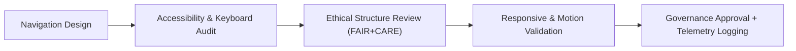

<div align="center">

# 🧭 **Kansas Frontier Matrix — Accessible Navigation Patterns**
`docs/accessibility/patterns/navigation.md`

**Purpose:**  
Define accessible, keyboard-friendly, and ethically inclusive **navigation structures** for the **Kansas Frontier Matrix (KFM)** web and data interfaces.  
Covers headers, sidebars, breadcrumbs, and skip links following **WCAG 2.1 AA**, **ARIA 1.2**, and **FAIR+CARE** principles of inclusive usability and ethical visibility.

[](../../README.md)
[](../../standards/faircare.md)
[](../../../LICENSE)
[](../../../releases/v10.0.0/manifest.zip)

</div>

---

## 📘 Overview

Accessible navigation is the **foundation of usability** and **ethical information access** in KFM.  
All navigational components — headers, menus, sidebars, and footers — must be:
- **Keyboard operable** with clear focus order.  
- **Labeled semantically** using landmarks (`<nav>`, `<header>`, `<main>`, `<footer>`).  
- **Skip-link enabled** to bypass repetitive content.  
- **Responsive** and **motion-safe**.  
- **Ethically structured**, avoiding visual or textual bias.

---

## 🗂️ Directory Context

```
docs/accessibility/patterns/
├── README.md
├── alerts.md
├── buttons.md
├── charts.md
├── dialogs.md
├── forms.md
├── map-controls.md
├── media.md
└── navigation.md            # ← This file
```

---

## ♿ Accessibility Standards

| Requirement | Description | Compliance |
|---|---|---|
| **Semantic Structure** | Use native landmarks and roles for screen reader mapping. | WCAG 1.3.1 |
| **Keyboard Navigation** | All menu and sub-menu items operable via keyboard. | WCAG 2.1.1 |
| **Focus Indicators** | Visible focus outline for all links and buttons. | WCAG 2.4.7 |
| **Skip Links** | Provide skip links for repetitive headers and menus. | WCAG 2.4.1 |
| **ARIA Roles** | Label nav regions (`role="navigation"`, `aria-label`). | ARIA 1.2 |
| **Breadcrumbs** | Use ordered lists with `aria-current="page"`. | WCAG 2.4.8 |
| **Responsive Nav** | Navigation adapts to viewport without losing structure. | WCAG 1.4.10 |
| **Motion Sensitivity** | Disable transitions when `prefers-reduced-motion` is set. | WCAG 2.3.3 |

---

## 🧩 Example: Global Header Navigation

```html
<header role="banner" class="bg-white border-b border-neutral-200">
  <a href="#main" class="skip-link focus:ring-2 focus:ring-[#FFB300]">Skip to main content</a>

  <nav role="navigation" aria-label="Main navigation" class="flex items-center justify-between p-4">
    <h1 class="text-xl font-bold text-primary">Kansas Frontier Matrix</h1>

    <ul class="flex space-x-4" role="menubar">
      <li role="none"><a role="menuitem" href="/about" class="focus:outline-none focus:ring-2 focus:ring-[#FFB300]">About</a></li>
      <li role="none"><a role="menuitem" href="/data" class="focus:outline-none focus:ring-2 focus:ring-[#FFB300]">Data</a></li>
      <li role="none"><a role="menuitem" href="/governance" class="focus:outline-none focus:ring-2 focus:ring-[#FFB300]">Governance</a></li>
      <li role="none"><a role="menuitem" href="/contact" class="focus:outline-none focus:ring-2 focus:ring-[#FFB300]">Contact</a></li>
    </ul>
  </nav>
</header>
```

**Accessibility Features**
- Includes **skip link** (`Skip to main content`).  
- Uses **semantic nav and roles** for assistive tech.  
- Focus rings visible for all interactive items.

---

## 🧾 Example: Breadcrumb Trail

```html
<nav aria-label="Breadcrumb" class="text-sm text-muted mt-4">
  <ol class="flex space-x-2" role="list">
    <li><a href="/data" class="underline focus:ring-2 focus:ring-[#FFB300]">Data</a></li>
    <li aria-hidden="true">›</li>
    <li><a href="/data/climate" class="underline focus:ring-2 focus:ring-[#FFB300]">Climate</a></li>
    <li aria-hidden="true">›</li>
    <li aria-current="page" class="font-semibold text-primary">Precipitation</li>
  </ol>
</nav>
```

**Notes**
- Uses `aria-current="page"` for current location.  
- Breadcrumbs must be **keyboard reachable** and separated by symbols or spacing, not color alone.

---

## 🧭 Example: Sidebar Navigation with Submenus

```html
<nav aria-label="Sidebar navigation" class="w-64 p-4 border-r border-neutral-200">
  <ul role="tree">
    <li role="treeitem" aria-expanded="true" tabindex="0">Data Layers</li>
    <ul role="group">
      <li><a href="/layers/hydrology" class="focus:ring-2 focus:ring-[#FFB300]">Hydrology</a></li>
      <li><a href="/layers/soil" class="focus:ring-2 focus:ring-[#FFB300]">Soils</a></li>
      <li><a href="/layers/topography" class="focus:ring-2 focus:ring-[#FFB300]">Topography</a></li>
    </ul>
    <li role="treeitem" aria-expanded="false" tabindex="-1">Governance</li>
  </ul>
</nav>
```

**Features**
- Uses `role="tree"` + `aria-expanded` for collapsible menus.  
- Maintains logical tab order.  
- Supports **Arrow Up/Down** to navigate nested links.

---

## 🔍 Keyboard Interaction Model

| Key | Action | Context |
|---|---|---|
| **Tab / Shift+Tab** | Move between interactive elements. | All |
| **Enter / Space** | Activate focused link or toggle. | Menus/Submenus |
| **Arrow Keys** | Navigate between items in the same group. | Tree / Menu |
| **Esc** | Close open submenu or drawer. | Responsive Nav |
| **Home / End** | Jump to first/last item in menu. | List Navigation |

---

## 🎨 Focus & Design Tokens

| Token | Value | Use |
|---|---|---|
| `focus.outline.color` | `#FFB300` | Focus ring for links & buttons |
| `focus.outline.width` | `3px` | Outline thickness |
| `color.nav.active` | `#004FC6` | Active link color |
| `color.nav.text` | `#1A1A1A` | Default text color |
| `color.nav.background` | `#FFFFFF` | Navigation background |

Contrast ratio for text-to-background: **≥ 4.5:1** (validated by `design-tokens-validate.yml`).

---

## 🧠 FAIR+CARE Ethical Navigation Rules

| Principle | Implementation |
|---|---|
| **Collective Benefit** | Structure navigation to promote educational and research content equally. |
| **Authority to Control** | Sensitive data sections flagged for restricted access with consent notices. |
| **Responsibility** | Avoid prominence bias (no manipulation of menu hierarchy for persuasion). |
| **Ethics** | Present information neutrally; never hide critical disclaimers or context. |

---

## 🪶 Example: Skip Links for Inclusive Access

```html
<a href="#main" class="absolute left-0 top-0 p-2 bg-white text-primary focus:ring-4 focus:ring-[#FFB300]">
  Skip to main content
</a>

<main id="main" tabindex="-1">
  <!-- Main page content here -->
</main>
```

- Skip link visible only on focus.  
- Ensures screen reader and keyboard users can bypass repetitive nav.  

---

## 🔎 Testing Checklist

| Test | Description | Verification |
|---|---|---|
| Keyboard Nav | Tab and Arrow keys move predictably across all menus. | Manual + CI |
| Focus Visible | All links and controls have visible outlines. | Design Token Validation |
| Landmarks | `<header>`, `<nav>`, `<main>`, `<footer>` used semantically. | Axe-core Scan |
| Skip Link | Appears and functions correctly. | Manual Test |
| Breadcrumb Current Page | `aria-current="page"` announced. | Screen Reader Audit |

---

## ⚙️ CI/CD Validation

| Workflow | Purpose | Artifact |
|---|---|---|
| `accessibility_scan.yml` | Validates ARIA labels, focus states, skip links. | `reports/self-validation/web/a11y_summary.json` |
| `storybook-a11y.yml` | Tests navigation component accessibility. | `reports/ui/a11y_component_audits.json` |
| `design-tokens-validate.yml` | Verifies contrast ratios and focus ring tokens. | `reports/ui/design-token-lint.json` |
| `faircare-visual-audit.yml` | Reviews menu order for ethical fairness. | `reports/faircare-visual-validation.json` |

---

## 📊 Metrics

| Metric | Target | Verified By |
|---|---|---|
| **WCAG 2.1 AA Compliance** | 100% | Accessibility Council |
| **Keyboard Navigation Accuracy** | 100% | CI Audit |
| **Contrast Compliance** | ≥ 4.5:1 | Token Validation |
| **Focus Visibility** | 100% | Manual QA |
| **FAIR+CARE Ethics Review** | ≥ 95% | Governance Secretariat |

---

## 🧮 Lifecycle



---

## 🕰️ Version History

| Version | Date | Author | Summary |
|---|---|---|---|
| v10.0.0 | 2025-11-10 | FAIR+CARE Accessibility Council | Added accessible navigation pattern including global header, breadcrumbs, sidebar, and ethical FAIR+CARE governance integration. |

---

<div align="center">

**© 2025 Kansas Frontier Matrix — CC-BY 4.0**  
Part of the **Accessibility Pattern Library** · Master Coder Protocol v6.3 · FAIR+CARE Certified  
[⬅ Back to Patterns Index](README.md) · [Media →](media.md)

</div>