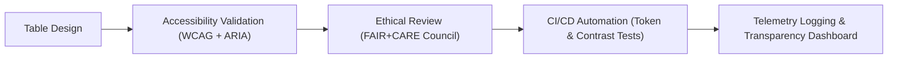

<div align="center">

# 📊 **Kansas Frontier Matrix — Accessible Tables & Data Grid Patterns**
`docs/accessibility/patterns/tables.md`

**Purpose:**  
Define inclusive, WCAG-compliant, and ethically transparent **table and data grid structures** for the **Kansas Frontier Matrix (KFM)** project.  
Ensures that tabular and complex data visualizations are accessible via screen readers, keyboard navigation, and FAIR+CARE ethical presentation principles.

[](../../README.md)
[](../../standards/faircare.md)
[](../../../LICENSE)
[](../../../releases/v10.0.0/manifest.zip)

</div>

---

## 📘 Overview

Accessible tables ensure **structured data comprehension** across all assistive technologies and cognitive contexts.  
They must:
- Use **semantic table markup** (`<table>`, `<thead>`, `<tbody>`, `<th>`, `<td>`).  
- Provide **headers, scopes, and summaries** for context.  
- Support **keyboard navigation** in dynamic grids.  
- Display **ethical data transparency**, avoiding bias in layout or emphasis.  
- Align with **FAIR+CARE** to ensure datasets are not misrepresented or decontextualized.

---

## 🗂️ Directory Context

```
docs/accessibility/patterns/
├── README.md
├── alerts.md
├── buttons.md
├── charts.md
├── dialogs.md
├── forms.md
├── map-controls.md
├── media.md
├── navigation.md
└── tables.md               # ← This file
```

---

## ♿ Accessibility Standards

| Requirement | Description | Compliance |
|---|---|---|
| **Table Structure** | Use `<table>`, `<thead>`, `<tbody>`, `<th>` for semantic reading order. | WCAG 1.3.1 |
| **Header Scope** | Assign `scope="col"` or `scope="row"` to header cells. | WCAG 1.3.1 |
| **Caption & Summary** | Add `<caption>` and `aria-describedby` for overview context. | WCAG 1.3.1 / 1.3.2 |
| **Keyboard Navigation** | Ensure all cells and actions are reachable via `Tab` / arrow keys. | WCAG 2.1.1 |
| **Visible Focus** | Maintain 3:1 contrast focus indicators. | WCAG 2.4.7 |
| **Sorting & Filtering** | Announce state changes via `aria-sort` and `aria-live`. | WCAG 4.1.3 |
| **Data Relationships** | Link complex headers with `id` and `headers` attributes. | ARIA 1.2 |
| **Ethical Transparency** | Display data sources, consent status, and licensing in proximity to table. | FAIR+CARE |

---

## 🧩 Example: Static Semantic Table

```html
<table aria-describedby="climate-summary" class="border border-neutral-200 w-full text-sm">
  <caption class="text-left font-semibold p-2">
    Kansas Climate Trends (1900–2025)
  </caption>
  <thead class="bg-neutral-50">
    <tr>
      <th scope="col" class="p-2">Year</th>
      <th scope="col" class="p-2">Avg. Temperature (°C)</th>
      <th scope="col" class="p-2">Avg. Rainfall (mm)</th>
      <th scope="col" class="p-2">Data Source</th>
    </tr>
  </thead>
  <tbody>
    <tr>
      <td class="p-2">1900</td>
      <td class="p-2">13.5</td>
      <td class="p-2">542</td>
      <td class="p-2">NOAA Historical Archive</td>
    </tr>
    <tr>
      <td class="p-2">2020</td>
      <td class="p-2">14.2</td>
      <td class="p-2">611</td>
      <td class="p-2">NOAA NCEI (FAIR+CARE Certified)</td>
    </tr>
  </tbody>
</table>

<p id="climate-summary" class="text-sm text-muted mt-1">
  Data shows an increase of 0.7°C and ~12% rainfall since 1900. Source: NOAA, verified under FAIR+CARE guidelines.
</p>
```

**Accessibility Features**
- Semantic structure with headers and caption.  
- `aria-describedby` links table to textual summary.  
- High-contrast background and visible focus for interactive cells.  

---

## 🧮 Example: Sortable Data Grid (ARIA)

```tsx
<table role="grid" aria-label="Dataset Registry" aria-rowcount="5" aria-colcount="3">
  <thead>
    <tr role="row">
      <th role="columnheader" aria-sort="ascending" tabindex="0">Dataset Name</th>
      <th role="columnheader" aria-sort="none" tabindex="-1">License</th>
      <th role="columnheader" aria-sort="none" tabindex="-1">FAIR+CARE Score</th>
    </tr>
  </thead>
  <tbody>
    <tr role="row">
      <td role="gridcell" tabindex="0">NOAA Kansas Climate</td>
      <td role="gridcell">CC-BY 4.0</td>
      <td role="gridcell">97.3</td>
    </tr>
    <tr role="row">
      <td role="gridcell">KHS Land Records</td>
      <td role="gridcell">Restricted</td>
      <td role="gridcell">Pending IDGB Review</td>
    </tr>
  </tbody>
</table>
```

**Notes**
- Keyboard navigation cycles through grid cells using **Arrow keys**.  
- Sorting actions update `aria-sort` dynamically (`ascending`, `descending`, `none`).  
- Screen readers announce updated state via `aria-live="polite"`.

---

## 🎨 Design Tokens

| Token | Value | Use |
|---|---|---|
| `color.table.header.bg` | `#F9FAFB` | Header row background |
| `color.table.border` | `#E5E5E5` | Grid borders |
| `color.table.row.hover` | `#F1F5F9` | Hovered row |
| `focus.outline.color` | `#FFB300` | Focus ring |
| `font.size.table` | `0.875rem` | Default table text size |

Validated by `design-tokens-validate.yml` to meet contrast ratios and consistency.

---

## 🧠 FAIR+CARE Ethical Data Display

| Principle | Implementation |
|---|---|
| **Collective Benefit** | Tables represent factual data without manipulation or bias. |
| **Authority to Control** | Include provenance, consent, and access restrictions adjacent to sensitive records. |
| **Responsibility** | Annotate all derived data with citations and FAIR+CARE badges. |
| **Ethics** | Avoid emphasis patterns or color-coding that imply judgment or hierarchy. |

**Example**
```html
<p class="text-xs text-muted mt-2">
  ⚖️ Data verified for FAIR+CARE compliance — restricted rows indicate cultural or Indigenous datasets with consent limitations.
</p>
```

---

## 🧭 Keyboard Interaction

| Key | Action |
|---|---|
| **Tab / Shift+Tab** | Move between interactive cells or buttons. |
| **Arrow Keys** | Navigate grid cells (in `role="grid"` tables). |
| **Enter / Space** | Activate sorting or open context menu. |
| **Home / End** | Jump to first/last cell in row. |
| **Ctrl + F** | Search/filter table contents (browser default). |

---

## 🧾 Testing Checklist

| Test | Description | Verification |
|---|---|---|
| Table Semantics | `<table>` structure and header associations present. | Axe-core Scan |
| Keyboard Navigation | Focus moves logically between cells. | E2E Tests |
| Sorting Feedback | `aria-sort` announces state change. | Screen Reader Audit |
| Contrast | Header text contrast ≥ 4.5:1. | Token Validation |
| Consent Labeling | FAIR+CARE metadata visible for restricted datasets. | IDGB Review |

---

## ⚙️ CI/CD Validation

| Workflow | Function | Artifact |
|---|---|---|
| `accessibility_scan.yml` | Validates table semantics and focus handling. | `reports/self-validation/web/a11y_summary.json` |
| `storybook-a11y.yml` | Component accessibility tests for data grids. | `reports/ui/a11y_component_audits.json` |
| `faircare-visual-audit.yml` | Verifies ethical table tone, consent tags, and color fairness. | `reports/faircare-visual-validation.json` |
| `design-tokens-validate.yml` | Checks contrast and layout token compliance. | `reports/ui/design-token-lint.json` |

---

## 📊 Metrics

| Metric | Target | Verified By |
|---|---|---|
| **WCAG 2.1 AA Compliance** | 100% | Accessibility Council |
| **Keyboard Operability** | 100% | CI E2E |
| **Contrast Ratio** | ≥ 4.5:1 | Token Validator |
| **FAIR+CARE Metadata Coverage** | 100% | Governance Telemetry |
| **Consent Validation Accuracy** | 100% for restricted data | IDGB Ethics Audit |

---

## 🧮 Lifecycle



---

## 🕰️ Version History

| Version | Date | Author | Summary |
|---|---|---|---|
| v10.0.0 | 2025-11-10 | FAIR+CARE Accessibility Council | Added accessible table and data grid patterns ensuring semantic structure, FAIR+CARE metadata inclusion, and full keyboard/ARIA compliance. |

---

<div align="center">

**© 2025 Kansas Frontier Matrix — CC-BY 4.0**  
Part of the **Accessibility Pattern Library** · Master Coder Protocol v6.3 · FAIR+CARE Certified  
[⬅ Back to Patterns Index](README.md) · [Media →](media.md)

</div>