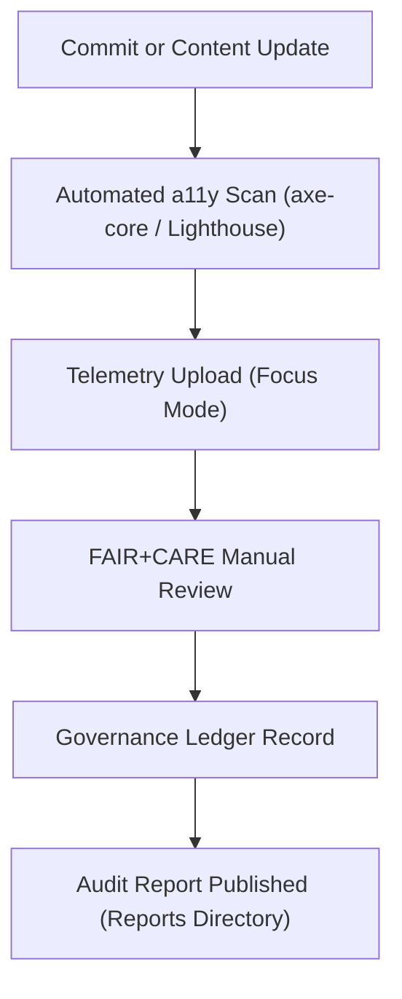

<div align="center">

# ♿ **Kansas Frontier Matrix — Accessible Testing, Validation, and Continuous Audit Framework**
`docs/accessibility/patterns/testing-validation.md`

**Purpose:**  
Define the unified **accessibility testing, CI validation, and FAIR+CARE compliance audit pipeline** for the Kansas Frontier Matrix (KFM), ensuring every user interface and workflow continuously meets **WCAG 2.1 AA**, **Section 508**, and **ethical design validation** through automated and manual review.


</div>

---

## 📘 Overview

This pattern outlines how **accessibility audits, CI/CD validations, and telemetry-driven feedback** operate as part of KFM’s continuous integration ecosystem.  
The goal is to ensure that every code commit, content update, or data visualization automatically triggers a **FAIR+CARE-certified accessibility scan**, supported by manual review cycles and governance sign-off.

---

## 🧩 Accessibility Validation Layers

| Layer | Tool / Framework | Validation Scope |
|--------|------------------|------------------|
| **Automated Testing** | `axe-core`, `Lighthouse`, `jest-axe` | Static accessibility rules (ARIA, color, focus, headings) |
| **CI/CD Integration** | GitHub Actions, `docs-lint.yml`, `a11y-scan.yml` | Workflow automation and report generation |
| **Telemetry Monitoring** | KFM Focus Telemetry | Live runtime accessibility metrics and user interaction stats |
| **Manual Review** | FAIR+CARE Council | Contextual, ethical, and linguistic verification |
| **Cultural Consent Review** | Governance Ledger pipeline | Cultural metadata and sensitive content validation |

---

## ⚙️ Example CI Workflow Integration

```yaml
name: accessibility_scan
on:
  push:
    branches: [ main ]
  pull_request:
    branches: [ main ]
jobs:
  a11y:
    runs-on: ubuntu-latest
    steps:
      - name: Checkout repository
        uses: actions/checkout@v3
      - name: Install dependencies
        run: npm ci
      - name: Run axe-core audit
        run: npm run test:a11y
      - name: Export reports
        run: cp -r reports/self-validation/web ./artifacts/
      - name: Upload artifacts
        uses: actions/upload-artifact@v3
        with:
          name: accessibility-reports
          path: ./artifacts/
```

**Workflow Notes**
- Executes on every merge or pull request to `main`.  
- Produces structured JSON reports for each pattern.  
- Sends results to telemetry endpoint for governance ingestion.  

---

## 🧾 Reporting Structure

| Report | Description | Location |
|---------|--------------|-----------|
| `a11y_summary.json` | Consolidated WCAG & ARIA results | `docs/reports/self-validation/web/` |
| `a11y_components.json` | Per-component accessibility status | `docs/reports/ui/` |
| `faircare_language.json` | Tone, inclusivity, and cultural safety audit | `docs/reports/faircare/` |
| `telemetry_a11y.json` | Runtime accessibility KPIs and user metrics | `releases/v10.0.0/` |
| `governance_review.json` | Manual FAIR+CARE Council validation outcomes | `docs/reports/audit/` |

---

## 🎨 Validation Tokens and Metrics

| Metric Token | Description | Target |
|----------------|-------------|---------|
| `a11y.score` | Overall accessibility score (0–100) | ≥ 90 |
| `a11y.colorContrast` | Percentage of elements passing contrast test | ≥ 98% |
| `a11y.keyboardFocus` | Verified keyboard operability | 100% |
| `a11y.languageTags` | Presence of `lang` attributes | 100% |
| `a11y.ariaCoverage` | Valid ARIA roles/labels detected | ≥ 95% |
| `a11y.telemetryCoverage` | Components reporting to Focus Mode | ≥ 90% |

---

## 🧪 Validation Tools & Integration

| Tool | Function | Output Artifact |
|-------|-----------|-----------------|
| **axe-core** | Automated accessibility scan | `reports/self-validation/web/a11y_summary.json` |
| **jest-axe** | Unit test integration for React components | `reports/ui/a11y_components.json` |
| **Lighthouse CI** | Performance & accessibility scoring | `reports/ui/lighthouse_a11y.json` |
| **Pa11y CI** | Regression testing across environments | `reports/self-validation/web/a11y_pa11y.json` |
| **Faircare Audit Script** | Bias and ethics review | `reports/faircare/faircare_language.json` |

---

## 🧭 FAIR+CARE Audit Lifecycle



**Cycle Summary**
1️⃣ Developers commit code or content.  
2️⃣ Automated scans detect violations.  
3️⃣ Telemetry pipelines aggregate scores.  
4️⃣ FAIR+CARE Council performs ethical review.  
5️⃣ Immutable audit record stored under `governance-ledger.json`.  

---

## ⚖️ FAIR+CARE Integration

| Principle | Implementation |
|------------|----------------|
| **Collective Benefit** | Continuous accessibility ensures equitable platform access. |
| **Authority to Control** | Communities can opt out of certain content scans for cultural reasons. |
| **Responsibility** | CI logs provide permanent traceability of compliance status. |
| **Ethics** | Human-in-the-loop review guards against automation bias. |

---

## 🕰️ Version History

| Version | Date | Author | Summary |
|----------|------|---------|----------|
| v10.0.0 | 2025-11-11 | FAIR+CARE Council | Introduced unified accessibility testing and CI validation pipeline; added telemetry integration and ethics audit automation. |

---

<div align="center">

**© 2025 Kansas Frontier Matrix — CC-BY 4.0**  
Developed under **Master Coder Protocol v6.3** · Verified by **FAIR+CARE Council**  
[⬅ Back to Accessibility Index](README.md)

</div>
