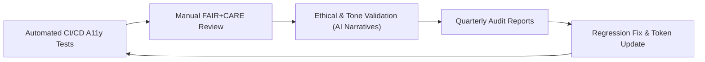

<div align="center">

# 🧪 **Kansas Frontier Matrix — Accessibility Testing & Validation Guide**
`docs/accessibility/testing-guide.md`

**Purpose:**  
Provide a complete reference for **automated, manual, and assistive technology testing** of the **Kansas Frontier Matrix (KFM)** platform.  
This guide establishes repeatable **WCAG 2.1 AA + FAIR+CARE** validation workflows to guarantee accessibility, inclusion, and ethical compliance across all user interfaces and AI-driven outputs.

[](../README.md)
[](../standards/faircare.md)
[](../../LICENSE)
[](../../releases/v10.0.0/manifest.zip)

</div>

---

## 📘 Overview

Accessibility testing is an **ongoing verification process** that ensures the KFM platform remains inclusive and compliant as it evolves.  
This document defines **tools**, **methods**, and **metrics** for testing across **web**, **AI Focus Mode**, and **documentation outputs**.

Each test run contributes to:
- **FAIR+CARE Certification**
- **Governance audit readiness**
- **Master Coder Protocol (MCP)** reproducibility validation  

Testing spans:
1. **Automated validation** (CI/CD pipelines)  
2. **Manual verification** (assistive tech, cognitive review)  
3. **AI ethics validation** (tone, inclusivity, provenance)  

---

## 🗂️ Directory Layout

```
docs/accessibility/
├── README.md
├── testing-guide.md                # ← This file
├── tokens.md
├── audits/
│   ├── README.md
│   └── templates/
└── patterns/
```

---

## 🧭 Accessibility Testing Matrix

| Test Type | Tools / Frameworks | Scope | Frequency | Output |
|---|---|---|---|---|
| **Automated (Static)** | axe-core, pa11y, Lighthouse | HTML, ARIA, headings, alt text, color contrast | Per PR / CI build | `reports/self-validation/web/a11y_summary.json` |
| **Manual (Assistive Tech)** | NVDA, VoiceOver, TalkBack | Keyboard traversal, focus management, live regions | Quarterly | `docs/accessibility/audits/YYYY-QX_a11y_report.json` |
| **AI Narrative Review** | Textstat, NLP bias detectors | Readability, tone neutrality, inclusivity | Biannual | `docs/accessibility/audits/YYYY-QX_focus_ethics.md` |
| **Design Token Validation** | WCAG Contrast Validator | Colors, typography, focus outlines | Per Release | `reports/ui/color-contrast.json` |
| **Regression Testing** | Cypress, Playwright | Revalidation of resolved a11y issues | Continuous | CI logs + Issue Tracker |
| **Ethics Validation** | FAIR+CARE Council Manual Review | CARE compliance, emotional tone | Biannual | `releases/v10.0.0/faircare-report.md` |

---

## ⚙️ Automated Testing Workflows

Automated tests execute during CI/CD pipelines and pre-commit hooks.

### 🧩 Primary CI Workflows

| Workflow | Description | Artifact |
|---|---|---|
| `accessibility_scan.yml` | Runs Lighthouse + axe-core for every PR. | `reports/self-validation/web/a11y_summary.json` |
| `storybook-a11y.yml` | Runs Jest-axe for each Storybook component. | `reports/ui/a11y_component_audits.json` |
| `color-contrast.yml` | Validates design token contrast ratios (≥4.5:1). | `reports/ui/color-contrast.json` |
| `faircare-audit.yml` | Confirms ethical compliance & provenance indicators. | `reports/faircare-validation.json` |

> ✅ All automated workflows must pass before tagging a release as *FAIR+CARE Certified.*

---

## 🧠 Manual Testing Procedures

Manual tests verify **real-world usability** and supplement automated tools.

### 🔹 Keyboard Navigation
- Use `Tab`, `Shift+Tab`, `Enter`, and `Space` to test navigation and activation.
- Ensure **no focus traps** and **visible focus rings** (≥3px width).
- Verify skip links (`Alt+S`) navigate correctly to main content.

### 🔹 Screen Reader Testing
| Screen Reader | Environment | Test Focus |
|---|---|---|
| NVDA | Windows 11 / Firefox | ARIA landmarks, form labels, announcements |
| VoiceOver | macOS / Safari | Focus navigation, content order, region labels |
| TalkBack | Android | Mobile accessibility, live-region feedback |

### 🔹 Motion & Reduced Animation
- Verify `prefers-reduced-motion` disables non-essential animations.
- Check that essential transitions (focus fade-in/out) remain perceivable.

### 🔹 Color Contrast & Visual Validation
- Use color tokens from `docs/accessibility/tokens.md`.  
- Validate button and text contrast ratios ≥ 4.5:1.  
- Confirm contrast on hover, focus, and disabled states.

---

## 🧾 AI Focus Mode Accessibility Testing

Focus Mode’s **AI Context Engine v2** introduces additional validation layers for narrative accessibility.

| Test | Description | Metric |
|---|---|---|
| **Readability Analysis** | Measure text readability (Flesch-Kincaid Grade). | ≤ 8.0 |
| **Bias Audit** | NLP model scan for cultural or gender bias. | ≥ 90% neutrality confidence |
| **Provenance Verification** | Confirm each summary includes source attribution chip. | 100% |
| **Consent Flag Check** | Validate ethical consent metadata presence. | 100% |
| **Narrative Length Limit** | Max 200 words per summary for screen reader efficiency. | ≤ 200 words |

**Focus Mode artifacts:**  
Stored under `releases/v10.0.0/focus-telemetry.json` for reproducibility.

---

## 🔍 Ethical Validation & FAIR+CARE Metrics

| CARE Principle | Validation Task | Tool / Method |
|---|---|---|
| **Collective Benefit** | Validate accessibility across devices and user demographics. | Manual A11y Council Test |
| **Authority to Control** | Confirm cultural content has opt-in display and consent metadata. | FAIR+CARE Audit |
| **Responsibility** | Verify regression closure of previously logged issues. | CI Regression Tracker |
| **Ethics** | Check AI tone neutrality and emotional safety. | AI Narrative Review |

**Pass Condition:**  
≥ 90% aggregate CARE compliance across web + AI modules.

---

## 📊 Validation Metrics Dashboard

| Metric | Target | Verified By |
|---|---|---|
| **WCAG 2.1 AA Pass Rate** | ≥ 98% | Combined CI + Manual Audit |
| **Lighthouse A11y Score** | ≥ 95 | `accessibility_scan.yml` |
| **Contrast Compliance (Tokens)** | 100% | `color-contrast.yml` |
| **AI Narrative Readability (FK)** | ≤ 8.0 | Textstat Validation |
| **Ethical Review Compliance** | ≥ 90% | FAIR+CARE Council |
| **Regression Fix Rate** | 100% | CI Audit Log |

---

## 🧩 Pre-Release Validation Checklist

| Step | Description | Responsible Team |
|---|---|---|
| 1️⃣ | Run automated CI scans and verify all a11y workflows pass. | DevOps |
| 2️⃣ | Conduct manual keyboard + screen reader testing. | A11y Council |
| 3️⃣ | Validate FAIR+CARE metrics on AI narratives. | Ethics Council |
| 4️⃣ | Review design token compliance and contrast ratios. | Design Team |
| 5️⃣ | Archive all audit results in `/docs/accessibility/audits/`. | Documentation Team |
| 6️⃣ | Publish quarterly summary in `releases/v10.0.0/faircare-report.md`. | Governance Lead |

---

## 🧠 Continuous Improvement Loop



Each audit cycle feeds back into the design system, ensuring ongoing improvement and verifiable inclusivity.

---

## 🕰️ Version History

| Version | Date | Author | Summary |
|---|---|---|---|
| v10.0.0 | 2025-11-10 | FAIR+CARE A11y Council | Created unified accessibility testing guide integrating automated, manual, and ethical validation with WCAG + CARE compliance tracking. |

---

<div align="center">

**© 2025 Kansas Frontier Matrix — CC-BY 4.0**  
Validated under **Master Coder Protocol v6.3** · Certified by **FAIR+CARE Council**  
[⬅ Back to Accessibility Index](README.md) · [Audit Framework →](audits/README.md)

</div>
