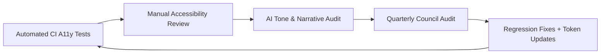

<div align="center">

# 🧪 **Kansas Frontier Matrix — Accessibility Testing & Validation Guide**  
`docs/accessibility/testing-guide.md`

**Purpose:**  
Provide a complete reference for automated, manual, and assistive-technology testing of the Kansas Frontier Matrix (KFM).  
Ensures repeatable WCAG 2.1 AA + FAIR+CARE validation across all UI layers, documentation, and AI narratives.

</div>

---

## 📘 Overview

Accessibility testing ensures the KFM platform remains inclusive, ethical, and compliant as it evolves.

This guide defines:

- Automated tests  
- Manual assistive-technology workflows  
- AI Focus Mode accessibility checks  
- FAIR+CARE ethical validation  
- CI-integrated metrics & dashboards  

Testing covers:

1. Automated CI/CD validation  
2. Manual assistive-technology testing  
3. AI narrative ethics and readability  
4. Regression tracking  
5. Design token compliance  

---

## 🗂️ Directory Layout

```text
docs/accessibility/
│
├── README.md
├── testing-guide.md                  # This file
├── tokens.md
├── audits/
│   ├── README.md
│   └── templates/
└── patterns/
```

---

## 🧭 Accessibility Testing Matrix

| Test Type | Tools | Scope | Frequency | Output |
|----------|--------|--------|-----------|--------|
| Automated Static | axe-core, pa11y, Lighthouse | HTML, ARIA, headings, alt text, color contrast | Per PR / CI | a11y_summary.json |
| Manual Assistive Tech | NVDA, VoiceOver, TalkBack | Focus, screen reader behavior, reading order | Quarterly | audits/YYYY-QX_a11y_report.json |
| AI Narrative Review | Textstat, bias detector | Readability, tone, inclusivity, provenance | Biannual | audits/YYYY-QX_focus_ethics.md |
| Design Token Validation | WCAG analyzer | Contrast tokens, typography, focus | Per Release | color-contrast.json |
| Regression Testing | Cypress, Playwright | Revalidate resolved issues | Continuous | CI logs |
| Ethical Validation | FAIR+CARE Council | Tone, consent checks, cultural sensitivity | Biannual | faircare-report.md |

---

## ⚙️ Automated CI Testing Workflows

Automated checks run during PRs, commits, and releases.

### CI Workflows

| Workflow | Description | Output |
|----------|-------------|--------|
| accessibility_scan.yml | Lighthouse + axe-core | a11y_summary.json |
| storybook-a11y.yml | Jest-axe on Storybook components | a11y_component_audits.json |
| color-contrast.yml | Validates color tokens | color-contrast.json |
| faircare-audit.yml | CARE & ethics checks | faircare-validation.json |

All must pass before a release may be certified.

---

## 🧠 Manual Testing Procedures

### Keyboard Navigation

- Test using Tab, Shift+Tab, Enter, Space  
- Ensure visible focus rings (>= 3px)  
- Verify skip navigation (Skip to Content)  
- Ensure no keyboard traps  

### Screen Reader Validation

| Screen Reader | Platform | Validation Focus |
|---------------|-----------|------------------|
| NVDA | Windows + Firefox | ARIA landmarks, labels, announcements |
| VoiceOver | macOS / Safari | Focus order, semantics |
| TalkBack | Android | Touch exploration, live-region updates |

### Reduced Motion

- `prefers-reduced-motion` must disable non-essential movement  
- Essential UI transitions must remain perceivable  

### Color & Visual Checks

- Validate WCAG AA contrast (>= 4.5:1)  
- Verify all states (hover, active, focus, disabled)  

---

## 🧾 AI Focus Mode Accessibility Testing

| Test | Description | Metric |
|------|-------------|--------|
| Readability | Flesch-Kincaid Grade Level | <= 8.0 |
| Tone & Bias | NLP bias detection | >= 90% neutrality |
| Provenance | Ensure source indication chip exists | 100% |
| Consent Flags | CARE metadata presence | 100% |
| Narrative Length | Max length for accessibility | <= 200 words |

All results stored in:

`releases/v10.4.0/focus-telemetry.json`

---

## 🔍 FAIR+CARE Ethical Validation

| CARE Principle | Validation Task | Method |
|----------------|------------------|--------|
| Collective Benefit | Multi-device A11y validation | Accessibility Council |
| Authority to Control | Consent, redaction, provenance | CARE Review |
| Responsibility | Regression verification | CI Regression Tracker |
| Ethics | AI tone safety | Narrative Audit |

---

## 📊 Metrics Dashboard

| Metric | Target | Verified By |
|--------|--------|--------------|
| WCAG Pass Rate | >= 98% | CI + Manual |
| Lighthouse Score | >= 95 | accessibility_scan.yml |
| Token Contrast Compliance | 100% | color-contrast.yml |
| Narrative Readability | <= Grade 8 | Textstat |
| Ethical Review Compliance | >= 90% | FAIR+CARE Council |
| Regression Fix Rate | 100% | CI Tracker |

---

## 🧩 Pre-Release Checklist

| Step | Description | Owner |
|------|-------------|--------|
| 1 | All automated tests pass | DevOps |
| 2 | Manual A11y testing completed | Accessibility Council |
| 3 | AI ethics + narrative compliance reviewed | FAIR+CARE Council |
| 4 | Token validation complete | Design Team |
| 5 | Audits archived | Documentation Team |
| 6 | Quarterly summary published | Governance Lead |

---

## 🧠 Continuous Improvement Loop



---

## 🕰️ Version History

| Version | Date | Author | Summary |
|--------:|------------|---------|----------|
| v10.4.1 | 2025-11-16 | Accessibility Council | Updated to KFM-MDP v10.4.3; corrected formatting; stabilized nested code blocks for Apple/GitHub. |
| v10.0.0 | 2025-11-10 | FAIR+CARE Council | Initial accessibility testing standard. |

---

<div align="center">

© 2025 Kansas Frontier Matrix — CC-BY 4.0  
Validated under MCP-DL v6.3 · FAIR+CARE Council Certified  
[Back to Accessibility Index](README.md)

</div>