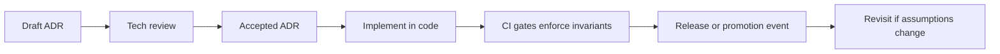

<!-- [KFM_META_BLOCK_V2]
doc_id: kfm://doc/5698937f-e1ab-4d06-bb23-64c5b45e50d6
title: ADR 0001 — Example Decision
type: standard
version: v1
status: draft
owners: KFM Platform Team (TODO)
created: 2026-03-01
updated: 2026-03-01
policy_label: restricted
related:
  - TODO: kfm://doc/<related-doc-id>
tags: [kfm, adr, governance]
notes:
  - This is an example ADR meant to be copied and adapted for real decisions.
  - Replace placeholders marked TODO before promoting to review/published.
[/KFM_META_BLOCK_V2] -->

# ADR 0001 — Example Decision

**Purpose:** Provide a *copy/paste* ADR format that matches KFM’s evidence-first, policy-aware operating rules.

 <!-- TODO: confirm badges are allowed in this repo -->

## Navigation

- [Decision summary](#decision-summary)
- [Context](#context)
- [Decision drivers](#decision-drivers)
- [Decision](#decision)
- [Alternatives considered](#alternatives-considered)
- [Consequences](#consequences)
- [Security, privacy, and governance](#security-privacy-and-governance)
- [Implementation notes](#implementation-notes)
- [Minimum verification steps](#minimum-verification-steps)
- [Rollback plan](#rollback-plan)
- [Change log](#change-log)

---

## Decision summary

**Decision:** Adopt an **evidence-first ADR format** for KFM architecture/governance decisions.

**Status:** Draft (example)

**Scope:** All architectural decisions that affect:
- the **truth path** (Upstream → RAW → WORK/Quarantine → PROCESSED → CATALOG → PUBLISHED),
- the **trust membrane** (policy enforcement point + evidence resolver), or
- any **public contract surface** (catalogs, schemas, APIs, UI claims).

**Why:** KFM requires decisions to be reviewable, testable, and reversible; ADRs are the durable record tying decisions to evidence and policy.

> NOTE: This file is intentionally generic (“example decision”). For real ADRs, prefer a descriptive slug, e.g. `0007-governed-api-pep.md`.

[Back to top](#adr-0001--example-decision)

---

## Context

KFM is a governed platform where user-facing outputs (maps, stories, Focus Mode answers) must be traceable to evidence and policy. Decisions that change data lifecycles, contracts, or access paths can silently break trust unless recorded.

KFM also emphasizes:
- **no silent assumptions** (state assumptions explicitly),
- **default-deny** when uncertain (especially around sensitive data),
- **small, reversible increments** (every change has a rollback path),
- **test-enforced invariants** (CI gates enforce, not memory).

This ADR format is a lightweight way to preserve *why* we made a decision, not just *what* we built.

[Back to top](#adr-0001--example-decision)

---

## Decision drivers

1. **Auditability:** Provide a deterministic trail from decision → code/config change → tests/gates → release.
2. **Policy enforcement:** Ensure decisions explicitly address policy labels, redaction, and access control implications.
3. **Reproducibility:** Enable future maintainers to reconstruct intent and constraints.
4. **Interoperability:** Decisions should reference standards (e.g., DCAT, STAC, PROV, OGC) where applicable.
5. **Operational clarity:** Make it obvious what to verify before promoting a change.

[Back to top](#adr-0001--example-decision)

---

## Decision

### 1) ADRs are required for “trust membrane” and “truth path” changes

An ADR MUST be created (or updated) when a PR:
- changes lifecycle zone semantics, promotion gates, or artifact immutability expectations,
- changes how clients access data (e.g., direct DB access vs governed API),
- adds/changes an API contract or catalog schema,
- changes policy evaluation or evidence resolution behavior,
- introduces new data classes/sensitivity rules.

### 2) ADR structure is standardized (this template)

Every ADR MUST include:

#### Required metadata
- ADR number + title
- status: `draft` | `review` | `accepted` | `deprecated` | `superseded`
- owners / deciders (people or team)
- created / updated dates
- policy label (`public` | `restricted` | etc.)

#### Required sections
- **Decision summary**
- **Context**
- **Decision drivers**
- **Decision**
- **Alternatives considered**
- **Consequences** (positive/negative/neutral)
- **Security, privacy, and governance**
- **Minimum verification steps**
- **Rollback plan**
- **Change log**

#### Required truth discipline
Each ADR MUST classify statements that are not yet verified as:
- **Confirmed:** backed by evidence artifacts (repo files, receipts, policies, published specs)
- **Proposed:** an option we recommend (with tradeoffs)
- **Unknown:** requires verification (list the minimal checks)

### 3) ADR lifecycle and promotion flow

**Process notes (Proposed):**
- “Accepted” ADRs should map to at least one enforcement mechanism (test, lint rule, policy rule, schema validation, or promotion gate).
- “Superseded” ADRs remain in the repo; they are not deleted.

[Back to top](#adr-0001--example-decision)

---

## Alternatives considered

### A) No ADRs (decisions live only in PRs/issues)
- **Pros:** low overhead
- **Cons:** rationale fragments across threads; hard to audit later; decisions are not discoverable or durable.

### B) One big architecture doc only
- **Pros:** single place to read
- **Cons:** becomes stale quickly; hard to track incremental decisions; encourages sweeping edits.

### C) RFCs for everything
- **Pros:** deep rigor
- **Cons:** too heavy for day-to-day decisions; risks blocking iterative delivery.

[Back to top](#adr-0001--example-decision)

---

## Consequences

### Positive
- Better traceability from decision → evidence → implementation.
- Faster onboarding for maintainers: “why is it this way?”
- Easier audits and safer releases (explicit verification checklists).

### Negative / costs
- Adds writing overhead for decisions.
- Requires discipline to keep ADRs updated when decisions evolve.

### Neutral
- ADRs do not replace code review; they complement it.

[Back to top](#adr-0001--example-decision)

---

## Security, privacy, and governance

**Policy expectations (Confirmed as a project principle, details may vary by repo policy pack):**
- Do not include secrets, credentials, or sensitive endpoints in ADR text.
- If discussing sensitive datasets/sites, avoid precise coordinates and include the applicable redaction rule.
- When permissions/classification is unclear, mark as **Unknown** and default to the safer posture.

**Data governance hooks (Proposed):**
- ADRs that introduce new dataset classes should reference the expected registry fields: license snapshot, sensitivity label, spatial/temporal extent, QA thresholds, and provenance links.
- ADRs that change access behavior should identify where policy is enforced (PEP) and how evidence is resolved (Evidence Resolver).

[Back to top](#adr-0001--example-decision)

---

## Implementation notes

### Repo conventions (Proposed)
- Location: `docs/adr/`
- Naming: `NNNN-short-slug.md`
- Cross-link from:
  - `docs/adr/README.md` (if present)
  - relevant package docs (e.g., policy, ingest, api)

### CI enforcement ideas (Proposed)
- Lint: ADR must include required headings.
- Linkcheck: referenced local docs must resolve.
- “Accepted ADR must have enforcement”: require a test/policy/schema reference in PR description.

> WARNING: Do not implement CI gating without first confirming existing CI structure and project conventions.

[Back to top](#adr-0001--example-decision)

---

## Minimum verification steps

To convert this ADR from **Draft** to **Accepted**, verify:

1. **Directory conventions:** `docs/adr/` exists and is the canonical location for ADRs.  
2. **Contribution workflow:** repo maintainers agree on ADR status transitions and who can approve.  
3. **CI compatibility:** adding ADR lint/linkcheck will not break existing pipelines.  
4. **Policy alignment:** ADR policy label taxonomy matches the repo’s policy pack.

If any step fails, keep status at **Draft** and record the blocker in the Change Log.

[Back to top](#adr-0001--example-decision)

---

## Rollback plan

If ADR overhead becomes too high:
- limit ADRs to only “contract surface” changes (APIs, schemas, promotion gates, policy behavior),
- document exceptions explicitly in a follow-up ADR that *supersedes* this one.

[Back to top](#adr-0001--example-decision)

---

## Change log

- **2026-03-01:** Initial draft created as `0001-example-decision.md` (template).# ADR 0001: Example Decision

- **Status:** proposed

Placeholder ADR.
