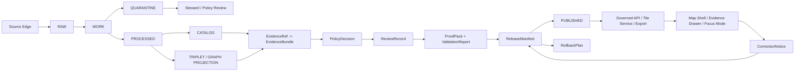

<!-- [KFM_META_BLOCK_V2]
doc_id: kfm://doc/TODO
title: ADR-0001: KFM Truth Path and Public Trust Membrane
type: standard
version: v1
status: draft
owners: <TODO: owner not verified>
created: <TODO: YYYY-MM-DD>
updated: <TODO: YYYY-MM-DD>
policy_label: <TODO: public|restricted|...>
related: [<TODO: docs/doctrine/lifecycle-law.md>, <TODO: docs/doctrine/truth-posture.md>, <TODO: contracts/evidence/evidence_ref.md>, <TODO: contracts/evidence/evidence_bundle.md>, <TODO: release/manifests/>]
tags: [kfm, adr, truth-path, evidence, publication, governance]
notes: [ADR numbering and related paths require mounted-repo verification before acceptance]
[/KFM_META_BLOCK_V2] -->

# ADR-0001: KFM Truth Path and Public Trust Membrane

> [!IMPORTANT]
> **Status:** `PROPOSED`  
> **Decision scope:** repository-wide truth path, public exposure, evidence resolution, publication, AI/runtime boundaries, correction, and rollback  
> **Owning root:** `docs/`  
> **Target path:** `docs/adr/0001-truth-path.md`  
> **Numbering:** `NEEDS VERIFICATION` — confirm this does not conflict with an existing ADR before acceptance.

---

## 1. Context

Kansas Frontier Matrix is a governed, evidence-first, map-first, time-aware spatial knowledge and publication system.

Its durable public unit is the **inspectable claim**: a public or semi-public statement whose supporting evidence, source role, spatial scope, temporal scope, policy posture, review state, release state, and correction lineage can be inspected.

KFM must not allow public-facing outputs to become detached from evidence or policy. Maps, tiles, dashboards, vector indexes, graph projections, AI answers, scenes, summaries, exports, and reports are useful carriers, but they are not sovereign truth.

Without a formal truth path, the project risks:

- public clients reading `RAW`, `WORK`, `QUARANTINE`, or unpublished candidate material directly;
- generated text being mistaken for evidence;
- map layers or graph edges being treated as proof;
- successful ETL being treated as publication;
- source rights, sensitivity, stale state, or review gaps being hidden;
- published artifacts lacking correction and rollback targets.

This ADR defines the default truth path and public trust membrane that every domain lane, API, UI surface, runtime surface, release process, and AI feature must preserve.

---

## 2. Decision

KFM will use the following repository-wide truth path:

```text
SOURCE EDGE
  -> RAW
  -> WORK / QUARANTINE
  -> PROCESSED
  -> CATALOG / TRIPLET
  -> REVIEW / POLICY / PROOF
  -> RELEASE
  -> PUBLISHED
  -> GOVERNED API / TILE SERVICE / EXPORT
  -> MAP SHELL / EVIDENCE DRAWER / FOCUS MODE
```

Publication is a governed state transition. It is not a copy operation, a file move, a successful pipeline run, a generated map tile, or a model response.

Every consequential public-facing claim must be able to resolve:

```text
InspectableClaim
  -> EvidenceRef
  -> EvidenceBundle
  -> SourceDescriptor / Receipts / CatalogRecord / PolicyDecision / ReviewRecord / ReleaseManifest / CorrectionNotice
```

If the system cannot resolve that chain strongly enough for the requested action, it must return a finite negative outcome:

```text
ABSTAIN | DENY | ERROR
```

It must not fill the gap with plausible prose, inferred authority, hidden assumptions, or renderer output.

---

## 3. Decision details

### 3.1 Canonical lifecycle states

| State | Purpose | Public exposure |
| --- | --- | --- |
| `SOURCE EDGE` | Source-facing acquisition boundary, source probes, source metadata, and connector context. | `DENY` unless represented by reviewed source metadata. |
| `RAW` | Source-native capture with checksums, source identity, retrieval context, and ingest receipt. | `DENY`. |
| `WORK` | Transformation, normalization, QA, and intermediate processing. | `DENY`. |
| `QUARANTINE` | Fail-closed hold for invalid, unsafe, unclear, conflicted, restricted, or sensitive material. | `DENY`, except approved public-safe summaries. |
| `PROCESSED` | Normalized candidate data with validation reports and lineage. | Not public until promoted. |
| `CATALOG` | Discoverable metadata, dataset/layer/claim indexing, provenance, and release linkage. | Public only when release state permits. |
| `TRIPLET` | Derived graph projection for relationships and reasoning. | Public only when each exposed edge is evidence-backed and released. |
| `REVIEW / POLICY / PROOF` | Validation, policy, steward review, proof pack, and release readiness. | Steward/internal unless released as public-safe proof. |
| `RELEASE` | Release decision authority, release manifest, proof pack, correction path, and rollback target. | Public-safe release records may be exposed. |
| `PUBLISHED` | Public-safe materialized artifacts and payloads. | Allowed when release manifest and policy permit. |

### 3.2 Public trust membrane

Public and semi-public clients must use governed surfaces:

- governed API responses;
- released artifacts;
- release-backed tile services;
- catalog records with release state;
- EvidenceBundle-backed payloads;
- public-safe LayerManifests;
- correction and rollback notices.

Public and semi-public clients must not directly read:

- `data/raw/`;
- `data/work/`;
- `data/quarantine/`;
- unpublished candidates;
- canonical/internal stores;
- direct source-system side effects;
- direct model runtime outputs;
- secrets or credentials;
- steward-only review queues;
- admin-only controls.

### 3.3 Evidence closure rule

A claim is publishable only when its support chain is inspectable enough for its consequence level.

Minimum closure for a public factual claim:

```text
Claim text or feature assertion
EvidenceRef
EvidenceBundle
SourceDescriptor
Source role and authority limits
Spatial scope
Temporal scope
Rights posture
Sensitivity posture
ValidationReport
PolicyDecision
Review state
Release state
Correction path
Rollback target
```

### 3.4 Derived-products rule

Derived products are never canonical proof by themselves.

| Product | Allowed role | Denied role |
| --- | --- | --- |
| Map layer | Visual carrier of released evidence. | Truth authority. |
| Tile/PMTiles | Rebuildable released artifact. | Evidence source by itself. |
| Graph/triplet | Query/navigation projection. | Canonical record replacement. |
| Vector index/search index | Retrieval acceleration. | Source authority. |
| AI summary | Evidence-bounded explanation. | Proof or release decision. |
| Dashboard | View into governed state. | Publication gate. |
| Export/report | Released carrier with citations. | Silent replacement of evidence. |
| 3D scene/digital twin | Burden-bound visualization. | Visual proof of certainty. |

### 3.5 Runtime and AI rule

AI and model runtimes are interpretive surfaces only.

Allowed:

- summarize resolved EvidenceBundles;
- draft candidate explanations for review;
- classify candidate records with review;
- compare source roles and caveats;
- produce bounded Focus Mode answers with citations.

Denied:

- direct public model endpoint;
- model reading `RAW`, `WORK`, `QUARANTINE`, or unpublished candidates;
- generated language as proof;
- AI deciding rights, sensitivity, release, or stewardship;
- uncited authoritative claims;
- hidden chain-of-thought as a KFM truth object.

Runtime outputs must use finite outcomes:

```text
ANSWER | ABSTAIN | DENY | ERROR
```

### 3.6 Sensitive and rights-uncertain material

When rights, source terms, sensitivity, cultural stewardship, living-person status, DNA/genomic material, rare species, archaeology, infrastructure, or precise location exposure is unclear, KFM must fail closed.

Default actions:

| Risk | Default |
| --- | --- |
| Unknown rights | `DENY` public release. |
| Unknown source role | `ABSTAIN` or `DENY` authority use. |
| Sensitive exact location | `DENY` public exact geometry. |
| Living-person data | `DENY` public exposure unless explicitly reviewed and allowed. |
| DNA/genomic material | `DENY` or restrict by default. |
| Archaeological site precision | `DENY` exact public location by default. |
| Rare species occurrence | `DENY` exact public occurrence by default. |
| Critical infrastructure precision | Restrict, generalize, or deny. |
| Emergency/life-safety request | Point to official sources; KFM is not an emergency alert system. |

---

## 4. Architecture diagram



---

## 5. Consequences

### 5.1 Positive consequences

- Public claims become traceable and correctable.
- Map/UI behavior becomes part of the trust model.
- AI remains useful without becoming authority.
- Domain lanes can grow without weakening governance.
- Sensitive material has a default fail-closed path.
- Release, correction, and rollback become auditable.
- Validators and policy tests can enforce doctrine rather than merely describe it.

### 5.2 Costs and tradeoffs

- Early development is slower because source descriptors, fixtures, validators, policy, and proof objects must come before broad UI polish.
- Some useful-looking public layers will be blocked until rights, sensitivity, review, and release state are resolved.
- More object families must be maintained: EvidenceRef, EvidenceBundle, SourceDescriptor, PolicyDecision, ValidationReport, ReleaseManifest, CorrectionNotice, and RollbackPlan.
- Public APIs may return `ABSTAIN`, `DENY`, or `ERROR` where a less governed system would return plausible but unsupported output.

### 5.3 Accepted tradeoff

KFM accepts slower early publication in exchange for durable trust, reversibility, source integrity, public safety, and inspectability.

---

## 6. Alternatives considered

| Alternative | Decision | Reason |
| --- | --- | --- |
| Public UI reads processed files directly. | Rejected. | Bypasses release, policy, correction, and rollback. |
| Pipeline success equals publication. | Rejected. | ETL success is not a release decision. |
| Map tiles are treated as proof. | Rejected. | Tiles are derived, rebuildable carriers. |
| Graph is treated as canonical truth. | Rejected. | Graph edges are projections and must cite evidence. |
| AI answers directly from model context. | Rejected. | Generated language is not evidence. |
| Fix errors by overwriting published artifacts silently. | Rejected. | Corrections and rollback must remain visible. |
| Publish first, review later. | Rejected. | High-risk domains require review before public release. |
| Put all domain truth in root-level domain folders. | Rejected. | Domain work belongs under responsibility roots. |

---

## 7. Implementation requirements

### 7.1 Required object families

| Object family | Required purpose |
| --- | --- |
| `SourceDescriptor` | Defines source identity, role, authority limits, rights, sensitivity, cadence, steward, and activation state. |
| `IngestReceipt` / `IntakeReceipt` | Records source-native acquisition and raw payload integrity. |
| `ValidationReport` | Records validation result, failures, warnings, and remediation. |
| `EvidenceRef` | Points from claim/object/layer to supporting evidence. |
| `EvidenceBundle` | Resolves support into an inspectable evidence package. |
| `PolicyDecision` | Records allow, deny, restrict, abstain, review-needed, or error outcome with reasons and obligations. |
| `ReviewRecord` | Records steward/domain/policy/release review. |
| `ReleaseManifest` | Defines released assets, hashes, evidence, policy, review, correction, and rollback target. |
| `ProofPack` | Bundles validation, evidence, policy, integrity, review, and release support. |
| `LayerManifest` | Defines released layer artifacts, source, style, bounds, time, sensitivity transform, and evidence payload. |
| `RuntimeResponseEnvelope` | Wraps API/UI/AI output with finite outcome and evidence/policy/citation state. |
| `CorrectionNotice` | Records correction, withdrawal, supersession, public notice, and affected artifacts. |
| `RollbackPlan` | Defines safe reversion target and steps. |

### 7.2 Required policy posture

Policies must fail closed for:

- missing EvidenceRef;
- unresolved EvidenceBundle;
- unknown source role;
- unknown rights;
- unclear sensitivity;
- stale evidence without stale-state handling;
- unreleased public artifact;
- missing correction path;
- missing rollback target;
- direct public model access;
- public access to raw/work/quarantine/candidate material;
- exact sensitive geometry exposure.

### 7.3 Required public API behavior

Public responses must use a finite envelope.

```json
{
  "outcome": "ANSWER | ABSTAIN | DENY | ERROR",
  "payload": {},
  "evidence_refs": [],
  "evidence_bundle_refs": [],
  "policy_decision_ref": "TODO",
  "release_ref": "TODO",
  "correction_state": "current | corrected | superseded | withdrawn | unknown",
  "reasons": []
}
```

Rules:

- `ANSWER` requires evidence closure and policy allow.
- `ABSTAIN` is used when evidence, citation, temporal scope, or source support is insufficient.
- `DENY` is used when policy, rights, sensitivity, access, or safety blocks the request.
- `ERROR` is used for system failure, invalid state, or broken contract.

---

## 8. Validation requirements

Minimum tests for this ADR:

| Test | Expected outcome |
| --- | --- |
| Public route attempts to read `data/raw/`. | `DENY` or test failure. |
| Public route attempts to read `data/work/`. | `DENY` or test failure. |
| Public route attempts to read `data/quarantine/`. | `DENY` or test failure. |
| Claim has no EvidenceRef. | `ABSTAIN` or `DENY`. |
| EvidenceRef does not resolve to EvidenceBundle. | `ABSTAIN` or `ERROR`. |
| EvidenceBundle lacks SourceDescriptor. | `ABSTAIN` or `ERROR`. |
| Unknown rights status. | `DENY` public release. |
| Unknown source role used as authority. | `ABSTAIN` or `DENY`. |
| Sensitive exact geometry requested publicly. | `DENY`. |
| ReleaseManifest lacks rollback target. | `ERROR` / release blocked. |
| Correction overwrites prior release silently. | `ERROR` / release blocked. |
| AI answer lacks citations. | `ABSTAIN` or `ERROR`. |
| Browser calls model runtime directly. | `DENY` / exposure test failure. |
| Layer has no LayerManifest or release ref. | `DENY` / layer hidden. |

Suggested commands after repo mount:

```bash
git status --short
git diff --check

# Adapt to repo-native tooling:
python tools/check_directory_rules.py
python tools/check_no_public_internal_paths.py
python tools/validate_schema_conformance.py
python tools/validate_api_contracts.py
python tools/validators/evidence_resolver.py --fixtures fixtures/
python tools/validators/release_manifest.py --fixtures fixtures/
python -m pytest tests/
```

> [!NOTE]
> Commands above are proposed validation targets. Use repo-native command names when confirmed.

---

## 9. Adoption plan

1. Confirm ADR numbering and path conventions in `docs/adr/`.
2. Add or update doctrine docs that this ADR depends on:
   - `docs/doctrine/lifecycle-law.md`
   - `docs/doctrine/truth-posture.md`
   - `docs/doctrine/trust-membrane.md`
   - `docs/doctrine/ai-boundary.md`
3. Add or confirm contracts for EvidenceRef, EvidenceBundle, SourceDescriptor, PolicyDecision, ReleaseManifest, CorrectionNotice, and RollbackPlan.
4. Add matching machine schemas under the repository’s accepted schema home.
5. Add valid and invalid fixtures.
6. Add fail-closed policy tests.
7. Add public API negative tests for forbidden lifecycle paths.
8. Add a no-network proof slice before any live connector or broad UI expansion.
9. Require this ADR in PR review cards for changes affecting public claims, API responses, AI answers, map layers, releases, corrections, or rollback.

---

## 10. Rollback and supersession

This ADR can be superseded, but not silently replaced.

Required supersession steps:

1. Create a new ADR that explicitly supersedes this one.
2. Mark this ADR as `superseded`.
3. Update any doctrine docs, control-plane registers, contracts, schemas, validators, and tests that reference this ADR.
4. Preserve prior public release and correction lineage.
5. Run path, evidence, policy, release, and rollback validation.
6. Record why the truth path changed and what migration is required.

Rollback of this document-only change:

```bash
git checkout -- docs/adr/0001-truth-path.md
```

If related docs, registers, schemas, policies, or tests were changed in the same PR, revert them in the same rollback PR unless a maintainer explicitly splits rollback scope.

---

## 11. Open verification items

| Item | Status | Required action |
| --- | --- | --- |
| ADR number `0001` | `NEEDS VERIFICATION` | Confirm no existing ADR-0001 conflict. Rename to next available ADR number if needed. |
| Owner | `NEEDS VERIFICATION` | Assign maintainer/steward owner. |
| Created/updated dates | `NEEDS VERIFICATION` | Fill when committed. |
| Related docs | `NEEDS VERIFICATION` | Confirm doctrine doc paths exist or add them in same control-plane PR. |
| Schema home | `NEEDS VERIFICATION` | Confirm accepted schema-home ADR before linking exact schema paths. |
| Policy toolchain | `UNKNOWN` | Confirm whether policy uses OPA/Rego, Conftest, Python validators, or another repo-native tool. |
| API route names | `UNKNOWN` | Bind this ADR to confirmed API contracts after route inventory. |
| Release object names | `NEEDS VERIFICATION` | Confirm exact field names and schema ids for release/proof/correction/rollback objects. |
| Public UI paths | `UNKNOWN` | Confirm map shell, Evidence Drawer, and Focus Mode implementation locations. |

---

## 12. Review checklist

- [ ] Directory Rules checked.
- [ ] ADR numbering checked.
- [ ] No root-level domain folder created.
- [ ] Public trust membrane preserved.
- [ ] Lifecycle path preserved.
- [ ] EvidenceRef-to-EvidenceBundle closure required.
- [ ] Derived products remain derived.
- [ ] AI remains evidence-subordinate.
- [ ] Rights and sensitivity fail closed.
- [ ] Release requires proof, review, correction path, and rollback target.
- [ ] Negative tests exist or are planned.
- [ ] Rollback path documented.
- [ ] Open verification items assigned.
