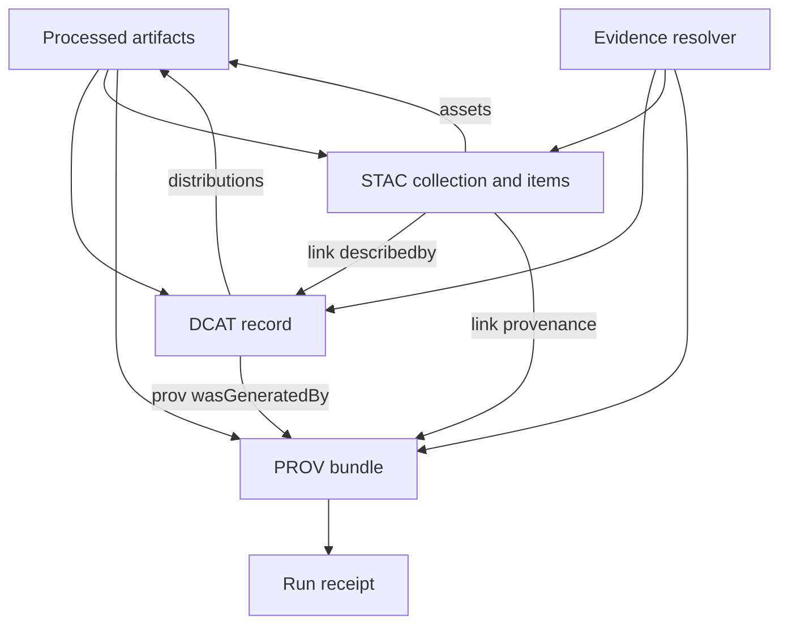

<!-- [KFM_META_BLOCK_V2]
doc_id: kfm://doc/72647c36-3071-4f9e-b27d-3477fe4a571b
title: ADR 0005 Catalog Triplet Strategy for DCAT STAC PROV
type: standard
version: v1
status: draft
owners: TBD Data Stewardship and Platform
created: 2026-03-01
updated: 2026-03-01
policy_label: public
related:
  - TODO link to KFM Definitive Design and Governance Guide vNext 2026-02-20
  - TODO docs/standards/KFM_DCAT_PROFILE.md
  - TODO docs/standards/KFM_STAC_PROFILE.md
  - TODO docs/standards/KFM_PROV_PROFILE.md
tags: [kfm, adr, catalog, dcat, stac, prov, provenance, governance, evidence]
notes:
  - Establishes catalog triplet as the contract surface between pipelines and governed runtime.
  - Cross links are required so EvidenceRefs resolve without guessing.
[/KFM_META_BLOCK_V2] -->

# ADR 0005 Catalog Triplet Strategy for DCAT STAC PROV


**Date:** 2026-03-01  
**Decision status:** Proposed for adoption (promote to Accepted once validators and link checks are in CI)

## Navigation

- [Decision](#decision)
- [Drivers](#drivers)
- [Truth status](#truth-status)
- [Catalog triplet overview](#catalog-triplet-overview)
- [Cross linking and evidence resolution](#cross-linking-and-evidence-resolution)
- [Canonical storage layout](#canonical-storage-layout)
- [Profiles and validation](#profiles-and-validation)
- [Deterministic identity and hashing](#deterministic-identity-and-hashing)
- [Consequences](#consequences)
- [Alternatives considered](#alternatives-considered)
- [Rollback plan](#rollback-plan)
- [Implementation plan](#implementation-plan)
- [Minimum verification steps](#minimum-verification-steps)

---

## Decision

Adopt a **catalog triplet** as the canonical contract surface for every promoted `dataset_version_id`:

1. **DCAT** record for dataset level metadata, rights, and distributions
2. **STAC** catalog for asset inventory with spatiotemporal extents
3. **PROV** bundle for lineage, environment capture, and policy decisions

These three artifacts **MUST cross link deterministically** so that:

- Every `EvidenceRef` resolves without guessing.
- Validation can be enforced in CI as a hard promotion gate.
- Runtime projections (database, search, tiles, graph) remain rebuildable from canonical artifacts.

---

## Drivers

### Confirmed system invariants this ADR must satisfy

- Catalogs and provenance are not optional metadata. They are the canonical interface between pipeline outputs and governed runtime.
- Promotion requires strict catalog triplet validation and cross linking, and resolvable `EvidenceRef`s.
- Evidence resolution is a first class UX contract and must be usable in two UI calls.

### Constraints

- **Default deny** when policy or rights are unclear.
- **No silent assumptions:** every metadata field that affects policy or interpretation is explicit.
- **Rebuildability:** PostGIS, search indexes, and graphs are projections, not sources of truth.

---

## Truth status

This ADR separates what is already established in KFM design docs versus what it newly commits to.

| Label | Meaning in this ADR |
|---|---|
| Confirmed | Direction and invariants already specified in KFM architecture and governance docs |
| Proposed by this ADR | Specific implementation choices this ADR adopts as the default KFM strategy |
| Unknown in repo | Needs verification against the live repo state before claiming it exists |

---

## Catalog triplet overview



### Responsibility split

| Concern | Canonical artifact | Why it lives there |
|---|---|---|
| Dataset identity, publisher, license, rights, themes | DCAT | Optimized for catalog interoperability and policy decisions |
| Asset inventory and spatiotemporal extents | STAC | Optimized for geospatial discovery and traversal |
| Lineage, inputs, tools, parameters, approvals, policy decisions | PROV | Optimized for auditability and reproducibility |

---

## Cross linking and evidence resolution

### Required cross links

The following links are **required** for every promoted dataset version.

| From | To | Mechanism | Purpose |
|---|---|---|---|
| DCAT dataset | Artifact digests | `dcat:distribution` entries | Enables license, access, checksums per distribution |
| DCAT dataset | PROV bundle | `prov:wasGeneratedBy` | Connects dataset release to lineage |
| STAC collection | DCAT dataset | `links[]` with `rel="describedby"` | Connects assets to dataset level governance metadata |
| STAC item | PROV activity or run receipt | `links[]` | Connects each asset group to its producing run |

### EvidenceRef strategy

**Decision:** Evidence references use explicit schemes, and scheme resolution maps to the triplet objects.

- `dcat://...` resolves to dataset and distribution metadata
- `stac://...` resolves to collection, item, and asset metadata
- `prov://...` resolves to lineage activities, entities, and agents
- `doc://...` resolves to governed docs and story citations
- `graph://...` resolves to entity relations (optional, if graph projection enabled)

> Note: the exact path grammar inside each scheme is an implementation detail, but it MUST be deterministic and lintable.

### EvidenceBundle return shape

The evidence resolver returns an `EvidenceBundle` that includes:

- a human renderable view (evidence card)
- machine metadata (JSON)
- artifact links only if allowed by policy
- digests and dataset version identifiers
- audit references

---

## Canonical storage layout

**Decision:** Adopt the object store layout below as the canonical layout for promoted artifacts and catalogs.

```text
data/                                                      | # Governed data lifecycle zones (Truth Path) + catalog triplet outputs
├─ processed/                                               | # Publishable artifacts for each DatasetVersion (immutable once promoted)
│  └─ <dataset_slug>/                                       | # Dataset bucket (stable slug)
│     └─ <dataset_version_id>/                              | # Specific DatasetVersion snapshot (stable ID)
│        ├─ artifacts/                                      | # Materialized artifacts (formats per dataset contract)
│        │  └─ <artifact_name>.<ext>                        | # One output artifact (e.g., geoparquet/cog/pmtiles/json)
│        ├─ checksums.json                                  | # REQUIRED: digests for artifacts (determinism + integrity verification)
│        └─ qa/                                             | # QA outputs for this DatasetVersion
│           └─ validation_report.json                       | # Machine QA report (checks, metrics, pass/fail, inputs/outputs refs)
│
└─ catalog/                                                 | # Catalog triplet + provenance + receipts for each DatasetVersion
   └─ <dataset_slug>/                                       | # Dataset bucket (matches processed/<dataset_slug>/)
      └─ <dataset_version_id>/                              | # DatasetVersion catalog snapshot (must match processed version)
         ├─ dcat.jsonld                                     | # DCAT record (dataset-level metadata + distributions)
         ├─ stac/                                           | # STAC catalog (collections/items/assets)
         │  ├─ collection.json                              | # STAC Collection for this DatasetVersion
         │  └─ items/                                       | # STAC Items (granular assets/tiles/partitions)
         │     └─ <item_id>.json                            | # One STAC Item (must link to assets + checksums as required)
         ├─ prov/                                           | # PROV bundle(s) describing lineage for this version
         │  └─ bundle.jsonld                                | # PROV JSON-LD bundle (activities/agents/entities + links)
         └─ receipts/                                       | # REQUIRED: run receipts proving gates passed for this version
            └─ run_receipt.json                             | # Execution receipt (who/what/when, inputs/outputs, checks, policy decisions)
```

Rules:

- Only `processed/` and `catalog/` artifacts are eligible for serving in governed runtime.
- Every artifact has a digest and appears in `checksums.json`.
- Keep manifests, catalogs, and receipts close to artifacts so the truth path is navigable without a database.

---

## Profiles and validation

### Profile versioning

Each of DCAT, STAC, and PROV has a **KFM profile** that is:

- minimal but strict
- versioned (profile version separate from dataset version)
- enforced in CI
- used by runtime for parsing and policy decisions

### Minimum required fields

#### DCAT

Minimum fields for a dataset record include:

- `dct:title`
- `dct:description`
- `dct:publisher`
- `dct:license` or `dct:rights`
- `dcat:theme` using a controlled vocabulary
- `dct:spatial` and `dct:temporal`
- `dcat:distribution` entries (one per artifact class)
- `prov:wasGeneratedBy` link to PROV activity or bundle
- `kfm:policy_label`
- `kfm:dataset_id` and `kfm:dataset_version_id`

Rights note: if rights do not allow mirroring, the distribution MAY be metadata only, pointing to an upstream access URL without storing the artifact.

#### STAC

Minimum fields for a collection include:

- `id`, `title`, `description`
- `extent` (spatial bbox and temporal interval)
- `license`
- `links` including a link to the DCAT record
- `kfm:dataset_version_id` and policy label

Minimum fields for an item include:

- `id`
- `geometry` or `bbox` consistent with policy label (generalize if needed)
- `datetime` or start and end
- `assets` with `href`, checksum, and media type
- `links` to PROV and to the DCAT distribution

Checksum guidance: prefer the STAC File extension field `file:checksum` which uses Multihash.

#### PROV

Minimum fields include:

- `prov:Activity` per pipeline run
- `prov:Entity` per artifact across RAW, WORK, and PROCESSED
- `prov:Agent` for pipeline and steward approval events
- `prov:used` and `prov:wasGeneratedBy` edges
- `kfm:policy_decision` references (decision id and obligations)
- environment capture (container image digest, git commit, parameters)

### CI validation requirements

Catalog and evidence validation in CI includes:

- JSON schema validation for KFM DCAT, STAC, PROV profiles
- link checking for required cross links in repository context
- evidence resolver contract tests (public allow, restricted deny without leakage)
- spec hash stability tests and golden tests for deterministic canonicalization

---

## Deterministic identity and hashing

**Decision:** Use deterministic canonicalization as the basis for stable IDs.

- `dataset_id` is a stable logical identity.
- `dataset_version_id` is immutable and derived from a deterministic `spec_hash`.
- `spec_hash` is computed from canonical JSON to prevent hash drift and support signing and caching.

This ADR assumes the JSON Canonicalization Scheme approach used by KFM design docs and treats it as required for reproducibility and evidence stability.

---

## Consequences

### Benefits

- Interoperability: aligns with widely adopted catalog and provenance standards.
- Clear separation of concerns: governance metadata is distinct from asset inventory and lineage.
- Evidence first UX becomes testable and enforceable.
- Projections stay disposable: DB and search indexes can be rebuilt from canonical artifacts.

### Costs

- More artifacts to generate, store, validate, and cross link.
- JSON LD and RDF concepts (DCAT and PROV) add complexity for contributors.
- Requires validators, link checkers, and contract tests to avoid drift.

---

## Alternatives considered

1. **STAC only**  
   Pros: single JSON family, great for geospatial assets  
   Cons: dataset level rights and governance metadata become ad hoc; provenance becomes extension heavy

2. **DCAT only**  
   Pros: strong catalog semantics  
   Cons: poor asset level spatiotemporal inventory; not optimized for geospatial traversal

3. **Single custom KFM schema**  
   Pros: full control  
   Cons: reduced interoperability, higher maintenance cost, harder to integrate with existing tools

4. **Central triple store for all metadata and lineage**  
   Pros: powerful queries  
   Cons: violates rebuildability intent unless the store is treated as a projection; raises operational complexity

---

## Rollback plan

If triplet generation or validation blocks delivery:

1. Keep `dataset_id` and `dataset_version_id` stable and continue producing run receipts.
2. Allow a temporary fallback where:
   - STAC exists as the primary crawler interface
   - DCAT is generated as a minimal record referencing STAC as a distribution
   - PROV remains mandatory for auditability
3. Preserve `EvidenceRef` scheme stability by redirecting resolution paths, not by inventing new schemes.

Rollback is complete when the full cross link set is restored and the catalog validation gate is re enabled.

---

## Implementation plan

### Phase 1 Build the contract surface

- [ ] Generate DCAT, STAC, PROV for one MVP dataset version
- [ ] Store catalogs in canonical layout under `data/catalog/<dataset_slug>/<dataset_version_id>/`
- [ ] Implement link checker for cross links
- [ ] Add JSON schema validators for each profile
- [ ] Add evidence resolver contract tests

### Phase 2 Integrate into promotion gates

- [ ] Wire catalog generation into promotion pipeline
- [ ] Enforce catalog triplet validation as a hard gate
- [ ] Update UI Evidence Drawer to resolve EvidenceRefs into EvidenceBundles
- [ ] Add story publishing lint that blocks unresolvable citations

---

## Minimum verification steps

To convert unknowns into confirmed implementation facts, attach the following outputs to the PR that adopts this ADR:

- [ ] repo root directory tree and commit hash
- [ ] confirm presence of validators and schemas for DCAT, STAC, PROV
- [ ] confirm CI workflow includes catalog validation and link check
- [ ] run one dataset through promotion gates and capture artifacts and receipts
- [ ] verify evidence resolver round trip from UI in two calls

---

**Back to top:** [Navigation](#navigation)# ADR 0005: Catalog Triplet (DCAT/STAC/PROV) Strategy

- **Status:** proposed

Planned ADR placeholder.
