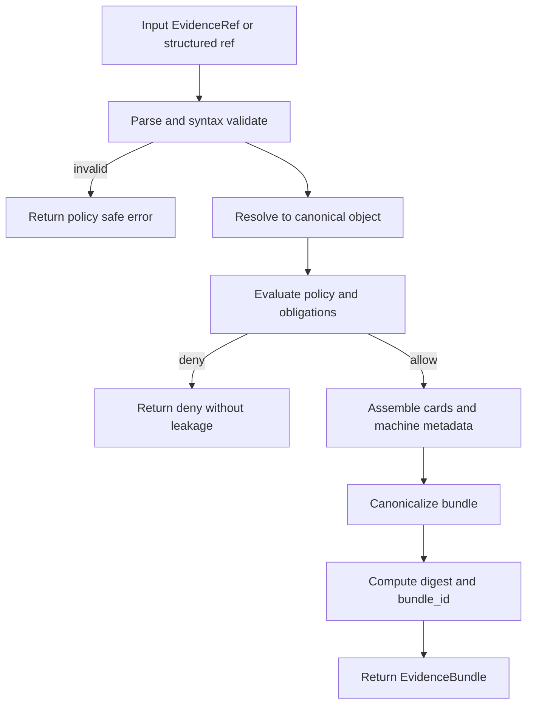

<!-- [KFM_META_BLOCK_V2]
doc_id: kfm://doc/50ff49e9-7317-48ce-8788-841850c98adb
title: ADR 0006 — EvidenceRef and EvidenceBundle Resolution
type: adr
version: v1
status: draft
owners: TBD (KFM core maintainers)
created: 2026-03-01
updated: 2026-03-01
policy_label: public
related: []
tags: [kfm, adr, evidence, provenance, policy, citations]
notes:
  - Defines canonical EvidenceRef schemes and deterministic EvidenceBundle resolution.
  - Establishes CI gates and API contracts so “cite-or-abstain” is enforceable.
[/KFM_META_BLOCK_V2] -->

<a id="top"></a>

# ADR 0006 — EvidenceRef and EvidenceBundle Resolution


**Decision date:** 2026-03-01  
**Status:** Draft (proposed)  
**Owners:** TBD

## Quick navigation

- [Context](#context)
- [Decision](#decision)
- [Requirements](#requirements)
- [EvidenceRef](#evidenceref)
- [EvidenceBundle](#evidencebundle)
- [Resolution algorithm](#resolution-algorithm)
- [API contract](#api-contract)
- [CI gates](#ci-gates)
- [Security and policy](#security-and-policy)
- [Consequences](#consequences)
- [Assumptions, risks, tradeoffs](#assumptions-risks-tradeoffs)
- [Minimum verification steps](#minimum-verification-steps)
- [References](#references)

---

## Context

KFM’s trust membrane depends on citations that resolve to stable, inspectable evidence across **datasets, assets, pipeline lineage, and documents**—and that remain valid across rehosting or infrastructure changes.

The KFM guide establishes:
- Citations are **not just URLs**; they must point to an **immutable dataset version** plus an evidence span.
- Evidence resolution must be simple enough that users actually inspect provenance (bounded to ~two UI calls).
- Evidence must be policy-aware: resolution returns allow/deny and obligations, and must not leak restricted artifacts.

This ADR turns those principles into a concrete contract:
- canonical EvidenceRef schemes,
- deterministic EvidenceBundle structure,
- the resolver algorithm and API surface,
- CI enforcement rules.

---

## Decision

### We will

1. **Standardize EvidenceRef as a URI-like string** with a minimal scheme set:
   - `dcat://...`
   - `stac://...`
   - `prov://...`
   - `doc://...`
   - `graph://...`

2. Provide an **Evidence Resolver** that:
   - accepts an EvidenceRef string or a structured request,
   - applies policy and obligations,
   - returns an EvidenceBundle (human cards + machine metadata),
   - includes artifact links **only when allowed**,
   - produces **digest-addressed**, immutable-by-digest bundles.

3. Enforce end-to-end “cite-or-abstain” via **CI gates**:
   - EvidenceRef syntax linting,
   - resolver contract tests,
   - policy/right checks for story publication,
   - cross-link validation across DCAT/STAC/PROV so resolution never “guesses”.

### We will not

- Treat raw URLs as citations in Story Nodes or Focus Mode answers.
- Allow UI clients to assemble evidence by hitting multiple backend subsystems directly.
- Permit evidence resolution to return restricted artifacts to unauthorized roles.

---

## Requirements

### Confirmed requirements (from KFM guide)

- EvidenceRefs must be **parseable without network calls** and resolver must return **policy-safe errors**.
- Resolver accepts `scheme://...` or a structured reference `(dataset_version + record id + span)`.
- Resolver returns EvidenceBundle containing:
  - renderable human card(s),
  - machine metadata,
  - dataset_version_id + digests,
  - artifact links only if allowed,
  - audit references.
- Resolver must be usable in **≤ 2 UI calls**.
- CI must validate citations (syntax, resolver, policy, rights) and block merges/publish if invalid.
- EvidenceBundle is immutable by digest, may contain multiple evidence cards, and must not include restricted artifacts for unauthorized roles.

### Proposed extensions (this ADR)

- Canonical grammar for each scheme (below) + canonicalization rules.
- A stable request/response schema for `POST /api/v1/evidence/resolve`.
- Caching strategy keyed by canonical EvidenceRef + policy context.

---

## EvidenceRef

### Goals

- **Stable** across rehosting (no direct storage URLs required).
- **Deterministic** to parse and validate locally (no network required to validate basic shape).
- **Composable** so a single evidence bundle can include dataset + asset + run receipt + doc excerpt.

### Canonical string form (PROPOSED)

EvidenceRef is a URI-like string:

```
<scheme>://<authority-and-path>[#<fragment>][?<query>]
```

KFM’s minimal scheme set:

#### 1) DCAT (dataset/distribution metadata)

**Proposed form**
```
dcat://<dataset_slug>@<dataset_version_id>[#dist=<distribution_id>]
```

**Examples**
- `dcat://noaa_ncei_storm_events@2026-02.abcd1234`
- `dcat://noaa_ncei_storm_events@2026-02.abcd1234#dist=events_geoparquet`

Resolver meaning:
- dataset card (publisher, license/rights, coverage, policy label)
- optional distribution card (artifact digest(s), media type(s), access modes)

#### 2) STAC (collection/item/asset)

**Proposed form**
```
stac://<collection_id>/items/<item_id>[#asset=<asset_key>]
```

**Examples**
- `stac://noaa_ncei_storm_events_2026-02.abcd1234/items/event_123456`
- `stac://noaa_ncei_storm_events_2026-02.abcd1234/items/event_123456#asset=source_row`

Resolver meaning:
- item card (policy-consistent geometry/bbox, datetime)
- asset card (digest + media type) if allowed

#### 3) PROV (run lineage)

**Proposed form**
```
prov://<run_id>
```

**Example**
- `prov://kfm://run/2026-02-20T12:34Z.noaa.abcd1234`

Resolver meaning:
- run receipt card (inputs/outputs digests, environment capture, validations)
- provenance graph summary

#### 4) DOC (governed document span)

**Confirmed capability + proposed strictness**

The guide establishes that document citations should anchor to **page + span**, prefer **character offsets**, and may include optional bounding box coordinates.

**Proposed canonical form**
```
doc://<artifact_digest>#page=<page_1_based>&span=<start_char>:<end_char>[&bbox=<x1>,<y1>,<x2>,<y2>]
```

**Examples**
- `doc://sha256:abcd...#page=12&span=1832:1935`
- `doc://sha256:aaaa...#page=1&span=10:200`

**Compatibility note (PROPOSED):** accept `span;=` as an alias for `span=` to tolerate historical encoding artifacts; canonicalize on output to `span=`.

Resolver meaning:
- citation card with rights metadata
- excerpt/highlight (policy-checked)
- link(s) to page image and OCR text artifact, if allowed

#### 5) GRAPH (entity relations)

**Proposed form**
```
graph://<entity_id>[#rel=<relationship_type>]
```

Examples (illustrative):
- `graph://kfm://place/douglas_county`
- `graph://kfm://event/event_123456#rel=documented_by`

Resolver meaning:
- relationship card(s) + provenance pointers (never “free-floating”)

### Parse/validate rules (CONFIRMED + enforced)

- Must be parseable without network calls.
- Syntax validation returns policy-safe errors (no metadata leakage).
- Canonicalization is deterministic (stable ordering of parameters, normalized encoding).

---

## EvidenceBundle

### Definition

EvidenceBundle is the policy-evaluated, immutable package of evidence needed to justify a map feature, narrative claim, or Focus Mode answer.

### Required contents (CONFIRMED)

EvidenceBundle includes:
- `bundle_id` and `digest`
- `policy decision + obligations`
- `cards` (renderable evidence cards)
- machine metadata (dataset_version_id, artifact digests, provenance links, rights metadata)

Bundling rules:
- immutable by digest
- can include multiple evidence cards
- must not include restricted artifacts for unauthorized roles

### Proposed JSON shape

```json
{
  "bundle_id": "kfm://bundle/sha256:3b7c...d9",
  "digest": "sha256:3b7c...d9",
  "dataset_version_id": "2026-02.abcd1234",

  "policy": {
    "decision_id": "kfm://policy_decision/xyz",
    "policy_label": "public",
    "decision": "allow",
    "reason_codes": [],
    "obligations_applied": []
  },

  "rights": {
    "license": "public_domain",
    "attribution": "NOAA NCEI",
    "export_notice": "Attribution required"
  },

  "cards": [
    {
      "type": "dataset",
      "title": "NOAA NCEI Storm Events Database",
      "refs": ["dcat://noaa_ncei_storm_events@2026-02.abcd1234"],
      "summary": "Dataset metadata, coverage, and license/rights."
    },
    {
      "type": "feature",
      "title": "Event: event_123456",
      "refs": ["stac://noaa_ncei_storm_events_2026-02.abcd1234/items/event_123456"],
      "summary": "STAC item and processed record pointer (policy-filtered)."
    },
    {
      "type": "document_span",
      "title": "Supporting excerpt",
      "refs": ["doc://sha256:aaaa...#page=1&span=10:200"],
      "summary": "OCR span highlight and page anchor (if allowed)."
    },
    {
      "type": "provenance",
      "title": "Pipeline run receipt",
      "refs": ["prov://kfm://run/2026-02-20T12:34Z.noaa.abcd1234"],
      "summary": "Lineage for artifacts and validations."
    }
  ],

  "machine": {
    "artifact_digests": ["sha256:2222...", "sha256:3333..."],
    "provenance_links": ["prov://kfm://run/2026-02-20T12:34Z.noaa.abcd1234"],
    "source_refs": [
      "dcat://noaa_ncei_storm_events@2026-02.abcd1234",
      "stac://noaa_ncei_storm_events_2026-02.abcd1234/items/event_123456"
    ]
  },

  "artifacts": [
    {
      "digest": "sha256:2222...",
      "media_type": "application/x-parquet",
      "href": "s3://kfm-processed/noaa/2026-02/events.parquet",
      "allowed": true
    }
  ],

  "audit_ref": "kfm://audit/resolve/2026-03-01T00:00:00Z.1234"
}
```

**Important:** `href` values in `artifacts[]` are returned only if allowed by policy; otherwise the entry is omitted or returned as `{allowed:false}` with no locator fields (implementation choice must be consistent and tested).

---

## Resolution algorithm

### Flow (PROPOSED)



### Scheme resolution mapping (PROPOSED but constrained by confirmed cross-link rules)

- `dcat://...` → DCAT dataset record (+ distribution record if fragment provided)
- `stac://...` → STAC item/asset; use STAC links to DCAT and PROV when needed
- `prov://...` → run receipt / PROV bundle (activity/entity/agent)
- `doc://...` → document artifact by digest; load page + OCR artifacts and span mapping
- `graph://...` → graph projection (if enabled); always attach provenance pointers

**No guessing rule:** resolution must be deterministic using explicit cross-links between catalogs.

---

## API contract

### Endpoint (CONFIRMED existence; PROPOSED request/response details)

`POST /api/v1/evidence/resolve`

**Request (PROPOSED)**

Option A — EvidenceRef string:
```json
{
  "evidence_ref": "doc://sha256:abcd...#page=12&span=1832:1935",
  "context": {
    "surface": "story",
    "intended_policy_label": "public"
  }
}
```

Option B — Structured reference:
```json
{
  "ref": {
    "scheme": "doc",
    "artifact_digest": "sha256:abcd...",
    "page": 12,
    "span": {"start": 1832, "end": 1935}
  },
  "context": {
    "surface": "map",
    "intended_policy_label": "public"
  }
}
```

**Response**
- `200 OK` with EvidenceBundle (allow)
- `403 Forbidden` (deny) with policy-safe body (no sensitive metadata)
- `400 Bad Request` for malformed refs (policy-safe)
- `404 Not Found` for missing refs (policy-safe)

### “Two calls max” UX rule (CONFIRMED)

UI should be able to:
- click feature → resolve evidence → view bundle
- click citation → resolve evidence → view same bundle

---

## CI gates

### Required CI checks (CONFIRMED)

1. **EvidenceRef syntax check**
2. **Resolver check** (refs resolve in test env)
3. **Policy check** (citations allowed for intended story policy label)
4. **Rights check** (media requires rights metadata)

**Gate rule:** Story Nodes cannot merge / publish if citations fail.

### Additional CI (PROPOSED but aligned to guide)

- Link-checker for cross-links across DCAT/STAC/PROV per dataset_version_id
- Golden tests for resolver determinism (canonicalization + digest stability)
- Contract tests:
  - public evidence resolves with allowed artifacts
  - restricted evidence returns 403 with no sensitive leakage

---

## Security and policy

### Hard rules

- Evidence resolution is a **policy enforcement point**.
- Default deny if:
  - policy label is restricted and user lacks role,
  - rights metadata is missing/unclear for requested surface,
  - citation cannot be resolved deterministically.

### Obligations (examples)

- generalize geometry (min cell size)
- remove attributes (field suppression)
- suppress export / enforce attribution text
- “metadata-only” display mode for restricted artifacts

---

## Consequences

### Positive

- Enforces cite-or-abstain with verifiable artifacts.
- Keeps UI simple and trustable (bounded calls).
- Makes evidence review workflows possible (audit-able bundles).

### Negative / costs

- Requires strict catalog profiles and link integrity.
- Adds complexity: canonicalization, policy-safe errors, digesting, caching.

---

## Assumptions, risks, tradeoffs

### Assumptions (explicit)

- DCAT/STAC/PROV catalogs exist per dataset_version_id and are cross-linked deterministically.
- Policy engine returns allow/deny + obligations and is shared between CI and runtime.
- Artifact digests are stable and used as primary identity for artifacts and evidence bundles.

### Risks

- **Broken cross-links** → evidence cannot resolve → publishing blocked.
- **Policy leakage via errors** → must harden error model and tests.
- **Performance issues** → must cache per policy context without leaking between roles.

### Tradeoffs

- Deterministic contracts vs flexibility: stricter profiles reduce drift but require more discipline.
- On-demand resolution vs precomputed bundles: on-demand is flexible; precompute improves speed but increases storage + invalidation complexity.

---

## Minimum verification steps

To convert Unknowns into Confirmed repo reality (without blocking delivery):

- [ ] Verify existing EvidenceRef / EvidenceBundle schema files (if any) under `contracts/`.
- [ ] Verify an evidence resolver route exists (or add one) and wire minimal tests.
- [ ] Add a CI job that lints EvidenceRefs in Story Nodes and runs resolver contract tests.
- [ ] Choose one dataset_version_id and ensure:
  - DCAT record resolves from `dcat://...`
  - STAC item resolves from `stac://...`
  - PROV run receipt resolves from `prov://...`
  - a doc citation resolves from `doc://...`
- [ ] Confirm denial behavior returns 403 and does not leak restricted metadata.

---

## References

- KFM Definitive Design & Governance Guide (vNext), Sections 8.5–8.7 and 23.1–23.7 (catalog cross-links, resolver contract, EvidenceRef schemes, citation linting, EvidenceBundle structure).
- Tooling the KFM pipeline (API surface includes `POST /api/v1/evidence/resolve`).

<a href="#top">Back to top</a># ADR 0006: EvidenceRef and EvidenceBundle Resolution

- **Status:** proposed

Planned ADR placeholder.
