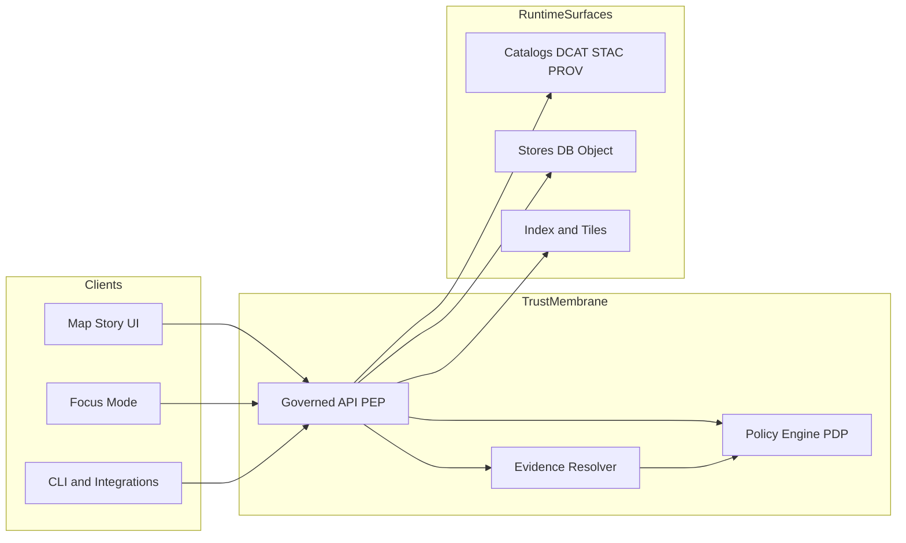

<!-- [KFM_META_BLOCK_V2]
doc_id: kfm://doc/509d0743-c746-449e-ad63-54f260e487f9
title: ADR 0008 — Governed API boundary and PEP enforcement
type: adr
version: v1
status: draft
owners: KFM Platform
created: 2026-03-01
updated: 2026-03-01
policy_label: public
related:
  - TBD
tags:
  - kfm
  - architecture
  - governance
  - policy-as-code
  - trust-membrane
  - pep
notes:
  - Establishes the non-bypassable governed API boundary and Policy Enforcement Point enforcement pattern across UI, Evidence resolution, and Focus Mode.
[/KFM_META_BLOCK_V2] -->

# ADR 0008: Governed API boundary and PEP enforcement

**One-line purpose:** Make the trust membrane enforceable by code, network controls, and tests by requiring *all* client access to flow through a governed API Policy Enforcement Point.

---

## Navigation

- [Context](#context)
- [Decision](#decision)
- [Definitions](#definitions)
- [Architecture](#architecture)
- [Enforcement model](#enforcement-model)
- [CI and promotion gates](#ci-and-promotion-gates)
- [Consequences](#consequences)
- [Alternatives considered](#alternatives-considered)
- [Assumptions, risks, tradeoffs](#assumptions-risks-tradeoffs)
- [Minimum verification steps](#minimum-verification-steps)
- [Rollout plan](#rollout-plan)
- [Rollback plan](#rollback-plan)
- [Open questions](#open-questions)

---

## Context

KFM’s primary promise is governed, evidence-first delivery: every user-facing claim is traceable to inspectable evidence, and anything that cannot be verified must abstain.

That promise fails immediately if any client can bypass policy controls by reading directly from storage, databases, tiles, or catalogs. The highest-impact failure mode is **policy bypass via direct DB or object-storage access**, which can cause:
- sensitive location leakage,
- licensing or rights violations,
- inconsistent results between CI and runtime,
- Focus Mode restricted leakage or hallucination driven by ungoverned retrieval.

This ADR codifies the KFM trust membrane as an enforceable boundary.

**Non-goal:** This ADR does not select a specific identity provider, role model, or authorization scheme beyond requiring that a policy engine can decide allow/deny and obligations based on request context.

---

## Decision

### Decision statement

1. **All data access from any client is mediated through a governed API layer that acts as the Policy Enforcement Point.**
   - Clients include Map Explorer UI, Story UI, Focus Mode, CLI clients, and any third-party integrators.
   - “Data access” includes tiles, STAC item browsing, dataset discovery, story publishing, and evidence resolution.

2. **The policy engine is the Policy Decision Point.**
   - Policies are authored as policy-as-code and run with identical semantics in CI and runtime.
   - CI and runtime must share fixtures and expected outcomes so CI guarantees are meaningful.

3. **The Evidence Resolver is a first-class enforcement surface.**
   - A “citation” is treated as a typed EvidenceRef that resolves to an EvidenceBundle.
   - Evidence resolution must perform policy checks and apply obligations before returning any evidence payload.

4. **The UI never makes policy decisions.**
   - UI may render policy badges, notices, and “why denied” affordances.
   - UI must not contain allow/deny logic beyond interpreting API responses.

5. **Default behavior is fail-closed.**
   - If policy evaluation fails, or required policy inputs are missing, deny the request.
   - Do not leak restricted metadata via error messages (including existence checks and differential 403 vs 404 behavior).

---

## Definitions

**Trust membrane**  
A boundary that prevents clients from bypassing policy enforcement and provenance. All reads and writes go through governed interfaces.

**Policy Decision Point**  
Component that evaluates policy and returns allow/deny plus obligations, typically via OPA or equivalent.

**Policy Enforcement Point**  
Component that *enforces* policy decisions on every request, including applying obligations such as redaction, generalization, and export suppression.

**Policy label**  
A sensitivity and access classification attached to datasets, artifacts, stories, and responses. Used as a primary policy input.

**Obligation**  
A policy-required action (examples: generalize geometry, remove fields, show license notice, suppress export).

**EvidenceRef and EvidenceBundle**  
EvidenceRef is a structured reference to evidence (not a pasted URL). EvidenceBundle is the resolved package including the metadata and provenance needed to inspect and reproduce a claim.

---

## Architecture

### Reference flow

### Minimal surface area

KFM’s runtime should expose a minimal endpoint set sufficient for discovery, browsing, evidence resolution, story publishing, and governed Q&A. All of these endpoints are PEP-protected.

---

## Enforcement model

### Request lifecycle requirements

For any request that could return data, metadata, tiles, evidence, or derived results:

1. **Extract policy input context**
   - principal: user identity and roles
   - action: read, query, export, publish
   - resource: dataset_id, dataset_version_id, story_id, evidence_ref, tile layer id
   - environment: request time, client type, feature flags
   - attributes: policy_label, licensing metadata, sensitivity flags, export intent

2. **Evaluate policy**
   - Call PDP with a stable input schema.
   - Receive decision: allow/deny plus obligations and safe error mode.

3. **Enforce**
   - If deny: return a safe response that does not leak restricted existence.
   - If allow: apply obligations deterministically before returning results.

4. **Audit**
   - Emit an audit record for enforcement outcomes, including the policy decision digest and obligation application (when feasible).

### Obligation examples

- **Geometry generalization**: return generalized polygons instead of precise points.
- **Field suppression**: omit coordinate fields or PII fields from public exports.
- **Export suppression**: allow view but deny bulk download.
- **Notice injection**: include license/rights and attribution in response metadata.
- **Rate limiting**: apply policy-driven throttles for certain datasets.

### Layering invariants

- UI code cannot access DBs, object storage, or internal catalogs directly.
- PEP is the only component with read access to PUBLISHED runtime stores.
- Service-to-store credentials are scoped to the PEP service account, not end users.

### Enforcement mechanisms

| Mechanism | What it prevents | How we enforce |
|---|---|---|
| Network policy | Bypass via direct DB/object access | Only PEP can reach DB/object/tile backends |
| Credential isolation | Secret leakage or lateral movement | Stores accept only PEP credentials; rotate and scope |
| API gateway routing | Accidental public store exposure | No public endpoints for stores; PEP is the ingress |
| Policy-as-code fixtures | CI/runtime mismatch | Same fixtures and expected outcomes in CI and runtime |
| Contract tests | Drift in API schemas or behavior | OpenAPI diff checks; DTO validation |
| Integration tests | Broken evidence resolution or leakage | Resolve sample EvidenceRefs; assert no restricted fields |
| E2E tests | UI “trust surface” regression | Evidence drawer shows license + version; citations resolve |

---

## CI and promotion gates

This ADR requires that governance invariants are encoded as tests that fail closed. At minimum:

- Policy tests: fixture-driven allow/deny and obligation outcomes.
- Contract tests: OpenAPI schema diffs and DTO validation.
- Integration tests: evidence resolver resolves and enforces policy.
- E2E UI tests: layer toggle and feature click opens evidence drawer; story publishing blocks on unresolved citations; Focus Mode abstains when citations cannot be verified.

---

## Consequences

### Positive

- Prevents silent policy bypass and makes the trust membrane enforceable.
- Produces consistent, explainable policy behavior across CI and runtime.
- Centralizes sensitive-location and licensing enforcement where it can be audited.
- Enables Focus Mode cite-or-abstain guarantees by ensuring evidence resolution is governed.

### Negative

- Adds implementation complexity and performance overhead from policy checks and obligation processing.
- Requires robust caching strategies that are policy-aware.
- Requires additional CI investment: policy fixtures, integration tests, and network-policy validation.

---

## Alternatives considered

1. **Client reads directly from DB/object stores**
   - Rejected: bypasses policy; cannot provide uniform obligations enforcement.

2. **UI implements policy logic**
   - Rejected: UI is not a trusted compute boundary and is not authoritative; encourages drift.

3. **Partial enforcement only for “sensitive” endpoints**
   - Rejected: creates gaps and encourages attackers and accidental misuse to route around checks.

4. **Pre-signed URLs for direct downloads**
   - Conditionally acceptable only if:
     - pre-signing is done by the PEP after policy decision,
     - URLs are short-lived, scoped, and include obligations,
     - no sensitive datasets are accessible via pre-signed links unless policy explicitly allows.

---

## Assumptions, risks, tradeoffs

### Assumptions

- A PDP can return allow/deny plus obligations deterministically.
- We can configure networking and credentials so only the PEP can access runtime stores.
- We can maintain policy fixtures and run them in CI.

### Risks

- Misconfigured network or IAM could reintroduce bypass routes.
- Policy drift between CI and runtime could invalidate guarantees.
- Performance issues if policy checks and redaction are not cached appropriately.

### Tradeoffs

- Stronger safety and compliance guarantees in exchange for higher complexity and some latency.
- Central governance in exchange for fewer “quick hacks” and tighter operational discipline.

---

## Minimum verification steps

Fail closed if these are not true:

- [ ] Confirm the cluster network rules prevent UI and public ingress from reaching DB/object/tile backends directly.
- [ ] Confirm store credentials are not present in UI build artifacts or public runtime configs.
- [ ] Confirm policy fixtures run in CI and match runtime outcomes for the same inputs.
- [ ] Confirm evidence resolution enforces policy and obligations.
- [ ] Confirm error responses do not leak restricted existence or metadata.
- [ ] Confirm Focus Mode and Story publishing hard-gate on resolvable, policy-allowed evidence.

---

## Rollout plan

1. Implement PDP integration and policy input schema.
2. Add PEP middleware to governed API endpoints.
3. Add evidence resolver endpoint as a governed service and enforce obligations.
4. Add CI policy fixtures and blocking tests.
5. Add contract tests for OpenAPI surfaces and DTO validation.
6. Add network policies and credential isolation.
7. Add E2E tests for Map Explorer evidence drawer and Story publish gates.
8. Add Focus Mode evaluation harness and “golden query” regression tests.

---

## Rollback plan

- Roll back to the last known-good PEP release if enforcement changes regress availability.
- Roll back policy bundle to last passing fixture set if new policies break invariants.
- Do not “temporarily bypass” PEP to restore service; that violates the trust membrane and can create irreversible leakage.

---

## Open questions

- Which identity provider and role model is chosen, and what attributes are passed to policy?
- How should we standardize safe error modes for restricted resources across endpoints?
- What are the policy-aware caching rules for tiles, STAC items, and dataset discovery?
- How do we attest and sign policy bundles and their deployment to runtime?
- Should pre-signed download URLs ever be permitted, and if so, which policy labels allow them?

---

_End of ADR 0008_# ADR 0008: Governed API Boundary and PEP Enforcement

- **Status:** proposed

Planned ADR placeholder.
