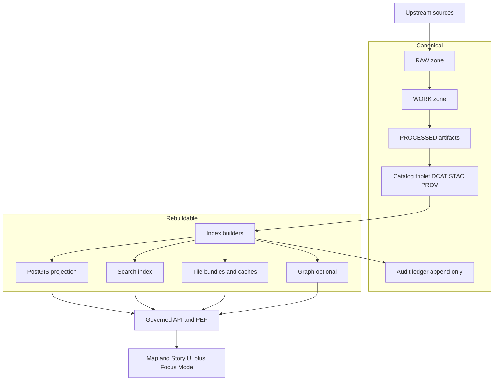

<!-- [KFM_META_BLOCK_V2]
doc_id: kfm://doc/9d0ac888-3e1f-4b9a-ba64-54f86ca1f199
title: ADR 0009 — Search index, tiles, and rebuildability
type: adr
version: v1
status: draft
owners: KFM maintainers
created: 2026-03-01
updated: 2026-03-01
policy_label: public
related:
  - TODO: link KFM “Promotion Contract” doc/section
  - TODO: link KFM “Storage and indexing: projections and rebuild strategy” doc/section
tags:
  - kfm
  - adr
  - indexing
  - tiles
notes:
  - Defines canonical vs rebuildable boundaries for search + tiles, and a deterministic rebuild contract.
[/KFM_META_BLOCK_V2] -->

# ADR 0009: Search index, tiles, and rebuildability

**Purpose:** Prevent “shadow sources” by ensuring **search** and **tiles** are always **rebuildable projections** backed by the canonical truth path, and that rebuilds are deterministic, auditable, and policy-safe.

---

## Navigation

- [Context](#context)
- [Decision](#decision)
- [Architecture view](#architecture-view)
- [Rebuild contract](#rebuild-contract)
- [Consequences](#consequences)
- [Alternatives considered](#alternatives-considered)
- [Rollback plan](#rollback-plan)
- [Unknowns and minimum verification steps](#unknowns-and-minimum-verification-steps)

---

## Context

KFM requires runtime surfaces such as **dataset discovery**, **story search**, **document/OCR search**, and **fast map rendering**. At the same time, KFM’s trust membrane demands that **every user-facing result is traceable** to resolvable evidence, and that the platform is **disaster-recoverable** by rebuilding projections from canonical artifacts.

This ADR operationalizes the KFM guidance that:

- **Object storage + catalogs + provenance are canonical**, while **DB/search/graph/tiles are rebuildable projections**.
- **Search results must resolve to EvidenceRefs** (otherwise search becomes an unverifiable shadow source).
- **Tile strategy needs an explicit decision**, with PMTiles as a recommended MVP default when appropriate.
- The system must support a **rebuild pipeline** that can reconstruct projections from promoted artifacts and catalogs, producing a rebuild receipt.

> **NOTE**
> This ADR does **not** choose a specific vendor (Elastic/OpenSearch/etc.) unless/ until verified in the live repo. It defines the **contract**, not the implementation.

---

## Decision

### D1. Canonical vs rebuildable boundary (hard rule)

**Decision:** Treat **search index** and **tiles** as **rebuildable projections**. They must never become the source of truth.

- **Canonical truth set (must be sufficient for recovery):**
  - RAW, WORK, PROCESSED artifacts (by digest) and checksums
  - Catalog triplet (DCAT + STAC + PROV) and run receipts
  - Append-only audit record / audit ledger

- **Rebuildable projections (can be dropped + regenerated):**
  - PostGIS projection tables
  - Search indexes
  - Tile bundles / tile caches
  - Optional graph store + optional vector search stores

### D2. Search index contract (evidence-first search)

**Decision:** The search index is required for:
- dataset discovery
- story search
- document/OCR search

**And it must:**
- index records keyed by **dataset_version_id** and/or **artifact digest** as applicable
- always carry **evidence_ref** and **policy_label**
- store **spatial + temporal extents** for filtering
- store text fields (metadata, narrative, OCR text) only when policy allows

**Critical rule:** Search results returned to clients must map to **EvidenceRefs that resolve**. No unresolved “search-only” identifiers are allowed.

### D3. Tile strategy (MVP default + evolution path)

**Decision:** For MVP, adopt **Option B**:
- **Prebuilt PMTiles bundles** for large feature layers
- plus a **small feature query endpoint** for identify-on-click

Keep Option A (server-side tiles from PostGIS → tile server → MVT) as a later evolution if dynamic filtering becomes essential.

**Policy rule:** Any tile output must respect policy labels and obligations (generalization/redaction), default-deny when unclear.

### D4. Deterministic rebuildability requirements

**Decision:** Tile and index builds must be reproducible and auditable, including:
- pinned toolchain dependencies (e.g., container image digests)
- deterministic input ordering
- avoiding clock-dependent bytes
- stable floating-point handling for tile generation

### D5. Rebuild receipts are mandatory

**Decision:** Every projection rebuild must emit a **rebuild receipt** recorded into the audit ledger, capturing:
- inputs (catalog + artifact digests)
- build spec and parameters (including profile versions)
- tool/environment identity (container digest, versions)
- outputs (projection identifiers and digests, where applicable)
- validation summary (counts/extents checks)

---

## Architecture view

### Serving rule

Clients **do not** read storage, indexes, or tiles directly. All access remains behind the **governed API/PEP** so policy, logging, and evidence bundling are enforceable.

---

## Rebuild contract

### R1. Rebuild pipeline algorithm

A rebuild pipeline must support rebuilding projections from canonical stores:

1. read catalogs for a dataset_version_id
2. locate processed artifacts by digest/path
3. load into projections (PostGIS, search, graph, tile caches)
4. validate counts and extents against catalog metadata
5. record a rebuild receipt in the audit ledger

### R2. Projection profiles

To keep rebuilds stable and evolvable, define **profile versions** (examples):

- `search_profile_version: v1`
- `tile_profile_version: v1`
- `tile_style_pack: default_v1`

If a build algorithm changes and output bytes would differ, bump the relevant profile version (and capture it in receipts + release manifests).

### R3. Storage of tile bundles (PMTiles)

PMTiles bundles are **rebuildable artifacts** that may be stored as **PROCESSED artifacts** for hosting/caching, but must not be treated as source truth.

Suggested convention (PROPOSED; adjust to repo standards):

- `data/processed/<dataset_slug>/<dataset_version_id>/artifacts/<layer_slug>.pmtiles`
- include PMTiles digests in `checksums.json`
- reference PMTiles as STAC assets so evidence resolution can point to them

---

## Consequences

### Benefits
- **Disaster recovery is simpler:** restore object storage + catalogs, replay rebuild pipeline.
- **Reduced vendor lock-in:** indexes and DB states are not irreplaceable.
- **Trust membrane stays intact:** search and tiles can’t become “shadow truth.”
- **Auditability:** rebuild receipts make rebuilds reviewable and reproducible.

### Costs
- Requires stronger determinism discipline (pin toolchain, stable float rules, etc.).
- Adds operational responsibility: projection rebuilds must be automated and monitored.
- Search and tiles must be engineered to respect policy labels/obligations.

---

## Alternatives considered

### Tiles
- **Option A: server-side tiles (PostGIS → tile service → MVT)**
  - Pros: dynamic filters, styling flexibility
  - Cons: higher runtime complexity and operational risk
- **Option B: prebuilt PMTiles bundles**
  - Pros: simple hosting, strong caching, reproducible
  - Cons: rebuild required for changes; dynamic filtering limited

**Chosen for MVP:** Option B, with a path to Option A later.

### Search
- **DB-only search (e.g., Postgres full-text)** vs **dedicated search service**
  - This ADR does not lock in a product; it locks in the evidence-first + rebuildable contract.

---

## Rollback plan

Rollback is a **release-level** concern, not a “patch-in-place” concern:

1. revert to prior **release manifest**
2. drop projections (search index, tiles store, PostGIS projection) as needed
3. rebuild projections from the canonical truth set for the rolled-back release
4. verify EvidenceRefs resolve and tiles render for the rolled-back dataset_version_id set

---

## Unknowns and minimum verification steps

> **WARNING**
> Do not claim module/package existence until verified in the live repo.

Minimum checks to convert Unknown → Confirmed:

- [ ] Confirm repo ADR location (`docs/adr/` vs `docs/architecture/adr/`)
- [ ] Confirm whether an “index builders” module exists and where it lives
- [ ] Confirm whether PMTiles is already produced in pipelines or only planned
- [ ] Confirm what search engine (if any) is deployed for dataset/story/doc search
- [ ] Confirm current API route patterns for:
  - dataset discovery search
  - story search
  - tiles serving
- [ ] Confirm policy enforcement is applied to:
  - search queries (filter by policy_label)
  - tile responses (obligations honored; default-deny when unclear)
- [ ] Confirm audit ledger/run receipt storage layout and schema

---

## Appendix: Definitions

- **Canonical truth set:** the minimal artifact + metadata set required to reproduce and audit outputs.
- **Rebuildable projection:** a derived structure (DB, index, cache) that can be recreated from canonical stores and must never be the only source of information.
- **EvidenceRef:** a stable resolvable pointer that can be turned into an EvidenceBundle via the evidence resolver.

---

**Back to top:** [Navigation](#navigation)# ADR 0009: Search Index, Tiles, and Rebuildability

- **Status:** proposed

Planned ADR placeholder.
