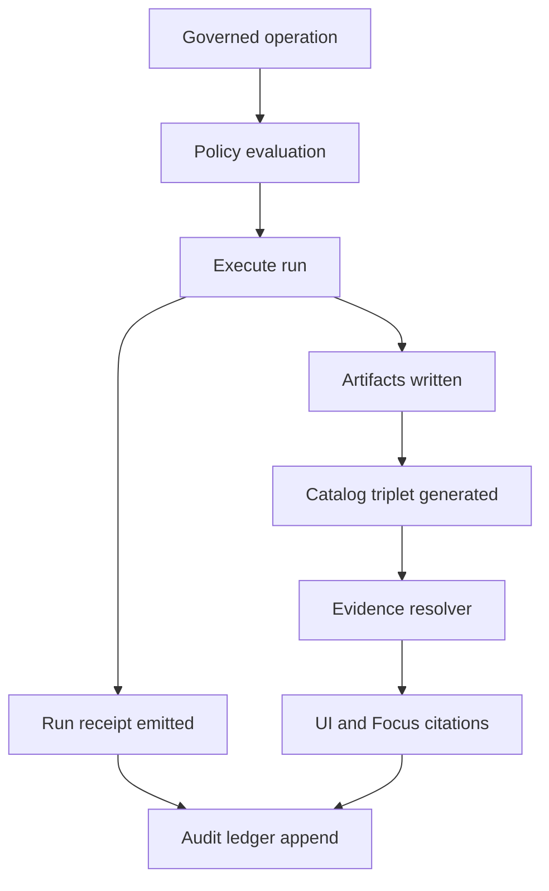

<!-- [KFM_META_BLOCK_V2]
doc_id: kfm://doc/d66da214-6aca-40e3-bc39-1cbf1aa03e18
title: "ADR 0011: Run Receipts and Audit Ledger Minimums"
type: standard
version: v1
status: draft
owners: KFM Core
created: 2026-03-01
updated: 2026-03-01
policy_label: public
related:
  - docs/adr/
  - docs/governance/
  - docs/ops/
tags: [kfm, adr, provenance, audit, receipts, governance]
notes:
  - "Defines the minimum required fields and invariants for run receipts and the append-only audit ledger."
[/KFM_META_BLOCK_V2] -->

# ADR 0011: Run Receipts and Audit Ledger Minimums


> **One-line decision:** Every governed operation (pipelines, promotions, Story publish, Focus Mode) **MUST** emit a **run receipt** with a stable `run_id`, digests, environment, validation, and policy decision references; each receipt is indexed in an **append-only audit ledger** that is itself governed.

---

## Navigation

- [Context](#context)
- [Decision](#decision)
- [Definitions](#definitions)
- [Run receipt minimums](#run-receipt-minimums)
- [Audit ledger minimums](#audit-ledger-minimums)
- [Security, redaction, and retention](#security-redaction-and-retention)
- [Enforcement and gates](#enforcement-and-gates)
- [Consequences](#consequences)
- [Alternatives considered](#alternatives-considered)
- [Implementation plan](#implementation-plan)
- [Minimum verification steps](#minimum-verification-steps)
- [References](#references)

---

## Context

KFM’s promotion contract depends on an **auditable truth path**. Without consistent receipts and an append-only audit ledger, we cannot reliably:

- reproduce a dataset version (inputs, transforms, toolchain),
- explain *why* something was allowed/denied/redacted,
- show “trust surfaces” in the UI (freshness, validation, provenance),
- debug failures without leaking restricted information.

This ADR standardizes the **minimum required** shape of:
1) **Run receipts** (per governed operation), and  
2) the **Audit ledger** (append-only index of run receipts / governance events).

---

## Decision

### Decision drivers

- **Fail-closed governance:** promotion/publishing must be blocked when evidence is missing or unverifiable.
- **Traceability:** “who / what / when / why” and “inputs/outputs by digest” are mandatory for governed operations.
- **Non-leakage:** receipts and ledger entries must be policy-aware and redactable.
- **Idempotence:** reruns should not create ambiguous duplicates; receipts/ledger must support dedupe keys.

### Decision summary

- A **run receipt** is a required artifact for every governed operation.
- The **audit ledger** is append-only and treated as a governed dataset.
- Promotion to runtime surfaces is blocked unless the receipt minimums validate.
- APIs and UI surfaces expose `audit_ref` (derived from `run_id`) for follow-up and steward review.

---

## Definitions

| Term | Meaning |
|---|---|
| **Governed operation** | Any operation whose output can change what users see or what the system asserts (pipeline run, dataset promotion, story publish, Focus Mode answer, policy evaluation, etc.). |
| **Run receipt** | A structured, machine-validated JSON document describing the operation (inputs, outputs, environment, validation results, and policy decision refs). |
| **Audit ledger** | An append-only log / dataset of audit entries that index run receipts and other governance-significant events. |
| **audit_ref** | A stable reference included in user-facing responses so issues can be traced and reviewed without exposing sensitive details. In v1, `audit_ref` MUST equal `run_id` or a deterministic, reversible alias of it. |

---

## Run receipt minimums

### Format and invariants (normative)

**Receipt file format:** JSON (UTF-8).  
**Schema:** `kfm_run_receipt_version: "v1"` (required).  
**Mutability:** **immutable** once written; corrections must be new receipts that reference the old one (see [Append-only corrections](#append-only-corrections)).  
**Digest:** the receipt MUST be content-addressable via a `sha256:<hex>` digest computed over a canonical form (implementation-defined, but deterministic).

### Minimum required fields (v1)

> The table below is the minimum contract. Pipelines MAY add more fields, but MUST NOT remove or rename these without a new major schema version.

| Field | Type | Required | Notes |
|---|---:|:---:|---|
| `kfm_run_receipt_version` | string | ✅ | Must equal `"v1"`. |
| `run_id` | string (URI) | ✅ | Stable ID (e.g., `kfm://run/<timestamp>.<suffix>`). Also used as `audit_ref`. |
| `actor.principal` | string | ✅ | Human or service principal (e.g., `svc:pipeline`, `user:<id>`). |
| `actor.role` | string | ✅ | Role at time of operation (e.g., `pipeline`, `steward`, `viewer`). |
| `operation` | string | ✅ | Short operation label (e.g., `ingest+publish`, `promote`, `story_publish`, `focus/ask`). |
| `created_at` | string (RFC3339) | ✅ | When receipt was finalized. |
| `inputs[]` | array | ✅ | Array may be empty, but must exist. |
| `inputs[].uri` | string | ✅ | Path/URI (may be redacted or logical). |
| `inputs[].digest` | string | ✅ | Digest `sha256:<hex>` (or other allowed algorithms if policy allows). |
| `outputs[]` | array | ✅ | Array may be empty, but must exist. |
| `outputs[].uri` | string | ✅ | Path/URI (may be redacted or logical). |
| `outputs[].digest` | string | ✅ | Digest `sha256:<hex>`. |
| `environment.container_digest` | string | ✅ | Image digest (`sha256:<hex>`). |
| `environment.git_commit` | string | ✅ | VCS commit SHA (or equivalent immutable revision). |
| `environment.params_digest` | string | ✅ | Digest of normalized parameters/config. |
| `validation.status` | string | ✅ | Enum: `pass` \| `fail` \| `warn` \| `abstain`. |
| `validation.report_digest` | string | ✅ | Digest of validation report artifact. |
| `policy.decision_id` | string (URI) | ✅ | Pointer to evaluated policy decision record. |

### Pipeline-specific required fields (v1)

For **pipeline** operations that write datasets intended for promotion:

| Field | Type | Required | Notes |
|---|---:|:---:|---|
| `dataset_version_id` | string | ✅ | Required for pipeline runs that create or promote a dataset version. |

### Focus Mode required additions (v1)

For `operation: "focus/ask"` receipts, include **at minimum**:

| Field | Type | Required | Notes |
|---|---:|:---:|---|
| `focus.query_hash` | string | ✅ | Digest of the user query text (store raw text separately under stricter controls if needed). |
| `focus.view_state_digest` | string | ✅ | Digest of view_state (bbox/time/layers) or `"sha256:<empty>"` if none. |
| `focus.citations[]` | array | ✅ | EvidenceRefs or EvidenceBundle digests that were used. |
| `focus.output_hash` | string | ✅ | Digest of answer text (and optionally structured answer JSON). |
| `focus.model_id` | string | ✅ | Model/version identifier used to produce the answer. |
| `focus.latency_ms` | integer | ✅ | End-to-end latency (for ops and evaluation). |

> NOTE: Focus Mode must include `audit_ref` (derived from `run_id`) in the API response even when abstaining.

### Example (v1)

```json
{
  "kfm_run_receipt_version": "v1",
  "run_id": "kfm://run/2026-02-20T12:00:00Z.abcd",
  "actor": { "principal": "svc:pipeline", "role": "pipeline" },
  "operation": "ingest+publish",
  "dataset_version_id": "2026-02.abcd1234",
  "inputs": [{ "uri": "raw/source.csv", "digest": "sha256:1111" }],
  "outputs": [{ "uri": "processed/events.parquet", "digest": "sha256:2222" }],
  "environment": {
    "container_digest": "sha256:img...",
    "git_commit": "deadbeef",
    "params_digest": "sha256:3333"
  },
  "validation": { "status": "pass", "report_digest": "sha256:7777" },
  "policy": { "decision_id": "kfm://policy_decision/xyz" },
  "created_at": "2026-02-20T12:05:00Z"
}
```

---

## Audit ledger minimums

### Purpose

The audit ledger is a **queryable index** for receipts and governance events. It is used for:

- operational debugging (by `audit_ref` / `run_id`),
- compliance and steward review,
- “freshness” and “last run” signals without crawling storage,
- cross-linking to PROV bundles and evidence bundles.

### Format and invariants (normative)

- **Append-only:** entries are never edited or deleted.
- **Corrections:** represented by new entries that reference prior entries/receipts.
- **Governed dataset:** ledger access is policy-controlled; redactions may apply.
- **Storage-friendly:** v1 SHOULD be newline-delimited JSON (NDJSON) for append + indexing.

### Minimum required fields (v1)

| Field | Type | Required | Notes |
|---|---:|:---:|---|
| `kfm_audit_entry_version` | string | ✅ | Must equal `"v1"`. |
| `audit_entry_id` | string (URI) | ✅ | Unique entry id (e.g., `kfm://audit/entry/<ulid>`). |
| `run_id` | string (URI) | ✅ | Points to the run receipt. |
| `receipt_digest` | string | ✅ | Digest of the run receipt JSON. |
| `event_type` | string | ✅ | Enum: `pipeline_run` \| `promotion` \| `story_publish` \| `focus_query` \| `policy_eval` \| `rollback` \| `other`. |
| `status` | string | ✅ | Enum: `pass` \| `fail` \| `warn` \| `abstain`. |
| `principal` | string | ✅ | Copy of actor principal for fast filtering. |
| `role` | string | ✅ | Copy of actor role for fast filtering. |
| `created_at` | string (RFC3339) | ✅ | When ledger entry was appended. |
| `policy_decision_id` | string (URI) | ✅ | Policy decision reference (may be a redacted placeholder if policy requires). |
| `subject.dataset_version_id` | string | ➖ | Required when event pertains to a dataset version. |
| `subject.story_id` | string | ➖ | Required when event pertains to a story node publish. |
| `subject.focus_query_hash` | string | ➖ | Required when event pertains to a focus query. |
| `inputs_digests[]` | array | ✅ | Digests only (minimizes leakage vs raw URIs). |
| `outputs_digests[]` | array | ✅ | Digests only. |
| `supersedes` | string (URI) | ➖ | Optional pointer to prior `audit_entry_id` (for corrections). |

### Append-only corrections

If a receipt/entry is later found to be incorrect:

- Do **not** edit or delete the old receipt.
- Emit a new receipt (or “correction receipt”) and append a new audit entry:
  - `supersedes: kfm://audit/entry/<old>`
  - and a human-safe reason code in an optional `correction.reason_code`.

---

## Security, redaction, and retention

### Classification rules (normative)

- Receipts and audit entries MUST be assigned a `policy_label` at storage time (not necessarily inside the JSON payload if the storage system carries labels).
- Receipts/logs MUST NOT contain secrets, tokens, or raw credentials.
- URIs in `inputs[].uri` / `outputs[].uri` MUST be **redactable** (use logical paths when physical paths would leak sensitive locations or identities).

### Retention (v1 baseline)

- Audit ledger: retained per governance policy; default is “long-lived”.
- Run receipts: retained at least as long as the referenced dataset versions are published.
- Validation reports: retained at least as long as receipts are retained (since receipts reference them by digest).

---

## Enforcement and gates

### CI and promotion gates

Promotion to runtime surfaces (PUBLISHED) MUST be blocked unless:

- a run receipt exists,
- the receipt validates against the v1 schema,
- the audit ledger append for the run exists,
- and referenced digests/objects resolve (or fail closed if resolution is restricted).

### API/UI contract hooks

- Every governed API response that can change state (or that can expose evidence) MUST return an `audit_ref`.
- Error responses MUST include an `audit_ref` so stewards can trace without leaking restricted existence.

---

## Mermaid: how receipts and ledger fit the trust membrane



---

## Consequences

### Benefits

- Makes reproducibility and accountability measurable (every run has a receipt and `audit_ref`).
- Allows **fail-closed** promotion gates to be automated and reviewed.
- Enables UI “trust surfaces” (freshness, provenance links) without scanning raw storage.
- Supports post-incident review and rollback workflows without guesswork.

### Costs / risks

- Additional implementation work: schema, emitters, ledger appender, and access controls.
- Storage overhead for receipts + reports.
- **Leakage risk** if receipts/logs accidentally include sensitive URIs/fields; mitigated by policy labeling + redaction + restricted access.

---

## Alternatives considered

1. **Ad-hoc logs only**  
   - Rejected: unstructured, hard to validate, and tends to leak sensitive details.

2. **External observability tool as the sole ledger**  
   - Rejected: great for telemetry, insufficient as a governed, durable audit dataset tied to KFM identifiers/digests.

3. **Store receipts inside catalogs only**  
   - Rejected: catalog profiles should remain focused; receipts need independent lifecycle and access control.

---

## Implementation plan

> Keep this incremental and reversible.

### Phase 0 — Contract-first scaffolding (schemas)

- Add `run_receipt` schema (v1) + fixtures (valid + invalid).
- Add `audit_entry` schema (v1) + fixtures.
- Wire schema validation into CI as a required check.

### Phase 1 — Emit receipts in one pilot lane

- Choose one dataset pipeline (or one Focus Mode endpoint) and emit receipts to a staging location.
- Append audit entries in NDJSON and verify append-only behavior.

### Phase 2 — Gate promotion on receipts + ledger

- Add policy checks that fail closed if:
  - receipt missing,
  - ledger entry missing,
  - digests invalid/unresolvable for permitted users.

### Phase 3 — Surface receipts in UI and APIs

- Add a “ReceiptViewer” that renders receipts with policy-safe redactions.
- Ensure invalid/unsigned receipts render explicitly as **untrusted**.

---

## Minimum verification steps

Because repo layout and module names can differ across deployments, do not assume paths exist. Before implementing:

- Confirm where schemas and fixtures live (contracts vs tools vs docs).
- Confirm how policy labels/obligations are stored and enforced.
- Confirm artifact store and whether digests are already computed deterministically.
- Confirm whether Focus Mode already emits an `audit_ref` and where it should point.
- Confirm how long audit data must be retained and who can access it.

---

## References

- KFM Ultimate Blueprint (Draft), “Run receipts and audit ledger” + run receipt template; Focus Mode as governed run.
- KFM Architecture, Governance, and Delivery Plan, “Promotion Contract” gate F (run receipt & audit record).
- KFM Design & Governance Guide (vNext), audit and observability requirements for governed operations.

---

_Back to top: [Navigation](#navigation)_# ADR 0011: Run Receipts and Audit Ledger Minimums

- **Status:** proposed

Planned ADR placeholder.
