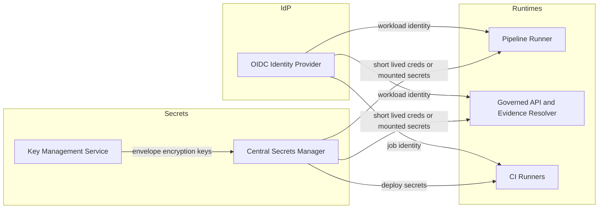

<!-- [KFM_META_BLOCK_V2]
doc_id: kfm://doc/d7c43950-93a4-4bd9-b9ca-f73e590d2ad7
title: "ADR 0012: Secrets Management and Rotation"
type: adr
version: v1
status: draft
owners: KFM Platform & Security (TBD)
created: 2026-03-01
updated: 2026-03-01
policy_label: restricted
related:
  - docs/architecture/   # TODO: link the architecture baseline doc once confirmed in repo
  - docs/adr/0011-*.md   # TODO: link any authn/z / deployment ADRs that interact with secrets
tags:
  - kfm
  - adr
  - security
  - secrets
  - rotation
notes:
  - "Decision focuses on preventing secret sprawl and enforcing rotation + auditability across pipelines, APIs, and UI surfaces."
  - "Vendor selection is explicitly deferred; contracts are defined so implementations can swap."
[/KFM_META_BLOCK_V2] -->

# ADR 0012: Secrets Management and Rotation

**One-line purpose:** Define how KFM stores, delivers, audits, and rotates secrets without breaking the trust membrane.


---

## Navigation

- [Context](#context)
- [Decision](#decision)
- [Non-goals](#non-goals)
- [Scope](#scope)
- [Decision drivers](#decision-drivers)
- [Architecture](#architecture)
- [Rotation policy](#rotation-policy)
- [Audit & evidence](#audit--evidence)
- [Implementation plan](#implementation-plan)
- [Consequences](#consequences)
- [Alternatives considered](#alternatives-considered)
- [Open questions](#open-questions)
- [Minimum verification steps](#minimum-verification-steps)

---

## Context

KFM operates a **governed, evidence-first** system where policy enforcement, provenance, and auditability are core invariants. The system handles sensitive locations and restricted partner data; therefore **security is integrated into the trust membrane and governance gates**, not treated as a bolt-on.

Secrets (API keys, database credentials, signing keys, encryption keys, CI tokens, etc.) create a unique risk:
- they are **high-impact** if leaked,
- they are often **long-lived** by default,
- and they tend to spread across repos, CI logs, environment variables, and developer laptops unless explicitly governed.

This ADR defines a baseline secrets strategy consistent with:
- *least privilege*,
- *default deny*,
- *auditable operations*,
- and *rotation as routine, not exception*.

---

## Decision

### Decision statement

KFM will use a **central secrets manager** as the *source of truth* for secrets, with automated delivery to runtimes and automated rotation wherever feasible.

**Hard rule:** No plaintext secrets are stored in the repository (including `docs/`, `data/`, `configs/`, CI configs, or examples). Only **references** (secret names/paths/IDs) and **policies** may be stored.

### Decision details

1. **Central secrets manager**
   - All secrets live in a dedicated secrets system (vendor TBD).
   - KFM runtimes obtain secrets via **authenticated, least-privilege access** (prefer workload identity / OIDC-based methods over static shared tokens).

2. **Scoped credentials per boundary**
   - Pipeline runners use **scoped credentials per source** (credential blast radius matches the source integration boundary).
   - The UI is never given privileged tokens beyond the session needs; privileged operations occur server-side behind governed APIs.

3. **Prefer short-lived / dynamic secrets**
   - Prefer **ephemeral credentials** (time-limited, on-demand generated) over long-lived API keys.
   - Where long-lived credentials are unavoidable, enforce rotation schedules and revocation workflows.

4. **Rotation is mandatory and auditable**
   - Secrets are rotated on schedule and on incident triggers.
   - Rotation events are recorded in audit logs (without storing secret material).

5. **No “secret value” in run receipts; only secret references**
   - Run receipts may record **secret references and versions** (metadata only) to support reproducibility and forensic analysis, but must never log secret values.

---

## Non-goals

- Selecting a specific vendor (Vault vs cloud KMS/secret manager vs other) — this ADR defines **contracts and invariants**.
- Designing the full authentication/authorization model (OIDC provider choice is tracked elsewhere).
- Defining every dataset’s connector credential model — those belong in per-source integration playbooks.

---

## Scope

In-scope:
- Pipeline runner / connectors (source acquisition, transforms, validators, artifact writers)
- Catalog generation and promotion automation
- Policy engine / evidence resolver / governed API
- UI surfaces (Map/Story/Focus) *as consumers of governed APIs*
- CI/CD workflows and build/test agents
- Operational runbooks for rotation and incident response

Out-of-scope (explicitly):
- End-user password policy and HR account lifecycle (covered by org IdP policies)
- Hardware provisioning / physical security

---

## Decision drivers

### Confirmed constraints (from KFM design posture)

- Secrets must be stored in a secrets manager, not in the repo.
- Pipeline runners use scoped credentials per source.
- UI must not receive privileged tokens beyond session needs.
- Rotate secrets and record rotation events in audit logs.

### Security quality attributes

- **Confidentiality:** prevent disclosure of secrets and secret-derived capabilities.
- **Integrity:** prevent tampering with secrets, rotation workflows, or injection mechanisms.
- **Availability:** avoid rotation causing outages; support staged and reversible rollouts.
- **Auditability:** be able to answer “who accessed what secret, when, and why” without exposing secret values.
- **Reproducibility (bounded):** enable reproduction of runs by referencing secret identity/versions, not copying secret values.

---

## Architecture

### Components and flow



### Secret classes

| Secret class | Examples | Storage | Delivery | Rotation stance |
|---|---|---|---|---|
| **Connector credentials** | API keys, OAuth refresh tokens, FTP creds | Secrets manager | Workload fetch / CSI mount | Rotate on schedule + on upstream key change |
| **Service-to-service** | internal API tokens, JWT signing keys | Secrets manager (+ KMS-backed) | Mounted file or memory | Prefer short-lived tokens; rotate signing keys with overlap |
| **Data-plane** | PostGIS creds, object storage access | Secrets manager | Dynamic creds if supported | Prefer dynamic DB creds; rotate regularly |
| **CI/CD** | package registry tokens, deploy keys | Secrets manager | OIDC→token exchange preferred | Short TTL; rotate frequently |
| **TLS / certs** | mTLS certs, ingress certs | CA / secrets manager | cert automation | Automated renewal/rotation |
| **Encryption keys** | KEKs/DEKs, KMS keys | KMS/HSM | not exported when possible | Rotate KEKs per policy; DEKs derived/rotated by platform |

---

## Rotation policy

### Rotation triggers

Rotation MUST occur:
- **On schedule** (routine, automated).
- **After suspected compromise** (leak, unauthorized access, suspicious logs).
- **After credential scope changes** (permission reduction, endpoint change).
- **After staff changes** for secrets that are bound to human ownership (prefer eliminating these).

### Rotation windows (proposed baseline)

These are defaults; teams may tighten based on sensitivity.

| Secret class | Proposed max lifetime | Notes |
|---|---:|---|
| OIDC-derived workload tokens | minutes to hours | Prefer mint-on-demand |
| CI job tokens | minutes to hours | Mint per run |
| DB dynamic creds | hours to days | Prefer ephemeral accounts |
| API keys to external providers | 30–90 days | Shorter if high sensitivity |
| JWT signing keys | 30–90 days | Support dual-key overlap |
| TLS certs | 30–90 days | Automated renewal |

### “No outage rotation” requirement

For any secret used by multiple replicas or services, rotation must support:
- **overlap** (old+new valid during rollout),
- **staged rollout** (one environment / canary first),
- **rollback** (restore prior secret version, revoke only after stabilization).

---

## Audit & evidence

### Audit log requirements

The secrets system MUST provide audit events for:
- secret read/access,
- secret write/update,
- secret rotation,
- policy changes affecting secret access,
- identity binding changes (who/what can read).

### KFM audit ledger integration

KFM will record *metadata-only* entries in its audit ledger for:
- rotation events (secret ID/path, version, timestamp, actor identity, reason code),
- access anomalies (aggregated counts; never raw values),
- incident rotations (link to incident record ID).

### Run receipt fields (proposed)

Run receipts may include:

```json
{
  "secret_refs": [
    {
      "name": "secrets/source/usgs_nwis/api_key",
      "version": "v17",
      "purpose": "upstream_api_auth",
      "fetched_via": "workload_identity"
    }
  ],
  "redactions": [
    "secret_refs.name may be hashed in public receipts if it reveals partners"
  ]
}
```

**Rule:** Run receipts must never contain secret values.

---

## Implementation plan

### Phase 0: Stop bleeding (mandatory, immediate)

- Add CI gates:
  - secret scanning on PRs (block merge on detected secrets)
  - prevent committing `.env`, credential files, private keys
- Add log redaction rules (stdout/stderr scrubbing in CI + runtime)

### Phase 1: Centralize (baseline platform)

- Deploy or adopt a secrets manager (vendor TBD).
- Implement workload authentication (OIDC-based strongly preferred).
- Standardize secret naming conventions and access policies.

### Phase 2: Automate rotation (reduce human toil)

- Migrate to dynamic/ephemeral credentials where supported.
- Implement scheduled rotation jobs with:
  - pre-rotation validation,
  - canary rollout,
  - rollback hook,
  - post-rotation verification.

### Phase 3: Prove with tests (policy-as-code posture)

- Add contract tests that ensure:
  - services can start with *only* secret references
  - no secrets appear in logs or receipts
  - rotation events emit audit records
- Add “break-glass” procedures with time-bounded access and mandatory review.

---

## Consequences

### Benefits

- Greatly reduces risk of credential sprawl and accidental leakage.
- Enables short-lived credentials, shrinking attacker windows.
- Produces auditable evidence of secret access and rotation.
- Aligns with KFM’s “trust membrane + promotion gates” approach.

### Costs / tradeoffs

- Adds operational complexity (secrets system + policies + rotation workflows).
- Requires careful rollout to avoid outages during rotation.
- Requires disciplined developer ergonomics (local dev workflows must be supported).

---

## Alternatives considered

1. **Kubernetes Secrets only (no external manager)**
   - Pros: simpler, built-in
   - Cons: increases blast radius; weaker audit/rotation ergonomics; external integrations still need a source-of-truth system

2. **Encrypted secrets in Git (SOPS / sealed-secrets)**
   - Pros: GitOps friendly; reviewable
   - Cons: key custody becomes “secret zero” problem; rotation becomes harder; can create false sense of safety if key management is weak

3. **Manual rotation (runbooks only)**
   - Pros: lower initial engineering cost
   - Cons: doesn’t scale; high outage risk; tends to be skipped; weak forensic posture

---

## Open questions

- Which secrets manager will we standardize on (cloud-native vs Vault-class)?
- Which workload identity mechanism is available in our target environment?
- What is the minimum audit retention policy for secrets access logs?
- Do we need ABAC for partner datasets that drive secret access patterns?

---

## Minimum verification steps

> This ADR is intentionally vendor-agnostic. Before marking this ADR as **accepted**, verify:

- [ ] What runtime platform is used (Kubernetes, serverless, VMs)?
- [ ] Which identity provider is used for workloads (OIDC specifics)?
- [ ] What secrets manager exists today (if any), and what audit logs it provides?
- [ ] Where secrets are currently stored (repo, CI vars, runtime env, etc.)
- [ ] Which integrations require credentials (source connectors list)
- [ ] Which rotation SLAs are required (compliance / partner agreements)

---

## Rollback plan

If rollout causes instability:
1. Revert workloads to prior **secret version** (stored in secrets manager history).
2. Pause rotation schedules.
3. Re-enable rotation only after:
   - postmortem is documented,
   - test coverage added for the failure mode,
   - canary rollout is confirmed.
