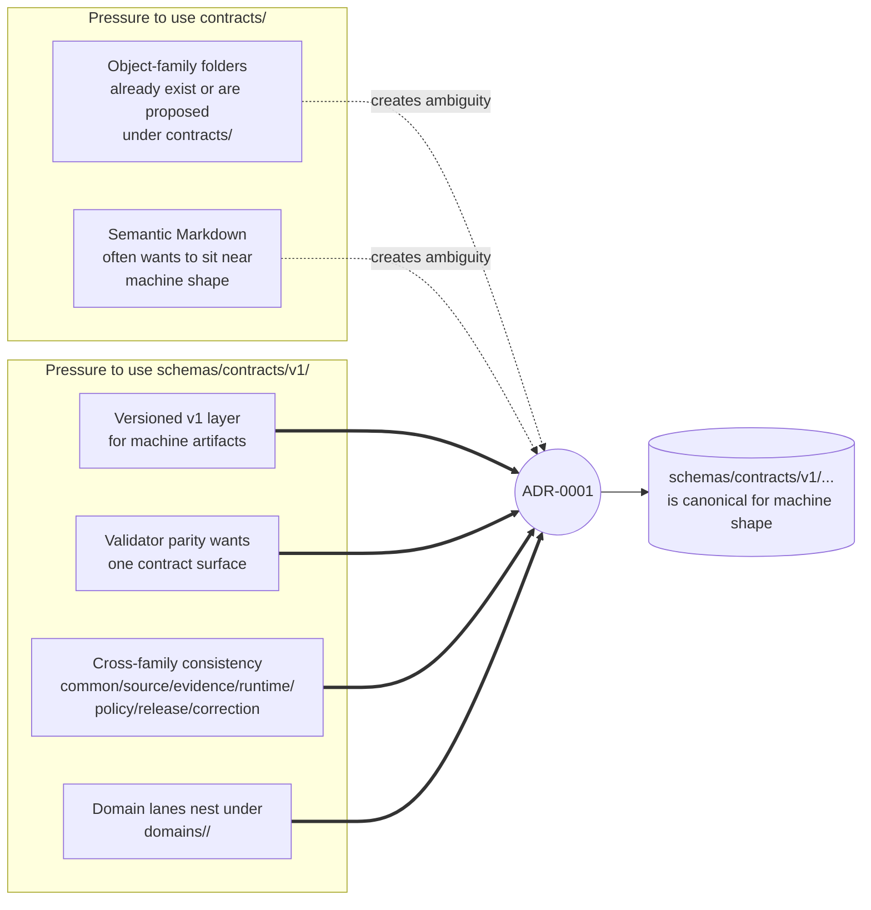
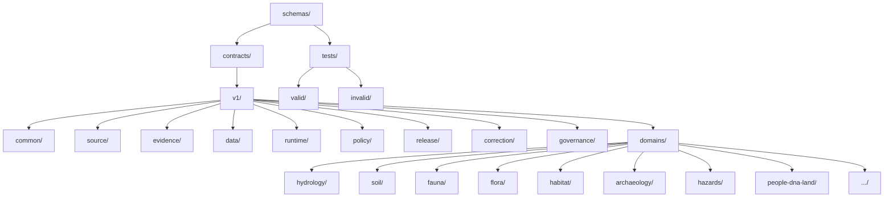
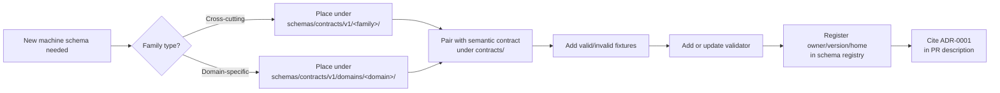

<!-- [KFM_META_BLOCK_V2]
doc_id: kfm://doc/adr-0001-schema-home
title: "ADR-0001 — Schema Home: schemas/contracts/v1/ is Canonical"
type: standard
subtype: adr
adr_id: ADR-0001
version: v1.1
status: proposed
owners: ["Docs steward", "Contract/Schema steward"]
reviewers_required: ["Docs steward", "Contract/Schema steward", "≥1 subsystem owner per affected domain"]
created: 2026-05-10
updated: 2026-05-15
policy_label: public
supersedes: []
superseded_by: null
related:
  - docs/doctrine/directory-rules.md
  - docs/architecture/contract-schema-policy-split.md
  - docs/registers/SCHEMA_REGISTRY_INDEX.md
  - docs/registers/DRIFT_REGISTER.md
  - docs/registers/VERIFICATION_BACKLOG.md
  - control_plane/object_family_register.yaml
  - control_plane/deprecation_register.yaml
  - migrations/schema/
tags: [kfm, adr, governance, schemas, contracts, schema-home, validator-parity]
notes:
  - "Formalizes the schema-home rule cited by directory-rules.md."
  - "All per-domain schema-home ADRs defer to this ADR unless explicitly amending it."
  - "Companion to a future spec-normalization ADR: canonicalization, hashing, and $id derivation."
  - "v1.1 tightens implementation boundaries, domain path wording, and verification items without changing the proposed decision."
[/KFM_META_BLOCK_V2] -->

# ADR-0001 — Schema Home: `schemas/contracts/v1/` is Canonical

> **Proposed decision in one line.** The default home for machine-checkable schemas in the Kansas Frontier Matrix repository is **`schemas/contracts/v1/<family>/...`**. Domain-specific schemas nest under **`schemas/contracts/v1/domains/<domain>/...`**. `contracts/` retains object **meaning** in Markdown; `schemas/` owns machine-checkable **shape**. Divergent schema definitions across both roots are forbidden.

      <!-- TODO(owner): replace placeholder Shields when a CI/last-updated badge endpoint is provisioned. -->

| Field | Value |
|---|---|
| **ADR ID** | `ADR-0001` |
| **Title** | Schema Home: `schemas/contracts/v1/` is Canonical |
| **Status** | `proposed` — awaiting Docs-steward + Contract/Schema-steward sign-off |
| **Date** | 2026-05-10 |
| **Updated** | 2026-05-15 |
| **Owners** | Docs steward · Contract/Schema steward |
| **Reviewers required** | Docs steward · Contract/Schema steward · ≥1 affected subsystem owner |
| **Supersedes** | none |
| **Superseded by** | none |
| **Authority basis** | CONFIRMED doctrine: `docs/doctrine/directory-rules.md` cites ADR-0001 as the schema-home rule and defines `schemas/` as machine-checkable shape. |
| **Implementation depth** | UNKNOWN until mounted-repo paths, schema registry, validators, fixtures, and CI are inspected. |
| **Authority of per-domain ADRs** | PROPOSED until reviewed; subordinate to ADR-0001 unless explicitly amending it. |

> [!NOTE]
> This ADR decides **placement authority**, not schema content. It is intentionally narrow so validators, registries, migrations, and per-domain schema work can converge without creating parallel contract homes.

---

## Table of Contents

- [1. Status and Scope](#1-status-and-scope)
- [2. Context](#2-context)
- [3. Decision](#3-decision)
- [4. Consequences](#4-consequences)
- [5. Alternatives Considered](#5-alternatives-considered)
- [6. Migration Plan](#6-migration-plan)
- [7. Rollback and Reversal](#7-rollback-and-reversal)
- [8. Validation and Enforcement](#8-validation-and-enforcement)
- [9. Open Questions and NEEDS VERIFICATION](#9-open-questions-and-needs-verification)
- [10. Related Documents](#10-related-documents)
- [Appendix A — Family Inventory](#appendix-a--family-inventory-non-exhaustive)
- [Appendix B — Migration Manifest Skeleton](#appendix-b--migration-manifest-skeleton)
- [Change Log](#change-log)
- [Related docs](#related-docs)

---

## 1. Status and Scope

> [!IMPORTANT]
> This ADR governs **where** machine-checkable schemas live in the repository. It does **not** define field-level shape, canonicalization rules, hashing algorithms, `spec_hash` derivation, `$id` derivation, or JSON canonicalization. Those belong to a separate spec-normalization ADR.

**In scope:**

- The canonical root for `*.schema.json`, `*.schema.yaml`, JSON-LD `@context` files, and equivalent machine artifacts.
- The relationship between `contracts/` as semantic meaning and `schemas/` as machine-checkable shape.
- Per-family placement: cross-cutting families under `schemas/contracts/v1/<family>/`; domain families under `schemas/contracts/v1/domains/<domain>/`.
- Migration discipline for legacy `contracts/<domain>/*.schema.json` paths.
- Mirror and compatibility-root discipline while migrations are active.

**Out of scope:**

- Canonicalization, RFC 8785 / JCS, hashing algorithm choice, `spec_hash` derivation, `$id` URI shape, and schema dialect pinning.
- Field-level schema content.
- Admissibility and policy logic; see `policy/`.
- Lifecycle phase definitions; see `docs/doctrine/lifecycle-law.md`.
- Public API route design, UI payload shape, or validator command shape.

> [!NOTE]
> Current implementation depth remains **NEEDS VERIFICATION** where repo files, schema registries, validator scripts, workflow YAML, emitted receipts, release manifests, or runtime logs have not been inspected.

[⤴ Back to top](#table-of-contents)

---

## 2. Context

### 2.1 The problem

The KFM repository carries two governance-bearing roots that touch object definitions:

- **`contracts/`** — object meaning, lifecycle semantics, invariants, compatibility notes. Files are typically Markdown.
- **`schemas/`** — machine-checkable shape: JSON Schema, JSON-LD context, and equivalent validation artifacts.

Across domain blueprints and lineage reports, both placements have appeared for machine artifacts. A recurring example is a habitat object drafted as either:

- `schemas/contracts/v1/domains/habitat/habitat_community.schema.json`
- `contracts/habitat/habitat_community.schema.json`

Those dual forms are useful lineage signals, but they are not safe as parallel authorities. If both homes evolve independently, validator parity breaks and reviewers can no longer tell which shape is authoritative.

Without a single schema home:

1. Validators must learn multiple paths and may silently disagree.
2. CI cannot enforce coverage without first choosing an authority root.
3. `contracts/` can degrade from semantic contract library into a mixed machine-schema archive.
4. Drift compounds quickly and becomes expensive to unwind.
5. Per-domain schema ADRs risk creating separate authority islands.

### 2.2 Forces at work



### 2.3 Why now

This is a P0 governance decision because the schema-home rule affects every domain lane and every trust-bearing object family. Domain reports for Habitat, Fauna, Archaeology, People/DNA/Land, Settlements/Infrastructure, Hazards, Agriculture, Atmosphere/Air, and related lanes repeatedly defer schema-home placement to ADR-0001.

> [!NOTE]
> Some in-flight blueprints draft schemas under top-level `schemas/<topic>/...` or under `contracts/<domain>/...`. Treat those as **LINEAGE / PROPOSED / CONFLICTED path** until migrated or explicitly grandfathered by an accepted ADR. This ADR closes the ambiguity for new machine schemas.

[⤴ Back to top](#table-of-contents)

---

## 3. Decision

### 3.1 The rule

> [!IMPORTANT]
> **MUST.** All new machine-checkable schemas land under **`schemas/contracts/v1/...`**.
>
> **MUST.** Cross-cutting families land under **`schemas/contracts/v1/<family>/...`**.
>
> **MUST.** Domain-specific schemas land under **`schemas/contracts/v1/domains/<domain>/...`**.
>
> **MUST.** Existing schemas found under `contracts/<domain>/*.schema.json` are **LINEAGE / CONFLICTED** until migrated or explicitly grandfathered.
>
> **MUST NOT.** Maintain divergent definitions in both `schemas/` and `contracts/`.
>
> **MUST NOT.** Create a permanent top-level `schemas/<topic>/` subtree for a contract family.
>
> **MAY.** Use `schemas/<topic>/` as a clearly labeled, time-bounded scratch surface during early drafting, with a tracked migration target in `docs/registers/DRIFT_REGISTER.md`.

### 3.2 The four-layer split

`contracts/`, `schemas/`, `policy/`, and fixtures are separate trust layers. They must cross-link cleanly, but they must not collapse into one authority.

| Layer | Owns | File types | Forbidden to own |
|---|---|---|---|
| `contracts/` | Object **meaning**, field intent, invariants, lifecycle semantics, compatibility notes. | `.md` primarily. | Executable validation as the only truth. |
| `schemas/contracts/v1/` | Machine-checkable **shape**, type constraints, versioned schema IDs, reusable fragments. | `.schema.json`, `.schema.yaml`, JSON-LD `@context`, equivalent machine artifacts. | Semantic explanation as the only meaning. |
| `policy/` | **Admissibility** — allow, deny, restrict, abstain, rights, sensitivity, release obligations. | `.rego` and equivalents. | General object semantics or machine shape. |
| `tests/fixtures/` or `fixtures/` | **Proof** that rules are enforceable through valid / invalid examples. | `.json`, `.yaml`, synthetic fixtures. | Production data, doctrine, or canonical object meaning. |

A trust-bearing object family is **ready for implementation review** only when these pieces cross-link cleanly:

- semantic contract in `contracts/`
- machine schema in `schemas/contracts/v1/`
- valid fixture
- invalid fixture
- validator output such as `ValidationReport`
- policy or evidence-closure test where applicable
- registry entry pointing to owner, version, review state, and migration status

### 3.3 Subtree shape



**CONFIRMED doctrine:** `schemas/` owns machine-checkable shape. Cross-cutting families are siblings of `domains/`; domain families nest under `domains/<domain>/`.

### 3.4 Naming and `$id` conventions

The placement rule is decided here. Naming and identity details remain deferred.

| Aspect | Default | Status |
|---|---|---|
| Filename | `<object>.schema.json` using snake_case object name. | PROPOSED |
| Spec dialect | JSON Schema 2020-12 or repo-native equivalent. | NEEDS VERIFICATION |
| Common schema metadata | `$id`, `$schema`, `title`, `version`, examples, and required-field declarations where appropriate. | PROPOSED |
| `$id` shape | Reflects canonical path under `schemas/contracts/v1/`. | NEEDS VERIFICATION |
| `spec_hash` derivation | Deferred to spec-normalization ADR. | DEFERRED |
| Canonicalization | Deferred to spec-normalization ADR. | DEFERRED |
| Versioning of `v1/` | Breaking machine-shape changes require migration plan, compatibility tests, and `v2/` or accepted exception. | PROPOSED |
| Compatibility | `v1/` remains validatable during a deprecation window; deprecation closes via register and migration proof. | PROPOSED |

> [!TIP]
> Until the spec-normalization ADR lands, treat `$id`, canonicalization, and `spec_hash` conventions as **PROPOSED / NEEDS VERIFICATION**. Do not assert that canonical JSON, stable schema hashes, or `$id` derivation are enforced unless implementation evidence proves it.

[⤴ Back to top](#table-of-contents)

---

## 4. Consequences

### 4.1 Positive

- **Single schema authority root.** Validators, CI, registries, and consumers know where machine-checkable shapes live.
- **Validator parity.** Domain validators can assume one canonical schema surface.
- **Cross-family parity.** Common, source, evidence, data, runtime, policy, release, correction, governance, and domain lanes share one versioning posture.
- **Clean responsibility split.** `contracts/` reads as a doctrine-and-meaning library; `schemas/contracts/v1/` reads as a typed machine-shape library.
- **Cheaper migrations.** Schema-home changes happen once through this ADR instead of per-domain drift cleanup.
- **Clear review burden.** Reviewers can reject new parallel schema homes without debating every domain in isolation.

### 4.2 Negative / tradeoffs

- **Migration cost.** Legacy `contracts/<domain>/*.schema.json` files must be inventoried and moved or explicitly grandfathered.
- **Temporary mirrors.** Downstream consumers depending on legacy paths may require a mirror window with a sunset date.
- **Drift risk during transition.** If mirrors exist, they must not evolve independently.
- **Doc churn.** Markdown links and examples that point at `contracts/<domain>/<x>.schema.json` need updates.
- **Spec-normalization dependency.** `$id`, hash, canonicalization, and schema dialect still need a separate ADR.

### 4.3 Affected roots and files

| Affected target | Effect | Status |
|---|---|---|
| `schemas/contracts/v1/**` | Canonical machine-schema home. | CONFIRMED doctrine; repo contents NEEDS VERIFICATION |
| `schemas/contracts/v1/domains/<domain>/**` | Canonical domain-specific machine-schema home. | CONFIRMED doctrine; per-domain names NEEDS VERIFICATION |
| `contracts/<family>/*.md` and `contracts/domains/<domain>/*.md` | Semantic meaning and invariants. | CONFIRMED doctrine |
| `contracts/<domain>/*.schema.json` | LINEAGE / CONFLICTED unless grandfathered by ADR. | CONFIRMED rule; per-file inventory NEEDS VERIFICATION |
| `schemas/<topic>/*.schema.json` | Scratch only unless accepted ADR says otherwise. | PROPOSED / NEEDS VERIFICATION |
| `jsonschema/` | Compatibility or mirror root only; never divergent authority. | CONFIRMED doctrine; repo presence NEEDS VERIFICATION |
| `tools/validators/**` | Should validate against canonical schema home. | PROPOSED |
| `docs/registers/SCHEMA_REGISTRY_INDEX.md` | Should index machine schemas, owners, versions, and migration status. | PROPOSED |
| `control_plane/object_family_register.yaml` | Should pin each object family to canonical schema home. | PROPOSED |
| `control_plane/deprecation_register.yaml` | Should record mirror sunset dates. | PROPOSED |
| `migrations/schema/ADR-0001/` | Migration manifests for legacy paths. | PROPOSED |
| Per-domain schema-home ADRs | Must defer to ADR-0001 unless explicitly amending it. | PROPOSED |

[⤴ Back to top](#table-of-contents)

---

## 5. Alternatives Considered

<details>
<summary><strong>5.1 Alternative — <code>contracts/</code> as the schema authority</strong></summary>

**Shape.** Place `*.schema.json` next to semantic Markdown under `contracts/<family>/` or `contracts/domains/<domain>/`.

**Why considered.** Some domain lineage drafts place machine schemas under `contracts/<domain>/`. Co-location can feel convenient during early drafting.

**Why rejected.**

- It collapses meaning and machine shape into one root.
- It forces validators to scan mixed prose and machine artifacts.
- It conflicts with the directory split where `contracts/` defines meaning and `schemas/` defines shape.
- It makes compatibility mirrors harder to distinguish from canonical machine shape.

**Status.** REJECTED for repo-wide authority. `contracts/` retains semantic Markdown.
</details>

<details>
<summary><strong>5.2 Alternative — flat <code>schemas/&lt;topic&gt;/</code> as permanent home</strong></summary>

**Shape.** Allow permanent homes such as `schemas/occurrence_evidence/`, `schemas/soil_moisture/`, or `schemas/hazards/`.

**Why considered.** Several in-flight blueprints use this shape during drafting.

**Why rejected.**

- It fragments the schema authority root.
- It breaks cross-family parity with runtime, policy, evidence, correction, release, and common object families.
- It creates an N+1 authority problem, one per topic.
- It weakens registry and validator expectations.

**Status.** REJECTED for permanent homes. MAY be used as time-bounded scratch with migration target and drift tracking.
</details>

<details>
<summary><strong>5.3 Alternative — dual-home, both <code>schemas/</code> and <code>contracts/</code></strong></summary>

**Shape.** Allow the same schema to exist in both `schemas/contracts/v1/<family>/` and `contracts/<family>/`, generated or hand-maintained.

**Why considered.** It eases backwards compatibility for consumers that hard-coded either path.

**Why rejected.**

- Parallel homes are a known drift pattern.
- Validators may silently disagree.
- Reviewers cannot tell which definition is authoritative.
- Mirrors can only be tolerated during migration when frozen, generated, or explicitly deprecated.

**Status.** REJECTED as a steady state. Short-lived mirrors are permitted only with sunset date, deprecation entry, and "do not edit mirror directly" enforcement.
</details>

<details>
<summary><strong>5.4 Alternative — version above family, <code>schemas/v1/contracts/&lt;family&gt;/</code></strong></summary>

**Shape.** Move `v1/` above `contracts/` instead of below it.

**Why considered.** Some API URL spaces place version before resource family.

**Why rejected.**

- Directory doctrine already uses `schemas/contracts/v1/...`.
- Changing it would require repo-wide migration without functional gain.
- It would make ADR-0001 less of a formalization and more of a root restructuring.

**Status.** REJECTED.
</details>

[⤴ Back to top](#table-of-contents)

---

## 6. Migration Plan

Schema-home migration is a structural move. It must preserve history, references, validation, rollback, and source continuity.

### 6.1 For new schemas after this ADR is accepted



### 6.2 For legacy schemas under `contracts/<domain>/*.schema.json`

1. **Identify** every legacy schema via repo scan.

   ```bash
   # PROPOSED command — adapt to repo conventions.
   find contracts -name "*.schema.json" -print
   ```

2. **Open a migration manifest** under `migrations/schema/ADR-0001/` using [Appendix B](#appendix-b--migration-manifest-skeleton).
3. **Move under Git** with `git mv` so history is preserved.
4. **Update references** in code, docs, schemas, fixtures, tests, workflows, registries, and examples.
5. **Mirror temporarily** only if downstream consumers depend on the legacy path.
6. **Mark the mirror** as generated, frozen, deprecated, or compatibility-only in its local README.
7. **Add a deprecation entry** with a sunset date.
8. **Add a drift entry** while the mirror exists.
9. **Verify rollback** with a dry-run rollback card.
10. **Remove the mirror** only after the verification window passes.

> [!CAUTION]
> A rename that changes what an object **means** is a content change, not a placement change. It requires a separate ADR or schema-version decision, compatibility map, fixture parity tests, and correction notices for released artifacts that referenced the old identity.

### 6.3 For in-flight blueprints drafting under `schemas/<topic>/`

| Draft path pattern | Target canonical home | Action |
|---|---|---|
| `schemas/occurrence_evidence/` | `schemas/contracts/v1/evidence/` or `schemas/contracts/v1/domains/fauna/` | Decide family role; consolidate before stable commit. |
| `schemas/soil_moisture/` | `schemas/contracts/v1/domains/soil/` | Consolidate before stable commit. |
| `schemas/hazards/` | `schemas/contracts/v1/domains/hazards/` | Consolidate before stable commit. |
| `schemas/transport/` | `schemas/contracts/v1/domains/roads-rail-trade/` or an accepted transport-domain name | Resolve domain naming before stable commit. |
| `schemas/governance/` | `schemas/contracts/v1/governance/` | Consolidate unless an accepted ADR creates a separate governance schema family. |

> [!NOTE]
> Whether transient scratch surfaces under `schemas/<topic>/` are acceptable until first commit, or must consolidate from day one, remains **NEEDS VERIFICATION**. The safe default is to avoid committing scratch homes to protected branches.

### 6.4 Mirror discipline

> [!WARNING]
> Two homes for the same machine authority are permitted only as a migration bridge. If both exist, the compatibility root MUST NOT evolve independently. New fields, constraints, and policy-related changes land in canonical first; mirrors regenerate, redirect, or retire.

[⤴ Back to top](#table-of-contents)

---

## 7. Rollback and Reversal

| Scenario | Reversal action |
|---|---|
| ADR rejected before migration begins | Mark this file `status: rejected`; open a drift entry for any document that cites it as active; remove or revise Directory Rules references through the required review path. |
| ADR accepted, but a specific domain migration fails | Roll back that domain migration via its rollback card; keep ADR-0001 in force; open a per-domain exception ADR if needed. |
| ADR superseded by a later schema-home ADR | Mark `status: superseded`; set `superseded_by`; retain this file unchanged for lineage. |
| More authoritative ADR already occupies this slot | Re-number this ADR, update citations, file a drift entry, and coordinate with the conflicting ADR owner. |
| Mirror diverges from canonical schema | Freeze mirror, deny further edits, regenerate from canonical or delete after deprecation window; record correction if released artifacts were affected. |
| Migration accidentally changes object meaning | Revert placement change; open content-level ADR and schema-version plan before retrying. |

> [!IMPORTANT]
> Superseded or rejected ADRs remain part of lineage. Do not delete them; link forward to the current authority.

[⤴ Back to top](#table-of-contents)

---

## 8. Validation and Enforcement

### 8.1 PR-time checks

| Check | What it asserts | Status |
|---|---|---|
| Path-policy validator | No new `contracts/<domain>/*.schema.json` lands; new schemas use `schemas/contracts/v1/...`. | PROPOSED |
| Domain nesting check | Domain schemas use `schemas/contracts/v1/domains/<domain>/...`. | PROPOSED |
| Schema/contract crosswalk test | Every schema links to a semantic contract; every contract claiming validation links to a schema. | PROPOSED |
| Drift-register check | Any non-canonical schema home has a matching drift entry and migration target. | PROPOSED |
| Mirror freeze check | Deprecated mirrors cannot be edited directly. | PROPOSED |
| `$id` consistency | `$id` reflects canonical path. | PROPOSED; depends on spec-normalization ADR |
| Registry coverage check | Schema registry includes owner, status, version, home, and validation fixtures. | PROPOSED |

### 8.2 Runtime / CI checks

```text
# Illustrative only — actual command shape depends on repo conventions.
# NEEDS VERIFICATION before use.
python tools/validators/<domain>/validate_schemas.py \
    --schema-root schemas/contracts/v1/domains/<domain> \
    --fixture-root tests/fixtures/domains/<domain>
```

> [!NOTE]
> The exact invocation, validator language, output shape, fixture home, CI job names, and package manager are **NEEDS VERIFICATION** against the mounted repo.

### 8.3 Acceptance criteria for ADR acceptance

- [ ] Docs steward signs off.
- [ ] Contract/Schema steward signs off.
- [ ] At least one affected subsystem owner signs off.
- [ ] Directory Rules reference and section number are verified.
- [ ] `docs/registers/SCHEMA_REGISTRY_INDEX.md` either exists or is added as PROPOSED with owner.
- [ ] Drift and verification backlog entries are opened for existing non-canonical schema homes.
- [ ] Migration manifest skeleton is accepted.
- [ ] No public client, runtime, validator, or UI path depends on `contracts/` as machine-schema authority.

[⤴ Back to top](#table-of-contents)

---

## 9. Open Questions and NEEDS VERIFICATION

| # | Question / item | Status | Disposition |
|---|---|---|---|
| 1 | Whether the mounted repo currently has `contracts/<domain>/*.schema.json` files that need migration. | NEEDS VERIFICATION | Run repo scan; populate migration manifest. |
| 2 | Whether any validators already assume `schemas/contracts/v1/...` or another home. | NEEDS VERIFICATION | Inspect `tools/`, `tests/`, CI workflows, and schema registry. |
| 3 | Exact `$id` URI shape and whether it embeds version or hash. | UNKNOWN | Deferred to spec-normalization ADR. |
| 4 | Whether transient drafts under `schemas/<topic>/` are allowed in protected branches. | OPEN | Resolve by amendment or per-root README. |
| 5 | JSON Schema dialect pin: 2020-12, draft-07, or repo-native equivalent. | NEEDS VERIFICATION | Pin via spec-normalization ADR. |
| 6 | Whether `schemas/contracts/v1/governance/` is distinct from runtime/policy/release/correction families. | NEEDS VERIFICATION | Align with object-family register. |
| 7 | Directory Rules section-number drift: the status block references a schema-home section while the schema-home rule appears under §6.4 in the available doctrine. | NEEDS VERIFICATION | Confirm current Markdown source; correct either the status pointer or this ADR's citations. |
| 8 | Whether `jsonschema/` exists and whether it is compatibility, mirror, deprecated, or external-export. | NEEDS VERIFICATION | Inspect repo; require README class declaration. |
| 9 | Whether per-domain schema-home ADRs already exist and conflict with this ADR. | NEEDS VERIFICATION | Inventory `docs/adr/` and `docs/domains/**`. |
| 10 | Whether fixture authority is root `fixtures/`, `tests/fixtures/`, or split by documented purpose. | NEEDS VERIFICATION | Inspect README contracts and test layout. |

> [!TIP]
> Track every `NEEDS VERIFICATION` item in `docs/registers/VERIFICATION_BACKLOG.md` and every active path conflict in `docs/registers/DRIFT_REGISTER.md`.

[⤴ Back to top](#table-of-contents)

---

## 10. Related Documents

| Document | Relationship | Status |
|---|---|---|
| `docs/doctrine/directory-rules.md` | Placement doctrine; cites ADR-0001 as schema-home rule. | CONFIRMED doctrine; section pointer NEEDS VERIFICATION |
| `docs/architecture/contract-schema-policy-split.md` | Architectural narrative for meaning / shape / policy / proof split. | PROPOSED |
| `docs/registers/SCHEMA_REGISTRY_INDEX.md` | Registry of machine schema homes, versions, owners, and validation status. | PROPOSED |
| `docs/registers/DRIFT_REGISTER.md` | Records active schema-home drift and migration windows. | PROPOSED |
| `docs/registers/VERIFICATION_BACKLOG.md` | Tracks §9 items. | PROPOSED |
| `control_plane/object_family_register.yaml` | Pins object families to semantic contracts and machine schemas. | PROPOSED |
| `control_plane/deprecation_register.yaml` | Holds mirror sunset dates and deprecation state. | PROPOSED |
| `migrations/schema/ADR-0001/` | Migration manifests for legacy schema paths. | PROPOSED |
| Future ADR-0002 — spec normalization | Pins canonicalization, hashing, `$id`, `spec_hash`, and schema dialect. | PROPOSED / not authored here |
| Per-domain schema-home ADRs | Must defer to ADR-0001 unless explicitly amending it. | PROPOSED / NEEDS VERIFICATION |

[⤴ Back to top](#table-of-contents)

---

## Appendix A — Family Inventory (non-exhaustive)

Cross-cutting families live as siblings of `domains/` inside `schemas/contracts/v1/`.

| Family | Canonical path |
|---|---|
| Common types | `schemas/contracts/v1/common/` |
| Source | `schemas/contracts/v1/source/` |
| Evidence | `schemas/contracts/v1/evidence/` |
| Data | `schemas/contracts/v1/data/` |
| Runtime | `schemas/contracts/v1/runtime/` |
| Policy | `schemas/contracts/v1/policy/` |
| Release | `schemas/contracts/v1/release/` |
| Correction | `schemas/contracts/v1/correction/` |
| Governance | `schemas/contracts/v1/governance/` |

Domain subgroups nest under `schemas/contracts/v1/domains/`.

| Domain | Canonical path | Status |
|---|---|---|
| Hydrology | `schemas/contracts/v1/domains/hydrology/` | PROPOSED until repo inspection |
| Soil | `schemas/contracts/v1/domains/soil/` | PROPOSED until repo inspection |
| Fauna | `schemas/contracts/v1/domains/fauna/` | PROPOSED until repo inspection |
| Flora | `schemas/contracts/v1/domains/flora/` | PROPOSED until repo inspection |
| Habitat | `schemas/contracts/v1/domains/habitat/` | PROPOSED until repo inspection |
| Geology | `schemas/contracts/v1/domains/geology/` | PROPOSED until repo inspection |
| Atmosphere / Air | `schemas/contracts/v1/domains/atmosphere/` | PROPOSED until repo inspection |
| Roads / Rail / Trade | `schemas/contracts/v1/domains/roads-rail-trade/` | PROPOSED until repo inspection |
| Settlements / Infrastructure | `schemas/contracts/v1/domains/settlements-infrastructure/` | PROPOSED until repo inspection |
| Archaeology | `schemas/contracts/v1/domains/archaeology/` | PROPOSED until repo inspection |
| Hazards | `schemas/contracts/v1/domains/hazards/` | PROPOSED until repo inspection |
| Agriculture | `schemas/contracts/v1/domains/agriculture/` | PROPOSED until repo inspection |
| People / DNA / Land | `schemas/contracts/v1/domains/people-dna-land/` | PROPOSED until repo inspection |

> [!NOTE]
> Exact subdirectory names, snake_case vs kebab-case, and subgroup boundaries remain **NEEDS VERIFICATION** against repo conventions and object-family registers.

[⤴ Back to top](#table-of-contents)

---

## Appendix B — Migration Manifest Skeleton

Place under `migrations/schema/ADR-0001/manifest.yaml` after path verification.

```yaml
# migrations/schema/ADR-0001/manifest.yaml
adr: ADR-0001
migration_name: schema-home-consolidation
opened: 2026-05-15
status: proposed
owner: contract-schema-steward

scope:
  canonical_schema_home: schemas/contracts/v1
  semantic_contract_home: contracts
  rule: "Do not maintain divergent machine-schema definitions in schemas/ and contracts/."

moves:
  - from: contracts/<domain>/<object>.schema.json
    to: schemas/contracts/v1/domains/<domain>/<object>.schema.json
    git_sha_before: <fill at migration time>
    git_sha_after: <fill at migration time>
    mirror_until: <YYYY-MM-DD or null>
    rollback_card: release/rollback_cards/ADR-0001-<object>.yaml
    references_to_update:
      - docs/...
      - tests/fixtures/...
      - tools/validators/...
      - control_plane/object_family_register.yaml

checks:
  - path_policy_validator
  - schema_fixture_valid
  - schema_fixture_invalid
  - crosswalk_updated
  - deprecation_entry_if_mirror_exists
  - drift_entry_if_mirror_exists
  - rollback_card_dry_run

notes:
  - Mirror MUST NOT evolve independently.
  - Add deprecation entry before opening any mirror.
  - Remove mirror only after verification window closes.
```

[⤴ Back to top](#table-of-contents)

---

## Change Log

| Version | Date | Change | Author |
|---|---|---|---|
| v1.1 / draft | 2026-05-15 | Tightened proposed/confirmed labels; clarified cross-cutting vs domain schema paths; added section-number drift item; corrected validator example path; added acceptance criteria; preserved ADR decision. | Docs steward (PROPOSED) |
| v1 / draft | 2026-05-10 | Initial draft formalizing the schema-home rule already referenced in Directory Rules. | Docs steward (PROPOSED) |

---

### Related docs

- [docs/doctrine/directory-rules.md](../doctrine/directory-rules.md) — placement doctrine and schema-home rule.
- [docs/architecture/contract-schema-policy-split.md](../architecture/contract-schema-policy-split.md) — PROPOSED four-layer split narrative.
- [docs/registers/SCHEMA_REGISTRY_INDEX.md](../registers/SCHEMA_REGISTRY_INDEX.md) — PROPOSED schema registry.
- [docs/registers/DRIFT_REGISTER.md](../registers/DRIFT_REGISTER.md) — PROPOSED drift tracking.
- [docs/registers/VERIFICATION_BACKLOG.md](../registers/VERIFICATION_BACKLOG.md) — PROPOSED verification tracking.
- [control_plane/object_family_register.yaml](../../control_plane/object_family_register.yaml) — PROPOSED object-family index.

**Last updated:** 2026-05-15
&nbsp;&nbsp;·&nbsp;&nbsp; **Status:** `proposed`
&nbsp;&nbsp;·&nbsp;&nbsp; [⤴ Back to top](#adr-0001--schema-home-schemascontractsv1-is-canonical)