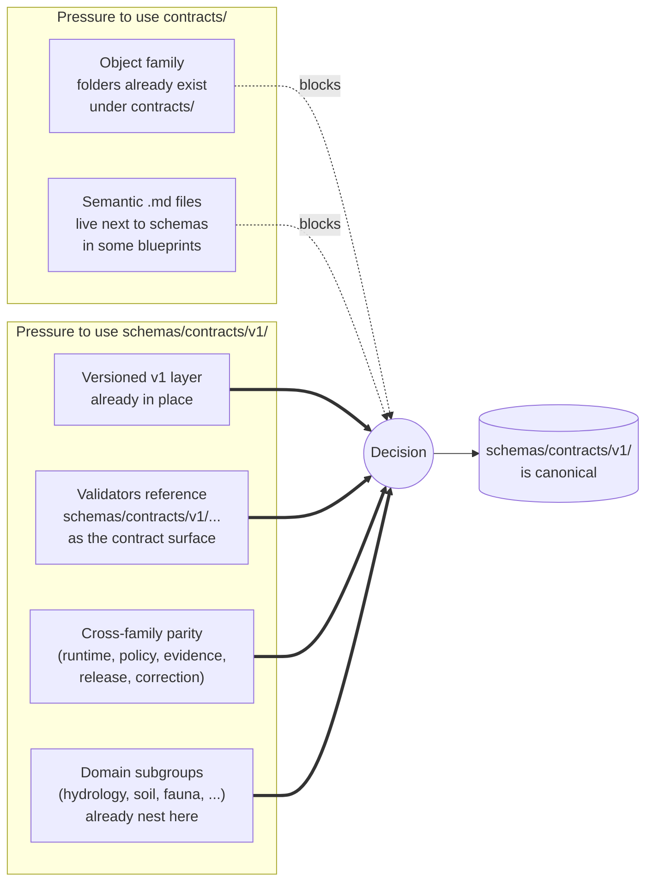
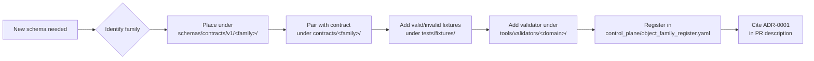

<!-- [KFM_META_BLOCK_V2]
doc_id: kfm://doc/adr-0001-schema-home
title: "ADR-0001 — Schema Home: schemas/contracts/v1/ is Canonical"
type: standard
subtype: adr
adr_id: ADR-0001
version: v1
status: proposed
owners: ["Docs steward", "Contract/Schema steward"]
reviewers_required: ["Docs steward", "Contract/Schema steward", "≥1 subsystem owner per affected domain"]
created: 2026-05-10
updated: 2026-05-10
policy_label: public
supersedes: []
superseded_by: null
related:
  - docs/doctrine/directory-rules.md
  - docs/architecture/contract-schema-policy-split.md
  - docs/registers/SCHEMA_REGISTRY_INDEX.md
  - docs/registers/DRIFT_REGISTER.md
  - docs/registers/VERIFICATION_BACKLOG.md
  - control_plane/object_family_register.yaml
  - control_plane/deprecation_register.yaml
  - migrations/schema/
tags: [kfm, adr, governance, schemas, contracts, schema-home, validator-parity]
notes:
  - "Formalizes the rule already cited by directory-rules.md §0 and §6.4."
  - "All per-domain schema-home ADRs defer to this ADR unless explicitly amending it."
  - "Companion to a future spec-normalization ADR (canonicalization, hashing, $id derivation)."
[/KFM_META_BLOCK_V2] -->

# ADR-0001 — Schema Home: `schemas/contracts/v1/` is Canonical

> **Decision in one line.** The default home for machine-checkable schemas in the Kansas Frontier Matrix repository is **`schemas/contracts/v1/<family>/...`**. `contracts/` retains object **meaning** in Markdown; `schemas/` owns **shape**. Divergent schema definitions across both roots are forbidden.

     <!-- TODO: replace placeholder Shields when a CI/last-updated badge endpoint is provisioned -->

| Field | Value |
|---|---|
| **ADR ID** | `ADR-0001` |
| **Title** | Schema Home: `schemas/contracts/v1/` is Canonical |
| **Status** | `proposed` — awaiting Docs-steward + Contract/Schema-steward sign-off |
| **Date** | 2026-05-10 |
| **Owners** | Docs steward · Contract/Schema steward |
| **Reviewers required** | Docs steward · Contract/Schema steward · ≥1 affected subsystem owner |
| **Supersedes** | none |
| **Superseded by** | none |
| **Authority of this decision** | CONFIRMED by `docs/doctrine/directory-rules.md` §0 and §6.4 (which already cite this ADR as the schema-home rule). |
| **Authority of any per-domain ADR** | PROPOSED until reviewed; subordinate to this ADR unless explicitly amending. |

---

## Table of Contents

- [1. Status and Scope](#1-status-and-scope)
- [2. Context](#2-context)
- [3. Decision](#3-decision)
- [4. Consequences](#4-consequences)
- [5. Alternatives Considered](#5-alternatives-considered)
- [6. Migration Plan](#6-migration-plan)
- [7. Rollback and Reversal](#7-rollback-and-reversal)
- [8. Validation and Enforcement](#8-validation-and-enforcement)
- [9. Open Questions and NEEDS VERIFICATION](#9-open-questions-and-needs-verification)
- [10. Related Documents](#10-related-documents)
- [Appendix A — Family Inventory](#appendix-a--family-inventory-non-exhaustive)
- [Appendix B — Migration Manifest Skeleton](#appendix-b--migration-manifest-skeleton)

---

## 1. Status and Scope

> [!IMPORTANT]
> This ADR governs **where** machine-checkable schemas live in the repository. It does **not** define field-level shape, canonicalization rules, hashing algorithms, or `$id` derivation — those belong to a separate spec-normalization ADR (see §9 and [Related Documents](#10-related-documents)).

**In scope:**

- The canonical root for `*.schema.json`, `*.schema.yaml`, JSON-LD `@context` files, and equivalent machine artifacts.
- The relationship between `contracts/` (meaning) and `schemas/` (shape).
- Per-domain placement (`<family>/` and `domains/<domain>/`).
- Migration discipline for legacy `contracts/<domain>/*.schema.json` paths.

**Out of scope:**

- Canonicalization (RFC 8785 / JCS), hashing (SHA-256 vs BLAKE3), `spec_hash` derivation, and `$id` URI shape — deferred to the spec-normalization ADR.
- Admissibility and policy logic (see `policy/`).
- Lifecycle phases (see `docs/doctrine/lifecycle-law.md`).

---

## 2. Context

### 2.1 The problem

The KFM repository carries two governance-bearing roots that touch object definitions:

- **`contracts/`** — object meaning, lifecycle semantics, invariants, compatibility notes. Files are typically Markdown.
- **`schemas/`** — machine-checkable shape (JSON Schema, JSON-LD context, etc.).

Across domain blueprints in the project corpus, both placements appeared for the same machine artifact — for example, `schemas/contracts/v1/habitat/habitat_community.schema.json` **OR** `contracts/habitat/habitat_community.schema.json` for the same object, with the truth label `PROPOSED / CONFLICTED path` and the explicit note *"Dependencies: ADR-0001 resolves schema home. … Do not maintain divergent definitions in both homes."*

Without a single canonical home:

1. Validators have to be taught two paths and may silently disagree.
2. CI cannot enforce coverage without first picking a home.
3. The `contracts/` directory becomes an archeological record of design changes rather than a source of truth.
4. Schema drift compounds quickly and is expensive to undo.

### 2.2 Forces at work



### 2.3 Why now

This is a P0 backlog item: the KFM Build Companion lists `docs/adr/ADR-0001-schema-home.md` as the first ADR to land, and `directory-rules.md` already cites *"ADR-0001"* as the rule that the rest of the doctrine depends on. Per-domain blueprints (Habitat, Fauna, Archaeology, People/DNA/Land, Settlements/Infrastructure, Hazards, Agriculture, Atmosphere/Air, and others) explicitly defer to this ADR before landing their schemas.

> [!NOTE]
> A small number of in-flight blueprints draft schemas under `schemas/<domain>/...` (e.g., `schemas/occurrence_evidence/`, `schemas/soil_moisture/`, `schemas/hazards/`). The KFM corpus flags these as *PROPOSED scratch surfaces* that must consolidate into `schemas/contracts/v1/<family>/` once stable. This ADR closes that ambiguity.

[⤴ Back to top](#table-of-contents)

---

## 3. Decision

### 3.1 The rule (MUST / MUST NOT)

> [!IMPORTANT]
> **MUST.** All new machine-checkable schemas land under **`schemas/contracts/v1/<family>/...`**.
>
> **MUST.** Existing schemas found under `contracts/<domain>/*.schema.json` are **lineage / CONFLICTED** and MUST be migrated under this ADR before any new schema lands in the same family.
>
> **MUST NOT.** Maintain divergent definitions in both `schemas/` and `contracts/`.
>
> **MUST NOT.** Create a new top-level `schemas/<topic>/` subtree as a permanent home for any contract family. Permanent homes are `schemas/contracts/v1/<family>/` only.
>
> **MAY.** Use `schemas/<topic>/` as a clearly labeled, time-bounded scratch surface during early drafting, with a tracked migration target in `docs/registers/DRIFT_REGISTER.md`.

### 3.2 The four-layer split

`contracts/` and `schemas/` are **two layers of the same governance function** and MUST NOT collapse into each other. The clean split per `directory-rules.md` §6.4:

| Layer | Owns | File types | Forbidden to own |
|---|---|---|---|
| `contracts/` | Object **meaning**, field intent, invariants, lifecycle semantics, compatibility notes. | `.md` (primarily). | Executable validation as the only truth. |
| `schemas/contracts/v1/` | Machine-checkable **shape**, type constraints, versioned schema IDs, reusable fragments. | `.schema.json`, `.schema.yaml`, JSON-LD `@context`, equivalent machine artifacts. | Semantic explanation as the only meaning. |
| `policy/` | **Admissibility** — allow / deny / restrict / abstain, rights, sensitivity, release obligations. | `.rego` and equivalents. | General object semantics. |
| `tests/fixtures/` | **Proof** the rules are enforceable — small valid / invalid examples. | `.json`, `.yaml`. | Production data or doctrine. |

A trust-bearing object is **ready** only when all of the following exist and cross-link cleanly: semantic contract (`contracts/`), machine schema (`schemas/contracts/v1/`), valid fixture, invalid fixture, validator output (`ValidationReport`), and at least one policy or evidence-closure test where applicable.

### 3.3 Subtree shape


CONFIRMED layout from `docs/doctrine/directory-rules.md` §6.4. Domain subgroups MUST nest under `domains/`; cross-cutting families (`common`, `source`, `evidence`, `data`, `runtime`, `policy`, `release`, `correction`, `governance`) are siblings of `domains/` inside `v1/`.

### 3.4 Naming and `$id` conventions

The following are PROPOSED here and will be **pinned** by the spec-normalization ADR:

| Aspect | Default | Status |
|---|---|---|
| Filename | `<object>.schema.json` (snake_case object name) | PROPOSED |
| Spec dialect | JSON Schema 2020-12 or repo-native equivalent | PROPOSED |
| Required fields in every schema | `$id`, `$schema`, `title`, `version`, `required`, examples | PROPOSED |
| `$id` shape | reflects canonical path under `schemas/contracts/v1/` | NEEDS VERIFICATION |
| Versioning of `v1/` | Schema version bumps follow the spec-normalization ADR conventions; breaking changes create `v2/` and a `RollbackRef` | PROPOSED |
| Compatibility | `v1/` is preserved when `v2/` is created; both are validatable until deprecation closes per `control_plane/deprecation_register.yaml` | PROPOSED |

> [!TIP]
> Until the spec-normalization ADR lands, treat the `$id` and canonicalization conventions as PROPOSED. Do not assert "the repo enforces canonical JSON" without ADR-level coverage.

[⤴ Back to top](#table-of-contents)

---

## 4. Consequences

### 4.1 Positive

- **Single schema authority root.** Validators, CI, and consumers know exactly where to look.
- **Validator parity.** A shared validator architecture (e.g., per-domain `tools/validators/<domain>/validate_schemas.py`) can assume `schemas/contracts/v1/<family>/` as its required contract surface without per-domain forks.
- **Cross-family parity.** `common`, `source`, `evidence`, `data`, `runtime`, `policy`, `release`, `correction`, and `governance` share one root and one versioning posture.
- **Clean responsibility split.** `contracts/` reads as a doctrine-and-meaning library; `schemas/contracts/v1/` reads as a typed shape library; neither is forced to do the other's job.
- **Cheaper migrations.** Schema home changes happen once, here; downstream renames are confined to one subtree.

### 4.2 Negative / tradeoffs

- **Migration cost.** Legacy `contracts/<domain>/*.schema.json` files must be moved (see §6).
- **Temporary mirrors.** Downstream consumers depending on legacy paths require a mirror window with a sunset date — additional bookkeeping in `control_plane/deprecation_register.yaml`.
- **Drift risk during transition.** Until mirrors are removed, the rule "do not edit the mirror directly" must be enforced socially and via CI.
- **Doc churn.** Existing Markdown that references `contracts/<domain>/<x>.schema.json` requires link updates.

### 4.3 Affected roots and files

| Affected target | Effect | Status |
|---|---|---|
| `schemas/contracts/v1/**` | Confirmed as canonical home. | CONFIRMED by directory-rules.md §6.4 |
| `contracts/<domain>/*.schema.json` | Lineage / CONFLICTED; migration required. | CONFIRMED rule; per-file inventory PROPOSED |
| `schemas/<topic>/*.schema.json` (flat top-level) | Scratch only; not a permanent home. | CONFIRMED rule |
| `jsonschema/` (compatibility root) | Mirror or deprecated; never divergent. | CONFIRMED per directory-rules.md §8.1 |
| `tools/validators/**/validate_schemas.py` | MAY assume `schemas/contracts/v1/<family>/` as the required contract surface. | PROPOSED |
| `scripts/validate_schemas.py` (referenced in corpus) | Treated as already aligned with `schemas/contracts/v1/`. | NEEDS VERIFICATION against mounted repo |
| `control_plane/object_family_register.yaml` | Each object family pins its schema home to `schemas/contracts/v1/<family>/`. | PROPOSED |
| `docs/registers/SCHEMA_REGISTRY_INDEX.md` | The machine schema registry index. | PROPOSED |
| Per-domain schema-home ADRs (e.g., `ADR-archaeology-schema-home.md`) | Defer to ADR-0001 unless explicitly amending. | PROPOSED |

[⤴ Back to top](#table-of-contents)

---

## 5. Alternatives Considered

<details>
<summary><strong>5.1 Alternative — <code>contracts/</code> as the schema authority</strong></summary>

**Shape.** Place `*.schema.json` next to `*.md` semantic notes under `contracts/<family>/`. Drop the `schemas/` root or demote it to compatibility.

**Why considered.** Some domain blueprints draft schemas under `contracts/<domain>/`. It keeps "meaning" and "shape" co-located.

**Why rejected.**
- Forces validators to assume mixed file types per directory.
- Loses the clean *meaning vs. shape* layering.
- Conflicts with corpus evidence that `scripts/validate_schemas.py` (referenced in the project corpus; NEEDS VERIFICATION against mounted repo) already treats `schemas/contracts/v1/...` as the required contract surface.
- The `contracts/` tree is best as a Markdown-only doctrine library; mixing in JSON Schema dilutes its purpose.

**Status.** REJECTED for repo-wide authority. `contracts/` retains semantic Markdown.
</details>

<details>
<summary><strong>5.2 Alternative — flat <code>schemas/&lt;topic&gt;/</code> as permanent home</strong></summary>

**Shape.** Allow `schemas/occurrence_evidence/`, `schemas/soil_moisture/`, `schemas/hazards/`, etc., as permanent top-level homes alongside `schemas/contracts/v1/`.

**Why considered.** Several in-flight blueprints already use this shape during drafting.

**Why rejected.**
- Fragments the schema authority root.
- Breaks cross-family parity with `runtime`, `policy`, `evidence`, `correction`, and `common`, which all live under `schemas/contracts/v1/`.
- Creates an N+1 authority problem (one per topic) that compounds with every new domain.
- Schema-home drift is identified by the corpus as one of the small set of decisions that, if drift sets in, can quietly fracture validator parity, break CI, and turn the contracts directory into an archeological record.

**Status.** REJECTED for permanent homes; MAY be used as time-bounded scratch with a tracked migration target.
</details>

<details>
<summary><strong>5.3 Alternative — dual-home (both <code>schemas/</code> and <code>contracts/</code>)</strong></summary>

**Shape.** Allow the same schema in both `schemas/contracts/v1/<family>/` and `contracts/<family>/`, generated or hand-maintained.

**Why considered.** Eases backwards-compatibility for consumers that hard-coded either path.

**Why rejected.**
- `directory-rules.md` §6.4 explicitly forbids it: *"MUST NOT maintain divergent definitions in both `schemas/` and `contracts/`."*
- Identified in the anti-patterns table (§13.5) as **Schema mirror divergence** — one of the named drift symptoms.
- Validators have to be taught two paths and may silently disagree.

**Status.** REJECTED. A short-lived **mirror** is permitted during migration only; the mirror MUST NOT evolve independently, and a sunset date is required in `control_plane/deprecation_register.yaml`.
</details>

<details>
<summary><strong>5.4 Alternative — version above family (<code>schemas/v1/contracts/&lt;family&gt;/</code>)</strong></summary>

**Shape.** Move `v1/` above `contracts/` rather than below it.

**Why considered.** Symmetric with how some APIs version their URL space.

**Why rejected.**
- `directory-rules.md` §6.4 already specifies the inverse shape (`schemas/contracts/v1/...`).
- Breaking the existing convention would force a repo-wide migration with no functional gain.

**Status.** REJECTED.
</details>

[⤴ Back to top](#table-of-contents)

---

## 6. Migration Plan

Per `directory-rules.md` §14.2 (structural moves), schema-home migration MUST follow the discipline below.

### 6.1 For new schemas (after this ADR is accepted)



### 6.2 For legacy schemas under `contracts/<domain>/*.schema.json`

1. **Identify** every legacy schema via repo scan (PROPOSED command: `find contracts -name "*.schema.json"`).
2. **Open a migration manifest** under `migrations/schema/ADR-0001/` per `directory-rules.md` §14.2 with the skeleton in [Appendix B](#appendix-b--migration-manifest-skeleton).
3. **Move under `git mv`** so history is preserved.
4. **Update references** in code, docs, schemas, fixtures, tests, workflows.
5. **Mirror temporarily** at the legacy path if downstream consumers depend on it. The mirror MUST be marked `mirror` in its containing README per §8 of Directory Rules.
6. **Add a deprecation entry** in `control_plane/deprecation_register.yaml` with a sunset date.
7. **Verify rollback** with a dry-run rollback card.
8. **Add a drift entry** in `docs/registers/DRIFT_REGISTER.md` for the duration of the migration.
9. **Close the migration** by removing the mirror only after the verification window passes.

> [!CAUTION]
> A rename that changes what an object **means** is a content change, not a placement change. It requires its own ADR, a schema version bump per the spec-normalization ADR, a compatibility map for old fixtures, old-fixture parity tests, and correction notices for any released artifacts that referenced the old identity (`directory-rules.md` §14.3).

### 6.3 For in-flight blueprints drafting under `schemas/<topic>/`

| Blueprint draft path (examples, PROPOSED) | Target canonical home | Action |
|---|---|---|
| `schemas/occurrence_evidence/` | `schemas/contracts/v1/evidence/` or `schemas/contracts/v1/domains/fauna/` | Consolidate before first stable commit. |
| `schemas/soil_moisture/` | `schemas/contracts/v1/domains/soil/` | Consolidate before first stable commit. |
| `schemas/hazards/` | `schemas/contracts/v1/domains/hazards/` | Consolidate before first stable commit. |

> [!NOTE]
> Whether transient scratch surfaces under `schemas/<topic>/` are acceptable until first commit, or whether they must consolidate from day one, is **NEEDS VERIFICATION** (see §9). The corpus is conservative; this ADR defers to a per-domain ADR or to a follow-up amendment.

### 6.4 Mirror discipline (CRITICAL)

> [!WARNING]
> Two homes for the same authority is the most common drift in KFM. If both exist during migration, the **compatibility root MUST NOT evolve independently**. New rules, fields, and policy updates land in canonical first; mirrors regenerate or migrate. See `directory-rules.md` §8.3 and §13.5 (*Schema mirror divergence*).

[⤴ Back to top](#table-of-contents)

---

## 7. Rollback and Reversal

| Scenario | Reversal action |
|---|---|
| ADR rejected before any migration begins | Mark this file `status: rejected`; remove citations of "ADR-0001" from `directory-rules.md` §0 and §6.4; open a replacement ADR. |
| ADR accepted, but a specific domain migration fails | Roll back the per-domain migration via its dry-run rollback card; keep ADR-0001 in force; open a per-domain ADR documenting the exception. |
| ADR superseded by a later ADR (e.g., `v2/` migration, root rename) | Mark `status: superseded`; add `superseded_by` link; retain this file unchanged for lineage per `directory-rules.md` §2.4. |
| Discovery that a more authoritative ADR already occupied this slot | Re-number this ADR (e.g., ADR-00NN) and update all citations; file a drift entry; coordinate with the conflicting ADR's owner. |

> [!IMPORTANT]
> Superseded ADRs MUST be retained with `status: superseded` and a forward link to the replacing ADR (`directory-rules.md` §2.4).

[⤴ Back to top](#table-of-contents)

---

## 8. Validation and Enforcement

### 8.1 PR-time checks (PROPOSED)

| Check | What it asserts | Status |
|---|---|---|
| Path-policy validator | No new `contracts/<domain>/*.schema.json` lands; every new `*.schema.json` is under `schemas/contracts/v1/<family>/`. | PROPOSED |
| Schema/contract crosswalk test | Every schema has a contract link; every contract that claims machine validation points to a schema. | PROPOSED (per Build Companion §5.3) |
| `tools/validators/<domain>/validate_schemas.py` | Validates all schemas under `schemas/contracts/v1/<domain>/` against fixtures and emits a `ValidationReport`. | PROPOSED |
| Drift-register check | If a schema lives in a non-canonical home, a matching entry exists in `docs/registers/DRIFT_REGISTER.md` with a target. | PROPOSED |
| `$id` consistency | `$id` reflects the canonical path. | PROPOSED; depends on spec-normalization ADR. |

### 8.2 Runtime / CI checks (PROPOSED)

```text
# Illustrative — actual command shape depends on repo conventions; NEEDS VERIFICATION
python tools/validators/<domain>/validate_schemas.py \
    --schema-root schemas/contracts/v1/<domain> \
    --fixture-root tests/fixtures/<domain>
```

> [!NOTE]
> The exact invocation, output shape, and CI workflow names are **NEEDS VERIFICATION** against the mounted repo. Several domain blueprints (Atmosphere/Air, Habitat, Fauna, Settlements/Infrastructure) reference `tools/validators/<domain>/validate_schemas.py` or `pytest tests/<domain>/test_*schema*.py` patterns; the canonical shape is not yet pinned in directory-rules.md.

[⤴ Back to top](#table-of-contents)

---

## 9. Open Questions and NEEDS VERIFICATION

| # | Question / item | Status | Disposition |
|---|---|---|---|
| 1 | Whether the mounted repo currently has `contracts/<domain>/*.schema.json` files that need migration. | NEEDS VERIFICATION | Run a repo scan; populate [Appendix B](#appendix-b--migration-manifest-skeleton). |
| 2 | Whether `scripts/validate_schemas.py` (cited in the corpus) actually exists and treats `schemas/contracts/v1/...` as the required surface. | NEEDS VERIFICATION | Inspect mounted repo when available. |
| 3 | The exact `$id` URI shape (versioning embedded? hash-pinned?). | UNKNOWN | Deferred to spec-normalization ADR. |
| 4 | Whether transient drafts under `schemas/<topic>/` are acceptable until first commit, or whether they must consolidate from day one. | OPEN | Resolve via a §14.1 routine PR amendment to this ADR, or via per-domain ADR. |
| 5 | JSON Schema dialect pin (2020-12 vs draft-07 vs repo-native). | NEEDS VERIFICATION | Multiple corpus references say *"JSON Schema 2020-12 or repo-native equivalent"*. Pin via spec-normalization ADR. |
| 6 | Whether `schemas/contracts/v1/governance/` is a sibling of `domains/` or a re-mapping of `runtime`/`policy`/`release`/`correction`. | NEEDS VERIFICATION | Corpus uses both phrasings; align with directory-rules.md §6.4 (sibling). |
| 7 | A corpus tension: Pass 12 *also* proposes "ADR-0001 spec normalization" for this slot. | SURFACED, not smoothed | This ADR takes the schema-home slot per `directory-rules.md` (which is authoritative). Spec normalization becomes a separate, later ADR. See [Section 2 of the Notes](#) if revising. |

> [!TIP]
> Track every NEEDS VERIFICATION item in `docs/registers/VERIFICATION_BACKLOG.md` and every detected drift in `docs/registers/DRIFT_REGISTER.md`.

[⤴ Back to top](#table-of-contents)

---

## 10. Related Documents

| Document | Relationship |
|---|---|
| `docs/doctrine/directory-rules.md` (§0, §6.3–6.4, §8.1, §13.5, §14.2, §17, §18) | Cites this ADR as the schema-home rule; this ADR formalizes that citation. |
| `docs/architecture/contract-schema-policy-split.md` | Architectural narrative for the four-layer split. PROPOSED. |
| `docs/registers/SCHEMA_REGISTRY_INDEX.md` | Machine schema registry; entries pin home to `schemas/contracts/v1/<family>/`. PROPOSED. |
| `docs/registers/DRIFT_REGISTER.md` | Records active schema-home drift entries. PROPOSED. |
| `docs/registers/VERIFICATION_BACKLOG.md` | Tracks NEEDS VERIFICATION items in §9. PROPOSED. |
| `control_plane/object_family_register.yaml` | Each family pins schema home. PROPOSED. |
| `control_plane/deprecation_register.yaml` | Sunset dates for migration mirrors. PROPOSED. |
| `migrations/schema/ADR-0001/` | Migration manifests for legacy paths. PROPOSED. |
| Future **ADR-0002** (spec normalization) | Pins canonicalization (RFC 8785 / JCS), hashing (SHA-256 / BLAKE3), `$id` derivation. Cited but not authored here. |
| Per-domain schema-home ADRs (e.g., `ADR-archaeology-schema-home.md`, `ADR-fauna-schema-home.md`, `ADR-people-dna-land-schema-placement.md`) | Defer to ADR-0001 unless explicitly amending. |

[⤴ Back to top](#table-of-contents)

---

## Appendix A — Family Inventory (non-exhaustive)

Cross-cutting families that MUST live as siblings of `domains/` inside `schemas/contracts/v1/`:

| Family | Path |
|---|---|
| Common types | `schemas/contracts/v1/common/` |
| Source | `schemas/contracts/v1/source/` |
| Evidence | `schemas/contracts/v1/evidence/` |
| Data | `schemas/contracts/v1/data/` |
| Runtime | `schemas/contracts/v1/runtime/` |
| Policy | `schemas/contracts/v1/policy/` |
| Release | `schemas/contracts/v1/release/` |
| Correction | `schemas/contracts/v1/correction/` |
| Governance | `schemas/contracts/v1/governance/` |

Domain subgroups (representative; PROPOSED until per-domain ADRs land):

| Domain | Path |
|---|---|
| Hydrology | `schemas/contracts/v1/domains/hydrology/` |
| Soil | `schemas/contracts/v1/domains/soil/` |
| Fauna | `schemas/contracts/v1/domains/fauna/` |
| Flora | `schemas/contracts/v1/domains/flora/` |
| Habitat | `schemas/contracts/v1/domains/habitat/` |
| Geology | `schemas/contracts/v1/domains/geology/` |
| Atmosphere / Air | `schemas/contracts/v1/domains/atmosphere/` |
| Roads / Rail / Trade | `schemas/contracts/v1/domains/roads-rail-trade/` |
| Settlements / Infrastructure | `schemas/contracts/v1/domains/settlements-infrastructure/` |
| Archaeology | `schemas/contracts/v1/domains/archaeology/` |
| Hazards | `schemas/contracts/v1/domains/hazards/` |
| Agriculture | `schemas/contracts/v1/domains/agriculture/` |
| People / DNA / Land | `schemas/contracts/v1/domains/people-dna-land/` |

> [!NOTE]
> Exact subdirectory names (snake_case vs kebab-case) and exact subgroup placements (e.g., `governance/` vs `domains/people-dna-land/governance/`) are **NEEDS VERIFICATION** against the mounted repo. The shape above is CONFIRMED by `directory-rules.md` §6.4 at the family-and-domain level.

[⤴ Back to top](#table-of-contents)

---

## Appendix B — Migration Manifest Skeleton

Place under `migrations/schema/ADR-0001/manifest.yaml` (PROPOSED path).

```yaml
# migrations/schema/ADR-0001/manifest.yaml
adr: ADR-0001
migration_name: schema-home-consolidation
opened: 2026-05-10
status: proposed
owner: contract-schema-steward
moves:
  - from: contracts/<domain>/<object>.schema.json
    to:   schemas/contracts/v1/<family>/<object>.schema.json
    git_sha_before: <fill at migration time>
    git_sha_after:  <fill at migration time>
    mirror_until:   <YYYY-MM-DD>
    rollback_card:  release/rollback_cards/ADR-0001-<object>.yaml
    references_to_update:
      - docs/...           # docs that link the schema
      - tests/fixtures/... # fixture paths
      - tools/validators/... # validator command-line refs
      - control_plane/object_family_register.yaml
notes:
  - Mirror MUST NOT evolve independently (directory-rules.md §8.3, §13.5).
  - Add deprecation entry in control_plane/deprecation_register.yaml before opening mirror.
```

[⤴ Back to top](#table-of-contents)

---

## Change Log

| Version | Date | Change | Author |
|---|---|---|---|
| v1 / draft | 2026-05-10 | Initial draft formalizing the schema-home rule already referenced in `directory-rules.md`. | Docs steward (PROPOSED) |

---

### Related docs

- [docs/doctrine/directory-rules.md](../doctrine/directory-rules.md) — citing authority
- [docs/architecture/contract-schema-policy-split.md](../architecture/contract-schema-policy-split.md) — PROPOSED narrative
- [docs/registers/SCHEMA_REGISTRY_INDEX.md](../registers/SCHEMA_REGISTRY_INDEX.md) — PROPOSED
- [docs/registers/DRIFT_REGISTER.md](../registers/DRIFT_REGISTER.md) — PROPOSED
- [docs/registers/VERIFICATION_BACKLOG.md](../registers/VERIFICATION_BACKLOG.md) — PROPOSED
- [control_plane/object_family_register.yaml](../../control_plane/object_family_register.yaml) — PROPOSED

**Last updated:** 2026-05-10
&nbsp;&nbsp;·&nbsp;&nbsp; **Status:** `proposed`
&nbsp;&nbsp;·&nbsp;&nbsp; [⤴ Back to top](#adr-0001--schema-home-schemascontractsv1-is-canonical)
