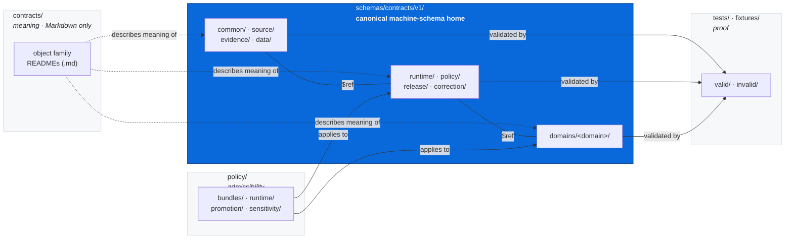
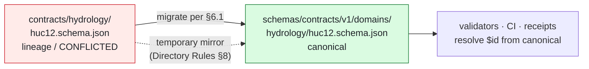

<!-- [KFM_META_BLOCK_V2]
doc_id: kfm://adr/0001-schema-home
title: ADR-0001 — Schema Home: `schemas/contracts/v1/` is Canonical
type: adr
adr_id: ADR-0001
adr_status: accepted
version: v1
status: published
owners: Architecture Steward · Schema Steward · Docs Steward
created: 2026-04-21
updated: 2026-05-09
policy_label: public
related:
  - docs/doctrine/directory-rules.md
  - docs/architecture/contract-schema-policy-split.md
  - docs/registers/DRIFT_REGISTER.md
  - docs/registers/VERIFICATION_BACKLOG.md
  - docs/registers/CANONICAL_LINEAGE_EXPLORATORY.md
  - control_plane/object_family_register.yaml
  - control_plane/deprecation_register.yaml
tags: [kfm, adr, governance, schemas, contracts, directory-rules]
notes:
  - Live-repo enforcement state is NEEDS VERIFICATION per Directory Rules §18.
  - Domain schema-home ADRs (archaeology, fauna, flora, habitat, geology, atmosphere, hydrology, settlements, infrastructure, hazards, agriculture, people-dna-land) descend from this decision.
[/KFM_META_BLOCK_V2] -->

# ADR-0001 — Schema Home: `schemas/contracts/v1/` is Canonical

> The default home for **machine-checkable schemas** in KFM is `schemas/contracts/v1/<family>/...`. `contracts/` retains **semantic Markdown** only. Two homes for the same authority is the single most expensive drift in the repository, and this ADR closes that question.

<p>
  
  
  
  
  
  
</p>

| Field | Value |
|---|---|
| **ADR ID** | ADR-0001 |
| **Title** | Schema Home: `schemas/contracts/v1/` is Canonical |
| **Status** | `accepted` |
| **Date proposed** | 2026-04-21 *(approximate; backfill — see §10)* |
| **Date accepted** | 2026-04-21 *(retroactive; corpus-attested anchor)* |
| **Date last reviewed** | 2026-05-09 |
| **Supersedes** | None |
| **Superseded by** | None |
| **Authoritative for** | All `*.schema.json`, `*.schema.yaml`, JSON-LD context, and equivalent machine-validation artifacts |
| **Owner** | Architecture Steward |
| **Reviewers required to amend** | Architecture Steward + Schema Steward + Docs Steward + at least one subsystem owner |
| **Conformance** | RFC 2119-style `MUST` / `MUST NOT` apply to §3 (Decision) |

**Quick jump:** [1. Context](#1-context) · [2. Forces](#2-forces) · [3. Decision](#3-decision) · [4. Consequences](#4-consequences) · [5. Alternatives](#5-alternatives-considered) · [6. Migration](#6-migration-plan) · [7. Rollback](#7-rollback-plan) · [8. Validation](#8-validation-and-enforcement) · [9. Related](#9-related-doctrine-and-adrs) · [10. Open](#10-open-questions-and-needs-verification) · [11. Appendix](#11-appendix)

---

## 1. Context

KFM separates four cooperating governance layers — **meaning** (`contracts/`), **shape** (`schemas/`), **admissibility** (`policy/`), and **proof** (`tests/`, `fixtures/`). These layers are non-collapsible by doctrine: collapsing any two is one of the named drift modes the project tries to prevent.

Across the dossier corpus, a recurring ambiguity emerged whenever a new domain — hydrology, soil, fauna, flora, habitat, geology, atmosphere, archaeology, settlements/infrastructure, hazards, agriculture, people/DNA/land — needed a place to commit its first JSON Schema:

- **Option A.** Under `contracts/<domain>/<x>.schema.json`, alongside the meaning Markdown.
- **Option B.** Under `schemas/contracts/v1/<domain>/<x>.schema.json`, in a single versioned schema authority root.
- **Option C.** Under a topic-named root such as `schemas/<domain>/...` (`schemas/occurrence_evidence/`, `schemas/soil_moisture/`, `schemas/hazards/`, etc.).

Domain blueprints repeatedly noted both Option A and Option B as `PROPOSED / CONFLICTED path | Authority level: machine contract authority pending ADR | Dependencies: ADR-0001 resolves schema home`, which is the marker this ADR is here to retire.

> [!IMPORTANT]
> Without a single answer, validators, CI, integration tests, the governed API, and downstream consumers each pick a path independently. Once two homes both look authoritative, the cost to undo grows quadratically: every test, every fixture, every reference, every CI job, every receipt that hashes a schema `$id` carries the choice forward.

## 2. Forces

The forces below shape the decision; each is grounded in repeated corpus statements rather than convenience.

| Force | What it requires |
|---|---|
| **Validator parity** | A single root that the structural validator (e.g. `scripts/validate_schemas.py`) can treat as *the* contract surface, so coverage is uniform across families. |
| **Versioned shape** | Schemas need an explicit version segment so breaking changes ship as `v2/` without mutating `v1/`. |
| **Layer separation** | `contracts/` documents *meaning*; `schemas/` mechanizes *shape*. If `.schema.json` files live in `contracts/`, the meaning/shape boundary blurs and Markdown directories become validator targets. |
| **Domain placement law** | Per Directory Rules §12, a domain `MUST NOT` become a root folder. Schemas for domain `X` belong in `schemas/contracts/v1/<X>/`, not `<X>/schemas/`. |
| **Cross-cutting reuse** | Common, runtime, evidence, release, correction, and policy schemas must share an authority root with domain schemas so cross-references (`$ref`) are stable and namespaced. |
| **Auditability** | The schema authority root is referenced by hashes, receipts, and proof packs; relocating it later requires a structural migration, not a routine move. |
| **Lineage tolerance** | Pre-existing `contracts/<domain>/<x>.schema.json` files exist as *lineage*; the rule must absorb them via migration without invalidating prior receipts. |

## 3. Decision

> [!IMPORTANT]
> **Canonical machine-schema home: `schemas/contracts/v1/<family>/...`** (RFC 2119: `MUST`).
> **`contracts/` retains semantic Markdown only** — never `.schema.json`, `.schema.yaml`, or equivalent (RFC 2119: `MUST NOT`).
> **Divergent definitions in both `schemas/` and `contracts/` are prohibited** (RFC 2119: `MUST NOT`).

### 3.1 Canonical layout

```
schemas/
├── README.md
├── contracts/
│   └── v1/
│       ├── common/
│       ├── source/         # source_descriptor, ingest_receipt
│       ├── evidence/       # evidence_ref, evidence_bundle, promotion_receipt
│       ├── data/           # dataset_version, validation_report
│       ├── runtime/        # runtime_response_envelope, decision_envelope, run_receipt, ai_receipt
│       ├── policy/
│       ├── release/        # release_manifest, promotion_decision, rollback_card
│       ├── correction/     # correction_notice
│       └── domains/
│           ├── hydrology/   soil/   fauna/   flora/   habitat/
│           ├── geology/     atmosphere/   roads-rail-trade/
│           ├── settlements-infrastructure/   archaeology/
│           ├── hazards/     agriculture/    people-dna-land/
└── tests/
    ├── valid/
    └── invalid/
```

### 3.2 Layer responsibilities

| Layer | Path | Owns | Forbidden in this layer |
|---|---|---|---|
| **Meaning** | `contracts/` | Markdown describing object families, fields, invariants | `*.schema.json`, `*.schema.yaml`, executable validation |
| **Shape** | `schemas/contracts/v1/...` | JSON Schema 2020-12 (or repo-native equivalent) with `$id`, `version`, required fields, examples | Admissibility logic, sensitivity decisions, narrative explanation |
| **Admissibility** | `policy/` | Allow / deny / restrict / abstain decisions (Rego/OPA bundles or equivalents) | Schema definitions, object meaning text |
| **Proof** | `tests/`, `fixtures/` | Pass/fail fixtures and tests that prove the rules are enforceable | Schema authorship, policy authorship |

### 3.3 Family naming and `$id`

A schema's `$id` `MUST` reflect the canonical path so that `$ref` resolution, registry tooling, and hash provenance remain stable across mirrors and clones. Recommended pattern:

```jsonc
{
  "$schema": "https://json-schema.org/draft/2020-12/schema",
  "$id": "kfm://schema/contracts/v1/<family>/<object>.schema.json",
  "title": "<ObjectName>",
  "type": "object",
  "version": "1.0.0",
  "required": ["..."],
  "properties": { "...": {} },
  "examples": [ { "...": "..." } ]
}
```

> [!NOTE]
> The `$id` URL scheme above is illustrative. The exact resolver (e.g. `https://schemas.kfm.example/...` vs `kfm://schema/...`) is not fixed by this ADR; it is `NEEDS VERIFICATION` and tracked in §10.

### 3.4 Cross-domain and shared schemas

When a schema spans domains, it lives at the lowest common responsibility node *without* a domain segment — for example:

- `schemas/contracts/v1/runtime/runtime_response_envelope.schema.json` (cross-domain runtime envelope)
- `schemas/contracts/v1/evidence/evidence_bundle.schema.json` (cross-domain evidence)
- `schemas/contracts/v1/<topic>/...` for shared cross-cutting families (e.g. `events/`, `ui/`)

This mirrors Directory Rules §12: cross-domain files do not pick one domain to live under.

### 3.5 What does **not** belong under `schemas/contracts/v1/`

- Receipts, proofs, release manifests as data → `data/receipts/`, `data/proofs/`, `release/`, `data/published/`.
- Source descriptors, dataset registries, sensitivity policies as data → `data/registry/<domain>/`.
- Validators (executable code) → `tools/validators/<topic>/...`.
- Object meaning (Markdown) → `contracts/<family>/`.
- Admissibility rules → `policy/<family>/`.

## 4. Consequences

### 4.1 Positive

- **One authority surface.** Validators (e.g. `scripts/validate_schemas.py`), CI workflows, integration tests, and the governed API can target a single, versioned root.
- **Versioning is explicit.** Breaking shape changes ship as a sibling `v2/` tree without mutating `v1/`. Old receipts referencing `v1/` `$id`s remain resolvable.
- **Layer hygiene.** The meaning/shape/admissibility/proof split stops collapsing. `contracts/` Markdown stops accumulating `.schema.json` siblings.
- **Cross-cutting families consolidate.** Emerging families (`events/`, `ui/`, `correction/`, `policy/`, `release/`, `runtime/`, `evidence/`, `common/`, `source/`, plus `domains/<X>/`) share one validator-parity discipline.
- **Domain ADR template stabilizes.** Per-domain schema-home ADRs (archaeology, fauna, flora, habitat, geology, atmosphere, hydrology, settlements/infrastructure, hazards, agriculture, people/DNA/land) descend from this ADR rather than re-litigating it.

### 4.2 Negative / costs

- **Longer paths.** `schemas/contracts/v1/domains/<domain>/<object>.schema.json` is verbose. Mitigation: consistent path conventions, IDE workspace shortcuts.
- **Migration debt.** Any pre-existing `contracts/<domain>/<x>.schema.json` files become *lineage / CONFLICTED* and require migration to canonical (see §6).
- **Mirror discipline.** Where downstream consumers depend on `jsonschema/` or other mirrored paths for IDE convenience, those mirrors must be marked `mirror` and not allowed to evolve independently (Directory Rules §8).
- **Hash sensitivity.** `$id` strings are part of receipt provenance. The hash of a schema (and the receipts that reference it) changes if `$id` is altered post-hoc, so the canonical path must be set deliberately on first commit, not retro-renamed.

### 4.3 Risks if violated

| Drift mode | Concrete failure |
|---|---|
| Two homes both authoritative | Validator coverage forks; CI passes one home and silently ignores the other; receipts hash whichever `$id` was nearest. |
| `.schema.json` lands in `contracts/` | Markdown directory becomes a validation target; future refactors require touching twice as many files. |
| Topic-named root (`schemas/<topic>/`) hardens | A scratch surface graduates to a permanent home without ADR review; cross-domain `$ref` resolution drifts. |
| Schema mirror diverges | `schemas/` and `contracts/` evolve different field sets; published artifacts validate locally but fail downstream. |

## 5. Alternatives Considered

### Alternative A — `contracts/<family>/<x>.schema.json` is canonical

**Description.** Treat `contracts/` as the unified home for both meaning and shape; co-locate `.md` and `.schema.json`.

**Why rejected.**
- Collapses the meaning ↔ shape boundary that Directory Rules §6.3–6.4 explicitly enforces.
- Puts executable validators against a directory dominated by Markdown, raising path-discovery cost.
- Documented operational pattern (e.g. `scripts/validate_schemas.py` per Pass 13 corpus) already treats `schemas/contracts/v1/...` as the contract surface; flipping authority would invalidate that signal.

### Alternative B — Topic-named roots: `schemas/occurrence_evidence/`, `schemas/soil_moisture/`, `schemas/hazards/`, …

**Description.** Allow each emerging family to claim its own top-level `schemas/<topic>/` subtree.

**Why rejected.**
- Fractures validator parity: each new topic invents its own discovery convention.
- Violates the "responsibility, not topic" principle (Directory Rules §3): topic does not justify a root.
- Such subtrees are corpus-attested as *PROPOSED scratch surfaces*; the corpus's own preferred reading is that they consolidate into `schemas/contracts/v1/<family>/` once the contract stabilizes.

### Alternative C — Unversioned `schemas/contracts/`

**Description.** Drop the `v1/` segment; rely on per-schema `version` field only.

**Why rejected.**
- Forces in-place mutation for breaking changes, which corrupts hash-based receipts.
- Removes the structural signal that lets a `v2/` tree coexist with `v1/` during migration windows.
- Conflicts with Directory Rules §14.3 (renames that change identity require schema version bump per ADR-0001 conventions) — without `vN/`, the bump has no structural expression.

### Alternative D — `jsonschema/` as canonical, `schemas/` as mirror

**Description.** Promote `jsonschema/` to canonical and demote `schemas/` to compatibility.

**Why rejected.**
- Inverts the existing compatibility table (Directory Rules §8.1: `jsonschema/` → canonical home `schemas/contracts/v1/...`, class default `mirror` or `deprecated`).
- `jsonschema/` is widely used elsewhere as an IDE convenience root; promoting it would surprise both internal and external consumers.

## 6. Migration Plan

This is a **structural move** in the sense of Directory Rules §14.2. It applies whenever any `contracts/<domain>/<x>.schema.json`, `schemas/<topic>/<x>.schema.json`, `jsonschema/<...>` file (or equivalent) exists in conflict with §3.

> [!WARNING]
> Do not edit a non-canonical schema in place to "fix it." Migrate it first; edit in the canonical location only.

### 6.1 Per-conflict migration steps

1. **Identify the lineage path.** Mark it `PROPOSED / CONFLICTED` in `docs/registers/DRIFT_REGISTER.md` and (if in scope) `docs/registers/CANONICAL_LINEAGE_EXPLORATORY.md`.
2. **Open or attach to a per-domain ADR** (e.g. `docs/adr/ADR-<domain>-schema-home.md`) that descends from this ADR.
3. **Move under git** with `git mv` from lineage path → canonical path under `schemas/contracts/v1/<family>/`.
4. **Update `$id`** to reflect the canonical path. Bump `version` only if the field set or semantics changed; otherwise preserve to keep receipts resolvable via the lineage `$id` mirror.
5. **Add a migration manifest entry** under `migrations/schema/` listing `old_path`, `new_path`, `git_sha_before`, `git_sha_after`, `id_before`, `id_after`.
6. **Mirror temporarily** at the lineage path with a top-of-file note declaring `mirror` class (Directory Rules §8); generate, never hand-edit.
7. **Add a deprecation entry** in `control_plane/deprecation_register.yaml` with a sunset date.
8. **Update references**: `contracts/<family>/*.md` cross-links, validator registrations, fixtures, tests, workflows, governed-API client generators, OpenAPI/JSON-LD context.
9. **Run the validator suite** and confirm no new entries opened in `DRIFT_REGISTER.md`.
10. **Close the migration** by removing the mirror only after the verification window passes.

### 6.2 First-commit rule for new domains

For any domain landing its first schema today: place it directly under `schemas/contracts/v1/<domain>/` on first commit. **Do not** stage it under `contracts/<domain>/` first and migrate later.

### 6.3 Existing per-domain ADRs descended from this ADR

The following per-domain schema-home ADRs are PROPOSED in the corpus and inherit ADR-0001's normative answer; they exist to record domain-specific consequences (sensitivity overlays, source roles, geometry transforms), not to re-decide the home.

<details>
<summary>Per-domain schema-home ADRs (PROPOSED — paths NEEDS VERIFICATION)</summary>

- `docs/adr/ADR-archaeology-schema-home.md`
- `docs/adr/ADR-fauna-schema-home.md`
- `docs/adr/ADR-flora-schema-home.md`
- `docs/adr/ADR-habitat-schema-home.md` (a/k/a `docs/architecture/habitat/ADR-0001-habitat-schema-home.md` per the Habitat blueprint)
- `docs/adr/ADR-geology-schema-home.md`
- `docs/adr/ADR-atmosphere-schema-home.md`
- `docs/adr/ADR-hydrology-schema-home.md`
- `docs/adr/ADR-settlements-infrastructure-schema-home.md`
- `docs/adr/ADR-hazards-schema-home.md`
- `docs/adr/ADR-agriculture-schema-home.md`
- `docs/adr/ADR-people-dna-land-schema-placement.md`
- `docs/adr/ADR-roads-rail-trade-schema-home.md`

Each is `PROPOSED` until repo-mounted inspection confirms its presence. None overrides ADR-0001's default answer.

</details>

## 7. Rollback Plan

A rollback of this ADR — that is, a reversal naming a different canonical home — would itself be a structural move requiring a superseding ADR.

| Step | Action |
|---|---|
| 1 | Open ADR-000N labelled "Supersedes ADR-0001"; status `proposed` until accepted. |
| 2 | Add a supersession notice to this ADR (`Superseded by`) and flip status to `superseded`. **Do not delete this file** (Directory Rules §17). |
| 3 | Author a reverse migration manifest under `migrations/schema/<reverse-id>/` mapping every `schemas/contracts/v1/...` path back to the new canonical root. |
| 4 | Stage the new root in mirror mode first; flip canonicality only after a full validator + receipt-resolution dry run. |
| 5 | Add a drift-register entry recording the reversal and the rationale. |
| 6 | Update `docs/doctrine/directory-rules.md` §0, §6.4, §13.1, §14.3, §18 to reference the new ADR. |

Per-schema rollback within the canonical home (e.g. an individual schema is reverted to a prior version) follows the standard schema-supersession pattern, not this ADR's rollback path.

## 8. Validation and Enforcement

> [!NOTE]
> The bullets below describe the **target enforcement contract**. Whether each check is presently wired in the live repository is `NEEDS VERIFICATION` and tracked in §10.

### 8.1 Static checks

- A structural validator (`scripts/validate_schemas.py` or its successor) `MUST` treat `schemas/contracts/v1/**/*.schema.json` as the contract surface.
- A drift check `SHOULD` flag any `contracts/**/*.schema.json` (or `contracts/**/*.schema.yaml`) as a violation, with a non-zero exit on CI.
- A `$id`-vs-path consistency check `SHOULD` confirm the schema's `$id` matches its canonical path (or its declared mirror policy).

### 8.2 Test-level checks

- Every schema under `schemas/contracts/v1/` `MUST` have at least one valid fixture under `schemas/tests/valid/` (or `tests/fixtures/.../valid/`) and at least one invalid fixture under `tests/invalid/`.
- The fixture suite `MUST` exercise the schema's required fields, evidence references, and any sensitivity-significant attributes.

### 8.3 PR-time checks

- A PR adding `*.schema.json` outside `schemas/contracts/v1/` `MUST` either include an ADR amendment or be rejected by review.
- A PR editing a `mirror`-class file directly (rather than regenerating it) `MUST` be rejected; the canonical source is edited instead.
- A PR touching this ADR `MUST` cite the change type per Directory Rules §17.

### 8.4 Receipt-level checks

- `RunReceipt`, `ValidationReport`, and `PromotionReceipt` artifacts `SHOULD` record the canonical schema `$id`s they resolved against, so divergence becomes evidentially detectable downstream.

## 9. Related Doctrine and ADRs

| Reference | Relationship |
|---|---|
| `docs/doctrine/directory-rules.md` §0, §2.4(3), §6.3, §6.4, §13.1, §14.2, §14.3, §17, §18 | Names this ADR as the binding decision and treats divergent dual-home setups as drift. |
| `docs/architecture/contract-schema-policy-split.md` | Architectural framing of the meaning/shape/admissibility/proof split this ADR depends on. |
| `docs/registers/DRIFT_REGISTER.md` | Where `PROPOSED / CONFLICTED` schema-home cases are logged. |
| `docs/registers/CANONICAL_LINEAGE_EXPLORATORY.md` | Where lineage paths and their canonical successors are recorded. |
| `docs/registers/VERIFICATION_BACKLOG.md` | Tracks the live-repo enforcement check (Directory Rules §18). |
| `control_plane/object_family_register.yaml` | Authoritative index of object families that must each have exactly one schema home. |
| `control_plane/deprecation_register.yaml` | Records the sunset of any lineage / mirror schema paths. |
| Per-domain `docs/adr/ADR-<domain>-schema-home.md` | Inherits ADR-0001's answer; records domain-specific consequences. |

> [!TIP]
> Future starter ADRs proposed in the corpus — e.g. spec-normalization (canonicalization, hashing, ID derivation), finite decision outcomes, watcher-as-non-publisher, STAC profile, ReleaseManifest envelope — are independent of this ADR but assume it. References to schemas anywhere in those ADRs should resolve via `schemas/contracts/v1/...`.

## 10. Open Questions and NEEDS VERIFICATION

The decision is `accepted`; the items below are *implementation* questions that an in-repo session must resolve without changing the answer.

- **NEEDS VERIFICATION.** Whether the live mounted repo presently uses `schemas/contracts/v1/` as the canonical home (per Directory Rules §18). Default: yes. Resolve by `git ls-tree`-equivalent inspection.
- **NEEDS VERIFICATION.** Whether any `contracts/<domain>/*.schema.json` files exist today; if so, each is `PROPOSED / CONFLICTED` and enters the §6.1 migration.
- **NEEDS VERIFICATION.** Whether a structural validator (`scripts/validate_schemas.py` or successor) actually targets `schemas/contracts/v1/**`, with a CI job wired to fail on violations. Corpus signal: the operational pattern is attested; live wiring is unconfirmed.
- **NEEDS VERIFICATION.** Whether `jsonschema/` (compatibility) is currently a `mirror`, `legacy`, or `deprecated` class in this repo, and whether it generates from the canonical home or has drifted.
- **PROPOSED.** Final `$id` URL scheme (`kfm://schema/...` vs an HTTPS resolver). Records resolution policy for cross-repo `$ref` and registry tooling.
- **OPEN.** Whether the validator suite registers schemas explicitly (registry file) or by directory convention. Both paths are corpus-discussed; a follow-up ADR or per-root README will pin it.
- **OPEN.** Whether `domains/<domain>/` should be the universal segment, or whether a small set of domains (e.g. `people-dna-land/`) sit at the family level alongside `runtime/`, `evidence/`, etc. Corpus shows both shapes; resolution does not affect this ADR's answer.
- **OPEN.** Backfill date / acceptance date metadata at the top of this file. The dates currently shown are `approximate; backfill` placeholders; the ADR is doctrinally accepted regardless of the exact date the file was first written.

## 11. Appendix

### 11.1 Layer topology (canonical view)



> The diagram is structural. It reflects the `contracts/` ↔ `schemas/contracts/v1/` ↔ `policy/` ↔ `tests/`/`fixtures/` split documented across Directory Rules §6.3–6.5 and the dossier's repeated four-layer formulation. It is not a deployment or runtime topology.

### 11.2 Conflict drift example (contracts/ vs schemas/contracts/v1/)



### 11.3 Minimal canonical schema example *(illustrative)*

```jsonc
// schemas/contracts/v1/domains/hydrology/huc12.schema.json
{
  "$schema": "https://json-schema.org/draft/2020-12/schema",
  "$id": "kfm://schema/contracts/v1/domains/hydrology/huc12.schema.json",
  "title": "HUC12",
  "type": "object",
  "version": "1.0.0",
  "required": ["huc12_id", "geometry_ref", "evidence_refs", "source_refs"],
  "properties": {
    "huc12_id":      { "type": "string", "pattern": "^[0-9]{12}$" },
    "geometry_ref":  { "type": "string" },
    "evidence_refs": { "type": "array", "items": { "type": "string" }, "minItems": 1 },
    "source_refs":   { "type": "array", "items": { "type": "string" }, "minItems": 1 },
    "rights":        { "type": "object" },
    "sensitivity":   { "type": "object" },
    "review_state":  { "type": "string" }
  },
  "examples": [
    {
      "huc12_id": "102701040303",
      "geometry_ref": "kfm://geometry/...",
      "evidence_refs": ["kfm://evidence/..."],
      "source_refs": ["kfm://source/..."]
    }
  ]
}
```

> The fields, identifiers, and `kfm://` URIs above are illustrative — they show the *shape* of a canonical schema, not a verified live contract.

### 11.4 PR checklist for any schema-touching change

- [ ] File lives under `schemas/contracts/v1/<family>/` (or, for a documented mirror, declares `class: mirror` and is regenerated, not edited).
- [ ] `$id` matches the canonical path; `version` reflects the change type (additive vs breaking).
- [ ] At least one valid and one invalid fixture exist; both pass the validator suite.
- [ ] If migrating a lineage path, a migration-manifest entry exists under `migrations/schema/`.
- [ ] If changing the schema's *meaning* (not just shape), the corresponding `contracts/<family>/<x>.md` is updated in the same PR.
- [ ] No `.schema.json` was added under `contracts/`, a topic-named root, or any compatibility root.
- [ ] PR description cites the Directory Rules section(s) that justify the placement and references this ADR if the touch is non-routine.

### 11.5 Document change discipline

Per Directory Rules §17, this ADR's authority is non-trivial. Changes follow:

| Change type | What's required |
|---|---|
| Typo, clarification, dead-link fix | Routine PR. |
| Adding a new family under `schemas/contracts/v1/` (e.g. `events/`, `ui/`) | PR + reviewer sign-off; record in `control_plane/object_family_register.yaml`; **no new ADR required** — this ADR already covers it. |
| Adding a domain under `domains/<domain>/` | PR + per-domain schema-home ADR descending from this ADR; **no amendment to ADR-0001 required**. |
| Changing `$id` URL scheme, version segment shape, or canonical-vs-mirror semantics | **Amendment ADR required**; this ADR retains status `accepted` until accepted; superseded only on acceptance of the amendment. |
| Reversing the canonical home | **Superseding ADR required**; rollback plan §7 applies. |

[Back to top ↑](#adr-0001--schema-home-schemascontractsv1-is-canonical)
