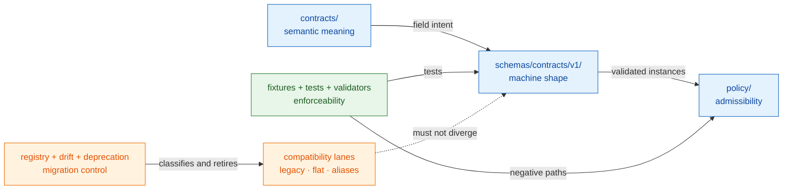
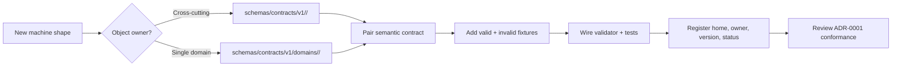

<!-- [KFM_META_BLOCK_V2]
doc_id: kfm://doc/adr-0001-schema-home
title: "ADR-0001 — Schema Home: schemas/contracts/v1/ is Canonical"
type: adr
adr_id: ADR-0001
version: v1.2
status: proposed
owners:
  - Docs steward
  - Contract/Schema steward
reviewers_required:
  - Docs steward
  - Contract/Schema steward
  - Architecture steward
  - "at least one affected subsystem owner"
created: 2026-05-10
updated: 2026-07-23
policy_label: public
truth_posture: cite-or-abstain
responsibility_root: docs/
current_path: docs/adr/ADR-0001-schema-home--schemas-contracts-v1-is-canonical.md
supersedes: []
superseded_by: null
evidence_snapshot:
  repository: bartytime4life/Kansas-Frontier-Matrix
  base_ref: main
  base_commit: 19670ca8e2c8a709fc69cd41173851f8359c8281
  target_prior_blob: ab0010a278d766356845c23055f882f328abb418
  directory_rules_blob: 2affb080e6f0043867c64c7f06c1ca52030fbd55
  adr_index_blob: cf08fae322ac53426f7394d97897fdb942253049
  schemas_readme_blob: 15c84131862c00584664dfafa497c012ae765d33
  schemas_contracts_v1_readme_blob: bbe931c9f7a5f0132522c0bda4fa5455c050a973
  contracts_readme_blob: 6e05ba40fcc255e392210e56ef9519203aec6006
  schema_validation_workflow_blob: e6b26337aa1eea142b96560e041419f855c44d59
  validator_inventory_blob: f734a3e0944346bf2635fb9188702f13b45c8a64
  object_family_register_blob: 930a9da30d5481f8d7ed5b7789d7846a30d3f4e1
  deprecation_register_blob: 1fb7219dcdb7a437e38fa8ca92ba34e29667d3fa
related:
  - docs/adr/README.md
  - docs/adr/INDEX.md
  - docs/adr/ADR-0002-contracts-vs-schemas-split.md
  - docs/doctrine/directory-rules.md
  - docs/architecture/contract-schema-policy-split.md
  - schemas/README.md
  - schemas/contracts/v1/README.md
  - contracts/README.md
  - .github/workflows/schema-validation.yml
  - migrations/schema/README.md
  - docs/registers/DRIFT_REGISTER.md
  - docs/registers/VERIFICATION_BACKLOG.md
  - control_plane/object_family_register.yaml
  - control_plane/deprecation_register.yaml
tags: [kfm, adr, governance, schemas, contracts, schema-home, validator-parity, compatibility, migration]
notes:
  - "v1.2 is a same-path repository-grounded modernization; it does not change the proposed decision or imply acceptance."
  - "The repository currently configures schemas/contracts/v1/ as the v1 validation surface, but configuration does not substitute for reviewed ADR acceptance."
  - "The missing schema registry, empty object-family/deprecation registers, and unclassified compatibility lanes remain adoption blockers."
  - "Canonicalization, spec_hash derivation, complete $id grammar, and schema-family naming remain outside this ADR."
[/KFM_META_BLOCK_V2] -->

<a id="top"></a>

# ADR-0001 — Schema Home: `schemas/contracts/v1/` is Canonical

> **Proposed decision.** If accepted, KFM will use **`schemas/contracts/v1/`** as the single default home for contract-backed machine schemas. `contracts/` will retain human-readable meaning; `schemas/` will own machine-checkable shape. Tracked compatibility paths may exist only as governed migration surfaces and must not evolve as parallel authority.

[](#1-status-and-scope)
[](#11-current-repository-evidence-snapshot)
[](../../.github/workflows/schema-validation.yml)
[](../../tools/validators/_common/run_all.py)
[](#33-authority-boundary)

> [!IMPORTANT]
> **Configured behavior is not reviewed decision authority.** The current repository already validates a nonempty `schemas/contracts/v1/` tree and six fixture-backed object families, but the canonical ADR index still records ADR-0001 as `proposed`. This revision documents that implementation fact without promoting the decision to `accepted`.

**Quick navigation:** [Status](#1-status-and-scope) · [Context](#2-context) · [Decision](#3-decision) · [Consequences](#4-consequences) · [Alternatives](#5-alternatives-considered) · [Migration](#6-migration-plan) · [Rollback](#7-rollback-and-reversal) · [Validation](#8-validation-and-enforcement) · [Open work](#9-open-questions-and-needs-verification) · [Evidence](#10-related-documents-and-evidence)

---

## 1. Status and Scope

| Field | Current value |
|---|---|
| **ADR ID** | `ADR-0001` |
| **Decision status** | `proposed` — not binding until the ADR and [`INDEX.md`](./INDEX.md) carry reviewed `accepted` status |
| **Decision class** | Directory Rules §2.4: schema-home rule and prohibition on parallel authority |
| **Repository scope** | Repo-wide machine-schema placement for contract-backed object families |
| **Current implementation posture** | `schemas/contracts/v1/` is a configured validation surface; compatibility debt remains |
| **Semantic contract home** | [`contracts/`](../../contracts/) |
| **Machine-shape home proposed here** | [`schemas/contracts/v1/`](../../schemas/contracts/v1/) |
| **Policy home** | `policy/` |
| **Fixture and test homes currently exercised** | `fixtures/contracts/v1/`, `tests/schemas/`, and `tests/contracts/` |
| **Migration home** | [`migrations/schema/`](../../migrations/schema/) with paired rollback records under `migrations/rollback/` |
| **Publication effect** | None. A schema path, passing validator, commit, or merged PR does not publish data or accept this ADR. |

### 1.1 Current repository evidence snapshot

The following findings are **CONFIRMED at `main@19670ca8e2c8a709fc69cd41173851f8359c8281`** unless marked otherwise.

| Surface | Verified state | What it proves—and does not prove |
|---|---|---|
| [`docs/adr/INDEX.md`](./INDEX.md) | ADR-0001 is present and its effective status is `proposed`. | Proves inventory and status normalization; does not accept the decision. |
| [`schemas/README.md`](../../schemas/README.md) | `schemas/` is documented as the machine-shape responsibility root; `schemas/contracts/v1/` is the configured v1 surface. | Proves current repository guidance; does not settle the ADR by itself. |
| [`schemas/contracts/v1/README.md`](../../schemas/contracts/v1/README.md) | The v1 tree exists as a mixed-maturity index with canonical candidates, scaffolds, compatibility lanes, and unresolved naming drift. | Proves the tree is not a single-maturity or fully converged authority surface. |
| [`contracts/README.md`](../../contracts/README.md) | `contracts/` documents semantic meaning and points machine shape to `schemas/contracts/v1/`. | Proves current root guidance; not schema coverage or implementation completeness. |
| [`schema-validation.yml`](../../.github/workflows/schema-validation.yml) | Workflow definition parses schema JSON, meta-validates `*.schema.json`, requires Draft 2020-12 and unique `$id` values under the v1 tree, runs six fixture-backed validators, then runs schema/contract tests. | Proves command-bearing CI intent; not that this branch or future branches passed. |
| [`run_all.py`](../../tools/validators/_common/run_all.py) | Six validators are configured: SourceDescriptor, EvidenceRef, EvidenceBundle, RuntimeResponseEnvelope, DecisionEnvelope, and RunReceipt. | Proves bounded aggregate coverage only. |
| `docs/registers/SCHEMA_REGISTRY_INDEX.md` | **Not present** at the pinned snapshot. | Registry coverage is not established. |
| [`object_family_register.yaml`](../../control_plane/object_family_register.yaml) | File exists with `entries: []`. | Object-family-to-schema mapping is not populated. |
| [`deprecation_register.yaml`](../../control_plane/deprecation_register.yaml) | File exists with `entries: []`. | No mirror sunset or compatibility retirement is recorded there. |
| [`DRIFT_REGISTER.md`](../registers/DRIFT_REGISTER.md) and [`VERIFICATION_BACKLOG.md`](../registers/VERIFICATION_BACKLOG.md) | Files exist, but the inspected entries do not close the current schema-home compatibility debt documented by `schemas/README.md`. | Adoption still needs explicit drift and verification records. |
| Open PR / branch path claim | No open PR or matching schema-home branch was returned by the connector preflight. | Supports a clear one-writer path claim for this update; it is not a permanent concurrency guarantee. |

> [!CAUTION]
> The repository contains confirmed transitional or compatibility schema lanes outside the preferred logical route, including root-level `schemas/evidence/`, `schemas/governance/`, `schemas/maplibre/`, and `schemas/people-dna-land/`, plus overlapping flat lanes inside `schemas/contracts/v1/`. This ADR does not silently promote or delete them. It requires classification, migration evidence, and reversible retirement.

### 1.2 In scope

- The default canonical home for contract-backed JSON Schema, schema YAML where supported, JSON-LD contexts, and equivalent machine-shape artifacts.
- The boundary between semantic contracts and machine schemas.
- Cross-cutting versus domain-specific routing below `schemas/contracts/v1/`.
- Compatibility-path classification, migration records, deprecation, and rollback.
- PR-time and CI checks that prevent new parallel machine-schema authority.
- The acceptance gates required before the proposed decision becomes binding.

### 1.3 Out of scope

- Field-level schema design.
- Canonical JSON, RFC 8785 / JCS, `spec_hash`, content-addressing, or full `$id` URI grammar.
- Schema-dialect migration beyond recording that the current workflow checks Draft 2020-12.
- Object-family naming, domain slug normalization, or source/sources and map/layers consolidation.
- Policy rules, source authority, evidence closure, lifecycle promotion, release approval, or publication.
- Automatic migration of any tracked compatibility file in this documentation-only change.

### 1.4 Truth and state vocabulary

- **CONFIRMED** — verified from the pinned repository evidence named above.
- **PROPOSED** — the architectural decision and future migration state recorded by this ADR.
- **UNKNOWN** — insufficient evidence supports a stronger statement.
- **NEEDS VERIFICATION** — a concrete check is identified but not closed.
- **CONFLICTED** — implementation and doctrine, or two candidate authority surfaces, disagree.

`proposed`, `accepted`, `superseded`, and `rejected` are ADR lifecycle states. They are not truth labels.

[Back to top](#top)

---

## 2. Context

### 2.1 The problem

KFM separates four responsibilities that must remain coupled but must not collapse:

```text
contracts/  -> semantic meaning and claim limits
schemas/    -> machine-checkable shape
policy/     -> admissibility and obligations
fixtures/ + tests/ + tools/validators/ -> representative and executable proof
```

Lineage documents and repository scaffolds have used several machine-schema placements:

- `schemas/contracts/v1/<family>/<object>.schema.json`
- `schemas/contracts/v1/domains/<domain>/<object>.schema.json`
- flat or compatibility lanes under `schemas/<topic>/` or `schemas/contracts/v1/<topic>/`
- legacy machine files described under `contracts/<domain>/`

Those paths are not equivalent. If more than one tracked location may change the same machine shape independently, validators, producers, consumers, registries, and reviewers lose a deterministic authority chain.

### 2.2 Current implementation pressure

The repository has moved beyond a doctrine-only state:

1. `schemas/contracts/v1/` exists and is nonempty.
2. CI is configured to check Draft 2020-12, unique `$id` values, six aggregate validators, valid/invalid fixtures, and schema/contract tests.
3. Root READMEs already describe `contracts/` as meaning and `schemas/` as shape.
4. Compatibility and transitional lanes still exist, and the schema registry and deprecation mappings are not populated.

That creates a governance gap: **implementation has a preferred route, but the decision remains proposed and migration closure is incomplete.** ADR-0001 exists to make the route reviewable, not to pretend the gap is already closed.

### 2.3 Forces



The decision must balance:

- a single predictable path for validators and consumers;
- separation of meaning from shape;
- existing tracked compatibility paths and consumers;
- schema-family maturity differences;
- migration safety and history preservation;
- review burden across repo-wide and domain-specific object families.

### 2.4 Relationship to ADR-0002

[`ADR-0002`](./ADR-0002-contracts-vs-schemas-split.md) is a separate proposed decision.

- **ADR-0001** answers: *Where does contract-backed machine shape live?*
- **ADR-0002** answers: *What does each responsibility surface own, and how do the surfaces interlock?*

Neither record accepts the other. If one is accepted first, its final wording must not silently grant the other a status transition.

[Back to top](#top)

---

## 3. Decision

> [!IMPORTANT]
> The RFC 2119 terms below become binding only if ADR-0001 is reviewed and moved to `accepted`. Until then, they express the proposed target state and the safest default for new work.

### 3.1 Canonical routing rule

If accepted:

1. **MUST** place new contract-backed machine schemas under `schemas/contracts/v1/`.
2. **MUST** place cross-cutting families under `schemas/contracts/v1/<family>/...`.
3. **MUST** place domain-specific families under `schemas/contracts/v1/domains/<domain>/...` unless an accepted ADR defines a cross-domain family.
4. **MUST** keep human-readable meaning under `contracts/` and executable policy under `policy/`.
5. **MUST** classify every tracked alternate path as canonical candidate, compatibility alias, generated mirror, deprecated path, migration source, external export, or unresolved conflict.
6. **MUST NOT** maintain divergent definitions for one machine object family in multiple locations.
7. **MUST NOT** add new `*.schema.json` files under `contracts/`.
8. **MUST NOT** treat a passing schema or workflow as evidence, policy approval, release approval, or publication.
9. **MAY** retain a compatibility path only when its canonical source, generation/freeze rule, owner, consumer, sunset or review date, migration record, and rollback are documented.
10. **MAY** use local uncommitted scratch files outside the canonical tree; tracked scratch or experimental schemas require an explicit noncanonical classification and migration target before merge.

### 3.2 Cross-cutting and domain families

| Family kind | Proposed route | Examples | Boundary |
|---|---|---|---|
| Cross-cutting trust objects | `schemas/contracts/v1/<family>/` | `source/`, `evidence/`, `runtime/`, `policy/`, `release/`, `review/`, `receipts/` | A family is cross-cutting only when no single domain owns its meaning. |
| Domain-specific objects | `schemas/contracts/v1/domains/<domain>/` | `hydrology/`, `soil/`, `fauna/`, `archaeology/` | Domain names are lanes inside the schema responsibility root, not new roots. |
| Compatibility or alias lanes | Existing tracked alternate path | `source/` versus `sources/`; flat domain aliases; root-level transitional lanes | Must not evolve independently; requires migration or explicit long-term compatibility decision. |
| External standard profiles | Reviewed family under `schemas/contracts/v1/` or a separately accepted standards profile path | STAC or other conformance profiles | External standards do not replace KFM object meaning or release authority. |

The table is routing guidance, not an exhaustive tree inventory. [`schemas/contracts/v1/README.md`](../../schemas/contracts/v1/README.md) is the current repository index and must remain explicit about mixed maturity and drift.

### 3.3 Authority boundary

| Surface | Owns | Does not own |
|---|---|---|
| [`contracts/`](../../contracts/) | Semantic meaning, field intent, invariants, claim limits, compatibility meaning | Machine validation, policy decisions, emitted instances |
| [`schemas/`](../../schemas/) | Machine-checkable structure, `$schema`, `$id`, `$ref`, required fields, enums, composition, primitive constraints | Semantic truth, source authority, evidence closure, rights, sensitivity, release |
| `policy/` | Allow, deny, restrict, hold, abstain, obligations, rights and sensitivity gates | General object meaning or machine shape |
| `fixtures/` | Representative valid, invalid, edge, and golden examples | Production data or authority by example |
| `tests/` | Runnable proof for selected behavior | Canonical definitions or release authority |
| `tools/validators/` | Reusable executable checks and finite validation outcomes | Permanent proof storage, schema ownership, publication |
| `data/receipts/`, `data/proofs/`, `release/` | Emitted process memory, proof objects, promotion and rollback decisions | Normative schema or contract definitions |

### 3.4 Identity and version boundaries

This ADR decides placement, not complete identity grammar.

| Concern | Current verified or proposed posture | Decision owner |
|---|---|---|
| JSON Schema dialect | Current workflow checks Draft 2020-12 under the canonical v1 tree. | Current configuration; future dialect changes require migration review. |
| `$id` presence and uniqueness | Current workflow requires both for canonical v1 schemas. | Current configuration. |
| `$id` namespace and path derivation | Mixed namespaces are documented; exact grammar remains unresolved. | Separate identity/canonicalization decision. |
| `spec_hash` | Out of scope. | ADR-0013 or an accepted successor. |
| Breaking shape changes | Require compatibility analysis, migration sequencing, fixtures, consumer review, and rollback/forward-fix record. | [`migrations/schema/README.md`](../../migrations/schema/README.md). |
| `v2/` creation | Requires explicit migration and consumer support; not authorized by this ADR alone. | Future reviewed change. |

[Back to top](#top)

---

## 4. Consequences

### 4.1 Positive

- **One default machine-schema route.** Validators, CI, producers, consumers, and reviewers share a predictable search surface.
- **Visible authority split.** Contract meaning, schema shape, policy, fixtures, tests, and emitted records stay distinguishable.
- **Less validator ambiguity.** New schema work cannot choose a home independently by domain preference.
- **Governed compatibility.** Existing aliases and flat lanes become explicit migration debt rather than ambient authority.
- **Safer versioning.** Breaking changes have a defined migration and rollback lane.
- **Better documentation truth.** Current configuration can be described without falsely claiming accepted governance.

### 4.2 Costs and tradeoffs

- Existing compatibility lanes require inventory, ownership, consumer analysis, and disposition.
- Some downstream code or docs may need a deprecation window rather than an immediate move.
- Registry and drift work must be completed before acceptance can be considered closed.
- The repository may temporarily carry both canonical and compatibility paths, increasing review burden.
- A strict canonical route can feel slower during experimentation; tracked experimentation must declare its status and exit path.
- This ADR does not solve family naming, `$id` namespace, stub maturity, or complete contract/schema parity.

### 4.3 Affected responsibility roots

| Root | Effect of acceptance |
|---|---|
| `schemas/` | Owns contract-backed machine shape; canonical candidates route through `schemas/contracts/v1/`. |
| `contracts/` | Retains semantic Markdown; new machine schemas are denied. |
| `policy/` | Continues to own admissibility; schema shape cannot replace policy. |
| `fixtures/`, `tests/`, `tools/validators/` | Prove selected positive and negative shape behavior against canonical schemas. |
| `control_plane/` and `docs/registers/` | Record object-family routing, compatibility debt, deprecation, and verification state. |
| `migrations/schema/`, `migrations/rollback/` | Hold migration and reversal/forward-fix records. |
| `.github/workflows/` | Coordinates read-only validation without becoming schema authority. |

[Back to top](#top)

---

## 5. Alternatives Considered

<details>
<summary><strong>5.1 Use <code>contracts/</code> as both meaning and machine-shape authority</strong></summary>

**Why considered.** Co-locating Markdown and JSON Schema can simplify browsing for a small object family.

**Rejected because.** It collapses semantic and executable responsibilities, makes validators scan mixed content, and makes compatibility copies harder to distinguish from normative shape.

**Disposition.** `contracts/` remains semantic. Cross-links provide proximity without shared authority.
</details>

<details>
<summary><strong>5.2 Permit permanent flat topic homes under <code>schemas/&lt;topic&gt;/</code></strong></summary>

**Why considered.** Several tracked lanes already use topic-oriented or legacy paths.

**Rejected as the default because.** Permanent flat homes recreate an N+1 authority model and make domain/cross-cutting routing inconsistent.

**Disposition.** Existing paths are compatibility or migration candidates until explicitly reviewed. New tracked flat homes require an accepted exception or migration plan.
</details>

<details>
<summary><strong>5.3 Maintain schemas in both <code>schemas/</code> and <code>contracts/</code></strong></summary>

**Why considered.** Dual paths can preserve hard-coded consumers during transition.

**Rejected as steady state because.** Hand-maintained duplicates drift, validators may disagree, and reviewers cannot identify the authoritative definition.

**Disposition.** A temporary alias or generated mirror is allowed only under the compatibility controls in §3.1 and §6.4.
</details>

<details>
<summary><strong>5.4 Use <code>schemas/v1/contracts/...</code></strong></summary>

**Why considered.** Some API and package layouts place versions before the resource family.

**Rejected because.** The repository is already configured around `schemas/contracts/v1/`; changing the order adds migration cost without resolving a trust-boundary problem.
</details>

<details>
<summary><strong>5.5 Treat current configuration as implicit acceptance</strong></summary>

**Why considered.** Root READMEs and CI already favor `schemas/contracts/v1/`.

**Rejected because.** Implementation evidence and ADR lifecycle are different state vocabularies. Configuration can precede, lag, or drift from governance. Acceptance requires explicit reviewed status evidence in this record and the canonical index.
</details>

[Back to top](#top)

---

## 6. Migration Plan

Migration is a governed compatibility transition, not a bulk file move.

### 6.1 Pre-migration inventory

Before moving a schema family:

1. Pin the base commit and record current blob hashes.
2. Inventory canonical candidates and alternate paths for the same object family.
3. Identify producers, consumers, validators, fixtures, tests, docs, workflows, catalogs, released artifacts, and `$ref` dependencies.
4. Classify each path: canonical candidate, compatibility alias, generated mirror, deprecated, external export, migration source, or conflict.
5. Record drift and verification work.
6. Create a date-prefixed migration record under `migrations/schema/` and a paired rollback or forward-fix record under `migrations/rollback/`.
7. Separate path-only migration from semantic or field-shape changes.

> [!CAUTION]
> A move that changes object meaning, required fields, enum semantics, sensitivity posture, evidence requirements, or release behavior is not a path-only migration. It requires contract/schema version review and may require a new ADR.

### 6.2 New schema path



### 6.3 Existing compatibility or conflicting path

Use the repository migration contract in [`migrations/schema/README.md`](../../migrations/schema/README.md). The migration record should identify:

- old and proposed canonical paths;
- object-family and semantic-contract references;
- compatibility class;
- producers and consumers;
- `$id` and `$ref` impact;
- fixture and validator coverage;
- deprecation or alias behavior;
- migration order;
- release/correction impact, if any;
- rollback or forward-fix reference;
- post-adoption verification.

Use `git mv` when an actual move is authorized and history preservation is practical. Do not combine broad schema-content redesign with path consolidation unless the review explicitly accepts both.

### 6.4 Compatibility and mirror discipline

A tracked alternate path is admissible only when all applicable fields are recorded:

| Field | Requirement |
|---|---|
| Canonical source | Exact reviewed path and revision |
| Class | Alias, mirror, deprecated, external export, or unresolved conflict |
| Edit rule | Frozen, generated, redirect-only, or otherwise non-divergent |
| Consumers | Known readers and migration impact |
| Owner | Responsible steward or team |
| Review/sunset date | Concrete checkpoint; `null` only for explicitly reviewed long-term compatibility |
| Drift entry | Required while the path conflicts with the target architecture |
| Deprecation entry | Required when retirement is planned |
| Migration record | Required for tracked moves or generated mirrors |
| Rollback / forward fix | Required before adoption |

### 6.5 Migration record example

```markdown
# 20260723-adr-0001-<family>-schema-home

## Status
PROPOSED

## Scope
- canonical candidate: schemas/contracts/v1/<family>/<object>.schema.json
- compatibility source: <current path>
- semantic contract: contracts/<family>/<object>.md

## Compatibility class
DEPRECATION | BREAKING | DOC_ONLY | OTHER_REVIEWED_CLASS

## Producers and consumers
<paths and owners>

## Validation
- schema meta-validation
- valid and invalid fixtures
- validator and contract tests
- $id / $ref checks
- consumer compatibility checks

## Rollback or forward fix
migrations/rollback/20260723-adr-0001-<family>-schema-home.md

## Drift and deprecation records
<register references>
```

A `release/rollback_cards/` record is additionally required only when released or published artifacts are affected. It does not replace the migration rollback record.

[Back to top](#top)

---

## 7. Rollback and Reversal

| Scenario | Required response |
|---|---|
| ADR remains proposed or is rejected | Keep current implementation explicitly described as configuration, not accepted doctrine; mark `rejected` if reviewed; preserve the file. |
| A family migration fails | Execute its migration rollback or forward-fix record; do not rewrite raw source material or erase the failed migration evidence. |
| A compatibility alias diverges | Freeze writes, compare hashes and semantics, restore from canonical or quarantine the alias, and record correction impact. |
| A move changes meaning unintentionally | Revert the path change, restore prior consumers, and open a separate semantic/version decision. |
| A later accepted ADR changes the schema home | Mark ADR-0001 `superseded`, link both records, retain this file, and execute a reviewed migration. |
| Published artifacts relied on the wrong shape | Use release correction, withdrawal, cache invalidation, and rollback controls in addition to repository revert. |

> [!IMPORTANT]
> Rejected and superseded ADRs remain governance memory. Do not delete this record or rewrite an accepted historical decision in place.

[Back to top](#top)

---

## 8. Validation and Enforcement

### 8.1 Current configured checks

The current [`schema-validation`](../../.github/workflows/schema-validation.yml) workflow definition:

- runs on pull requests, pushes to `main`, and explicit dispatch;
- uses read-only repository permissions;
- parses every JSON file under `schemas/`;
- meta-validates every `*.schema.json` with Draft 2020-12;
- requires canonical v1 schemas to declare Draft 2020-12 and unique `$id` values;
- requires nonempty valid and invalid fixture lanes for six configured validators;
- runs `make schemas`;
- runs `python -m pytest -q tests/schemas tests/contracts`;
- emits job output only, not a receipt, proof, policy decision, release record, or published artifact.

These checks are bounded machine-shape evidence. They do not prove semantic truth, evidence closure, rights, sensitivity, policy approval, release readiness, or publication.

### 8.2 Proposed ADR-0001 enforcement additions

| Check | Required assertion | Status |
|---|---|---|
| New-path policy | New contract-backed schemas land under `schemas/contracts/v1/`. | PROPOSED |
| Contracts scan | No new `*.schema.json` files land under `contracts/`. | PROPOSED |
| Alternate-path classification | Every tracked noncanonical schema path has a compatibility or migration record. | PROPOSED |
| Divergence check | Mirrors/aliases match canonical content or an approved transform. | PROPOSED |
| Contract crosswalk | A schema links to semantic meaning; a contract claiming machine validation links to the reviewed schema. | PROPOSED |
| Registry coverage | Object family, owner, version, home, maturity, fixtures, validator, and migration state are recorded. | BLOCKED by absent/unpopulated registry surfaces |
| `$id` path grammar | `$id` follows an accepted namespace/path rule. | DEFERRED to identity/canonicalization decision |
| Consumer compatibility | Producers and consumers pass the migration plan's checks. | Per migration |

### 8.3 Validation commands

Repository-native commands documented by current files include:

```bash
python -m pip install -e ".[test]"
make schemas
python -m pytest -q tests/schemas tests/contracts
python tools/validators/validate_adr_index.py
python -m pytest tests/validators/test_validate_adr_index.py -q --strict-config --strict-markers
```

> [!NOTE]
> A workflow definition is not a current run result. Before acceptance or migration, verify the exact revision's required checks and preserve the run URLs or other review evidence.

### 8.4 Acceptance criteria

ADR-0001 may move from `proposed` to `accepted` only when all required criteria are reviewed:

- [ ] The ADR text and [`INDEX.md`](./INDEX.md) transition together to `accepted`.
- [ ] All named decision owners and at least one affected subsystem owner provide explicit review evidence.
- [ ] The current `schemas/` tree is recursively inventoried and alternate paths are classified.
- [ ] No new tracked machine schemas are introduced under `contracts/` or another unclassified home.
- [ ] `docs/registers/SCHEMA_REGISTRY_INDEX.md` exists **or** an accepted alternative registry is named and populated.
- [ ] `control_plane/object_family_register.yaml` contains reviewed schema-home mappings for the acceptance scope.
- [ ] Drift and deprecation records cover active compatibility paths and retirement windows.
- [ ] Required schema, fixture, validator, contract, and ADR-index checks pass on the acceptance revision.
- [ ] ADR-0002 wording is checked for consistency without implying its acceptance.
- [ ] A migration and rollback/forward-fix plan exists for every in-scope conflicting path.
- [ ] Public clients and release paths do not read schemas or `contracts/` as source truth.

[Back to top](#top)

---

## 9. Open Questions and NEEDS VERIFICATION

| ID | Item | Current evidence | Required closure |
|---|---|---|---|
| `ADR1-V01` | Complete recursive inventory of schemas outside `schemas/contracts/v1/` | Compatibility lanes are documented, but this ADR update did not perform a complete tree export. | Generate inventory; classify every path. |
| `ADR1-V02` | Complete inventory of `*.schema.json` under `contracts/` | No exhaustive recursive path listing was produced in this update. | Run repository scan and add migration records where needed. |
| `ADR1-V03` | Canonical schema registry | Proposed `docs/registers/SCHEMA_REGISTRY_INDEX.md` is absent; object-family register is empty. | Create or accept one noncompeting registry and populate reviewed entries. |
| `ADR1-V04` | `$id` namespace and path derivation | Presence and uniqueness are checked; namespace forms remain mixed. | Resolve through ADR-0013 or successor and add path-grammar tests. |
| `ADR1-V05` | Flat-family and alias consolidation | `source/sources`, `map/layers`, transport/trade-routes, and domain aliases remain mixed. | Per-family migration decisions; do not solve by bulk rename. |
| `ADR1-V06` | Fixture authority wording | Current implementation uses root `fixtures/contracts/v1/` plus `tests/schemas` and `tests/contracts`; Directory Rules includes an illustrative `schemas/tests` tree. | Reconcile doctrine and implementation in a separate reviewed docs change. |
| `ADR1-V07` | Steward assignment and independent review | CODEOWNERS routing exists, but accepted steward roles and required independent approval are not proven here. | Record governance ownership and review evidence. |
| `ADR1-V08` | Current workflow result | Workflow definition is verified; run status for this change is pending until GitHub executes it. | Record required checks for the PR head. |
| `ADR1-V09` | Broken legacy inbound links | Several companion docs still reference `docs/adr/ADR-0001-schema-home.md`, not the tracked filename. | Repair links in a scoped follow-up after inbound-link inventory. |
| `ADR1-V10` | Compatibility sunset policy | Deprecation register exists but is empty. | Add reviewed entries or accept explicit long-term compatibility decisions. |

[Back to top](#top)

---

## 10. Related Documents and Evidence

| Document or surface | Relationship | Snapshot status |
|---|---|---|
| [`docs/adr/README.md`](./README.md) | ADR lifecycle, authoring, review, and validation contract | Repository-grounded |
| [`docs/adr/INDEX.md`](./INDEX.md) | Canonical human ADR inventory; records ADR-0001 as `proposed` | Repository-grounded |
| [`ADR-0002`](./ADR-0002-contracts-vs-schemas-split.md) | Companion proposed division-of-labor decision | Present; proposed |
| [`Directory Rules`](../doctrine/directory-rules.md) | Placement doctrine; §6.4 states the schema-home rule | Present; draft doctrine |
| [`Contract / Schema / Policy / Test Split`](../architecture/contract-schema-policy-split.md) | Human architecture explanation of responsibility separation | Present; draft |
| [`schemas/README.md`](../../schemas/README.md) | Current root authority and implementation snapshot | Present; repository-grounded draft |
| [`schemas/contracts/v1/README.md`](../../schemas/contracts/v1/README.md) | Current mixed-maturity v1 family index | Present; draft |
| [`contracts/README.md`](../../contracts/README.md) | Current semantic-contract boundary | Present; draft |
| [`schema-validation.yml`](../../.github/workflows/schema-validation.yml) | Current command-bearing shape validation workflow | Present; run result per revision |
| [`migrations/schema/README.md`](../../migrations/schema/README.md) | Current schema migration and compatibility contract | Present; draft |
| [`DRIFT_REGISTER.md`](../registers/DRIFT_REGISTER.md) | Human drift record | Present; schema-home debt not closed |
| [`VERIFICATION_BACKLOG.md`](../registers/VERIFICATION_BACKLOG.md) | Human verification queue | Present; schema-home debt not closed |
| [`object_family_register.yaml`](../../control_plane/object_family_register.yaml) | Proposed machine-readable object-family crosswalk | Present; empty |
| [`deprecation_register.yaml`](../../control_plane/deprecation_register.yaml) | Proposed compatibility retirement register | Present; empty |
| `docs/registers/SCHEMA_REGISTRY_INDEX.md` | Proposed human schema registry named by the prior ADR revision | Absent at snapshot |

[Back to top](#top)

---

## Appendix A — Routing Reference

This appendix is a routing aid, not an exhaustive inventory or proof of family maturity.

| Object role | Proposed canonical pattern | Companion responsibility |
|---|---|---|
| Shared primitive or reusable fragment | `schemas/contracts/v1/common/` | Contract or README explains intended reuse. |
| Source object | `schemas/contracts/v1/source/` | `contracts/source/`, source registry, fixtures, validator. |
| Evidence object | `schemas/contracts/v1/evidence/` | `contracts/evidence/`, evidence fixtures, resolver and policy tests. |
| Runtime envelope | `schemas/contracts/v1/runtime/` | `contracts/runtime/`, runtime tests, governed API boundary. |
| Policy input/output shape | `schemas/contracts/v1/policy/` | Executable rules remain in `policy/`. |
| Receipt shape | `schemas/contracts/v1/receipts/` or reviewed family route | Emitted receipts remain under `data/receipts/`. |
| Release/review shape | `schemas/contracts/v1/release/` or `review/` | Decisions and records remain under `release/` or governed review surfaces. |
| Domain object | `schemas/contracts/v1/domains/<domain>/` | Semantic meaning remains under `contracts/domains/<domain>/`. |
| Map/UI/profile shape | Reviewed cross-cutting family such as `map/`, `layers/`, `ui/`, or `maplibre/` | Resolve overlapping family names before promotion. |
| Compatibility alias | Existing tracked path with explicit classification | Frozen/generated; migration, drift, deprecation, and rollback controls required. |

[Back to top](#top)

---

## Appendix B — Migration Disposition Record

Use the current migration contract rather than creating a parallel migration authority.

| Field | Required value |
|---|---|
| ADR | `ADR-0001` |
| Object family | Stable contract/schema family name |
| Current path | Exact tracked path and blob hash |
| Proposed canonical path | Exact route under `schemas/contracts/v1/` |
| Classification | Canonical candidate / alias / mirror / deprecated / external export / conflict |
| Semantic contract | Exact `contracts/` path |
| Producers and consumers | Exact paths or named systems |
| Compatibility class | Additive / behavior-compatible / deprecation / breaking / forward-fix-only / docs-only |
| Validation | Schema, fixture, validator, test, `$id`, `$ref`, and consumer checks |
| Drift entry | Required while conflict exists |
| Deprecation entry | Required when retirement is planned |
| Migration record | Date-prefixed record under `migrations/schema/` |
| Rollback or forward fix | Matching record under `migrations/rollback/` |
| Release correction | Required only when released/public artifacts are affected |
| Reviewer evidence | Schema/contract/migration owners and affected consumer owners |

[Back to top](#top)

---

## Change Log

| Version | Date | Change |
|---|---|---|
| `v1.2` | 2026-07-23 | Same-path repository-grounded modernization. Preserved the proposed decision; added pinned evidence, separated configured behavior from ADR authority, repaired migration and validation guidance, documented compatibility debt and adoption blockers, consolidated links, and refreshed GitHub presentation. |
| `v1.1` | 2026-05-15 | Tightened truth labels, cross-cutting/domain wording, section-number drift, illustrative validator guidance, and acceptance criteria. |
| `v1` | 2026-05-10 | Initial proposal formalizing the schema-home rule referenced by Directory Rules. |

---

**Last updated:** 2026-07-23 · **Decision status:** `proposed` · **Path:** `docs/adr/ADR-0001-schema-home--schemas-contracts-v1-is-canonical.md` · [Back to top](#top)
