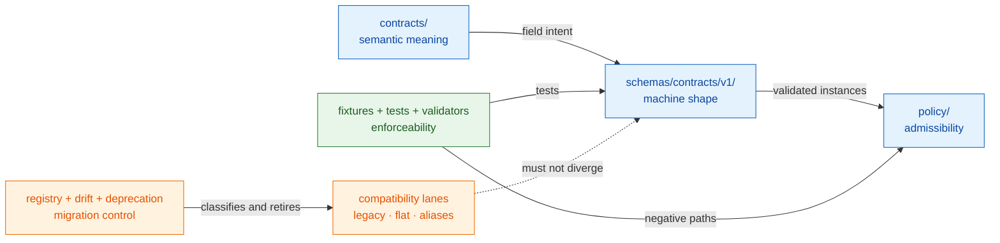
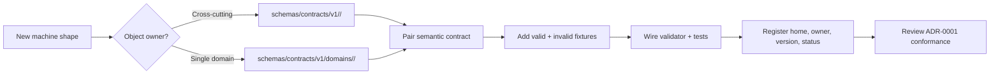

<!-- [KFM_META_BLOCK_V2]
doc_id: kfm://doc/adr-0001-schema-home
title: "ADR-0001 — Schema Home: schemas/contracts/v1/ is Canonical"
type: adr
adr_id: ADR-0001
version: v1.3
status: proposed
owners:
  - Docs steward
  - Contract/Schema steward
reviewers_required:
  - Docs steward
  - Contract/Schema steward
  - Architecture steward
  - "at least one affected subsystem owner"
created: 2026-05-10
updated: 2026-08-13
policy_label: public
truth_posture: cite-or-abstain
responsibility_root: docs/
current_path: docs/adr/ADR-0001-schema-home--schemas-contracts-v1-is-canonical.md
supersedes: []
superseded_by: null
evidence_snapshot:
  repository: bartytime4life/Kansas-Frontier-Matrix
  base_ref: main
  base_commit: 695748928f254c2c234b9058bf41cdb23f27e3c6
  base_tree: 7faf955013a020cbf0bf64f3a013ec68af427b77
  target_prior_blob: 3c520ea8f2f8bcb3d478329a87d98b135ea335fd
  directory_rules_blob: fd49a0b83e55cef52c1124281f093e263526898d
  adr_readme_blob: b497be1714b88550d2f1eb151bc20a6351e99dec
  adr_index_blob: 938c5894c36b99e14810918e2c550ab0e92d53b1
  adr_0002_blob: e626d82970932c319a690fc6044727ed114ada6a
  adr_0029_blob: 3ba5f902ffe20a65a259cb0a7dab07f1725d204b
  architecture_split_blob: 101b921cf152f75da425ce61a0f00295334e58cb
  schemas_readme_blob: ce53d0ddb998ddcb8208d0367c90f9c25e31a8ad
  schemas_contracts_v1_readme_blob: bbe931c9f7a5f0132522c0bda4fa5455c050a973
  contracts_readme_blob: e0b7c126e00a8ac6e8890774ed26cf21aef534ba
  schema_validation_workflow_blob: 0e1562f539323daa401184738a0c490b51e2999b
  validator_registry_blob: c65c1c2b27b85be4bdc3c42d0555c6e8e44698e2
  validator_entrypoint_blob: c308015da780d7b72f56277b521fb0e42317651e
  validator_orchestrator_blob: 728cf1404839a5b95e03d70d44567863a6f9b6df
  compatibility_runner_blob: 39e57978b3d3d24769ab56cf5b805d51de18f33f
  object_family_register_blob: 8673b21ea49cb4a2852595208efdb206ed040690
  deprecation_register_blob: 1fb7219dcdb7a437e38fa8ca92ba34e29667d3fa
  root_registry_blob: 024f668b5f0a9239bafa4f8b09e2afd86300ff8c
related:
  - docs/adr/README.md
  - docs/adr/INDEX.md
  - docs/adr/ADR-0002-contracts-vs-schemas-split.md
  - docs/adr/ADR-0029-adopt-directory-governance-standard-v2.md
  - docs/doctrine/directory-rules.md
  - docs/architecture/contract-schema-policy-split.md
  - schemas/README.md
  - schemas/contracts/v1/README.md
  - contracts/README.md
  - tools/validate_all.py
  - tools/validators/validator_registry.json
  - tools/validators/_common/run_all.py
  - .github/workflows/schema-validation.yml
  - migrations/schema/README.md
  - docs/registers/DRIFT_REGISTER.md
  - docs/registers/VERIFICATION_BACKLOG.md
  - control_plane/object_family_register.yaml
  - control_plane/deprecation_register.yaml
  - control_plane/root_registry.yaml
tags: [kfm, adr, governance, schemas, contracts, schema-home, validator-parity, compatibility, migration]
notes:
  - "v1.3 reconciles the same-path ADR with accepted Directory Rules v2 and current schema, validator, registry, and topology evidence; it does not accept ADR-0001 or change runtime behavior."
  - "Accepted ADR-0029 adopts the exact Directory Rules v2 bytes; DIR-AUTHROOT-001 already makes schemas/contracts/v1/<family>/ the default machine-schema route while ADR-0001 remains proposed as the dedicated routing, migration, and enforcement record."
  - "The validator full profile contains ten checks: eight fixture-backed object-family validators and two repository guardrails."
  - "The schema registry remains absent; the object-family register now projects six runtime families and remains PROPOSED, partial, navigational, and non-self-authorizing; the deprecation register remains empty."
  - "Canonicalization, spec_hash derivation, complete $id grammar, and final schema-family naming remain outside this ADR."
[/KFM_META_BLOCK_V2] -->

<a id="top"></a>

# ADR-0001 — Schema Home: `schemas/contracts/v1/` is Canonical

> **Decision posture.** Accepted Directory Rules v2 already make **`schemas/contracts/v1/<family>/`** the default route for machine schemas. ADR-0001 remains `proposed` as the dedicated record for family routing, compatibility classification, migration gates, enforcement, and acceptance evidence; it does not become accepted merely because part of its intended rule is already in force elsewhere.

[](#1-status-and-scope)
[](./ADR-0029-adopt-directory-governance-standard-v2.md)
[](#11-current-repository-evidence-snapshot)
[](../../tools/validators/validator_registry.json)
[](#33-authority-boundary)

> [!IMPORTANT]
> **Adopted placement is not acceptance of this ADR.** Accepted ADR-0029 gives the exact Directory Rules v2 bytes authority, including `DIR-AUTHROOT-001` and `DIR-AUTHROOT-002`. The canonical ADR index still records ADR-0001 as `proposed`. This revision separates those states, refreshes implementation evidence, and does not promote, release, migrate, or publish anything.

**Quick navigation:** [Status](#1-status-and-scope) · [Context](#2-context) · [Decision](#3-decision) · [Consequences](#4-consequences) · [Alternatives](#5-alternatives-considered) · [Migration](#6-migration-plan) · [Rollback](#7-rollback-and-reversal) · [Validation](#8-validation-and-enforcement) · [Open work](#9-open-questions-and-needs-verification) · [Evidence](#10-related-documents-and-evidence)

---

## 1. Status and Scope

| Field | Current value |
|---|---|
| **ADR ID** | `ADR-0001` |
| **Decision status** | `proposed` — this dedicated record is not accepted until the ADR and [`INDEX.md`](./INDEX.md) carry reviewed `accepted` status |
| **Adopted placement authority** | [ADR-0029](./ADR-0029-adopt-directory-governance-standard-v2.md) accepts the exact Directory Rules v2 bytes; §9.3 `DIR-AUTHROOT-001` already makes `schemas/contracts/v1/<family>/` the default machine-schema route |
| **Decision class** | Dedicated family routing, compatibility classification, migration, conformance, enforcement, and acceptance package layered on the adopted schema-root default |
| **Repository scope** | Repo-wide machine-schema placement for contract-backed object families |
| **Current implementation posture** | `schemas/contracts/v1/` is a configured validation surface; compatibility debt remains |
| **Semantic contract home** | [`contracts/`](../../contracts/) |
| **Default contract-backed machine-shape route** | [`schemas/contracts/v1/`](../../schemas/contracts/v1/) — adopted through Directory Rules; ADR-0001's dedicated package remains proposed |
| **Policy home** | `policy/` |
| **Fixture and test homes currently exercised** | `fixtures/contracts/v1/`, `tests/schemas/`, and `tests/contracts/` |
| **Migration home** | [`migrations/schema/`](../../migrations/schema/) with paired rollback records under `migrations/rollback/` |
| **Publication effect** | None. A schema path, passing validator, commit, or merged PR does not publish data or accept this ADR. |

### 1.1 Current repository evidence snapshot

The following findings are **CONFIRMED at `main@695748928f254c2c234b9058bf41cdb23f27e3c6`** and untruncated tree `7faf955013a020cbf0bf64f3a013ec68af427b77` unless marked otherwise.

| Surface | Verified state | What it proves—and does not prove |
|---|---|---|
| [`docs/adr/INDEX.md`](./INDEX.md) | ADR-0001 is uniquely indexed with effective status `proposed`; ADR-0029 is the only accepted numbered ADR. | Proves inventory and status normalization; does not accept ADR-0001. |
| [`ADR-0029`](./ADR-0029-adopt-directory-governance-standard-v2.md) and [Directory Rules](../doctrine/directory-rules.md) | ADR-0029 accepts the exact v2 bytes. Section 9.3 `DIR-AUTHROOT-001` establishes the default `schemas/contracts/v1/<family>/` route, and `DIR-AUTHROOT-002` prevents an independent duplicate under `contracts/`. | Proves adopted placement authority; does not silently change ADR-0001's lifecycle status. |
| Complete repository tree | 878 tracked `*.schema.json` files: 865 under `schemas/`—855 in `schemas/contracts/v1/` and 10 outside it—plus 3 under `contracts/`, 6 synthetic registry fixtures under `fixtures/`, and 4 tool-local schemas under `tools/validators/`. | Proves exact path inventory at the pinned tree; filename suffix alone does not establish contract-backed authority, canonicality, maturity, consumer closure, or safe deletion. |
| [`schemas/README.md`](../../schemas/README.md) | `schemas/` is the adopted machine-shape responsibility root; `schemas/contracts/v1/` is the configured v1 validation surface; root-level compatibility lanes remain visible. | Proves current repository guidance and bounded configuration; not ADR acceptance or complete family convergence. |
| [`schemas/contracts/v1/README.md`](../../schemas/contracts/v1/README.md) | The v1 tree remains a mixed-maturity index with detailed families, scaffolds, compatibility lanes, and unresolved naming drift. | Proves the tree is not a single-maturity or fully converged authority surface. |
| [`contracts/README.md`](../../contracts/README.md) | `contracts/` owns semantic meaning, points machine shape to the versioned schema route, and records three inherited schema-placement violations. | Proves current boundary guidance and known drift; not migration completion. |
| [`schema-validation.yml`](../../.github/workflows/schema-validation.yml) | The read-only workflow parses schema JSON, meta-validates `*.schema.json`, checks Draft 2020-12 and unique canonical `$id` values, requires 8 nonempty valid/invalid fixture families, runs the full validator profile, and runs schema/contract tests. | Proves command-bearing CI intent; not that this PR head passed. |
| [`validator_registry.json`](../../tools/validators/validator_registry.json) | The `full` profile contains 10 checks: 8 fixture-backed object-family validators and 2 repository guardrails—workflow security and repository topology. | Proves bounded registered coverage; not complete schema-tree, semantic, policy, or release coverage. |
| [`run_all.py`](../../tools/validators/_common/run_all.py) | The historical entrypoint delegates to `python tools/validate_all.py --profile full` and preserves the fixture-backed compatibility inventory. | Proves compatibility routing; it is not the canonical validator registry. |
| `docs/registers/SCHEMA_REGISTRY_INDEX.md` | **Absent** at the pinned tree. | A complete authoritative schema registry is not established. |
| [`object_family_register.yaml`](../../control_plane/object_family_register.yaml) | Projects 6 runtime families and declares itself `PROPOSED`, partial, navigational only, and non-self-authorizing. | Supplies a bounded crosswalk; not a complete schema registry or adoption decision. |
| [`deprecation_register.yaml`](../../control_plane/deprecation_register.yaml) | Remains `PROPOSED` with `entries: []`. | No compatibility sunset or retirement is closed there. |
| [`root_registry.yaml`](../../control_plane/root_registry.yaml) | Projects adopted root classes and `schemas/` as the machine-shape root while declaring non-effects. | Machine projection supports navigation and validation; it cannot create or amend authority. |
| Open PR path claim | No open PR mentioning ADR-0001 or schema home was returned by connector preflight. | Supports a clear one-writer claim for this update; it is not a permanent concurrency guarantee. |

> [!CAUTION]
> The complete tree confirms 10 machine schemas inside `schemas/` but outside the default versioned route and 3 schema files under `contracts/`. Six synthetic registry-fixture schemas and four tool-local schemas also use the suffix outside `schemas/`; they are not automatically contract-backed authority, but their test/tool roles must remain explicit. Root-level compatibility or transitional lanes include `schemas/atmosphere/`, `schemas/biotopes/`, `schemas/evidence/`, `schemas/governance/`, `schemas/maplibre/`, `schemas/people-dna-land/`, `schemas/policy/`, and `schemas/tests/`. This ADR update promotes, migrates, freezes, or deletes none of them.

### 1.2 In scope

- The relationship between the already-adopted default machine-schema route and ADR-0001's still-proposed dedicated decision package.
- The default canonical home for contract-backed JSON Schema, schema YAML where supported, JSON-LD contexts, and equivalent machine-shape artifacts.
- The boundary between semantic contracts and machine schemas.
- Cross-cutting versus domain-specific routing below `schemas/contracts/v1/`.
- Compatibility-path classification, migration records, deprecation, and rollback.
- PR-time and CI checks that prevent new parallel machine-schema authority.
- The acceptance gates required before ADR-0001's dedicated decision package can move to `accepted`.

### 1.3 Out of scope

- Field-level schema design.
- Canonical JSON, RFC 8785 / JCS, `spec_hash`, content-addressing, or full `$id` URI grammar.
- Schema-dialect migration beyond recording that the current workflow checks Draft 2020-12.
- Object-family naming, domain slug normalization, or source/sources and map/layers consolidation.
- Policy rules, source authority, evidence closure, lifecycle promotion, release approval, or publication.
- Automatic migration of any tracked compatibility file in this documentation-only change.
- Changing accepted Directory Rules v2, ADR-0029, ADR-0001 status, runtime behavior, release state, or publication state.

### 1.4 Truth and state vocabulary

- **CONFIRMED** — verified from the pinned repository evidence named above.
- **PROPOSED** — the architectural decision and future migration state recorded by this ADR.
- **UNKNOWN** — insufficient evidence supports a stronger statement.
- **NEEDS VERIFICATION** — a concrete check is identified but not closed.
- **CONFLICTED** — implementation and doctrine, or two candidate authority surfaces, disagree.

`proposed`, `accepted`, `superseded`, and `rejected` are ADR lifecycle states. They are not truth labels.

[Back to top](#top)

---

## 2. Context

### 2.1 The problem

KFM separates four responsibilities that must remain coupled but must not collapse:

```text
contracts/  -> semantic meaning and claim limits
schemas/    -> machine-checkable shape
policy/     -> admissibility and obligations
fixtures/ + tests/ + tools/validators/ -> representative and executable proof
```

Lineage documents and repository scaffolds have used several machine-schema placements:

- `schemas/contracts/v1/<family>/<object>.schema.json`
- `schemas/contracts/v1/domains/<domain>/<object>.schema.json`
- flat or compatibility lanes under `schemas/<topic>/` or `schemas/contracts/v1/<topic>/`
- legacy machine files described under `contracts/<domain>/`

Those paths are not equivalent. If more than one tracked location may change the same machine shape independently, validators, producers, consumers, registries, and reviewers lose a deterministic authority chain.

### 2.2 Current implementation pressure

The repository has moved beyond a doctrine-only state:

1. Accepted Directory Rules v2 already establish `schemas/` as the machine-shape root and `schemas/contracts/v1/<family>/` as the default machine-schema route.
2. The configured v1 tree is nonempty and holds 855 of the 865 tracked `*.schema.json` files under `schemas/`; the repository has 878 such files across all responsibility roots.
3. CI coordinates 8 fixture-backed object-family validators and a 10-check full profile, then runs schema/contract tests.
4. Root READMEs distinguish `contracts/` meaning from `schemas/` shape and identify known compatibility debt.
5. Ten schemas remain outside the versioned route, three remain under `contracts/`, the schema registry is absent, the object-family projection is partial, and the deprecation register is empty.

That creates a narrower governance gap than v1.2 described: **the placement default is adopted, but ADR-0001's dedicated family-routing, compatibility, migration, enforcement, and acceptance package remains proposed, and repository convergence is incomplete.** This record must document both facts without allowing either to erase the other.

### 2.3 Forces


```mermaid
flowchart LR
    C["contracts/<br/>semantic meaning"]
    S["schemas/contracts/v1/<br/>machine shape"]
    P["policy/<br/>admissibility"]
    F["fixtures + tests + validators<br/>enforceability"]
    X["compatibility lanes<br/>legacy · flat · aliases"]
    R["registry + drift + deprecation<br/>migration control"]

    C -->|field intent| S
    S -->|validated instances| P
    F -->|tests| S
    F -->|negative paths| P
    X -. must not diverge .-> S
    R -->|classifies and retires| X

    classDef authority fill:#e3f2fd,stroke:#1565c0,color:#0d47a1
    classDef proof fill:#e8f5e9,stroke:#2e7d32,color:#1b5e20
    classDef debt fill:#fff3e0,stroke:#ef6c00,color:#e65100
    class C,S,P authority
    class F proof
    class X,R debt
```

The decision must balance:

- a single predictable path for validators and consumers;
- separation of meaning from shape;
- existing tracked compatibility paths and consumers;
- schema-family maturity differences;
- migration safety and history preservation;
- review burden across repo-wide and domain-specific object families.

### 2.4 Relationship to ADR-0002

[`ADR-0002`](./ADR-0002-contracts-vs-schemas-split.md) is a separate proposed decision.

- **ADR-0001** answers: *Where does contract-backed machine shape live?*
- **ADR-0002** answers: *What does each responsibility surface own, and how do the surfaces interlock?*

Neither record accepts the other. If one is accepted first, its final wording must not silently grant the other a status transition.

[Back to top](#top)

---

## 3. Decision

> [!IMPORTANT]
> Accepted Directory Rules v2 already bind the top-level responsibility split and the default route in `DIR-AUTHROOT-001`. ADR-0001 remains proposed. The package below restates that baseline where necessary and adds detailed family-routing, compatibility, migration, and enforcement rules that become authoritative as this ADR only if ADR-0001 is reviewed and moved to `accepted`.

### 3.1 Canonical routing rule

If accepted, ADR-0001 will ratify this dedicated package without weakening or silently superseding accepted Directory Rules:

1. **MUST** place new contract-backed machine schemas under `schemas/contracts/v1/`.
2. **MUST** place cross-cutting families under `schemas/contracts/v1/<family>/...`.
3. **MUST** place domain-specific families under `schemas/contracts/v1/domains/<domain>/...` unless an accepted ADR defines a cross-domain family.
4. **MUST** keep human-readable meaning under `contracts/` and executable policy under `policy/`.
5. **MUST** classify every tracked alternate path as canonical candidate, compatibility alias, generated mirror, deprecated path, migration source, external export, or unresolved conflict.
6. **MUST NOT** maintain divergent definitions for one machine object family in multiple locations.
7. **MUST NOT** add new `*.schema.json` files under `contracts/`.
8. **MUST NOT** treat a passing schema or workflow as evidence, policy approval, release approval, or publication.
9. **MAY** retain a compatibility path only when its canonical source, generation/freeze rule, owner, consumer, sunset or review date, migration record, and rollback are documented.
10. **MAY** use local uncommitted scratch files outside the canonical tree; tracked scratch or experimental schemas require an explicit noncanonical classification and migration target before merge.

Until then, new placement still has to comply with accepted `DIR-AUTHROOT-001`, `DIR-AUTHROOT-002`, domain-as-lane rules, and no-parallel-authority doctrine. ADR-specific registry, sunset, and acceptance gates remain proposed unless another accepted authority independently requires them.

### 3.2 Cross-cutting and domain families

| Family kind | Default route | Examples | Boundary |
|---|---|---|---|
| Cross-cutting trust objects | `schemas/contracts/v1/<family>/` | `source/`, `evidence/`, `runtime/`, `policy/`, `release/`, `review/`, `receipts/` | A family is cross-cutting only when no single domain owns its meaning. |
| Domain-specific objects | `schemas/contracts/v1/domains/<domain>/` | `hydrology/`, `soil/`, `fauna/`, `archaeology/` | Domain names are lanes inside the schema responsibility root, not new roots. |
| Compatibility or alias lanes | Existing tracked alternate path | `source/` versus `sources/`; flat domain aliases; root-level transitional lanes | Must not evolve independently; requires migration or explicit long-term compatibility decision. |
| External standard profiles | Reviewed family under `schemas/contracts/v1/` or a separately accepted standards profile path | STAC or other conformance profiles | External standards do not replace KFM object meaning or release authority. |

The table applies adopted responsibility-root and domain-as-lane principles, but it is not an exhaustive inventory or a decision that every existing family name is correct. [`schemas/contracts/v1/README.md`](../../schemas/contracts/v1/README.md) is the current repository index and must remain explicit about mixed maturity and drift.

### 3.3 Authority boundary

The top-level split in this table is grounded in accepted Directory Rules §9.3. Its family-level cross-links, coverage, and migration completeness remain bounded by current contracts, schemas, policy, fixtures, tests, validators, registers, and reviewed decisions.

| Surface | Owns | Does not own |
|---|---|---|
| [`contracts/`](../../contracts/) | Semantic meaning, field intent, invariants, claim limits, compatibility meaning | Machine validation, policy decisions, emitted instances |
| [`schemas/`](../../schemas/) | Machine-checkable structure, `$schema`, `$id`, `$ref`, required fields, enums, composition, primitive constraints | Semantic truth, source authority, evidence closure, rights, sensitivity, release |
| `policy/` | Allow, deny, restrict, hold, abstain, obligations, rights and sensitivity gates | General object meaning or machine shape |
| `fixtures/` | Representative valid, invalid, edge, and golden examples | Production data or authority by example |
| `tests/` | Runnable proof for selected behavior | Canonical definitions or release authority |
| `tools/validators/` | Reusable executable checks and finite validation outcomes | Permanent proof storage, schema ownership, publication |
| `data/receipts/`, `data/proofs/`, `release/` | Emitted process memory, proof objects, promotion and rollback decisions | Normative schema or contract definitions |

### 3.4 Identity and version boundaries

This ADR decides placement, not complete identity grammar.

| Concern | Current verified or proposed posture | Decision owner |
|---|---|---|
| JSON Schema dialect | Current workflow checks Draft 2020-12 under the configured v1 tree. | Current workflow; future dialect changes require migration review. |
| `$id` presence and uniqueness | Current workflow requires both for canonical v1 schemas. | Current workflow and validator configuration. |
| `$id` namespace and path derivation | Mixed namespaces are documented; exact grammar remains unresolved. | Separate identity/canonicalization decision. |
| `spec_hash` | Out of scope. | ADR-0013 or an accepted successor. |
| Breaking shape changes | Require compatibility analysis, migration sequencing, fixtures, consumer review, and rollback/forward-fix record. | [`migrations/schema/README.md`](../../migrations/schema/README.md). |
| `v2/` creation | Requires explicit migration and consumer support; not authorized by this ADR alone. | Future reviewed change. |

[Back to top](#top)

---

## 4. Consequences

### 4.1 Positive

- **One default machine-schema route.** Validators, CI, producers, consumers, and reviewers share a predictable search surface.
- **Visible authority split.** Contract meaning, schema shape, policy, fixtures, tests, and emitted records stay distinguishable.
- **Less validator ambiguity.** New schema work cannot choose a home independently by domain preference.
- **Governed compatibility.** Existing aliases and flat lanes become explicit migration debt rather than ambient authority.
- **Safer versioning.** Breaking changes have a defined migration and rollback lane.
- **Better documentation truth.** The adopted placement default, proposed ADR lifecycle, current configuration, and unresolved migration debt remain distinguishable.

### 4.2 Costs and tradeoffs

- Existing compatibility lanes require inventory, ownership, consumer analysis, and disposition.
- Some downstream code or docs may need a deprecation window rather than an immediate move.
- Registry and drift work must be completed before acceptance can be considered closed.
- The repository may temporarily carry both canonical and compatibility paths, increasing review burden.
- A strict canonical route can feel slower during experimentation; tracked experimentation must declare its status and exit path.
- This ADR does not solve family naming, `$id` namespace, stub maturity, or complete contract/schema parity.

### 4.3 Affected responsibility roots

Accepted Directory Rules already assign the root responsibilities below. ADR-0001 acceptance would add the dedicated schema-home conformance and migration package described in §3 and §6.

| Root | Current responsibility and ADR-specific effect |
|---|---|
| `schemas/` | Accepted machine-shape root; `DIR-AUTHROOT-001` supplies the default versioned route, while ADR-0001 proposes its detailed family and enforcement contract. |
| `contracts/` | Accepted semantic-meaning root; duplicated machine shape is denied or must reference/generate from canonical schema. |
| `policy/` | Accepted admissibility root; schema shape cannot replace policy. |
| `fixtures/`, `tests/`, `tools/validators/` | Provide representative inputs and bounded executable proof against reviewed schemas without becoming schema authority. |
| `control_plane/` and `docs/registers/` | Project object-family routing, compatibility debt, deprecation, and verification state without self-authorizing it. |
| `migrations/schema/`, `migrations/rollback/` | Hold migration and recovery/forward-fix records. |
| `.github/workflows/` | Coordinates read-only validation without becoming schema authority. |

[Back to top](#top)

---

## 5. Alternatives Considered

<details>
<summary><strong>5.1 Use <code>contracts/</code> as both meaning and machine-shape authority</strong></summary>

**Why considered.** Co-locating Markdown and JSON Schema can simplify browsing for a small object family.

**Rejected because.** It collapses semantic and executable responsibilities, makes validators scan mixed content, and makes compatibility copies harder to distinguish from normative shape.

**Disposition.** `contracts/` remains semantic. Cross-links provide proximity without shared authority.
</details>

<details>
<summary><strong>5.2 Permit permanent flat topic homes under <code>schemas/&lt;topic&gt;/</code></strong></summary>

**Why considered.** Several tracked lanes already use topic-oriented or legacy paths.

**Rejected as the default because.** Permanent flat homes recreate an N+1 authority model and make domain/cross-cutting routing inconsistent.

**Disposition.** Existing paths are compatibility or migration candidates until explicitly reviewed. New tracked flat homes require an accepted exception or migration plan.
</details>

<details>
<summary><strong>5.3 Maintain schemas in both <code>schemas/</code> and <code>contracts/</code></strong></summary>

**Why considered.** Dual paths can preserve hard-coded consumers during transition.

**Rejected as steady state because.** Hand-maintained duplicates drift, validators may disagree, and reviewers cannot identify the authoritative definition.

**Disposition.** A temporary alias or generated mirror is allowed only under the compatibility controls in §3.1 and §6.4.
</details>

<details>
<summary><strong>5.4 Use <code>schemas/v1/contracts/...</code></strong></summary>

**Why considered.** Some API and package layouts place versions before the resource family.

**Rejected because.** Accepted Directory Rules and current repository configuration already use `schemas/contracts/v1/` as the default route; reversing the segment order adds migration cost without resolving a trust-boundary problem.
</details>

<details>
<summary><strong>5.5 Treat adopted Directory Rules as implicit acceptance of ADR-0001</strong></summary>

**Why considered.** Accepted `DIR-AUTHROOT-001` already states the default `schemas/contracts/v1/<family>/` route, and current root READMEs and CI follow it.

**Rejected because.** A rule can be binding through one accepted authority while a dedicated ADR remains proposed. ADR-0029 adopts the exact Directory Rules bytes; it does not silently change ADR-0001's source or index status. Accepting this record still requires explicit synchronized review and must define how its additional migration, enforcement, registry, and compatibility gates relate to the adopted baseline.
</details>

[Back to top](#top)

---

## 6. Migration Plan

Migration is a governed compatibility transition, not a bulk file move.

### 6.1 Pre-migration inventory

Before moving a schema family:

1. Pin the base commit and record current blob hashes.
2. Inventory canonical candidates and alternate paths for the same object family.
3. Identify producers, consumers, validators, fixtures, tests, docs, workflows, catalogs, released artifacts, and `$ref` dependencies.
4. Classify each path: canonical candidate, compatibility alias, generated mirror, deprecated, external export, migration source, or conflict.
5. Record drift and verification work.
6. Create a date-prefixed migration record under `migrations/schema/` and a paired rollback or forward-fix record under `migrations/rollback/`.
7. Separate path-only migration from semantic or field-shape changes.

> [!CAUTION]
> A move that changes object meaning, required fields, enum semantics, sensitivity posture, evidence requirements, or release behavior is not a path-only migration. It requires contract/schema version review and may require a new ADR.

### 6.2 New schema path


```mermaid
flowchart LR
    N["New machine shape"] --> O{"Object owner?"}
    O -->|Cross-cutting| C["schemas/contracts/v1/<family>/"]
    O -->|Single domain| D["schemas/contracts/v1/domains/<domain>/"]
    C --> P["Pair semantic contract"]
    D --> P
    P --> F["Add valid + invalid fixtures"]
    F --> V["Wire validator + tests"]
    V --> R["Register home, owner, version, status"]
    R --> G["Review ADR-0001 conformance"]
```

### 6.3 Existing compatibility or conflicting path

Use the repository migration contract in [`migrations/schema/README.md`](../../migrations/schema/README.md). The migration record should identify:

- old and proposed canonical paths;
- object-family and semantic-contract references;
- compatibility class;
- producers and consumers;
- `$id` and `$ref` impact;
- fixture and validator coverage;
- deprecation or alias behavior;
- migration order;
- release/correction impact, if any;
- rollback or forward-fix reference;
- post-adoption verification.

Use `git mv` when an actual move is authorized and history preservation is practical. Do not combine broad schema-content redesign with path consolidation unless the review explicitly accepts both.

### 6.4 Compatibility and mirror discipline

A tracked alternate path is admissible only when all applicable fields are recorded:

| Field | Requirement |
|---|---|
| Canonical source | Exact reviewed path and revision |
| Class | Alias, mirror, deprecated, external export, or unresolved conflict |
| Edit rule | Frozen, generated, redirect-only, or otherwise non-divergent |
| Consumers | Known readers and migration impact |
| Owner | Responsible steward or team |
| Review/sunset date | Concrete checkpoint; `null` only for explicitly reviewed long-term compatibility |
| Drift entry | Required while the path conflicts with the target architecture |
| Deprecation entry | Required when retirement is planned |
| Migration record | Required for tracked moves or generated mirrors |
| Rollback / forward fix | Required before adoption |

### 6.5 Migration record example

```markdown
# 20260723-adr-0001-<family>-schema-home

## Status
PROPOSED

## Scope
- canonical candidate: schemas/contracts/v1/<family>/<object>.schema.json
- compatibility source: <current path>
- semantic contract: contracts/<family>/<object>.md

## Compatibility class
DEPRECATION | BREAKING | DOC_ONLY | OTHER_REVIEWED_CLASS

## Producers and consumers
<paths and owners>

## Validation
- schema meta-validation
- valid and invalid fixtures
- validator and contract tests
- $id / $ref checks
- consumer compatibility checks

## Rollback or forward fix
migrations/rollback/20260723-adr-0001-<family>-schema-home.md

## Drift and deprecation records
<register references>
```

A `release/rollback_cards/` record is additionally required only when released or published artifacts are affected. It does not replace the migration rollback record.

[Back to top](#top)

---

## 7. Rollback and Reversal

| Scenario | Required response |
|---|---|
| ADR remains proposed or is rejected | Keep the default schema route governed by accepted Directory Rules unless a successor changes it. Preserve this file and synchronize the index; if rejected, state which ADR-specific refinements were declined without implying repeal of `DIR-AUTHROOT-001`. |
| A family migration fails | Execute its migration rollback or forward-fix record; do not rewrite raw source material or erase the failed migration evidence. |
| A compatibility alias diverges | Freeze writes, compare hashes and semantics, restore from canonical or quarantine the alias, and record correction impact. |
| A move changes meaning unintentionally | Revert the path change, restore prior consumers, and open a separate semantic/version decision. |
| A later accepted ADR changes the schema home | Mark ADR-0001 `superseded`, link both records, retain this file, and execute a reviewed migration. |
| Published artifacts relied on the wrong shape | Use release correction, withdrawal, cache invalidation, and rollback controls in addition to repository revert. |

> [!IMPORTANT]
> Rejected and superseded ADRs remain governance memory. Do not delete this record or rewrite an accepted historical decision in place.

[Back to top](#top)

---

## 8. Validation and Enforcement

### 8.1 Current configured checks

The current [`schema-validation`](../../.github/workflows/schema-validation.yml) workflow definition:

- runs on pull requests, pushes to `main`, and explicit dispatch;
- uses read-only repository permissions;
- parses every JSON file under `schemas/`;
- meta-validates every `*.schema.json` with Draft 2020-12;
- requires canonical v1 schemas to declare Draft 2020-12 and unique `$id` values;
- requires nonempty valid and invalid fixture lanes for 8 configured object-family validators;
- runs `make schemas`, whose compatibility wrapper dispatches the 10-check `full` validator profile;
- runs `python -m pytest -q tests/schemas tests/contracts`;
- emits job output only, not a ValidationReport, receipt, proof, policy decision, release record, or published artifact.

These checks are bounded machine-shape evidence. They do not prove semantic truth, evidence closure, rights, sensitivity, policy approval, release readiness, or publication.

### 8.2 Proposed ADR-0001 enforcement additions

| Check | Required assertion | Current authority or gap |
|---|---|---|
| New-path policy | New contract-backed schemas use the default versioned route. | **ADOPTED RULE** through `DIR-AUTHROOT-001`; complete automated enforcement **NEEDS VERIFICATION** |
| Contracts scan | No independently maintained `*.schema.json` lands under `contracts/`. | **ADOPTED RULE** through `DIR-AUTHROOT-002`; three inherited violations require classification and migration |
| Alternate-path classification | Every tracked noncanonical schema path has a compatibility or migration record. | **ADOPTED DOCTRINE**; complete inventory exists, but artifact-level disposition remains **OPEN** |
| Divergence check | Mirrors and aliases match canonical content or an approved transform. | **ADOPTED DOCTRINE**; complete automation remains **PROPOSED / NEEDS VERIFICATION** |
| Contract crosswalk | A schema links to semantic meaning; a contract claiming machine validation links to the reviewed schema. | **PROPOSED** by ADR-0001/ADR-0002 beyond current bounded examples |
| Registry coverage | Object family, owner, version, home, maturity, fixtures, validator, and migration state are recorded. | **BLOCKED** by absent schema registry and partial six-family object projection |
| `$id` path grammar | `$id` follows an accepted namespace/path rule. | **DEFERRED** to ADR-0013 or an accepted successor |
| Consumer compatibility | Producers and consumers pass the migration plan's checks. | Required per migration; complete adoption evidence **NEEDS VERIFICATION** |

### 8.3 Validation commands

Repository-native commands documented by current files include:

```bash
python tools/validators/validate_adr_index.py
python -m pytest tests/validators/test_validate_adr_index.py -q --strict-config --strict-markers
python tools/validate_all.py --validate-registry
python tools/validate_all.py --profile full
python -m pytest -q tests/schemas tests/contracts
make validate
make repository-guardrails
```

`make schemas` remains a compatibility entrypoint for the historical aggregate runner. A failure must be classified against the exact base; required checks must not be weakened to manufacture a green result.

> [!NOTE]
> A workflow definition is not a current run result. Before acceptance or migration, verify the exact revision's required checks and preserve the run URLs or other review evidence.

### 8.4 Acceptance criteria

ADR-0001 may move from `proposed` to `accepted` only when all required criteria are reviewed:

- [ ] The ADR text and [`INDEX.md`](./INDEX.md) transition together to `accepted`.
- [ ] The review explicitly reconciles ADR-0001 with accepted ADR-0029 and Directory Rules §9.3 without claiming that ADR-0029 already accepted this record.
- [ ] All named decision owners and at least one affected subsystem owner provide explicit review evidence.
- [ ] The current `schemas/` tree is recursively inventoried and alternate paths are classified.
- [ ] The 10 schemas outside the default versioned route and the 3 schemas under `contracts/` have reviewed classifications, and no new unclassified machine-schema home is introduced.
- [ ] `docs/registers/SCHEMA_REGISTRY_INDEX.md` exists **or** an accepted alternative registry is named and populated.
- [ ] `control_plane/object_family_register.yaml` contains reviewed schema-home mappings for the acceptance scope.
- [ ] Drift and deprecation records cover active compatibility paths and retirement windows.
- [ ] Required schema, fixture, validator, contract, and ADR-index checks pass on the acceptance revision.
- [ ] ADR-0002 wording is checked for consistency without implying its acceptance.
- [ ] A migration and rollback/forward-fix plan exists for every in-scope conflicting path.
- [ ] Public clients and release paths do not read schemas or `contracts/` as source truth.

[Back to top](#top)

---

## 9. Open Questions and NEEDS VERIFICATION

| ID | Item | Current evidence | Required closure |
|---|---|---|---|
| `ADR1-V01` | Classification of schemas outside `schemas/contracts/v1/` | Complete pinned tree: 10 files—2 under `schemas/governance/` and 8 under `schemas/maplibre/`. | Classify each as migration source, compatibility alias, generated mirror, deprecated path, external export, or conflict; record consumers and rollback. |
| `ADR1-V02` | Machine schemas under `contracts/` | Complete pinned tree: `contracts/atmosphere/air-observation.schema.json`, `contracts/domains/habitat/habitat_patch.schema.json`, and `contracts/people-dna-land/land_ownership_assertion.schema.json`. | Freeze new writes, identify consumers, and execute reviewed schema-home migrations with recovery records. |
| `ADR1-V03` | Canonical schema registry | `docs/registers/SCHEMA_REGISTRY_INDEX.md` is absent; object-family register has 6 proposed runtime entries and is partial and navigational only. | Create or accept one noncompeting schema registry and populate reviewed coverage without turning a projection into authority. |
| `ADR1-V04` | `$id` namespace and path derivation | Presence and uniqueness are checked; namespace forms remain mixed. | Resolve through ADR-0013 or successor and add path-grammar tests. |
| `ADR1-V05` | Flat-family and alias consolidation | `source/sources`, `map/layers`, transport/trade-routes, and domain aliases remain mixed. | Make per-family migration decisions; do not solve by bulk rename. |
| `ADR1-V06` | Fixture, test, and validator parity | Current workflow covers 8 fixture-backed families, while the schema tree is much larger. | Produce an applicability-aware schema-to-contract-to-fixture-to-validator-to-test crosswalk and record explicit not-applicable rationales. |
| `ADR1-V07` | Steward assignment and independent review | CODEOWNERS routing exists, but accepted steward roles and required independent approval are not proven here. | Record governance ownership and review evidence. |
| `ADR1-V08` | Current workflow result | Workflow definitions and current-main bytes are verified; the PR-head result does not exist until hosted checks run. | Record required checks and classify any failures against the pinned base. |
| `ADR1-V09` | Inbound reference closure | Inspected companion documents use the tracked filename; an exhaustive repository and external-consumer scan was not established by the connector. | Run full link/reference validation before any rename, supersession, or tombstone; preserve the tracked path meanwhile. |
| `ADR1-V10` | Compatibility sunset policy | Deprecation register remains `PROPOSED` with no entries. | Add reviewed entries or accept explicit long-term compatibility decisions. |

[Back to top](#top)

---

## 10. Related Documents and Evidence

| Document or surface | Relationship | Snapshot status |
|---|---|---|
| [`docs/adr/README.md`](./README.md) | ADR lifecycle, authoring, review, and validation contract | Repository-grounded; summary count is stale relative to the canonical index |
| [`docs/adr/INDEX.md`](./INDEX.md) | Canonical human ADR inventory; records ADR-0001 as `proposed` | Repository-grounded and current through ADR-0034 |
| [`ADR-0002`](./ADR-0002-contracts-vs-schemas-split.md) | Companion proposed division-of-labor and coupling decision | Present; effectively proposed |
| [`ADR-0029`](./ADR-0029-adopt-directory-governance-standard-v2.md) | Accepts exact Directory Rules v2 bytes and records post-adoption status | Present; accepted |
| [`Directory Rules`](../doctrine/directory-rules.md) | Adopted placement doctrine; §9.3 `DIR-AUTHROOT-001` states the default schema route | Exact bytes adopted by ADR-0029; embedded pre-adoption label is retained in the pinned artifact |
| [`Contract / Schema / Policy / Test Split`](../architecture/contract-schema-policy-split.md) | Human architecture explanation of responsibility separation | Present; draft |
| [`schemas/README.md`](../../schemas/README.md) | Current machine-shape root and compatibility-boundary snapshot | Present; repository-grounded draft aligned to adopted Directory Rules |
| [`schemas/contracts/v1/README.md`](../../schemas/contracts/v1/README.md) | Current mixed-maturity v1 family index | Present; draft |
| [`contracts/README.md`](../../contracts/README.md) | Current semantic-contract boundary and known misplaced-schema inventory | Present; repository-grounded draft |
| [`validator_registry.json`](../../tools/validators/validator_registry.json) | Canonical validator profile registry | Present; 10-check full profile, bounded coverage |
| [`schema-validation.yml`](../../.github/workflows/schema-validation.yml) | Current command-bearing shape validation workflow | Present; 8 fixture families plus full profile; run result per revision |
| [`migrations/schema/README.md`](../../migrations/schema/README.md) | Current schema migration and compatibility contract | Present; repository-grounded draft |
| [`DRIFT_REGISTER.md`](../registers/DRIFT_REGISTER.md) | Human drift record | Present; schema-home debt not closed |
| [`VERIFICATION_BACKLOG.md`](../registers/VERIFICATION_BACKLOG.md) | Human verification queue | Present; schema-home debt not closed |
| [`object_family_register.yaml`](../../control_plane/object_family_register.yaml) | Proposed machine-readable object-family crosswalk | Present; 6 runtime entries, partial and navigational only |
| [`deprecation_register.yaml`](../../control_plane/deprecation_register.yaml) | Proposed compatibility retirement register | Present; empty |
| [`root_registry.yaml`](../../control_plane/root_registry.yaml) | Machine projection of adopted root classes | Present; non-self-authorizing projection |
| `docs/registers/SCHEMA_REGISTRY_INDEX.md` | Proposed human schema registry named by the prior ADR revision | Absent at snapshot |

[Back to top](#top)

---

## Appendix A — Routing Reference

This appendix is a routing aid, not an exhaustive inventory or proof of family maturity.

| Object role | Default pattern or proposed family route | Companion responsibility |
|---|---|---|
| Shared primitive or reusable fragment | `schemas/contracts/v1/common/` | Contract or README explains intended reuse. |
| Source object | `schemas/contracts/v1/source/` | `contracts/source/`, source registry, fixtures, validator. |
| Evidence object | `schemas/contracts/v1/evidence/` | `contracts/evidence/`, evidence fixtures, resolver and policy tests. |
| Runtime envelope | `schemas/contracts/v1/runtime/` | `contracts/runtime/`, runtime tests, governed API boundary. |
| Policy input/output shape | `schemas/contracts/v1/policy/` | Executable rules remain in `policy/`. |
| Receipt shape | `schemas/contracts/v1/receipts/` or reviewed family route | Emitted receipts remain under `data/receipts/`. |
| Release/review shape | `schemas/contracts/v1/release/` or `review/` | Decisions and records remain under `release/` or governed review surfaces. |
| Domain object | `schemas/contracts/v1/domains/<domain>/` | Semantic meaning remains under `contracts/domains/<domain>/`. |
| Map/UI/profile shape | Reviewed cross-cutting family such as `map/`, `layers/`, `ui/`, or `maplibre/` | Resolve overlapping family names before promotion. |
| Compatibility alias | Existing tracked path with explicit classification | Frozen/generated; migration, drift, deprecation, and rollback controls required. |

[Back to top](#top)

---

## Appendix B — Migration Disposition Record

Use the current migration contract rather than creating a parallel migration authority.

| Field | Required value |
|---|---|
| ADR | `ADR-0001` |
| Object family | Stable contract/schema family name |
| Current path | Exact tracked path and blob hash |
| Proposed canonical path | Exact route under `schemas/contracts/v1/` |
| Classification | Canonical candidate / alias / mirror / deprecated / external export / conflict |
| Semantic contract | Exact `contracts/` path |
| Producers and consumers | Exact paths or named systems |
| Compatibility class | Additive / behavior-compatible / deprecation / breaking / forward-fix-only / docs-only |
| Validation | Schema, fixture, validator, test, `$id`, `$ref`, and consumer checks |
| Drift entry | Required while conflict exists |
| Deprecation entry | Required when retirement is planned |
| Migration record | Date-prefixed record under `migrations/schema/` |
| Rollback or forward fix | Matching record under `migrations/rollback/` |
| Release correction | Required only when released/public artifacts are affected |
| Reviewer evidence | Schema/contract/migration owners and affected consumer owners |

[Back to top](#top)

---

## Change Log

| Version | Date | Change |
|---|---|---|
| `v1.3` | 2026-08-13 | Reconciled ADR-0001 with accepted Directory Rules v2 without changing its proposed status; refreshed the complete schema-path inventory, validator profile, object-family projection, migration debt, evidence ledger, acceptance gates, and rollback posture. |
| `v1.2` | 2026-07-23 | Same-path repository-grounded modernization. Preserved the proposed decision; added pinned evidence, separated configured behavior from ADR authority, repaired migration and validation guidance, documented compatibility debt and adoption blockers, consolidated links, and refreshed GitHub presentation. |
| `v1.1` | 2026-05-15 | Tightened truth labels, cross-cutting/domain wording, section-number drift, illustrative validator guidance, and acceptance criteria. |
| `v1` | 2026-05-10 | Initial proposal formalizing the schema-home rule referenced by Directory Rules. |

---

**Last updated:** 2026-08-13 · **Decision status:** `proposed` · **Adopted placement default:** Directory Rules §9.3 · **Path:** `docs/adr/ADR-0001-schema-home--schemas-contracts-v1-is-canonical.md` · [Back to top](#top)
