<!-- [KFM_META_BLOCK_V2]
doc_id: kfm://doc/NEEDS-VERIFICATION-ADR-0001
title: ADR-0001: Canonical Schema Home for Machine Contracts
type: standard
version: v1.3-draft
status: draft
owners: @bartytime4life (CODEOWNERS NEEDS VERIFICATION)
created: 2026-04-23
updated: 2026-05-06
policy_label: NEEDS-VERIFICATION
related: [../../README.md, ./README.md, ./ADR-0002-responsibility-root-monorepo.md, ../architecture/contract-schema-policy-split.md, ../../contracts/README.md, ../../schemas/README.md, ../../policy/README.md, ../../tests/README.md, ../../scripts/validate_schemas.py, ../../tools/validate_fixture_schema_mapping.py]
tags: [kfm, adr, schema-home, contracts, schemas, validation, governance, policy, ci]
notes: [
  Target path is confirmed in the accessible GitHub repository as docs/adr/ADR-0001-schema-home.md.
  This revision updates the earlier draft with current GitHub connector evidence while preserving the proposed decision posture.
  Proposed decision remains: schemas/contracts/v1/ is the canonical machine-contract schema home after acceptance.
  contracts/ remains the semantic/narrative contract surface; policy/ remains the admissibility decision surface.
  Owners, CODEOWNERS, policy label, branch protections, workflow enforcement, validator execution, fixture coverage, aliases, and release-gate behavior remain NEEDS VERIFICATION before accepted status.
]
[/KFM_META_BLOCK_V2] -->

<a id="top"></a>

# ADR-0001: Canonical Schema Home for Machine Contracts

KFM should use `schemas/contracts/v1/` as the canonical home for machine-checkable contract schemas, while `contracts/` explains object meaning and compatibility.

<p align="center">
  
  
  
  
  
</p>

<p align="center">
  <a href="#decision-summary">Decision</a> ·
  <a href="#evidence-boundary">Evidence</a> ·
  <a href="#why-this-adr-exists">Why</a> ·
  <a href="#responsibility-split">Split</a> ·
  <a href="#what-belongs-where">Placement</a> ·
  <a href="#enforcement-model">Enforcement</a> ·
  <a href="#acceptance-criteria">Acceptance</a> ·
  <a href="#rollback-and-supersession">Rollback</a>
</p>

> [!IMPORTANT]
> **Decision status:** `PROPOSED`.
>
> **Target path:** `docs/adr/ADR-0001-schema-home.md`.
>
> **Recommended decision:** make `schemas/contracts/v1/` the canonical machine-contract schema home.
>
> **Do not mark this ADR `accepted`** until schema consumers, fixtures, validators, workflow execution, owner review, alias behavior, documentation sync, and rollback evidence are verified in the active checkout.

> [!NOTE]
> This ADR records a schema-home decision proposal and review path. It does not claim that CI, validators, release gates, branch protections, runtime services, or public clients already enforce the decision.

---

## Decision summary

| Field | Determination |
|---|---|
| ADR | `ADR-0001-schema-home.md` |
| Status | `proposed` / `draft` |
| Proposed canonical machine schema home | `schemas/contracts/v1/` |
| Human-facing contract surface | `contracts/` |
| Policy decision surface | `policy/` |
| Core rule | Contracts explain meaning; schemas validate shape; policy decides admissibility. |
| Primary risk addressed | Silent drift between semantic contracts and machine schemas. |
| Current repository signal | GitHub main exposes this ADR path, adjacent ADR index/docs, `schemas/README.md`, `contracts/README.md`, `policy/README.md`, `tests/README.md`, `scripts/validate_schemas.py`, `tools/validate_fixture_schema_mapping.py`, and at least one `schemas/contracts/v1/...` schema file. |
| Enforcement maturity | `NEEDS VERIFICATION` until tests/workflows/validator output are inspected in the active checkout. |
| Fail-safe rule | Ambiguous machine-contract resolution must fail closed. |

### Proposed decision

KFM should treat this path family as the canonical machine-contract schema home:

```text
schemas/contracts/v1/
```

Future major schema lines should use a versioned successor path only after an accepted ADR or migration decision, for example:

```text
schemas/contracts/v2/
```

### Final authority sentence

> `contracts/` defines meaning, `schemas/contracts/v1/` defines machine-checkable shape, `policy/` decides admissibility, and validators/tests prove the split.

<p align="right"><a href="#top">Back to top ↑</a></p>

---

## Evidence boundary

This ADR is grounded in current GitHub connector evidence plus KFM doctrine. A local mounted checkout was not available in this session, so current branch execution, workflow status, branch protections, and test results remain unverified.

| Evidence item | Status | Supports | Does not prove |
|---|---:|---|---|
| `docs/adr/ADR-0001-schema-home.md` | `CONFIRMED` in accessible GitHub repository | Target path exists and already carries this decision area. | That the decision is accepted or enforced. |
| `docs/adr/README.md` | `CONFIRMED` | ADRs are the human-facing decision ledger; the index lists ADR-0001 and uses narrow truth labels. | Complete ADR inventory, owner coverage, or enforcement. |
| `ADR-0002-responsibility-root-monorepo.md` | `CONFIRMED` | KFM root folders are responsibility boundaries; domain roots are rejected by default. | Exact subpath enforcement for schemas. |
| `schemas/README.md` | `CONFIRMED` | `schemas/` is a real parent schema lane, while schema-home authority still needs explicit resolution. | Accepted schema-home law or workflow enforcement. |
| `contracts/README.md` | `CONFIRMED` | `contracts/` is a real semantic contract lane and must not silently overrule `schemas/contracts/`. | Machine-schema authority. |
| `docs/architecture/contract-schema-policy-split.md` | `CONFIRMED` | Architecture doctrine: contracts mean, schemas shape, policy decides. | ADR acceptance or CI enforcement. |
| `scripts/validate_schemas.py` | `CONFIRMED` | A repo script explicitly targets first-wave schemas under `schemas/contracts/v1/`. | That the script has run successfully in CI or in the current branch. |
| `tools/validate_fixture_schema_mapping.py` | `CONFIRMED` | Fixture-to-schema mappings point to `schemas/contracts/v1/...`. | That every mapped fixture/schema exists or passes validation. |
| `schemas/contracts/v1/source/source_descriptor.schema.json` | `CONFIRMED` | At least one machine schema file exists under the proposed canonical path. | Completeness of the schema wave. |
| Local filesystem probe | `CONFIRMED` | The visible workspace was uploaded artifacts, not a mounted repo checkout. | Absence of the repository itself; GitHub connector evidence confirms the repo is accessible. |

### Truth labels used here

| Label | Meaning |
|---|---|
| `CONFIRMED` | Verified from current GitHub connector evidence, current local workspace inspection, or supplied KFM doctrine. |
| `PROPOSED` | Recommended decision, implementation rule, path behavior, validator behavior, or process not yet proven as active enforcement. |
| `NEEDS VERIFICATION` | A concrete check must pass before this ADR can be treated as accepted or enforced. |
| `UNKNOWN` | Not verified strongly enough in this session. |
| `CONFLICTED` | Multiple authority signals exist and must not be normalized silently. |

<p align="right"><a href="#top">Back to top ↑</a></p>

---

## Why this ADR exists

KFM has two nearby contract surfaces that can be confused:

1. `contracts/` — semantic contract meaning, object intent, compatibility notes, and human-readable boundaries.
2. `schemas/contracts/v1/` — machine-checkable schema shape used by validators, fixtures, release checks, runtime envelopes, and schema consumers.

Both surfaces are useful. They become dangerous only when they both appear to be the machine source of truth.

| Drift pressure | Failure mode |
|---|---|
| Duplicate definitions | The same object means one thing in `contracts/` and validates differently in `schemas/`. |
| Ambiguous validator targets | Tooling cannot tell which path governs pass/fail behavior. |
| Fixture mismatch | Valid/invalid fixtures map to stale or alternate schemas. |
| Release uncertainty | A release manifest cannot prove which schema version was enforced. |
| Documentation laundering | Narrative docs are treated as implementation proof. |
| Domain-lane sprawl | Domain teams invent local schema homes instead of using the shared schema lane. |
| Runtime drift | API/UI/AI envelopes improvise shape and outcomes instead of consuming canonical schemas. |

### Decision pressure

KFM’s trust model depends on inspectable, testable, versioned objects. Schema-home ambiguity weakens that model at the exact point where evidence, policy, runtime, UI, release, correction, and rollback depend on shared shape.

<p align="right"><a href="#top">Back to top ↑</a></p>

---

## Scope and non-goals

### In scope

- Canonical home for machine-checkable contract schemas.
- Relationship between `contracts/`, `schemas/`, `policy/`, validators, fixtures, release, and runtime consumers.
- Rules for aliases, examples, mirrors, generated copies, and future schema versions.
- Acceptance criteria for moving this ADR from `proposed` to `accepted`.
- Fail-closed handling for ambiguous schema resolution.

### Out of scope

- Full schema versioning policy beyond `v1` home selection.
- OpenAPI placement.
- Policy-as-code placement.
- Release workflow YAML placement.
- Generated proof, receipt, catalog, or release artifact placement.
- Renaming existing files without migration and successor links.
- Proving CI, branch protection, runtime behavior, or publication enforcement without direct evidence.

> [!WARNING]
> This ADR governs **machine-checkable contract schemas**. It does not relocate every machine-readable artifact in KFM.

<p align="right"><a href="#top">Back to top ↑</a></p>

---

## Responsibility split

KFM should preserve a clean working split across roots.

| Surface | Primary job | Must not silently become |
|---|---|---|
| `contracts/` | Define object meaning, field intent, compatibility promises, human-readable contract boundaries. | Machine schema authority, policy law, release proof, receipt storage, or runtime implementation. |
| `schemas/contracts/v1/` | Define machine-checkable shape for contract families. | Semantic doctrine by itself, policy permission, publication readiness, or generated mirror storage. |
| `policy/` | Decide allow, deny, restrict, abstain, hold, generalize, embargo, correction, and release admissibility. | Schema or contract authority. |
| `tests/` / `fixtures/` | Prove valid and invalid behavior. | Canonical schema, contract, or policy truth. |
| `tools/` / `scripts/` | Run validators, mapping checks, scans, summaries, and helper commands. | Governance authority or publication approval. |
| `data/receipts/` and `data/proofs/` | Store process memory and proof-bearing artifacts when present. | Contract or schema definitions. |
| `release/` | Store release candidates, promotion decisions, rollback cards, and release manifests when present. | Raw data, proof storage, or hidden policy law. |
| `apps/` / `packages/` | Consume governed schemas/contracts/policy in runtime and UI implementation. | Hidden schema-home or policy-home authority. |

### Contract-schema-policy flow

```mermaid
flowchart LR
  Doctrine[Doctrine / domain need / source rule] --> Contracts[contracts/<br/>meaning + compatibility]
  Contracts --> Schemas[schemas/contracts/v1/<br/>machine shape]
  Schemas --> Fixtures[fixtures + tests<br/>valid / invalid examples]
  Fixtures --> Validators[tools + scripts<br/>fail-closed validation]
  Validators --> Policy[policy/<br/>allow / deny / restrict / abstain]
  Policy --> Release[release + proof closure<br/>review / rollback / correction]
  Release --> Runtime[governed API / runtime envelope]
  Runtime --> UI[Map shell / Evidence Drawer / Focus Mode]

  Contracts -. not schema truth .-> Schemas
  Schemas -. not policy permission .-> Policy
  Policy -. not publication by itself .-> Release
```



<p align="right"><a href="#top">Back to top ↑</a></p>

---

## What belongs where

### Canonical and companion homes

| Artifact or content | Home after acceptance | Status | Notes |
|---|---|---:|---|
| JSON Schema for shared contract object | `schemas/contracts/v1/<family>/<object>.schema.json` | `PROPOSED canonical` | Used by validators, fixtures, runtime checks, release checks. |
| JSON Schema for domain contract object | `schemas/contracts/v1/domains/<domain>/<object>.schema.json` or repo-verified equivalent | `PROPOSED canonical` | Domain subpath convention still needs active-checkout verification. |
| Semantic object guide | `contracts/<family>/README.md` or `contracts/domains/<domain>/README.md` | `CONFIRMED companion role` | Explains meaning and compatibility. |
| Policy rule | `policy/` | `CONFIRMED separate role` | Decides admissibility, not schema shape. |
| Validator implementation | `tools/` or `scripts/` | `CONFIRMED separate role` | Runs checks; does not decide canonical meaning. |
| Valid/invalid fixture | Repo-verified fixture home, currently with visible mapping pressure from `fixtures/...` | `NEEDS VERIFICATION` | Fixture home is related but not decided by this ADR. |
| ADR decision record | `docs/adr/` | `CONFIRMED` | Human-facing decision ledger. |
| Architecture explanation | `docs/architecture/` | `CONFIRMED` | Explains split; does not enforce it. |
| Release manifest instance | `release/` or release-data home after verification | `NEEDS VERIFICATION` | Instance artifact, not schema definition. |
| Receipt/proof instance | `data/receipts/` or `data/proofs/` after verification | `NEEDS VERIFICATION` | Process/proof instance, not schema definition. |
| Generated mirror | Explicit generated/mirror lane only after ADR or migration note | `PROPOSED exception only` | Never canonical by default. |

### Special cases

| Case | Rule |
|---|---|
| OpenAPI | May live in an API contract home, but payload schemas that validate KFM trust objects should reference canonical schemas or be covered by a follow-up ADR. |
| Rego/OPA policy | Policy files live in `policy/`. Their input-object schema expectations should reference canonical schemas. |
| Example JSON/YAML | Allowed near docs only when clearly labeled non-canonical and validated against canonical schemas. |
| Future `v2` schema path | Block until accepted by successor ADR or migration decision. |
| Generated schemas | Non-canonical unless generation is accepted, reproducible, reviewed, and tested. |
| Compatibility aliases | Allowed only as dated, explicit, tested migration bridges. |

<p align="right"><a href="#top">Back to top ↑</a></p>

---

## Normative rules after acceptance

Once this ADR is accepted, these rules should govern future changes.

1. **Single machine schema authority:** machine-checkable contract schemas live under `schemas/contracts/v1/`.
2. **Contract companion rule:** `contracts/` explains meaning and compatibility; it does not silently define machine schema truth.
3. **Policy separation:** `policy/` decides admissibility and release/runtime behavior; it does not define schema shape.
4. **No silent duplicates:** the same object must not be independently defined in `contracts/` and `schemas/`.
5. **Explicit aliases only:** old paths may resolve only through an alias record with target, owner, status, tests, and review date.
6. **Fail closed on ambiguity:** schema consumers must reject unresolved or conflicting path resolution.
7. **Examples are non-canonical:** examples must name the canonical schema they target.
8. **Generated copies are non-canonical:** generated outputs are derivatives unless separately accepted.
9. **Docs must sync:** `contracts/README.md`, `schemas/README.md`, ADR index, architecture docs, tests, and validator docs must stay aligned.
10. **Acceptance needs evidence:** an ADR prose decision is not enough; validators, fixtures, consumer mappings, and workflow evidence must prove behavior.

<p align="right"><a href="#top">Back to top ↑</a></p>

---

## Current repository signals

Current GitHub evidence strongly favors `schemas/contracts/v1/` as the intended machine-schema lane, but adjacent documentation still marks the schema-home decision as unresolved. This ADR should therefore remain `proposed` until the project completes the acceptance checks.

| Signal | Reading |
|---|---|
| `schemas/README.md` documents `schemas/contracts/` as a real child lane and repeatedly flags schema-home authority as unresolved. | Strong path signal; not final acceptance. |
| `contracts/README.md` defines `contracts/` as a semantic/object-meaning lane and warns against silently overruling `schemas/contracts/`. | Strong semantic split signal. |
| `docs/architecture/contract-schema-policy-split.md` states the operating rule: contracts explain meaning, schemas validate shape, policy decides. | Strong architecture signal. |
| `scripts/validate_schemas.py` lists first-wave schema files under `schemas/contracts/v1/`. | Strong implementation-adjacent signal. |
| `tools/validate_fixture_schema_mapping.py` maps required proof-slice fixtures to `schemas/contracts/v1/...`. | Strong consumer-mapping signal; still needs execution evidence. |
| `schemas/contracts/v1/source/source_descriptor.schema.json` exists and uses JSON Schema draft 2020-12. | Direct evidence that at least one schema exists in the proposed home. |
| Adjacent docs still use `NEEDS VERIFICATION` for owners, policy label, enforcement, and schema authority. | Acceptance remains blocked. |

### Practical conclusion

The ADR should not restart the decision. It should **convert the visible path signals into an acceptance-ready decision record** with specific gates.

<p align="right"><a href="#top">Back to top ↑</a></p>

---

## Enforcement model

The first enforcement pass should be small, deterministic, and reversible.

### Required checks

| Check | Required behavior |
|---|---|
| Schema placement scan | Detect schema-like files outside the accepted canonical schema home. |
| Canonical target check | Confirm all declared schema consumers reference `schemas/contracts/v1/` or an approved alias. |
| Fixture-schema mapping | Confirm valid/invalid fixtures map to existing canonical schemas. |
| JSON Schema sanity | Confirm schemas parse and declare a recognized `$schema`. |
| Alias registry check | Reject aliases without canonical target, owner, status, review date, and tests. |
| Documentation sync | Confirm `contracts/`, `schemas/`, ADR index, architecture split, tests, and policy docs agree. |
| Future-version block | Reject unapproved `schemas/contracts/vN/` additions. |
| Release/runtime reference check | Confirm release/runtime envelopes reference canonical schemas or accepted schema IDs. |

### Existing repo-adjacent checks to wire together

```text
scripts/validate_schemas.py
tools/validate_fixture_schema_mapping.py
```

These scripts are useful current signals. They are not enough by themselves until execution evidence, fixture coverage, and workflow wiring are verified.

### Illustrative path hygiene sketch

```python
# Illustrative only — adapt to repo-native validator style.
# Purpose: fail closed if a machine schema appears outside the accepted canonical home.

from pathlib import Path

CANONICAL_ROOT = Path("schemas/contracts/v1")
SCHEMA_SUFFIXES = (".schema.json", ".schema.yaml", ".schema.yml")
SCHEMA_MARKERS = ('"$schema"', '"$id"')

def looks_like_schema(path: Path) -> bool:
    if path.name.endswith(SCHEMA_SUFFIXES):
        return True
    if path.suffix.lower() not in {".json", ".yaml", ".yml"}:
        return False
    try:
        text = path.read_text(encoding="utf-8")
    except UnicodeDecodeError:
        return False
    return any(marker in text for marker in SCHEMA_MARKERS)

def validate_schema_home(paths: list[Path]) -> list[str]:
    failures: list[str] = []

    for path in paths:
        if not looks_like_schema(path):
            continue

        if path.is_relative_to(CANONICAL_ROOT):
            continue

        failures.append(
            f"Schema-like file is outside canonical schema home: {path}"
        )

    return failures
```

> [!CAUTION]
> Do not use an illustrative snippet as enforcement proof. Enforcement proof requires repo-native code, fixtures, and workflow/test output.

<p align="right"><a href="#top">Back to top ↑</a></p>

---

## Test and fixture matrix

| Scenario | Example path | Expected outcome |
|---|---|---:|
| Shared schema under canonical home | `schemas/contracts/v1/source/source_descriptor.schema.json` | Pass |
| Domain schema under canonical domain lane | `schemas/contracts/v1/domains/hydrology/hydrology_feature.schema.json` | Pass after domain subpath convention is verified |
| Machine schema in semantic contract lane | `contracts/source/source_descriptor.schema.json` | Fail unless explicit alias/migration exception exists |
| Semantic contract README | `contracts/source/README.md` | Pass |
| Example JSON with canonical-schema pointer | `contracts/source/examples/source_descriptor.example.json` | Pass if marked non-canonical and validated |
| Example JSON with `$schema` and no marker | `contracts/source/examples/source_descriptor.json` | Fail or require explicit non-canonical marker |
| Future major schema path | `schemas/contracts/v2/source/source_descriptor.schema.json` | Fail until successor ADR/migration decision is accepted |
| Generated schema copy | `schemas/contracts/v1/generated/source_descriptor.schema.json` | Fail unless generation path is accepted and reproducible |
| Alias with valid target | alias maps old `contracts/...` path to `schemas/contracts/v1/...` | Pass if target exists and tests cover it |
| Alias with missing target | alias points to nonexistent schema | Fail |
| Ambiguous consumer | tool resolves both `contracts/...` and `schemas/contracts/v1/...` | Fail closed |

<p align="right"><a href="#top">Back to top ↑</a></p>

---

## Compatibility alias rules

Aliases are migration tools, not second authorities.

### Required alias fields

Every alias must declare:

- alias path or alias identifier;
- canonical target path or canonical `$id`;
- purpose;
- status;
- owner or steward placeholder;
- creation date;
- review or retirement date;
- tests proving resolution behavior;
- rollback or supersession note.

### Alias states

| State | Meaning |
|---|---|
| `active` | Temporarily supported and tested. |
| `deprecated` | Still resolves, but consumers should migrate. |
| `blocked` | Unsafe or ambiguous; must fail. |
| `retired` | No longer resolves; historical record remains. |

### Illustrative alias record

```yaml
# Illustrative only — final registry path and schema need verification.
aliases:
  - alias_path: contracts/source/source_descriptor.schema.json
    canonical_path: schemas/contracts/v1/source/source_descriptor.schema.json
    status: deprecated
    purpose: Temporary migration bridge for pre-ADR consumers.
    owner: "@bartytime4life (CODEOWNERS NEEDS VERIFICATION)"
    created: 2026-05-06
    review_by: NEEDS-VERIFICATION
    tests:
      - NEEDS-VERIFICATION-alias-valid-fixture
      - NEEDS-VERIFICATION-alias-missing-target-invalid-fixture
    rollback_note: Preserve alias history even after retirement; do not delete migration lineage.
```

<p align="right"><a href="#top">Back to top ↑</a></p>

---

## Implementation plan

| Phase | Action | Output | Acceptance signal |
|---|---|---|---|
| 0 | Confirm active checkout inventory. | Root/schema/contract/policy/test/tool inventory. | Inventory recorded in PR notes or receipt. |
| 1 | Confirm owners and review scope. | CODEOWNERS or maintainer approval note. | Schema/contract/policy reviewers identified. |
| 2 | Inventory schema consumers. | List of scripts, tools, tests, workflows, docs, runtime checks, release checks. | No hidden consumer remains unclassified. |
| 3 | Update ADR and adjacent docs. | ADR-0001, ADR index, `contracts/README.md`, `schemas/README.md`, architecture split docs. | Documentation agrees on authority split. |
| 4 | Wire schema-home validator. | Repo-native validator or script. | Misplaced schema fixture fails. |
| 5 | Wire fixture-schema mapping checks. | Mapping check, valid/invalid fixture set. | Missing schema/fixture fails. |
| 6 | Add alias registry if needed. | Explicit alias records and tests. | No implicit alias resolution. |
| 7 | Wire CI or documented command. | Workflow or repo-native validation command. | Current execution evidence is attached. |
| 8 | Decide acceptance. | ADR status update from `proposed` to `accepted`. | All acceptance criteria pass. |

### Smallest safe PR

A safe first PR should include:

- this ADR revision;
- updates to adjacent README wording if needed;
- schema-home path validator;
- valid/invalid placement fixtures;
- fixture-schema mapping check coverage;
- alias registry only if existing consumers require it;
- PR note with validation output and rollback path.

> [!TIP]
> Keep the first enforcing PR intentionally boring. The goal is to remove ambiguity, not expand every contract family at once.

<p align="right"><a href="#top">Back to top ↑</a></p>

---

## Acceptance criteria

ADR-0001 can move from `proposed` to `accepted` only when all relevant checks pass.

- [ ] Active checkout inventory confirms `docs/adr/ADR-0001-schema-home.md`, `contracts/`, `schemas/`, `policy/`, `tests/`, `fixtures/`, `tools/`, `scripts/`, and `.github/workflows/` status.
- [ ] Owners or reviewer roles are confirmed through CODEOWNERS, maintainer approval, or a governance register.
- [ ] `schemas/contracts/v1/` is confirmed as the intended machine-contract schema home.
- [ ] `contracts/` is confirmed as the semantic/narrative contract lane.
- [ ] `policy/` is confirmed as the policy/admissibility decision lane.
- [ ] Schema consumers are inventoried: scripts, validators, fixtures, workflows, docs, packages, apps, runtime checks, release checks.
- [ ] All machine-checkable contract schemas live under `schemas/contracts/v1/` or an approved alias.
- [ ] Misplaced schema-like files fail a validator check.
- [ ] `scripts/validate_schemas.py` or successor validates the first-wave canonical schema set.
- [ ] `tools/validate_fixture_schema_mapping.py` or successor proves fixture-to-schema mapping.
- [ ] Valid and invalid fixtures cover canonical placement and alias behavior.
- [ ] Future `schemas/contracts/v2/` or other `vN` paths are blocked without a successor ADR/migration decision.
- [ ] `contracts/README.md`, `schemas/README.md`, `docs/architecture/contract-schema-policy-split.md`, and `docs/adr/README.md` agree with this ADR.
- [ ] CI/workflow execution is verified, or the ADR remains explicit that enforcement is manual/dry-run only.
- [ ] Rollback/supersession path is preserved.
- [ ] Acceptance evidence is linked in PR notes, a validation report, or repo-native receipt.

### Definition of done for enforcement PR

- [ ] No unsupported implementation claims are added.
- [ ] Negative tests exist for misplaced schemas and ambiguous aliases.
- [ ] Validator output is captured.
- [ ] Documentation updates land with behavior changes.
- [ ] Alias behavior is either absent by design or explicit and tested.
- [ ] Rollback is described before merge.

<p align="right"><a href="#top">Back to top ↑</a></p>

---

## Risks and mitigations

| Risk | Impact | Mitigation |
|---|---|---|
| Existing consumers read schema-like files from `contracts/`. | Enforcement can break consumers. | Inventory consumers first; add explicit temporary aliases. |
| Examples masquerade as schemas. | Examples become unreviewed authority. | Require non-canonical markers and canonical-schema pointers. |
| Future `v2` files appear early. | Version drift before migration policy. | Block unapproved future schema versions. |
| Generated schemas land under canonical root. | Derivative pollution. | Require accepted generation path or keep generated outputs outside canonical root. |
| `contracts/` docs drift from `schemas/`. | Human and machine truth diverge. | Require docs and schema updates in the same PR. |
| Policy uses schema validity as release permission. | Shape validation becomes publication approval. | Keep policy gate separate and fail closed. |
| CI docs imply enforcement without workflow proof. | Documentation overclaims actual gates. | Mark enforcement `NEEDS VERIFICATION` until workflow output exists. |
| Alias period never ends. | Dual authority returns. | Add review dates, states, and retirement plan. |
| Prior PDFs propose alternate homes. | Lineage is mistaken for current repo law. | Use ADR-0001 and current repo evidence as stronger authority after acceptance. |

<p align="right"><a href="#top">Back to top ↑</a></p>

---

## Alternatives considered

| Alternative | Decision | Reason |
|---|---|---|
| Make `contracts/` the canonical machine schema home. | Rejected for this ADR. | Current repo scripts and schema files point to `schemas/contracts/v1/`; `contracts/` is better as semantic/narrative companion. |
| Keep dual authority. | Rejected. | Dual authority creates unavoidable drift and weakens release/runtime auditability. |
| Treat `schemas/` parent root as enough without ADR acceptance. | Rejected. | Directory presence is not governance. |
| Accept ADR immediately because schema files exist. | Rejected. | Adjacent docs still mark authority/enforcement unresolved. |
| Allow implicit aliases. | Rejected. | Hidden compatibility paths become unreviewed authority. |
| Move all machine-readable artifacts under `schemas/`. | Rejected as over-broad. | Policy, OpenAPI, workflow YAML, receipts, proofs, release manifests, and catalogs need their own placement decisions. |
| Do nothing. | Rejected. | The repo already contains enough schema/contract signals that leaving ambiguity visible but undecided increases drift. |

<p align="right"><a href="#top">Back to top ↑</a></p>

---

## Documentation update requirements

When this ADR is accepted or materially changed, update or verify:

| File | Required sync |
|---|---|
| `docs/adr/README.md` | ADR status, link, supersession notes, acceptance evidence. |
| `docs/architecture/contract-schema-policy-split.md` | Split language and enforcement status. |
| `contracts/README.md` | Semantic contract role and no-silent-machine-truth rule. |
| `schemas/README.md` | Canonical machine schema role and version path rules. |
| `policy/README.md` | Policy consumes validated objects; schema validity is not policy permission. |
| `tests/README.md` | Valid/invalid fixture and negative-path burden. |
| `scripts/validate_schemas.py` or successor docs | First-wave schema validation expectations. |
| `tools/validate_fixture_schema_mapping.py` or successor docs | Fixture-to-schema mapping expectations. |
| PR template / workflow docs if present | Require schema-home impact notes for contract/schema changes. |

<p align="right"><a href="#top">Back to top ↑</a></p>

---

## Rollback and supersession

If this ADR is wrong, incomplete, or superseded:

1. Preserve this ADR as historical lineage.
2. Create a successor ADR with explicit rationale.
3. Keep a compatibility map from old schema homes to successor homes.
4. Block ambiguous paths instead of silently repointing consumers.
5. Preserve alias records even after retirement.
6. Update `contracts/`, `schemas/`, `policy/`, tests, validators, ADR index, and architecture docs together.
7. Re-run fixture, schema, alias, and consumer-resolution checks.
8. Record validation evidence in PR notes, a validation report, or repo-native receipt.
9. Do not delete decision history to simplify the tree.

> [!WARNING]
> Rollback must protect KFM’s audit trail. A clean-looking tree that hides prior authority is not an acceptable rollback.

<p align="right"><a href="#top">Back to top ↑</a></p>

---

## Open verification backlog

| Item | Status | Why it matters |
|---|---:|---|
| CODEOWNERS / owner routing | `NEEDS VERIFICATION` | Acceptance requires accountable schema/contract/policy review. |
| Policy label | `NEEDS VERIFICATION` | Public/restricted status must be deliberate. |
| CI workflow execution | `NEEDS VERIFICATION` | Workflow files or docs are not enforcement proof. |
| Branch protections | `UNKNOWN` | Required before claiming merge-blocking enforcement. |
| Full schema inventory | `NEEDS VERIFICATION` | Current scripts name a first-wave set, not necessarily all schemas. |
| Full schema consumer inventory | `NEEDS VERIFICATION` | Runtime/release/tool consumers may exist beyond fetched files. |
| Alias registry location | `NEEDS VERIFICATION` | Required only if legacy consumers need aliases. |
| Fixture home strategy | `NEEDS VERIFICATION` | Current mapping uses root `fixtures/...`; docs also discuss `tests/` and schema-side fixtures. |
| OpenAPI placement | `NEEDS VERIFICATION` | Related, but not decided by this ADR. |
| Policy input schema references | `NEEDS VERIFICATION` | Policy should consume canonical schemas without redefining shape. |
| Release/runtime schema enforcement | `UNKNOWN` | Needs source, test, or runtime evidence. |
| Generated schema policy | `NEEDS VERIFICATION` | Generated files must not pollute canonical source truth. |
| Future version migration rule | `NEEDS VERIFICATION` | Required before `schemas/contracts/v2/` appears. |
| Actual validation outputs | `NEEDS VERIFICATION` | Scripts exist, but execution status was not verified in this session. |

<p align="right"><a href="#top">Back to top ↑</a></p>

---

## Final proposed decision

KFM should adopt `schemas/contracts/v1/` as the canonical machine-contract schema home.

`contracts/` remains the semantic and narrative contract lane. `policy/` remains the admissibility decision lane. Validators, fixtures, workflows, release gates, governed APIs, MapLibre surfaces, Evidence Drawer payloads, and Focus Mode envelopes should consume the canonical schema home rather than choosing paths by convenience.

Until the acceptance criteria pass, this ADR remains a proposed decision with strong repo signals and explicit verification work.

<p align="right"><a href="#top">Back to top ↑</a></p>
