<!-- [KFM_META_BLOCK_V2]
doc_id: kfm://doc/NEEDS-VERIFICATION-ADR-0001
title: ADR-0001: Canonical Schema Home for Machine Contracts
type: standard
version: v1.4-draft
status: draft
owners: @bartytime4life (CODEOWNERS NEEDS VERIFICATION)
created: 2026-04-23
updated: 2026-05-06
policy_label: NEEDS-VERIFICATION
related: [../../README.md, ./README.md, ./ADR-0002-responsibility-root-monorepo.md, ../architecture/contract-schema-policy-split.md, ../../contracts/README.md, ../../schemas/README.md, ../../policy/README.md, ../../tests/README.md, ../../scripts/validate_schemas.py, ../../tools/validate_fixture_schema_mapping.py, ../../.github/workflows/baseline.yml]
tags: [kfm, adr, schema-home, contracts, schemas, validation, governance, policy, ci]
notes: [
  Target path is confirmed in the accessible GitHub repository as docs/adr/ADR-0001-schema-home.md.
  This draft preserves the proposed decision posture while incorporating current connector evidence for adjacent docs, validators, and baseline workflow wiring.
  Proposed decision remains: schemas/contracts/v1/ is the canonical machine-contract schema home after acceptance.
  contracts/ remains the semantic contract surface; policy/ remains the admissibility decision surface.
  CODEOWNERS exists but owner routing still needs verification; CI workflow presence is confirmed but successful run status remains NEEDS VERIFICATION.
]
[/KFM_META_BLOCK_V2] -->

<a id="top"></a>

# ADR-0001: Canonical Schema Home for Machine Contracts

KFM should use `schemas/contracts/v1/` as the canonical home for machine-checkable contract schemas, while `contracts/` preserves semantic meaning and compatibility guidance.

<div align="center">


</div>

<div align="center">

[Decision](#decision-summary) ·
[Evidence](#evidence-boundary) ·
[Problem](#problem) ·
[Split](#responsibility-split) ·
[Placement](#placement-rules) ·
[Enforcement](#enforcement-model) ·
[Acceptance](#acceptance-criteria) ·
[Rollback](#rollback-and-supersession)

</div>

> [!IMPORTANT]
> **Decision status:** `PROPOSED`.
>
> **Proposed machine-schema home:** `schemas/contracts/v1/`.
>
> **Do not mark this ADR accepted** until owner routing, schema consumers, fixtures, validators, workflow run evidence, alias behavior, documentation sync, and rollback evidence are verified in the active checkout.

> [!NOTE]
> This ADR records the schema-home decision and acceptance burden. It does not by itself prove that CI, branch protections, validators, release gates, runtime services, or public clients enforce the decision.

---

## Decision summary

| Field | Determination |
|---|---|
| ADR | `docs/adr/ADR-0001-schema-home.md` |
| Status | `draft` / `proposed` |
| Proposed canonical machine schema home | `schemas/contracts/v1/` |
| Semantic contract surface | `contracts/` |
| Policy decision surface | `policy/` |
| Core rule | Contracts explain meaning; schemas validate shape; policy decides admissibility. |
| Primary risk addressed | Silent drift between semantic contracts, machine schemas, validators, fixtures, policy decisions, and runtime envelopes. |
| Current repository signal | The repo exposes this ADR, adjacent ADR index, contract/schema/policy split docs, `contracts/README.md`, `schemas/README.md`, `policy/README.md`, schema validators, fixture-schema mapping tooling, a baseline workflow, and at least one schema under `schemas/contracts/v1/`. |
| Enforcement maturity | `NEEDS VERIFICATION` until the relevant workflow run, branch protection, owner review, and validator output are inspected. |
| Fail-safe rule | Ambiguous machine-contract resolution must fail closed. |

### Proposed decision

KFM should treat this path family as the canonical home for machine-checkable contract schemas:

```text
schemas/contracts/v1/
```

Future major schema lines should require a successor ADR or migration decision before use:

```text
schemas/contracts/v2/
```

### Final authority sentence

> `contracts/` defines meaning, `schemas/contracts/v1/` defines machine-checkable shape, `policy/` decides admissibility, and validators/tests prove the split.

[Back to top](#top)

---

## Evidence boundary

This ADR is grounded in current accessible GitHub repository evidence, current local workspace inspection, and KFM directory doctrine. A local mounted checkout was not available in this session, so active branch execution, branch protections, full test results, runtime behavior, and release-gate behavior remain unverified.

| Evidence item | Status | Supports | Does not prove |
|---|---:|---|---|
| `docs/adr/ADR-0001-schema-home.md` | `CONFIRMED` in accessible GitHub repository | Target ADR path exists and already carries this decision area. | That the decision is accepted or enforced. |
| `docs/adr/README.md` | `CONFIRMED` | ADRs are the human-facing decision ledger; the index distinguishes decisions from enforcement. | Complete ADR inventory or owner coverage. |
| `docs/architecture/contract-schema-policy-split.md` | `CONFIRMED` | Architecture doctrine says contracts mean, schemas shape, policy decides. | ADR acceptance or CI success. |
| `contracts/README.md` | `CONFIRMED` | `contracts/` is a semantic/object-meaning lane and warns against silently overruling schema authority. | Machine-schema authority. |
| `schemas/README.md` | `CONFIRMED` | `schemas/` is an active parent schema lane; schema-home authority remains explicitly unresolved. | Final accepted schema-home law. |
| `policy/README.md` | `CONFIRMED` | `policy/` is the decision surface for rights, sensitivity, review, release, correction, and runtime admissibility. | Policy enforcement in a passing run. |
| `scripts/validate_schemas.py` | `CONFIRMED` | A repo script targets first-wave schema files under `schemas/contracts/v1/`. | That every schema is complete or that CI passed. |
| `tools/validate_fixture_schema_mapping.py` | `CONFIRMED` | Fixture-to-schema mappings point to `schemas/contracts/v1/...`. | That every mapped artifact exists and passes in the current branch. |
| `.github/workflows/baseline.yml` | `CONFIRMED` | Baseline workflow includes schema conformance, fixture mapping, directory rules, API contract, source, release, and publication checks. | Successful run status or branch-protection enforcement. |
| `.github/CODEOWNERS` | `CONFIRMED` but empty in inspected content | Owner routing still requires review. | Review coverage. |
| Local workspace probe | `CONFIRMED` | `/mnt/data` contains uploaded PDFs, not a mounted repo checkout. | Absence of the repository itself. GitHub connector evidence confirms repository access. |

### Truth labels used here

| Label | Meaning |
|---|---|
| `CONFIRMED` | Verified from current repository connector evidence, current local workspace inspection, or supplied KFM doctrine. |
| `PROPOSED` | Recommended decision, implementation rule, path behavior, validator behavior, or process not yet proven as active enforcement. |
| `NEEDS VERIFICATION` | A concrete check must pass before this ADR can be treated as accepted or enforced. |
| `UNKNOWN` | Not verified strongly enough in this session. |
| `CONFLICTED` | Multiple authority signals exist and must not be normalized silently. |

[Back to top](#top)

---

## Problem

KFM has two nearby surfaces that can be confused:

1. `contracts/` — semantic contract meaning, field intent, compatibility expectations, and human-readable object boundaries.
2. `schemas/contracts/v1/` — machine-checkable schema shape for validators, fixtures, release checks, runtime envelopes, and schema consumers.

Both are useful. They become dangerous when both appear to be the machine source of truth.

| Drift pressure | Failure mode |
|---|---|
| Duplicate definitions | The same object means one thing in `contracts/` and validates differently in `schemas/`. |
| Ambiguous validator targets | Tooling cannot tell which path governs pass/fail behavior. |
| Fixture mismatch | Valid/invalid fixtures map to stale, missing, or alternate schemas. |
| Runtime drift | API/UI/AI envelopes improvise shape and outcomes instead of consuming canonical schemas. |
| Release uncertainty | A release manifest cannot prove which schema version was enforced. |
| Documentation laundering | Narrative docs are treated as implementation proof. |
| Domain-lane sprawl | Domain teams invent local schema homes instead of using the shared schema lane. |

KFM’s trust model depends on inspectable, testable, versioned objects. Schema-home ambiguity weakens that model where evidence, policy, runtime, UI, release, correction, and rollback depend on shared shape.

[Back to top](#top)

---

## Scope and non-goals

### In scope

- Canonical home for machine-checkable contract schemas.
- Relationship between `contracts/`, `schemas/`, `policy/`, validators, fixtures, release, and runtime consumers.
- Rules for aliases, examples, generated copies, mirrors, and future schema versions.
- Acceptance criteria for moving this ADR from `proposed` to `accepted`.
- Fail-closed handling for ambiguous schema resolution.

### Out of scope

- Full schema versioning policy beyond `v1` home selection.
- OpenAPI placement.
- Policy-as-code placement.
- Fixture-home finalization beyond schema mapping expectations.
- Release workflow YAML placement.
- Generated proof, receipt, catalog, or release artifact placement.
- Renaming existing files without migration and successor links.
- Claiming CI, branch protection, runtime behavior, or publication enforcement without direct evidence.

> [!WARNING]
> This ADR governs **machine-checkable contract schemas**. It does not relocate every machine-readable artifact in KFM.

[Back to top](#top)

---

## Responsibility split

KFM should preserve a clean working split across responsibility roots.

| Surface | Primary job | Must not silently become |
|---|---|---|
| `contracts/` | Define object meaning, field intent, compatibility promises, and human-readable contract boundaries. | Machine schema authority, policy law, release proof, receipt storage, or runtime implementation. |
| `schemas/contracts/v1/` | Define machine-checkable shape for contract families. | Semantic doctrine by itself, policy permission, publication readiness, or generated mirror storage. |
| `policy/` | Decide allow, deny, restrict, abstain, hold, generalize, embargo, correction, and release admissibility. | Schema or contract authority. |
| `tests/` / `fixtures/` | Prove valid and invalid behavior. | Canonical schema, contract, or policy truth. |
| `tools/` / `scripts/` | Run validators, mappings, scans, summaries, and helper commands. | Governance authority or publication approval. |
| `.github/workflows/` | Orchestrate validation and CI checks. | Proof of success without run evidence or branch protections. |
| `data/receipts/` and `data/proofs/` | Store process memory and proof-bearing artifacts when present. | Contract or schema definitions. |
| `release/` | Store release candidates, promotion decisions, rollback cards, and release manifests when present. | Raw data, proof storage, or hidden policy law. |
| `apps/` / `packages/` | Consume governed schemas/contracts/policy in runtime and UI implementation. | Hidden schema-home or policy-home authority. |

### Contract-schema-policy flow

```mermaid
flowchart LR
  Doctrine[Doctrine / domain need / source rule] --> Contracts[contracts/<br/>meaning + compatibility]
  Contracts --> Schemas[schemas/contracts/v1/<br/>machine shape]
  Schemas --> Fixtures[fixtures + tests<br/>valid / invalid examples]
  Fixtures --> Validators[tools + scripts<br/>fail-closed validation]
  Validators --> Policy[policy/<br/>allow / deny / restrict / abstain]
  Policy --> Release[release + proof closure<br/>review / rollback / correction]
  Release --> Runtime[governed API / runtime envelope]
  Runtime --> UI[Map shell / Evidence Drawer / Focus Mode]

  Contracts -. not schema truth .-> Schemas
  Schemas -. not policy permission .-> Policy
  Policy -. not publication by itself .-> Release
```



[Back to top](#top)

---

## Placement rules

### Canonical and companion homes

| Artifact or content | Home after acceptance | Status | Notes |
|---|---|---:|---|
| JSON Schema for shared contract object | `schemas/contracts/v1/<family>/<object>.schema.json` | `PROPOSED canonical` | Used by validators, fixtures, runtime checks, and release checks. |
| JSON Schema for domain contract object | `schemas/contracts/v1/domains/<domain>/<object>.schema.json` or repo-verified equivalent | `PROPOSED canonical` | Domain subpath convention still needs active-checkout verification. |
| Semantic object guide | `contracts/<family>/README.md` or `contracts/domains/<domain>/README.md` | `CONFIRMED companion role` | Explains meaning and compatibility. |
| Policy rule | `policy/` | `CONFIRMED separate role` | Decides admissibility, not schema shape. |
| Validator implementation | `tools/` or `scripts/` | `CONFIRMED separate role` | Runs checks; does not decide canonical meaning. |
| Valid/invalid fixture | Repo-verified fixture home, currently with visible mapping pressure from `fixtures/...` | `NEEDS VERIFICATION` | Fixture home is related but not finalized by this ADR. |
| ADR decision record | `docs/adr/` | `CONFIRMED` | Human-facing decision ledger. |
| Architecture explanation | `docs/architecture/` | `CONFIRMED` | Explains split; does not enforce it. |
| Release manifest instance | `release/` or release-data home after verification | `NEEDS VERIFICATION` | Instance artifact, not schema definition. |
| Receipt/proof instance | `data/receipts/` or `data/proofs/` after verification | `NEEDS VERIFICATION` | Process/proof instance, not schema definition. |
| Generated mirror | Explicit generated/mirror lane only after ADR or migration note | `PROPOSED exception only` | Never canonical by default. |

### Special cases

| Case | Rule |
|---|---|
| OpenAPI | May live in an API contract home, but payload schemas that validate KFM trust objects should reference canonical schemas or be covered by a follow-up ADR. |
| Rego/OPA policy | Policy files live in `policy/`. Their input-object schema expectations should reference canonical schemas. |
| Example JSON/YAML | Allowed near docs only when clearly labeled non-canonical and validated against canonical schemas. |
| Future `v2` schema path | Block until accepted by successor ADR or migration decision. |
| Generated schemas | Non-canonical unless generation is accepted, reproducible, reviewed, and tested. |
| Compatibility aliases | Allowed only as dated, explicit, tested migration bridges. |

[Back to top](#top)

---

## Normative rules after acceptance

Once this ADR is accepted, these rules should govern future changes.

1. **Single machine schema authority:** machine-checkable contract schemas live under `schemas/contracts/v1/`.
2. **Contract companion rule:** `contracts/` explains meaning and compatibility; it does not silently define machine schema truth.
3. **Policy separation:** `policy/` decides admissibility and release/runtime behavior; it does not define schema shape.
4. **No silent duplicates:** the same object must not be independently defined in `contracts/` and `schemas/`.
5. **Explicit aliases only:** old paths may resolve only through an alias record with target, owner, status, tests, and review date.
6. **Fail closed on ambiguity:** schema consumers must reject unresolved or conflicting path resolution.
7. **Examples are non-canonical:** examples must name the canonical schema they target.
8. **Generated copies are non-canonical:** generated outputs are derivatives unless separately accepted.
9. **Docs must sync:** `contracts/README.md`, `schemas/README.md`, ADR index, architecture docs, tests, and validator docs must stay aligned.
10. **Acceptance needs evidence:** an ADR prose decision is not enough; validators, fixtures, consumer mappings, workflow evidence, and owner review must prove behavior.

[Back to top](#top)

---

## Enforcement model

The first enforcement pass should be small, deterministic, and reversible.

### Required checks

| Check | Required behavior |
|---|---|
| Schema placement scan | Detect schema-like files outside the accepted canonical schema home. |
| Canonical target check | Confirm all declared schema consumers reference `schemas/contracts/v1/` or an approved alias. |
| Fixture-schema mapping | Confirm valid/invalid fixtures map to existing canonical schemas. |
| JSON Schema sanity | Confirm schemas parse and declare a recognized `$schema`. |
| Alias registry check | Reject aliases without canonical target, owner, status, review date, and tests. |
| Documentation sync | Confirm `contracts/`, `schemas/`, ADR index, architecture split, tests, and policy docs agree. |
| Future-version block | Reject unapproved `schemas/contracts/vN/` additions. |
| Release/runtime reference check | Confirm release/runtime envelopes reference canonical schemas or accepted schema IDs. |

### Existing repo-adjacent checks to wire together

The repository currently exposes these schema-relevant checks and consumers:

```text
scripts/validate_schemas.py
tools/validate_fixture_schema_mapping.py
tools/validate_schema_conformance.py
tests/test_fixture_schema_mapping.py
.github/workflows/baseline.yml
```

These are strong enforcement signals. They are not enough by themselves until workflow run status, branch protections, owner review, fixture coverage, and rollback evidence are verified.

### Illustrative path hygiene sketch

```python
# Illustrative only — adapt to repo-native validator style.
# Purpose: fail closed if a machine schema appears outside the accepted canonical home.

from pathlib import Path

CANONICAL_ROOT = Path("schemas/contracts/v1")
SCHEMA_SUFFIXES = (".schema.json", ".schema.yaml", ".schema.yml")
SCHEMA_MARKERS = ('"$schema"', '"$id"')

def looks_like_schema(path: Path) -> bool:
    if path.name.endswith(SCHEMA_SUFFIXES):
        return True
    if path.suffix.lower() not in {".json", ".yaml", ".yml"}:
        return False
    try:
        text = path.read_text(encoding="utf-8")
    except UnicodeDecodeError:
        return False
    return any(marker in text for marker in SCHEMA_MARKERS)

def validate_schema_home(paths: list[Path]) -> list[str]:
    failures: list[str] = []

    for path in paths:
        if not looks_like_schema(path):
            continue

        if path.is_relative_to(CANONICAL_ROOT):
            continue

        failures.append(
            f"Schema-like file is outside canonical schema home: {path}"
        )

    return failures
```

> [!CAUTION]
> Do not use an illustrative snippet as enforcement proof. Enforcement proof requires repo-native code, fixtures, and workflow/test output.

[Back to top](#top)

---

## Test and fixture matrix

| Scenario | Example path | Expected outcome |
|---|---|---:|
| Shared schema under canonical home | `schemas/contracts/v1/source/source_descriptor.schema.json` | Pass |
| Domain schema under canonical domain lane | `schemas/contracts/v1/domains/hydrology/hydrology_feature.schema.json` | Pass after domain subpath convention is verified |
| Machine schema in semantic contract lane | `contracts/source/source_descriptor.schema.json` | Fail unless explicit alias/migration exception exists |
| Semantic contract README | `contracts/source/README.md` | Pass |
| Example JSON with canonical-schema pointer | `contracts/source/examples/source_descriptor.example.json` | Pass if marked non-canonical and validated |
| Example JSON with `$schema` and no non-canonical marker | `contracts/source/examples/source_descriptor.json` | Fail or require explicit non-canonical marker |
| Future major schema path | `schemas/contracts/v2/source/source_descriptor.schema.json` | Fail until successor ADR/migration decision is accepted |
| Generated schema copy | `schemas/contracts/v1/generated/source_descriptor.schema.json` | Fail unless generation path is accepted and reproducible |
| Alias with valid target | alias maps old `contracts/...` path to `schemas/contracts/v1/...` | Pass if target exists and tests cover it |
| Alias with missing target | alias points to nonexistent schema | Fail |
| Ambiguous consumer | tool resolves both `contracts/...` and `schemas/contracts/v1/...` | Fail closed |

[Back to top](#top)

---

## Compatibility alias rules

Aliases are migration tools, not second authorities.

### Required alias fields

Every alias must declare:

- alias path or alias identifier;
- canonical target path or canonical `$id`;
- purpose;
- status;
- owner or steward placeholder;
- creation date;
- review or retirement date;
- tests proving resolution behavior;
- rollback or supersession note.

### Alias states

| State | Meaning |
|---|---|
| `active` | Temporarily supported and tested. |
| `deprecated` | Still resolves, but consumers should migrate. |
| `blocked` | Unsafe or ambiguous; must fail. |
| `retired` | No longer resolves; historical record remains. |

### Illustrative alias record

```yaml
# Illustrative only — final registry path and schema need verification.
aliases:
  - alias_path: contracts/source/source_descriptor.schema.json
    canonical_path: schemas/contracts/v1/source/source_descriptor.schema.json
    status: deprecated
    purpose: Temporary migration bridge for pre-ADR consumers.
    owner: "@bartytime4life (CODEOWNERS NEEDS VERIFICATION)"
    created: 2026-05-06
    review_by: NEEDS-VERIFICATION
    tests:
      - NEEDS-VERIFICATION-alias-valid-fixture
      - NEEDS-VERIFICATION-alias-missing-target-invalid-fixture
    rollback_note: Preserve alias history even after retirement; do not delete migration lineage.
```

[Back to top](#top)

---

## Consequences

### Positive consequences

| Consequence | Why it matters |
|---|---|
| One machine schema home | Validators, fixtures, runtime envelopes, and release checks can reference one path family. |
| Semantic contracts stay readable | Maintainers can review meaning without hiding it inside JSON Schema descriptions. |
| Policy remains separate | Schema validity cannot masquerade as release permission. |
| Drift becomes testable | Misplaced schemas, ambiguous aliases, and missing mappings can fail closed. |
| Domain lanes inherit a shared pattern | Domain-specific schemas can grow under responsibility roots without creating root-level domain folders. |
| Release and rollback become clearer | Release manifests can identify which schema family was enforced. |

### Costs and tradeoffs

| Cost | Mitigation |
|---|---|
| Existing consumers may point to older paths. | Inventory consumers and add explicit temporary aliases only where needed. |
| Contributors must update multiple surfaces. | Require contract, schema, fixture, validator, policy, and doc impact notes in PR review. |
| `schemas/contracts/v1/` can feel verbose. | Versioned path buys auditability and future migration clarity. |
| Acceptance requires evidence, not just prose. | Keep status `proposed` until workflow and review evidence exist. |

[Back to top](#top)

---

## Alternatives considered

| Alternative | Decision | Reason |
|---|---|---|
| Make `contracts/` the canonical machine schema home. | Rejected for this ADR. | Current repo scripts, mappings, and schema files point to `schemas/contracts/v1/`; `contracts/` is better as semantic/narrative companion. |
| Keep dual authority. | Rejected. | Dual authority creates unavoidable drift and weakens release/runtime auditability. |
| Treat `schemas/` parent root as enough without ADR acceptance. | Rejected. | Directory presence is not governance. |
| Accept ADR immediately because schema files and workflow wiring exist. | Rejected. | Owner routing, branch protections, successful run evidence, alias behavior, and complete consumer inventory remain unverified. |
| Allow implicit aliases. | Rejected. | Hidden compatibility paths become unreviewed authority. |
| Move all machine-readable artifacts under `schemas/`. | Rejected as over-broad. | Policy, OpenAPI, workflow YAML, receipts, proofs, release manifests, and catalogs need their own placement decisions. |
| Do nothing. | Rejected. | The repo already contains enough schema/contract signals that leaving ambiguity visible but undecided increases drift. |

[Back to top](#top)

---

## Implementation plan

| Phase | Action | Output | Acceptance signal |
|---|---|---|---|
| 0 | Confirm active checkout inventory. | Root/schema/contract/policy/test/tool/workflow inventory. | Inventory recorded in PR notes or receipt. |
| 1 | Confirm owners and review scope. | CODEOWNERS or maintainer approval note. | Schema/contract/policy reviewers identified. |
| 2 | Inventory schema consumers. | List of scripts, tools, tests, workflows, docs, packages, apps, runtime checks, release checks. | No hidden consumer remains unclassified. |
| 3 | Update ADR and adjacent docs. | ADR-0001, ADR index, `contracts/README.md`, `schemas/README.md`, architecture split docs. | Documentation agrees on authority split. |
| 4 | Wire schema-home validator. | Repo-native validator or script. | Misplaced schema fixture fails. |
| 5 | Wire fixture-schema mapping checks. | Mapping check, valid/invalid fixture set. | Missing schema/fixture fails. |
| 6 | Add alias registry if needed. | Explicit alias records and tests. | No implicit alias resolution. |
| 7 | Verify CI or documented command. | Workflow run, status check, or local validation receipt. | Execution evidence is attached. |
| 8 | Decide acceptance. | ADR status update from `proposed` to `accepted`. | All acceptance criteria pass. |

### Smallest safe PR

A safe first PR should include:

- this ADR revision;
- updates to adjacent README wording if needed;
- schema-home path validator or explicit decision to rely on an existing validator;
- valid/invalid placement fixtures;
- fixture-schema mapping check coverage;
- alias registry only if existing consumers require it;
- PR note with validation output and rollback path.

> [!TIP]
> Keep the first enforcing PR intentionally boring. The goal is to remove ambiguity, not expand every contract family at once.

[Back to top](#top)

---

## Acceptance criteria

ADR-0001 can move from `proposed` to `accepted` only when all relevant checks pass.

- [ ] Active checkout inventory confirms `docs/adr/ADR-0001-schema-home.md`, `contracts/`, `schemas/`, `policy/`, `tests/`, `fixtures/`, `tools/`, `scripts/`, and `.github/workflows/` status.
- [ ] Owners or reviewer roles are confirmed through CODEOWNERS, maintainer approval, or a governance register.
- [ ] `schemas/contracts/v1/` is confirmed as the intended machine-contract schema home.
- [ ] `contracts/` is confirmed as the semantic/narrative contract lane.
- [ ] `policy/` is confirmed as the policy/admissibility decision lane.
- [ ] Schema consumers are inventoried: scripts, validators, fixtures, workflows, docs, packages, apps, runtime checks, release checks.
- [ ] All machine-checkable contract schemas live under `schemas/contracts/v1/` or an approved alias.
- [ ] Misplaced schema-like files fail a validator check.
- [ ] `scripts/validate_schemas.py` or successor validates the first-wave canonical schema set.
- [ ] `tools/validate_fixture_schema_mapping.py` or successor proves fixture-to-schema mapping.
- [ ] Valid and invalid fixtures cover canonical placement and alias behavior.
- [ ] Future `schemas/contracts/v2/` or other `vN` paths are blocked without a successor ADR/migration decision.
- [ ] `contracts/README.md`, `schemas/README.md`, `docs/architecture/contract-schema-policy-split.md`, and `docs/adr/README.md` agree with this ADR.
- [ ] CI/workflow execution is verified, or the ADR remains explicit that enforcement is manual/dry-run only.
- [ ] Rollback/supersession path is preserved.
- [ ] Acceptance evidence is linked in PR notes, a validation report, a release receipt, or repo-native proof artifact.

### Definition of done for enforcement PR

- [ ] No unsupported implementation claims are added.
- [ ] Negative tests exist for misplaced schemas and ambiguous aliases.
- [ ] Validator output is captured.
- [ ] Documentation updates land with behavior changes.
- [ ] Alias behavior is either absent by design or explicit and tested.
- [ ] Rollback is described before merge.

[Back to top](#top)

---

## Risks and mitigations

| Risk | Impact | Mitigation |
|---|---|---|
| Existing consumers read schema-like files from `contracts/`. | Enforcement can break consumers. | Inventory consumers first; add explicit temporary aliases only where needed. |
| Examples masquerade as schemas. | Examples become unreviewed authority. | Require non-canonical markers and canonical-schema pointers. |
| Future `v2` files appear early. | Version drift before migration policy. | Block unapproved future schema versions. |
| Generated schemas land under canonical root. | Derivative pollution. | Require accepted generation path or keep generated outputs outside canonical root. |
| `contracts/` docs drift from `schemas/`. | Human and machine truth diverge. | Require docs and schema updates in the same PR. |
| Policy uses schema validity as release permission. | Shape validation becomes publication approval. | Keep policy gate separate and fail closed. |
| Workflow file presence is mistaken for successful enforcement. | Documentation overclaims actual gates. | Mark enforcement `NEEDS VERIFICATION` until workflow output or run evidence exists. |
| Alias period never ends. | Dual authority returns. | Add review dates, states, and retirement plan. |
| Prior PDFs propose alternate homes. | Lineage is mistaken for current repo law. | Use ADR-0001 and current repo evidence as stronger authority after acceptance. |

[Back to top](#top)

---

## Documentation update requirements

When this ADR is accepted or materially changed, update or verify:

| File | Required sync |
|---|---|
| `docs/adr/README.md` | ADR status, link, supersession notes, acceptance evidence. |
| `docs/architecture/contract-schema-policy-split.md` | Split language and enforcement status. |
| `contracts/README.md` | Semantic contract role and no-silent-machine-truth rule. |
| `schemas/README.md` | Canonical machine schema role and version path rules. |
| `policy/README.md` | Policy consumes validated objects; schema validity is not policy permission. |
| `tests/README.md` | Valid/invalid fixture and negative-path burden. |
| `scripts/validate_schemas.py` or successor docs | First-wave schema validation expectations. |
| `tools/validate_fixture_schema_mapping.py` or successor docs | Fixture-to-schema mapping expectations. |
| `.github/workflows/baseline.yml` or successor workflow docs | Enforcement workflow and run evidence. |
| PR template / review card if present | Require schema-home impact notes for contract/schema changes. |

[Back to top](#top)

---

## Rollback and supersession

If this ADR is wrong, incomplete, or superseded:

1. Preserve this ADR as historical lineage.
2. Create a successor ADR with explicit rationale.
3. Keep a compatibility map from old schema homes to successor homes.
4. Block ambiguous paths instead of silently repointing consumers.
5. Preserve alias records even after retirement.
6. Update `contracts/`, `schemas/`, `policy/`, tests, validators, ADR index, and architecture docs together.
7. Re-run fixture, schema, alias, and consumer-resolution checks.
8. Record validation evidence in PR notes, a validation report, a release receipt, or repo-native proof artifact.
9. Do not delete decision history to simplify the tree.

> [!WARNING]
> Rollback must protect KFM’s audit trail. A clean-looking tree that hides prior authority is not an acceptable rollback.

[Back to top](#top)

---

## Open verification backlog

| Item | Status | Why it matters |
|---|---:|---|
| CODEOWNERS / owner routing | `NEEDS VERIFICATION` | The inspected CODEOWNERS content was empty; acceptance needs accountable review routing. |
| Policy label | `NEEDS VERIFICATION` | Public/restricted status must be deliberate. |
| Branch protections | `UNKNOWN` | Required before claiming merge-blocking enforcement. |
| Baseline workflow run status | `NEEDS VERIFICATION` | Workflow wiring exists, but successful execution was not inspected in this session. |
| Full schema inventory | `NEEDS VERIFICATION` | `schemas/contracts/v1/` has confirmed files, but complete coverage and maturity need a live inventory. |
| Full schema consumer inventory | `NEEDS VERIFICATION` | Tools, tests, packages, apps, docs, and release checks must all resolve the same schema home. |
| Fixture-home authority | `NEEDS VERIFICATION` | This ADR maps schema home, not the final fixture-home decision. |
| Alias registry | `NEEDS VERIFICATION` | Needed only if old consumers require compatibility bridges. |
| Runtime/API schema use | `UNKNOWN` | Route names, DTOs, and runtime behavior require source inspection beyond fetched docs/tools. |
| Release/proof integration | `UNKNOWN` | Release manifests, receipts, proof packs, and rollback cards need emitted artifact evidence. |
| Documentation link validity | `NEEDS VERIFICATION` | Relative links should be checked on the branch where this ADR lands. |
| Workflow-to-branch-protection connection | `UNKNOWN` | CI YAML presence is not branch-protection proof. |

[Back to top](#top)

---

## Appendix

<details>
<summary><strong>Maintainer review card</strong></summary>

Use this card in PR notes for schema-home-sensitive changes.

```text
Goal:
Owning root(s):
Directory Rules basis:
Object families affected:
Contracts changed:
Schemas changed:
Fixtures added/updated:
Policy gates affected:
Schema consumers touched:
Runtime/API/UI exposure possible? yes/no
Release/correction/rollback impact:
Validation commands run:
Workflow run or local receipt:
Known UNKNOWN / NEEDS VERIFICATION:
Rollback plan:
```

</details>

<details>
<summary><strong>Pre-publish checklist for this ADR</strong></summary>

- [x] KFM Meta Block V2 is present.
- [x] One H1 only.
- [x] Purpose line appears directly below the title.
- [x] Badges and quick jumps are present.
- [x] Repo fit and owning root are explicit.
- [x] Contract/schema/policy roles are separate.
- [x] Mermaid diagram is meaningful and grounded.
- [x] Tables clarify responsibility seams and object placement.
- [x] Code fences are language-tagged.
- [x] Long reference content is wrapped in `<details>`.
- [x] Unknowns and placeholders are visible.
- [ ] Owners, policy label, branch protections, workflow run status, validator behavior, release proof, and acceptance evidence are verified by maintainers before promotion.

</details>

<details>
<summary><strong>Glossary</strong></summary>

| Term | Meaning in this ADR |
|---|---|
| Contract | Human-readable meaning, field intent, and compatibility expectation for a KFM object or seam. |
| Schema | Machine-checkable structure for a versioned object family. |
| Policy | Decision logic governing admissibility, restrictions, review, release, correction, runtime, and exposure. |
| Validator | Deterministic tool that checks shape, linkage, closure, hashes, citations, manifests, or fixture expectations. |
| Fixture | Small valid or invalid example used to prove behavior. |
| Receipt | Process-memory artifact that records what happened in a run. |
| Proof pack | Release-grade closure artifact that bundles validation, evidence, policy, integrity, and release support. |
| Release manifest | Governed declaration of published artifacts, scope, hashes, correction links, and rollback target. |
| EvidenceBundle | Resolved evidence support for a claim or runtime response. |
| Fail closed | Block, deny, abstain, hold, generalize, quarantine, or error instead of guessing. |
| Trust membrane | Boundary preventing public clients, UI, AI, exports, and derivatives from bypassing governed evidence, policy, and release paths. |

</details>

[Back to top](#top)
