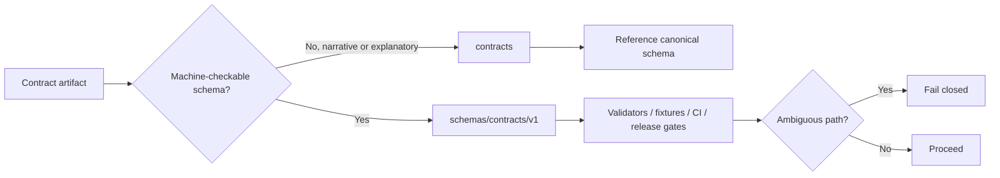

<!-- [KFM_META_BLOCK_V2]
doc_id: kfm://doc/NEEDS-VERIFICATION-ADR-0001
title: ADR-0001: Canonical Schema Home for Machine Contracts
type: standard
version: v1.2-draft
status: draft
owners: NEEDS-VERIFICATION
created: 2026-04-23
updated: 2026-05-02
policy_label: NEEDS-VERIFICATION
related: [../../README.md, ../README.md, ./README.md, ../../schemas/README.md, ../../contracts/README.md, ../../tests/README.md, ../../policy/README.md]
tags: [kfm, adr, schema-home, contracts, schemas, validation, governance, ci]
notes: [
  Revision of attached ADR-0001 baseline.
  Proposed decision: schemas/contracts/v1/ is the canonical machine-contract home after acceptance.
  This revision verified the uploaded Markdown and local evidence workspace only; target repository implementation depth remains UNKNOWN without a mounted checkout.
  Owners, policy label, related links, exact target path, validator behavior, CI execution, fixtures, and downstream consumers remain NEEDS VERIFICATION.
]
[/KFM_META_BLOCK_V2] -->

<a id="top"></a>

# ADR-0001: Canonical Schema Home for Machine Contracts

<p align="center">
  <strong>Proposes one canonical home for KFM machine-checkable contract truth, while keeping <code>contracts/</code> useful as a narrative companion surface.</strong>
</p>

<p align="center">
  
  
  
  
</p>

<p align="center">
  <a href="#executive-determination">Executive determination</a> ·
  <a href="#evidence-boundary-and-source-ledger">Evidence boundary</a> ·
  <a href="#proposed-decision">Decision</a> ·
  <a href="#what-belongs-where">What belongs where</a> ·
  <a href="#enforcement-model">Enforcement</a> ·
  <a href="#acceptance-criteria-for-status-upgrade">Acceptance</a> ·
  <a href="#rollback-or-supersession-path">Rollback</a>
</p>

> [!IMPORTANT]
> **Status:** PROPOSED ADR / draft. Do not mark this ADR `accepted` until steward ownership, repository inventory, schema consumers, validator behavior, fixture coverage, CI execution, documentation alignment, and rollback evidence are verified.
>
> **Target path:** `PATH_TBD_AFTER_REPO_INSPECTION`. Candidate lineage paths include `docs/adr/ADR-0001-schema-home.md` and `docs/adr/ADR-0001-canonical-schema-home.md`; use the mounted repository convention after inspection.

> [!NOTE]
> This document states a schema-home decision proposal. It does not prove that the target repository currently enforces the decision. Current implementation behavior requires direct evidence from the mounted repo, tests, workflows, validation artifacts, runtime logs, or generated proof objects.

---

## Executive determination

| Field | Determination |
|---|---|
| ADR status | `proposed` / `draft` |
| Proposed canonical machine-contract home | `schemas/contracts/v1/` |
| Human-facing companion surface | `contracts/` remains narrative and explanatory unless a later accepted ADR grants a specific machine-contract exception. |
| Evidence mode for this revision | `ATTACHED_MARKDOWN_CONFIRMED / LOCAL_REPO_UNAVAILABLE / TARGET_REPO_DEPTH_UNKNOWN` |
| Acceptance blockers | Owners, mounted-repo path inventory, schema consumers, validator enforcement, fixtures, CI execution, alias registry, and README alignment. |
| Fail-safe rule | Ambiguous machine-contract resolution must fail closed. |
| Primary risk addressed | Silent drift between machine schemas and narrative contract documents. |
| Primary tradeoff | Prioritizes governed validation clarity over short-term path convenience. |

**Bottom line:** KFM should have one canonical machine-contract root. Narrative contract documents can explain that truth, but they must not become a second machine-truth store.

<p align="right"><a href="#top">Back to top ↑</a></p>

---

## Evidence boundary and source ledger

This ADR is intentionally evidence-bounded. It may be committed as a proposed ADR after maintainers verify path placement, but it should not be treated as accepted implementation law until the acceptance criteria below are satisfied.

| Source | Status | Supports | Limits |
|---|---|---|---|
| Attached ADR-0001 Markdown baseline | CONFIRMED | Existing ADR content, proposed `schemas/contracts/v1/` decision, alias rules, enforcement sketch, acceptance criteria, rollback posture. | Does not prove target repo path, owners, CI, validator execution, or consumer behavior. |
| Current local workspace probe | CONFIRMED | `/mnt/data` contains uploaded artifacts and is not a Git checkout in this revision session. | Does not prove the public or private target repository lacks these files; it only bounds this session. |
| KFM doctrine corpus | CONFIRMED doctrine / LINEAGE for implementation | KFM evidence-first, map-first, time-aware, governed, fail-closed, cite-or-abstain, audit/rollback posture. | Prior reports and PDFs are not current mounted-repo proof. |
| Prior implementation-reference reports | LINEAGE / NEEDS VERIFICATION | Possible candidate repo paths and evidence that schema-home ambiguity has been discussed before. | Must be rechecked against the mounted repository before this ADR is accepted. |

### Truth posture used here

| Label | Meaning in this ADR |
|---|---|
| CONFIRMED | Verified from the attached Markdown, local workspace probe, or governing KFM doctrine visible to this revision. |
| PROPOSED | Decision, path, rule, validator, fixture, alias, or implementation plan not yet proven in the mounted repository. |
| UNKNOWN | Not verified because the target repository, workflows, tests, logs, runtime evidence, or proof artifacts were unavailable. |
| NEEDS VERIFICATION | A specific check must pass before acceptance or publication of the claim as implemented behavior. |
| CONFLICTED | Multiple paths or authority claims may be plausible and must not be silently normalized. |

<p align="right"><a href="#top">Back to top ↑</a></p>

---

## Why this ADR exists

KFM has a recurring authority problem: two nearby repository surfaces can be read as contract authority.

1. `schemas/contracts/v1/` is the proposed home for versioned, machine-readable schemas used by validators, policy gates, release checks, runtime envelopes, and fixtures.
2. `contracts/` is a companion contract lane for API, object, vocabulary, and boundary explanations.

Without a canonical-home decision, KFM risks drift exactly where it most needs inspectability.

| Drift pressure | What can go wrong |
|---|---|
| Duplicate definitions | The same object is described differently in `schemas/` and `contracts/`. |
| Ambiguous validator targets | Tools cannot tell which file governs pass/fail behavior. |
| Fixture mismatch | Valid/invalid examples validate against the wrong schema. |
| Release uncertainty | Promotion gates cannot prove which contract version was enforced. |
| Documentation laundering | Narrative docs are accidentally treated as implementation proof. |
| Backward-compatibility confusion | Consumers receive aliases without a tested migration path. |

This ADR resolves the authority split for **machine-checkable contract truth**. It does not eliminate narrative contracts. It gives them a safer role.

<p align="right"><a href="#top">Back to top ↑</a></p>

---

## Scope and non-goals

### In scope

- Canonical path for machine-checkable contract schemas.
- Authority split between schema truth and narrative contract documentation.
- Rules for compatibility aliases, mirrors, generated copies, and examples.
- Enforcement expectations for validators, fixtures, tests, documentation, and CI.
- Acceptance gates required before upgrading this ADR from `proposed` to `accepted`.

### Out of scope

- Rewriting all existing contract, schema, domain, API, or policy documentation.
- Deciding full schema versioning semantics beyond canonical home selection.
- Pinning a package manager, validator language, CI vendor, workflow filename, or test runner.
- Proving current repository implementation behavior without mounted repo evidence.
- Moving non-schema machine specs such as OpenAPI, Rego, release workflow YAML, STAC/DCAT records, or signed proof bundles without a separate repo-specific decision.

> [!WARNING]
> This ADR chooses the proposed canonical home for **machine-checkable contract schemas** only. It does not silently relocate every machine-readable artifact in KFM. Other machine-readable families require accepted homes, explicit cross-references, or follow-up ADRs.

<p align="right"><a href="#top">Back to top ↑</a></p>

---

## Definitions

| Term | Meaning in this ADR |
|---|---|
| Machine-checkable contract | A schema or contract artifact that a tool can enforce during validation, policy evaluation, promotion, release, runtime-envelope validation, or fixture checks. |
| Canonical schema home | The one path family treated as the source of truth for machine-contract schemas after this ADR is accepted. |
| Narrative contract surface | Human-facing documentation that explains API, object, vocabulary, or boundary semantics but is not itself the validation authority. |
| Compatibility alias | A temporary, explicit, tested mapping from an older or alternate path to a canonical schema. |
| Mirror | A copy or generated derivative of a canonical schema. Mirrors are not canonical unless a later accepted ADR says so. |
| Schema consumer | Any validator, test, fixture, workflow, script, API contract generator, release gate, policy rule, documentation tool, or runtime checker that resolves schema paths. |
| Fail closed | If a tool cannot determine the canonical contract unambiguously, it rejects the operation rather than guessing. |
| Acceptance evidence | Repo-grounded proof such as file inventory, test output, workflow output, validation report, fixture result, PR receipt, or generated proof object. |

<p align="right"><a href="#top">Back to top ↑</a></p>

---

## Proposed decision

**PROPOSED:** Canonical machine-contract home is `schemas/contracts/v1/`.

Every machine-checkable schema that gates validation, policy, promotion, release, runtime envelopes, source descriptors, proof objects, catalog objects, review records, correction notices, or rollback objects should live under:

```text
schemas/contracts/v1/
```

Future major schema generations should use a new versioned path, such as:

```text
schemas/contracts/v2/
```

A future `vN` path requires an accepted ADR or migration decision before it becomes canonical.

### Normative rules after acceptance

1. **Single machine authority:** `schemas/contracts/v1/` is the canonical home for machine-checkable schema contracts in this ADR generation.
2. **Narrative companion role:** `contracts/` may explain object semantics, API shapes, vocabulary, examples, and implementation guidance, but it must reference canonical schemas rather than duplicate them as normative truth.
3. **No silent substitutes:** A file under `contracts/` must not become a machine-truth substitute for a schema under `schemas/contracts/v1/`.
4. **Explicit aliases only:** Compatibility aliases are allowed only when documented, tested, dated, owned, and mapped to canonical schemas.
5. **No implicit mirrors:** Generated copies, examples, or mirrored schemas are non-canonical unless an accepted ADR says otherwise.
6. **Fail closed on ambiguity:** Validators, tests, generators, and release gates must reject ambiguous path resolution.
7. **Consumers inventory their target:** Any tool that resolves a contract path must identify the canonical schema path or approved alias.
8. **Documentation stays aligned:** READMEs and contract narratives must identify the canonical machine source and this ADR.
9. **Acceptance requires proof:** This ADR remains proposed until validator, fixture, CI, consumer-inventory, and documentation evidence is attached or linked.

### Decision diagram



<p align="right"><a href="#top">Back to top ↑</a></p>

---

## What belongs where

| Surface | Canonical for machine validation? | Role | Notes |
|---|---:|---|---|
| `schemas/contracts/v1/` | Yes, after acceptance | Versioned machine schemas used by validators, fixtures, policy gates, release checks, runtime checks, and schema consumers. | Proposed canonical root for this ADR generation. |
| `schemas/contracts/v2/` or future `vN` | Not yet | Future versioned schema homes. | Requires accepted ADR or migration decision. |
| `contracts/` | No | Human-facing contract narratives, API/object/vocabulary explanations, examples, and implementation guidance. | Must not silently duplicate schema truth. |
| `contracts/**/examples/` | No | Human-readable examples or test examples when explicitly marked. | Examples must declare the canonical schema they target. |
| `docs/adr/` or repo-equivalent ADR path | No | Decision records. | Exact path remains `NEEDS VERIFICATION`. |
| `tools/validators/` or repo-equivalent validator path | No | Enforcement implementation. | Proposed until repo conventions are verified. |
| `tests/fixtures/` or repo-equivalent fixture path | No | Valid/invalid fixtures proving behavior. | Proposed until repo conventions are verified. |
| `.github/workflows/` or repo-equivalent CI path | No | CI execution of validators/tests. | Proposed until workflow conventions are verified. |
| `policy/` | No | Policy rules and policy tests. | Policy input-object schemas should resolve to canonical schemas when machine-contract validation is required. |

### Special cases

| Case | Rule |
|---|---|
| OpenAPI files | OpenAPI may remain in an accepted API contract home if repo convention requires it, but payload schemas/components that gate KFM object validation should reference canonical schemas or be covered by a separate ADR. |
| Rego/OPA policy files | Policy files are policy artifacts, not JSON Schemas. Their input-object schemas should live under the canonical schema home when machine-contract validation is required. |
| Release workflow YAML | Workflow YAML is not a schema contract. If it validates KFM objects, it should point to canonical schemas. |
| Generated schemas | Generated schemas are derivatives unless the generation path is accepted as canonical, reproducible, and tested. |
| Example JSON/YAML | Examples can live near docs if clearly marked non-canonical and validated against canonical schemas. |
| Domain-specific schemas | Domain lanes should use `schemas/contracts/v1/<domain>/` unless mounted repo evidence or a later accepted ADR chooses a different substructure. |

<p align="right"><a href="#top">Back to top ↑</a></p>

---

## Contract authority ladder

When a schema-related claim conflicts, use this order:

1. **Current mounted repository evidence:** actual files, tests, workflows, validation outputs, and generated proof objects.
2. **Accepted ADRs and standards docs:** this ADR once accepted, plus successor ADRs.
3. **Canonical schema registry/index:** under `schemas/contracts/v1/`, if present and verified.
4. **Schema files under `schemas/contracts/v1/`.**
5. **Narrative contract docs under `contracts/`.**
6. **Examples, diagrams, notes, generated mirrors, exploratory packets, and prior reports.**

> [!CAUTION]
> Narrative docs can describe intended behavior, but current implementation behavior requires direct repository, test, workflow, runtime, or generated-artifact evidence.

<p align="right"><a href="#top">Back to top ↑</a></p>

---

## Consequences

### Positive consequences

- Validators get a single authoritative schema root.
- Fixture layout can be tied to one canonical path family.
- CI can check contract placement without guessing.
- Contract docs can explain semantics without becoming a competing schema store.
- Promotion and release gates become easier to audit.
- Schema drift becomes easier to detect and correct.
- Domain lanes can extend contracts without inventing path conventions each time.
- EvidenceBundle, DecisionEnvelope, RuntimeResponseEnvelope, ReleaseManifest, CatalogMatrix, receipt, proof, review, and rollback schemas can share one machine-contract convention.

### Costs and follow-up burden

- Existing docs that imply dual authority need updates.
- Any script resolving schemas from `contracts/` needs migration or explicit alias handling.
- Existing examples may need labels that distinguish examples from canonical schemas.
- Downstream consumers may need a tested compatibility period.
- CI must add negative-path tests, not only happy-path schema validation.
- Follow-up ADRs may be needed for OpenAPI, policy, release workflow, or generated-schema authority.

### Tradeoff accepted

This ADR favors **governable validation clarity** over short-term convenience. It may require small refactors, but it prevents long-term contract drift across KFM’s evidence, policy, release, UI, and governed-AI/runtime surfaces.

<p align="right"><a href="#top">Back to top ↑</a></p>

---

## Enforcement model

The enforcement model should be small, reviewable, and reversible.

### Required enforcement behaviors

| Gate | Required behavior |
|---|---|
| Path scan | Detect machine-schema candidates outside accepted canonical homes. |
| Contract resolution | Resolve each schema consumer to a canonical path or approved alias. |
| Alias validation | Reject alias entries without canonical target, status, purpose, owner/steward placeholder, review date, and tests. |
| Fixture validation | Validate positive fixtures and reject negative fixtures. |
| Documentation lint | Confirm `contracts/README.md`, `schemas/README.md`, and ADR index wording reference the authority split. |
| CI gate | Run path scan and fixture tests on pull requests before acceptance. |
| Release gate | Fail release candidates whose declared schema references are ambiguous, missing, or non-canonical without an approved alias. |

### Machine-schema detection signals

A file should be treated as a candidate machine schema when it contains schema-like markers such as:

- `$schema`,
- `$id`,
- `.schema.json`, `.schema.yaml`, or `.schema.yml` suffix,
- schema registry membership,
- direct validator references,
- policy, runtime, promotion, release, or fixture references,
- object-contract fields used by validation tooling.

A candidate outside `schemas/contracts/v1/` must either:

1. move to the canonical home,
2. be reclassified as a non-canonical example,
3. be covered by an explicit compatibility alias, or
4. be covered by an accepted exception or successor ADR.

### Illustrative validator sketch

```python
# Illustrative only — NEEDS VERIFICATION against mounted repo language, paths, and test style.
# Purpose: fail closed when machine-schema candidates appear outside accepted canonical homes.

from __future__ import annotations

CANONICAL_SCHEMA_ROOT = "schemas/contracts/v1/"
SCHEMA_MARKERS = ("$schema", "$id")
SCHEMA_SUFFIXES = (".schema.json", ".schema.yaml", ".schema.yml")
NON_CANONICAL_EXAMPLE_MARKER = "non_canonical_example"


def looks_like_machine_schema(path: str, text: str) -> bool:
    """Return True when a file looks like a machine-checkable schema candidate."""
    return path.endswith(SCHEMA_SUFFIXES) or any(marker in text for marker in SCHEMA_MARKERS)


def is_allowed_noncanonical_example(path: str, text: str) -> bool:
    """Allow examples only when they are explicitly marked non-canonical."""
    return "/examples/" in path and NON_CANONICAL_EXAMPLE_MARKER in text


def validate_schema_home(changed_files: dict[str, str]) -> list[str]:
    failures: list[str] = []

    for path, text in changed_files.items():
        if not looks_like_machine_schema(path, text):
            continue

        if path.startswith(CANONICAL_SCHEMA_ROOT):
            continue

        if is_allowed_noncanonical_example(path, text):
            continue

        failures.append(
            f"Machine-checkable schema candidate must live under "
            f"{CANONICAL_SCHEMA_ROOT} or use an approved alias: {path}"
        )

    return failures
```

> [!NOTE]
> The snippet is a design sketch, not an implementation claim. Use the repository’s actual language, validator framework, package manager, fixture format, and CI conventions after inspection.

<p align="right"><a href="#top">Back to top ↑</a></p>

---

## Test and fixture matrix

| Case | Example path | Expected outcome | Why |
|---|---|---:|---|
| Canonical schema | `schemas/contracts/v1/evidence/evidence_bundle.schema.json` | Pass | Correct home. |
| Machine schema in narrative lane | `contracts/evidence/evidence_bundle.schema.json` | Fail | Would create dual authority. |
| Narrative README | `contracts/evidence/README.md` | Pass | Human-facing explanation. |
| Marked non-canonical example | `contracts/evidence/examples/evidence_bundle.example.json` | Pass if marked and tested | Example, not machine truth. |
| Unmarked schema-like example | `contracts/evidence/examples/evidence_bundle.json` with `$schema` | Fail or require explicit marker | Avoid silent schema drift. |
| Alias with target and tests | `schema_aliases.yaml` maps old path to canonical path | Pass if target exists and tests cover it | Controlled migration. |
| Alias with missing target | Alias points to nonexistent canonical path | Fail | Broken compatibility path. |
| Ambiguous consumer | Tool can resolve both `contracts/` and `schemas/` | Fail | Fail-closed rule. |
| Future version without ADR | `schemas/contracts/v2/foo.schema.json` | Fail until approved | Prevent ungoverned major version. |
| Generated copy in canonical root | `schemas/contracts/v1/generated/foo.schema.json` | Fail unless generation is accepted | Prevent derivative pollution. |

<p align="right"><a href="#top">Back to top ↑</a></p>

---

## Compatibility alias rules

Aliases are allowed only to protect downstream users during a migration. They are not a way to preserve dual authority.

### Alias requirements

Every alias must declare:

- alias path or alias identifier,
- canonical target path or canonical `$id`,
- purpose,
- status,
- owner or steward placeholder,
- creation date,
- deprecation or review date,
- tests proving resolution behavior,
- rollback or supersession note.

### Alias states

| State | Meaning |
|---|---|
| `active` | Alias is temporarily supported and tested. |
| `deprecated` | Alias still resolves but consumers should migrate. |
| `blocked` | Alias is unsafe or ambiguous and must fail. |
| `retired` | Alias no longer resolves; historical record remains. |

### Illustrative alias record

```yaml
# Illustrative only — NEEDS VERIFICATION against mounted repo registry conventions.
aliases:
  - alias_path: contracts/evidence/evidence_bundle.schema.json
    canonical_path: schemas/contracts/v1/evidence/evidence_bundle.schema.json
    status: deprecated
    purpose: Temporary migration bridge for pre-ADR consumers.
    owner: NEEDS_VERIFICATION
    created: 2026-05-02
    review_by: NEEDS_VERIFICATION
    tests:
      - tests/fixtures/schema_home/aliases/evidence_bundle_alias_valid.json
      - tests/fixtures/schema_home/aliases/evidence_bundle_alias_missing_target_invalid.json
    rollback_note: Preserve alias record even after retirement; do not delete migration history.
```

<p align="right"><a href="#top">Back to top ↑</a></p>

---

## Implementation plan

This plan is **PROPOSED** until a mounted repository confirms actual file homes, package manager, validator style, workflow conventions, and existing schema consumers.

| Phase | Action | Output | Acceptance signal |
|---|---|---|---|
| 0 | Confirm owners and repo conventions. | Steward list and implementation evidence note. | Owners and schema/contract surfaces confirmed. |
| 1 | Inventory schema consumers. | Consumer list across tools, tests, workflows, docs, generators, policy rules, runtime validators, and release gates. | No hidden schema resolver remains unknown. |
| 2 | Add canonical-path validator. | Validator or policy rule that detects machine schemas outside canonical homes. | Valid/invalid fixture tests pass. |
| 3 | Add alias registry if needed. | Explicit alias map with tests and deprecation plan. | No implicit alias/mirror behavior. |
| 4 | Refactor consumers. | Tools/tests/workflows reference canonical schema path or approved alias. | Ambiguous path resolution fails. |
| 5 | Update documentation. | Root, ADR, `schemas/`, `contracts/`, `tests/`, and `policy/` docs align. | Docs point to this ADR and canonical split. |
| 6 | Wire CI. | Repo-native workflow runs validator and fixtures. | CI fails on invalid placement and missing aliases. |
| 7 | Attach evidence. | Validation report, PR receipt, or workflow output. | ADR can move toward `accepted`. |

### Proposed PR shape

**PR title:** `ADR-0001 schema-home authority split and canonical-path enforcement`

**Smallest safe PR contents:**

- this ADR update,
- docs wording updates,
- schema-home validator,
- valid/invalid fixtures,
- optional alias registry if consumers require it,
- CI hook or documented repo-native command,
- validation notes and rollback path.

> [!TIP]
> Keep the enforcing PR boring and small. The goal is not to redesign all KFM contracts; it is to make future contract growth governable.

<p align="right"><a href="#top">Back to top ↑</a></p>

---

## Acceptance criteria for status upgrade

ADR-0001 may move from `proposed` to `accepted` only when all items below are true.

- [ ] Owners/stewards for schema and contract surfaces are confirmed.
- [ ] Repository inventory confirms the actual canonical schema path and narrative contract path.
- [ ] Schema consumers in tools, tests, workflows, generators, docs, policy rules, runtime validators, and release gates are inventoried.
- [ ] Validator or policy rule rejects machine-schema additions outside canonical schema homes.
- [ ] Valid and invalid fixtures prove canonical-path enforcement.
- [ ] CI executes validator and fixture tests and fails closed.
- [ ] `schemas/README.md` or repo-equivalent schema docs name `schemas/contracts/v1/` as canonical.
- [ ] `contracts/README.md` or repo-equivalent contract docs name `contracts/` as narrative/non-canonical for machine validation.
- [ ] ADR index references this ADR and its current status.
- [ ] Any compatibility aliases are explicit, tested, dated, and reviewable.
- [ ] Any future `vN` schema path is blocked unless accepted through ADR or migration decision.
- [ ] Rollback/supersession path is documented and does not delete history.
- [ ] Validation evidence is attached or linked in the ADR notes, PR notes, or a repo-native receipt.

### Definition of done for the enforcing PR

- [ ] No unsupported implementation claims appear in this ADR.
- [ ] All placeholders are visible and reviewable.
- [ ] Validator output is captured in PR notes or a validation artifact.
- [ ] Negative-path tests exist for misplaced schemas and ambiguous aliases.
- [ ] Documentation updates land with behavior changes.
- [ ] Rollback plan is attached to the PR.

<p align="right"><a href="#top">Back to top ↑</a></p>

---

## Risks and mitigations

| Risk | Impact | Mitigation |
|---|---|---|
| Existing automation reads schemas from `contracts/`. | Refactor may break consumers. | Inventory consumers first; add explicit temporary aliases. |
| Examples are mistaken for schemas. | False validation authority or CI failure. | Require example markers and canonical-schema references. |
| OpenAPI or other specs are caught by an overbroad validator. | False positives. | Scope this ADR to schema contracts; add explicit exceptions or ADRs for other machine specs. |
| Generated files are placed in canonical root. | Derivatives can pollute source truth. | Allow only source-controlled canonical schemas unless generation is accepted and reproducible. |
| Future version path appears early. | Version drift before migration rules exist. | Block unapproved `vN` paths until ADR/migration acceptance. |
| Narrative docs drift from schemas. | Maintainers trust the wrong description. | Require docs to link canonical schema and update with schema changes. |
| Alias period never ends. | Dual authority returns through compatibility path. | Add review dates and alias state transitions. |
| Prior reports imply a different path. | Maintainers may normalize old scaffolds silently. | Treat prior reports as lineage and require mounted-repo evidence plus ADR reconciliation. |

<p align="right"><a href="#top">Back to top ↑</a></p>

---

## Documentation update requirements

When this ADR is implemented, update or verify the repo-equivalent of:

| Document | Required update |
|---|---|
| `README.md` | Link ADR-0001 where schema/contract authority is discussed. |
| `docs/adr/README.md` or ADR index | List ADR-0001 status and acceptance evidence. |
| `schemas/README.md` | State canonical machine-contract role and version subtree rules. |
| `contracts/README.md` | State narrative companion role and no-silent-machine-truth rule. |
| `tests/README.md` | Document valid/invalid schema-home fixture behavior. |
| `policy/README.md` | Note policy input schemas should resolve to canonical schema home when applicable. |
| Validator docs/runbook | Explain failure modes, alias behavior, and rollback. |

> [!NOTE]
> Paths are based on the ADR baseline and KFM documentation guidance. Verify exact repo paths before committing.

<p align="right"><a href="#top">Back to top ↑</a></p>

---

## Change and growth rules

### Adding a new schema

1. Place the schema under `schemas/contracts/v1/<family>/`.
2. Add required metadata such as `$schema`, `$id`, title, version, and family naming according to repo convention.
3. Add positive and negative fixtures.
4. Update schema registry/index if one exists.
5. Update narrative contract docs to reference the canonical schema.
6. Run canonical-path and schema validation.

### Adding a new schema family

1. Create or verify the family folder under `schemas/contracts/v1/`.
2. Document the family’s purpose in schema docs.
3. Add fixtures and validator coverage.
4. Add narrative explanation under `contracts/` only if maintainers need a human-facing contract guide.

### Adding a future major version

1. Draft a new ADR or migration decision.
2. Define compatibility rules between `v1` and `vN`.
3. Add migration fixtures.
4. Add alias/deprecation rules.
5. Block promotion until validator and CI behavior are proven.

### Deprecating a schema or alias

1. Preserve the historical record.
2. Mark status and replacement target.
3. Keep old receipts, proofs, releases, and review artifacts queryable where applicable.
4. Add correction or migration notes if public meaning changes.

<p align="right"><a href="#top">Back to top ↑</a></p>

---

## Rollback or supersession path

If this ADR proves incorrect or incomplete:

1. Create a superseding ADR with explicit rationale.
2. Preserve ADR-0001 as historical lineage; do not delete it.
3. Freeze, retire, or block unsafe aliases rather than silently repointing them.
4. Provide a compatibility map from old homes to new homes.
5. Run fixtures proving that no schema consumer resolves an ambiguous path.
6. Attach validation evidence to the superseding decision.
7. Update root/schema/contract/test/policy docs in the same change set.
8. Preserve receipts, validation reports, and migration notes as separate reviewable artifacts.

Rollback must protect KFM’s evidence chain. A rollback that hides prior schema authority is not acceptable.

<p align="right"><a href="#top">Back to top ↑</a></p>

---

## Open verification items

- Final owner/steward set for `schemas/` and `contracts/`.
- Exact ADR file path and ADR index convention.
- Exact canonical schema registry/index format, if any.
- Whether any automation currently treats `contracts/` as schema authority.
- Whether any downstream consumers require temporary aliases.
- Whether generated schemas exist and where they are allowed to land.
- Whether OpenAPI, policy, release, proof, or workflow machine specs require adjacent ADRs.
- Exact CI command and workflow location.
- Exact fixture path convention.
- Policy label for public visibility of this ADR.
- Whether candidate path `docs/adr/ADR-0001-schema-home.md` already exists and should be preserved.

<p align="right"><a href="#top">Back to top ↑</a></p>

---

## Alternatives considered

| Alternative | Decision | Reason |
|---|---|---|
| Canonicalize `contracts/` | Rejected for this ADR | Conflicts with the baseline’s schema concentration in `schemas/contracts/v1/` and increases drift risk. |
| Dual authority between `schemas/` and `contracts/` | Rejected | Guarantees drift risk and weakens validator/release clarity. |
| Keep status quo | Rejected | Leaves schema-home conflict unresolved and blocks reliable governance. |
| Allow implicit aliases | Rejected | Hides drift and lets consumers resolve stale or wrong schemas. |
| Treat every machine-readable file as a schema contract | Rejected | Over-broad; OpenAPI, Rego, workflow YAML, release manifests, catalogs, and proof bundles may need related but distinct homes. |
| Accept `schemas/contracts/v1/` immediately without enforcement evidence | Rejected | Would upgrade proposal to authority without proof. |

<p align="right"><a href="#top">Back to top ↑</a></p>

---

## Revision changelog

| Version | Date | Status | Summary |
|---|---|---|---|
| `v1` | 2026-04-23 | draft/proposed | Initial ADR established `schemas/contracts/v1/` as proposed canonical machine-contract home. |
| `v1.1-draft` | 2026-04-27 | draft/proposed | Expanded evidence boundary, definitions, enforcement model, test matrix, alias rules, acceptance criteria, documentation requirements, growth rules, and rollback path. |
| `v1.2-draft` | 2026-05-02 | draft/proposed | Tightened truth posture, added evidence ledger, clarified target-path uncertainty, strengthened acceptance evidence, preserved decision while preventing unsupported implementation claims. |

<details>
<summary>Appendix A — Proposed file inventory matrix</summary>

| Path | Status | Purpose | Truth role | Update trigger | Owner / authority | Lineage / supersession rule |
|---|---|---|---|---|---|---|
| `docs/adr/ADR-0001-schema-home.md` | LINEAGE / NEEDS VERIFICATION | Candidate ADR home if this is the mounted repo convention. | Decision record. | Schema-home or alias authority changes. | NEEDS VERIFICATION | Preserve existing path if present; avoid duplicate ADRs. |
| `docs/adr/ADR-0001-canonical-schema-home.md` | PROPOSED / NEEDS VERIFICATION | Alternate candidate ADR home from prior baseline. | Decision record. | Schema-home or alias authority changes. | NEEDS VERIFICATION | Use only if repo convention supports it. |
| `schemas/contracts/v1/` | PROPOSED canonical by this ADR | Machine-contract schema root. | Canonical machine truth after acceptance. | New schema, schema revision, accepted `vN` migration. | NEEDS VERIFICATION | Future `vN` requires ADR/migration decision. |
| `schemas/contracts/v1/**.schema.json` | PROPOSED canonical by this ADR | JSON Schema contracts. | Machine-checkable authority after acceptance. | Object contract changes. | NEEDS VERIFICATION | Preserve old versions or migration records. |
| `schemas/contracts/v1/schema_index.*` | PROPOSED | Optional schema registry/index. | Canonical index if accepted. | Schema added/retired. | NEEDS VERIFICATION | Must not contradict actual schemas. |
| `contracts/README.md` | PROPOSED / verify existing | Explain narrative contract role. | Human-facing companion. | Authority split or contract docs change. | NEEDS VERIFICATION | Must reference canonical schema home. |
| `contracts/**/README.md` | PROPOSED / verify existing | Object/API/vocabulary explanations. | Human-facing companion. | Schema or semantic doc changes. | NEEDS VERIFICATION | Must not duplicate schema truth as normative. |
| `contracts/**/examples/` | PROPOSED / verify existing | Examples for humans/tests. | Non-canonical examples. | Example or schema changes. | NEEDS VERIFICATION | Must declare target canonical schema. |
| `tools/validators/check_schema_home.*` | PROPOSED | Enforce canonical schema path. | Enforcement surface. | Schema-home rule changes. | NEEDS VERIFICATION | Roll back with ADR if rule changes. |
| `tests/fixtures/schema_home/valid/` | PROPOSED | Positive fixture cases. | Validation support. | Validator behavior changes. | NEEDS VERIFICATION | Preserve for non-regression. |
| `tests/fixtures/schema_home/invalid/` | PROPOSED | Negative fixture cases. | Validation support. | Validator behavior changes. | NEEDS VERIFICATION | Preserve for non-regression. |
| `.github/workflows/*schema*` | PROPOSED / NEEDS VERIFICATION | CI execution for validator/tests. | CI enforcement. | Workflow convention or gate changes. | NEEDS VERIFICATION | Preserve validation history. |
| `policy/README.md` | PROPOSED / verify existing | Document policy schema-input resolution. | Human-facing policy guidance. | Policy input contracts change. | NEEDS VERIFICATION | Align to canonical schema home. |

</details>

<details>
<summary>Appendix B — Full validation checklist</summary>

- [ ] Confirm mounted repository and branch state before implementation.
- [ ] Confirm exact ADR path.
- [ ] Confirm exact schema path exists or create it through accepted PR.
- [ ] Confirm exact `contracts/` role and README wording.
- [ ] Inventory schema consumers in tools, tests, workflows, docs, generators, policy gates, runtime checks, and release gates.
- [ ] Add canonical-path validator.
- [ ] Add fixtures for misplaced schema, valid canonical schema, narrative README, examples, aliases, missing alias target, future `vN` path, and generated-copy edge cases.
- [ ] Run validator locally using repo-native command.
- [ ] Wire validator into CI.
- [ ] Update documentation in the same PR.
- [ ] Attach validation output or receipt to PR notes.
- [ ] Resolve owner/steward placeholders.
- [ ] Upgrade ADR status only after all acceptance criteria pass.

</details>

<details>
<summary>Appendix C — Reviewer notes</summary>

Use this ADR to answer three review questions:

1. **Where does machine-contract truth live?** Under `schemas/contracts/v1/` for this ADR generation, after acceptance.
2. **Can `contracts/` contain useful contract material?** Yes, but as narrative/explanatory companion material, not silent machine truth.
3. **What happens when a tool is unsure?** It fails closed until the canonical path or approved alias is clear.

</details>

<p align="right"><a href="#top">Back to top ↑</a></p>
