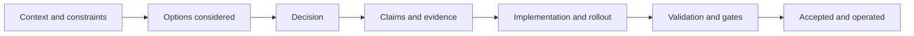

<!-- [KFM_META_BLOCK_V2]
doc_id: kfm://doc/adr-0001-template
title: ADR-0001 Template
type: adr
version: v1
status: published
owners: <team or names>
created: 2026-03-04
updated: 2026-03-04
policy_label: public
related:
  - ./README.md
  - ../governance/
  - ../standards/
tags:
  - kfm
  - adr
  - template
  - governance
notes:
  - Copy this file to create a new ADR; do not edit this template unless updating the global ADR standard.
  - Use cite-or-abstain: label claims as CONFIRMED / PROPOSED / UNKNOWN and attach evidence links or verification steps.
[/KFM_META_BLOCK_V2] -->

# ADR-0001: Template

> **Purpose:** A consistent, auditable Architecture Decision Record (ADR) format for Kansas Frontier Matrix (KFM).
>
> **Copy instructions:** Copy this file to `docs/adr/ADR-####-<short-slug>.md`, update the metadata, and fill in all sections.

---

## IMPACT

- **Status:** template
- **Owners:** `<team or names>`
- **Decision type:** `<architecture | data | security | governance | ops | ui | api | pipeline>`
- **Affected areas:** `<paths, services, datasets, pipelines>`
- **Breaking change:** `<yes | no | unknown>`
- **Rollout risk:** `<low | medium | high>`
- **Reversibility:** `<easy | moderate | hard>`
- **Tracking:** `<issue/ref, PR/ref, run_id/ref>`

**Quick links:** [How to use](#how-to-use-this-template) · [Decision](#decision) · [Claims](#claims-and-evidence) · [Checklist](#merge-and-promotion-checklist) · [Diagram](#diagram)

---

## How to use this template

1. Copy to `docs/adr/ADR-####-<short-slug>.md`.
2. Update **all** placeholders like `<this>`.
3. Keep it short but complete:
   - 1–2 paragraphs for context.
   - 1 paragraph for decision summary.
   - bullet pros/cons per option.
4. For every meaningful claim, use **CONFIRMED / PROPOSED / UNKNOWN** with evidence or verification steps.
5. Link the ADR from your PR description and (if present) an ADR index file.

---

## Record metadata

| Field | Value |
|---|---|
| ADR ID | `ADR-####` |
| Title | `<decision title>` |
| Status | `draft` \| `review` \| `accepted` \| `rejected` \| `deprecated` \| `superseded` |
| Date created | `YYYY-MM-DD` |
| Date accepted | `YYYY-MM-DD` (if accepted) |
| Authors | `<name(s)>` |
| Approvers | `<CODEOWNERS / stewards>` |
| Review cycle | `<none | quarterly | yearly>` |
| Supersedes | `<ADR-####>` (if any) |
| Superseded by | `<ADR-####>` (if any) |
| Related issues | `<#123, #456>` |
| Related PRs | `<PR link(s)>` |
| Related run receipts | `<path(s) or kfm:// refs>` |

---

## Context

### Problem statement

<What decision is needed, and why now? 1–3 sentences.>

### Background

<What led here? What user/system need is driving it?>

### Constraints and invariants

List the non-negotiables. Examples (replace with real constraints):

- **Invariant:** UI/clients must not access storage/DB directly; all access crosses governed APIs.
- **Invariant:** Core logic must not bypass the repository/adapter layer to reach storage.
- **Constraint:** Must remain compatible with `<versioned contract/schema>`.
- **Constraint:** Must be deterministic/reproducible for promoted artifacts.
- **Constraint:** Must fail-closed under policy enforcement.

### Assumptions

List assumptions explicitly (and validate if high risk):

- `<assumption>` — **UNKNOWN** until verified by `<test/measurement/interview>`.

### Out of scope

- `<explicitly excluded items>`

---

## Decision drivers

Why this decision is being made (prioritize):

1. `<driver 1: governance, safety, correctness, cost, velocity, reliability>`
2. `<driver 2>`
3. `<driver 3>`

---

## Options considered

> Include at least 2 options when practical (including “do nothing”).

### Option A — `<name>`

**Summary:** <1–2 sentences>

**Pros**
- <pro>
- <pro>

**Cons**
- <con>
- <con>

**Risks**
- <risk> (mitigation: <how>)

**Cost / effort**
- <eng effort, ops effort, migration effort>

---

### Option B — `<name>`

**Summary:** <1–2 sentences>

**Pros**
- <pro>

**Cons**
- <con>

**Risks**
- <risk> (mitigation: <how>)

**Cost / effort**
- <eng effort, ops effort, migration effort>

---

### Option C — “Do nothing” (baseline)

**Summary:** <what happens if we do not change anything>

**Pros**
- No change risk.

**Cons**
- <known pain continues>

---

## Decision

### Decision summary

<One paragraph: what we chose and why.>

### Decision details

- We will `<do X>` in `<component/path/service>`.
- We will **not** `<do Y>` because `<reason>`.
- The policy boundary will remain at `<where>`.

### Scope of change

**In scope**
- `<exact modules, paths, datasets, workflows>`

**Out of scope**
- `<items>`

---

## Claims and evidence

> **Rule:** Every meaningful claim must be labeled **CONFIRMED / PROPOSED / UNKNOWN**.
>
> - **CONFIRMED:** link evidence (benchmarks, receipts, validator outputs, policy test logs).
> - **PROPOSED:** link the plan and expected validation.
> - **UNKNOWN:** include the smallest steps to verify.

### Claims table

| Claim | Label | Evidence | Smallest verification steps |
|---|---|---|---|
| `<claim>` | `CONFIRMED` | `<links>` | n/a |
| `<claim>` | `PROPOSED` | `<plan/PR>` | `<tests/measurements>` |
| `<claim>` | `UNKNOWN` | none | `<steps>` |

### Evidence artifacts

List concrete evidence produced/required:

- Run receipt(s): `<path or ref>`
- Policy evaluation output(s): `<path or CI job link>`
- Contract/schema validation report(s): `<path>`
- Benchmark(s): `<path, dataset, date>`
- Security review/threat model: `<path or ticket>`
- Rollback proof / revert PR: `<path or PR link>`

---

## Governance, policy, and safety

### Policy label and access

- **Policy label:** `<public | restricted | sensitive | aggregate-only>`
- **Access expectations:** `<who can see/use it>`
- **Obligations:** `<generalize geometry, suppress export, add notice, retention limits>`

### Security considerations

- AuthN/AuthZ changes: `<none | described>`
- Secrets handling: `<no secrets in repo; rotation plan>`
- Threat model: `<required? link>`

### Data lifecycle and promotion impact

If this affects data or artifacts, specify:

- Lifecycle zone changes: `<RAW → WORK → PROCESSED → PUBLISHED>`
- Promotion gates impacted: `<schema/policy/QA/receipts/manifests>`
- Compatibility expectations: `<additive-only? semver?>`

---

## Implementation plan

### Plan of record

1. `<step>` (owner: `<name>`, done when: `<condition>`)
2. `<step>`
3. `<step>`

### Rollout strategy

- Feature flag / kill-switch: `<path/key>` (if applicable)
- Gradual rollout: `<canary, staged publish, shadow mode>`
- Backward compatibility: `<how ensured>`

### Rollback plan

- Trigger to rollback: `<SLO breach, policy failure, data regression>`
- Rollback steps:
  1. `<revert PR / disable flag / restore snapshot>`
  2. `<re-validate gates>`
- Rollback evidence: `<receipt / attestation / logs>`

---

## Testing and validation

### Required tests

- Unit tests: `<paths>`
- Integration tests: `<paths>`
- Contract tests (API/schema): `<paths>`
- Policy tests (OPA/Rego): `<paths>`
- Determinism/repro checks: `<how to re-run and compare outputs>`

### Acceptance criteria

- `<criterion>` (how measured: `<tool/log>`)

---

## Operational considerations

- SLOs impacted: `<latency, availability, freshness>`
- Observability: `<logs/metrics/traces>`
- Runbooks updated: `<paths>`
- Backup/restore: `<what changes>`
- On-call considerations: `<alerts, pages>`

---

## Consequences

### Positive

- <benefit>

### Negative

- <tradeoff>

### Neutral

- <things that change but are not clearly good/bad>

---

## Follow-ups

- [ ] `<task>` (owner: `<name>`, due: `YYYY-MM-DD`)
- [ ] `<task>`

---

## Merge and promotion checklist

> Check every box before requesting final review.

- [ ] ADR is complete (no critical placeholders remain).
- [ ] Claims are labeled CONFIRMED / PROPOSED / UNKNOWN with evidence or verification steps.
- [ ] Rollback plan exists and is realistic.
- [ ] Policy label is set and obligations are documented.
- [ ] Tests added/updated (unit + integration where applicable).
- [ ] Contract/schema validation passes.
- [ ] Policy checks (OPA/Rego) pass (fail-closed).
- [ ] Determinism/repro check documented (and executed if applicable).
- [ ] SBOM/attestation updated if build/runtime artifacts changed.
- [ ] Linked in PR description and (if present) ADR index.

---

## Diagram

---

## References

- <link to governing doc, spec, RFC, benchmark, PR, issue>
- <link to related ADRs>

---

### Back to top

↑ [Back to top](#adr-0001-template)
