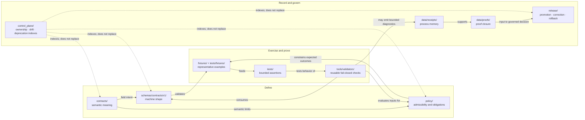

<!-- [KFM_META_BLOCK_V2]
doc_id: kfm://doc/adr-0002-contracts-vs-schemas-split
title: "ADR-0002 — Contracts vs Schemas Split"
type: adr
adr_id: ADR-0002
version: v1.2
status: draft
owners:
  - Architecture steward
  - Docs steward
reviewers_required:
  - Contract/Schema steward
  - Policy steward
  - QA/Validator steward
  - "at least one affected subsystem owner"
created: 2026-05-10
updated: 2026-07-23
policy_label: public
truth_posture: cite-or-abstain
responsibility_root: docs/
current_path: docs/adr/ADR-0002-contracts-vs-schemas-split.md
supersedes: []
superseded_by: null
evidence_snapshot:
  repository: bartytime4life/Kansas-Frontier-Matrix
  base_ref: main
  base_commit: f080146a2e668961c2cdcf6d319bbc85d0cbd2fd
  target_prior_blob: 49261392a9c786d84e1b0bf3a1d312a6397ddc62
  directory_rules_blob: 2affb080e6f0043867c64c7f06c1ca52030fbd55
  adr_index_blob: cf08fae322ac53426f7394d97897fdb942253049
  adr_0001_blob: 3c520ea8f2f8bcb3d478329a87d98b135ea335fd
  contracts_readme_blob: 6e05ba40fcc255e392210e56ef9519203aec6006
  schemas_readme_blob: 15c84131862c00584664dfafa497c012ae765d33
  policy_readme_blob: 09cd966ab188d5e831960869117522a98274cb7f
  fixtures_readme_blob: b096b0ed49c8e7d95ddb0d4c813d06ef40f1528d
  tests_fixtures_readme_blob: 2d0147e85eae86f687e85c5bea0d3e61f9c3a8f7
  tests_readme_blob: 55ac53c6c08f9a2b77149645d0a22de3ea680732
  validators_readme_blob: e35742288404a1eeb214f8269fbacb1429c0f86a
  schema_validation_workflow_blob: e6b26337aa1eea142b96560e041419f855c44d59
  object_family_register_blob: 930a9da30d5481f8d7ed5b7789d7846a30d3f4e1
  deprecation_register_blob: 1fb7219dcdb7a437e38fa8ca92ba34e29667d3fa
related:
  - docs/adr/README.md
  - docs/adr/INDEX.md
  - docs/adr/ADR-0001-schema-home--schemas-contracts-v1-is-canonical.md
  - docs/doctrine/directory-rules.md
  - docs/architecture/contract-schema-policy-split.md
  - contracts/README.md
  - schemas/README.md
  - policy/README.md
  - fixtures/README.md
  - tests/fixtures/README.md
  - tests/README.md
  - tools/validators/README.md
  - .github/workflows/schema-validation.yml
  - control_plane/object_family_register.yaml
  - control_plane/deprecation_register.yaml
  - docs/registers/DRIFT_REGISTER.md
  - docs/registers/VERIFICATION_BACKLOG.md
tags: [kfm, adr, governance, contracts, schemas, policy, fixtures, tests, validators, division-of-labor, no-parallel-authority]
notes:
  - "v1.2 is a same-path repository-grounded modernization; it does not accept the proposed decision or change runtime behavior."
  - "ADR-0002 numbering and target path are confirmed by docs/adr/INDEX.md; the source metadata remains draft and the effective decision status remains proposed."
  - "Current repository guidance already separates semantic contracts, machine schemas, policy, fixtures, tests, and validators, but full object-family crosswalk, policy execution, structured validation evidence, and compatibility retirement are not closed."
  - "The readiness rule is applicability-aware: every required surface must exist, while any not-applicable surface needs an explicit reviewed rationale rather than silent omission."
[/KFM_META_BLOCK_V2] -->

<a id="top"></a>

# ADR-0002 — Contracts vs Schemas Split

> **Proposed decision.** KFM will keep semantic meaning, machine shape, admissibility, examples, executable proof, and reusable validation in distinct responsibility roots. The surfaces must cross-reference one another, but none may silently become a parallel authority for another.

[](#1-context)
[](./INDEX.md)
[](#81-current-enforcement-snapshot)

> [!IMPORTANT]
> **Repository configuration is not reviewed decision authority.** The current repository already documents and partially exercises the split, but the canonical ADR index still records this decision with effective status `proposed`. This revision describes the observed implementation boundary without promoting the ADR to `accepted`.

**Quick navigation:** [Context](#1-context) · [Decision](#2-decision) · [Surfaces](#3-the-working-split--canonical-surfaces) · [Flow](#4-how-the-surfaces-interlock-diagram) · [Readiness](#5-the-minimum-coupling-rule--when-an-object-family-is-ready) · [Consequences](#6-consequences) · [Alternatives](#7-alternatives-considered) · [Validation](#8-compliance-enforcement-and-drift-tests) · [Compatibility](#9-compatibility-supersession-and-rollback) · [Open work](#10-open-questions-and-needs-verification) · [Evidence](#11-references-evidence-basis)

---

## 1. Context

### 1.1 Status and scope

| Field | Current value |
|---|---|
| **ADR ID** | `ADR-0002` — unique and confirmed in the canonical [`INDEX.md`](./INDEX.md) |
| **Source metadata** | `draft` |
| **Effective decision status** | `proposed` — not binding until the ADR and index carry reviewed `accepted` status |
| **Decision class** | Directory Rules §2.4: schema-home authority, parallel-home prevention, and invariant preservation |
| **Repository scope** | Repo-wide division of labor across semantic contracts, machine schemas, policy, fixtures, tests, validators, and emitted governance surfaces |
| **Paired decision** | [`ADR-0001`](./ADR-0001-schema-home--schemas-contracts-v1-is-canonical.md), which proposes `schemas/contracts/v1/` as the default machine-schema home |
| **Publication effect** | None. A Markdown change, passing test, validator result, commit, or merged PR does not publish data or accept this ADR. |

The KFM lifecycle remains:

```text
RAW -> WORK / QUARANTINE -> PROCESSED -> CATALOG / TRIPLET -> PUBLISHED
```

Promotion is a governed state transition, not a file move. Public clients, MapLibre, Evidence Drawer, Focus Mode, exports, and AI-assisted explanations must consume governed APIs and released artifacts rather than RAW, WORK, QUARANTINE, canonical internal stores, or unreviewed candidate objects.

### 1.2 The problem

KFM depends on trust-bearing object families such as `SourceDescriptor`, `EvidenceRef`, `EvidenceBundle`, `DecisionEnvelope`, `RuntimeResponseEnvelope`, `RunReceipt`, `ValidationReport`, `PolicyDecision`, `ReleaseManifest`, `PromotionDecision`, `RollbackCard`, and `CorrectionNotice`.

For any such family, reviewers must be able to distinguish six questions:

1. **Meaning** — What is this object and what do its fields promise?
2. **Shape** — Does an instance contain the required machine-checkable structure?
3. **Admissibility** — Is the instance allowed for the requested use, given policy, rights, sensitivity, source role, and release state?
4. **Examples** — Which valid, invalid, denied, abstaining, stale, correction, and rollback cases represent the boundary?
5. **Proof** — Do deterministic tests exercise those cases and their expected outcomes?
6. **Validation** — Is reusable checking available to CI, pipelines, review tooling, or promotion gates without hiding authority in test code?

When those responsibilities collapse, drift becomes difficult to detect:

> [!WARNING]
> **Failure modes this ADR prevents**
>
> - **Parallel authority:** two tracked paths may independently change the same machine schema or semantic contract.
> - **Schema-as-meaning:** JSON Schema becomes the only explanation of field intent, claim limits, or lifecycle semantics.
> - **Contract-as-validation:** prose is treated as executable enforcement without a schema, fixture, test, or validator.
> - **Policy-by-implication:** rights, sensitivity, or release behavior is inferred from field names, UI behavior, or fixture polarity.
> - **Test-only validator:** reusable gate logic exists only inside a test module and cannot be inspected or reused consistently.
> - **Instance-as-definition:** a receipt, proof, catalog record, or release object is mistaken for the normative definition of its family.

### 1.3 Current repository pressure

The repository has moved beyond a doctrine-only state:

- [`contracts/README.md`](../../contracts/README.md) defines `contracts/` as the semantic-contract root and points machine shape to `schemas/contracts/v1/`.
- [`schemas/README.md`](../../schemas/README.md) defines `schemas/` as the machine-shape root, records `schemas/contracts/v1/` as the configured v1 validation surface, and names compatibility debt that must not evolve independently.
- [`policy/README.md`](../../policy/README.md) assigns allow, deny, restrict, abstain, redaction, sensitivity, promotion, and public-release behavior to singular `policy/`.
- [`fixtures/README.md`](../../fixtures/README.md) and [`tests/fixtures/README.md`](../../tests/fixtures/README.md) document a two-home fixture split: cross-cutting reusable fixtures under `fixtures/`, test-local fixtures under `tests/fixtures/`.
- [`tests/README.md`](../../tests/README.md) defines `tests/` as the canonical enforceability root while warning that no complete repository-wide test suite is established.
- [`tools/validators/README.md`](../../tools/validators/README.md) defines reusable validators as fail-closed checkers, not schema, policy, evidence, release, or truth authority.
- [`schema-validation.yml`](../../.github/workflows/schema-validation.yml) coordinates machine schemas, six configured validators, valid/invalid fixtures, and schema/contract tests without emitting a validation report, receipt, proof, policy decision, or release decision.

This creates a governance gap: **the roots and a bounded validator path exist, but cross-family completeness, policy execution, structured validation evidence, compatibility retirement, and adoption review remain incomplete.**

### 1.4 In scope

- The canonical responsibility split among `contracts/`, `schemas/`, `policy/`, `fixtures/`, `tests/`, and `tools/validators/`.
- The relationship of receipts, proofs, releases, and control-plane registers to those definitions.
- Applicability-aware readiness requirements for trust-bearing object families.
- Cross-links, drift detection, migration, deprecation, and rollback expectations.
- Acceptance gates required before this proposed decision becomes binding.

### 1.5 Out of scope

- Field-level schema design or object-family semantics.
- Canonical JSON, RFC 8785/JCS, `spec_hash`, content addressing, or complete `$id` grammar.
- Selecting a policy engine or declaring that current policy rules execute in production.
- Declaring any object family released or public-safe.
- Migrating compatibility paths or modifying schemas, policy, fixtures, tests, validators, workflows, or runtime behavior in this documentation-only revision.
- Accepting ADR-0001, ADR-0002, or any other proposed ADR.

[Back to top](#top)

---

## 2. Decision

If accepted, ADR-0002 makes the following rule binding:

> **One responsibility, one canonical surface.** Every trust-bearing object family MUST keep semantic meaning, machine shape, admissibility, representative examples, executable proof, and reusable validation in their owning responsibility roots. The surfaces MUST cross-reference one another and MUST NOT evolve as parallel authority.

### 2.1 Four authority classes, six implementation surfaces

The six surfaces are not six equal kinds of authority. They form four responsibility classes:

| Responsibility class | Surface | Owns | Must not own |
|---|---|---|---|
| **Semantic authority** | `contracts/` | Human-readable object meaning, field intent, invariants, claim limits, lifecycle semantics, compatibility notes | Machine validation, policy decisions, emitted instances |
| **Machine-shape authority** | `schemas/` | JSON Schema, JSON-LD contexts, required fields, enums, types, references, versioned machine identity | Human semantic meaning, policy approval, evidence truth |
| **Admissibility authority** | `policy/` | Rights, sensitivity, access, source-role admissibility, obligations, allow/deny/restrict/hold/abstain behavior | Generic object meaning, machine-shape authority, release by implication |
| **Enforceability support** | `fixtures/` and `tests/fixtures/` | Representative valid, invalid, denied, abstaining, stale, correction, rollback, and expected-output examples | Production data, doctrine, policy, proof, or release authority |
| **Enforceability support** | `tests/` | Deterministic assertions over declared behavior and negative paths | Reusable validator implementation as a hidden test-only authority |
| **Enforceability support** | `tools/validators/` | Reusable, deterministic, fail-closed checkers and structured diagnostics | Schema, contract, policy, evidence, proof, release, or publication authority |

### 2.2 Supporting surfaces remain separate

| Surface | Owns | Relationship to this ADR |
|---|---|---|
| `data/receipts/` | Process memory for intake, transform, validation, policy, AI, or release-affecting runs | Stores emitted instances; never defines the object family |
| `data/proofs/` | Proof objects and evidence closure artifacts | Supports review and promotion; never replaces contracts, schemas, or policy |
| `release/` | Promotion decisions, release manifests, corrections, withdrawals, and rollback cards | Owns release state; validator success is only an input |
| `control_plane/` | Machine-readable object-family, deprecation, drift, and authority indexes | Indexes ownership and status; does not become a second definition home |
| `data/catalog/` and `data/triplets/` | Derived discovery and relation surfaces | Downstream carriers; never sovereign truth |

### 2.3 Canonical path rules

- Semantic contracts belong under `contracts/<family>/...` or `contracts/domains/<domain>/...`.
- Contract-backed machine schemas use the default logical route `schemas/contracts/v1/<family>/...` or `schemas/contracts/v1/domains/<domain>/...`, subject to ADR-0001 and reviewed migration decisions.
- Executable policy belongs under singular `policy/`; policy-object semantics may be documented under `contracts/policy/`, and policy-object machine shape under `schemas/contracts/v1/policy/`.
- Cross-cutting reusable fixtures belong under `fixtures/`; test-local fixtures belong under `tests/fixtures/`. A fixture must not be duplicated in both homes without a documented consumer and ownership split.
- Tests belong under `tests/`; reusable validators belong under `tools/validators/`.
- Compatibility guards MAY point to canonical homes, but they MUST be clearly classified, pointer-only or generated/frozen as appropriate, and prevented from independent evolution.

### 2.4 What this decision does not authorize

This ADR does not authorize:

- direct public use of schemas, contracts, fixtures, test output, validator output, receipts, or proofs;
- treating a green workflow as policy approval or release authorization;
- moving or deleting compatibility paths without migration and rollback evidence;
- accepting an object family merely because one or more surfaces exist;
- allowing AI-generated documentation or code to substitute for evidence, policy, review, release, correction, or rollback.

[Back to top](#top)

---

## 3. The working split — canonical surfaces

The table below is normative only after ADR acceptance. Until then, it is the proposed cross-root contract for PRs, README maintenance, drift entries, and migration planning.

| Surface | Canonical responsibility | Required linkage | Review burden |
|---|---|---|---|
| `contracts/` | Meaning, field intent, invariants, claim limits, lifecycle semantics, compatibility notes | Link to paired schema, applicable policy, fixtures/tests, migration, and release constraints | Contract/domain + docs review |
| `schemas/` | Machine shape, `$id`, `$ref`, required fields, enums, formats, composition | Link to semantic contract and representative fixtures; identify compatibility aliases | Schema + validator review |
| `policy/` | Rights, sensitivity, access, obligations, admissibility, finite policy outcomes | Link to policy input/output contracts, schemas, negative fixtures, and reason-code tests | Policy/steward/security review |
| `fixtures/` | Cross-cutting reusable examples | Name consumers and expected outcomes; remain synthetic/public-safe | Fixture + affected-domain review |
| `tests/fixtures/` | Test-local examples | Remain owned by a bounded test area; do not duplicate cross-cutting authority | Test/QA review |
| `tests/` | Executable assertions and negative-path proof | Cite contract/schema/policy/fixture inputs and state what a pass does not prove | QA/test + affected-owner review |
| `tools/validators/` | Reusable checkers and structured diagnostics | Consume canonical schemas/policy inputs; tested with valid and invalid fixtures | Validator/tooling + affected-owner review |
| `data/receipts/` | Emitted process memory | Reference run, inputs, tools, outcome, and governing versions | Ops/audit review |
| `data/proofs/` | Evidence/proof closure | Reference admissible evidence and validation/review state | Evidence/release review |
| `release/` | Promotion, release, correction, withdrawal, rollback | Consume proof and policy inputs; record decision and rollback target | Release/governance review |
| `control_plane/` | Indexes and deprecation/drift state | Point to canonical surfaces and migration status | Governance/docs review |

### 3.1 Clarifying corollaries

- A schema-valid object may still be semantically wrong, unsupported, source-role-confused, stale, rights-uncleared, sensitivity-restricted, policy-denied, unreleased, or unsafe for public use.
- A contract without a paired machine shape is documentation, not executable validation.
- A fixture is an example, not evidence, policy, proof, source authority, or release state.
- A test is bounded proof of an assertion, not a general validator registry or public truth surface.
- A validator may support promotion, but it cannot promote or publish.
- Receipts record that a process occurred; proofs support a claim or release; release records decide publication. Those families remain distinct.
- Cross-domain files use the lowest common responsibility root, never a new topic root.

### 3.2 Confirmed compatibility guard example

The repository currently contains [`contracts/schemas/policy/README.md`](../../contracts/schemas/policy/README.md), which explicitly classifies `contracts/schemas/policy/` as a compatibility guard. It points policy semantics to `contracts/policy/`, policy machine shape to `schemas/contracts/v1/policy/`, and executable policy to `policy/`. That is the required posture for a non-canonical path: pointer-only, visibly classified, and forbidden from independent schema evolution.

[Back to top](#top)

---

## 4. How the surfaces interlock (diagram)



> [!NOTE]
> The diagram describes responsibility flow. It does not claim every arrow is fully implemented, that current policy executes in production, that validators emit release-grade reports, or that any object family is ready for publication.

[Back to top](#top)

---

## 5. The minimum coupling rule — when an object family is *ready*

A trust-bearing object family is not ready merely because a contract or schema exists. Readiness is **applicability-aware**: every surface required by the object’s intended state and risk profile must exist, while any `not_applicable` result needs an explicit reviewed rationale.

> [!IMPORTANT]
> **Missing is not the same as not applicable.** A required surface that is absent fails closed. A surface may be marked not applicable only when the object-family register or equivalent reviewed record names the rationale, owner, allowed state, expiry/review date, and rollback or remediation path.

### 5.1 Readiness profiles

| Profile | Minimum required surfaces | Allowed state |
|---|---|---|
| **Semantic draft** | Contract, owner/review route, explicit exclusions, schema posture | Draft/internal documentation only |
| **Shape-ready** | Contract + canonical schema + valid and invalid fixtures + schema tests + cross-links | Internal machine exchange; not policy- or release-ready |
| **Policy-ready** | Shape-ready + applicable policy contracts/rules + negative fixtures + stable reason-code tests | Eligible for governed internal use; not public by default |
| **Validator-ready** | Shape/policy inputs + reusable validator where more than one consumer or gate uses the check + deterministic positive/negative tests | Eligible for pipeline/CI use within declared scope |
| **Release-candidate** | Required prior profiles + EvidenceRef/EvidenceBundle closure where claims depend on evidence + structured validation evidence + review + proof + release manifest + correction and rollback targets | Candidate only; promotion decision still required |
| **Published** | Accepted release decision and released public-safe artifact/API surface | Public or semi-public only within the release scope |

### 5.2 Readiness record

```yaml
# Illustrative readiness record; PROPOSED until a machine contract is accepted.
object_family: EvidenceBundle
status: validator_ready
surfaces:
  contract:
    required: true
    ref: contracts/evidence/evidence_bundle.md
  schema:
    required: true
    ref: schemas/contracts/v1/evidence/evidence_bundle.schema.json
  reusable_fixtures:
    required: true
    ref: fixtures/contracts/v1/evidence/evidence_bundle/
  tests:
    required: true
    ref: tests/contracts/
  policy:
    required: true
    ref: policy/
  validator:
    required: true
    ref: tools/validators/validate_evidence_bundle.py
  release_closure:
    required: false
    rationale: "This record describes validator readiness only, not release candidacy."
    review_by: YYYY-MM-DD
exceptions: []
```

### 5.3 Current configured aggregate families

The current schema-validation workflow confirms bounded coupling for six object families. It requires a schema, nonempty valid and invalid fixture lanes, configured validator files, expected-error evidence for invalid fixtures, and schema/contract tests.

| Object family | Schema | Shared fixture lane | Validator |
|---|---|---|---|
| `SourceDescriptor` | `schemas/contracts/v1/source/source_descriptor.schema.json` | `fixtures/contracts/v1/source/source_descriptor/` | `tools/validators/validate_source_descriptor.py` |
| `EvidenceRef` | `schemas/contracts/v1/evidence/evidence_ref.schema.json` | `fixtures/contracts/v1/evidence/evidence_ref/` | `tools/validators/validate_evidence_ref.py` |
| `EvidenceBundle` | `schemas/contracts/v1/evidence/evidence_bundle.schema.json` | `fixtures/contracts/v1/evidence/evidence_bundle/` | `tools/validators/validate_evidence_bundle.py` |
| `RuntimeResponseEnvelope` | `schemas/contracts/v1/runtime/runtime_response_envelope.schema.json` | `fixtures/contracts/v1/runtime/runtime_response_envelope/` | `tools/validators/validate_runtime_response_envelope.py` |
| `DecisionEnvelope` | `schemas/contracts/v1/runtime/decision_envelope.schema.json` | `fixtures/contracts/v1/runtime/decision_envelope/` | `tools/validators/validate_decision_envelope.py` |
| `RunReceipt` | `schemas/contracts/v1/runtime/run_receipt.schema.json` | `fixtures/contracts/v1/runtime/run_receipt/` | `tools/validators/validate_run_receipt.py` |

This workflow evidence proves only the configured machine-shape and fixture polarity checks for the tested revision. It does **not** prove complete semantic-contract crosswalks, policy evaluation, EvidenceBundle closure for every claim, structured ValidationReport emission, release readiness, or publication.

[Back to top](#top)

---

## 6. Consequences

### 6.1 Positive consequences

- **Authority remains visible.** A path communicates whether the file defines meaning, shape, admissibility, examples, tests, reusable validation, process memory, proof, or release state.
- **Drift becomes testable.** Parallel schema homes, fixture duplication, test-only validators, and hidden policy can be detected rather than normalized by convention.
- **Review burden becomes explicit.** Contract, schema, policy, QA, validation, and release changes route to the roles responsible for their consequences.
- **Negative states remain first-class.** Invalid, denied, abstaining, stale, correction, and rollback behavior can be represented and tested separately.
- **Migration remains reversible.** Compatibility guards, deprecation records, migration manifests, and rollback targets can be inspected independently of semantic contracts.
- **AI remains subordinate.** Generated prose or code cannot become meaning, shape, policy, proof, or release authority merely because it is fluent or passes one check.

### 6.2 Costs and tradeoffs

- Every trust-bearing object family requires multiple linked artifacts rather than one convenient file.
- Cross-links, ownership, status, fixture consumers, and compatibility state require maintenance.
- Existing compatibility lanes cannot be silently deleted or promoted; they need inventory, classification, and reversible migration.
- A partial object family may remain draft, internal, held, or quarantine-equivalent longer than a schema-first implementation would prefer.
- Acceptance requires policy, QA, schema, contract, and architecture review rather than a single maintainer’s implicit convention.

### 6.3 Operational impact

No runtime, schema, policy, fixture, validator, workflow, lifecycle, release, or publication behavior changes in this documentation-only revision. The immediate effect is a clearer proposed decision, a repository-grounded evidence snapshot, and explicit acceptance gates.

[Back to top](#top)

---

## 7. Alternatives considered

| Alternative | Summary | Why not selected |
|---|---|---|
| **A. `contracts/` owns everything** | Store prose, schemas, policy notes, fixtures, and validation guidance together. | Collapses meaning, shape, admissibility, and proof; makes executable parity and review burden ambiguous. |
| **B. `contracts/` + `schemas/` only** | Separate meaning and shape, but fold policy, fixtures, tests, and validators into those roots. | Loses explicit policy and enforceability homes; negative-state behavior becomes hidden or ad hoc. |
| **C. Schema is the sole specification** | Treat JSON Schema descriptions and annotations as enough semantic documentation. | Schema cannot carry the full domain meaning, evidence limits, rights, sensitivity, or lifecycle semantics. |
| **D. Tests are the specification** | Infer contracts and policy from passing tests and fixtures. | Tests cover bounded examples; they do not create portable semantic or policy authority. |
| **E. Per-domain authority roots** | Give each domain its own root-level contract/schema/policy/test tree. | Violates responsibility-root discipline and fragments shared object families and governance. |
| **F. Keep machine schemas under `contracts/`** | Treat `schemas/` as a mirror or export. | Conflicts with ADR-0001’s proposed default and creates parallel machine-shape authority. |
| **G. Docs-only explanation without an ADR** | Rely on the architecture explainer and root READMEs. | The split affects schema-home, parallel authority, review burden, migration, and acceptance; it requires ADR-level governance. |
| **H. Allow each object family to choose freely** | Let teams decide which surfaces to use. | Recreates ambient authority and prevents consistent readiness, review, and release gates. |

**Selected:** the four-class, six-surface split in [§2](#2-decision), paired with ADR-0001 for the default machine-schema home.

[Back to top](#top)

---

## 8. Compliance, enforcement, and drift tests

### 8.1 Current enforcement snapshot

| Surface | Confirmed repository state | Boundary |
|---|---|---|
| ADR inventory | ADR-0002 is uniquely indexed; effective status is `proposed`, source metadata `draft` | Inventory does not accept the decision |
| Contract root | Root README declares semantic meaning and excludes JSON Schema and executable validation | Does not prove complete contract coverage |
| Schema root | `schemas/contracts/v1/` is the configured v1 validation surface; compatibility lanes remain | Configuration does not settle ADR acceptance or migration closure |
| Policy root | Singular `policy/` exists and documents admissibility responsibilities | Current policy evaluator and production enforcement are not established by this ADR |
| Fixture split | Root `fixtures/` is cross-cutting; `tests/fixtures/` is test-local | Complete inventory and duplication analysis remain open |
| Tests | Mixed-maturity enforceability root; no canonical full-suite command is established | Passing bounded tests do not prove release or production parity |
| Validators | Parent validator root exists; the schema workflow configures six aggregate validators | Complete validator registry, structured report emission, and promotion integration remain open |
| Schema workflow | Parses schema JSON, checks Draft 2020-12, unique canonical `$id`, nonempty positive/negative fixture lanes, six validators, and schema/contract tests | Emits job output/summary only; no receipt, proof, PolicyDecision, ReleaseManifest, or publication |
| Object-family register | `control_plane/object_family_register.yaml` exists with `entries: []` | No complete object-family crosswalk or readiness state exists |
| Deprecation register | `control_plane/deprecation_register.yaml` exists with `entries: []` | Compatibility sunset and replacement mapping are not recorded there |
| Concurrency preflight | No open PR matching ADR-0002 or the contract/schema split was returned before this update | Supports the current path claim only; recheck before every write |

### 8.2 Acceptance gates

ADR-0002 SHOULD NOT move to `accepted` until equivalent evidence closes each gate:

| Gate | Required evidence | Fail-closed result when missing |
|---|---|---|
| **A — Inventory** | Recursive inventory of semantic contracts, machine schemas, policy families, shared/test-local fixtures, tests, validators, and compatibility guards | Hold acceptance |
| **B — Crosswalk** | Populated object-family register mapping each family to its required surfaces and status | Hold; no implicit readiness |
| **C — No parallel authority** | Validator rejects independently evolving machine schemas or semantic contracts in competing homes | DENY conflicting change |
| **D — Fixture and test polarity** | Required valid/invalid and applicable deny/abstain/correction/rollback fixtures with deterministic tests | Hold release-candidate state |
| **E — Policy applicability** | Each object family records whether policy is required, the governing policy refs, and stable outcomes/reason codes | DENY or ABSTAIN where policy is unresolved |
| **F — Validator contract** | Reusable gates live under `tools/validators/`, have positive/negative tests, and produce bounded structured diagnostics when used as promotion evidence | ERROR/HOLD on missing reusable check |
| **G — Compatibility closure** | Migration/deprecation records identify canonical target, freeze behavior, consumers, sunset/review date, and rollback | Prevent independent evolution |
| **H — Reviewed status transition** | Named reviewers approve; ADR and canonical index move together to `accepted`; acceptance evidence is recorded | Remain `proposed` |

### 8.3 Proposed checks

The following paths are **PROPOSED** until implemented or mapped to existing checks:

- `tests/governance/test_contract_schema_crosswalk.*`
- `tests/governance/test_no_parallel_schema_authority.*`
- `tests/governance/test_fixture_home_boundary.*`
- `tests/governance/test_object_family_readiness.*`
- `tests/policy/test_reason_code_stability.*`
- `tools/validators/validate_object_family_readiness.*`

A check name is not implementation proof. Before adding any new file, apply Directory Rules, inspect existing equivalents, and avoid parallel validator or test homes.

### 8.4 Validation commands

Run from repository root on the proposed revision:

```bash
python tools/validators/validate_adr_index.py
python -m pytest tests/validators/test_validate_adr_index.py -q --strict-config --strict-markers
python -m pytest -q tests/schemas tests/contracts
make schemas
```

These commands validate only their declared scope. They do not accept ADR-0002, evaluate all policy, establish complete object-family readiness, authorize release, or publish data.

### 8.5 Reviewer checklist

- [ ] Does each changed file live under the root that owns its primary responsibility?
- [ ] Does a new or changed trust-bearing object family have an applicability-aware readiness record?
- [ ] Is one machine schema home clearly canonical, with compatibility paths frozen or pointer-only?
- [ ] Are semantic meaning and machine shape linked without duplication?
- [ ] Are applicable policy outcomes and reason codes explicit?
- [ ] Are reusable fixtures separated from test-local fixtures?
- [ ] Does reusable validation live under `tools/validators/` with positive and negative tests?
- [ ] Does any release-affecting change have proof, review, correction, and rollback inputs?
- [ ] Are generated language, rendered output, receipts, proofs, catalogs, and release records kept in their own authority classes?

[Back to top](#top)

---

## 9. Compatibility, supersession, and rollback

### 9.1 Compatibility posture

Compatibility and transitional paths MAY remain only when their class is explicit and they cannot evolve independently.

| Path family | Proposed canonical target | Required posture |
|---|---|---|
| `contracts/<domain>/*.schema.json` or `contracts/schemas/...` | `schemas/contracts/v1/...` | Compatibility guard, frozen mirror, migration note, or deprecation; no active parallel schema authority |
| `schemas/<topic>/...` outside the reviewed v1 route | `schemas/contracts/v1/<family>/...` or reviewed domain lane | Classify as transitional/compatibility; map consumers before migration |
| `policies/` if introduced | `policy/` | Compatibility only; singular `policy/` remains the proposed canonical policy root |
| duplicated fixtures in `fixtures/` and `tests/fixtures/` | One documented shared or test-local owner | Remove duplication or document distinct consumers and lifecycle |
| validator logic embedded only in tests | `tools/validators/` | Extract when reused by CI, pipelines, review, or promotion gates |

### 9.2 Migration sequence

1. Inventory the candidate object family and all inbound/outbound consumers.
2. Identify the canonical contract, schema, policy, fixture, test, and validator paths.
3. Add or update the object-family register entry.
4. Classify duplicates as canonical, compatibility guard, generated mirror, transitional, deprecated, or conflicting.
5. Add migration and rollback records before moving or deleting files.
6. Freeze or generate compatibility surfaces; block independent edits.
7. Run positive and negative validation, including consumer compatibility.
8. Remove or retain compatibility paths only through reviewed migration evidence.

### 9.3 Supersession

If a later accepted ADR changes this split, it MUST:

- mark ADR-0002 `superseded` and link forward;
- name the surfaces being merged, split, or rehomed;
- update Directory Rules or identify why no doctrine change is needed;
- update the canonical ADR index and affected root READMEs;
- include migration, consumer, correction, and rollback consequences.

### 9.4 Rollback

If this documentation revision is incorrect, revert the single file to prior blob `49261392a9c786d84e1b0bf3a1d312a6397ddc62`.

If the architectural decision is later rejected or superseded after implementation work has begun:

1. Keep the ADR as decision history; do not delete it.
2. Restore the last accepted responsibility mapping through a successor ADR.
3. Revert or migrate affected contracts, schemas, policy, fixtures, tests, validators, registers, and workflow references using an explicit old-to-new map.
4. Preserve correction and rollback records for any released artifact whose identity or interpretation changed.
5. Invalidate or rebuild derived catalogs, triplets, tiles, indexes, and UI payloads only through governed release procedures.

[Back to top](#top)

---

## 10. Open questions and NEEDS VERIFICATION

The path and ADR number are no longer open questions. The unresolved work is implementation and acceptance:

- **NEEDS VERIFICATION — complete object-family inventory.** Which semantic contracts, schemas, policy families, fixtures, tests, and validators are tracked recursively, and where are duplicates or gaps?
- **NEEDS VERIFICATION — complete contract/schema crosswalk.** The object-family register exists but is empty.
- **NEEDS VERIFICATION — compatibility debt.** Which root-level or flat schema lanes are canonical candidates, pointer-only guards, generated mirrors, transitional paths, or conflicts?
- **NEEDS VERIFICATION — policy execution.** Which policy bundles and evaluators are actually exercised in CI or runtime, with stable finite outcomes and reason codes?
- **NEEDS VERIFICATION — validator reporting.** Which validators emit structured `ValidationReport`-like output, and which only print diagnostics or return process status?
- **NEEDS VERIFICATION — fixture duplication.** Where do `fixtures/` and `tests/fixtures/` contain overlapping content, and which home owns each shared example?
- **NEEDS VERIFICATION — full validation command.** No accepted repository-wide full-suite command is established.
- **NEEDS VERIFICATION — review enforcement.** CODEOWNERS routing exists, but independent stewardship, required approvals, and branch-rule coupling remain separate checks.
- **OPEN — readiness status vocabulary.** Decide whether to standardize `semantic_draft`, `shape_ready`, `policy_ready`, `validator_ready`, `release_candidate`, `published`, `superseded`, and `deprecated`, or another finite set.
- **OPEN — exception record contract.** Define the machine shape for a reviewed `not_applicable` or temporary-defer decision, including owner, rationale, allowed state, expiry, reviewer, remediation, and rollback.
- **OPEN — generated compatibility mirrors.** Decide which mirrors should be generated, which should be frozen, and which should be deleted after backlink analysis.
- **OPEN — acceptance ownership.** Confirm the role assignments and reviewers required to move the ADR from effective status `proposed` to `accepted`.

Track unresolved items in [`VERIFICATION_BACKLOG.md`](../registers/VERIFICATION_BACKLOG.md) and confirmed structural conflicts in [`DRIFT_REGISTER.md`](../registers/DRIFT_REGISTER.md).

[Back to top](#top)

---

## 11. References (evidence basis)

| Source | Status in this ADR | Supports | Does not prove |
|---|---|---|---|
| [`docs/adr/INDEX.md`](./INDEX.md) and [`README.md`](./README.md) | **CONFIRMED repository evidence** | Unique ADR-0002 assignment, effective status normalization, authoring and validation contract | Acceptance of ADR-0002 |
| [`ADR-0001`](./ADR-0001-schema-home--schemas-contracts-v1-is-canonical.md) | **CONFIRMED present; decision proposed** | Default machine-schema-home proposal and current configured schema evidence | Accepted schema-home authority or migration completion |
| [`directory-rules.md`](../doctrine/directory-rules.md) | **CONFIRMED doctrine** | Responsibility-root placement, schema/contract/policy/test split, ADR triggers, drift and migration discipline | Complete current implementation or acceptance review |
| [`contract-schema-policy-split.md`](../architecture/contract-schema-policy-split.md) | **CONFIRMED companion explainer; draft** | Four-layer architecture vocabulary and anti-collapse rationale | Acceptance or runtime enforcement |
| [`contracts/README.md`](../../contracts/README.md) | **CONFIRMED repository evidence** | Semantic-contract root and exclusions | Complete contract inventory or semantic/schema parity |
| [`schemas/README.md`](../../schemas/README.md) | **CONFIRMED repository evidence** | Machine-shape root, configured v1 surface, compatibility debt | Full schema registry, policy, release, or publication |
| [`policy/README.md`](../../policy/README.md) | **CONFIRMED repository evidence; status proposed** | Singular policy-root responsibility | Policy engine execution or production enforcement |
| [`fixtures/README.md`](../../fixtures/README.md) and [`tests/fixtures/README.md`](../../tests/fixtures/README.md) | **CONFIRMED repository evidence** | Shared-versus-test-local fixture split | Complete fixture inventory, consumer coverage, or no duplication |
| [`tests/README.md`](../../tests/README.md) | **CONFIRMED repository evidence** | Canonical enforceability root, bounded test surfaces, no full-suite claim | Production parity, release, or public safety |
| [`tools/validators/README.md`](../../tools/validators/README.md) | **CONFIRMED repository evidence** | Validator authority boundary and fail-closed posture | Complete executable inventory or structured report emission |
| [`schema-validation.yml`](../../.github/workflows/schema-validation.yml) | **CONFIRMED command-bearing workflow definition** | Six configured schema/fixture/validator families and schema/contract test commands | Current run success, policy approval, proof, release, or publication |
| [`object_family_register.yaml`](../../control_plane/object_family_register.yaml) | **CONFIRMED present; empty** | Intended machine-readable crosswalk home | Object-family readiness coverage |
| [`deprecation_register.yaml`](../../control_plane/deprecation_register.yaml) | **CONFIRMED present; empty** | Intended deprecation mapping home | Compatibility retirement or sunset evidence |
| Uploaded KFM Markdown Modernization prompt | **Authoring instruction** | Same-path, no-loss, evidence-grounded modernization and draft-PR discipline | Repository implementation facts |

[Back to top](#top)

---

<details>
<summary><strong>Appendix A — No-loss modernization ledger</strong></summary>

| Baseline element | v1.2 disposition |
|---|---|
| ADR identity, filename, H1, and stable section anchors | Preserved |
| Core contracts/schemas/policy/fixtures/tests/validators split | Preserved and clarified as four authority classes across six implementation surfaces |
| Supporting receipts/proofs/release/control-plane distinction | Preserved and strengthened |
| Surface-interlock Mermaid diagram | Preserved and updated to distinguish definitions, enforceability, and governed outputs |
| Minimum coupling/readiness gate | Preserved; made applicability-aware so `not_applicable` requires reviewed evidence rather than silent omission |
| Positive and negative consequences | Preserved and repository-grounded |
| Alternatives A–F | Preserved; two additional alternatives added for tests-as-specification and unrestricted per-family choice |
| Proposed drift tests and reviewer checklist | Preserved and expanded into acceptance gates with current enforcement evidence |
| Compatibility, supersession, versioning, and rollback | Preserved; target path/number uncertainty removed and exact prior blob recorded |
| Open questions | Rewritten to close confirmed path/number questions and retain real implementation gaps |
| References and related docs | Updated to exact current paths and repository-grounded evidence |
| Badge strip | Reduced to three evidence-backed orientation badges |

</details>

<details>
<summary><strong>Appendix B — Before/after upgrade matrix</strong></summary>

| Area | Before | After |
|---|---|---|
| Repository posture | Treated path, ADR slot, roots, and most enforcement as unknown | Confirms path, slot, roots, bounded workflow coverage, and unresolved gaps at a pinned snapshot |
| Decision model | Six surfaces described mostly as peer authorities | Four authority classes with six implementation surfaces and distinct emitted/governance surfaces |
| Readiness | All artifacts implied universally required | Applicability-aware profiles; missing required surfaces fail closed, N/A needs reviewed rationale |
| Validation | Mostly proposed workflow names | Separates confirmed schema workflow behavior from proposed crosswalk/readiness checks |
| Compatibility | Generic examples | Includes a confirmed `contracts/schemas/policy/` compatibility guard and empty deprecation register |
| Rollback | General ADR rollback | Exact document rollback blob plus architectural migration/release rollback consequences |
| Navigation and presentation | Large badge row, stale links, generic evidence warning | Compact badges, stable anchors, current links, repository evidence table, and clearer acceptance gates |

</details>

---

### Related docs

- [ADR operating contract](./README.md)
- [Canonical ADR index](./INDEX.md)
- [ADR-0001 — Schema Home](./ADR-0001-schema-home--schemas-contracts-v1-is-canonical.md)
- [Directory Rules](../doctrine/directory-rules.md)
- [Contract / Schema / Policy / Test split explainer](../architecture/contract-schema-policy-split.md)
- [Contracts root](../../contracts/README.md)
- [Schemas root](../../schemas/README.md)
- [Policy root](../../policy/README.md)
- [Fixtures root](../../fixtures/README.md)
- [Test-local fixtures](../../tests/fixtures/README.md)
- [Tests root](../../tests/README.md)
- [Validators root](../../tools/validators/README.md)
- [Schema validation workflow](../../.github/workflows/schema-validation.yml)
- [Object-family register](../../control_plane/object_family_register.yaml)
- [Deprecation register](../../control_plane/deprecation_register.yaml)
- [Drift register](../registers/DRIFT_REGISTER.md)
- [Verification backlog](../registers/VERIFICATION_BACKLOG.md)

---

_Last updated 2026-07-23 · Document status: `draft` · Effective decision status: `proposed` · ADR slot and path: confirmed · [Back to top](#top)_
