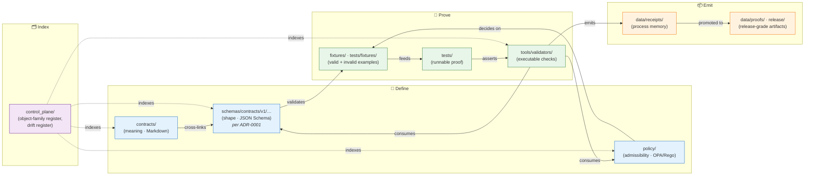

<!-- [KFM_META_BLOCK_V2]
doc_id: kfm://doc/adr-0002-contracts-vs-schemas-split
title: ADR-0002 — Contracts vs Schemas Split
type: standard
version: v1
status: draft
owners: <TODO: architecture steward + docs steward per Directory Rules §0>
created: 2026-05-10
updated: 2026-05-10
policy_label: public
related:
  - docs/adr/ADR-0001-schema-home.md
  - docs/doctrine/directory-rules.md
  - docs/architecture/contract-schema-policy-split.md
  - control_plane/object_family_register.yaml
tags: [kfm, adr, governance, contracts, schemas, policy, division-of-labor]
notes:
  - "Status `proposed`. Ratification requires architecture-steward sign-off per Directory Rules §2.4."
  - "ADR-0002 number assignment is PROPOSED. Verify no conflicting reservation in docs/adr/README.md before merge."
  - "All quoted repo paths are PROPOSED until verified against mounted-repo evidence (Directory Rules §0)."
[/KFM_META_BLOCK_V2] -->

# ADR-0002 — Contracts vs Schemas Split

> Codify the working division of labor between **`contracts/`** (object meaning), **`schemas/`** (machine-checkable shape), **`policy/`** (admissibility), and the supporting **fixtures / tests / validators** — so every trust-bearing object has a visible, six-surface split rather than one ambiguous home.

[](#1-context)
[](#)
[](./ADR-0001-schema-home.md)
[](#9-compatibility-supersession-and-rollback)
[](#)
[](#)

| Field | Value |
|---|---|
| **ADR id** | `ADR-0002` _(PROPOSED slot — see [§10](#10-open-questions-and-needs-verification))_ |
| **Status** | `proposed` |
| **Date** | 2026-05-10 |
| **Owners** | _TODO: architecture steward + docs steward_ |
| **Pairs with** | [`ADR-0001-schema-home.md`](./ADR-0001-schema-home.md) — the *home* of machine schemas |
| **Authority class** | Architecture decision — labor division across canonical roots |
| **Decision class (per Directory Rules §2.4)** | Items 3 (schema-home rule) and 5 (parallel-home creation) |
| **Supersedes** | _None._ |
| **Superseded by** | _None._ |

---

## 📑 Contents

1. [Context](#1-context)
2. [Decision](#2-decision)
3. [The working split — canonical surfaces](#3-the-working-split--canonical-surfaces)
4. [How the surfaces interlock (diagram)](#4-how-the-surfaces-interlock-diagram)
5. [The minimum coupling rule — when an object family is *ready*](#5-the-minimum-coupling-rule--when-an-object-family-is-ready)
6. [Consequences](#6-consequences)
7. [Alternatives considered](#7-alternatives-considered)
8. [Compliance, enforcement, and drift tests](#8-compliance-enforcement-and-drift-tests)
9. [Compatibility, supersession, and rollback](#9-compatibility-supersession-and-rollback)
10. [Open questions and NEEDS VERIFICATION](#10-open-questions-and-needs-verification)
11. [References (evidence basis)](#11-references-evidence-basis)
12. [Related docs](#related-docs)

---

## 1. Context

KFM is a governed, evidence-first knowledge system. Its core architectural commitments — cite-or-abstain truth posture, fail-safe policy defaults, the `RAW → WORK/QUARANTINE → PROCESSED → CATALOG/TRIPLET → PUBLISHED` lifecycle invariant, and a governed trust membrane — all depend on **trust-bearing objects** (`SourceDescriptor`, `EvidenceRef`, `EvidenceBundle`, `DecisionEnvelope`, `RuntimeResponseEnvelope`, `ReleaseManifest`, `RollbackCard`, `CorrectionNotice`, `ValidationReport`, run/AI/policy receipts, and domain objects) carrying a clean, inspectable shape. **CONFIRMED** doctrine.

That commitment cannot survive without an explicit division of labor across the canonical roots that hold those objects. KFM doctrine repeatedly identifies the failure mode bluntly:

> "KFM must not collapse contracts, schemas, policies, tests, fixtures, receipts, and proofs into one ambiguous surface."
> — *KFM Build Companion §5* **CONFIRMED**

[`ADR-0001`](./ADR-0001-schema-home.md) resolves a narrower question: **where** machine schemas live (the canonical home is `schemas/contracts/v1/<…>`). It does *not*, by itself, fully answer two adjacent questions:

1. **What each canonical root owns** — and what each root **MUST NOT silently own**.
2. **When a trust-bearing object family is considered “ready”** — the minimum set of artifacts that must coexist before a contract surface is admissible into the trust membrane.

Without an ADR codifying those two questions, three observed drift patterns recur across domain blueprints:

> [!WARNING]
> **Observed drift patterns** (Directory Rules §13.1, §13.5; doctrine corpus).
>
> - **Parallel authority.** Both `contracts/<domain>/<x>.schema.json` *and* `schemas/contracts/v1/domains/<domain>/<x>.schema.json` exist and diverge. **CONFIRMED** as a recurring pattern in domain blueprints (e.g., habitat, hydrology, archaeology dossiers reference `OR`-pathed schema homes pending ADR resolution).
> - **Schema-as-meaning.** A JSON Schema becomes the *only* documented record of what an object means, so semantic intent drifts silently when schemas evolve.
> - **Contract-as-validation.** A `contracts/` Markdown file is treated as if it enforced validation, with no `schemas/` counterpart and no validator coverage.

The corpus's response is a six-surface split, repeatedly stated across Directory Rules §6.3–6.5, the KFM Build Companion §5, and the canonical-root authority table (Directory Rules §5). This ADR ratifies that split as a binding architecture decision and pins its enforcement contract.

[↑ Back to top](#-contents)

---

## 2. Decision

KFM **MUST** maintain a six-surface working split for every trust-bearing object family. Each surface is canonical for one responsibility and **MUST NOT** silently absorb the responsibilities of any other.

| # | Surface | Owns | Authority |
|---|---|---|---|
| 1 | **`contracts/`** | Object **meaning**: field intent, invariants, lifecycle semantics, compatibility notes. Usually Markdown. | Canonical (per Directory Rules §5) |
| 2 | **`schemas/`** | Machine-checkable **shape**: type constraints, versioned `$id`, reusable fragments. Canonical home: **`schemas/contracts/v1/<…>`** per [ADR-0001](./ADR-0001-schema-home.md). | Canonical |
| 3 | **`policy/`** | **Admissibility** and release: rights, sensitivity, source-role admissibility, allow / deny / restrict / abstain behavior, release obligations. Singular form is canonical; `policies/` is a compatibility mirror only. | Canonical (singular) |
| 4 | **`tests/fixtures/`** *(and root `fixtures/` if present)* | Valid and invalid **examples** for schemas, policies, evidence closure, UI payloads, and release candidates. | Canonical |
| 5 | **`tests/`** | Runnable **proof** that contracts, schemas, policies, APIs, and tools behave as expected. | Canonical |
| 6 | **`tools/validators/`** | Executable **checks** that emit `ValidationReport` objects. | Canonical |

Three further canonical roots interact with the split and are governed by it:

| Surface | Owns | Relationship |
|---|---|---|
| **`data/receipts/`** | Process memory: intake, transform, run, AI, policy, validation, release receipts. | Receives emitted artifacts; **MUST NOT** carry normative definitions. |
| **`data/proofs/`** and **`release/`** | Release-grade proof packs, manifests, rollback cards, corrections. | Receives release-grade outputs; **MUST NOT** carry source-native raw data. |
| **`control_plane/`** | Machine-readable governance maps (object-family register, drift register, etc.) cross-linking the six surfaces. | Indexes the split; does not own definitions. |

> [!IMPORTANT]
> **Pair this decision with [ADR-0001](./ADR-0001-schema-home.md).**
> ADR-0001 resolves **where** machine schemas live (`schemas/contracts/v1/…`); ADR-0002 (this ADR) resolves **what each canonical root owns** and **how the surfaces are kept coupled but distinct**. Both are required for a stable, drift-resistant authority graph.

[↑ Back to top](#-contents)

---

## 3. The working split — canonical surfaces

The canonical division-of-labor table below is **normative**. It is the long form of the summary in [§2](#2-decision) and is the table to cite in PR descriptions, per-root READMEs, and review records when a placement is challenged. **CONFIRMED** against *KFM Build Companion §5.1* and *Directory Rules §6.3–6.5*.

| Surface | Owns (canonical responsibility) | Must **not** silently own | Review class |
|---|---|---|---|
| `contracts/` | Human-readable meaning, field intent, invariants, lifecycle semantics, compatibility notes. | Executable validation **as the only source of truth**. | Contract / domain review |
| `schemas/` | Machine-checkable shape, type constraints, versioned schema IDs, reusable fragments. | Semantic explanation **as the only meaning**. | Schema / validator review |
| `policy/` | Rights, sensitivity, source-role admissibility, release obligations, deny / abstain behavior. | General object semantics. | Policy / steward / security review |
| `fixtures/` *(or `tests/fixtures/`)* | Small valid / invalid examples for schemas, policies, evidence closure, UI payloads, release candidates. | Production data or doctrine. | Test review |
| `tests/` | Runnable proof that contracts, schemas, policies, APIs, and tools behave as expected. | Untestable claims or one-off scripts. | CI / test review |
| `tools/validators/` | Executable checks that produce `ValidationReport` objects. | Permanent storage of emitted proofs. | Developer / QA review |
| `data/receipts/` | Process memory: intake, transform, run, AI, policy, validation, release receipts. | Normative definitions. | Ops / audit review |
| `data/proofs/`, `release/` | Release-grade proof packs, manifests, rollback cards, corrections. | Source-native raw data. | Release / governance review |

### 3.1 Clarifying corollaries (CONFIRMED from doctrine)

- **`contracts/` files are usually Markdown.** Executable validation lives in `schemas/` (shape) and `policy/` (admissibility) and `tests/` (proof). — *Directory Rules §6.3*
- **`schemas/contracts/v1/…` is the default machine-schema home** per [ADR-0001](./ADR-0001-schema-home.md). Divergent definitions in both `schemas/` and `contracts/` are forbidden. — *Directory Rules §6.4, §13.1*
- **`policy/` (singular)** is canonical. If `policies/` exists, treat it as a compatibility mirror until ADR resolves. — *Directory Rules §6.5, §5 per-root authority table*
- **Cross-domain artifacts** (e.g., a habitat × fauna × hydrology validator) place under the lowest common responsibility root **without** a domain segment — `tools/validators/<topic>/…`, `schemas/contracts/v1/<topic>/…`, `docs/architecture/<topic>.md`. — *Directory Rules §12*

### 3.2 What this ADR does *not* decide

This ADR is deliberately narrow. It does **not** decide:

- The numbered version of any specific schema (handled per object family).
- The internal layout *within* `schemas/contracts/v1/…` (handled by [ADR-0001](./ADR-0001-schema-home.md) and per-family READMEs).
- Identity / hashing rules (PROPOSED for a separate ADR — see *KFM Pass 12 Part 2 §J.3* and *Build Companion §6*).
- Finite decision outcome shapes (PROPOSED separately; see [§10](#10-open-questions-and-needs-verification) for the numbering conflict).
- Where domain lanes physically live (handled by Directory Rules §12 — Domain Placement Law).

[↑ Back to top](#-contents)

---

## 4. How the surfaces interlock (diagram)



> [!NOTE]
> **Diagram status:** the responsibility flow is **CONFIRMED** from *Directory Rules §6.3–6.5*, *Build Companion §5.1*, and the canonical-root authority table (*Directory Rules §5*). The specific path labels are CONFIRMED as **doctrine**; their presence in any given mounted repo is **NEEDS VERIFICATION** until inspected.

[↑ Back to top](#-contents)

---

## 5. The minimum coupling rule — when an object family is *ready*

A trust-bearing object family is **not** ready when its schema exists alone. It is ready only when **all** the surfaces below coexist and cross-link. This is the *minimum coupling rule* — **CONFIRMED** from *KFM Build Companion §5.2*.

> [!IMPORTANT]
> **Definition — “object family ready.”** An object family `X` is admissible to the trust membrane only when *every* checkbox below is true.

```yaml
# Object-family readiness gate (illustrative; CONFIRMED shape from Build Companion §5.2)
contract_exists: true                       # contracts/<…>/X.md
schema_exists: true                         # schemas/contracts/v1/<…>/X.schema.json  (ADR-0001)
valid_fixture_exists: true                  # tests/fixtures/<…>/valid/X.json
invalid_fixture_exists: true                # tests/fixtures/<…>/invalid/X.json
validator_emits_validation_report: true     # tools/validators/<…>/X_validator.*
policy_or_closure_test_exists: true         # tests/policy/<…> or evidence-closure test
docs_link_contract_schema_fixture_policy: true   # cross-references resolve
rollback_or_supersession_note_exists: true  # migrations/, deprecation_register.yaml, or in-contract note
```

### 5.1 Readiness checklist (operational)

| # | Artifact | Required path family (PROPOSED) | Verifies |
|---|---|---|---|
| 1 | Semantic contract | `contracts/<family>/<X>.md` | Meaning, invariants, lifecycle semantics |
| 2 | Machine schema | `schemas/contracts/v1/<family>/<X>.schema.json` | Shape (per [ADR-0001](./ADR-0001-schema-home.md)) |
| 3 | Valid fixture | `tests/fixtures/<family>/valid/<x>.json` | Shape-positive example |
| 4 | Invalid fixture | `tests/fixtures/<family>/invalid/<x>.json` | Shape-negative example |
| 5 | Validator output | `tools/validators/<family>/<x>_validator.*` | Emits `ValidationReport` |
| 6 | Policy or closure test | `tests/policy/<…>` or `tests/evidence_closure/<…>` | Admissibility / EvidenceRef → EvidenceBundle |
| 7 | Cross-reference | Contract ↔ schema ↔ fixture ↔ policy links resolve | Drift surface |
| 8 | Rollback / supersession note | `migrations/<…>` or `control_plane/deprecation_register.yaml` | Reversibility |

> [!CAUTION]
> **The minimum coupling rule is a gate, not a guideline.** Promoting an object family to PROCESSED, CATALOG, or PUBLISHED before all eight surfaces exist creates an *uninspectable* trust object — the precise failure mode the trust membrane is designed to prevent. Treat partial coupling as `quarantine`-equivalent until closed.

[↑ Back to top](#-contents)

---

## 6. Consequences

### 6.1 Positive (intended)

- **Authority visibility.** Every file's location encodes its responsibility, lifecycle phase, and review class. Reviewers can name the rule (Directory Rules §16 path-validation checklist).
- **Drift becomes recognizable.** Two diverging homes for the same authority surface a Directory-Rules §13.1 anti-pattern, not a silent failure.
- **Validator parity.** A single canonical schema home plus a single validator surface keeps CI and integration tests aligned with declared meaning. The corpus warns explicitly that schema-home drift "can quietly fracture validator parity, break CI, and turn the contracts directory into an archeological record of design changes rather than a source of truth" (*KFM Components Pass 13 Part 2 §A.4* — **CONFIRMED**).
- **Reversibility.** With contracts and schemas separated, a schema can be re-versioned (additive v1 or breaking v2) without disturbing the contract's lifecycle semantics; a contract can be re-worded without changing field shapes.
- **AI subordination.** Generated text never substitutes for any of the six surfaces. `EvidenceBundle` outranks generated language (KFM core invariant — **CONFIRMED**).

### 6.2 Negative (accepted tradeoffs)

- **Authoring overhead.** Every trust-bearing object requires *six* surfaces, not one. The minimum coupling rule (§5) is intentionally strict.
- **Cross-link maintenance.** Contract ↔ schema ↔ fixture ↔ policy ↔ validator links must be kept current. A drift test ([§8](#8-compliance-enforcement-and-drift-tests)) is required.
- **Migration friction for legacy lineage.** Domain blueprints that drafted schemas under `contracts/<domain>/…` must migrate to `schemas/contracts/v1/<domain>/…` per [ADR-0001](./ADR-0001-schema-home.md). The hazards, habitat, archaeology, hydrology, geology, and roads-rail-trade dossiers each currently carry "PROPOSED / CONFLICTED path" entries pending migration (**CONFIRMED** as a doctrinal note across blueprints).
- **No fast path for scratch work.** Top-level surfaces like `schemas/occurrence_evidence/`, `schemas/soil_moisture/`, `schemas/hazards/` are explicitly identified as PROPOSED scratch surfaces and must consolidate into `schemas/contracts/v1/<family>/` once stable (*KFM Components Pass 13 Part 2 §A.4* — **CONFIRMED**). This ADR does not soften that requirement.

[↑ Back to top](#-contents)

---

## 7. Alternatives considered

| Alternative | Brief | Why rejected |
|---|---|---|
| **A. Single combined surface (`contracts/` only)** — schemas as inline blocks, policy as YAML inside contract Markdown. | One folder, one file per object. | Collapses meaning, shape, admissibility, and proof into one ambiguous surface. Directly contradicts the doctrinal "MUST NOT collapse" rule (*Build Companion §5*). Validator parity becomes impossible. |
| **B. Two-surface split (`contracts/` + `schemas/` only)** — fold policy and tests into contract docs and schema sub-paths. | Reduces surface count from six to two. | Loses canonical authority for admissibility (`policy/`) and proof (`tests/`, `tools/validators/`). Policy fixtures and policy tests have explicit canonical homes in Directory Rules §6.5; folding them into contracts erases that. |
| **C. Per-domain authority** — each domain owns its own `<domain>/contracts/`, `<domain>/schemas/`, `<domain>/policy/`. | Co-locates everything for a domain. | Violates Domain Placement Law (Directory Rules §12): "A domain MUST NOT become a root folder." Fragments lifecycle, prevents cross-domain object reuse (e.g., `SourceDescriptor`, `EvidenceBundle`). |
| **D. Schema authority in `contracts/` (inverse of ADR-0001)** — keep schemas under `contracts/<domain>/<x>.schema.json` and use `schemas/` only as a mirror. | Aligns with some current domain blueprint draft paths. | Conflicts with the visible repository pattern: the corpus notes that `scripts/validate_schemas.py` already treats `schemas/contracts/v1/…` as the required contract surface (*Pass 13 Part 2 §A.4* — **CONFIRMED**). Inverting this requires breaking validators, CI, and integration tests. |
| **E. Defer the decision** — let each domain choose its split. | Maximum flexibility. | Guarantees the exact drift this ADR exists to prevent. Multiple domain dossiers currently carry "PROPOSED / CONFLICTED path — dependency: ADR-0001 resolves schema home" entries; without explicit ratification of both the home (ADR-0001) and the labor split (this ADR), every domain lane fights the same battle. |

**Selected**: the six-surface split (this ADR), pairing with ADR-0001 on schema home.

[↑ Back to top](#-contents)

---

## 8. Compliance, enforcement, and drift tests

### 8.1 Drift tests (required, per *Build Companion §5.3*)

Three drift tests **MUST** exist before this ADR is moved from `proposed` to `accepted`. **PROPOSED** test homes shown.

| # | Test | Purpose | PROPOSED home |
|---|---|---|---|
| 1 | **Contract ↔ schema crosswalk** | Every schema has a contract link; every contract claiming machine validation points to a schema. | `tests/governance/test_contract_schema_crosswalk.*` |
| 2 | **Fixture coverage** | Every required field appears in ≥1 valid fixture; ≥1 invalid fixture tests a boundary or missing required field. | `tests/governance/test_fixture_coverage.*` |
| 3 | **Policy reason-code stability** | Every `DENY` / `ABSTAIN` path emits reason codes stable enough for UI display and audit. | `tests/policy/test_reason_code_stability.*` |

### 8.2 Reviewer checklist additions

The Directory Rules §16 path-validation checklist already requires "No parallel authority" and "Trust content placement." This ADR adds two reviewer questions:

- [ ] **Six-surface coupling.** Does this PR introduce or modify a trust-bearing object? If yes, do all eight readiness artifacts ([§5.1](#51-readiness-checklist-operational)) exist or have a tracked exception?
- [ ] **Owner labels by surface.** Does each surface's review class ([§3](#3-the-working-split--canonical-surfaces)) have a clear reviewer in CODEOWNERS?

### 8.3 CI gates (PROPOSED)

> [!NOTE]
> CI gate enforcement is **PROPOSED**. None of the workflows below is **CONFIRMED** present in any mounted repo; verify before claiming enforcement maturity.

- `kfm-governance.yml` — runs the three drift tests on every PR touching `contracts/`, `schemas/`, `policy/`, `tests/fixtures/`, or `tools/validators/`.
- `kfm-readiness.yml` — runs the minimum-coupling gate (§5) for any object family marked `release_state: ready` in `control_plane/object_family_register.yaml`.
- Migration discipline (Directory Rules §14) applies to any move that touches schema-home or contract-home paths.

[↑ Back to top](#-contents)

---

## 9. Compatibility, supersession, and rollback

### 9.1 Supersession of lineage

Domain blueprints that currently draft schemas under `contracts/<domain>/<x>.schema.json` are **lineage / CONFLICTED** per *Directory Rules §13.1* and **MUST** migrate to `schemas/contracts/v1/<domain>/<x>.schema.json` per [ADR-0001](./ADR-0001-schema-home.md) before any new schema lands. **MUST NOT** maintain divergent definitions in both homes.

### 9.2 Compatibility roots

The following are explicitly **compatibility-class** and **MUST NOT** evolve independently of their canonical home (Directory Rules §8):

| Compatibility root | Canonical home | Class default |
|---|---|---|
| `policies/` | `policy/` | `mirror` or `legacy` |
| `jsonschema/` | `schemas/contracts/v1/…` | `mirror` or `deprecated` |
| `schemas/<domain>/…` (top-level, e.g., `schemas/hazards/`, `schemas/soil_moisture/`) | `schemas/contracts/v1/<domain>/…` | `transitional` — consolidate per *Pass 13 Part 2 §A.4* |

### 9.3 Rollback

If this ADR is later superseded, the rollback discipline is:

1. The replacing ADR **MUST** carry `status: superseded` for ADR-0002 with a forward link.
2. Affected per-root READMEs (`contracts/README.md`, `schemas/README.md`, `policy/README.md`, `tests/README.md`, `fixtures/README.md`, `tools/validators/README.md`) **MUST** be updated in the same PR or in a tracked migration.
3. A rollback card under `release/rollback/governance/` records the transition.
4. The `control_plane/deprecation_register.yaml` carries a sunset date for any rule withdrawn by the supersession.

### 9.4 Versioning

This ADR is `v1`. Additive clarifications (new corollaries, new drift tests) MAY be made by minor edit. Material decision changes (adding or removing a canonical surface; promoting a compatibility root to canonical) require an explicit supersession ADR.

[↑ Back to top](#-contents)

---

## 10. Open questions and NEEDS VERIFICATION

> [!WARNING]
> The items below are **explicitly unresolved** by this ADR and **MUST** be tracked in `docs/registers/VERIFICATION_BACKLOG.md` and addressed via a follow-up ADR or reviewer sign-off before this ADR moves to `accepted`.

- **NEEDS VERIFICATION — ADR number reservation.** The slot `ADR-0002` is **PROPOSED**. The doctrine corpus also proposes "ADR-0002 finite decision outcomes" as a separate ADR candidate (*KFM Pass 12 Part 2 §J.3*). Confirm no conflicting reservation in `docs/adr/README.md` and the `control_plane/` ADR index before merge. If a clash exists, renumber this ADR and update all inbound references.
- **NEEDS VERIFICATION — mounted repo state.** All quoted paths (`contracts/`, `schemas/contracts/v1/…`, `policy/`, `tools/validators/`, `tests/fixtures/`, `control_plane/`) are **PROPOSED** until verified against `git ls-tree`-equivalent inspection. Per-root presence and per-root README conformance (Directory Rules §15) are not asserted here.
- **NEEDS VERIFICATION — `policies/` vs `policy/`.** Default is `policy/` (singular). Resolve which form is live by repo inspection (Directory Rules §18).
- **NEEDS VERIFICATION — CI workflows.** Drift-test and readiness workflows ([§8.3](#83-ci-gates-proposed)) are **PROPOSED** names; whether equivalent workflows exist or are run is not asserted.
- **OPEN — exception process.** Should a trust-bearing object family ever be admitted without all eight readiness artifacts (§5.1)? If yes, what review path is required? Propose handling via `control_plane/verification_backlog.yaml` entries with an `expires_on` field.
- **OPEN — scratch-surface acceptance window.** *Pass 13 Part 2 §A.4* notes that top-level `schemas/<domain>/` subtrees may be acceptable as transient scratch homes, "or whether they must move on first commit is unresolved." This ADR does not resolve that timing question; defer to a follow-up migration note.
- **OPEN — generated mirrors.** Whether `jsonschema/` is generated from `schemas/contracts/v1/…` by tooling (auto-mirror) or maintained by hand. Recommendation: auto-mirror with a build receipt under `data/receipts/build/`.

[↑ Back to top](#-contents)

---

## 11. References (evidence basis)

All references below are **CONFIRMED** in-session from supplied KFM doctrine. Specific repo paths quoted in those sources remain **PROPOSED** until verified against a mounted checkout.

| Source | Section | What it supports |
|---|---|---|
| `directory-rules.md` | §0 Status & Authority | Schema-home convention per ADR-0001; ADR template fields. |
| `directory-rules.md` | §2.4 | Changes requiring ADR — items 3 (schema-home), 5 (parallel-home creation). |
| `directory-rules.md` | §5 (per-root authority table) | Canonical class of `contracts/`, `schemas/`, `policy/`, `tests/`, `fixtures/`, `tools/`. |
| `directory-rules.md` | §6.3, §6.4, §6.5 | Canonical responsibility of `contracts/`, `schemas/`, `policy/`; the four-line clean split. |
| `directory-rules.md` | §8 | Compatibility roots; `policies/`, `jsonschema/`. |
| `directory-rules.md` | §12 | Domain Placement Law (no domain at root). |
| `directory-rules.md` | §13.1, §13.5 | Anti-pattern: parallel `contracts/` + `schemas/` authority; schema-mirror divergence. |
| `directory-rules.md` | §14, §15, §16 | Migration discipline; required README contract; reviewer path-validation checklist. |
| `directory-rules.md` | §18 | NEEDS VERIFICATION items for live machine-schema authority and `policies/` vs `policy/`. |
| `kfm_build_companion.pdf` | §5.1 | Division-of-labor canonical table (transcribed in [§3](#3-the-working-split--canonical-surfaces)). |
| `kfm_build_companion.pdf` | §5.2 | Minimum coupling rule and object-family-ready definition ([§5](#5-the-minimum-coupling-rule--when-an-object-family-is-ready)). |
| `kfm_build_companion.pdf` | §5.3 | Three drift tests ([§8.1](#81-drift-tests-required-per-build-companion-53)). |
| `kfm_build_companion.pdf` | §29 (backlog P0) | "Schema-home ADR — Resolve contracts-vs-schemas split and document versioned schema home" listed as P0 backlog item. |
| `KFM_Components_Pass_13_Part_2_…pdf` | §A.4 | Schema-home authority consolidation; validator parity argument; `validate_schemas.py` already treats `schemas/contracts/v1/…` as the required contract surface. |
| `KFM_Pass_12_Part_2_…pdf` | §J.3 | ADR template fields and the alternative ADR-0002 proposal (finite decision outcomes) — surfaced as a numbering conflict in [§10](#10-open-questions-and-needs-verification). |
| `KFM_Pass_15_Part_2_…pdf` | §6.3 CON | "Canonical Schemas and Contracts" — CON is the typed contract surface; not the validator (VAL), not the runtime envelope (RUN); reinforces labor division. |
| `KFM_Governed_AI_…pdf` | §12 | Contract/schema wave; reference paths for `SourceDescriptor`, `EvidenceRef`, `EvidenceBundle`, `DecisionEnvelope`, `RuntimeResponseEnvelope` under `schemas/contracts/v1/…`. |
| Domain blueprints (habitat, hydrology, archaeology, geology, transport, atmosphere, flora, soil, settlements/infrastructure) | "PROPOSED / CONFLICTED path" entries | Doctrinal note that domain schemas currently carry dual-path proposals pending ADR-0001 + ADR-0002 ratification. |

[↑ Back to top](#-contents)

---

<details>
<summary><strong>Appendix A — Anti-pattern reference (from Directory Rules §13)</strong></summary>

| Anti-pattern | Symptom | Fix |
|---|---|---|
| **`contracts/` and `schemas/` both claiming the same authority** | Both `contracts/<domain>/<x>.schema.json` and `schemas/contracts/v1/domains/<domain>/<x>.schema.json` exist and diverge. | Per [ADR-0001](./ADR-0001-schema-home.md), `schemas/contracts/v1/…` is canonical. Migrate, freeze old paths to mirror, add a drift entry. `contracts/` retains semantic Markdown only. |
| **Schema mirror divergence** | `schemas/` and `contracts/` (or `policies/` and `policy/`) evolve separately. | One canonical, the other a generated mirror or frozen legacy. ADR if unclear. |
| **Documentation as truth** | A `docs/` page is cited as the source of canonical decision. | Promote to ADR or `control_plane/` register. `docs/` explains; it doesn't decide alone. |
| **Test-only validator** | A validator lives only in a test file, not in `tools/validators/`. | Extract validator to `tools/`; tests call into it. |
| **Fixture sprawl** | Fixtures duplicated in `tests/fixtures/`, `fixtures/`, and per-domain folders. | Choose one authority; document the rule in both READMEs. |

</details>

<details>
<summary><strong>Appendix B — PROPOSED per-root README cross-links</strong></summary>

The following per-root README cross-references **SHOULD** exist once this ADR is `accepted`. All paths PROPOSED until verified.

- `contracts/README.md` → links to `schemas/README.md`, `policy/README.md`, this ADR, ADR-0001.
- `schemas/README.md` → links to `contracts/README.md`, `policy/README.md`, this ADR, ADR-0001.
- `policy/README.md` → links to `contracts/README.md`, `schemas/README.md`, `tests/policy/README.md`, this ADR.
- `tests/README.md` → links to `tests/fixtures/README.md`, `tools/validators/README.md`, this ADR.
- `fixtures/README.md` *(or `tests/fixtures/README.md`)* → links to `schemas/README.md`, `policy/README.md`, this ADR.
- `tools/validators/README.md` → links to `schemas/README.md`, `policy/README.md`, `tests/README.md`, this ADR.
- `control_plane/README.md` → links to all of the above; carries `object_family_register.yaml` index entries that reference this ADR.

</details>

---

### Related docs

- [`ADR-0001-schema-home.md`](./ADR-0001-schema-home.md) — paired ADR fixing the canonical machine-schema home.
- [`docs/doctrine/directory-rules.md`](../doctrine/directory-rules.md) — root-folder authority, §6.3–6.5 clean split, §13.1 anti-pattern. **PROPOSED canonical path**, per Directory Rules §0.
- [`docs/architecture/contract-schema-policy-split.md`](../architecture/contract-schema-policy-split.md) — architecture-level explainer of this same split (referenced from Directory Rules §0). **PROPOSED** — verify presence.
- `control_plane/object_family_register.yaml` — machine-readable index of object families, homes, schemas, fixtures, tests, status. **PROPOSED** — verify presence.
- `docs/registers/DRIFT_REGISTER.md` — open drift entries arising from the parallel-authority anti-pattern.
- `docs/registers/VERIFICATION_BACKLOG.md` — tracks the [§10](#10-open-questions-and-needs-verification) items.

---

_Last updated 2026-05-10 · Status: `proposed` · Pairs with [ADR-0001](./ADR-0001-schema-home.md) · [↑ Back to top](#adr-0002--contracts-vs-schemas-split)_
