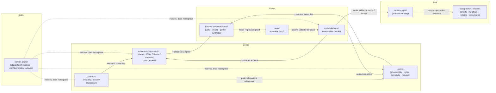

<!-- [KFM_META_BLOCK_V2]
doc_id: kfm://doc/adr-0002-contracts-vs-schemas-split
title: ADR-0002 — Contracts vs Schemas Split
type: standard
version: v1.1
status: draft
owners: <TODO: architecture steward + docs steward per Directory Rules §0>
created: 2026-05-10
updated: 2026-05-15
policy_label: public
related:
  - docs/adr/ADR-0001-schema-home.md
  - docs/doctrine/directory-rules.md
  - docs/architecture/contract-schema-policy-split.md
  - control_plane/object_family_register.yaml
  - docs/registers/DRIFT_REGISTER.md
  - docs/registers/VERIFICATION_BACKLOG.md
tags: [kfm, adr, governance, contracts, schemas, policy, division-of-labor]
notes:
  - "v1.1 tightens truth labels, ADR-number conflict handling, acceptance gates, and repo-unavailable boundaries."
  - "Status remains draft / proposed decision. Ratification requires architecture-steward sign-off and docs-steward review."
  - "ADR-0002 number assignment is CONFLICTED / NEEDS VERIFICATION until docs/adr/README.md and any control-plane ADR index are inspected."
  - "All quoted repo paths are PROPOSED until verified against mounted-repo evidence."
[/KFM_META_BLOCK_V2] -->

# ADR-0002 — Contracts vs Schemas Split

> Codify the working division of labor between **`contracts/`** meaning, **`schemas/`** machine-checkable shape, **`policy/`** admissibility, and the supporting **fixtures / tests / validators** — so every trust-bearing object family has a visible, reviewable split instead of one ambiguous authority home.

[](#1-context)
[](#2-decision)
[](#10-open-questions-and-needs-verification)
[](./ADR-0001-schema-home.md)
[](#)
[](#)

| Field | Value |
|---|---|
| **ADR id** | `ADR-0002` _(CONFLICTED / NEEDS VERIFICATION — see [§10](#10-open-questions-and-needs-verification))_ |
| **Document status** | `draft` |
| **Decision status** | `proposed` |
| **Created** | 2026-05-10 |
| **Updated** | 2026-05-15 |
| **Owners** | _TODO: architecture steward + docs steward_ |
| **Pairs with** | [`ADR-0001-schema-home.md`](./ADR-0001-schema-home.md) — the proposed *home* of machine schemas |
| **Authority class** | Architecture decision — labor division across canonical roots |
| **Decision class** | Directory Rules §2.4 items 3, 5, and 6: schema-home rule, parallel-home creation, invariant bending |
| **Supersedes** | _None._ |
| **Superseded by** | _None._ |
| **Repo implementation depth** | **UNKNOWN** — this ADR names proposed homes and gates; it does not prove mounted-repo file presence, tests, workflows, or runtime behavior. |

> [!IMPORTANT]
> **Evidence boundary for this revision**
>
> This ADR states KFM doctrine and a proposed architecture decision. It does **not** claim that the target repository currently contains the named files, validators, workflows, fixtures, or emitted proof objects. Treat path examples as **PROPOSED** until a mounted checkout, ADR index, tests, workflows, and emitted artifacts are inspected.

---

## 📑 Contents

1. [Context](#1-context)
2. [Decision](#2-decision)
3. [The working split — canonical surfaces](#3-the-working-split--canonical-surfaces)
4. [How the surfaces interlock (diagram)](#4-how-the-surfaces-interlock-diagram)
5. [The minimum coupling rule — when an object family is *ready*](#5-the-minimum-coupling-rule--when-an-object-family-is-ready)
6. [Consequences](#6-consequences)
7. [Alternatives considered](#7-alternatives-considered)
8. [Compliance, enforcement, and drift tests](#8-compliance-enforcement-and-drift-tests)
9. [Compatibility, supersession, and rollback](#9-compatibility-supersession-and-rollback)
10. [Open questions and NEEDS VERIFICATION](#10-open-questions-and-needs-verification)
11. [References (evidence basis)](#11-references-evidence-basis)
12. [Related docs](#related-docs)

---

## 1. Context

KFM is a governed, evidence-first, map-first, time-aware spatial knowledge and publication system. Its durable public unit of value is the **inspectable claim**: a statement whose evidence, source role, spatial and temporal scope, policy posture, review state, release state, and correction lineage can be inspected.

That posture depends on trust-bearing objects such as `SourceDescriptor`, `EvidenceRef`, `EvidenceBundle`, `DecisionEnvelope`, `RuntimeResponseEnvelope`, `RunReceipt`, `ValidationReport`, `ReleaseManifest`, `PromotionDecision`, `RollbackCard`, `CorrectionNotice`, and domain objects carrying a clean, reviewable shape.

The governing lifecycle remains:

```text
RAW -> WORK / QUARANTINE -> PROCESSED -> CATALOG / TRIPLET -> PUBLISHED
```

Publication is a governed state transition, not a file move. Public clients, the map shell, Focus Mode, Evidence Drawer payloads, exports, and AI-assisted explanations must consume governed APIs and released artifacts, not raw canonical stores or unpublished candidate data.

The split addressed here is narrow but foundational:

1. `contracts/` records what a trust-bearing object **means**.
2. `schemas/` records the machine-checkable **shape**.
3. `policy/` records what the system is allowed to **do** with the object.
4. Fixtures, tests, and validators prove the declared shape and admissibility rules are enforceable.

Without a codified split, three drift patterns recur:

> [!WARNING]
> **Drift patterns this ADR is designed to prevent**
>
> - **Parallel authority.** `contracts/<domain>/<x>.schema.json` and `schemas/contracts/v1/<domain>/<x>.schema.json` both claim machine-schema authority.
> - **Schema-as-meaning.** A JSON Schema becomes the only documented explanation of object semantics.
> - **Contract-as-validation.** A Markdown contract is treated as though it enforces validation without a schema, fixture, policy, and validator surface.

This ADR pairs with [`ADR-0001-schema-home.md`](./ADR-0001-schema-home.md). ADR-0001 resolves the default machine-schema home. This ADR resolves the **division of labor** across the roots that must remain coupled but distinct.

[↑ Back to top](#-contents)

---

## 2. Decision

If accepted, this ADR makes the following rule binding:

> **KFM MUST maintain a six-surface working split for every trust-bearing object family. Each surface is canonical for one responsibility and MUST NOT silently absorb the responsibility of another surface.**

| # | Surface | Owns | Does **not** own | Authority |
|---|---|---|---|---|
| 1 | **`contracts/`** | Human-readable object meaning: field intent, invariants, lifecycle semantics, compatibility notes. | Executable validation as the only source of truth. | Canonical semantic surface |
| 2 | **`schemas/`** | Machine-checkable shape: type constraints, versioned `$id`, reusable fragments. Default home: **`schemas/contracts/v1/<…>`** per ADR-0001. | Semantic explanation as the only meaning. | Canonical machine-shape surface |
| 3 | **`policy/`** | Admissibility and release behavior: rights, sensitivity, source-role admissibility, obligations, allow / deny / restrict / abstain decisions. | General object semantics. | Canonical policy surface |
| 4 | **`fixtures/`** or **`tests/fixtures/`** | Valid, invalid, golden, and synthetic examples for schemas, policies, evidence closure, UI payloads, release candidates, and regression tests. | Production data or doctrine. | Verification support |
| 5 | **`tests/`** | Runnable proof that contracts, schemas, policies, APIs, tools, and UI payloads behave as expected. | Untestable claims or one-off helper scripts as hidden validators. | Verification surface |
| 6 | **`tools/validators/`** | Executable checks that emit or support `ValidationReport`-like review evidence. | Permanent proof storage, schema authority, policy authority, or publication. | Validator surface |

Three supporting surfaces interact with the six-surface split but do not replace it:

| Surface | Owns | Relationship |
|---|---|---|
| **`data/receipts/`** | Process memory: intake, transform, run, AI, policy, validation, and release receipts. | Stores emitted instances; **MUST NOT** carry normative definitions. |
| **`data/proofs/`** and **`release/`** | Release-grade proof packs, manifests, rollback cards, correction notices, and release decisions. | Stores proof/release outputs; **MUST NOT** carry source-native raw data. |
| **`control_plane/`** | Machine-readable governance maps, indexes, deprecation registers, object-family registers, and drift registers. | Indexes authority and state; does not replace contracts, schemas, policy, tests, or validators. |

> [!IMPORTANT]
> **Pair this decision with ADR-0001.**
>
> ADR-0001 answers: “Where do machine schemas live?”  
> ADR-0002 answers: “What does each canonical surface own, and how do we prevent one surface from silently becoming another?”

[↑ Back to top](#-contents)

---

## 3. The working split — canonical surfaces

The division-of-labor table below is normative **if this ADR is accepted**. Until acceptance, it is the proposed table to cite in PRs, review notes, per-root README updates, and drift entries.

| Surface | Owns (canonical responsibility) | Must **not** silently own | Review class |
|---|---|---|---|
| `contracts/` | Human-readable meaning, field intent, invariants, lifecycle semantics, compatibility notes, semantic changelog. | Executable validation as sole authority. | Contract / domain review |
| `schemas/` | Machine-checkable shape, type constraints, enums, JSON-LD contexts, versioned schema IDs, reusable fragments. | Semantic explanation as sole authority. | Schema / validator review |
| `policy/` | Rights, sensitivity, source-role admissibility, release obligations, allow / deny / restrict / abstain behavior. | Generic object semantics. | Policy / steward / security review |
| `fixtures/` or `tests/fixtures/` | Valid, invalid, golden, and synthetic examples for schemas, policies, evidence closure, UI payloads, release candidates, and negative paths. | Production data or doctrine. | Test / fixture review |
| `tests/` | Runnable proof that contracts, schemas, policies, APIs, tools, release gates, and UI payloads behave as expected. | Hidden validators that never become reusable tools. | CI / test review |
| `tools/validators/` | Executable checks that return finite validation outcomes and structured reports. | Permanent storage of emitted proofs, schema ownership, policy ownership, or publication authority. | Developer / QA review |
| `data/receipts/` | Emitted process memory. | Normative definitions. | Ops / audit review |
| `data/proofs/`, `release/` | Proof packs, release manifests, rollback cards, correction notices, release decisions. | Source-native raw data or general object semantics. | Release / governance review |

### 3.1 Clarifying corollaries

- **`contracts/` files are usually Markdown.** They define object meaning, field intent, invariants, lifecycle semantics, and compatibility notes.
- **`schemas/contracts/v1/…` is the default machine-schema home.** A domain blueprint path such as `contracts/<domain>/<x>.schema.json` is **LINEAGE / CONFLICTED** until migrated or explicitly grandfathered by ADR.
- **`policy/` singular is canonical.** If `policies/` exists, treat it as a compatibility root until its class is documented.
- **Fixtures must not sprawl.** Root `fixtures/` and `tests/fixtures/` may coexist only if their READMEs state different responsibilities.
- **Data instances are not definitions.** `data/receipts/`, `data/proofs/`, catalogs, manifests, and releases may prove that a specific instance existed, but they do not define object meaning.
- **Docs explain decisions; ADRs and control-plane registers record durable decisions.** A general `docs/` explainer must not become a hidden source of canonical authority.
- **Cross-domain artifacts go under the lowest common responsibility root.** For example: `tools/validators/<topic>/…`, `schemas/contracts/v1/<topic>/…`, or `docs/architecture/<topic>.md`, not a new domain root.

### 3.2 What this ADR does *not* decide

This ADR does **not** decide:

- The numbered version of any specific schema.
- The internal layout below every `schemas/contracts/v1/…` subtree beyond the default machine-schema home.
- Deterministic identity and hashing rules for every object family.
- The full shape of finite runtime outcomes.
- Domain-lane object models.
- Whether any named file already exists in the mounted repository.
- Whether CI workflows, validators, or emitted proof objects already enforce the split.

[↑ Back to top](#-contents)

---

## 4. How the surfaces interlock (diagram)



> [!NOTE]
> **Diagram status:** responsibility flow is **CONFIRMED as doctrine** for this ADR revision. Specific file presence, exact validator commands, CI workflow names, and emitted artifact families remain **UNKNOWN / NEEDS VERIFICATION** until mounted-repo evidence is inspected.

[↑ Back to top](#-contents)

---

## 5. The minimum coupling rule — when an object family is *ready*

A trust-bearing object family is **not ready** when only its schema exists. It is ready only when the semantic, shape, admissibility, example, proof, validation, cross-reference, and rollback surfaces are present — or when a reviewed exception explicitly records why a surface is deferred.

> [!IMPORTANT]
> **Definition — “object family ready.”**
>
> An object family `X` is admissible to the trust membrane only when every required readiness item below exists, links resolve, and negative-path behavior is tested. A missing item defaults to **ABSTAIN**, **DENY**, **ERROR**, or `quarantine`-equivalent handling, depending on context.

```yaml
# Object-family readiness gate (illustrative; PROPOSED until implemented)
contract_exists: true                            # contracts/<family>/<X>.md
schema_exists: true                              # schemas/contracts/v1/<family>/<X>.schema.json
valid_fixture_exists: true                       # fixtures/.../valid/<x>.json or tests/fixtures/.../valid/<x>.json
invalid_fixture_exists: true                     # fixtures/.../invalid/<x>.json or tests/fixtures/.../invalid/<x>.json
validator_exists: true                           # tools/validators/<family>/<x>_validator.*
validator_emits_structured_report: true          # ValidationReport-like output or equivalent
policy_or_closure_test_exists: true              # policy/... test or EvidenceRef -> EvidenceBundle closure test
docs_link_contract_schema_fixture_policy: true   # cross-references resolve
rollback_or_supersession_note_exists: true       # migration note, deprecation register entry, or contract note
exception_record_exists_if_any_item_deferred: false
```

### 5.1 Readiness checklist (operational)

| # | Artifact | Required path family | Verifies |
|---|---|---|---|
| 1 | Semantic contract | `contracts/<family>/<X>.md` | Meaning, invariants, lifecycle semantics |
| 2 | Machine schema | `schemas/contracts/v1/<family>/<X>.schema.json` | Shape and machine constraints |
| 3 | Valid fixture | `fixtures/<family>/valid/<x>.json` or `tests/fixtures/<family>/valid/<x>.json` | Shape-positive example |
| 4 | Invalid fixture | `fixtures/<family>/invalid/<x>.json` or `tests/fixtures/<family>/invalid/<x>.json` | Shape-negative or policy-negative example |
| 5 | Validator | `tools/validators/<family>/<x>_validator.*` | Reusable executable validation |
| 6 | Policy or closure test | `policy/<…>` + tests, or `tests/evidence_closure/<…>` | Admissibility / EvidenceRef → EvidenceBundle behavior |
| 7 | Cross-reference | Contract ↔ schema ↔ fixture ↔ policy ↔ validator links resolve | Drift visibility |
| 8 | Rollback / supersession note | `migrations/<…>`, `control_plane/deprecation_register.yaml`, or in-contract note | Reversibility |

> [!CAUTION]
> **The minimum coupling rule is a gate, not a suggestion.**
>
> Promoting an object family to `PROCESSED`, `CATALOG`, `TRIPLET`, or `PUBLISHED` before the readiness items exist creates an uninspectable trust object — the failure mode this ADR is designed to prevent.

[↑ Back to top](#-contents)

---

## 6. Consequences

### 6.1 Positive (intended)

- **Authority visibility.** Each file’s location encodes its responsibility and review burden.
- **Drift becomes reviewable.** Divergent homes become `CONFLICTED` entries, not silent duplication.
- **Validator parity.** Schemas, fixtures, validators, and tests remain linked, so executable validation does not drift from semantic intent.
- **Policy visibility.** Rights, sensitivity, release, and admissibility logic remain inspectable in `policy/` instead of being hidden in contract prose or UI code.
- **Reversibility.** Schema migrations, deprecations, and compatibility mirrors can be reviewed and rolled back without rewriting semantic contracts.
- **AI subordination.** Generated language, summaries, embeddings, and Focus Mode answers never replace contracts, schemas, policy, evidence, review, release, or correction state.

### 6.2 Negative (accepted tradeoffs)

- **Authoring overhead.** Every trust-bearing object family needs more than one file.
- **Cross-link maintenance.** Contract ↔ schema ↔ fixture ↔ policy ↔ validator links must be kept current.
- **Migration friction.** Prior domain blueprints that drafted schemas in `contracts/<domain>/…` need migration notes or compatibility treatment.
- **No shortcut for public release.** Object families with partial coupling remain draft, quarantine-equivalent, or internal-only until readiness closes.
- **ADR coordination.** Schema-home, fixture-home, compatibility-root, and proof/release-home changes may require ADR updates, not ad hoc edits.

[↑ Back to top](#-contents)

---

## 7. Alternatives considered

| Alternative | Brief | Why rejected |
|---|---|---|
| **A. Single combined surface (`contracts/` only)** | Put prose, schema blocks, policy notes, fixtures, and validation notes in one contract file. | Collapses meaning, shape, admissibility, and proof into one ambiguous surface. Validation parity and policy review become fragile. |
| **B. Two-surface split (`contracts/` + `schemas/` only)** | Keep meaning and shape separate, but fold policy/tests/fixtures/validators into those two roots. | Loses canonical homes for admissibility and proof. `policy/`, `tests/`, `fixtures/`, and `tools/validators/` carry distinct review burdens. |
| **C. Per-domain authority roots** | Each domain owns its own root-level `hydrology/contracts/`, `hydrology/schemas/`, `hydrology/policy/`, etc. | Violates responsibility-root discipline and fragments the lifecycle. Domain names belong inside responsibility roots, not as repo roots. |
| **D. Machine-schema authority in `contracts/`** | Keep `*.schema.json` files under `contracts/<domain>/…` and treat `schemas/` as a mirror. | Conflicts with the proposed ADR-0001 default and the current Directory Rules schema-home convention. Keeping both homes active creates parallel authority. |
| **E. Docs-only guidance** | Explain the split in `docs/architecture/…` without an ADR. | Documentation can explain, but this decision changes schema-home and parallel-authority behavior. It needs ADR-level review and rollback discipline. |
| **F. Defer the decision to each domain lane** | Let hydrology, habitat, fauna, archaeology, people/DNA/land, etc. each choose its own split. | Guarantees inconsistent review burdens and makes shared objects such as `EvidenceBundle`, `RunReceipt`, and `ReleaseManifest` harder to reuse. |

**Selected:** the six-surface split in [§2](#2-decision), paired with ADR-0001 on schema home.

[↑ Back to top](#-contents)

---

## 8. Compliance, enforcement, and drift tests

### 8.1 Drift tests required before acceptance

This ADR SHOULD NOT move from `proposed` to `accepted` until the following tests or equivalent checks exist.

| # | Test | Purpose | PROPOSED home |
|---|---|---|---|
| 1 | **Contract ↔ schema crosswalk** | Every schema has a semantic contract link; every contract claiming machine validation points to one canonical schema. | `tests/governance/test_contract_schema_crosswalk.*` |
| 2 | **Fixture coverage** | Every required field appears in at least one valid fixture; at least one invalid fixture tests missing/invalid required fields. | `tests/governance/test_fixture_coverage.*` |
| 3 | **Policy reason-code stability** | `DENY`, `ABSTAIN`, `ERROR`, and restriction paths emit stable reason codes for UI, audit, and review. | `tests/policy/test_reason_code_stability.*` |
| 4 | **No parallel schema authority** | Rejects active divergent machine schemas in both `contracts/` and `schemas/contracts/v1/…`. | `tests/governance/test_no_parallel_schema_authority.*` |
| 5 | **Validator home check** | Reusable validators live under `tools/validators/`, not only in tests. | `tests/governance/test_validator_home.*` |

### 8.2 Reviewer checklist additions

Add the following questions to PR review templates or governance review notes:

- [ ] **Responsibility root:** Does every new or changed file live under the root that owns its responsibility?
- [ ] **Six-surface coupling:** Does this PR introduce or modify a trust-bearing object family? If yes, are the readiness artifacts in [§5.1](#51-readiness-checklist-operational) present or explicitly deferred?
- [ ] **No parallel authority:** Does any new `*.schema.json` create a second active schema home?
- [ ] **Fixture home clarity:** Are fixtures under one documented home or clearly split by README?
- [ ] **Policy visibility:** Are rights, sensitivity, admissibility, release, and abstain/deny behavior expressed in `policy/` or policy-linked tests?
- [ ] **Rollback target:** If the change affects a trust-bearing object, is there a rollback, migration, or supersession note?

### 8.3 CI gates (PROPOSED)

> [!NOTE]
> CI gate enforcement is **PROPOSED**. This ADR does not claim that any workflow exists or is merge-blocking until workflow YAML and CI run evidence are inspected.

- `kfm-governance.yml` — runs drift tests for `contracts/`, `schemas/`, `policy/`, `fixtures/`, `tests/fixtures/`, and `tools/validators/`.
- `kfm-readiness.yml` — runs the minimum coupling gate for object families marked `ready` or `release_candidate`.
- `kfm-schema-home.yml` — blocks divergent active machine-schema homes.
- `kfm-policy-fixtures.yml` — verifies deny/abstain/error negative fixtures for policy-significant objects.

[↑ Back to top](#-contents)

---

## 9. Compatibility, supersession, and rollback

### 9.1 Supersession of lineage

Domain blueprints, earlier scaffold plans, or exploratory packets that place machine schemas under `contracts/<domain>/<x>.schema.json` are **LINEAGE / CONFLICTED** under this ADR unless an accepted ADR explicitly preserves that home.

They MAY be retained as history, examples, or compatibility mirrors, but they MUST NOT evolve as independent schema authority.

### 9.2 Compatibility roots

The following roots or subtrees are compatibility-class by default unless a later ADR says otherwise.

| Compatibility root or subtree | Canonical home | Class default | Required treatment |
|---|---|---|---|
| `policies/` | `policy/` | `legacy`, `mirror`, or `deprecated` | README class declaration + migration plan |
| `jsonschema/` | `schemas/contracts/v1/…` | `mirror`, `external-export`, or `deprecated` | Generated or frozen; no independent evolution |
| `schemas/<domain>/…` outside `schemas/contracts/v1/…` | `schemas/contracts/v1/<domain>/…` | `transitional` | Migration note or ADR exception |
| `contracts/<domain>/*.schema.json` | `schemas/contracts/v1/<domain>/…` | `lineage`, `mirror`, or `deprecated` | Freeze, migrate, or record exception |

### 9.3 Rollback

If this ADR is later rejected or superseded, rollback discipline is:

1. The replacing ADR MUST set this ADR’s status to `superseded` or `rejected` and link forward.
2. Affected per-root READMEs MUST be updated in the same PR or a tracked migration.
3. Any migrated schema paths MUST have an old → new migration manifest.
4. Compatibility mirrors MUST have sunset dates.
5. Released artifacts that referenced old object identities MUST receive correction notices where the identity changed.
6. A rollback card records affected contracts, schemas, policies, fixtures, validators, tests, catalogs, proofs, and release references.

### 9.4 Versioning

This ADR is `v1.1` as a document revision. Additive clarifications MAY be minor edits. Material decision changes require explicit supersession or a new ADR, especially if they:

- add or remove a canonical surface,
- change the default schema home,
- promote a compatibility root to canonical,
- merge receipts, proofs, catalogs, and releases into one surface,
- or weaken public-client reliance on governed APIs and released artifacts.

[↑ Back to top](#-contents)

---

## 10. Open questions and NEEDS VERIFICATION

> [!WARNING]
> The items below are unresolved by this ADR. Track them in `docs/registers/VERIFICATION_BACKLOG.md` or the active ADR index before this ADR moves to `accepted`.

- **NEEDS VERIFICATION — ADR number reservation.** The slot `ADR-0002` is **CONFLICTED**. The pasted baseline uses `ADR-0002` for this contracts-vs-schemas split, while a later pipeline manual lists `ADR-0002-source-ledger-authority` as a proposed ADR. Confirm the active `docs/adr/README.md`, ADR index, and control-plane register before merge. If a clash exists, renumber this ADR and update all inbound references.
- **NEEDS VERIFICATION — target path.** This ADR’s likely home is `docs/adr/ADR-0002-contracts-vs-schemas-split.md`, but the exact path is **PROPOSED** until mounted-repo docs/ADR conventions are inspected.
- **NEEDS VERIFICATION — mounted repo state.** All quoted roots and subtrees (`contracts/`, `schemas/contracts/v1/…`, `policy/`, `fixtures/`, `tests/`, `tools/validators/`, `data/receipts/`, `data/proofs/`, `release/`, `control_plane/`) require checkout inspection before being treated as present.
- **NEEDS VERIFICATION — ADR-0001 status.** This ADR depends on ADR-0001 for schema-home authority. Confirm ADR-0001 status, text, and supersession state.
- **NEEDS VERIFICATION — `policy/` vs `policies/`.** Default is `policy/` singular. If `policies/` exists, classify it as mirror/legacy/deprecated/external-export.
- **NEEDS VERIFICATION — fixture home.** Confirm whether the repo uses root `fixtures/`, `tests/fixtures/`, or both with distinct README responsibilities.
- **NEEDS VERIFICATION — object-family register.** Confirm whether `control_plane/object_family_register.yaml` exists and whether it should carry readiness state for the six-surface split.
- **NEEDS VERIFICATION — CI workflows.** The workflow names in [§8.3](#83-ci-gates-proposed) are proposals, not implementation facts.
- **OPEN — exception process.** Should a trust-bearing object family ever be admitted without every readiness artifact? If yes, require exception record fields: owner, reason, missing surfaces, risk, expires_on, allowed_state, reviewer, rollback target.
- **OPEN — generated mirrors.** Should compatibility mirrors such as `jsonschema/` be generated from `schemas/contracts/v1/…` or frozen as historical exports?
- **OPEN — readiness status vocabulary.** Should object families use `draft`, `fixture_ready`, `validated`, `release_candidate`, `published`, `superseded`, and `deprecated`, or a different status set?

[↑ Back to top](#-contents)

---

## 11. References (evidence basis)

| Source | Status in this ADR | Supports | Does not prove |
|---|---|---|---|
| `docs/doctrine/directory-rules.md` / `Directory Rules.pdf` | **CONFIRMED doctrine** | Responsibility-root placement, schema-home convention, lifecycle invariant, ADR requirements, compatibility-root discipline, anti-patterns, migration discipline. | Current mounted-repo file presence, workflow enforcement, or emitted proof objects. |
| `Kansas_Frontier_Matrix_Definitive_Greenfield_Building_Plan_v1_1.pdf` | **CONFIRMED doctrine / PROPOSED-to-create implementation** | KFM trust membrane, RunReceipt / PromotionReceipt / Merkle / pre-RAW additions, fail-closed gates, AI nonauthority, catalog closure discipline. | Current repo maturity; greenfield assumptions may not match an existing checkout. |
| `Kansas Frontier Matrix Documentation Architecture Pass 14.pdf` | **CONFIRMED documentation-control doctrine / LINEAGE for repo observations** | Truth labels, evidence boundaries, canon/lineage/exploratory separation, contracts/schemas/policy cross-links. | Current implementation depth, route names, workflow outcomes. |
| `Kansas Frontier Matrix Documentation Architecture Pass 15.pdf` | **CONFIRMED documentation-control doctrine / PROPOSED normalization** | Layer separation rule: contracts meaning, schemas shape, policy admissibility, fixtures/tests proof, emitted artifacts as instances. | Final accepted ADR state or exact file inventory. |
| `Kansas_Frontier_Matrix_Pipeline_Living_Implementation_Manual_v0.3.pdf` | **CONFIRMED planning lineage / PROPOSED ADR index** | ADR-number conflict signal; query-save-recompile governance; schema-home verification requirement. | Active ADR index unless mounted repo confirms it. |
| Domain architecture blueprints | **LINEAGE / PROPOSED** | Repeated pressure for domain schemas, validators, fixtures, policies, receipts, proofs, and release objects. | Current repo implementation or accepted path authority. |
| Existing pasted ADR baseline | **Working baseline** | Original voice, anchors, section order, decision intent, and accumulated wording. | External source accuracy where not independently verified in this revision. |

[↑ Back to top](#-contents)

---

<details>
<summary><strong>Appendix A — Anti-pattern reference</strong></summary>

| Anti-pattern | Symptom | Fix |
|---|---|---|
| **`contracts/` and `schemas/` both claiming machine-schema authority** | Both `contracts/<domain>/<x>.schema.json` and `schemas/contracts/v1/<domain>/<x>.schema.json` exist and diverge. | Use `schemas/contracts/v1/…` as canonical per ADR-0001 unless superseded. Freeze old path as mirror/lineage; add migration and drift entries. |
| **Schema mirror divergence** | A mirror evolves separately from the canonical schema home. | Mark mirror as generated/frozen/deprecated; block independent edits. |
| **Documentation as truth** | A `docs/` page is cited as the source of a canonical decision. | Promote to ADR or `control_plane/` register; keep docs as explainer. |
| **Test-only validator** | Reusable validator logic lives only in a test file. | Extract validator to `tools/validators/`; tests call into it. |
| **Fixture sprawl** | Fixtures duplicate across root `fixtures/`, `tests/fixtures/`, and per-domain folders with no distinction. | Pick one authority or document the split in READMEs. |
| **Receipt/proof/release collapse** | Receipts, proof packs, release manifests, and rollback records share one ambiguous artifact folder. | Restore separate process memory, proof, release, correction, and rollback surfaces. |

</details>

<details>
<summary><strong>Appendix B — PROPOSED per-root README cross-links after acceptance</strong></summary>

All paths below remain **PROPOSED / NEEDS VERIFICATION** until mounted-repo inspection confirms the target tree.

- `contracts/README.md` → links to `schemas/README.md`, `policy/README.md`, this ADR, ADR-0001.
- `schemas/README.md` → links to `contracts/README.md`, `policy/README.md`, this ADR, ADR-0001.
- `policy/README.md` → links to `contracts/README.md`, `schemas/README.md`, `tests/policy/README.md`, this ADR.
- `tests/README.md` → links to `fixtures/README.md` or `tests/fixtures/README.md`, `tools/validators/README.md`, this ADR.
- `fixtures/README.md` or `tests/fixtures/README.md` → links to `schemas/README.md`, `policy/README.md`, this ADR.
- `tools/validators/README.md` → links to `schemas/README.md`, `policy/README.md`, `tests/README.md`, this ADR.
- `control_plane/README.md` → links to object-family register, drift register, deprecation register, this ADR, and ADR-0001.

</details>

---

### Related docs

- [`ADR-0001-schema-home.md`](./ADR-0001-schema-home.md) — paired ADR fixing the default machine-schema home. **NEEDS VERIFICATION** for active status and exact path.
- [`docs/doctrine/directory-rules.md`](../doctrine/directory-rules.md) — root-folder authority, clean split, compatibility roots, anti-patterns, and migration discipline. **PROPOSED canonical path; verify in repo.**
- [`docs/architecture/contract-schema-policy-split.md`](../architecture/contract-schema-policy-split.md) — architecture explainer for this decision. **PROPOSED; verify presence.**
- `control_plane/object_family_register.yaml` — proposed machine-readable index of object families, homes, readiness state, schemas, fixtures, validators, policies, and status. **PROPOSED; verify presence.**
- `docs/registers/DRIFT_REGISTER.md` — proposed place for open drift entries arising from parallel authority. **PROPOSED; verify presence.**
- `docs/registers/VERIFICATION_BACKLOG.md` — proposed place for the [§10](#10-open-questions-and-needs-verification) checks. **PROPOSED; verify presence.**

---

_Last updated 2026-05-15 · Document status: `draft` · Decision status: `proposed` · ADR slot: `CONFLICTED / NEEDS VERIFICATION` · Pairs with [ADR-0001](./ADR-0001-schema-home.md) · [↑ Back to top](#adr-0002--contracts-vs-schemas-split)_