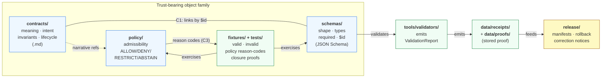
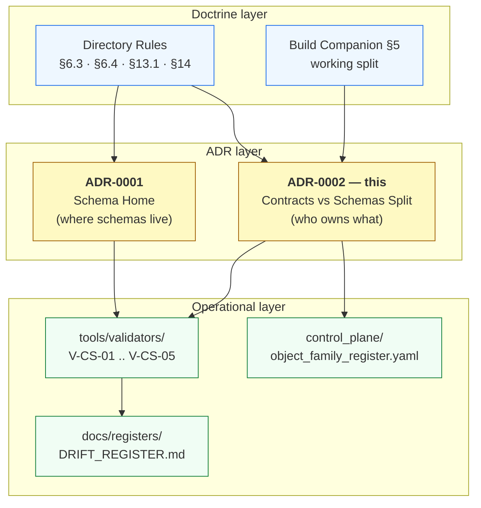

<!-- [KFM_META_BLOCK_V2]
doc_id: kfm://doc/adr-0002
title: ADR-0002 — Contracts vs Schemas Split
type: standard
version: v1
status: draft
owners: <docs steward + architecture owner — TODO confirm in CODEOWNERS>
created: 2026-05-09
updated: 2026-05-09
policy_label: public
related:
  - docs/adr/ADR-0001-schema-home.md
  - docs/doctrine/directory-rules.md
  - docs/architecture/contract-schema-policy-split.md
  - contracts/README.md
  - schemas/README.md
  - policy/README.md
  - tools/validators/README.md
tags: [kfm, adr, contracts, schemas, governance, trust-membrane]
notes:
  - Formalizes the contracts↔schemas division of labor pinned by Directory Rules §6.3–§6.4 and Build Companion §5.
  - Companion to ADR-0001 (schema home); does not relocate any path — names what each surface owns.
  - Repo-presence of the surfaces below is PROPOSED until verified against a mounted repo.
[/KFM_META_BLOCK_V2] -->

# ADR-0002 — Contracts vs Schemas Split

> **Object _meaning_ lives in `contracts/`. Machine-checkable _shape_ lives in `schemas/`. Neither may silently absorb the other, and neither stands alone as truth.**

[](#status)
[](#status)
[](#status)
[](./ADR-0001-schema-home.md)
[](../doctrine/directory-rules.md)

**Quick links** ·
[Status](#status) · [Context](#1-context) · [Decision](#2-decision) ·
[Diagram](#3-surface-map) · [Consequences](#4-consequences) ·
[Alternatives](#5-alternatives-considered) · [Compliance](#6-compliance-and-validation) ·
[Migration](#7-migration-and-rollback) · [Open Questions](#8-open-questions)

---

## Status

| Field | Value |
| :--- | :--- |
| **ID** | `ADR-0002` |
| **Title** | Contracts vs Schemas Split |
| **Status** | `proposed` |
| **Date** | `2026-05-09` |
| **Authors** | _TODO confirm — docs steward + architecture owner_ |
| **Reviewers required** | Docs steward · Schema/validator owner · Policy owner · Tests owner · One subsystem owner |
| **Supersedes** | — |
| **Superseded by** | — |
| **Companion ADR** | [ADR-0001 — Schema Home](./ADR-0001-schema-home.md) |
| **Related doctrine** | [Directory Rules §6.3–§6.4](../doctrine/directory-rules.md) · [Build Companion §5](../../kfm_build_companion.pdf) (working split) |
| **Authority of the rule** | **CONFIRMED** doctrinally — drawn from Directory Rules and Build Companion |
| **Authority of the repo presence claims** | **NEEDS VERIFICATION** — no mounted repo in this session; per-surface presence is PROPOSED until inspected |

> [!IMPORTANT]
> This ADR **clarifies division of labor**; it does **not** move any file. The schema home is pinned by [ADR-0001](./ADR-0001-schema-home.md). Any relocation triggered by this ADR follows [Directory Rules §14](../doctrine/directory-rules.md) (Migration Discipline).

---

## 1. Context

The Kansas Frontier Matrix carries trust-bearing objects — source descriptors, evidence bundles, dataset versions, runtime envelopes, release manifests, correction notices, and per-domain object families. Each object needs four properties to be governable:

1. A **human-readable meaning** that reviewers, stewards, and downstream consumers can read.
2. A **machine-checkable shape** that validators can enforce.
3. An **admissibility posture** that policy can decide.
4. A **proof surface** that demonstrates the rules are enforceable.

If any one surface silently absorbs another, the trust spine fails in a specific, recurring way:

| Failure mode | What it looks like | Why it bites |
| :--- | :--- | :--- |
| **Meaning collapses into schema** | A JSON Schema is treated as the only definition of an object. | Reviewers can't audit *intent*. Field renames look like type changes. Compatibility notes vanish. |
| **Shape collapses into prose** | A Markdown contract is treated as the only check. | Validators have nothing to enforce. CI cannot fail on shape drift. |
| **Admissibility collapses into shape** | A schema's `enum` becomes the de-facto rights/sensitivity rule. | Policy is invisible to reviewers and ungated by `policy/`. |
| **Proof collapses into either** | Validation logic lives only inside a test file or only inside a doc. | No re-runnable artifact. ValidationReports cannot be emitted to receipts. |

Directory Rules §6.3–§6.4 and Build Companion §5 already name the division. Field reports across the domain blueprints (hydrology, fauna, archaeology, atmosphere, settlements/infrastructure, people/DNA/land, habitat, transport) repeatedly draft schemas with text like _"`schemas/contracts/v1/<domain>/<x>.schema.json` OR `contracts/<domain>/<x>.schema.json` … pending ADR-0001"_, indicating that authors are reaching for both surfaces simultaneously and need an explicit, ratified rule about who owns what.

[ADR-0001](./ADR-0001-schema-home.md) resolves *where* machine schemas live (`schemas/contracts/v1/...`). This ADR resolves *what each surface owns and what crosswalks must hold*. The two together are the contracts↔schemas authority pair.

> [!NOTE]
> **Truth posture for this section.** The doctrine quoted above is **CONFIRMED** from Directory Rules and Build Companion. The current repo's compliance with that doctrine is **NEEDS VERIFICATION** in this session.

[Back to top ↑](#adr-0002--contracts-vs-schemas-split)

---

## 2. Decision

KFM adopts a strict, named division of labor across four trust surfaces. Each owns one thing, and **MUST NOT** silently own another.

### 2.1 Division of labor (normative)

| Surface | Owns (MUST) | Must NOT silently own | Format | Review type |
| :--- | :--- | :--- | :--- | :--- |
| **`contracts/`** | Object **meaning**: field intent, invariants, lifecycle semantics, compatibility notes, narrative crosswalks. | Executable validation as the *only* truth; rights/sensitivity decisions. | Markdown (`.md`) | Contract / domain review |
| **`schemas/`** | Machine-checkable **shape**: types, required fields, ranges, regexes, versioned `$id`, reusable fragments. | Semantic explanation as the *only* meaning; admissibility logic. | JSON Schema (per [ADR-0001](./ADR-0001-schema-home.md), default home `schemas/contracts/v1/...`) | Schema / validator review |
| **`policy/`** | Admissibility and release: rights, sensitivity, source-role, `ALLOW`/`DENY`/`RESTRICT`/`ABSTAIN`, reason codes. | General object semantics; field-level shape. | Rego/OPA bundles or repo-native equivalents | Policy / steward / security review |
| **`tests/` + `fixtures/`** | Enforceability **proof**: valid/invalid examples, validator outputs, policy reason-code stability, evidence closure. | Production data; doctrine. | Test code + fixture data | Test / CI review |

Validators (`tools/validators/`) emit `ValidationReport` objects against schemas; they **MUST NOT** be the storage home for emitted proofs (those go to `data/receipts/` and `data/proofs/`, see [Directory Rules §13](../doctrine/directory-rules.md)).

### 2.2 Crosswalks (MUST hold)

For every trust-bearing object family:

- **C1 — Contract ↔ Schema link.** Every JSON Schema **MUST** link to its contract Markdown (e.g., `$comment` or `description` field with `kfm://contract/...` URI, or sibling-doc reference). Every contract that claims machine validation **MUST** link to its schema by `$id`.
- **C2 — Fixture coverage.** Every schema **MUST** have at least one valid fixture and one invalid fixture. Every required field **MUST** appear in at least one valid fixture; every required-field omission **MUST** appear in at least one invalid fixture.
- **C3 — Policy reason codes.** Every `DENY` and `ABSTAIN` path that the object can reach **MUST** carry a stable reason code suitable for UI display and audit.
- **C4 — ValidationReport emission.** Every validator that runs on this object **MUST** emit a `ValidationReport` per the validation contract; tests **MUST** assert against the report, not against side-channel state.

### 2.3 "Object family ready" — the minimum coupling rule

A trust-bearing object family is **not ready** when its schema exists. It is ready when **all eight** of the following hold:

```yaml
contract_exists:               true   # contracts/<family>/<x>.md
schema_exists:                 true   # schemas/contracts/v1/<family>/<x>.schema.json
valid_fixture_exists:          true   # fixtures/ or tests/fixtures/valid/
invalid_fixture_exists:        true   # fixtures/ or tests/fixtures/invalid/
validator_emits_validation_report: true
policy_or_closure_test_exists: true   # admissibility or evidence-closure proof
docs_link_contract_schema_fixture_policy: true
rollback_or_supersession_note_exists: true
```

The eight-point check is the minimum bar before an object family can back any released artifact, governed-API route, or UI surface.

### 2.4 Conformance language

Following [Directory Rules §2.2](../doctrine/directory-rules.md) (RFC 2119-style):

- **MUST / MUST NOT** — non-negotiable. PRs that violate these are not merged absent an approved superseding ADR.
- **SHOULD / SHOULD NOT** — strong default. Deviation requires brief justification in the PR body.
- **MAY** — permitted; stay consistent within the family.

[Back to top ↑](#adr-0002--contracts-vs-schemas-split)

---

## 3. Surface Map

The diagram below is **structural**, not implementational — it shows what each surface owns and the crosswalks this ADR enforces.



> [!TIP]
> Read the diagram as a contract: **every arrow is checkable**. C1 is a crosswalk validator. The `F → S` and `F → P` arrows are fixture coverage tests. The `V → R` arrow is the ValidationReport emission contract. Missing arrows are drift.

[Back to top ↑](#adr-0002--contracts-vs-schemas-split)

---

## 4. Consequences

### 4.1 Positive

- **Reviewer clarity.** A contract PR goes to domain reviewers; a schema PR goes to schema/validator reviewers; a policy PR goes to stewards. No PR conflates three review types.
- **Drift becomes visible.** Crosswalk validators (C1–C4) make silent collapse into a single CI failure rather than a diffuse design smell.
- **Onboarding is shorter.** A new contributor reading `contracts/<family>/<x>.md` learns *what the object means*; reading `schemas/contracts/v1/<family>/<x>.schema.json` learns *its exact shape*. The two are not redundant.
- **Compatibility notes have a home.** Field renames, version bumps, and deprecations land in the contract; the schema's `$id` versioning carries the machine signal.
- **Cite-or-abstain is enforceable.** Public-facing claims can resolve `EvidenceRef → EvidenceBundle` against schemas, with policy admissibility and contract semantics each independently checkable.
- **Audit trail is complete.** `ValidationReport` (from validators) + receipts (in `data/receipts/`) + release manifests (in `release/`) form a chain whose links each point at a contract.

### 4.2 Negative / Costs

- **More files per object family.** Eight artifacts (contract, schema, valid+invalid fixtures, validator wiring, policy or closure test, doc cross-links, rollback note) is real overhead.
- **Crosswalk validator must exist.** Without C1–C4 in CI, the discipline becomes lint-by-review and silently rots.
- **Cross-cutting renames become coordinated.** Renaming a field touches contract, schema, fixtures, validator, and possibly policy. ADR-driven (see [Directory Rules §14.3](../doctrine/directory-rules.md)).
- **Existing dual-home drafts must be reconciled.** Domain blueprints currently draft schemas under both `schemas/contracts/v1/<domain>/` and `contracts/<domain>/`. This ADR + ADR-0001 force a one-way reconciliation. **PROPOSED**: scope and timeline tracked in `migrations/schema/` per [Directory Rules §14.2](../doctrine/directory-rules.md).
- **Policy/runtime coupling tightened.** Reason codes referenced from contracts must remain stable across schema versions. Reason-code stability is now a release-relevant invariant.

### 4.3 Anti-pattern register (for reviewers)

Each row is a known failure mode this ADR rejects.

| Anti-pattern | Symptom | Fix |
| :--- | :--- | :--- |
| **Schema as sole truth** | Object has a `.schema.json` but no contract `.md`. | Author the contract; link via C1; PR cannot merge until both exist. |
| **Contract as sole truth** | Object has a `.md` but no machine schema; validators rely on prose. | Author the schema under `schemas/contracts/v1/...`; add fixtures (C2). |
| **Mirror divergence** | `schemas/` and `contracts/` carry divergent definitions. | Per [ADR-0001](./ADR-0001-schema-home.md), `schemas/contracts/v1/...` is canonical; the other is `mirror` or `legacy`. |
| **Test-only validator** | Validation logic lives inside a test file only. | Extract into `tools/validators/`; tests call into it. |
| **Policy-in-schema** | Rights/sensitivity hidden as a schema `enum`. | Move admissibility into `policy/`; schema retains the field's *shape* only. |
| **No invalid fixture** | Schema has only valid examples. | Add at least one invalid fixture per required-field rule. |
| **Unstable reason codes** | Policy `DENY`/`ABSTAIN` codes change across releases. | Treat reason codes as a versioned compatibility surface; release-relevant. |

[Back to top ↑](#adr-0002--contracts-vs-schemas-split)

---

## 5. Alternatives Considered

### 5.1 Single combined home (`contracts/` only, with embedded JSON Schema fences)

**Considered:** keep one root, embed JSON Schema in fenced code blocks inside Markdown.
**Rejected because:**
- Validator parity becomes a parsing exercise: `scripts/validate_schemas.py` and CI need a clean shape root, not Markdown extraction.
- Reviewers cannot easily diff machine shape across versions.
- IDE schema awareness, language-server hints, and external schema registries expect `.schema.json` files.

### 5.2 Single combined home (`schemas/` only, with `description` carrying all semantics)

**Considered:** push everything into JSON Schema's `description` field.
**Rejected because:**
- Compatibility notes, lifecycle semantics, and domain narrative bloat the schema beyond reviewability.
- Schema reviewers and domain reviewers have different scopes; collapsing the file collapses the review.
- Contracts that reference *multiple* schemas (e.g., an envelope containing several object families) have no clean home.

### 5.3 Per-domain dual home (`contracts/<domain>/<x>.schema.json` *and* `schemas/...`)

**Considered:** allow each domain to keep machine schemas under `contracts/<domain>/` for proximity to its narrative.
**Rejected because:**
- Per the Components Pass 13 dossier (A.4), `scripts/validate_schemas.py` already treats `schemas/contracts/v1/...` as the required contract surface; a parallel home fractures validator parity.
- Schema-home drift compounds quickly and is hard to undo without breaking validators, CI, and integration tests.
- This is what [ADR-0001](./ADR-0001-schema-home.md) was created to prevent; this ADR reinforces that decision.

### 5.4 Allow `schemas/<domain>/` as a top-level scratch surface

**Considered:** permit `schemas/occurrence_evidence/`, `schemas/soil_moisture/`, `schemas/hazards/` as transient draft homes that consolidate later.
**Rejected as a permanent option; permitted only as a `transitional` compatibility class** under [Directory Rules §8](../doctrine/directory-rules.md), provided:
- A migration note pins the consolidation target under `schemas/contracts/v1/<family>/`.
- The transitional folder carries a README declaring `class: transitional` and a sunset date.
- No new top-level `schemas/<domain>/` may be created without an explicit migration note.

### 5.5 Skip the contract surface entirely; use ADRs and READMEs for meaning

**Considered:** treat the `contracts/` root as redundant once ADRs and per-folder READMEs exist.
**Rejected because:**
- ADRs are decisions, not object definitions; READMEs are orientation, not field-level invariants.
- Without `contracts/`, field intent and invariants leak into schema `description` (see 5.2) or into runbooks (which are operational).
- The eight-point readiness rule (§2.3) collapses without a contract anchor.

[Back to top ↑](#adr-0002--contracts-vs-schemas-split)

---

## 6. Compliance and Validation

### 6.1 Required validators

The following crosswalk validators **MUST** exist before this ADR moves from `proposed` to `accepted`. Each is **PROPOSED** until verified in a mounted repo.

| ID | Validator | Lives at | Enforces |
| :--- | :--- | :--- | :--- |
| `V-CS-01` | Contract↔schema crosswalk | `tools/validators/contract_schema_crosswalk/` | C1 — every schema links to a contract; every contract that claims machine validation links to a schema. |
| `V-CS-02` | Fixture coverage | `tools/validators/fixture_coverage/` | C2 — every required field is exercised by at least one valid and one invalid fixture. |
| `V-CS-03` | Policy reason-code stability | `tools/validators/policy_reason_codes/` | C3 — `DENY`/`ABSTAIN` codes are stable across the release window. |
| `V-CS-04` | ValidationReport emission | `tools/validators/validation_report_emission/` | C4 — validators emit a `ValidationReport` of the documented shape. |
| `V-CS-05` | No-divergent-definition guard | `tools/validators/schema_home_guard/` | Co-enforces [ADR-0001](./ADR-0001-schema-home.md): no `.schema.json` outside `schemas/contracts/v1/...` (modulo the transitional exemption in §5.4). |

### 6.2 CI gates

> [!IMPORTANT]
> Gate paths and workflow names below are **PROPOSED**. Until repo-mounted verification, treat them as illustrative. The CI surface itself is governed by [Directory Rules §16](../doctrine/directory-rules.md) (Path-Validation Checklist).

```yaml
# Illustrative — NEEDS VERIFICATION against actual .github/workflows/
adr_0002_compliance:
  triggers: [pull_request]
  jobs:
    - V-CS-01_contract_schema_crosswalk
    - V-CS-02_fixture_coverage
    - V-CS-03_policy_reason_codes
    - V-CS-04_validation_report_emission
    - V-CS-05_schema_home_guard
  block_merge_on_failure: true
```

### 6.3 Per-PR checklist

Reviewers of any PR that touches a trust-bearing object family **SHOULD** confirm:

- [ ] Contract Markdown exists and links to the schema by `$id`.
- [ ] Schema lives under `schemas/contracts/v1/...` (per [ADR-0001](./ADR-0001-schema-home.md)).
- [ ] Valid fixture(s) exercise every required field.
- [ ] Invalid fixture(s) cover at least one boundary or required-field omission.
- [ ] Validator (in `tools/validators/`) emits `ValidationReport`.
- [ ] If the object touches admissibility: policy file exists with stable reason codes.
- [ ] Doc cross-links present (contract ↔ schema ↔ fixture ↔ policy).
- [ ] Rollback or supersession note recorded (CHANGELOG, ADR, or `control_plane/deprecation_register.yaml`).

[Back to top ↑](#adr-0002--contracts-vs-schemas-split)

---

## 7. Migration and Rollback

### 7.1 Migration

This ADR does not move files by itself. It establishes the rule that future and existing surfaces **MUST** comply with. Migration follows [Directory Rules §14.2](../doctrine/directory-rules.md) (structural moves).

**PROPOSED migration phases** (timing tied to ADR acceptance, not this document):

| Phase | Action | Owner | Exit criterion |
| :--- | :--- | :--- | :--- |
| **P0** | Inventory current contract/schema dual-draft pairs from domain blueprints (hydrology, fauna, archaeology, atmosphere, settlements/infrastructure, people/DNA/land, habitat, transport). | _TODO confirm_ | Inventory file in `migrations/schema/ADR-0002-inventory.md`. |
| **P1** | Stand up validators V-CS-01 through V-CS-05 in `tools/validators/`. | _TODO confirm_ | All five validators present, with self-tests in `tests/`. |
| **P2** | Fix existing object families that fail any crosswalk; one PR per family. | Domain owners | Per-family PR closes; CI green. |
| **P3** | Wire validators into CI as blocking. | CI owner | `block_merge_on_failure: true` in workflow. |
| **P4** | Promote this ADR to `accepted`; update [Directory Rules §0](../doctrine/directory-rules.md) `related doctrine` block. | Docs steward | ADR index reflects `accepted` status. |

### 7.2 Rollback

If this ADR is later rejected or superseded:

1. **Mark status `superseded`** with a forward link to the replacing ADR (per [Directory Rules §2.4](../doctrine/directory-rules.md)).
2. **Disable validators V-CS-01..05** rather than delete them (preserves audit history).
3. **Keep the file**; do not remove. Superseded ADRs **MUST** be retained (per [Directory Rules §2.4](../doctrine/directory-rules.md)).
4. **Issue correction notices** under `release/correction_notices/` for any released artifact whose validity claim depended on this ADR's discipline.
5. **Re-open the open questions** below in `docs/registers/VERIFICATION_BACKLOG.md`.

[Back to top ↑](#adr-0002--contracts-vs-schemas-split)

---

## 8. Open Questions

These items are **explicitly not resolved** by this ADR and **SHOULD** be tracked in `docs/registers/VERIFICATION_BACKLOG.md`.

- **NEEDS VERIFICATION** — Whether the live repo currently honors `schemas/contracts/v1/...` as the only machine-schema home, or whether legacy `contracts/<domain>/<x>.schema.json` paths still exist. (Resolves jointly with [ADR-0001](./ADR-0001-schema-home.md).)
- **NEEDS VERIFICATION** — Whether `tools/validators/` exists in the current repo and at what maturity (validator suite, ValidationReport schema, CI wiring).
- **OPEN** — How long the `transitional` exemption (§5.4) for `schemas/<domain>/` scratch homes should remain. **PROPOSED:** sunset within one release window after this ADR is accepted.
- **OPEN** — Whether the contract↔schema link (C1) uses a `$comment`, `description`, or sidecar `kfm://contract/...` URI. The validator (V-CS-01) must accept whichever form the repo standardizes on; the form itself is **NEEDS VERIFICATION**.
- **OPEN** — Whether reason-code stability (C3) is enforced per release window or per-major-version. **PROPOSED:** per release window, with a stability table maintained alongside `policy/runtime/`.
- **OPEN** — Coordination with the `control_plane/object_family_register.yaml` so that "object family ready" (§2.3) is machine-verifiable, not only PR-verifiable.

[Back to top ↑](#adr-0002--contracts-vs-schemas-split)

---

## 9. References

- [ADR-0001 — Schema Home](./ADR-0001-schema-home.md) — *companion ADR; pins `schemas/contracts/v1/...`.*
- [Directory Rules §6.3 (`contracts/`)](../doctrine/directory-rules.md) — *object meaning.*
- [Directory Rules §6.4 (`schemas/`)](../doctrine/directory-rules.md) — *machine-checkable shape.*
- [Directory Rules §13.1 — Schema mirror divergence](../doctrine/directory-rules.md)
- [Directory Rules §14 — Migration Discipline](../doctrine/directory-rules.md)
- KFM Build Companion §5 — *the working split (contracts, schemas, policies, fixtures, tests, validators).*
- KFM Components Pass 13, A.4 — *Schema Home and Family Consolidation.*
- KFM Encyclopedia Appendix J/K — *Schema authority NEEDS VERIFICATION; ADR backlog.*

---

## Appendix A — Worked example (illustrative, not authoritative)

<details>
<summary><b>Click to expand: <code>SourceDescriptor</code> object family laid out under this ADR</b></summary>

> [!NOTE]
> Paths below are **illustrative**. The `SourceDescriptor` family is repeatedly referenced in the corpus (Build Companion §29 backlog item P0; Directory Rules §19 glossary). Actual filenames are **NEEDS VERIFICATION** against a mounted repo.

```text
contracts/source/source_descriptor.md                            # meaning, intent, invariants
schemas/contracts/v1/source/source_descriptor.schema.json        # machine shape (per ADR-0001)
fixtures/source/valid/source_descriptor__minimal.json            # valid fixture (C2)
fixtures/source/valid/source_descriptor__full.json               # valid fixture (C2)
fixtures/source/invalid/source_descriptor__missing_rights.json   # invalid fixture (C2)
fixtures/source/invalid/source_descriptor__bad_cadence.json      # invalid fixture (C2)
policy/sensitivity/source_descriptor_admission.rego              # admissibility (per family)
tools/validators/source_descriptor/validator.py                  # emits ValidationReport (C4)
tests/source/test_source_descriptor.py                           # asserts against report
```

The eight-point readiness check (§2.3) for this family resolves to all-true once each file is present, linked, and CI-green.

</details>

---

## Appendix B — How this ADR relates to the trust spine (illustrative)

<details>
<summary><b>Click to expand</b></summary>



</details>

---

<sub>This ADR is governance content. Changes follow [Directory Rules §17 — Document Change Discipline](../doctrine/directory-rules.md).</sub>

[Back to top ↑](#adr-0002--contracts-vs-schemas-split)
