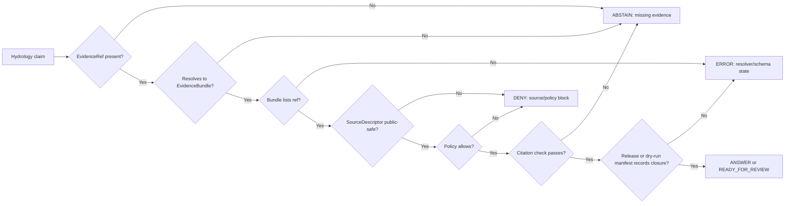

<!-- [KFM_META_BLOCK_V2]
doc_id: kfm://doc/adr/ADR-0202-pr-002-evidence-closure
title: ADR-0202 PR-002: Evidence Closure Gate for Public Hydrology Claims
type: adr
version: v1.1
status: accepted-supplemental
owners: NEEDS_VERIFICATION
created: 2026-05-05
updated: 2026-05-06
policy_label: public-safe-synthetic-baseline
related:
  - ./README.md
  - ./ADR-0001-schema-home.md
  - ./ADR-0002-responsibility-root-monorepo.md
  - ../../tools/validators/validate_evidence_closure.py
  - ../../tools/validators/validate_hydrology_proof_slice.py
  - ../../apps/api/no_model_no_network_policy.py
  - ../../schemas/contracts/v1/shared/evidence_ref.schema.json
  - ../../schemas/contracts/v1/shared/evidence_bundle.schema.json
  - ../../schemas/contracts/v1/shared/policy_decision.schema.json
  - ../../schemas/contracts/v1/shared/runtime_response_envelope.schema.json
  - ../../fixtures/evidence/evidence_ref.valid.json
  - ../../fixtures/evidence/evidence_bundle.valid.json
  - ../../fixtures/source/source_descriptor.valid.json
  - ../../fixtures/ui/evidence_drawer_payload.valid.json
  - ../../release/dry_runs/synthetic_hydrology_release_manifest.json
  - ../../release/dry_runs/synthetic_release_dry_run_receipt.json
tags:
  - kfm
  - adr
  - pr-002
  - evidence-closure
  - hydrology
  - evidence-bundle
  - focus-mode
  - evidence-drawer
  - synthetic-no-network
  - publication-gates
notes:
  - Supplemental ADR for PR-002 synthetic baseline hardening.
  - Does not replace ADR-0002-responsibility-root-monorepo.md.
  - Establishes evidence closure as a release and public-surface precondition for hydrology claims.
  - Synthetic dry-run gates may pass while publication remains REFUSE by design.
[/KFM_META_BLOCK_V2] -->

<a id="top"></a>

# ADR-0202 PR-002: Evidence Closure Gate for Public Hydrology Claims

<p align="center">
  <strong>Public hydrology claims must cite resolved evidence or refuse to speak.</strong>
</p>

<p align="center">
  
  
  
  
</p>

<p align="center">
  <a href="#decision">Decision</a> ·
  <a href="#evidence-basis">Evidence basis</a> ·
  <a href="#closure-contract">Closure contract</a> ·
  <a href="#finite-outcomes">Finite outcomes</a> ·
  <a href="#validation-and-proof">Validation</a> ·
  <a href="#rollback-and-supersession">Rollback</a>
</p>

> [!IMPORTANT]
> This file is a **supplemental ADR for PR-002 evidence closure**. It does **not** replace `ADR-0002-responsibility-root-monorepo.md`, which governs the responsibility-root repository layout.

> [!CAUTION]
> A synthetic dry run can prove that gates execute and produce a receipt. It must not be treated as live publication, live-source activation, production readiness, or emergency/operational hydrology authority.

---

## Status

**Accepted supplemental** for synthetic baseline hardening.

| Field | Value |
|---|---|
| ADR family | Supplemental PR-002 decision |
| Primary domain | Hydrology proof slice |
| Publication posture | `REFUSE` in synthetic dry-run mode |
| Public claim posture | `ANSWER` only after evidence closure and policy gates pass |
| Default failure posture | `ABSTAIN`, `DENY`, or `ERROR` instead of unsupported public output |
| Implementation evidence | Current repository files listed in [Evidence basis](#evidence-basis) |
| Open governance item | ADR numbering collision with the accepted responsibility-root ADR remains visible and should be indexed carefully |

---

## Decision

KFM must not display, summarize, export, release, or allow Focus Mode to answer a **public or semi-public hydrology claim** unless the claim passes evidence closure and governance checks.

A hydrology claim is eligible for a public-facing `ANSWER` only when all of the following are true:

1. The claim has an `EvidenceRef`.
2. The `EvidenceRef` resolves to an `EvidenceBundle`.
3. The `EvidenceBundle` lists the `EvidenceRef` that supports the claim.
4. The supporting `SourceDescriptor` is present and public-safe for the current mode.
5. The relevant policy decision does not deny the claim.
6. Citation expectations pass for any generated or summarized public language.
7. The release or dry-run manifest records the included evidence bundle, validation state, correction path, and rollback target.
8. The resulting runtime or Focus response uses one finite outcome: `ANSWER`, `ABSTAIN`, `DENY`, or `ERROR`.

When any precondition fails, KFM must choose the narrowest truthful negative state:

- `ABSTAIN` for missing or unresolved evidence, missing citations, empty query, or insufficient support.
- `DENY` for policy, rights, sensitivity, no-network, no-model, access-role, or publication block.
- `ERROR` for invalid schema, resolver mismatch, non-finite outcome, malformed request, or inconsistent release artifact.



<p align="right"><a href="#top">Back to top ↑</a></p>

---

## Evidence basis

This ADR is grounded in repository files that currently encode the PR-002 synthetic/no-network hardening path. It should be revised if those files are renamed, superseded, or replaced by stronger implementation evidence.

| Evidence item | Status | What it supports | Limit |
|---|---|---|---|
| `docs/adr/README.md` | CONFIRMED | `docs/adr/` is the current ADR home and lists foundational ADRs. | It does not yet explain this supplemental ADR naming collision. |
| `docs/adr/ADR-0002-responsibility-root-monorepo.md` | CONFIRMED | Responsibility-root layout is accepted; domain content belongs under responsibility roots, not root-level domain folders. | It is a different ADR despite the shared `ADR-0202` prefix. |
| `tools/validators/validate_evidence_closure.py` | CONFIRMED | Evidence closure currently checks `evidence_ref.bundle_id == evidence_bundle.id` and verifies the ref is listed in the bundle. | It is a minimal semantic validator, not a full evidence resolver. |
| `fixtures/evidence/evidence_ref.valid.json` | CONFIRMED | Synthetic hydrology `EvidenceRef` carries `id`, `bundle_id`, `claim_id`, and `knowledge_character`. | Fixture is synthetic and not live-source proof. |
| `fixtures/evidence/evidence_bundle.valid.json` | CONFIRMED | Synthetic hydrology `EvidenceBundle` carries `closure_status: COMPLETE` and includes the evidence ref. | Schema currently checks only minimal shape unless paired with validators. |
| `schemas/contracts/v1/shared/evidence_ref.schema.json` | CONFIRMED | Canonical shared schema home exists for `EvidenceRef`. | Current schema is intentionally minimal. |
| `schemas/contracts/v1/shared/evidence_bundle.schema.json` | CONFIRMED | Canonical shared schema home exists for `EvidenceBundle`. | Current schema is intentionally minimal. |
| `schemas/contracts/v1/shared/policy_decision.schema.json` | CONFIRMED | Policy decisions are finite: `ALLOW`, `ABSTAIN`, `DENY`, `ERROR`. | Policy semantics require validator and runtime checks. |
| `schemas/contracts/v1/shared/runtime_response_envelope.schema.json` | CONFIRMED | Runtime outcomes are finite: `ANSWER`, `ABSTAIN`, `DENY`, `ERROR`. | Schema alone does not prove evidence support. |
| `apps/api/no_model_no_network_policy.py` | CONFIRMED | Payload-only policy returns `ABSTAIN` for missing evidence, `DENY` for network/model requirements, and `ANSWER` only when evidence is resolved. | No live model or network behavior is proven. |
| `fixtures/source/source_descriptor.valid.json` | CONFIRMED | Synthetic source descriptor records source role, rights status, public release flag, `no_network`, and `synthetic_only` activation. | Live source activation remains `NEEDS VERIFICATION`. |
| `fixtures/ui/evidence_drawer_payload.valid.json` | CONFIRMED | Evidence Drawer fixture carries evidence ref, bundle ID, source summary, validation status, policy status, release status, correction status, and rollback target. | UI implementation depth beyond the fixture is not proven by this ADR. |
| `release/dry_runs/synthetic_hydrology_release_manifest.json` | CONFIRMED | Synthetic hydrology release candidate includes evidence bundle IDs, policy decision, rollback target, correction path, and finite result. | `READY_FOR_REVIEW` is not final public publication. |
| `tools/synthetic_release_dry_run.py` | CONFIRMED | Dry-run gate sequence includes fixture/schema/API/directory/public-path/evidence/source/activation checks and always writes `publish_decision: REFUSE`. | Gate list is synthetic and no-network by design. |
| `release/dry_runs/synthetic_release_dry_run_receipt.json` | CONFIRMED | Recorded dry-run result is `PASS` while publication remains `REFUSE`. | Receipt proves dry-run gate execution, not live release. |
| `docs/runbooks/synthetic-release-dry-run-proof-boundary.md` | CONFIRMED | Runbook explicitly distinguishes what the synthetic dry run proves from what it does not prove. | Does not prove live source, production readiness, or publication. |

<p align="right"><a href="#top">Back to top ↑</a></p>

---

## Closure contract

Evidence closure is a cross-file contract, not just a JSON Schema shape.

### Minimum closure rule

```text
EvidenceRef.bundle_id == EvidenceBundle.id
AND EvidenceRef.id IN EvidenceBundle.evidence_refs
```

### Hydrology proof-slice closure rule

For the synthetic hydrology proof slice, the stronger rule is:

```text
EvidenceRef resolves to EvidenceBundle
AND EvidenceBundle resolves to SourceDescriptor
AND SourceDescriptor is synthetic_only + no_network + public-safe for synthetic mode
AND Evidence Drawer payload references the same EvidenceRef and EvidenceBundle
AND ReleaseManifest includes the EvidenceBundle
AND ReleaseManifest provides rollback and correction paths
AND result/outcome fields are finite
```

### What closure does not mean

Evidence closure does **not** mean:

- a live USGS, FEMA, state, local, or other hydrology source was contacted;
- source rights, terms, freshness, availability, or uptime were live-verified;
- final publication occurred;
- a model answer is authoritative;
- the map layer is canonical truth;
- all EvidenceBundle semantics are complete forever.

Closure means the claim can be traced to a declared evidence bundle within the validated synthetic boundary.

<p align="right"><a href="#top">Back to top ↑</a></p>

---

## Finite outcomes

KFM uses finite outcomes to keep public behavior inspectable and fail-safe.

| Outcome | Use for hydrology public claim flow | Example trigger |
|---|---|---|
| `ANSWER` | Claim is evidence-closed, policy-allowed, citation-supported, and release/state context permits a public response. | `evidence_resolved: true`, no policy block, citations present. |
| `ABSTAIN` | Evidence or citation support is missing or insufficient. | Missing `EvidenceRef`, unresolved bundle, empty query, missing citations. |
| `DENY` | Policy blocks exposure. | Rights unclear, sensitivity block, no-network or no-model rule, access role insufficient. |
| `ERROR` | Contract, resolver, schema, or runtime state is invalid. | Bundle mismatch, malformed request, non-finite outcome, invalid release manifest. |

### Policy/result mapping

| Policy decision | Public hydrology response |
|---|---|
| `ALLOW` | May proceed to `ANSWER` only if evidence closure and citation checks also pass. |
| `ABSTAIN` | Must not answer as fact; use `ABSTAIN`. |
| `DENY` | Must not expose; use `DENY`. |
| `ERROR` | Must not answer; use `ERROR` with bounded diagnostic reason. |

> [!NOTE]
> `ALLOW` is necessary but not sufficient. KFM still needs resolved evidence, citation support, public-safe source posture, and release/correction/rollback context.

<p align="right"><a href="#top">Back to top ↑</a></p>

---

## Public-surface implications

### Governed API

The governed API must not return a factual hydrology answer unless the payload can carry or resolve:

- `claim_id`,
- `evidence_ref`,
- `evidence_bundle_id`,
- source descriptor summary or source descriptor ID,
- validation status,
- policy status,
- release status,
- correction path or correction state,
- rollback target,
- finite outcome and reason.

### Evidence Drawer

The Evidence Drawer should show the user why a claim is trusted, withheld, or incomplete. The minimum public-safe payload should include:

| Field family | Purpose |
|---|---|
| Evidence reference | Shows the claim has support and where it resolves. |
| Evidence bundle ID | Lets reviewers trace the bundle used. |
| Source descriptor summary | Communicates source role and mode, especially synthetic/no-network status. |
| Validation status | Separates schema/fixture validation from policy. |
| Policy status | Shows whether exposure is allowed, denied, or abstained. |
| Release status | Separates `READY_FOR_REVIEW`, `PUBLISHED`, and dry-run states. |
| Correction/rollback | Keeps reversibility visible. |
| Knowledge character | Prevents synthetic, modeled, observed, regulatory, and interpreted evidence from collapsing. |

### Focus Mode

Focus Mode must remain downstream of evidence closure. It may summarize resolved evidence, but it must not answer from raw model output, unreleased candidate data, direct source fetches, or unsupported map context.

Focus Mode should refuse to answer when:

- `evidence_resolved` is not true;
- citations are absent for evidence-bearing statements;
- model or network use is blocked by the current mode;
- policy denies exposure;
- a resolver/schema mismatch occurs;
- the requested claim exceeds the available evidence scope.

<p align="right"><a href="#top">Back to top ↑</a></p>

---

## Synthetic dry-run rule

Synthetic dry-run gates may pass while publication remains refused.

This is intentional.

```text
mode = SYNTHETIC_NO_NETWORK
result = PASS
publish_decision = REFUSE
reason = DRY_RUN_ONLY_REFUSES_PUBLISH
```

A passing synthetic dry run proves only that the configured local gates executed successfully over local fixtures and produced a receipt. It does not publish, activate live sources, contact external APIs, or prove production deployment readiness.

### Dry-run acceptance signals

- Validator gates return `PASS`.
- Evidence closure validator returns `PASS evidence closure validated`.
- Directory rules and public-path guards pass.
- Source activation and source terms fixtures pass.
- Receipt is written under `release/dry_runs/`.
- Receipt records `publish_decision: REFUSE`.

### Dry-run failure signals

- Any validator gate returns non-zero.
- Receipt is missing, malformed, or ambiguous.
- Publish decision is anything other than `REFUSE` in synthetic no-network mode.
- Evidence closure claims pass without an EvidenceRef-to-EvidenceBundle match.
- A public output path reads RAW, WORK, QUARANTINE, unpublished candidate data, or direct model output.

<p align="right"><a href="#top">Back to top ↑</a></p>

---

## Validation and proof

### Required validators for this ADR

| Validator or check | Why it matters |
|---|---|
| `tools/validators/validate_evidence_closure.py` | Proves the minimal EvidenceRef → EvidenceBundle relation. |
| `tools/validators/validate_hydrology_proof_slice.py` | Proves the hydrology synthetic proof slice links evidence, source, drawer, release, correction, and rollback context. |
| `tools/validate_schema_conformance.py` | Confirms fixtures conform to the schemas they target. |
| `tools/validate_api_contracts.py` | Protects API payload expectations. |
| `tools/check_directory_rules.py` | Keeps files inside responsibility roots. |
| `tools/check_no_public_internal_paths.py` | Prevents public/internal path leakage. |
| `tools/validators/validate_activation_decisions.py` | Keeps source activation finite and reviewable. |
| `tools/validators/validate_source_terms.py` | Keeps source rights/terms posture explicit. |
| `tools/validate_focus_citations.py` | Protects cite-or-abstain behavior for Focus-style outputs. |

### Test expectations

A correct implementation should include tests that verify:

- valid EvidenceRef resolves to valid EvidenceBundle;
- invalid unresolved evidence cannot produce `ANSWER`;
- missing citations cannot produce `ANSWER`;
- bad activation enum fails;
- invented live HTTP facts fail in no-network mode;
- dry-run publication remains `REFUSE` even when gates pass;
- policy model/network restrictions map to `DENY`;
- malformed requests map to `ERROR`;
- empty queries map to `ABSTAIN`.

### Recommended local commands

```bash
python tools/validators/validate_evidence_closure.py
python tools/validators/validate_hydrology_proof_slice.py
python tools/synthetic_release_dry_run.py
bash scripts/check_synthetic_release_local.sh
bash scripts/validate_all.sh
python -m unittest discover -s tests
```

> [!WARNING]
> These commands are repo-grounded expectations. A CI or local environment may require dependency installation or path adjustments before they can be run successfully.

<p align="right"><a href="#top">Back to top ↑</a></p>

---

## Consequences

### Positive consequences

- Public hydrology claims become traceable to evidence bundles.
- Focus Mode has a clear cite-or-abstain boundary.
- Evidence Drawer payloads become trust objects, not decoration.
- Synthetic fixtures can test negative states without network/model risk.
- Release candidates must carry correction and rollback context.
- `PASS` no longer means publish; publication remains a governed state transition.

### Costs

- Minimal schemas must be paired with semantic validators.
- More fields are required in UI/API payloads before public claims can be trusted.
- Hydrology proof-slice fixtures need maintenance as object contracts mature.
- Dry-run receipts must be regenerated when gate lists or fixtures change.
- ADR numbering/indexing needs cleanup to avoid confusion with the accepted responsibility-root ADR.

### Tradeoff accepted

This ADR favors public trust and reversibility over early convenience. It is better for KFM to abstain or deny than to produce a fluent hydrology statement that cannot resolve to evidence.

<p align="right"><a href="#top">Back to top ↑</a></p>

---

## Implementation notes

### Keep schemas and semantic validators distinct

The current shared `EvidenceRef` and `EvidenceBundle` schemas are intentionally compact. They define basic shape. They do not, by themselves, prove cross-file closure. The closure validator and hydrology proof-slice validator carry the semantic checks until schemas mature.

### Keep synthetic and live claims distinct

Synthetic fixtures must remain labeled with a synthetic knowledge character, synthetic source role, and no-network activation state. A synthetic passing gate must not be reworded as proof that live hydrology source data was fetched, published, or validated.

### Keep review state visible

A release manifest result such as `READY_FOR_REVIEW` is not the same as `PUBLISHED`. Public surfaces should display review/release state rather than flattening it into a binary success flag.

### Keep policy and evidence separate

Evidence closure answers the question: “Can this claim resolve to its evidence bundle?” Policy answers: “May this claim be exposed in this context?” Both must pass before `ANSWER`.

<p align="right"><a href="#top">Back to top ↑</a></p>

---

## Acceptance criteria

This ADR remains valid while the following are true:

- [ ] `tools/validators/validate_evidence_closure.py` passes for valid evidence fixtures.
- [ ] Invalid unresolved-evidence fixtures cannot produce `ANSWER`.
- [ ] Runtime outcomes remain finite: `ANSWER`, `ABSTAIN`, `DENY`, `ERROR`.
- [ ] Policy decisions remain finite: `ALLOW`, `ABSTAIN`, `DENY`, `ERROR`.
- [ ] Synthetic no-network dry run records `publish_decision: REFUSE`.
- [ ] Hydrology proof-slice validator links EvidenceRef, EvidenceBundle, SourceDescriptor, Evidence Drawer payload, and release manifest.
- [ ] Public-path guard checks prevent RAW/WORK/QUARANTINE/internal/direct-model exposure.
- [ ] Evidence Drawer payloads include evidence, policy, release, correction, and rollback context.
- [ ] Focus Mode citation checks prevent uncited evidence-bearing answers.
- [ ] ADR index documents this supplemental file clearly enough to avoid conflict with `ADR-0002-responsibility-root-monorepo.md`.

<p align="right"><a href="#top">Back to top ↑</a></p>

---

## Rollback and supersession

If this ADR is superseded:

1. Preserve this file as lineage.
2. Add a successor ADR with explicit scope and reason.
3. Keep synthetic dry-run receipts and validation outputs available for audit.
4. Preserve correction and rollback references in release manifests.
5. Update validators, fixtures, runbooks, and ADR index in the same change set.
6. Do not silently weaken cite-or-abstain, evidence closure, or publication-refusal semantics.
7. Treat any temporary bypass as `DENY` for public output until the successor gate is validated.

Rollback must keep KFM’s trust posture intact. A rollback that allows unsupported public hydrology claims is not acceptable.

<p align="right"><a href="#top">Back to top ↑</a></p>

---

## Open verification items

- Whether this supplemental ADR should be renumbered or indexed as a PR supplement to avoid collision with `ADR-0002-responsibility-root-monorepo.md`.
- Whether `EvidenceRef` and `EvidenceBundle` shared schemas should be expanded to encode `bundle_id`, `claim_id`, `closure_status`, `source_descriptor_id`, and `knowledge_character` directly.
- Whether hydrology proof-slice release states should add a distinct `SYNTHETIC_READY_FOR_REVIEW` state.
- Whether CI should promote `validate_hydrology_proof_slice.py` from targeted test to mandatory release gate.
- Whether Evidence Drawer payloads need a formal shared schema under `schemas/contracts/v1/shared/` or a UI-specific schema family.
- Whether Focus Mode citation validation should require EvidenceBundle IDs in every answer envelope.
- Whether synthetic source descriptors need a separate `synthetic_source_descriptor.schema.json` to avoid confusing live-source descriptors.

<p align="right"><a href="#top">Back to top ↑</a></p>
