<!-- [KFM_META_BLOCK_V2]
doc_id: kfm://doc/NEEDS-VERIFICATION-ADR-0002
title: ADR-0002: Responsibility-Root Monorepo Layout
type: standard
version: v1.2-review
status: review
owners: OWNER_TBD_NEEDS_VERIFICATION
created: 2026-05-05
updated: 2026-05-06
policy_label: NEEDS-VERIFICATION
related: [../../README.md, ./README.md, ./ADR-0001-schema-home.md, ../registers/REPO_ORGANIZATION_AUDIT.md]
tags: [kfm, adr, monorepo, responsibility-root, directory-rules, governance, lifecycle, domains]
notes: [
  ADR decision status is accepted; this document revision status remains review until owners, CODEOWNERS, CI enforcement, compatibility-root status, and root README coverage are verified.
  This ADR governs root-level responsibility boundaries. It does not decide every subdirectory convention or prove enforcement.
  Compatibility roots require explicit README or ADR status before being treated as canonical.
]
[/KFM_META_BLOCK_V2] -->

<a id="top"></a>

# ADR-0002: Responsibility-Root Monorepo Layout

KFM root folders are authority boundaries, not topic buckets.

<p align="center">
  
  
  
  
  
</p>

<p align="center">
  <a href="#decision-summary">Decision</a> ·
  <a href="#repo-fit">Repo fit</a> ·
  <a href="#root-admission-rule">Root rule</a> ·
  <a href="#approved-root-policy">Approved roots</a> ·
  <a href="#domain-placement-rule">Domain placement</a> ·
  <a href="#compatibility-roots">Compatibility roots</a> ·
  <a href="#enforcement-and-review">Enforcement</a> ·
  <a href="#open-verification-backlog">Open verification</a>
</p>

> [!IMPORTANT]
> **ADR decision status:** `accepted`.
>
> **Document revision status:** `review`.
>
> This ADR decides how KFM admits and governs **top-level repository roots**. It does not prove that every root currently has a README, that CI enforces root hygiene, that compatibility roots are migrated, or that every downstream package already follows this rule.

---

## Decision summary

| Field | Determination |
|---|---|
| ADR | `docs/adr/ADR-0002-responsibility-root-monorepo.md` |
| Decision | Use a **responsibility-root monorepo**. |
| ADR status | `accepted` |
| Document revision status | `review` |
| Core rule | A root directory is allowed only when it owns a repo-wide responsibility. |
| Domain rule | Domain names must not become greenfield top-level roots. |
| Compatibility rule | Transitional roots such as `ui/`, `web/`, `jsonschema/`, `policies/`, `styles/`, `viewer_templates/`, and tightly scoped `artifacts/` require explicit README or ADR status. |
| Enforcement posture | Fail closed on ambiguous root authority, duplicated responsibility, or domain-root sprawl. |
| Enforcement evidence | `NEEDS VERIFICATION` unless proven by active checkout tests, workflows, root READMEs, CODEOWNERS, or validation output. |

**Accepted decision:** KFM uses responsibility roots such as `docs/`, `control_plane/`, `contracts/`, `schemas/`, `policy/`, `tests/`, `fixtures/`, `apps/`, `packages/`, `connectors/`, `pipelines/`, `data/`, and `release/`. New domain-specific top-level folders such as `hydrology/`, `fauna/`, `roads/`, `archaeology/`, or `agriculture/` are not allowed by default.

[Back to top](#top)

---

## Repo fit

| Relationship | Path | Status | Role |
|---|---|---:|---|
| This ADR | `docs/adr/ADR-0002-responsibility-root-monorepo.md` | `CONFIRMED path / review revision` | Governs root-level responsibility boundaries. |
| ADR index | [`./README.md`](./README.md) | `CONFIRMED path / NEEDS VERIFICATION coverage` | ADR navigation, status, and review discipline. |
| Schema-home ADR | [`./ADR-0001-schema-home.md`](./ADR-0001-schema-home.md) | `CONFIRMED path / proposed decision` | Separates machine schema authority from semantic contract docs. |
| Root README | [`../../README.md`](../../README.md) | `CONFIRMED path / draft authority` | Public landing page; states KFM trust law and responsibility-root posture. |
| Repo organization audit | [`../registers/REPO_ORGANIZATION_AUDIT.md`](../registers/REPO_ORGANIZATION_AUDIT.md) | `CONFIRMED path / audit lineage` | Records observed root families and authority conflicts from a prior audit. |

### Upstream inputs

This ADR is downstream of:

- Directory Rules and responsibility-root doctrine;
- KFM lifecycle law: `RAW -> WORK / QUARANTINE -> PROCESSED -> CATALOG / TRIPLET -> PUBLISHED`;
- ADR-0001 schema-home work;
- root README trust-law language;
- repo organization audit evidence;
- KFM doctrine that public clients use governed interfaces and released artifacts.

### Downstream consumers

This ADR should inform:

- root and directory READMEs;
- ADR index entries;
- `control_plane/` root and authority registers;
- schema, contract, policy, fixture, test, validator, release, and data lifecycle placement;
- PR review cards;
- root hygiene checks;
- migration plans for compatibility roots.

[Back to top](#top)

---

## Why this ADR exists

KFM is a governed, evidence-first, map-first, time-aware spatial knowledge and publication system. The repository layout must preserve the same trust membrane as the data lifecycle:

```text
RAW -> WORK / QUARANTINE -> PROCESSED -> CATALOG / TRIPLET -> PUBLISHED
```

The repository can grow many domain lanes, but the root must remain stable, inspectable, and boring. Without a responsibility-root decision, KFM risks four kinds of drift:

| Drift risk | Failure mode | ADR response |
|---|---|---|
| Root domain sprawl | `hydrology/`, `soil/`, `fauna/`, `archaeology/`, and similar topic folders accumulate at root. | Domain work goes under responsibility roots. |
| Authority collision | `contracts/`, `schemas/`, `policy/`, `release/`, and `data/proofs/` blur their roles. | Each root owns one responsibility class. |
| UI shell fragmentation | `ui/`, `web/`, `apps/web/`, `apps/ui/`, and `packages/ui/` become competing homes. | Compatibility roots require explicit status and migration rules. |
| Proof / artifact confusion | `artifacts/`, `data/proofs/`, `data/receipts/`, `release/`, and `data/published/` mix trust-bearing objects. | Proofs, receipts, releases, and published material stay in governed homes. |

The responsibility-root layout lets domain lanes grow deeply without turning the repository root into a pile of subject folders.

[Back to top](#top)

---

## Evidence boundary

This ADR records a layout decision and the review burden around it. It does not, by itself, prove enforcement.

| Evidence class | Status | What it supports | What it does not prove |
|---|---|---|---|
| Existing ADR-0002 path | `CONFIRMED` | Target file exists in `docs/adr/`; decision area is already present. | CI enforcement, owner approval, or full root conformance. |
| ADR directory index | `CONFIRMED` | `docs/adr/` is the ADR home and lists ADR-0002 as a foundational layout decision. | Complete ADR inventory or acceptance evidence beyond file content. |
| ADR template | `CONFIRMED` | KFM ADRs should expose evidence, truth labels, validation, rollback, and supersession. | That this ADR’s enforcement exists. |
| Root README | `CONFIRMED` | KFM trust law, responsibility roots, domain-lane caution, and compatibility-root warning language. | That every listed root exists or is fully enforced. |
| Repo organization audit | `CONFIRMED as repo document` | Broad root families exist and several authority conflicts are known. | Current branch runtime behavior or final canonicalization. |
| Directory Rules doctrine | `CONFIRMED doctrine` | Root folders are responsibility boundaries; domain names belong under responsibility roots; compatibility roots require status. | Current implementation maturity, CI behavior, or complete README coverage. |

### Truth labels used in this ADR

| Label | Meaning |
|---|---|
| `CONFIRMED` | Verified from repository connector evidence, repository files, or supplied KFM doctrine. |
| `ACCEPTED` | The architecture decision is accepted as KFM repository doctrine. |
| `PROPOSED` | Implementation, validator, checklist, or migration guidance not proven as active enforcement. |
| `NEEDS VERIFICATION` | A concrete check must pass before treating the claim as implemented or enforced. |
| `UNKNOWN` | Not verified strongly enough in the active checkout. |
| `CONFLICTED` | Authority signals overlap or disagree and require explicit resolution. |

> [!NOTE]
> An ADR can be accepted while enforcement remains `NEEDS VERIFICATION`. Keep decision state and implementation proof separate.

[Back to top](#top)

---

## Root admission rule

A folder belongs at repository root only when it owns a **repo-wide responsibility**.

### Five-part admission test

A proposed root must satisfy at least one of these responsibilities and must not duplicate an existing root:

| Admission test | Allowed root responsibility | Examples |
|---|---|---|
| Governance / truth | Governs doctrine, authority, evidence, policy, release, correction, or rollback. | `docs/`, `control_plane/`, `contracts/`, `schemas/`, `policy/`, `release/` |
| Deployable / shared implementation | Contains deployable systems or shared implementation packages. | `apps/`, `packages/`, `runtime/` |
| Lifecycle / proof objects | Stores lifecycle data, registries, receipts, proofs, published artifacts, or operational memory. | `data/`, `release/`, tightly scoped `artifacts/` if accepted |
| Validation / operations | Supports validation, tests, fixtures, infrastructure, migrations, scripts, or runtime operation. | `tests/`, `fixtures/`, `tools/`, `scripts/`, `infra/`, `configs/`, `migrations/` |
| Cross-domain coordination | Coordinates all domains rather than representing one domain. | `connectors/`, `pipelines/`, `pipeline_specs/`, `examples/` |

### Default rejection rule

Reject a new root when it is primarily:

- a domain topic;
- a convenience bucket;
- a duplicate of an existing responsibility;
- a generated-output dumping ground;
- a temporary working folder;
- an ungoverned mirror;
- a second home for contracts, schemas, policy, proofs, releases, receipts, or UI shell code.

> [!CAUTION]
> A root folder name can look harmless and still weaken governance. If a proposed root can be expressed as a subdirectory under an existing responsibility root, it should not be added at repository root without an ADR.

[Back to top](#top)

---

## Approved root policy

This ADR recognizes three root classes:

1. **Canonical responsibility roots** — stable homes for repo-wide responsibilities.
2. **Compatibility or transitional roots** — allowed only when status is documented and they do not become competing authority.
3. **Rejected greenfield roots** — not allowed without a superseding ADR.

### Canonical responsibility roots

| Root | Responsibility | Accepted contents | Exclusions |
|---|---|---|---|
| `.github/` | Repository automation and GitHub workflow surface. | Workflows, issue templates, PR templates, CODEOWNERS, repository automation. | Domain source data, proof objects, release truth, secrets. |
| `docs/` | Human-facing control plane. | Doctrine, ADRs, architecture, runbooks, standards, domain docs, source docs, registers. | Machine schema authority, raw data, runtime secrets, proof packs as release truth. |
| `control_plane/` | Machine-readable or semi-machine-readable governance maps. | Document registry, object-family registry, source authority register, policy gate register. | Source-native data, app code, policy implementation. |
| `contracts/` | Semantic meaning and narrative contract explanations. | Object-family meaning, API/object vocabulary, compatibility notes, domain contract docs. | Primary machine-checkable schemas unless an ADR explicitly permits a bridge. |
| `schemas/` | Machine-checkable shape. | JSON Schemas, schema tests, valid/invalid schema fixtures, schema indexes. | Narrative-only contract prose or policy permission. |
| `policy/` | Admissibility and release rules. | Rights, sensitivity, promotion, runtime, domain, and release policy. | Schema definitions as primary authority. |
| `tests/` | Enforceable verification. | Unit, integration, contract, policy, reproducibility, API, UI, e2e, and regression tests. | Production data or generated proof stores. |
| `fixtures/` | Test evidence and synthetic examples. | Valid, invalid, golden, synthetic, and no-network fixtures. | Public truth, live-source output, unreviewed sensitive data. |
| `tools/` | Governed helper implementations. | Validators, attestation helpers, source probes, diff tools, local proof tooling. | Deployable app entrypoints or hidden policy authority. |
| `scripts/` | Thin operator entrypoints. | Explicit wrappers for contributor-visible commands. | Long-lived domain processing or hidden business logic. |
| `apps/` | Deployable systems. | Governed API, explorer web app, review console, CLI, workers, admin surfaces. | Shared libraries or canonical data. |
| `packages/` | Shared implementation packages. | Evidence resolver, hashing, validators, source utilities, domain helpers, UI packages. | Deployable app entrypoints unless repo convention explicitly permits. |
| `connectors/` | Source access adapters. | Source-specific connectors with rights, cadence, provenance, and policy boundaries. | Canonical data, raw captures, public claims. |
| `pipelines/` | Processing and orchestration implementation. | Ingest, transform, validation, cataloging, tiling, receipt, and dry-run flows. | Pipeline specifications if `pipeline_specs/` is the accepted declarative home. |
| `pipeline_specs/` | Declarative processing specifications. | Domain and cross-domain pipeline declarations. | Executable implementation that belongs in `pipelines/` or `tools/`. |
| `data/` | Lifecycle data and operational memory. | `raw/`, `work/`, `quarantine/`, `processed/`, `catalog/`, `triplets/`, `registry/`, `receipts/`, `proofs/`, `published/`. | Runtime secrets or unclassified generated clutter. |
| `release/` | Release operations. | Release candidates, release manifests, promotion decisions, rollback cards. | Raw data, receipts, proofs, or arbitrary build output. |
| `runtime/` | Runtime operation. | Local runtime configuration, service boundaries, runtime notes. | Canonical source truth or policy authority. |
| `infra/` | Infrastructure. | Infrastructure-as-code, deployment topology, environment scaffolding. | App code, data lifecycle content. |
| `configs/` | Shared configuration. | Repo-wide or environment-scoped configuration. | Secrets or source-native data. |
| `migrations/` | Migration operations. | Database, schema, data, and compatibility migrations. | New canonical schema definitions unless linked to `schemas/`. |
| `examples/` | Public-safe examples. | Demonstrations, tiny teaching fixtures, sample integrations. | Unreviewed source data, sensitive data, canonical proof objects. |

> [!IMPORTANT]
> A root’s presence is not enough to prove authority. Canonical roots need purpose, accepted inputs, exclusions, validation, and review burden documented in root READMEs, ADRs, or registers.

[Back to top](#top)

---

## Compatibility roots

Compatibility roots are allowed only when they declare authority status. They must not silently compete with canonical responsibility roots.

| Compatibility root | Allowed status | Required rule |
|---|---|---|
| `artifacts/` | Optional / compatibility / generated | Must explain whether it stores build, docs, QA, temporary, or compatibility outputs. It must not hold canonical receipts, proofs, release manifests, or published data unless a later ADR says so. |
| `jsonschema/` | Transitional / mirror / deprecated | Must explain whether it mirrors `schemas/contracts/v1/` or is retired. Canonical machine schemas belong under `schemas/` after ADR-0001 acceptance. |
| `policies/` | Legacy / mirror / deprecated / export | Must not evolve independently from `policy/`. |
| `ui/` | Compatibility / legacy / shared UI transition | Must state whether canonical UI implementation belongs in `apps/`, `packages/ui/`, or this root. |
| `web/` | Compatibility / legacy web surface | Must state whether it is canonical, legacy, generated, or migrating to `apps/`. |
| `styles/` | Compatibility | Should move under a UI package, app, or docs/brand area unless an ADR accepts root status. |
| `viewer_templates/` | Compatibility | Should move under app, package, or examples responsibility unless an ADR accepts root status. |

### Compatibility-root requirements

Every compatibility root must have a `README.md`, register entry, or ADR-backed status declaration with:

- authority level;
- canonical replacement if any;
- accepted inputs;
- prohibited contents;
- migration or retirement plan;
- review owner or owner placeholder;
- validation expectations;
- relationship to canonical roots.

> [!WARNING]
> A compatibility root without a status file is not evidence of canonical authority. Treat it as `NEEDS VERIFICATION` until its role is documented.

[Back to top](#top)

---

## Domain placement rule

Domain lanes are first-class KFM concerns, but they do not own the repository root.

### Domain names that should not be greenfield roots

Examples include:

```text
hydrology/
soil/
fauna/
flora/
habitat/
geology/
atmosphere/
roads/
rail/
trade-routes/
settlements/
infrastructure/
archaeology/
hazards/
agriculture/
people/
genealogy/
dna/
land/
```

### Domain work belongs under responsibility roots

| Domain responsibility | Responsibility-root placement |
|---|---|
| Human-facing domain docs | `docs/domains/<domain>/` |
| Domain runbooks | `docs/runbooks/<domain>/` or repo-confirmed runbook convention |
| Domain ADRs | `docs/adr/ADR-<nnnn>-<topic>.md` or domain ADR index if accepted |
| Semantic domain contracts | `contracts/domains/<domain>/` or repo-confirmed contract convention |
| Machine domain schemas | `schemas/contracts/v1/domains/<domain>/` or ADR-0001-compatible schema convention |
| Domain policy | `policy/domains/<domain>/` or repo-confirmed policy convention |
| Domain tests | `tests/domains/<domain>/` or repo-confirmed test convention |
| Domain fixtures | `fixtures/domains/<domain>/` or repo-confirmed fixture convention |
| Domain shared code | `packages/domains/<domain>/` or repo-confirmed package convention |
| Domain connectors | `connectors/<domain>/` or source-family connector convention |
| Domain pipelines | `pipelines/domains/<domain>/` or repo-confirmed pipeline convention |
| Domain pipeline specs | `pipeline_specs/<domain>/` or repo-confirmed spec convention |
| Raw domain data | `data/raw/<domain>/` |
| Work data | `data/work/<domain>/` |
| Quarantine data | `data/quarantine/<domain>/` |
| Processed data | `data/processed/<domain>/` |
| Catalog objects | `data/catalog/.../<domain>/` |
| Receipts | `data/receipts/<domain>/` |
| Proofs | `data/proofs/<domain>/` |
| Published data | `data/published/<domain>/` |
| Release candidates | `release/candidates/<domain>/` or repo-confirmed release convention |

> [!NOTE]
> This ADR forbids domain roots. It does not settle every domain subpath. Subpath conventions must remain aligned with ADR-0001, registry files, schema indexes, and current repository evidence.

### Wrong vs right

```text
# Wrong: topic-root layout
hydrology/
├── data/
├── schemas/
├── policy/
└── docs/

# Right: responsibility-root layout
docs/domains/hydrology/
schemas/contracts/v1/domains/hydrology/
policy/domains/hydrology/
tests/domains/hydrology/
fixtures/domains/hydrology/
packages/domains/hydrology/
connectors/hydrology/
pipelines/domains/hydrology/
pipeline_specs/hydrology/
data/raw/hydrology/
data/work/hydrology/
data/quarantine/hydrology/
data/processed/hydrology/
data/catalog/.../hydrology/
data/receipts/hydrology/
data/proofs/hydrology/
data/published/hydrology/
release/candidates/hydrology/
```

[Back to top](#top)

---

## Layout diagram

```mermaid
flowchart TB
  R[Repository root]

  R --> G[Governance and authority roots]
  R --> I[Implementation roots]
  R --> D[Data and release roots]
  R --> O[Operations roots]
  R --> C[Compatibility roots]

  G --> docs[docs/]
  G --> cp[control_plane/]
  G --> contracts[contracts/]
  G --> schemas[schemas/]
  G --> policy[policy/]

  I --> apps[apps/]
  I --> packages[packages/]
  I --> connectors[connectors/]
  I --> pipelines[pipelines/]
  I --> specs[pipeline_specs/]
  I --> tools[tools/]
  I --> scripts[scripts/]

  D --> data[data/]
  D --> release[release/]

  O --> tests[tests/]
  O --> fixtures[fixtures/]
  O --> runtime[runtime/]
  O --> infra[infra/]
  O --> configs[configs/]
  O --> migrations[migrations/]
  O --> examples[examples/]

  C --> artifacts[artifacts/]
  C --> ui[ui/]
  C --> web[web/]
  C --> jsonschema[jsonschema/]
  C --> policies[policies/]
  C --> styles[styles/]
  C --> vt[viewer_templates/]

  domain[Domain lane]
  domain -. docs .-> docs
  domain -. semantic contracts .-> contracts
  domain -. machine schemas .-> schemas
  domain -. policy .-> policy
  domain -. fixtures/tests .-> tests
  domain -. lifecycle data .-> data
  domain -. release .-> release
  domain -. implementation .-> I
```



[Back to top](#top)

---

## Root README requirement

Every major root should declare its authority. A root folder without this declaration is `NEEDS VERIFICATION`.

### Minimum root README shape

```markdown
# <root-name>

## Purpose

What this root owns.

## Authority level

Canonical, implementation-bearing, generated, compatibility, archive, exploratory, or deprecated.

## What belongs here

Accepted file types, object families, data classes, or implementation surfaces.

## What does not belong here

Common mistakes and prohibited content.

## Inputs

Where material in this root comes from.

## Outputs

What this root emits, validates, or supports.

## Validation

How this root is checked.

## Review burden

Who must review changes.

## Related folders

Contracts, schemas, policy, tests, data, release, docs, apps, or packages links.

## Status

CONFIRMED / PROPOSED / UNKNOWN / LEGACY / DEPRECATED.
```

Root READMEs are not decorative. They prevent maintainers from having to infer authority from folder names.

[Back to top](#top)

---

## New-root change protocol

A new top-level directory requires a root admission review.

### Required review steps

1. State the proposed root name.
2. Identify the repo-wide responsibility it owns.
3. Show why no existing root can own the content.
4. Classify authority level: canonical, compatibility, generated, archive, exploratory, or deprecated.
5. Identify accepted inputs and prohibited contents.
6. Identify emitted outputs and downstream consumers.
7. Identify validation and review burden.
8. Update root README and directory documentation.
9. Add or update CI / validation if root hygiene is enforceable.
10. Create an ADR when the root changes governance, policy, release, contract, schema, public UI, or lifecycle boundaries.

### New-root decision record template

```yaml
# Illustrative only. Use repo-native registry conventions when available.
root_decision:
  proposed_root: "<name>/"
  status: "PROPOSED"
  authority_level: "canonical | compatibility | generated | archive | exploratory | deprecated"
  responsibility_owned: "NEEDS VERIFICATION"
  existing_roots_considered:
    - root: "docs/"
      reason_not_sufficient: "NEEDS VERIFICATION"
  accepted_inputs:
    - "NEEDS VERIFICATION"
  prohibited_contents:
    - "raw source data unless this is a data lifecycle root"
    - "canonical schemas unless this is schemas/"
    - "release decisions unless this is release/"
  outputs:
    - "NEEDS VERIFICATION"
  required_docs:
    - "<name>/README.md"
    - "README.md"
    - "docs/adr/ADR-xxxx-<root-name>.md if governance-significant"
  validation:
    - "NEEDS VERIFICATION"
  rollback:
    - "remove or migrate root with lineage-preserving notes"
```

[Back to top](#top)

---

## Enforcement and review

This ADR is accepted as layout doctrine. Enforcement maturity remains `NEEDS VERIFICATION` unless proven by repo-native validators, tests, workflows, or review artifacts.

### Enforcement goals

| Gate | Expected behavior |
|---|---|
| Root allowlist | New roots must match approved responsibility roots or documented compatibility roots. |
| Domain-root denylist | Domain names at root fail unless an accepted ADR grants an exception. |
| Compatibility-root check | Compatibility roots must have README, register, or ADR status. |
| Root README check | Major roots should declare purpose, authority, inputs, exclusions, validation, and review burden. |
| Authority-collision check | Roots must not duplicate contracts, schemas, policy, release, receipts, proofs, or UI shell authority. |
| Lifecycle check | Public-facing paths must not read directly from RAW, WORK, QUARANTINE, unpublished candidates, or internal canonical stores. |
| Documentation sync | Root README, ADR index, relevant directory docs, and registers must link or summarize this ADR. |

### Illustrative root hygiene check

```bash
# Illustrative only — adapt to repo-native CI and validator conventions.
# This is not evidence that CI currently enforces ADR-0002.

allowed_roots='^(\.github|docs|control_plane|contracts|schemas|policy|tests|fixtures|tools|scripts|apps|packages|connectors|pipelines|pipeline_specs|data|release|runtime|infra|configs|migrations|examples|artifacts|jsonschema|policies|ui|web|styles|viewer_templates)$'

find . -mindepth 1 -maxdepth 1 -type d \
  | sed 's#^\./##' \
  | while read -r root; do
      if ! printf '%s\n' "$root" | grep -Eq "$allowed_roots"; then
        echo "Unexpected root: $root"
        exit 1
      fi
    done
```

> [!NOTE]
> Treat the snippet as an implementation sketch. The real check should use the repository’s current root inventory, compatibility-root registry, package manager, CI conventions, and review process.

[Back to top](#top)

---

## Accepted inputs

This ADR accepts:

- root folder proposals;
- root README updates;
- compatibility-root status declarations;
- directory validation rules;
- root hygiene test fixtures;
- docs/ADR updates;
- responsibility-root placement decisions;
- domain placement migration notes;
- rollback or supersession plans for root-level layout changes.

## Exclusions

This ADR does not accept:

- live source data;
- raw, work, quarantine, or unpublished candidate material;
- generated proof bundles;
- release manifests;
- policy implementation rules;
- JSON Schemas;
- deployable app code;
- package source code;
- root-level domain folders;
- route definitions;
- UI component implementations;
- runtime secrets;
- model-runtime outputs.

Those belong under the appropriate responsibility roots.

[Back to top](#top)

---

## Consequences

### Positive consequences

- The repository root stays stable as KFM grows.
- Domain lanes can expand without scattering lifecycle, policy, tests, schemas, and release objects.
- Reviewers can tell which root owns which responsibility.
- Contracts, schemas, policy, proofs, receipts, releases, and published material are easier to audit.
- Compatibility roots can exist without silently becoming canonical.
- Public UI, governed AI, map layers, and release artifacts remain downstream of governed evidence flow.
- Directory reviews become rule-based instead of taste-based.

### Costs and tradeoffs

- Some existing or legacy roots may need README status, migration notes, or ADRs.
- Domain teams must touch multiple responsibility roots instead of working in one domain folder.
- Root hygiene checks may require exception handling for generated or compatibility folders.
- Some older reports or scaffolds may need path reconciliation.
- The layout is less convenient for single-domain development but safer for governance, audit, and publication.

### Decision tradeoff

KFM accepts a slightly more distributed domain implementation model in exchange for stronger lifecycle separation, clearer authority boundaries, and safer public-release governance.

[Back to top](#top)

---

## Review checklist

Use this checklist for any PR that changes root-level layout.

- [ ] New root is on the approved canonical root list, compatibility-root list, or has a new ADR.
- [ ] New root is not a domain topic folder.
- [ ] Existing responsibility root cannot reasonably own the proposed contents.
- [ ] Root README exists or is updated when required.
- [ ] Root README declares authority level and accepted inputs.
- [ ] Root README declares exclusions and common mistakes.
- [ ] Compatibility root status is explicit.
- [ ] Root README, ADR index, project README, and relevant registers are synchronized where needed.
- [ ] Contract, schema, policy, release, receipt, and proof authority is not duplicated.
- [ ] Data lifecycle boundaries are preserved.
- [ ] Public clients and normal UI surfaces remain downstream of governed APIs and released artifacts.
- [ ] Validation or CI impact is documented.
- [ ] Rollback or migration path is documented.
- [ ] No implementation maturity is claimed without evidence.

[Back to top](#top)

---

## Supersession and rollback

If this ADR is superseded:

1. Preserve this file as historical lineage.
2. Create a superseding ADR with the new root policy.
3. Include a root migration map.
4. Preserve compatibility-root status notes.
5. Update root README, ADR index, and affected root READMEs.
6. Run or define root hygiene validation.
7. Keep prior release, proof, receipt, and data lifecycle records queryable.
8. Avoid silent root renames that break downstream consumers.

A rollback that deletes layout history is not acceptable. KFM layout changes should preserve lineage and explain compatibility.

[Back to top](#top)

---

## Open verification backlog

| Item | Status | Why it matters |
|---|---:|---|
| Full current root inventory | `NEEDS VERIFICATION` | Required before claiming complete repository conformance. |
| Root README coverage | `NEEDS VERIFICATION` | Required before saying every root declares authority. |
| Compatibility-root status | `NEEDS VERIFICATION` | `ui/`, `web/`, `jsonschema/`, `policies/`, `styles/`, `viewer_templates/`, and `artifacts/` must not become silent authorities. |
| CI enforcement | `NEEDS VERIFICATION` | Root hygiene must be proven by current workflow/test evidence before enforcement claims. |
| Owners / CODEOWNERS | `NEEDS VERIFICATION` | Root-level review burden must be assigned. |
| Domain schema subpath convention | `NEEDS VERIFICATION` | ADR-0001 governs schema home; this ADR must not conflict with schema registry conventions. |
| Root README template adoption | `NEEDS VERIFICATION` | Required for consistent authority declarations. |
| Migration plan for legacy roots | `NEEDS VERIFICATION` | Compatibility roots need explicit retire, mirror, canonical, or generated decisions. |
| Downstream docs sync | `NEEDS VERIFICATION` | Root README, ADR index, directory docs, and registers should reference this ADR consistently. |
| Policy/policies authority split | `CONFLICTED / NEEDS VERIFICATION` | Repo evidence shows both `policy/` and `policies/` have existed as populated roots; authority must not drift. |
| UI/web/app canonical surface | `CONFLICTED / NEEDS VERIFICATION` | `apps/web`, `apps/ui`, `ui/`, and `web/` must not become competing runtime authorities. |

[Back to top](#top)

---

## Final decision

KFM uses a **responsibility-root monorepo layout**.

Root folders exist because they own repo-wide responsibilities, not because a topic is important. Domain lanes belong inside responsibility roots. Compatibility roots may exist only with explicit status and guardrails. New root folders require evidence, review, and usually an ADR.

The root should stay boring so the knowledge system can become rich without becoming ungovernable.
