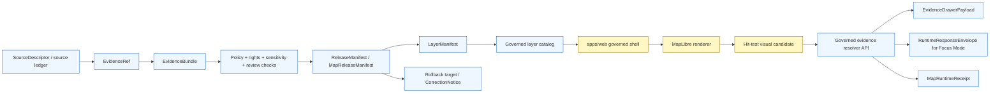

<!-- [KFM_META_BLOCK_V2]
doc_id: kfm://doc/NEEDS-VERIFICATION-ADR-0003-maplibre-renderer-boundary
title: ADR-0003: MapLibre Renderer Boundary
type: standard
version: v1.1-review
status: review
owners: OWNER_TBD_NEEDS_VERIFICATION
created: NEEDS_VERIFICATION
updated: 2026-05-06
policy_label: NEEDS_VERIFICATION
related: [
  ./README.md,
  ./ADR-TEMPLATE.md,
  ./ADR-0001-schema-home.md,
  ./ADR-0002-responsibility-root-monorepo.md,
  ./ADR-0206-maplibre-layer-manifest.md,
  ../../apps/web/README.md,
  ../../apps/web/package.json
]
tags: [
  kfm,
  adr,
  maplibre,
  renderer-boundary,
  map-shell,
  evidence-drawer,
  focus-mode,
  governed-api,
  layer-manifest,
  release,
  rollback,
  fail-closed
]
notes: [
  Revises the existing renderer-boundary ADR while preserving its core rule: MapLibre is a renderer and interaction runtime, not KFM truth authority.
  Existing repository evidence confirms the target ADR path, ADR index, ADR template, companion LayerManifest ADR path, and apps/web package/readme paths; enforcement remains NEEDS VERIFICATION.
  Previous metadata and adjacent ADR numbering signals require cleanup before this ADR is marked accepted: the old doc_id used ADR-0303 language, and the companion LayerManifest file path is ADR-0206 while its visible heading says ADR-0308.
  This ADR records architecture doctrine and validation burden; it does not claim current runtime, CI, policy, UI, release, cache, branch-protection, or workflow enforcement.
]
[/KFM_META_BLOCK_V2] -->

<a id="top"></a>

# ADR-0003: MapLibre Renderer Boundary

MapLibre may render governed map artifacts; it must never become KFM truth, policy, citation, release, review, rollback, or AI authority.

<p align="center">
  
  
  
  
</p>

<p align="center">
  <a href="#decision-summary">Decision</a> ·
  <a href="#repo-fit-and-evidence-boundary">Repo fit</a> ·
  <a href="#renderer-boundary">Boundary</a> ·
  <a href="#runtime-flow">Runtime flow</a> ·
  <a href="#validation-and-acceptance">Validation</a> ·
  <a href="#rollback-and-supersession">Rollback</a> ·
  <a href="#open-verification-backlog">Open verification</a>
</p>

> [!IMPORTANT]
> **Core rule:** rendered map state is not evidence. A MapLibre feature, popup, style rule, TileJSON source, PMTiles archive, hit test, browser cache, or layer toggle can help users inspect released artifacts. None of those objects may decide what KFM treats as true, public, cited, reviewed, corrected, withdrawn, or answerable by AI.

> [!CAUTION]
> **Implementation enforcement remains `NEEDS VERIFICATION`.** This ADR does not prove current route behavior, CI enforcement, schema validation, layer-release maturity, Evidence Drawer behavior, Focus Mode behavior, cache invalidation, public deployment posture, branch protection, or rollback execution.

---

## Decision summary

KFM records the MapLibre renderer boundary as a trust-preserving architecture rule:

> **MapLibre is a disciplined 2D renderer and interaction runtime. It is not the truth system.**

MapLibre may render released public-safe artifacts, expose viewport and selection context, and initiate governed evidence-resolution requests. It must not read RAW, WORK, QUARANTINE, unpublished candidate stores, canonical/internal evidence stores, steward-only stores, policy stores, release stores, proof stores, or model runtimes directly.

All consequential map claims must flow through governed KFM objects and interfaces such as `LayerManifest`, `EvidenceRef`, `EvidenceBundle`, `EvidenceDrawerPayload`, `RuntimeResponseEnvelope`, release manifests, policy decisions, receipts, correction notices, and rollback references.

| Field | Determination |
|---|---|
| Target path | `docs/adr/ADR-0003-maplibre-renderer-boundary.md` |
| Document status | `review` |
| Decision posture | `CONFIRMED doctrine / NEEDS VERIFICATION for acceptance and enforcement` |
| Core boundary | Renderer is downstream of evidence, policy, review, release, correction, and rollback. |
| Companion decision | `docs/adr/ADR-0206-maplibre-layer-manifest.md` |
| Web surface signal | `apps/web/package.json` declares MapLibre and PMTiles dependencies on `main`; this is package evidence, not runtime enforcement proof. |
| Public posture | Fail closed when evidence, rights, sensitivity, release state, source role, review state, correction state, or cache state is unclear. |
| Primary risk avoided | Polished maps, tiles, popups, or browser feature properties being mistaken for authoritative KFM claims. |

<p align="right"><a href="#top">Back to top ↑</a></p>

---

## Repo fit and evidence boundary

`docs/adr/` is the human-facing decision ledger for KFM. This ADR belongs here because it governs a public-client trust boundary and does not create a new root-level renderer, schema, policy, proof, release, or UI authority.

Directory discipline basis:

- ADRs belong under `docs/adr/`.
- `apps/web/` may implement the browser shell.
- `schemas/` owns machine-checkable shape after schema-home acceptance.
- `contracts/` owns semantic meaning.
- `policy/` owns admissibility decisions.
- `tests/` and `fixtures/` prove behavior.
- `release/`, `data/receipts/`, and `data/proofs/` remain separate trust-object homes.

### Current evidence snapshot

| Evidence item | Status | Supports | Does not prove |
|---|---:|---|---|
| `docs/adr/ADR-0003-maplibre-renderer-boundary.md` | `CONFIRMED repository file` | Target file exists and already records the renderer-not-truth rule. | Acceptance state, enforcement, CI, runtime behavior, or cache behavior. |
| `docs/adr/README.md` | `CONFIRMED repository file` | ADRs are KFM’s human-facing decision ledger; the index lists ADR-0003 as surfaced and needing verification. | Complete ADR inventory or enforcement maturity. |
| `docs/adr/ADR-TEMPLATE.md` | `CONFIRMED repository file` | ADRs must separate decision evidence from implementation proof and include validation, rollback, and supersession. | That this ADR is implemented. |
| `docs/adr/ADR-0001-schema-home.md` | `CONFIRMED repository file` | `schemas/contracts/v1/` is the proposed canonical machine-schema home; `contracts/` and `policy/` remain separate surfaces. | Accepted schema-home enforcement. |
| `docs/adr/ADR-0002-responsibility-root-monorepo.md` | `CONFIRMED repository file` | KFM uses responsibility roots and rejects root-level domain/topic sprawl. | Full root conformance or CI enforcement. |
| `docs/adr/ADR-0206-maplibre-layer-manifest.md` | `CONFIRMED repository file / companion ADR` | LayerManifest is the companion layer-facing contract decision. | Field finality, schema enforcement, or public release readiness. |
| `apps/web/package.json` | `CONFIRMED repository file` | Current package metadata declares `maplibre-gl`, `pmtiles`, Vite, Vitest, and npm package-manager expectations. | Installed dependency state, runtime behavior, security posture, or branch protection. |
| `apps/web/README.md` | `CONFIRMED repository file / draft` | The web shell is described as governed, map-first, and not a truth source. | That all described shell behavior is implemented. |
| Local mounted checkout | `UNKNOWN / not mounted in authoring workspace` | Local filesystem inspection did not expose a Git checkout. | Absence of repository; GitHub connector evidence confirms current remote file access. |

### Truth labels used in this ADR

| Label | Meaning |
|---|---|
| `CONFIRMED` | Verified from current repository connector evidence, supplied doctrine, or direct source material. |
| `PROPOSED` | Implementation shape, validation gate, path integration, or contract integration not yet proven as current behavior. |
| `UNKNOWN` | Not verified strongly enough to claim. |
| `NEEDS VERIFICATION` | A concrete repository, CI, runtime, policy, source-rights, release, owner, or branch-protection check is required. |
| `DENY` | Operation must not proceed under current evidence or policy state. |
| `ABSTAIN` | System should refuse to make a claim because support is insufficient. |
| `ERROR` | Tool, validation, environment, or runtime failure. |

<p align="right"><a href="#top">Back to top ↑</a></p>

---

## Scope and non-goals

### In scope

This ADR governs:

- MapLibre’s role in the KFM web shell.
- Renderer, style, source, tile, PMTiles, TileJSON, feature-property, popup, hit-test, and browser-cache boundaries.
- Browser-to-governed-API boundaries for map interactions.
- Evidence Drawer and Focus Mode map-context handoff constraints.
- Public-safe map behavior, denied states, stale states, correction states, and rollback visibility.
- Required validation gates that prevent renderer truth leakage.

### Out of scope

This ADR does **not** decide:

- The complete `LayerManifest.v1` schema. See `ADR-0206-maplibre-layer-manifest.md`.
- Canonical schema home. See `ADR-0001-schema-home.md`.
- Responsibility-root layout. See `ADR-0002-responsibility-root-monorepo.md`.
- Exact MapLibre package upgrade cadence or security pinning.
- Full UI component tree, route names, backend framework, test runner, CI workflow, deployment topology, or hosting posture.
- Cesium, 3D, globe, terrain, or story-scene admission beyond the same renderer-not-truth principle.
- Publication approval of any specific public layer.

<p align="right"><a href="#top">Back to top ↑</a></p>

---

## Renderer boundary

### Core rule

> **A rendered feature is a visual candidate, not an authoritative KFM claim.**

MapLibre may render a released layer and return interaction context. The governed API must resolve the candidate into evidence, policy state, review state, release state, correction state, and finite UI/runtime outcomes before the UI presents a consequential claim.

### Allowed renderer responsibilities

| MapLibre may… | Required condition |
|---|---|
| Render released public-safe layer artifacts. | Layer is admitted through a governed catalog or released manifest bundle. |
| Apply approved styles, sprites, glyphs, and icons. | Assets are versioned and do not silently encode policy or evidence authority. |
| Display trust cues and negative states. | Cues are driven by governed payloads or released manifests. |
| Expose viewport, camera, active layer, visible feature, and hit-test state. | These are runtime context, not proof. |
| Identify a clicked or hovered visual candidate. | Candidate must be resolved through a governed API before consequential claim output. |
| Support compare, timeline, story, and export-preview interactions. | Outputs preserve evidence, policy, review, release, correction, and rollback context. |
| Cache released public-safe artifacts. | Cache invalidation and rollback behavior are release-aware. |

### Denied renderer responsibilities

| MapLibre must never… | Reason |
|---|---|
| Read RAW, WORK, QUARANTINE, unpublished candidate, canonical/internal, steward-only, proof-pack, review-only, or model-runtime stores directly. | Violates lifecycle and public-client trust membrane. |
| Decide source authority, source role, evidence sufficiency, or citation validity. | Evidence authority belongs upstream. |
| Decide rights, sensitivity, access, redaction, exact-geometry exposure, or public release eligibility. | Policy and steward review are not renderer duties. |
| Treat style JSON, TileJSON, vector tile properties, PMTiles metadata, browser cache, or popups as canonical truth. | They are derived carriers. |
| Hide sensitive features only through client-side filters. | Client-side hiding can leak geometry, counts, and existence signals. |
| Let popups make uncited consequential claims. | Evidence Drawer or equivalent governed payload must carry support. |
| Let Focus Mode answer from raw map properties. | AI must use governed API context and citation validation. |
| Publish, promote, withdraw, correct, or roll back a layer. | Publication is a governed state transition. |
| Strip trust cues during export or sharing. | Outward artifacts must preserve provenance and policy context. |

> [!WARNING]
> Client-side omission is not proof of public safety. Sensitive material must be removed, generalized, redacted, embargoed, or denied upstream before public artifacts are released.

<p align="right"><a href="#top">Back to top ↑</a></p>

---

## Runtime flow



### Interaction sequence

1. A released layer is exposed through a governed layer catalog or released manifest bundle.
2. The web shell loads the layer contract and rendering artifacts.
3. MapLibre renders the layer and captures visual interaction state.
4. A user click or hover produces a candidate feature context.
5. The candidate is sent to a governed evidence resolver.
6. The resolver returns an `EvidenceDrawerPayload`, a safe negative state, or an error.
7. Focus Mode may use active map context only through a governed `RuntimeResponseEnvelope`.
8. Runtime receipts, correction state, and rollback references remain inspectable when required.

### Runtime outcome grammar

| Outcome | Map-shell behavior |
|---|---|
| `ANSWER` | Show evidence-bounded result with citations, scope echo, release state, and audit reference. |
| `ABSTAIN` | Explain that support is insufficient or stale for the active map/time scope. |
| `DENY` | Show policy-safe denial state without leaking restricted detail. |
| `ERROR` | Preserve map context and display validation/runtime failure category. |

<p align="right"><a href="#top">Back to top ↑</a></p>

---

## Relationship to LayerManifest

`ADR-0206-maplibre-layer-manifest.md` governs the narrower layer contract. This ADR governs the broader renderer boundary.

| Question | This ADR | Companion LayerManifest ADR |
|---|---|---|
| Can MapLibre be truth authority? | No. Renderer is downstream of trust. | Assumes renderer is downstream. |
| What admits a layer to the shell? | A governed catalog or released manifest path. | `LayerManifest.v1` is the layer-facing contract. |
| Can style JSON or TileJSON stand alone as KFM layer authority? | No. | Explains why manifest binding is required. |
| Can feature clicks become claims? | No, not without governed resolution. | Defines evidence and popup behavior expectations. |
| Can Focus Mode answer from map properties? | No. | Defines Focus eligibility in layer manifest. |
| How are trust badges and negative states declared? | Must be governed and visible. | Declared through manifest field families. |

### Boundary handoff

```text
LayerManifest says what may be rendered.
Renderer shows it.
Governed API resolves what it means.
Evidence Drawer explains why.
Focus Mode answers only when evidence and policy permit.
Release and rollback decide public availability.
```

> [!NOTE]
> Companion ADR numbering needs cleanup before stable publication. The repository path is `ADR-0206-maplibre-layer-manifest.md`, while the visible heading in that file currently says `ADR-0308 — MapLibre Layer Manifest`.

<p align="right"><a href="#top">Back to top ↑</a></p>

---

## Required boundary contracts

The following contract families are required or expected for mature enforcement. Exact schema homes, file names, and field names remain `NEEDS VERIFICATION` until confirmed against repository conventions.

| Contract / object family | Purpose | Renderer-boundary requirement |
|---|---|---|
| `SourceDescriptor` | Source identity, role, rights, cadence, access, and sensitivity. | Renderer cannot infer source authority from map data. |
| `EvidenceRef` | Stable pointer to evidence support. | Renderer may carry references but cannot resolve meaning itself. |
| `EvidenceBundle` | Resolved support package for claims. | Consequential map claims need bundle closure. |
| `LayerManifest` | Layer-facing render/evidence/policy/release contract. | Required for public/semi-public layers. |
| `TileArtifactManifest` | Tile, PMTiles, raster, or vector artifact identity and digest. | Render artifact identity is separate from truth. |
| `StyleManifest` | Style identity, digest, accessibility, and meaning-change controls. | Style cannot silently change semantic meaning. |
| `MapReleaseManifest` | Release grouping for layer/style/artifact set. | Public availability is release-bound. |
| `EvidenceDrawerPayload` | User-facing evidence, policy, review, release, and correction state. | Popups cannot replace the Drawer. |
| `MapContextEnvelope` | Active map, time, layer, selection, role, and release context. | Focus Mode context must be bounded. |
| `RuntimeResponseEnvelope` | Finite `ANSWER`, `ABSTAIN`, `DENY`, `ERROR` response. | AI and synthesis outputs must be finite and auditable. |
| `MapRuntimeReceipt` | Runtime audit record for evidence resolution and UI interactions. | Important interactions should be traceable. |
| `CorrectionNotice` | Correction, withdrawal, supersession, or public notice. | Renderer must show corrected/withdrawn state. |
| `RollbackCard` | Restore target and rollback instructions. | Bad releases must be reversible without deleting history. |

<p align="right"><a href="#top">Back to top ↑</a></p>

---

## Policy, rights, and sensitivity posture

The renderer boundary is especially important for high-risk material.

| Risk area | Renderer rule |
|---|---|
| Archaeology and cultural sites | Public exact locations are denied by default unless reviewed, generalized, and released through policy. |
| Rare species and sensitive ecological locations | Exact geometry must not be exposed through client-side hiding or raw tile properties. |
| Critical infrastructure | Public precision and facility details require explicit policy and release state. |
| Living-person, DNA, genealogy, and land ownership material | Map interactions must not expose private or unresolved identity/location claims. |
| Hazards and operational context | KFM maps must not become emergency alerting or life-safety instructions. |
| Rights-unclear sources | Public rendering is denied until rights and attribution are resolved. |
| Stale sources | Stale state must be visible; Focus Mode should abstain or bound context where policy requires. |
| Corrected or withdrawn releases | Renderer must show correction/withdrawal state and must not serve stale caches as current truth. |

<p align="right"><a href="#top">Back to top ↑</a></p>

---

## Validation and acceptance

A renderer-boundary implementation is credible only when it fails closed under negative-path tests.

### Required validation gates

| Gate | Required behavior | Failure outcome |
|---|---|---|
| No public raw path | Browser bundle and routes cannot reach RAW, WORK, QUARANTINE, unpublished candidate, canonical/internal, steward-only, or proof-only stores. | CI failure or `DENY` public release. |
| No direct model client | Browser code cannot call Ollama, OpenAI-compatible endpoints, or any model runtime directly. | CI failure. |
| Manifest-gated layers | Public/semi-public layers must come from governed manifest/catalog path. | Layer unavailable; no ad hoc render-as-truth fallback. |
| Evidence closure | Clicked features resolve to `EvidenceDrawerPayload` or visible negative state. | `ABSTAIN`, `DENY`, or `ERROR`. |
| Popup restraint | Popups cannot display consequential uncited claims. | Test failure or claim hidden behind Drawer action. |
| Sensitive geometry denial | Sensitive exact geometry cannot be rendered publicly without policy-reviewed release. | `DENY`; layer blocked or generalized. |
| Stale-state visibility | Stale layers show stale indicators and Focus behavior is bounded. | Test failure. |
| Correction visibility | Corrected, superseded, or withdrawn layers show visible state. | Release blocked or UI smoke failure. |
| Cache rollback | Withdrawn/corrected release invalidates or bypasses stale cache. | Release blocked. |
| Style meaning-change review | Style changes that affect classification, color meaning, opacity meaning, or trust cues require review. | Hold review or CI failure. |
| Accessibility | Trust cues are not color-only and are keyboard/screen-reader reachable. | Hold or CI failure. |
| Export preservation | Export/share views preserve evidence, policy, release, correction, and generalization state. | Export blocked. |

### Minimum no-network fixture set

| Fixture | Purpose |
|---|---|
| `released_layer_manifest.valid.json` | Happy-path public-safe layer. |
| `missing_evidence.invalid.json` | Feature without resolvable evidence. |
| `sensitive_geometry.denied.json` | Sensitive exact geometry denied or generalized. |
| `stale_source.abstain.json` | Stale source visible with Focus abstention. |
| `withdrawn_release.denied.json` | Withdrawn layer cannot render as current. |
| `popup_claim.invalid.json` | Popup attempts unsupported claim. |
| `focus_answer.valid.json` | Focus `ANSWER` with citations. |
| `focus_abstain.valid.json` | Focus `ABSTAIN` due to insufficient support. |
| `focus_deny.valid.json` | Focus `DENY` due to policy. |
| `focus_error.valid.json` | Focus `ERROR` due to runtime/validation failure. |
| `no_public_raw_path.invalid.json` | Browser path tries to read internal lifecycle stage. |
| `export_preserves_trust.valid.json` | Export keeps trust metadata visible. |

### Illustrative static checks

> [!NOTE]
> These checks are illustrative examples only. Adapt them to the repository’s verified scripts, package manager, source layout, and test framework before using them as implementation evidence.

```bash
# Pseudocode / illustrative only.
# Browser code must not import raw/work/quarantine/canonical/internal stores.
rg -n "data/(raw|work|quarantine)|canonical|internal_store|steward_only" apps/web packages ui web \
  && echo "Forbidden browser data path found" && exit 1

# Browser code must not contain direct model-runtime clients.
rg -n "ollama|/api/generate|/api/chat|openai|chat/completions|localhost:11434" apps/web packages ui web \
  && echo "Direct model runtime path found in browser surface" && exit 1

# Reviewer check: addSource/addLayer calls should be mediated by a KFM-owned adapter
# and governed layer contract, not ad hoc style or source loading.
rg -n "new maplibregl.Map|addSource|addLayer" apps/web src packages ui web 2>/dev/null || true
```

<p align="right"><a href="#top">Back to top ↑</a></p>

---

## Impact map

| Area | Expected update | Status |
|---|---|---|
| `docs/adr/ADR-0003-maplibre-renderer-boundary.md` | Replace or revise current ADR with this version. | `PROPOSED change` |
| `docs/adr/README.md` | Confirm this ADR entry, status, title, and numbering. | `NEEDS VERIFICATION` |
| `docs/adr/ADR-0206-maplibre-layer-manifest.md` | Cross-link as companion ADR and reconcile visible `ADR-0308` heading. | `NEEDS VERIFICATION` |
| `docs/adr/ADR-0001-schema-home.md` | Keep schema-home dependency visible. | `CONFIRMED related ADR / no direct change required by this ADR` |
| `docs/adr/ADR-0002-responsibility-root-monorepo.md` | Keep responsibility-root basis visible. | `CONFIRMED related ADR / no direct change required by this ADR` |
| `apps/web/README.md` | Reference this renderer-boundary rule in runtime boundaries and no-bypass sections. | `PROPOSED` |
| `apps/web/package.json` | No immediate change required by this ADR; dependency upgrades should respect this boundary. | `CONFIRMED file / no direct change required` |
| `schemas/` | Add or verify schemas for manifest, drawer payload, focus envelope, and runtime receipts if not present. | `NEEDS VERIFICATION` |
| `contracts/` | Add or verify semantic contracts explaining renderer, layer, drawer, focus, release, and rollback boundaries. | `NEEDS VERIFICATION` |
| `policy/` | Add or verify no-public-raw-path, sensitive-geometry, stale-source, and direct-model-deny policies. | `PROPOSED` |
| `tests/` / `fixtures/` | Add no-network fixture and negative-path tests. | `PROPOSED` |
| `tools/validators/` | Add or verify static no-bypass and manifest-closure validators. | `PROPOSED` |
| `release/` / `data/proofs/` / `data/receipts/` | Verify release, proof, receipt, correction, and rollback references for public map layers. | `NEEDS VERIFICATION` |

<p align="right"><a href="#top">Back to top ↑</a></p>

---

## Options considered

| Option | Outcome | Reason |
|---|---|---|
| Let MapLibre style JSON define layer meaning. | Rejected | Style JSON is rendering configuration, not source authority, policy, release, citation, or evidence closure. |
| Let TileJSON or PMTiles metadata define layer authority. | Rejected | Tile metadata is artifact metadata, not KFM trust state. |
| Let popups be the primary evidence surface. | Rejected | Popups are too small, easy to overread, and easy to fill with unsupported text. |
| Let browser code call canonical stores directly. | Rejected | Violates public-client and lifecycle boundaries. |
| Let browser code call model runtime directly. | Rejected | AI must be behind governed API, evidence resolution, policy checks, citation validation, and finite envelopes. |
| Require public layers to enter through governed manifest/catalog path. | Accepted direction | Preserves release, evidence, policy, correction, and rollback inspectability. |
| Allow client-side hiding as the primary sensitivity control. | Rejected | It risks existence, count, and geometry leakage. |
| Treat renderer as downstream interaction runtime. | Accepted direction | Keeps maps useful without weakening KFM trust law. |

<p align="right"><a href="#top">Back to top ↑</a></p>

---

## Rollback and supersession

### Rollback plan

If implementation of this ADR causes breakage, revert implementation files while preserving this ADR as renderer-boundary doctrine unless a successor ADR explicitly supersedes it.

Rollback must not:

- grant public browser access to RAW, WORK, QUARANTINE, canonical/internal, steward-only, proof-only, or model-runtime stores;
- let popups or map feature properties become authoritative claim surfaces;
- hide corrected or withdrawn release history;
- delete receipts, proofs, correction notices, or rollback records.

### Rollback triggers

| Trigger | Required action |
|---|---|
| Browser bypasses governed API. | Disable affected route/component; block public release; add no-bypass test. |
| Sensitive geometry appears in public map. | Withdraw or generalize layer; emit correction/transform receipt; invalidate cache. |
| Focus Mode uses raw layer properties or direct model client. | Disable Focus entry point; require governed API mediation. |
| Style change alters meaning without review. | Revert style or hold release until review/proof closure. |
| Evidence Drawer cannot resolve selected feature. | Show `ABSTAIN`/`ERROR`; do not show claim text. |
| Cache serves withdrawn release. | Invalidate cache; restore prior release target; record correction. |

### Supersession rule

This ADR may be superseded only by a later ADR that preserves or strengthens the renderer-not-truth boundary. A successor must include:

- evidence basis,
- migration path,
- no-public-bypass validation,
- sensitive-geometry policy,
- Focus Mode boundary,
- release and rollback behavior,
- index cleanup,
- correction lineage.

<p align="right"><a href="#top">Back to top ↑</a></p>

---

## Open verification backlog

| Item | Status | Why it matters |
|---|---|---|
| ADR index listing and acceptance state | `NEEDS VERIFICATION` | `docs/adr/README.md` should list this ADR with the correct status and successor links. |
| Target ADR metadata ID | `NEEDS VERIFICATION` | Previous target metadata used an `ADR-0303` doc-id pattern; this revision uses a reviewable placeholder instead of fabricating a stable ID. |
| Companion ADR numbering | `NEEDS VERIFICATION` | Companion file path is `ADR-0206`, but visible heading says `ADR-0308`; index alignment is needed. |
| Final owners / CODEOWNERS | `NEEDS VERIFICATION` | UI, API, policy, release, and documentation reviewers may differ. |
| Runtime adapter path | `UNKNOWN` | Need to verify where MapLibre adapter code lives. |
| Governed API route names | `UNKNOWN` | Do not invent route names without current API evidence. |
| Layer manifest schema home | `NEEDS VERIFICATION` | Use ADR-0001-compatible schema authority; avoid parallel schema homes. |
| Existing Evidence Drawer implementation | `UNKNOWN` | Need current component/contract evidence. |
| Existing Focus Mode implementation | `UNKNOWN` | Need to verify governed API and no-direct-model-client behavior. |
| No-public-raw-path enforcement | `UNKNOWN` | Must be proven with tests, validators, or CI. |
| Sensitive geometry policy enforcement | `UNKNOWN` | Must fail closed before public layers. |
| Release-aware cache invalidation | `UNKNOWN` | Required for correction/withdrawal safety. |
| Accessibility tests for trust cues | `UNKNOWN` | Trust badges cannot be color-only or pointer-only. |
| Current CI workflow coverage | `UNKNOWN` | Enforcement claims require workflow evidence. |
| Runtime receipts / proof objects | `UNKNOWN` | Interaction auditability remains unproven until artifacts exist. |
| Public deployment posture | `UNKNOWN` | Local exposure, firewall, reverse proxy, CSP/CORS, and access controls need verification. |

<p align="right"><a href="#top">Back to top ↑</a></p>

---

## Review checklist

<details>
<summary>Pre-merge checklist</summary>

- [ ] ADR title, file name, meta block title, and ADR index entry are aligned.
- [ ] Metadata `doc_id`, owners, created date, policy label, and related links are verified or deliberately left as reviewable placeholders.
- [ ] Companion `ADR-0206` / visible `ADR-0308` mismatch is addressed or tracked.
- [ ] This ADR is cross-linked to `ADR-0206-maplibre-layer-manifest.md`.
- [ ] No section claims runtime behavior without repo/test/workflow/artifact evidence.
- [ ] Renderer is described as downstream of trust, not as policy/evidence/release authority.
- [ ] Public-client boundary excludes RAW, WORK, QUARANTINE, canonical/internal, steward-only, proof-only, and model-runtime stores.
- [ ] Focus Mode boundary excludes direct browser model-runtime calls.
- [ ] Popups are not described as primary evidence surfaces.
- [ ] Sensitive geometry and rights-unclear sources fail closed.
- [ ] Stale, corrected, withdrawn, denied, generalized, and restricted states remain visible.
- [ ] Validation plan includes negative-path tests.
- [ ] Rollback plan preserves correction history and release lineage.
- [ ] Impact map lists docs, schemas, contracts, policy, tests, validators, release, and apps surfaces.
- [ ] Open verification backlog is specific and actionable.

</details>

---

## Final decision

KFM records the MapLibre renderer boundary:

> **Rendering is not evidence. Hit testing is not a claim. Style is not policy. Tiles are not provenance. Popups are not the Evidence Drawer. The browser is not the canonical store. Focus Mode is not a direct model client.**

The map shell remains central to KFM as a governed, evidence-aware interface — not as a shortcut around the trust membrane.

<p align="right"><a href="#top">Back to top ↑</a></p><!-- [KFM_META_BLOCK_V2]
doc_id: kfm://adr/ADR-0303-maplibre-renderer-boundary
title: ADR-0003: MapLibre Renderer Boundary
type: architecture-decision-record
version: v1.0-review
status: review
owners: OWNER_TBD_NEEDS_VERIFICATION
created: NEEDS_VERIFICATION
updated: 2026-05-06
policy_label: NEEDS_VERIFICATION
related: [
  ./README.md,
  ./ADR-0001-schema-home.md,
  ./ADR-0201-policy-home.md,
  ./ADR-0002-responsibility-root-monorepo.md,
  ./ADR-0203-source-ledger-authority.md,
  ./ADR-0206-maplibre-layer-manifest.md,
  ./ADR-0207-governed-ai-runtime-envelope.md,
  ../../apps/web/README.md,
  ../../apps/web/package.json
]
tags: [
  kfm,
  adr,
  maplibre,
  renderer-boundary,
  map-shell,
  evidence-drawer,
  focus-mode,
  governed-api,
  layer-manifest,
  evidence,
  policy,
  release,
  rollback,
  fail-closed
]
notes: [
  Expands the existing ADR-0303 renderer-boundary stub while preserving its core rule: Map renderer cannot be truth authority.
  ADR acceptance state remains NEEDS VERIFICATION because docs/adr/README.md index alignment and ADR-0303 numbering collision require cleanup.
  ADR-0308 remains the companion LayerManifest.v1 decision record.
  This ADR records architecture doctrine and expected validation gates; it does not claim current runtime, CI, policy, UI, release, cache, or workflow enforcement.
]
[/KFM_META_BLOCK_V2] -->

<a id="top"></a>

# ADR-0003: MapLibre Renderer Boundary

<p align="center">
  <strong>MapLibre may render governed map artifacts. It must never become the truth, policy, citation, release, review, rollback, or AI authority.</strong>
</p>

<p align="center">
  
  
  
  
</p>

<p align="center">
  <a href="#decision-summary">Decision</a> ·
  <a href="#evidence-boundary">Evidence boundary</a> ·
  <a href="#renderer-boundary">Renderer boundary</a> ·
  <a href="#runtime-flow">Runtime flow</a> ·
  <a href="#validation-and-acceptance">Validation</a> ·
  <a href="#rollback-and-supersession">Rollback</a> ·
  <a href="#open-verification-backlog">Open verification</a>
</p>

> [!IMPORTANT]
> **Core rule:** a map renderer cannot be KFM truth authority.
>
> MapLibre GL JS, styles, PMTiles, TileJSON, vector tiles, feature properties, popups, filters, hit tests, camera state, and browser caches are downstream carriers. They can help users see and select released map artifacts, but they cannot decide what is true, cited, public, safe, reviewed, released, corrected, withdrawn, or answerable by AI.

> [!CAUTION]
> **Implementation enforcement remains `NEEDS VERIFICATION`.** This ADR does not prove current route behavior, CI enforcement, schema validation, layer-release maturity, Evidence Drawer behavior, Focus Mode behavior, cache invalidation, public deployment posture, or rollback execution.

---

## Decision summary

KFM records the MapLibre renderer boundary as a trust-preserving architecture rule:

> **MapLibre is a disciplined 2D renderer and interaction runtime. It is not the truth system.**

MapLibre may render released public-safe artifacts, expose viewport and selection context, and initiate governed evidence-resolution requests. It must not read RAW, WORK, QUARANTINE, unpublished candidate stores, canonical/internal evidence stores, steward-only stores, policy stores, release stores, or model runtimes directly.

All consequential map claims must flow through governed KFM objects and interfaces such as `LayerManifest`, `EvidenceRef`, `EvidenceBundle`, `EvidenceDrawerPayload`, `RuntimeResponseEnvelope`, release manifests, policy decisions, receipts, correction notices, and rollback references.

| Field | Determination |
|---|---|
| Target path | `docs/adr/ADR-0003-maplibre-renderer-boundary.md` |
| ADR file state | `review` |
| Decision posture | `CONFIRMED doctrine / NEEDS VERIFICATION for ADR index acceptance state` |
| Core boundary | Renderer is downstream of evidence, policy, review, release, correction, and rollback. |
| Companion ADR | `ADR-0206-maplibre-layer-manifest.md` |
| Public posture | Fail closed when evidence, rights, sensitivity, release state, source role, review state, or correction state is unclear. |
| Primary risk avoided | Polished maps, tiles, popups, or client feature properties being mistaken for authoritative KFM claims. |
| Implementation proof | `UNKNOWN` until repo tests, workflows, runtime logs, validators, manifests, or emitted proof objects confirm enforcement. |

<p align="right"><a href="#top">Back to top ↑</a></p>

---

## Evidence boundary

This ADR separates repository evidence, KFM doctrine, companion decisions, and implementation claims.

| Evidence item | Status | Supports | Does not prove |
|---|---|---|---|
| Existing target file | `CONFIRMED repository file` | `docs/adr/ADR-0003-maplibre-renderer-boundary.md` exists and records the terse rule: “Map renderer cannot be truth authority.” | Full rationale, enforcement, CI, runtime behavior, or ADR index status. |
| ADR template | `CONFIRMED repository file` | KFM ADRs should record evidence, scope, policy impact, validation, rollback, supersession, and explicit implementation-proof boundaries. | That this ADR is currently enforced. |
| `ADR-0206-maplibre-layer-manifest.md` | `CONFIRMED repository file / companion decision` | `LayerManifest.v1` is the companion layer-facing contract decision. | That layer manifests are fully implemented, validated, or release-enforced. |
| `apps/web/package.json` | `CONFIRMED repository file` | The web app package currently declares MapLibre and PMTiles dependencies. | Runtime maturity, public deployment behavior, branch protection, or UI trust enforcement. |
| `apps/web/README.md` | `CONFIRMED repository file / draft` | The web shell is described as governed, map-first, and not a truth source. | That all described shell behavior is implemented. |
| Directory Rules / responsibility-root doctrine | `CONFIRMED doctrine` | ADRs belong under `docs/adr/`; repo roots are responsibility boundaries; compatibility roots require explicit status. | Runtime behavior or enforcement maturity. |
| Current workflows, dashboards, proof packs, branch protections, runtime traces | `UNKNOWN` | Required for implementation claims. | Nothing until verified. |

### Truth labels in this ADR

| Label | Meaning |
|---|---|
| `CONFIRMED` | Verified from current repository connector evidence, supplied doctrine, or directly inspected source material. |
| `PROPOSED` | Implementation shape, validation gate, file path, or contract integration not yet proven as current behavior. |
| `UNKNOWN` | Not verified strongly enough to claim. |
| `NEEDS VERIFICATION` | A concrete repository, CI, runtime, policy, source-rights, or release check is required. |
| `DENY` | Operation must not proceed under current evidence or policy state. |
| `ABSTAIN` | System should refuse to make a claim because support is insufficient. |
| `ERROR` | Tool, validation, environment, or runtime failure. |

<p align="right"><a href="#top">Back to top ↑</a></p>

---

## Scope and non-goals

### In scope

This ADR governs:

- MapLibre’s role in the KFM web shell.
- Renderer, style, tile, PMTiles, TileJSON, feature-property, popup, hit-test, and cache boundaries.
- Browser-to-governed-API boundaries for map interactions.
- Evidence Drawer and Focus Mode map-context handoff constraints.
- Public-safe map behavior, denied states, stale states, correction states, and rollback visibility.
- Required validation gates that prevent renderer truth leakage.

### Out of scope

This ADR does **not** decide:

- The complete `LayerManifest.v1` schema. See `ADR-0206-maplibre-layer-manifest.md`.
- Canonical schema home. See `ADR-0001-schema-home.md`.
- Canonical policy home. See `ADR-0201-policy-home.md`.
- Source-ledger authority. See `ADR-0203-source-ledger-authority.md` or its renumbered successor after ADR cleanup.
- Exact MapLibre package version, upgrade cadence, or security pinning.
- Full UI component tree, route names, backend framework, test runner, CI workflow, or deployment topology.
- Cesium, 3D, globe, terrain, or story-scene admission beyond the same renderer-not-truth principle.
- Publication approval of any specific public layer.

<p align="right"><a href="#top">Back to top ↑</a></p>

---

## Renderer boundary

### Core rule

> **A rendered feature is a visual candidate, not an authoritative KFM claim.**

MapLibre may render a released layer and return interaction context. The governed API must resolve the candidate into evidence, policy state, review state, release state, correction state, and finite UI/runtime outcomes before the UI presents a consequential claim.

### Allowed renderer responsibilities

| MapLibre may… | Required condition |
|---|---|
| Render released public-safe layer artifacts. | Layer is admitted through a governed catalog or released manifest bundle. |
| Apply approved styles. | Style assets are versioned and do not silently encode policy or evidence. |
| Display trust cues and negative states. | Cues are driven by governed payloads or released manifests. |
| Expose viewport, camera, active layer, visible feature, and hit-test state. | These are runtime context, not proof. |
| Identify a clicked or hovered visual candidate. | Candidate must be resolved through a governed API before consequential claim output. |
| Support compare, timeline, story, and export preview interactions. | Outputs preserve evidence, policy, review, release, correction, and rollback context. |
| Cache released public-safe artifacts. | Cache invalidation and rollback behavior are release-aware. |

### Denied renderer responsibilities

| MapLibre must never… | Reason |
|---|---|
| Read RAW, WORK, QUARANTINE, unpublished candidate, canonical/internal, steward-only, or model-runtime stores directly. | Violates lifecycle and public-client trust membrane. |
| Decide source authority, source role, evidence sufficiency, or citation validity. | Evidence authority belongs upstream. |
| Decide rights, sensitivity, access, redaction, exact-geometry exposure, or public release eligibility. | Policy and steward review are not renderer duties. |
| Treat style JSON, TileJSON, vector tile properties, PMTiles metadata, or popups as canonical truth. | They are derived carriers. |
| Hide sensitive features only through client-side filters. | Client-side hiding can leak geometry, counts, and existence signals. |
| Let popups make uncited consequential claims. | Evidence Drawer or equivalent governed payload must carry support. |
| Let Focus Mode answer from raw map properties. | AI must use governed API context and citation validation. |
| Publish, promote, withdraw, correct, or roll back a layer. | Publication is a governed state transition. |
| Strip trust cues during export or sharing. | Outward artifacts must preserve provenance and policy context. |

<p align="right"><a href="#top">Back to top ↑</a></p>

---

## Runtime flow


### Interaction sequence

1. A released layer is exposed through a governed layer catalog or released manifest bundle.
2. The web shell loads the layer contract and rendering artifacts.
3. MapLibre renders the layer and captures visual interaction state.
4. A user click or hover produces a candidate feature context.
5. The candidate is sent to a governed evidence resolver.
6. The resolver returns an `EvidenceDrawerPayload`, a safe negative state, or an error.
7. Focus Mode may use the active map context only through a governed `RuntimeResponseEnvelope`.
8. Runtime receipts, correction state, and rollback references remain inspectable when required.

### Runtime outcome grammar

| Outcome | Map-shell behavior |
|---|---|
| `ANSWER` | Show evidence-bounded result with citations, scope echo, release state, and audit reference. |
| `ABSTAIN` | Explain that support is insufficient or stale for the active map/time scope. |
| `DENY` | Show policy-safe denial state without leaking restricted detail. |
| `ERROR` | Preserve map context and display validation/runtime failure category. |

<p align="right"><a href="#top">Back to top ↑</a></p>

---

## Relationship to LayerManifest

`ADR-0206-maplibre-layer-manifest.md` governs the narrower layer contract. This ADR governs the broader renderer boundary.

| Question | This ADR | ADR-0308 |
|---|---|---|
| Can MapLibre be truth authority? | No. Renderer is downstream of trust. | Assumes renderer is downstream. |
| What admits a layer to the shell? | A governed catalog or released manifest path. | `LayerManifest.v1` is the layer-facing contract. |
| Can style JSON or TileJSON stand alone as KFM layer authority? | No. | Explains why manifest binding is required. |
| Can feature clicks become claims? | No, not without governed resolution. | Defines evidence and popup behavior expectations. |
| Can Focus Mode answer from map properties? | No. | Defines Focus eligibility in layer manifest. |
| How are trust badges and negative states declared? | Must be governed and visible. | Declared through manifest field families. |

### Boundary handoff

```text
LayerManifest says what may be rendered.
Renderer shows it.
Governed API resolves what it means.
Evidence Drawer explains why.
Focus Mode answers only when evidence and policy permit.
Release and rollback decide public availability.
```

<p align="right"><a href="#top">Back to top ↑</a></p>

---

## Required boundary contracts

The following contract families are required or expected for mature enforcement. Exact schema homes, file names, and field names remain `NEEDS VERIFICATION` until confirmed against repository conventions.

| Contract / object family | Purpose | Renderer-boundary requirement |
|---|---|---|
| `SourceDescriptor` | Source identity, role, rights, cadence, access, and sensitivity. | Renderer cannot infer source authority from map data. |
| `EvidenceRef` | Stable pointer to evidence support. | Renderer may carry references but cannot resolve meaning itself. |
| `EvidenceBundle` | Resolved support package for claims. | Consequential map claims need bundle closure. |
| `LayerManifest` | Layer-facing render/evidence/policy/release contract. | Required for public/semi-public layers. |
| `TileArtifactManifest` | Tile, PMTiles, raster, or vector artifact identity and digest. | Render artifact identity is separate from truth. |
| `StyleManifest` | Style identity, digest, accessibility, and meaning-change controls. | Style cannot silently change semantic meaning. |
| `MapReleaseManifest` | Release grouping for layer/style/artifact set. | Public availability is release-bound. |
| `EvidenceDrawerPayload` | User-facing evidence, policy, review, release, and correction state. | Popups cannot replace the Drawer. |
| `MapContextEnvelope` | Active map, time, layer, selection, role, and release context. | Focus Mode context must be bounded. |
| `RuntimeResponseEnvelope` | Finite `ANSWER`, `ABSTAIN`, `DENY`, `ERROR` response. | AI and synthesis outputs must be finite and auditable. |
| `MapRuntimeReceipt` | Runtime audit record for evidence resolution and UI interactions. | Important interactions should be traceable. |
| `CorrectionNotice` | Correction, withdrawal, supersession, or public notice. | Renderer must show corrected/withdrawn state. |
| `RollbackCard` | Restore target and rollback instructions. | Bad releases must be reversible without deleting history. |

<p align="right"><a href="#top">Back to top ↑</a></p>

---

## Policy, rights, and sensitivity posture

The renderer boundary is especially important for high-risk material.

| Risk area | Renderer rule |
|---|---|
| Archaeology and cultural sites | Public exact locations are denied by default unless reviewed, generalized, and released through policy. |
| Rare species and sensitive ecological locations | Exact geometry must not be exposed through client-side hiding or raw tile properties. |
| Critical infrastructure | Public precision and facility details require explicit policy and release state. |
| Living-person, DNA, genealogy, and land ownership material | Map interactions must not expose private or unresolved identity/location claims. |
| Hazards and operational context | KFM maps must not become emergency alerting or life-safety instructions. |
| Rights-unclear sources | Public rendering is denied until rights and attribution are resolved. |
| Stale sources | Stale state must be visible; Focus Mode should abstain or bound context where policy requires. |
| Corrected or withdrawn releases | Renderer must show correction/withdrawal state and must not serve stale caches as current truth. |

> [!WARNING]
> Client-side omission is not proof of public safety. Sensitive material must be removed, generalized, redacted, or denied upstream before public artifacts are released.

<p align="right"><a href="#top">Back to top ↑</a></p>

---

## Validation and acceptance

A renderer-boundary implementation is credible only when it fails closed under negative-path tests.

### Required validation gates

| Gate | Required behavior | Failure outcome |
|---|---|---|
| No public raw path | Browser bundle and routes cannot reach RAW, WORK, QUARANTINE, unpublished candidate, or canonical/internal stores. | CI failure or `DENY` public release. |
| No direct model client | Browser code cannot call Ollama, OpenAI-compatible endpoints, or any model runtime directly. | CI failure. |
| Manifest-gated layers | Public/semi-public layers must come from governed manifest/catalog path. | Layer unavailable; no ad hoc render-as-truth fallback. |
| Evidence closure | Clicked features resolve to `EvidenceDrawerPayload` or visible negative state. | `ABSTAIN`, `DENY`, or `ERROR`. |
| Popup restraint | Popups cannot display consequential uncited claims. | Test failure or claim hidden behind Drawer action. |
| Sensitive geometry denial | Sensitive exact geometry cannot be rendered publicly without policy-reviewed release. | `DENY`; layer blocked or generalized. |
| Stale-state visibility | Stale layers show stale indicators and Focus behavior is bounded. | Test failure. |
| Correction visibility | Corrected, superseded, or withdrawn layers show visible state. | Release blocked or UI smoke failure. |
| Cache rollback | Withdrawn/corrected release invalidates or bypasses stale cache. | Release blocked. |
| Style meaning-change review | Style changes that affect classification, color meaning, opacity meaning, or trust cues require review. | Hold review or CI failure. |
| Accessibility | Trust cues are not color-only and are keyboard/screen-reader reachable. | Hold or CI failure. |
| Export preservation | Export/share views preserve evidence, policy, release, correction, and generalization state. | Export blocked. |

### Minimum no-network fixture set

| Fixture | Purpose |
|---|---|
| `released_layer_manifest.valid.json` | Happy-path public-safe layer. |
| `missing_evidence.invalid.json` | Feature without resolvable evidence. |
| `sensitive_geometry.denied.json` | Sensitive exact geometry denied or generalized. |
| `stale_source.abstain.json` | Stale source visible with Focus abstention. |
| `withdrawn_release.denied.json` | Withdrawn layer cannot render as current. |
| `popup_claim.invalid.json` | Popup attempts unsupported claim. |
| `focus_answer.valid.json` | Focus `ANSWER` with citations. |
| `focus_abstain.valid.json` | Focus `ABSTAIN` due to insufficient support. |
| `focus_deny.valid.json` | Focus `DENY` due to policy. |
| `focus_error.valid.json` | Focus `ERROR` due to runtime/validation failure. |
| `no_public_raw_path.invalid.json` | Browser path tries to read internal lifecycle stage. |
| `export_preserves_trust.valid.json` | Export keeps trust metadata visible. |

### Illustrative static checks

> [!NOTE]
> These checks are illustrative examples only. Adapt them to the repository’s verified scripts, package manager, source layout, and test framework before using them as implementation evidence.

```bash
# Pseudocode / illustrative only.
# Browser code must not import raw/work/quarantine/canonical/internal stores.
rg -n "data/(raw|work|quarantine)|canonical|internal_store|steward_only" apps/web packages ui web \
  && echo "Forbidden browser data path found" && exit 1

# Browser code must not contain direct model-runtime clients.
rg -n "ollama|/api/generate|/api/chat|openai|chat/completions|localhost:11434" apps/web packages ui web \
  && echo "Direct model runtime path found in browser surface" && exit 1

# Reviewer check: addSource/addLayer calls must be mediated by KFM-owned adapter
# and governed layer contract, not ad hoc style or source loading.
rg -n "new maplibregl.Map|addSource|addLayer" apps/web/src
```

<p align="right"><a href="#top">Back to top ↑</a></p>

---

## Impact map

| Area | Expected update | Status |
|---|---|---|
| `docs/adr/ADR-0003-maplibre-renderer-boundary.md` | Replace terse stub with this full ADR. | `PROPOSED change` |
| `docs/adr/README.md` | Add this ADR and reconcile duplicate `ADR-0303` numbering. | `NEEDS VERIFICATION` |
| `docs/adr/ADR-0203-source-ledger-authority.md` | Renumber, supersede, or index explicitly to remove collision. | `NEEDS VERIFICATION` |
| `docs/adr/ADR-0206-maplibre-layer-manifest.md` | Cross-link as companion ADR. | `PROPOSED` |
| `apps/web/README.md` | Reference this renderer-boundary rule in runtime boundaries and no-bypass sections. | `PROPOSED` |
| `apps/web/package.json` | No immediate change required by this ADR; dependency upgrades should respect this boundary. | `CONFIRMED file / no direct change required` |
| `schemas/` | Add or verify schemas for manifest, drawer payload, focus envelope, and runtime receipts if not present. | `NEEDS VERIFICATION` |
| `contracts/` | Add or verify semantic contracts explaining renderer, layer, drawer, focus, release, and rollback boundaries. | `NEEDS VERIFICATION` |
| `policy/` | Add or verify no-public-raw-path, sensitive-geometry, stale-source, and direct-model-deny policies. | `PROPOSED` |
| `tests/` / `fixtures/` | Add no-network fixture and negative-path tests. | `PROPOSED` |
| `tools/validators/` | Add or verify static no-bypass and manifest-closure validators. | `PROPOSED` |
| `release/` / `data/proofs/` / `data/receipts/` | Verify release, proof, receipt, correction, and rollback references for public map layers. | `NEEDS VERIFICATION` |

<p align="right"><a href="#top">Back to top ↑</a></p>

---

## Options considered

| Option | Outcome | Reason |
|---|---|---|
| Let MapLibre style JSON define layer meaning. | Rejected | Style JSON is rendering configuration, not source authority, policy, release, citation, or evidence closure. |
| Let TileJSON or PMTiles metadata define layer authority. | Rejected | Tile metadata is artifact metadata, not KFM trust state. |
| Let popups be the primary evidence surface. | Rejected | Popups are too small, too easy to overread, and too easy to fill with unsupported text. |
| Let browser code call canonical stores directly. | Rejected | Violates public-client and lifecycle boundaries. |
| Let browser code call model runtime directly. | Rejected | AI must be behind governed API, evidence resolution, policy checks, citation validation, and finite envelopes. |
| Require public layers to enter through governed manifest/catalog path. | Accepted direction | Preserves release, evidence, policy, correction, and rollback inspectability. |
| Allow client-side hiding as the primary sensitivity control. | Rejected | It risks existence, count, and geometry leakage. |
| Treat renderer as downstream interaction runtime. | Accepted direction | Keeps maps useful without weakening KFM trust law. |

<p align="right"><a href="#top">Back to top ↑</a></p>

---

## Rollback and supersession

### Rollback plan

If implementation of this ADR causes breakage, revert implementation files while preserving this ADR as renderer-boundary doctrine unless a successor ADR explicitly supersedes it.

Rollback must not:

- grant public browser access to RAW, WORK, QUARANTINE, canonical/internal, steward-only, or model-runtime stores;
- let popups or map feature properties become authoritative claim surfaces;
- hide corrected or withdrawn release history;
- delete receipts, proofs, correction notices, or rollback records.

### Rollback triggers

| Trigger | Required action |
|---|---|
| Browser bypasses governed API. | Disable affected route/component; block public release; add no-bypass test. |
| Sensitive geometry appears in public map. | Withdraw or generalize layer; emit correction/transform receipt; invalidate cache. |
| Focus Mode uses raw layer properties or direct model client. | Disable Focus entry point; require governed API mediation. |
| Style change alters meaning without review. | Revert style or hold release until review/proof closure. |
| Evidence Drawer cannot resolve selected feature. | Show `ABSTAIN`/`ERROR`; do not show claim text. |
| Cache serves withdrawn release. | Invalidate cache; restore prior release target; record correction. |

### Supersession rule

This ADR may be superseded only by a later ADR that preserves or strengthens the renderer-not-truth boundary. A successor must include:

- evidence basis,
- migration path,
- no-public-bypass validation,
- sensitive-geometry policy,
- Focus Mode boundary,
- release and rollback behavior,
- index cleanup,
- correction lineage.

<p align="right"><a href="#top">Back to top ↑</a></p>

---

## Open verification backlog

| Item | Status | Why it matters |
|---|---|---|
| ADR index listing | `NEEDS VERIFICATION` | `docs/adr/README.md` should list this ADR or its renumbered successor. |
| Duplicate `ADR-0303` numbering | `NEEDS VERIFICATION` | `ADR-0203-source-ledger-authority.md` also exists and must be reconciled. |
| Final owners / CODEOWNERS | `NEEDS VERIFICATION` | UI, API, policy, release, and documentation reviewers may differ. |
| Runtime adapter path | `UNKNOWN` | Need to verify where MapLibre adapter code lives. |
| Governed API route names | `UNKNOWN` | Do not invent route names without current API evidence. |
| Layer manifest schema home | `NEEDS VERIFICATION` | Use ADR-0001-compatible schema authority; avoid parallel schema homes. |
| Existing Evidence Drawer implementation | `UNKNOWN` | Need current component/contract evidence. |
| Existing Focus Mode implementation | `UNKNOWN` | Need to verify governed API and no-direct-model-client behavior. |
| No-public-raw-path enforcement | `UNKNOWN` | Must be proven with tests/validators/CI. |
| Sensitive geometry policy enforcement | `UNKNOWN` | Must fail closed before public layers. |
| Release-aware cache invalidation | `UNKNOWN` | Required for correction/withdrawal safety. |
| Accessibility tests for trust cues | `UNKNOWN` | Trust badges cannot be color-only or pointer-only. |
| Current CI workflow coverage | `UNKNOWN` | Enforcement claims require workflow evidence. |
| Runtime receipts / proof objects | `UNKNOWN` | Interaction auditability remains unproven until artifacts exist. |
| Public deployment posture | `UNKNOWN` | Local exposure, firewall, reverse proxy, CSP/CORS, and access controls need verification. |

<p align="right"><a href="#top">Back to top ↑</a></p>

---

## Review checklist

<details>
<summary>Pre-merge checklist</summary>

- [ ] ADR title, file name, meta block title, and ADR index entry are aligned.
- [ ] Duplicate `ADR-0303` numbering is addressed or explicitly tracked.
- [ ] This ADR is cross-linked to `ADR-0206-maplibre-layer-manifest.md`.
- [ ] No section claims runtime behavior without repo/test/workflow/artifact evidence.
- [ ] Renderer is described as downstream of trust, not as policy/evidence/release authority.
- [ ] Public-client boundary excludes RAW, WORK, QUARANTINE, canonical/internal, steward-only, and model-runtime stores.
- [ ] Focus Mode boundary excludes direct browser model-runtime calls.
- [ ] Popups are not described as primary evidence surfaces.
- [ ] Sensitive geometry and rights-unclear sources fail closed.
- [ ] Stale, corrected, withdrawn, denied, generalized, and restricted states remain visible.
- [ ] Validation plan includes negative-path tests.
- [ ] Rollback plan preserves correction history and release lineage.
- [ ] Impact map lists docs, schemas, contracts, policy, tests, validators, release, and apps surfaces.
- [ ] Open verification backlog is specific and actionable.

</details>

---

## Final decision

KFM records the MapLibre renderer boundary:

> **Rendering is not evidence. Hit testing is not a claim. Style is not policy. Tiles are not provenance. Popups are not the Evidence Drawer. The browser is not the canonical store. Focus Mode is not a direct model client.**

The map shell remains central to KFM as a governed, evidence-aware interface — not as a shortcut around the trust membrane.

<p align="right"><a href="#top">Back to top ↑</a></p>
