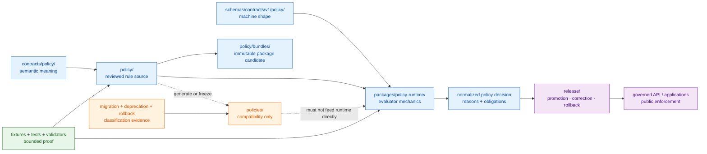

<!-- [KFM_META_BLOCK_V2]
doc_id: kfm://doc/adr-0003-policy-singular-canonical
title: "ADR-0003 — `policy/` (singular) is canonical; `policies/` is compatibility"
type: adr
adr_id: ADR-0003
version: v1.2
status: proposed
owners:
  - "NEEDS VERIFICATION — policy decision owner"
  - "NEEDS VERIFICATION — architecture steward"
reviewers_required:
  - Docs steward
  - Policy steward
  - Security / privacy reviewer
  - Release steward
  - "at least one affected subsystem owner"
created: 2026-05-10
updated: 2026-07-23
policy_label: public
truth_posture: cite-or-abstain
responsibility_root: docs/
current_path: "docs/adr/ADR-0003-policy-singular-is-canonical-(policies-is-compatibility).md"
supersedes: []
superseded_by: null
evidence_snapshot:
  repository: bartytime4life/Kansas-Frontier-Matrix
  base_ref: main
  base_commit: 59938ab542b1ce5980fe2a93b2b806e362643ebd
  target_prior_blob: cef5528d81cf3d67ff77f43a1cfece441a87bfe2
  directory_rules_blob: 2affb080e6f0043867c64c7f06c1ca52030fbd55
  adr_index_blob: cf08fae322ac53426f7394d97897fdb942253049
  adr_0001_blob: 3c520ea8f2f8bcb3d478329a87d98b135ea335fd
  adr_0002_blob: 2da10fcf5836a44d46186c233b6b9664c9ccfda5
  policy_readme_blob: fa9378a6a699d0985fd018dbdb9f27c15efcb1c3
  policy_bundles_readme_blob: 77f59c399fbce668c916cbbc385009121d6169f4
  policy_test_workflow_blob: ba22e40b171b70a5e56fdbb35e44f6664e15487d
  codeowners_blob: dd2a84aa514d8ecd9208bc347f90f9a2ed37dd61
  migrations_readme_blob: 0485947aa72726bdde043a2570c2e28d2714f420
  deprecation_register_blob: 1fb7219dcdb7a437e38fa8ca92ba34e29667d3fa
  policies_root_at_base: absent
related:
  - docs/adr/README.md
  - docs/adr/INDEX.md
  - docs/adr/ADR-0001-schema-home--schemas-contracts-v1-is-canonical.md
  - docs/adr/ADR-0002-contracts-vs-schemas-split.md
  - docs/doctrine/directory-rules.md
  - docs/architecture/contract-schema-policy-split.md
  - policy/README.md
  - policy/bundles/README.md
  - contracts/policy/README.md
  - schemas/contracts/v1/policy/README.md
  - fixtures/contracts/v1/policy/policy_decision/README.md
  - tests/policy/README.md
  - tools/validators/policy/README.md
  - packages/policy-runtime/README.md
  - .github/workflows/policy-test.yml
  - migrations/README.md
  - control_plane/deprecation_register.yaml
  - docs/registers/DRIFT_REGISTER.md
  - docs/registers/VERIFICATION_BACKLOG.md
tags: [kfm, adr, governance, policy, compatibility-root, no-parallel-authority, migration, rollback]
notes:
  - "v1.2 is a same-path repository-grounded modernization; it does not accept the decision or change policy behavior."
  - "ADR-0003 numbering and the tracked filename are confirmed by docs/adr/INDEX.md; the effective decision status remains proposed."
  - "The repository contains a populated singular policy root and no policies/ root at the pinned base. The current policy-test workflow references policy/ exclusively."
  - "Canonical placement does not prove an accepted evaluator, active bundle, policy correctness, release approval, or publication safety."
[/KFM_META_BLOCK_V2] -->

<a id="top"></a>

# ADR-0003 — `policy/` (singular) is canonical; `policies/` is compatibility

> **Proposed decision.** KFM will preserve **`policy/`** as the sole policy-source responsibility root. A future or retained **`policies/`** path may exist only as an explicitly classified compatibility surface and must never evolve as parallel policy authority.

[](#1-status)
[](#11-current-repository-evidence-snapshot)
[](#11-current-repository-evidence-snapshot)
[](#11-current-repository-evidence-snapshot)
[](#13-authority-and-publication-boundary)

> [!IMPORTANT]
> **Repository configuration is not reviewed decision authority.** The pinned repository already uses `policy/`, the current workflow looks only under `policy/`, and the exact `policies/` path is absent. The canonical ADR index still records ADR-0003 as `proposed`. This revision documents the observed boundary without promoting the decision to `accepted`.

> [!CAUTION]
> **Canonical policy placement is not policy-engine maturity.** A populated `policy/` tree, valid `PolicyDecision` fixtures, or a green readiness workflow does not prove that an accepted evaluator ran, that a bundle is active, that rights or sensitivity were cleared, that release was approved, or that anything is safe to publish.

**Quick navigation:** [Status](#1-status) · [Context](#2-context) · [Decision](#3-decision) · [Authority diagram](#4-authority-diagram) · [Scope](#5-scope-of-policy-what-belongs-what-does-not) · [Consequences](#6-consequences) · [Alternatives](#7-alternatives-considered) · [Migration](#8-migration-plan) · [Rollback](#9-rollback-plan) · [Validation](#10-validation) · [Open work](#11-open-questions-and-needs-verification) · [Evidence](#12-related-docs-and-evidence)

---

## 1. Status

| Field | Current value |
|---|---|
| **ADR ID** | `ADR-0003` — unique and confirmed in the canonical [`INDEX.md`](./INDEX.md) |
| **Source metadata** | `proposed` |
| **Effective decision status** | `proposed` — not binding as an accepted ADR until the record and index carry reviewed `accepted` status |
| **Decision class** | Canonical policy-root selection, compatibility-root control, and prohibition on parallel policy authority |
| **Tracked path** | `docs/adr/ADR-0003-policy-singular-is-canonical-(policies-is-compatibility).md` |
| **Current configured root** | [`policy/`](../../policy/) |
| **Current plural-root state** | Exact `policies/` path absent at the pinned snapshot |
| **Current implementation posture** | Nonempty policy source and bounded readiness checks exist; evaluator, active bundle, replay receipts, and release integration remain unproved |
| **Publication effect** | None. This ADR, a policy file, a schema pass, a test pass, a commit, or a pull request is not a release or publication decision. |

### 1.1 Current repository evidence snapshot

The following findings are **CONFIRMED at `main@59938ab542b1ce5980fe2a93b2b806e362643ebd`** unless marked otherwise.

| Surface | Verified state | What it proves—and does not prove |
|---|---|---|
| [`docs/adr/INDEX.md`](./INDEX.md) | ADR-0003 is the unique indexed record for this decision; effective status is `proposed`. | Proves identity and status normalization; does not accept the decision. |
| [`Directory Rules`](../doctrine/directory-rules.md) | Lists singular `policy/` as canonical and `policies/` as compatibility; requires an ADR before creating parallel policy authority. | Proves placement doctrine; does not prove policy-engine execution. |
| [`policy/README.md`](../../policy/README.md) | Repository-grounded root contract names `policy/` as the admissibility responsibility root and reports mixed maturity. | Proves current repository guidance and root presence; does not establish accepted stewardship or release authority. |
| Exact `policies/` contents path | GitHub contents lookup returned `404 Not Found`; `policies/README.md` is also absent. | Proves the exact plural root is absent at this snapshot; it is not a permanent guarantee against future creation. |
| [`policy/bundles/README.md`](../../policy/bundles/README.md) | Bundle lane is documented as README-only and unbound to an accepted evaluator or active selection. | Proves packaging guidance exists; not an active policy bundle. |
| [`policy-test.yml`](../../.github/workflows/policy-test.yml) | Workflow requires singular-root files, asserts nonempty Rego under `policy/`, and deliberately holds because accepted evaluator tests, bundle artifacts, and runtime binding are absent. | Proves command-bearing readiness and drift checks; not policy evaluation or a `PolicyDecision`. |
| [`CODEOWNERS`](../../.github/CODEOWNERS) | Routes `/docs/adr/` and `/policy/` to `@bartytime4life`. | Proves GitHub review routing; not a stewardship assignment, independent approval, or acceptance record. |
| [`deprecation_register.yaml`](../../control_plane/deprecation_register.yaml) | File exists with `entries: []`. | No plural-root compatibility, sunset, or removal record is currently registered. |
| [`migrations/README.md`](../../migrations/README.md) | Migration governance requires a paired rollback or forward-fix record. Its defined lanes are database, schema, data, graph, and rollback. | Proves rollback discipline; the exact home for a future policy-root path migration remains unresolved. |

### 1.2 Decision scope

**In scope**

- The canonical repository root for reviewed policy source.
- The status and permitted behavior of a future or retained `policies/` path.
- Authoring, consumer, CI, migration, deprecation, and rollback rules that prevent parallel policy authority.
- Review and validation evidence required before changing the root relationship.
- Relationship to contracts, schemas, fixtures, tests, validators, runtime evaluation, release, and public clients.

**Out of scope**

- The semantics of any policy rule.
- Selection of OPA, Conftest, Rego version, WASM, or another evaluator.
- Acceptance of a bundle format, bundle registry, signing system, or deployment mechanism.
- The canonical `PolicyDecision` outcome vocabulary or engine-native result normalization.
- Source rights, consent, sensitivity, or release decisions for a specific object.
- Activation of policy runtime, publication, or direct changes to `policy/`, workflows, schemas, tests, or migration artifacts in this documentation-only revision.

### 1.3 Authority and publication boundary

This ADR decides **where policy source belongs** if accepted. It does not decide whether a policy is correct, whether an evaluator is trusted, whether an input is complete, or whether an operation may proceed.

```text
contracts/policy/              -> semantic meaning
schemas/contracts/v1/policy/  -> machine-checkable shape
policy/                        -> reviewed admissibility rule source
packages/policy-runtime/       -> evaluator/runtime mechanics
fixtures/ + tests/             -> representative and executable proof
tools/validators/              -> reusable validation
release/                       -> release, correction, withdrawal, rollback decisions
governed applications          -> public enforcement through bounded interfaces
```

Public clients and normal UI surfaces must not read policy source or choose policy bundles directly. They consume normalized decisions through governed interfaces.

### 1.4 Truth and lifecycle vocabulary

- **CONFIRMED** — verified from the pinned repository evidence named above.
- **PROPOSED** — the decision, future compatibility treatment, or recommended enforcement not yet accepted or implemented.
- **UNKNOWN** — evidence is insufficient for a stronger statement.
- **NEEDS VERIFICATION** — a concrete check is available but not closed.
- **CONFLICTED** — doctrine, implementation, or candidate authority surfaces disagree.

`proposed`, `accepted`, `superseded`, and `rejected` are ADR lifecycle states. They are not truth labels.

[Back to top](#top)

---

## 2. Context

### 2.1 The problem

Policy is a trust-bearing responsibility. It evaluates whether a bounded operation may proceed, must be restricted or held, should abstain, or must fail closed. The decision may depend on source role, evidence state, rights, consent, sensitivity, lifecycle state, review state, release state, actor, audience, purpose, requested precision, and policy version.

Two independently editable policy roots would make that responsibility ambiguous:

- a caller could evaluate a different rule set than CI;
- a release review could cite a digest from one root while runtime loads the other;
- `DENY`, `ABSTAIN`, restriction, or obligation behavior could diverge silently;
- reviewers could not reconstruct which path was authoritative at the time of a decision;
- rollback could restore files without restoring the evaluated policy state.

The risk is not plural spelling by itself. The risk is **parallel authority**.

### 2.2 Current repository reality

The repository has already converged operationally on the singular root:

1. `policy/` exists and contains nonempty Rego source.
2. `policy/README.md` declares the responsibility boundary and explicitly treats ADR-0003 as proposed.
3. `.github/workflows/policy-test.yml` references `policy/` paths and the exact ADR-0003 filename.
4. The exact `policies/` root is absent at the pinned snapshot.
5. The policy lane remains mixed-maturity: no accepted evaluator, native Rego test modules, active bundle, functional runtime, dedicated validator entrypoint, replay receipt flow, or release integration was proved.

That combination creates a narrow governance gap: **the implementation and Directory Rules use the singular root, but the formal ADR remains proposed.**

### 2.3 Forces

| Force | Effect on the decision |
|---|---|
| Directory Rules | Names `policy/` as singular canonical and `policies/` as compatibility. |
| Current repository tree | Contains `policy/`; exact `policies/` path is absent. |
| Current workflow | Uses `policy/` exclusively and treats evaluator readiness as a hold. |
| Audit and replay | Require one policy source, one bundle identity, and one decision lineage. |
| External conventions | Some tools and examples use plural names, creating compatibility pressure. |
| Migration cost | Low today because no plural root is present; potentially higher if plural authority is introduced later. |
| Backward compatibility | May justify a generated export or frozen legacy path, but not independent authorship. |
| Separation of responsibilities | Contracts define meaning, schemas define shape, policy decides admissibility, tests prove bounded behavior, release authorizes publication. |
| Reversibility | Any future root migration needs path mapping, consumer inventory, digests, validation, and rollback/forward-fix evidence. |

> [!WARNING]
> Creating `policies/` later because a third-party example expects it would not be a harmless convenience. Unless it is a declared generated/export/legacy surface with one-way authority from `policy/`, it would create the parallel policy home prohibited by Directory Rules and this proposed decision.

[Back to top](#top)

---

## 3. Decision

If accepted, ADR-0003 makes the following rule binding:

> **KFM MUST keep reviewed policy source under `policy/`. `policies/`, if introduced or retained, MUST be an explicitly classified compatibility surface and MUST NOT be selected, edited, or reviewed as independent policy authority.**

### 3.1 Canonical `policy/` contract

`policy/` owns:

- reviewed declarative policy source and policy-family documentation;
- stable package names, entrypoints, versions, reason-code references, obligations, and supersession notes;
- access, capability, consent, revocation, rights, sensitivity, render, export, governed-AI, lifecycle, promotion, release-gate, correction, withdrawal, and rollback policy source;
- domain-specific policy under a domain segment inside `policy/`;
- policy-native fixtures or tests only where the accepted repository convention assigns them there;
- bundle source inputs and manifests only after a separate reviewed bundle contract accepts them.

`policy/` does not gain authority over semantic contracts, machine schemas, evidence, lifecycle data, runtime code, validation reports, receipts, proofs, review records, release decisions, or public clients.

### 3.2 Compatibility `policies/` contract

A `policies/` path MAY exist only when a concrete compatibility need is documented. Its root README MUST declare exactly one Directory Rules class:

| Class | Permitted purpose | Direct authorship |
|---|---|---|
| `mirror` | Generated copy derived from a pinned `policy/` source and manifest. | Forbidden |
| `legacy` | Frozen historical path retained during migration or for inbound-link compatibility. | Forbidden except bounded corrective maintenance |
| `deprecated` | Scheduled for removal with replacement and sunset evidence. | Forbidden |
| `external-export` | Generated layout required by a downstream tool or consumer. | Forbidden |
| `transitional` | Temporary migration surface governed by an ADR or migration record. | Only the reviewed migration operation |

Every compatibility form must identify:

- canonical source path;
- generation or freeze method;
- source and output digests where applicable;
- consumer inventory;
- review owner or routing;
- expiration, sunset, or explicit long-term rationale;
- correction and rollback path.

### 3.3 Authoring and consumer rules

After acceptance:

1. New policy source MUST land under `policy/`.
2. CI, runtime, release gates, validators, and local tools MUST select policy from `policy/` or from an immutable bundle demonstrably built from it.
3. `policies/` MUST NOT be the default search path, bundle selector, or runtime source.
4. A mirror or export MUST be generated deterministically and parity-checked; it MUST NOT be edited directly.
5. A plural-path dependency MUST be treated as a compatibility consumer and recorded before the path is introduced.
6. PRs touching either root MUST cite ADR-0003 and the relevant Directory Rules sections.
7. No root name, README, workflow, successful check, or bundle-shaped file grants policy approval or publication authority.

### 3.4 Decision boundaries

This ADR intentionally does **not** standardize:

- engine-native results such as `allow`, `restrict`, or `hold`;
- normalized runtime outcomes such as `ANSWER`, `ABSTAIN`, `DENY`, or `ERROR`;
- bundle archive format;
- evaluator implementation;
- policy data-document placement;
- signing or attestation;
- deployment and hot-reload behavior;
- release gate sequence.

Those require their own contracts, schemas, policy/runtime decisions, or ADRs. Placement must not absorb semantics or execution.

[Back to top](#top)

---

## 4. Authority diagram



> [!NOTE]
> The responsibility relationships are repository-grounded or doctrine-grounded. The diagram does not claim that an accepted bundle, evaluator, normalized decision flow, or release integration currently operates end to end.

[Back to top](#top)

---

## 5. Scope of `policy/` (what belongs, what does not)

### 5.1 What belongs

| Material | Boundary |
|---|---|
| Root and child-lane READMEs | Explain policy responsibility, current maturity, inputs, outputs, review, validation, and open verification. |
| Declarative policy source | Rego, OPA-compatible modules, or an accepted equivalent whose primary responsibility is admissibility. |
| Shared policy families | Access, capabilities, consent, revocation, obligations, rights, sensitivity, rendering, export, AI, lifecycle, promotion, release gates, correction, withdrawal, and rollback. |
| Domain policy | `policy/domains/<domain>/` or the reviewed current domain-lane convention; domains remain segments, not roots. |
| Policy-native tests or fixtures | Only where repository guidance assigns them here; generic and cross-cutting fixtures/tests remain under their responsibility roots. |
| Bundle source and manifest inputs | Only after an accepted bundle contract defines immutable composition, selection, replay, supersession, and rollback. |
| Reason-code and obligation references | Stable policy-owned identifiers or links; semantic object meaning remains in contracts. |
| Compatibility-generation definitions | Deterministic rules that produce a declared `policies/` mirror/export, if such a path is reviewed and necessary. |

### 5.2 What does not belong

| Material | Owning responsibility |
|---|---|
| Policy object meaning | [`contracts/policy/`](../../contracts/policy/) |
| Policy JSON Schema and field constraints | [`schemas/contracts/v1/policy/`](../../schemas/contracts/v1/policy/) |
| Generic fixtures and executable test suites | [`fixtures/`](../../fixtures/) and [`tests/`](../../tests/) |
| Reusable validator implementation | [`tools/validators/`](../../tools/validators/) |
| Evaluator, server, package, adapter, or CLI code | `packages/`, `apps/`, `runtime/`, or `tools/` by primary responsibility |
| Source records, credentials, consent tokens, or sensitive payloads | governed source, secret, registry, or lifecycle homes; never policy source |
| EvidenceRefs, EvidenceBundles, citations, or claim truth | evidence and proof authorities |
| RAW through PUBLISHED lifecycle material | `data/<phase>/` |
| Emitted PolicyDecision, receipt, review, validation report, or proof instances | accepted instance, receipt, review, report, or proof homes |
| Release manifests, promotion decisions, correction notices, withdrawals, rollback cards | [`release/`](../../release/) |
| Public API, UI, MapLibre, export, or AI response implementation | governed application/runtime roots |
| A second independently evolving root | Prohibited unless an accepted ADR changes this decision |

> [!CAUTION]
> Policy can evaluate rights, sensitivity, consent, review state, or release state only when governed inputs supply them. Policy source must not invent those facts or clear them by assertion.

[Back to top](#top)

---

## 6. Consequences

### 6.1 Positive consequences

- **Deterministic authority.** Authors, reviewers, CI, bundles, and runtime have one source-root contract.
- **Replayable policy identity.** A decision can bind one policy source, bundle digest, evaluator profile, and input hash.
- **Lower migration risk today.** The plural root is absent, so acceptance can prevent drift before compatibility debt appears.
- **Cleaner review.** New plural-root proposals are visibly compatibility work rather than ordinary policy authoring.
- **Better rollback.** Path topology, bundle selection, and consumer rewrites can be audited separately from policy semantics.
- **Responsibility separation.** Policy placement no longer competes with contracts, schemas, runtime, tests, receipts, proofs, or release records.
- **Fail-closed compatibility.** An undocumented plural path cannot silently become an evaluator input.

### 6.2 Costs and tradeoffs

- External tooling that assumes `policies/` may need configuration or a governed export.
- A future compatibility mirror requires generation, parity validation, consumer inventory, and deprecation discipline.
- Contributors must distinguish policy source from policy contracts, schemas, fixtures, tests, evaluator code, and emitted decisions.
- Acceptance does not close the larger policy-engine readiness backlog; that work remains separately reviewable.
- Directory Rules currently state the root choice while the ADR remains proposed, so acceptance must reconcile the decision record and doctrine references deliberately.

### 6.3 Bounded non-effects

- No policy semantics change in this documentation revision.
- No `.rego` path moves, bundle activation, workflow change, evaluator selection, or runtime integration occurs.
- No schema-home change occurs.
- No public API or UI contract changes.
- No release, correction, rollback, or publication state changes.
- No `policies/` compatibility root is created merely to illustrate this decision.

[Back to top](#top)

---

## 7. Alternatives considered

<details>
<summary><strong>Expand the alternatives and disposition</strong></summary>

| Alternative | Benefit | Cost / risk | Disposition |
|---|---|---|---|
| **A. `policy/` canonical; `policies/` compatibility** | Matches Directory Rules and current repository; one source root; compatibility remains possible. | Requires controls if a plural consumer appears. | **Selected.** |
| **B. `policies/` canonical; `policy/` compatibility** | Matches some external examples. | Conflicts with current repository and Directory Rules; creates a root migration without demonstrated benefit. | Rejected. |
| **C. Both roots are canonical** | Avoids immediate consumer migration. | Breaks deterministic policy identity, audit, replay, review, and rollback. | Rejected. |
| **D. Use `policy/` now but leave plural status undefined** | Minimal wording. | Makes future drift a convention dispute instead of a governed compatibility decision. | Rejected. |
| **E. Put policy source with contracts or schemas** | Co-locates related artifacts. | Collapses meaning, shape, and admissibility into parallel or ambiguous authority. | Rejected. |
| **F. Put policy source in runtime or validator packages** | Co-locates execution. | Lets implementation mechanics own policy authority and complicates independent review. | Rejected. |
| **G. Defer the ADR until an evaluator exists** | Couples placement to runtime maturity. | The root decision is already needed to prevent drift; evaluator selection is a separate decision. | Rejected. |

</details>

[Back to top](#top)

---

## 8. Migration plan

### 8.1 Current disposition

At the pinned snapshot:

- `policy/` exists;
- `policies/` is absent;
- the current policy workflow references the singular root;
- no policy path move is required for this ADR modernization;
- this pull request must not create a compatibility root, migration record, or deprecation entry for a path that does not exist.

The smallest sound current action is to modernize the decision record, preserve `proposed` status, and leave implementation unchanged.

### 8.2 Starting-state matrix for future work

| Future observed state | Governed action |
|---|---|
| Only `policy/` exists | Preserve it; scan consumers and prevent an undocumented plural root. |
| `policies/` is proposed but not yet created | Require a concrete compatibility consumer, class, source-of-truth statement, generation/freeze method, validation, sunset or long-term rationale, and rollback. |
| Both exist and plural is generated | Verify one-way generation from `policy/`, manifest/digest parity, no direct edits, and no runtime selection from plural. |
| Both exist and plural is frozen legacy | Inventory consumers, deny new source changes, record replacement and sunset, then remove after the verification window. |
| Both exist and differ | Freeze both, treat the state as `CONFLICTED`, identify evaluated/runtime authority from evidence, open drift and migration records, and require policy/security/release review. |
| Only `policies/` exists | Do not declare it canonical by convention. Use a reviewed migration to `policy/`, preserve history and digests, update consumers, and keep a bounded compatibility layer only when necessary. |

### 8.3 Required migration record

A future policy-root migration must record at least:

| Field | Required evidence |
|---|---|
| ADR | `ADR-0003` or an accepted successor |
| Base revision | Immutable commit or release identity |
| Current and target paths | Exact path map, including generated/export paths |
| Compatibility class | `mirror`, `legacy`, `deprecated`, `external-export`, or `transitional` |
| Source and output identities | Blob hashes, canonical content digest, bundle digest, and path-sensitive hash effects |
| Consumer inventory | Workflows, packages, applications, scripts, docs, tests, deployment/configuration, external consumers |
| Policy semantics check | Evidence that the move did not silently change rule meaning or package/data lookup |
| Validation | Positive, negative, deny, abstain, obligation, bundle, replay, and path-selection checks as applicable |
| Deprecation | Register entry, owner/routing, replacement, sunset, or accepted long-term rationale |
| Rollback or forward fix | Paired record under `migrations/rollback/` |
| Release impact | Correction, withdrawal, or release update if public behavior or released identities changed |
| Review evidence | Policy, security/privacy, validation, runtime consumer, release, migration, and affected subsystem review |

### 8.4 Migration placement

The current migration root defines database, schema, data, graph, and rollback lanes but no explicit policy-path lane. Therefore:

- the owning root is **CONFIRMED** as `migrations/`;
- a paired rollback/forward-fix record under `migrations/rollback/` is **CONFIRMED** as required by current migration governance;
- the exact sibling lane or filename for a policy-root path migration is **NEEDS VERIFICATION** and must be resolved before creating it;
- this ADR must not invent `migrations/policy/` as repository fact.

[Back to top](#top)

---

## 9. Rollback plan

### 9.1 Decision reversal or supersession

If KFM later chooses another policy-root model:

1. Record the replacement in a successor ADR.
2. Set ADR-0003 to `superseded` only after the successor is accepted.
3. Add reciprocal `supersedes` / `superseded_by` links.
4. Update Directory Rules, ADR index, root READMEs, consumers, workflows, and migration records in a reviewed sequence.
5. Preserve ADR-0003 as decision history.

### 9.2 Future path-migration rollback

If a future `policies/` compatibility or migration change breaks evaluation, bundle identity, CI, runtime consumers, replay, or release gates:

1. Stop policy-source changes and bundle activation.
2. Preserve any new substantive rule work; do not discard it during topology rollback.
3. Restore the last verified policy source and consumer configuration using reviewed commits or a forward fix.
4. Recompute and compare policy, bundle, input, and output digests.
5. Re-run representative allow/restrict/hold/abstain/deny/error and obligation cases according to the accepted contracts.
6. Restore or update deprecation and drift state.
7. Record correction or withdrawal when released behavior was affected.
8. Keep the rollback bounded; do not normalize both roots as permanent authority.

### 9.3 Documentation-revision rollback

This v1.2 modernization is documentation-only. It can be reversed by restoring prior blob `cef5528d81cf3d67ff77f43a1cfece441a87bfe2` or reverting the eventual documentation commit. No policy source, evaluator, fixture, schema, workflow, migration, release object, or public artifact requires rollback.

[Back to top](#top)

---

## 10. Validation

### 10.1 Current enforcement snapshot

| Validation surface | Current evidence | Safe interpretation |
|---|---|---|
| ADR index validator and docs control plane | Canonical index contains ADR-0003 with exact filename and `proposed` effective status. | Identity and status coherence are enforceable; acceptance is still human/governance work. |
| `policy-test / opa-test` | Requires singular-root files, confirms nonempty Rego, and deliberately holds while native tests, accepted evaluator, bundle artifact, and runtime binding are absent. | Useful drift guard; no policy was evaluated. |
| `policy-test / fixture coverage` | Checks bounded `PolicyDecision` schema fixtures through the current shape harness. | Proves selected machine-shape polarity only. |
| `policy/README.md` | Documents a 15-test structural/static/API boundary suite and mixed policy maturity. | Supports selected trust-boundary claims; not policy-engine or release proof. |
| Exact plural-root lookup | `policies/` not found at the pinned base. | No current compatibility migration is required. |
| Deprecation register | Empty. | No compatibility retirement is currently recorded. |
| CODEOWNERS | Routes ADR and policy paths to one verified GitHub account. | Review routing only; independent approval remains unproved. |

### 10.2 Acceptance gates for ADR-0003

ADR-0003 should not move to `accepted` until reviewers can close all applicable gates:

- [ ] **Identity:** record and index agree on ID, tracked path, title, status, and supersession fields.
- [ ] **Root evidence:** `policy/` exists and its README declares the responsibility boundary.
- [ ] **Plural disposition:** `policies/` is absent, or its README, class, canonical source, consumers, validation, and sunset/retention decision are reviewed.
- [ ] **Consumer inventory:** policy source selectors in workflows, packages, applications, tools, configs, scripts, and deployment material are inventoried strongly enough to rule out hidden plural authority.
- [ ] **No parallel authorship:** no reviewed source, generated bundle input, or CI path treats plural as independent authority.
- [ ] **Migration and rollback:** any actual path move has a migration record, paired rollback/forward-fix record, digest handling, and dry-run evidence.
- [ ] **Compatibility/deprecation:** any retained plural path has a populated deprecation/compatibility record or an accepted reason for long-term retention.
- [ ] **Review:** policy, architecture/docs, security/privacy, validation/runtime consumer, release, and affected subsystem review is recorded as applicable.
- [ ] **Status transition:** the ADR and canonical index change to `accepted` together; the index does not promote the record independently.
- [ ] **No publication inference:** the acceptance record states that policy-root selection does not activate a bundle, approve release, or publish data.

> [!NOTE]
> A functional evaluator is not required merely to accept a root-placement decision. Evaluator, bundle, and runtime maturity must remain accurately documented and separately governed.

### 10.3 Proposed guardrails after acceptance

The following are **PROPOSED**, not current repository behavior:

- reject creation of `policies/` without an allowlisted compatibility record;
- reject directly authored policy source under `policies/`;
- verify generated mirror/export parity against canonical source identity;
- verify runtime and CI selectors cannot choose plural authority;
- require a migration/rollback pair when plural-path consumers are added or removed;
- report stale inbound plural references without silently rewriting unrelated documentation.

[Back to top](#top)

---

## 11. Open questions and NEEDS VERIFICATION

| ID | Item | Current evidence | Required closure |
|---|---|---|---|
| `ADR3-V01` | Human acceptance and decision owner | Record is proposed; CODEOWNERS has one executable route, not an accepted stewardship assignment. | Record required review and update ADR/index together. |
| `ADR3-V02` | Directory Rules / ADR status reconciliation | Directory Rules already label `policy/` canonical while ADR-0003 remains proposed. | Decide whether acceptance ratifies existing doctrine or whether doctrine wording needs status qualification. |
| `ADR3-V03` | Complete plural-reference inventory | Bounded code search and exact path lookup show no plural root; complete recursive consumer inventory was not captured in this ADR update. | Run a pinned recursive inventory across source, docs, workflows, configs, examples, and deployment material. |
| `ADR3-V04` | Compatibility admission policy | No plural root currently exists. | Decide whether future plural creation requires an allowlist/register entry in addition to ADR-0003. |
| `ADR3-V05` | Policy-path migration record home | `migrations/` has no explicit policy lane. | Select a noncompeting lane or amend migration governance before creating a policy migration record. |
| `ADR3-V06` | Deprecation register | Register exists but is empty. | Populate it only if a plural compatibility path is introduced, retained, or retired. |
| `ADR3-V07` | Evaluator and bundle maturity | Current workflow intentionally holds; bundle lane is README-only. | Resolve through separate policy-runtime, bundle, test, and replay work; do not block honest placement documentation. |
| `ADR3-V08` | Policy result vocabularies | Repository docs describe engine-native and canonical outcome vocabularies. | Resolve normalization in contracts/schemas/runtime governance, not in this placement ADR. |
| `ADR3-V09` | Required checks and independent review | Workflow definitions and CODEOWNERS are present; branch rules and separation of duties are unverified. | Inspect repository rulesets and record applicable review evidence. |
| `ADR3-V10` | Current PR workflow results | Workflow definitions are verified; run results are revision-specific. | Record the required check outcomes for the PR head before review/merge. |
| `ADR3-V11` | Broken or stale inbound links | Older documents may still reference shortened ADR filenames or plural-root examples. | Inventory and repair in a scoped follow-up; do not broaden this one-file change. |

[Back to top](#top)

---

## 12. Related docs and evidence

| Document or surface | Relationship | Snapshot status |
|---|---|---|
| [`docs/adr/README.md`](./README.md) | ADR lifecycle, numbering, review, and validation contract | Repository-grounded |
| [`docs/adr/INDEX.md`](./INDEX.md) | Canonical human ADR inventory; records ADR-0003 as proposed | Repository-grounded |
| [`ADR-0001`](./ADR-0001-schema-home--schemas-contracts-v1-is-canonical.md) | Companion schema-home decision | Present; proposed |
| [`ADR-0002`](./ADR-0002-contracts-vs-schemas-split.md) | Companion responsibility-split decision | Present; proposed |
| [`Directory Rules`](../doctrine/directory-rules.md) | Placement doctrine and compatibility-root classes | Present; draft doctrine |
| [`Contract / Schema / Policy / Test Split`](../architecture/contract-schema-policy-split.md) | Human explanation of meaning, shape, admissibility, and proof separation | Present; draft |
| [`policy/README.md`](../../policy/README.md) | Current singular-root authority and mixed-maturity snapshot | Present; repository-grounded draft |
| [`policy/bundles/README.md`](../../policy/bundles/README.md) | Bundle packaging boundary and readiness gaps | Present; draft |
| `policies/` | Proposed compatibility root only if a concrete need is admitted | Absent at snapshot |
| [`contracts/policy/README.md`](../../contracts/policy/README.md) | Policy object semantics | Present |
| [`schemas/contracts/v1/policy/README.md`](../../schemas/contracts/v1/policy/README.md) | Policy machine-shape family | Present |
| [`policy-test.yml`](../../.github/workflows/policy-test.yml) | Current command-bearing policy readiness holds | Present; run result per revision |
| [`migrations/README.md`](../../migrations/README.md) | Migration and paired rollback governance | Present; exact policy lane unresolved |
| [`deprecation_register.yaml`](../../control_plane/deprecation_register.yaml) | Compatibility retirement register | Present; empty |
| [`DRIFT_REGISTER.md`](../registers/DRIFT_REGISTER.md) | Human drift record | Present; no current plural-root path conflict recorded |
| [`VERIFICATION_BACKLOG.md`](../registers/VERIFICATION_BACKLOG.md) | Human verification queue | Present; this ADR retains explicit open items |

[Back to top](#top)

---

## Appendix A — Proposed `policy/` subtree

The prior revision included a speculative full tree. The repository now has a substantial policy root, so this appendix is replaced by a responsibility routing reference. It is not an exhaustive recursive inventory.

| Policy responsibility | Current or proposed route | Boundary |
|---|---|---|
| Root contract | `policy/README.md` | Canonical admissibility-root guidance |
| Shared rule families | Reviewed sublanes under `policy/` | Exact names follow current repository evidence and accepted policy contracts |
| Domain-specific policy | `policy/domains/<domain>/` or reviewed existing domain convention | Domain remains a segment, not a root |
| Bundle packaging | `policy/bundles/` | README-only today; immutable bundle contract remains proposed |
| Policy object semantics | `contracts/policy/` | Not executable rule source |
| Policy machine shape | `schemas/contracts/v1/policy/` | Not policy authority |
| Policy fixtures and tests | `policy/fixtures/`, `policy/tests/`, root `fixtures/`, and `tests/` according to accepted responsibility split | Avoid duplicate fixture/test authority |
| Reusable policy validators | `tools/validators/policy/` | Current lane is documentation/stub maturity |
| Evaluator/runtime | `packages/policy-runtime/` or accepted implementation boundary | Current package remains placeholder maturity |
| Emitted decisions and receipts | Governed instance/receipt homes | Never stored as canonical rule source |
| Release and rollback decisions | `release/` | Policy is an input to release, not release authority |
| Compatibility mirror/export | `policies/` only after reviewed admission | Generated/frozen; no independent evolution |

[Back to top](#top)

---

## Appendix B — Reviewer checklist

- [ ] The target remains the tracked ADR-0003 path; no sibling or renamed substitute was created.
- [ ] ADR ID, H1, index row, metadata, and decision status agree.
- [ ] The document distinguishes current repository configuration from accepted ADR authority.
- [ ] `policy/` is described as rule-source/admissibility authority, not semantic truth, schema authority, evidence, release, or publication authority.
- [ ] Any statement about `policies/` is bounded to absence at the pinned snapshot or an explicitly reviewed compatibility class.
- [ ] No future `policies/` path is admitted without a concrete consumer, one-way authority, validation, deprecation/retention rationale, and rollback.
- [ ] Current `policy-test` checks are not misrepresented as policy evaluation.
- [ ] Evaluator, bundle, runtime, receipt, and release gaps remain visible.
- [ ] No invented owner, approval, policy result, package version, command success, or release state was introduced.
- [ ] Migration placement remains `NEEDS VERIFICATION` rather than inventing `migrations/policy/`.
- [ ] Relative links and internal anchors resolve.
- [ ] Documentation rollback identifies prior blob `cef5528d81cf3d67ff77f43a1cfece441a87bfe2`.
- [ ] Any future acceptance updates this ADR and `INDEX.md` together with review evidence.

[Back to top](#top)

---

## Appendix C — Compatibility-root admission record

Use this record before introducing `policies/`. It is a review aid, not a new registry authority.

| Field | Required value |
|---|---|
| Requested path | `policies/` or exact child path |
| Compatibility class | `mirror`, `legacy`, `deprecated`, `external-export`, or `transitional` |
| Concrete consumer | Exact tool, package, deployment, or external consumer |
| Canonical source | Exact `policy/` path or immutable bundle identity |
| Why configuration is insufficient | Evidence that the consumer cannot use the canonical path directly |
| Generation or freeze method | Deterministic command/spec or frozen-history statement |
| Source and output hashes | Required where content is copied or generated |
| Direct-edit control | Validator, CODEOWNERS/review rule, or equivalent guard |
| Runtime selection rule | Proof that governed runtime cannot select plural as independent authority |
| Validation | Parity, bundle, consumer, negative-path, and rollback checks |
| Deprecation/retention | Sunset date or accepted long-term rationale |
| Migration record | Exact reviewed record under the current `migrations/` contract |
| Rollback/forward fix | Paired `migrations/rollback/` record |
| Review | Policy, security/privacy, validation, runtime consumer, release, migration, and affected owner review |
| Publication effect | Explicitly none unless separate release evidence exists |

[Back to top](#top)

---

## Change Log

| Version | Date | Change |
|---|---|---|
| `v1.2` | 2026-07-23 | Same-path repository-grounded modernization. Confirmed ADR identity and path, replaced repo-unavailable assumptions with current evidence, recorded singular-root implementation and absent plural root, separated root placement from evaluator maturity, corrected migration guidance, strengthened acceptance and compatibility controls, consolidated related evidence, and preserved the proposed decision. |
| `v1.1` | 2026-05-15 | Preserved the decision while tightening evidence boundaries, validation gates, README guidance, migration, and rollback discipline. |
| `v1` | 2026-05-10 | Initial proposal selecting singular `policy/` and classifying `policies/` as compatibility. |

---

**Last updated:** 2026-07-23 · **Decision status:** `proposed` · **Path:** `docs/adr/ADR-0003-policy-singular-is-canonical-(policies-is-compatibility).md` · [Back to top](#top)
